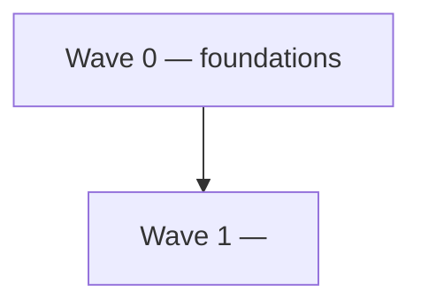
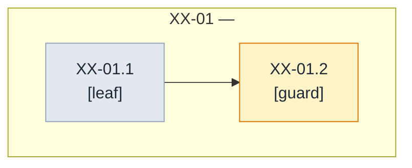

# <Project> <scope> — milestones and task graph

> **Status**: 0 of N milestones complete. **First SDD to start**: XX-01.
> **Entry gate**: <what must freeze upstream, or "none — from-zero plan">.
> **References**: <PRD path> · <architecture doc> · <ADRs executed> · <the project's DAG-convention ADR>.
> **Date**: YYYY-MM-DD.
> **Append-only rule**: once the first milestone merges, ids are never renumbered; new work
> appends the next free number; amendments are dated blockquotes with struck-through text.

> [!IMPORTANT]
> **Authoring constraint.** This document states behaviors as Gherkin scenarios and what evidence
> closes each node. It never states type names, field names, or signatures — each milestone's SDD
> cycle owns those. It is implementation-language-agnostic: tool bindings live only in
> [Method](#method--sdd-milestone-rules).

## Outcome first

<One paragraph: what exists, observably, when the last wave's exit condition holds.>

## Quick navigation

| Section | What it settles |
| --- | --- |
| [Sources and research](#sources-and-research) | SOTA digest + inconsistency register |
| [Scope boundary](#scope-boundary) | Owns / must not own / wording traps |
| [Method](#method--sdd-milestone-rules) | Node grammar citation, evidence gate, TDD cycle |
| [Global dependency graph](#global-dependency-graph) | Wave-level DAG + delivery sequence |
| [Waves](#wave-0--foundations) | The milestones |
| [Traceability spine](#traceability-spine) | Requirement → node, two-way |

## Sources and research

**Requirements inventory** (Phase 0): each PRD claim with a stable handle (R-01, R-02, …).

| Id | Requirement (cited) |
| --- | --- |
| R-01 | <claim> (<PRD § anchor>) |

**Research digest** (Phase 1): SOTA findings with citations; state what each changed in this plan.

| Finding | Source | What it changed here |
| --- | --- | --- |
| <takeaway> | <link> | <plan impact, or "confirmed the PRD's approach"> |

**Inconsistency register** (Phase 2): every conflict, both sides cited, disposition
(*reconciled: how* / *flagged to user*). An empty register is recorded, not omitted.

## Scope boundary

- **Owns:** <prose list of behaviors this plan implements>.
- **Must not own:** <adjacent behavior> — owner: <who>.
- **Wording traps:** "<misreadable phrase>" means <the precise reading>.

## Method — SDD milestone rules

This document inherits the node grammar, leaf anatomy, split triggers, and living-graph clause
from <the project's founding method document> § method (cite, don't restate). Bindings for this project:

- **Evidence gate:** one command closes a leaf: `<command>` (bind the language/toolchain here,
  e.g. the test runner with the race detector). Per-node exceptions are named on the node.
- **TDD cycle per scenario:** RED (transcribed from the scenario) → implementation → GREEN →
  refactor (performance, clean code, idioms of the implementation language) → review.
- **SDD:** each milestone is one SDD change under its declared slug; leaves become its tasks.

## Entry gate

<Mandatory when anything upstream must freeze first: the named, frozen promises this plan waits
for, each cited into the upstream document. Otherwise: "None — from-zero plan.">

## Global dependency graph



### Delivery sequence

| Wave | Milestones | Gate | Exit condition (the wave's value) |
| --- | --- | --- | --- |
| 0 | XX-01 | none | <observable foundational value> |
| 1 | XX-02 … | Wave 0 complete | <observable MVI> |

## Wave 0 — Foundations

<Why this wave is foundational — its value is that everything after it is cheap and safe.>



### XX-01 — <Imperative title>

SDD change: `<project>-<topic>` · Closes: R-01.

**Charter**

- **Goal:** <one sentence>.
- **Deliverable:** <the artifact>.
- **Acceptance:** Given <context>, When <the wave's exit action>, Then <observable outcome>.
- **Depends on:** nothing (first milestone). **Blocks:** <downstream milestone ids>.
- **Out of scope:** <item> — owned by <node id>.
- **Notes:** <implementer trip points>.

#### XX-01.1 — <behavior, imperative> `[leaf]`

- **Scenarios:**

```gherkin
Scenario: walking skeleton — the thinnest end-to-end path
  Given <the minimal starting context>
  When <the single action under test>
  Then <the observable outcome a test asserts>
```

- **Depends on:** nothing.
- **Out of scope:** <what keeps this exclusive of siblings>.
- **Split if:** <pre-declared fission trigger, where foreseeable>.

#### XX-01.2 — <the guard, imperative> `[guard]`

- **Bite proof:**

```gherkin
Scenario: the guard bites
  Given a scratch violation of <the invariant>
  When the check runs
  Then it fails naming the violation
```

- **Depends on:** XX-01.1

## Completion checklist

- [ ] <observable outcome> — closed by XX-NN.p

## Explicitly deferred

| Capability | Seam where it attaches later | Decided by |
| --- | --- | --- |
| <deferred item> | <named seam> | <who> |

## Traceability spine

| Source | Closed by |
| --- | --- |
| R-01 | XX-01 |

| Node | Purpose (traces back to) |
| --- | --- |
| XX-01.1 | R-01 |
