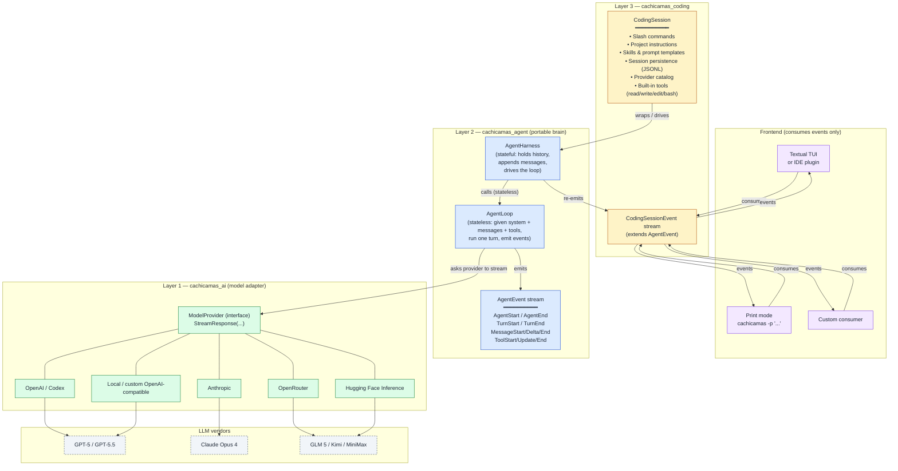
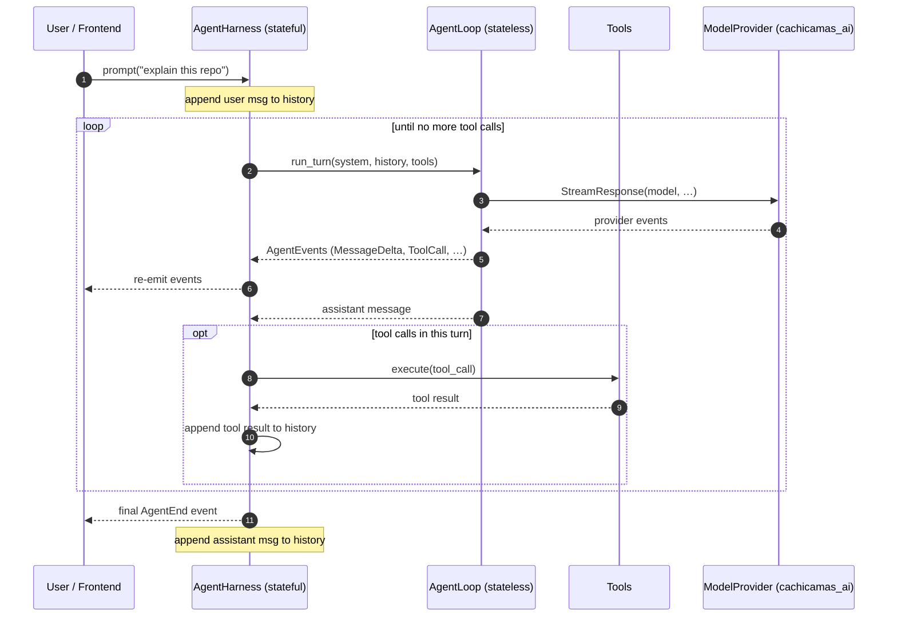

# ADR 0004: Adopt 3-Layer Agentic Architecture

> Status: **Accepted** (2026-07-17, change `cachicamas-agentic-architecture-adr`)
> Author: cachicamas SDD pipeline (parent orchestrator)
> Source narrative: [spike](./references/0004-spike-3-layer-architecture.md)
> Origin: architecture demonstrated by Alejandro AO in his *How to Build a Coding Agent | 3-Layer Architecture* talk; cachicamas adopts the architecture, not the name. See [References](#references).

---

## Resolved TOC (jump links)

- [Decision](#decision) — the three-layer map
- [Layer → location mapping](#layer--location-mapping) — where each component lands
- [Dependency rule](#dependency-rule) — what each layer may / may not import
- [Consequences](#consequences) — positive, negative, neutral

## Full TOC

- [Context](#context)
- [Decision drivers](#decision-drivers)
- [Decision](#decision)
  - [Three-layer architecture (flowchart)](#three-layer-architecture-flowchart)
  - [Loop vs. harness (sequence)](#loop-vs-harness-sequence)
  - [Layer → location mapping](#layer--location-mapping)
  - [Dependency rule](#dependency-rule)
- [Consequences](#consequences)
  - [Positive](#positive)
  - [Negative / risk](#negative--risk)
  - [Neutral](#neutral)

---

## Context

The cachicamas codebase currently has no coherent agentic architecture. When a
developer — human or AI — needs to interact with the repository programmatically
(e.g., reading files, running commands, applying edits, navigating project
instructions), there is no shared contract for how that interaction happens.
Each tooling integration reinvents its own loop, its own tool-calling protocol,
and its own session/persistence model.

The spike ([0004-spike-3-layer-architecture](./references/0004-spike-3-layer-architecture.md))
documents the 3-layer architecture demonstrated by Alejandro AO in his talk —
originally built as the Python project *Tau* (see [References](#references)).
cachicamas adopts the architecture, not the project name. The core thesis:
**separate the agent into three layers** with a strict one-way dependency rule:

```
cachicamas_coding  →  cachicamas_agent  →  cachicamas_ai
```

- `cachicamas_ai` translates vendor APIs into a provider-neutral event stream.
- `cachicamas_agent` is the portable brain: a stateless `AgentLoop` and a
  stateful `AgentHarness` that holds history.
- `cachicamas_coding` is the application: CLI, TUI, built-in tools, skills,
  sessions, slash commands, project instructions.

The one rule that makes everything else clean: **the brain
(`cachicamas_agent`) must never import from the application
(`cachicamas_coding`)**. Frontends consume events; they never drive the loop.

---

## Decision drivers

- **Composable toolchain**: cachicamas has multiple Go packages (`cmd`,
  `application`, `domain`, `infrastructure`, `interfaces/http`, `migration`,
  `otel`, `tools`) that will eventually need programmatic agentic access
  (e.g., scaffolding new packages, running migrations, emitting OTel config).
  A shared agent architecture lets any package consume the same event stream
  without duplicating the loop.
- **Testability**: the agent loop in this architecture is stateless —
  `run_turn(...)` can be called directly from a test with a mock provider. A
  Go port of the `AgentLoop` pattern enables unit-testing the brain without
  any I/O.
- **Provider portability**: switching from one LLM vendor to another (OpenAI,
  Anthropic, OpenRouter, local) requires a one-line config change in the AI
  layer, not a code change in every tool.
- **Frontend independence**: a Textual TUI, a print-mode CLI, and an IDE
  plugin can all consume the same event stream without the brain knowing which
  one is running.
- **Transparency**: the TUI sidebar shown in Alejandro's demo surfaces
  *exactly* what is sent to the LLM (provider, model, tools, skills, context
  files). A cachicamas agent TUI built on the same principle gives developers
  honest observability into what the agent is doing.

---

## Decision

### Three-layer architecture (flowchart)



### Loop vs. harness (sequence)



### Layer → location mapping

| Component | Cachicamas location | Notes |
| --- | --- | --- |
| `cachicamas_coding` (Layer 3 — application) | `backend/database_administrator/src/tools/agent/coding/` | New Go package; holds `CodingSession`, slash commands, skills loader |
| `cachicamas_agent` (Layer 2 — portable brain) | `backend/database_administrator/src/tools/agent/agent/` | `AgentLoop` + `AgentHarness`; no knowledge of `interfaces/http`, `migration`, etc. |
| `cachicamas_ai` (Layer 1 — model adapter) | `backend/database_administrator/src/tools/agent/ai/` | `ModelProvider` interface + concrete implementations per vendor |
| `CodingSession` | `tools/agent/coding/coding_session.go` | Wraps `AgentHarness`; owns session persistence (JSONL) |
| `AgentLoop` | `tools/agent/agent/loop.go` | Stateless; `RunTurn(ctx, system, history, tools) (AgentEventStream, error)` |
| `AgentHarness` | `tools/agent/agent/harness.go` | Stateful; holds history, calls loop, streams events |
| Built-in tools (`read`, `write`, `edit`, `bash`) | `tools/agent/coding/tools.go` | Typed functions + JSON schema; injected into harness |
| Skills (markdown + YAML frontmatter) | `.cachicamas/skills/` + `~/.cachicamas/skills/` | Loaded into context at session start |
| Project instructions (`AGENTS.md`, etc.) | `AGENTS.md`, `.cachicamas/`, `.agents/` | Read by `CodingSession`; merged into system prompt |
| Provider config (`catalog.toml`) | `tools/agent/coding/catalog.toml` | Providers + models; new provider = config entry only |
| Slash commands | `tools/agent/coding/slash.go` | Never hit the LLM; session controls only (`/session`, `/compact`, `/resume`, …) |
| Session persistence | `~/.cachicamas/sessions/<id>.jsonl` | Append-only JSONL; `parent_id` chains for branching |
| Frontends (TUI, print, custom) | `tools/agent/coding/tui/` + `tools/agent/coding/print.go` | Both consume `CodingSessionEvent`; the brain never reaches up |

### Dependency rule

| Layer | May import from | May NOT import from |
| --- | --- | --- |
| `cachicamas_ai` | stdlib + vendor SDKs | anything in `cachicamas_agent` or `cachicamas_coding` |
| `cachicamas_agent` | `cachicamas_ai` | `interfaces/http`, `migration`, `application`, `domain`, `infrastructure`, `cmd`, `otel`, tools outside `tools/agent` |
| `cachicamas_coding` | `cachicamas_agent`, `cachicamas_ai` | — (top of the stack) |

The `tools/agent/{ai,agent,coding}/` packages are the only place allowed to hold
the agent's model-adapter (`cachicamas_ai`) and brain (`cachicamas_agent`)
components. The rest of `database_administrator/src/` (`cmd/`, `application/`,
`domain/`, `infrastructure/`, `interfaces/http/`, `migration/`, `otel/`) must
not import from `tools/agent/` — they may only *consume* events emitted by a
running session.

---

## Consequences

### Positive

- **Single brain for the whole repo**: any package (`cmd/`, `migration/`, `application/`) can drive an agent session without reimplementing the loop. The `AgentHarness` is shared infrastructure.
- **Stateless brain = trivial to unit-test**: `RunTurn(...)` in `loop.go` takes a `ModelProvider` interface; pass a mock or a deterministic test provider and assert on the `AgentEventStream`.
- **Provider swap is a config change**: adding Claude, OpenRouter, or a local model means adding one entry to `catalog.toml` and one `ModelProvider` implementation — no change to `loop.go` or `harness.go`.
- **Frontend independence**: a future IDE plugin, a VS Code extension, and the TUI all consume the same `CodingSessionEvent` stream. The brain does not know or care which is running.
- **Honest TUI sidebar**: the sidebar can enumerate exactly what the LLM receives (provider, model, tools, skills, context files) because that information lives in `CodingSession` and is the source of truth.
- **Skills are portable**: skills are markdown files with YAML frontmatter. A
  skill written for cachicamas can be used by any other agent that follows the
  same skill format (the open standard popularized by Claude Code, Codex,
  Cursor, etc.).

### Negative / risk

- **New `tools/agent/` package**: introduces a Go package with async patterns (`AsyncIterator`-style event streaming via Go channels) that the rest of the backend does not yet use. The learning curve for contributors who have not worked with streaming event architectures.
- **Go channel event streams vs. async iterators**: the reference implementation
  in Alejandro's talk uses Python `async for` over an async iterator. The Go
  port will use channels (`<-chan AgentEvent`) which are idiomatic but require
  careful buffering for streaming text deltas. The design must specify channel
  buffer sizes before implementation.
- **Skills format lock-in**: the markdown+YAML frontmatter skill format is an open standard popularized by Claude Code (October 2025) but not yet ratified by an RFC. If the format shifts, skills may need migration.
- **Session format (`parent_id` tree in JSONL)**: the append-only JSONL session
  format with branching via `parent_id` chains is a convention inherited from
  the reference implementation (and from Pi). If a future agent tool (e.g.,
  an IDE plugin) needs a different session format, the `CodingSession`
  persistence layer must be adapted.

### Neutral

- The architecture does not prescribe a specific LLM vendor. The first implementation may pick one provider (e.g., OpenAI) to get a working loop, but the design supports any `ModelProvider` implementation.
- The TUI is not required for the architecture to function. Print mode
  (`cachicamas -p "..."`) is the minimum frontend; the TUI is additive.
- The reference implementation uses Python ≥ 3.12 (async iterators, `textual`
  for the TUI, `pydantic` for typed events). Cachicamas uses Go; the
  event-streaming primitives are different but the architectural relationships
  between layers are identical.

---

## References

- [0004-spike-3-layer-architecture](./references/0004-spike-3-layer-architecture.md)
  — verbatim narrative from Alejandro AO's talk; source of truth for the
  architecture (uses the original `tau_*` package names; cachicamas adopts the
  architecture, not the name)
- [Tau](https://github.com/huggingface/tau) — the original Python reference
  implementation (built by Alejandro AO as a port of Pi)
- [Pi](https://pi.dev/) — the design that inspired Tau (and therefore this ADR)
- [Alejandro AO — *How to Build a Coding Agent | 3-Layer Architecture* (YouTube)](https://www.youtube.com/watch?v=5duo9qHw660)
- cachicamas backend source: `backend/database_administrator/src/` (cmd, application, domain, infrastructure, interfaces/http, migration, otel, tools)
