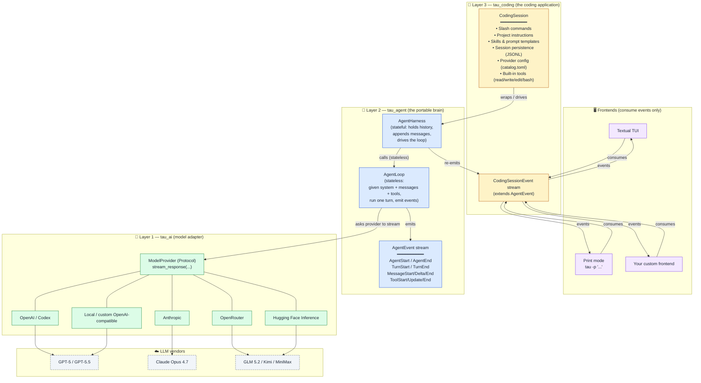
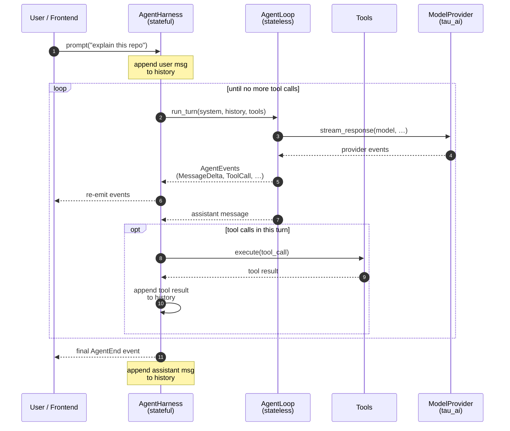

# How to Build a Coding Agent — 3-Layer Architecture

> **Motivates**: ADR 0004 (`docs/adr/0004-adopt-tau-3-layer-agentic-architecture.md`)
> **Date**: 2026-07-17
> **Source**: orchestrator chat (worker session)
> **Reference**: [ADR 0004](../0004-adopt-tau-3-layer-agentic-architecture.md)
>
> **Note on naming**: this file is a verbatim copy of a public narrative about the **Tau** project (built by Alejandro AO as a port of Pi). Throughout this document the three layers are called `tau_ai`, `tau_agent`, and `tau_coding`, and the CLI command is `tau`. **cachicamas adopts the architecture, not the name.** In ADR 0004 and in all future cachicamas code these become `cachicamas_ai`, `cachicamas_agent`, `cachicamas_coding`, and the CLI command is `cachicamas`. The diagram, dependency rule, and loop/harness split are unchanged — only the names move.

---

> A study guide based on Alejandro AO's talk **"How to Build a Coding Agent | 3-Layer Architecture"** ([YouTube](https://www.youtube.com/watch?v=5duo9qHw660)), in which he walks through **Tau**, his minimalist, educational coding agent inspired by [Pi](https://pi.dev/).

## About this document

- **Source video:** [https://www.youtube.com/watch?v=5duo9qHw660](https://www.youtube.com/watch?v=5duo9qHw660)
- **Author:** [Alejandro AO](https://alejandro-ao.com/) — AI Education / Developer Advocate, formerly independent, now at Hugging Face
- **Project walked through:** [Tau](https://github.com/huggingface/tau) — a small, readable, Python port of Pi's coding-agent design
- **Audience:** platform/infra engineers who want to understand how a modern coding agent is structured end to end, with the goal of building their own

### How this guide was reconstructed

The YouTube auto-captions API returned an empty body to the fetch tool, so a word-for-word transcript could not be retrieved. The guide is a faithful reconstruction built from the video's own description, partial Spanish captions, Alejandro's LinkedIn post summarizing the same 3-layer idea, and the actual Tau README + architecture docs.

If you need a strict word-for-word transcript, re-watch the video. If you want a faithful map of *what* Alejandro is teaching and *why*, keep reading.

---

## TL;DR

> The single most important idea in the talk: **separate your coding agent into three layers**:
>
> 1. **AI layer** — talk to LLM providers (`tau_ai`)
> 2. **Agent layer** — the reusable "brain": the agent loop and the agent harness (`tau_agent`)
> 3. **Application layer** — the actual coding agent: TUI, tools, sessions, skills, prompts, context (`tau_coding`)
>
> Dependencies flow one way: `tau_coding → tau_agent → tau_ai`. The reusable brain knows nothing about terminals, file paths, or rendering. That single rule is what makes the rest of the design clean.

---

## 1. What Alejandro builds first (the working agent you can run)

Before getting into the architecture, the video shows a live TUI of Tau so you can see what the end product looks like. The sidebar makes the design *intentionally transparent* — it surfaces **everything** that will be sent to the LLM:

- **Session info** — provider, model, thinking mode
- **Tools** — `read`, `write`, `edit`, `bash`
- **Skills** — installed skill files
- **Custom prompts** — user prompt templates
- **Context files** — which `AGENTS.md`, `.tau/`, and `.agents/` resources are loaded

> "It is made to be completely transparent, and this is literally all the information that you need to know what is actually going into your LLM."

That transparency goal is the design compass for the whole rest of the architecture: each of the three layers has a clean, observable contract so the user (or another developer) can always reason about what the agent is going to do.

Install / run:

```bash
uv tool install tau-ai
tau
tau -p "summarize the architecture"
```

Requires Python ≥ 3.12.

---

## 2. The 3-layer architecture (the heart of the talk)

Alejandro's thesis:

> "What I did — and what I think you should do as well when building coding agents and agents in general — is separate your agent into three different layers."

In Tau the three layers are three Python packages living under `src/`:

```
tau_coding  →  tau_agent  →  tau_ai
```

The arrows are **imports**. The reverse is forbidden: `tau_ai` must never know that `tau_agent` exists, and `tau_agent` must never know that `tau_coding` exists.

### 2.0 The architecture at a glance



**How to read this diagram:**

- Each coloured box is one layer. Arrows go one direction only — `tau_coding → tau_agent → tau_ai`. Frontends consume events *down* from `CodingSession`; the brain never reaches *up* to render anything.
- The event stream is the only contract between layers.
- A new provider is a one-line config change in `tau_ai`, never a code change in the brain. A new frontend is a new consumer of `CodingSessionEvent`, never a code change in the brain.

### 2.1 Layer 1 — `tau_ai` (the model adapter)

**Job:** own provider-specific model streaming. Translate each provider's API (OpenAI, Anthropic, OpenAI Codex subscription, OpenRouter, Hugging Face Inference, custom OpenAI-compatible endpoints…) into a **provider-neutral event stream**.

**Why it's its own layer:** the agent above should not have to know whether the model is GPT-5, Claude, GLM 5.2, or a local Llama.

**The contract this layer produces:**

```python
class ModelProvider(Protocol):
    def stream_response(
        self,
        *,
        model: str,
        system: str,
        messages: list[Message],
        tools: list[Tool],
        signal: AbortSignal | None = None,
    ) -> AsyncIterator[ProviderEvent]: ...
```

What it does NOT do: it doesn't know what a tool is, what a session is, or what the user is doing.

### 2.2 Layer 2 — `tau_agent` (the portable brain)

The loop:

1. Take the current system prompt, transcript, tools, and model selection as input.
2. Ask the provider to stream a response.
3. Emit events as text and tool calls arrive.
4. Collect the assistant message.
5. Execute any requested tools.
6. Append the tool results to the transcript.
7. Repeat until the assistant produces no more tool calls.

The loop is **stateless** — it has no idea who the user is, what session is active, or how the events will be rendered.

#### Loop vs. harness — focused view



- The **harness** owns the *what*: history, session, user-facing event stream.
- The **loop** owns the *when*: given current state, run one turn and emit events.
- The **loop never knows the harness exists.** You can call `run_turn(...)` directly from a test.
- The **harness never dictates the loop's logic.** Different termination rule ⇒ different harness, not different loop.

#### The agent harness — stateful

> "The agent harness is stateful. It handles the session history and appends the user message to it. It calls the agent loop and appends the result to the history. This is the one that the user interacts with."

- **Loop** = *when* to act. "Given messages, system prompt, and tools, run one assistant turn and return the LLM response."
- **Harness** = *what* to do. "Hold the session history, append the user's message, call the loop, append the result, stream events out."

#### The events contract

| Event | Meaning |
| --- | --- |
| `AgentStartEvent` / `AgentEndEvent` | A full run begins / ends |
| `TurnStartEvent` / `TurnEndEvent` | One assistant response and its tool results |
| `MessageStartEvent` / `MessageUpdateEvent` / `MessageEndEvent` | Lifecycle of one message |
| `ToolExecutionStartEvent` / `ToolExecutionUpdateEvent` / `ToolExecutionEndEvent` | A tool runs (and may stream partial output) |

Streaming detail is nested under `MessageUpdateEvent.assistant_message_event` — text deltas, thinking deltas, tool-call start/delta/end.

The events are **provider-neutral**. Frontends never see raw OpenAI / Anthropic chunks.

### 2.3 Layer 3 — `tau_coding` (the coding application)

This is the part that actually makes Tau a *coding agent you run*. It owns:

- The CLI (`tau` command, `tau -p "..."` print mode)
- The Textual TUI
- Built-in tools — `read`, `write`, `edit`, `bash`
- The system prompt
- Project instructions — reads `AGENTS.md`, `.tau/`, and `.agents/`
- Skills — user-installed skill files (markdown with YAML frontmatter; the open format popularized by Claude Code, Codex, Cursor)
- Prompt templates
- Sessions on disk — append-only JSONL under `~/.tau/sessions/`, with resume and branching
- Provider configuration — `catalog.toml`
- Slash commands — `/login`, `/model`, `/session`, `/compact`, `/resume`, `/tree`, `/hotkeys`

`tau_coding` wraps the `tau_agent` `AgentHarness` with a `CodingSession`. One-liner from the README:

```
AgentHarness = reusable brain
CodingSession = coding-agent environment
TUI = one possible frontend
```

---

## 3. The dependency rule, restated

| Layer | May import from | May NOT import from |
| --- | --- | --- |
| `tau_ai` | stdlib + provider SDKs | anything in `tau_agent` or `tau_coding` |
| `tau_agent` | `tau_ai` | CLI, Rich, Textual, `tau_coding`, local config paths, slash commands |
| `tau_coding` | `tau_agent`, `tau_ai` | — (it's the top) |

The portable `tau_agent` package must not import CLI code, Rich, Textual, or resource-loading code.

---

## 4. Why the boundary matters (the payoff)

1. **You can read any layer alone.** Each package has one job.
2. **You can swap frontends for free.** Print mode, Textual TUI, custom frontend — all consume the same event stream.
3. **You can swap providers for free.** Drop a new entry into `catalog.toml`; no code changes.
4. **You can unit-test the brain in isolation.** The agent loop is stateless.
5. **The TUI sidebar can be honest.** The sidebar can list exactly what the LLM is about to see.

---

## 5. Tools, skills, prompts, and context (the user-facing surface)

### Tools
A tool is just **a typed async function plus a JSON schema**. The four built-ins:
- `read` — read a file (with offset/limit, supports images)
- `write` — write a file
- `edit` — apply a string-replace edit
- `bash` — run a shell command

### Skills
Markdown files with YAML frontmatter (`name` + `description`) loaded into the LLM's context on demand. The format was introduced by Claude Code in October 2025 and has become an open standard.

Tau loads them from:
- Project-local: `.tau/skills/`, `.agents/skills/`
- User-global: `~/.tau/skills/`

To add a skill from a GitHub repo:
```bash
npx skills add owner/repo-name
```

### Custom prompts (prompt templates)
User-defined prompt templates the TUI exposes as slash-style shortcuts.

### Context files (project instructions)
Tau reads, in order, and merges into the system prompt:
- `AGENTS.md`
- Anything under `.tau/`
- Anything under `.agents/`

### Sessions
Append-only **JSONL** under `~/.tau/sessions/`, with `parent_id` chains forming a tree. Branching works by inserting a new message whose `parent_id` is the same as an earlier entry.

---

## 6. Slash commands

Slash commands live in `tau_coding` and **never hit the LLM** — they're just session controls.

| Command | What it does |
| --- | --- |
| `/login` | Configure a provider (subscription or API key) |
| `/model` | Pick the active model |
| `/session` | Show model, tools, skills, context usage |
| `/compact` | Summarize and shrink the context |
| `/resume` | Resume a previous session |
| `/tree` | Browse and branch from history |
| `/hotkeys` | Show the keyboard shortcuts |
| `!cmd` | Run a shell command yourself; recorded into context |
| `!!cmd` | Run a shell command; not recorded into context |
| `/skill:<name>` | Pass-through to the agent |

`/skill:<name>` is not a command — it's just shorthand the TUI expands before handing the text to `session.prompt(...)`.

---

## 7. A blueprint if you want to build your own

### Layer 1 — `ai`
- `ModelProvider` protocol with `stream_response(...)` returning `AsyncIterator[ProviderEvent]`.
- One concrete implementation per vendor.

### Layer 2 — `agent`
```python
async def run_agent_loop(provider, *, system, messages, tools, signal=None) -> AgentEventStream: ...

class AgentHarness:
    def __init__(self, provider, *, model, system, tools): ...
    async def prompt(self, user_text: str) -> AsyncIterator[AgentEvent]: ...
```

The event stream needs at minimum:
- `AgentStart` / `AgentEnd`
- `TurnStart` / `TurnEnd`
- `MessageStart` / `MessageDelta` / `MessageEnd`
- `ToolStart` / `ToolUpdate` / `ToolEnd`

### Layer 3 — `coding`
- Built-in tools (`read`, `write`, `edit`, `bash`)
- System prompt
- `AGENTS.md` loader
- Skills + prompt templates loader
- `CodingSession` wrapping `AgentHarness`
- Slash commands
- Session persistence
- At least one frontend (print mode first, then TUI)

---

## 8. What to actually do next

1. Decide on the model first.
2. Write the agent loop on a napkin.
3. Wrap it in a harness that holds history.
4. Add tools (`read`, `bash`).
5. Build the minimum frontend (print mode first).
6. Add the "coding" parts: instructions, skills, sessions, slash commands, TUI sidebar, compaction.
7. Add providers later.

If you stick to the dependency direction (`app → agent → ai`, never the reverse) the codebase stays readable.

---

## 9. Cheat sheet

```text
Three layers (one-way dependencies):
    tau_coding  →  tau_agent  →  tau_ai

Two pieces inside the brain:
    AgentLoop    = stateless, "when to act"
    AgentHarness = stateful,  "what to do"

One contract between them:
    AgentEvent stream  (AgentStart, TurnStart, MessageStart/Delta/End,
                        ToolStart/Update/End, AgentEnd)

One transparency rule for the TUI:
    Sidebar must show everything that goes to the LLM
    (provider, model, thinking, tools, skills, prompts, context files)

Two persistence files:
    ~/.tau/sessions/<id>.jsonl  (append-only, parent_id tree)
    ~/.tau/catalog.toml          (providers + models)
```

---

## 10. Sources

- Video: [How to Build a Coding Agent | 3-Layer Architecture](https://www.youtube.com/watch?v=5duo9qHw660) — Alejandro AO
- Project: [huggingface/tau](https://github.com/huggingface/tau) (was `alejandro-ao/tau`)
- Docs: [twotimespi.dev](https://twotimespi.dev/)
- Author summary: [LinkedIn post](https://alejandro-ao.com/)
- Reference design: [Pi](https://pi.dev/)
