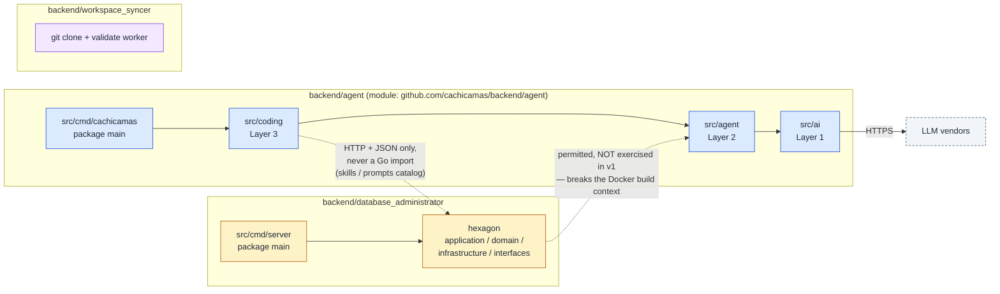
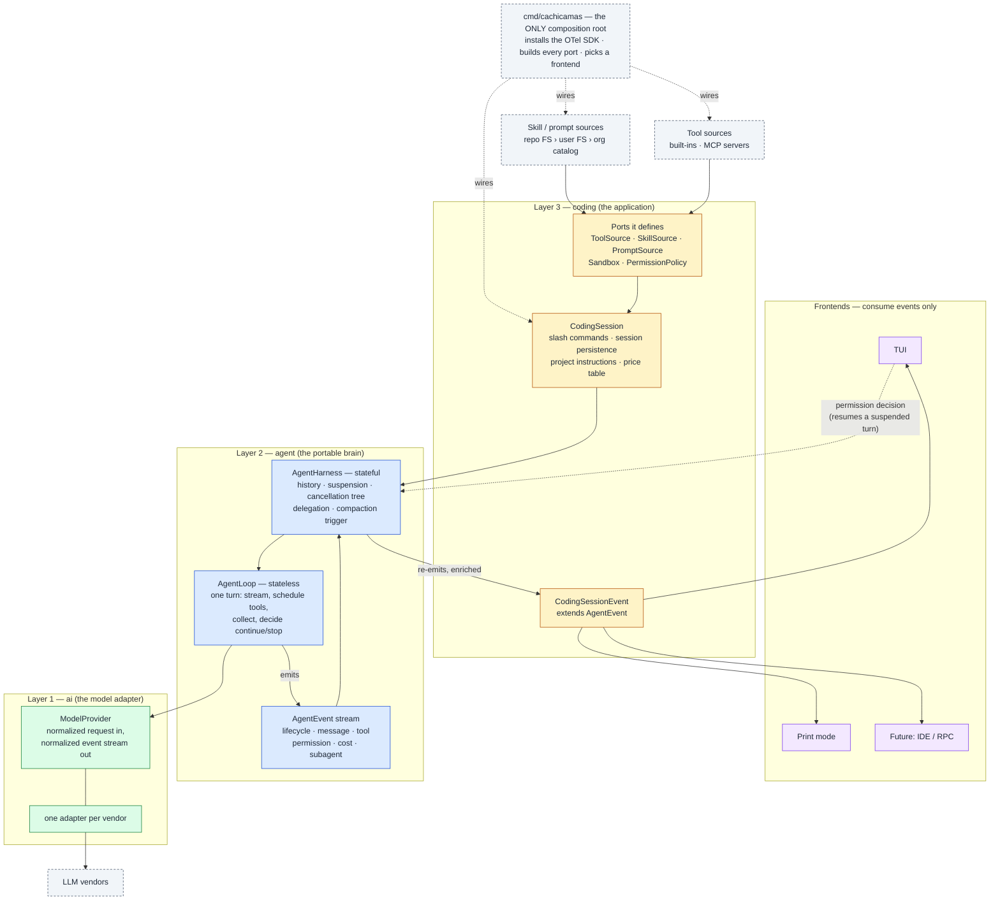
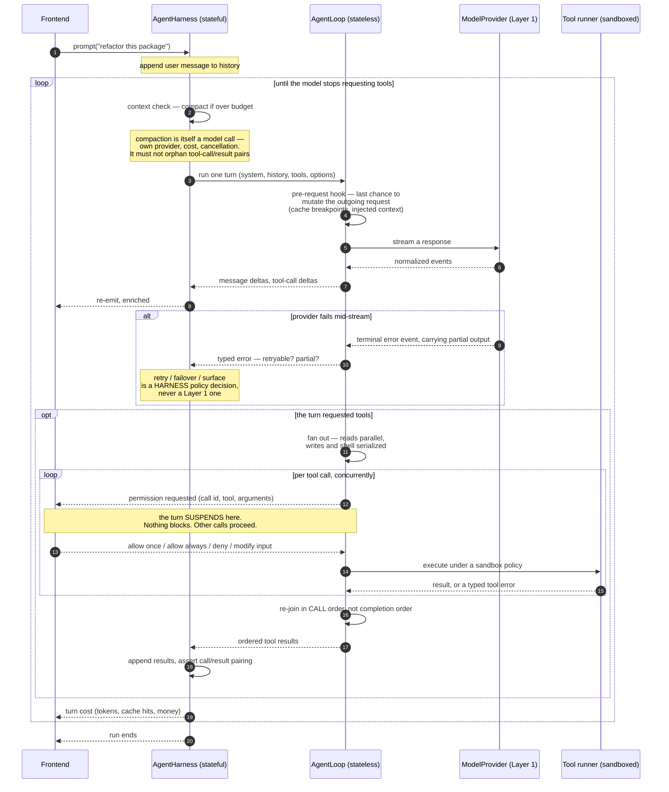

# cachicamas agent stack — hardened architecture (v2)

> **Supersedes (for cachicamas)** the architecture sections of
> [the 0004 spike](../adr/references/0004-spike-3-layer-architecture.md), which remains the
> unmodified external narrative and the record of where this design came from.
> **Decisions** live in [ADR 0004](../adr/0004-adopt-tau-3-layer-agentic-architecture.md) as
> amended by [ADR 0005](../adr/0005-promote-agent-stack-to-own-module.md) and
> [ADR 0006](../adr/0006-resolve-skill-and-prompt-source-of-truth.md).
> **Schedule** lives in the [Layer 1 milestones and task graph](./milestones/0002-cachicamas-ai-layer-1-task-graph.md).
> **Date**: 2026-07-30. **Review source**: Engram `obs #2243`.

> [!IMPORTANT]
> **Authoring constraint.** This document states *seams* and *what must be expressible*. It never
> states Go type names, field names, or method signatures. The Layer 1 roadmap deliberately
> reserves API shapes to each milestone's own SDD cycle; a reference document that pre-empts them
> freezes a design nobody re-reads and drifts from the code within one milestone. Where this
> document says "the request must be able to carry X", the milestone decides how X is spelled.

---

## Resumed TOC

| § | What it settles | One-line takeaway |
| --- | --- | --- |
| [1](#1-why-v2) | Why this document exists | The split is a good dependency rule and an incomplete architecture |
| [2.1](#21-module-view) | Module boundaries | Three modules; the agent imports nobody |
| [2.2](#22-layer-view) | Layer boundaries | One composition root; resources fan in at Layer 3 |
| [2.3](#23-turn-sequence) | What one turn actually does | Six things happen per turn that the v1 sequence diagram omits |
| [3.1](#31-what-is-frozen-today) | The retired Layer 1 surface | Four self-contradicting contracts, now prevented rather than corrected |
| [3.2](#32-what-must-change-before-a-vendor-adapter-exists) | Layer 1 work remaining | Five contract requirements, all cheaper before the first adapter |
| [3.3](#33-the-provider-leakage-register) | Where "provider-neutral" leaks | Nine divergences; five carry L1 contract impact, four are adapter-local |
| [4.1](#41-the-loop--stateless) | Loop responsibilities | The loop owns scheduling, not policy |
| [4.2](#42-the-harness--stateful) | Harness responsibilities | History, suspension, cancellation tree, delegation |
| [4.3](#43-the-agent-event-envelope) | The Layer 2 contract | Six event families, three of them absent from v1 |
| [5.1](#51-the-ports-layer-3-defines) | Layer 3 ports | Five ports; each is where a v1 gap becomes implementable |
| [5.2](#52-what-the-composition-root-wires) | Startup | The only place policy meets mechanism |

## Full TOC

- [1. Why v2](#1-why-v2)
- [2. The stack, corrected](#2-the-stack-corrected)
  - [2.1 Module view](#21-module-view)
  - [2.2 Layer view](#22-layer-view)
  - [2.3 Turn sequence](#23-turn-sequence)
- [3. Layer 1 — the model adapter](#3-layer-1--the-model-adapter)
  - [3.1 What is frozen today](#31-what-is-frozen-today)
  - [3.2 What must change before a vendor adapter exists](#32-what-must-change-before-a-vendor-adapter-exists)
  - [3.3 The provider-leakage register](#33-the-provider-leakage-register)
- [4. Layer 2 — the portable brain](#4-layer-2--the-portable-brain)
  - [4.1 The loop — stateless](#41-the-loop--stateless)
  - [4.2 The harness — stateful](#42-the-harness--stateful)
  - [4.3 The agent event envelope](#43-the-agent-event-envelope)
- [5. Layer 3 — the coding application](#5-layer-3--the-coding-application)
  - [5.1 The ports Layer 3 defines](#51-the-ports-layer-3-defines)
  - [5.2 What the composition root wires](#52-what-the-composition-root-wires)

---

## 1. Why v2

The 2026-07-30 adversarial review reached one summary judgement: **the three-layer split is a good
dependency rule and an incomplete architecture.** It answers "what may import what" precisely and
correctly, and it is silent on every cross-cutting concern that determines whether the resulting
agent is usable.

Four classes of defect motivated this document.

**The location mapping was transplanted without re-deriving its constraints.** The source narrative
describes three top-level sibling packages. ADR 0004 placed them inside a subdirectory of one
hexagonal service, inheriting a rule set that only makes sense at the top level — which produced a
dependency rule that forbids its own stated benefit, an unbounded Layer 3 that inverts the hexagon,
and a TUI mapped into a container that runs an HTTP server. [ADR 0005](../adr/0005-promote-agent-stack-to-own-module.md)
closes this. § 2 draws the result.

~~**Four shipped Layer 1 contracts contradict their own documentation.**~~ **Four Layer 1 contracts
in the now-retired implementation contradicted their own documentation** (see the amendment under
§ 3.1). The sealed content-part wrapper was bypassable; content parts could not be read from another
package, which structurally blocked request translation; the per-stream sequence guarantee was
unachievable because the counter was process-global; and the terminal error event that two files
declared mandatory could not be constructed at all. § 3.1 lists them against the milestones that
now prevent them.

**The provider-neutral abstraction leaks, and the leaks are known in advance.** Reasoning
signatures that must round-trip byte-exact, providers that deliver tool calls whole rather than in
deltas, stop reasons with no neutral equivalent, and a flat system instruction that forecloses
prompt caching entirely. § 3.3 enumerates them so that each is either absorbed by the contract or
consciously pushed into an adapter — rather than discovered by the first adapter author.

**Eight concerns have no home at all.** Permissions, sandboxing, compaction, parallel tool
execution, dynamic tool sources, delegation, hooks, and cost aggregation are not mentioned by
ADR 0004 in any layer. They are not optional features; they are the difference between a demo and
an agent. §§ 4–6 place each one, and § 7 records the ones deferred past v1 so that deferral is a
decision rather than an oversight.

What is **not** in question: the three-layer decomposition, the stateless-loop / stateful-harness
separation, the event stream as the only inter-layer contract, and the one-way dependency
direction. All four are working, and this document keeps every one of them.

---

## 2. The stack, corrected

### 2.1 Module view

**How to read it.** Solid arrows are Go imports. Dotted arrows are runtime calls that are
deliberately *not* imports. The agent module imports nothing from the other two — and because these
are separate Go modules, that is a compiler-enforced invariant rather than a convention.

The dotted arrow from the hexagon up to Layer 2 is the honest form of ADR 0004's "any package can
drive an agent session": permitted by
[ADR 0005 § D1 row 5](../adr/0005-promote-agent-stack-to-own-module.md#d1--dependency-rule-v2),
unexercised in v1, and priced there.

### 2.2 Layer view

Three differences from ADR 0004's diagram, each closing a review finding:

- **`cmd/cachicamas` is drawn, and it is the only composition root.** ADR 0004's diagram had no
  `main`, which is how Layer 3 quietly became one (finding S2).
- **Resources fan in through ports, not through direct filesystem reads.** Skills and prompts
  arrive from three sources per [ADR 0006](../adr/0006-resolve-skill-and-prompt-source-of-truth.md);
  tools arrive from built-ins and MCP servers. Layer 3 defines the ports; the composition root
  chooses the implementations.
- **There is an upward arrow from the frontend, and it is the only one.** A permission decision
  resumes a suspended turn. It is not the frontend driving the loop — the harness suspended and is
  awaiting an answer it already asked for on the event stream.

### 2.3 Turn sequence

Six things happen here that ADR 0004's sequence diagram omits, and each one is load-bearing:

1. **A context check before every provider call** (compaction — § 7 G3).
2. **A pre-request hook** — the only place cache breakpoints and injected context can be applied
   (§ 7 G4, G11).
3. **A typed mid-stream failure path** that distinguishes retryable from fatal and preserves partial
   output (§ 7 G8).
4. **Permission as a suspension on the event stream**, not a callback (§ 7 G1).
5. **Parallel tool execution with an ordered re-join** (§ 7 G5) — the ordering is not cosmetic;
   several providers reject results that do not correspond positionally to their calls.
6. **A cost event per turn** (§ 7 G10).

---

## 3. Layer 1 — the model adapter

### 3.1 What is frozen today

> **Amended 2026-07-31 — this section describes an implementation that no longer exists.** The
> Layer 1 code it reports on lived in `database_administrator/src/tools/agent/ai/` and was
> **removed** when the Layer 1 plan was rebuilt from zero on 2026-07-30
> ([doc 0002 § what changed from the retired plan](./milestones/0002-cachicamas-ai-layer-1-task-graph.md#what-changed-from-the-retired-plan)).
> Nothing described below is frozen, because nothing described below is on disk. Four milestones
> have shipped under the rebuilt plan — AI-00 … AI-03, the module, both boundary guards and the
> Wave 0 decisions — and none of them freezes a contract.
>
> The section is kept, not rewritten, because **C1 – C4 are load-bearing architectural input**: they
> are why the v2 design looks the way it does, and every § 3.2 requirement traces back to one of
> them. What changed is their disposition. Each defect is no longer *corrected by a later
> milestone*; it is **prevented at the milestone that defines the contract**, which is why the
> rebuilt plan has five fewer milestones than the retired one. The "Fixed by" column has been
> remapped to the new identifiers and now names the milestone that prevents the defect, not one
> that repairs it.

~~Seventeen milestones have shipped:~~ **The retired implementation covered** roles and message
identity, text and reasoning content parts, tool declarations, tool calls and results, the
normalized request, finish reasons and usage, the event envelope with its ordering invariants,
response/text/tool-call event payloads, and the provider interface with its stream lifecycle
contract. That package was stdlib-only, had no vendor SDK, and was mechanically guarded against
importing anything else — the one property AI-00 re-established on day one in `backend/agent/src/ai/`.

That surface was good. Four contracts within it contradicted their own documentation, and all four
had to be corrected before an adapter could be written against them. Built from zero, they are
never created.

| # | The contract says | The code does | Fixed by |
| --- | --- | --- | --- |
| C1 | The content-part wrapper is sealed, so a part cannot be constructed with a mismatched or unvalidated payload | The exported text value type satisfies the part interface directly, so its zero value is a valid part that passes message validation and bypasses every construction rule | AI-06 |
| C2 | Layer 2 and adapters consume normalized content parts | The wrappers are unexported and expose only their discriminator. **Content cannot be read back out of a request from another package**, which makes request translation structurally impossible | **AI-06 — hard blocker on AI-26** |
| C3 | The first event of every stream carries sequence 1, and sequences are per-stream and contiguous | The counter is a package-global atomic, so only the first stream in a process can satisfy this. A shipped test documents the resulting gaps as expected | AI-14 |
| C4 | A stream terminates with exactly one completion event **or** one error event | No error payload type exists and the payload interface is sealed, so **no adapter can construct the error terminal** either file declares mandatory | AI-19 |

C2 deserves emphasis because it is the one that blocked work rather than merely misleading a reader.
The reasoning content type avoided the problem by implementing the part interface directly — and
its own documentation explained why, in terms that applied verbatim to the three types that actually
carried payload data. The wrapper pattern was retained for those three anyway. The two strategies
had to be reconciled, in the direction the reasoning type already chose — which is exactly what
AI-06 now decides once, before a second variant exists.

### 3.2 What must change before a vendor adapter exists

> **Amended 2026-07-31 — milestone identifiers remapped.** The numbers in the last column pointed at
> the plan retired on 2026-07-30. Each now names the milestone that *defines* the contract rather
> than a later one that would have changed it
> ([doc 0002 § identifier map](./milestones/0002-cachicamas-ai-layer-1-task-graph.md#what-changed-from-the-retired-plan)).
> The requirements themselves are unchanged, and so is the reason none of them can wait — that
> reason is precisely why they were pulled forward into Waves 0 and 1 of the rebuilt plan. The first
> column's present tense ("the system instruction is a flat string") describes the retired starting
> point, which is what made each of these a gap worth naming; read it alongside § 3.1's amendment.

~~Each of these is a breaking change to a contract that no adapter yet depends on.~~ **Each of these
is now a defining requirement of the milestone that first states the contract, rather than a
breaking change applied to a frozen one.** After the first adapter lands, each becomes roughly three
times the work, because every adapter must be migrated in lock-step with the contract.

| Must become expressible | Why it cannot wait | Milestone |
| --- | --- | --- |
| **Cache breakpoints.** The system instruction is a flat string, so there is nowhere to mark a cache boundary. The request must be able to carry ordered, markable segments for the system instruction, and breakpoint markers on tool declarations and messages | Anthropic caching is opt-in per breakpoint with a strict tools → system → messages invalidation cascade and a hard cap on breakpoint count. Cached reads cost a tenth of fresh input. A design that cannot express a breakpoint cannot ever get that discount, and the omission is invisible until the bill arrives | AI-10 + AI-11 |
| **Per-request options and a provider escape hatch.** Generation options are fixed at request construction; there is no way to carry a provider-specific field the neutral vocabulary does not model | Two separate needs. First, a pre-request hook cannot rebuild a request it cannot modify. Second, every unified-provider abstraction eventually meets a field it cannot model — the survivable answer is a typed-but-opaque pass-through, not a lowest-common-denominator interface that silently drops it | AI-12 |
| **An opaque round-trip token on reasoning content.** Reasoning exposes its state and its text; it cannot carry a provider blob that must be returned byte-identical | Anthropic thinking blocks carry cryptographic signatures. If they are not returned exactly, multi-turn extended thinking with tool use fails. This is not optional metadata; it is a correctness requirement, and the storage has to exist before the adapter that produces it | AI-07 |
| **Refusal and pause as distinct finish reasons.** Both currently collapse into the unknown fallback | A loop-termination bug, not a cosmetic one. Layer 2 cannot distinguish "the model declined" from "the model paused, resume it" from "I do not recognise this string" — three states with three different correct responses | AI-13 |
| **A settled stream carrier.** Channels versus an iterator at the package boundary | Decision only; the documented default is to keep channels. The canonical stranded-producer hazard is closed by the send discipline — every send selects on cancellation and the caller owns the context — not by the carrier. The decision must nonetheless be *closed* before an adapter exists, because reopening it afterwards is far more expensive | AI-02 |

### 3.3 The provider-leakage register

> **Amended 2026-07-31 — the "Where" column is remapped, and the preamble was miscounting its own
> table.** The milestone identifiers point at the rebuilt Layer 1 plan
> ([doc 0002 § identifier map](./milestones/0002-cachicamas-ai-layer-1-task-graph.md#what-changed-from-the-retired-plan)).
> The old preamble said three rows require a contract change and the rest are adapter-local, while
> the table itself marks five: rows 1 – 3 **and** rows 8 – 9. Reading rows 8 – 9 as adapter-local
> deletes AI-11 from the plan, so the sentence is corrected rather than the table.

"Provider-neutral" is a goal, not an achieved state. These are the divergences known in advance.
~~Three require a contract change; the rest are absorbed inside an adapter.~~ **Five carry Layer 1
contract impact and four are absorbed inside an adapter, and the five split across two gaps: rows
1 – 3 are G12's three contract items, and rows 8 – 9 are the Layer 1 half of G4, which AI-10 and
AI-11 own between them — the segmented system instruction and the markers on it.** The value of the
register is that no adapter author has to rediscover them.

| # | Divergence | Neutral shape that absorbs it | Where |
| --- | --- | --- | --- |
| 1 | Some providers stream tool-call arguments incrementally; at least one delivers each call whole, in a single chunk | Tool-call **delta events are optional**. A call must be representable as start-then-end with zero deltas. No consumer may require at least one delta before the end event | **L1 contract** — AI-18 acceptance |
| 2 | Reasoning is returned as signed blocks by one provider, as an opaque token count only by another, and as thought signatures by a third | An opaque, byte-exact round-trip token on reasoning content, plus a state that can say "this provider emitted no reasoning text" | **L1 contract** — AI-07 |
| 3 | Stop reasons include refusal and pause-turn variants with no neutral equivalent | Two additional finish reasons, added additively | **L1 contract** — AI-13 |
| 4 | Tool results are a block inside a user-role message on one provider, a distinct role on another, and a nested response object on a third | The normalized tool-result content part already models this. Each adapter maps it on the way out | Adapter-local |
| 5 | Only one provider enforces strict user/assistant alternation | Adapters merge consecutive same-role messages before sending. Queued steering messages make this a live hazard, not a theoretical one | Adapter-local |
| 6 | One provider always requires an explicit output-token limit | The adapter supplies a documented default when the request omits one, and says so in its documentation rather than silently truncating | Adapter-local |
| 7 | One provider assigns no tool-call identifiers | The adapter mints synthetic identifiers and keeps the mapping — which must survive session serialisation and reload, so it is a session concern too | Adapter-local + L3 |
| 8 | The system instruction is a top-level field, a differently-named top-level field, or a nested object depending on provider | Ordered markable segments (see § 3.2); each adapter renders them into its own shape | L1 contract via AI-10 + AI-11 |
| 9 | Two providers cache prefixes automatically; one requires explicit annotation | Breakpoint markers are advisory. An adapter for an auto-caching provider ignores them; an adapter for an explicit one honours them | L1 contract via AI-11 |

One conclusion is worth stating plainly, because it shapes AI-12: **the correct response to
leakage is a typed pass-through, not a wider neutral vocabulary.** Every field added to the neutral
model to accommodate one provider becomes a field every other adapter must ignore, and the model
grows without bound. An escape hatch keeps the neutral surface small and honest about its limits.

---

## 4. Layer 2 — the portable brain

Layer 2 does not exist yet. This section is the contract it must satisfy, written now because
several Layer 1 decisions depend on it.

### 4.1 The loop — stateless

Given a system instruction, a transcript, a tool set, and options, the loop runs **one assistant
turn** and emits events. It holds no state between calls and knows nothing about sessions, users,
frontends, or persistence. It must remain callable directly from a test with a scripted provider.

**The loop owns:**

- Asking the provider to stream, and normalising nothing — Layer 1 already did that.
- Applying the **pre-request hook** before the call. This is the only point at which cache
  breakpoints, injected context, and a repository map can be applied, because it is the last place
  the outgoing request exists as data.
- **Scheduling tool execution**, including concurrency policy (reads may run in parallel; writes and
  shell commands serialise), bounded concurrency, and the ordered re-join.
- **Driving the permission protocol** — emitting the request, suspending that call, resuming on the
  decision. Suspension must not block the other concurrent calls, and must not block event
  delivery.
- Deciding whether the turn is complete.

**The loop must never:** persist anything, read the filesystem or the environment, render anything,
decide *whether* a tool is allowed (it asks; policy answers), decide *whether* to retry (it reports
a typed error; the harness decides), or know which frontend is attached.

The distinction between "drives the permission protocol" and "decides permission" is the one that
makes G1 work. Policy is a Layer 3 concern injected as a port; the *protocol* — ask, suspend,
resume — must live in the loop, or every frontend reimplements approval out of band and the event
stream stops being a complete description of the session.

### 4.2 The harness — stateful

The harness holds the conversation and is what a user interacts with.

**The harness owns:**

- **History**, including the invariant that every tool call has a matching result. Interruption
  must synthesise results for orphaned calls before the next turn, and this must be enforced at the
  history boundary rather than patched at each call site — including after compaction, which is
  where it is most often violated.
- **The compaction trigger.** Compaction is a model call with its own provider, model, cost and
  cancellation. It must protect recent turns, must not orphan call/result pairs, and must be
  recoverable if interrupted.
- **Retry, backoff and failover policy.** Layer 1 reports a typed error; the harness decides. This
  placement matters because failover to a different model implies re-counting tokens against a
  different context budget — a harness concern by definition.
- **The cancellation tree.** A user interrupt (abort this turn, keep the session) and a shutdown
  (flush and exit) are different signals and must remain distinguishable. Subagents inherit
  cancellation from their parent.
- **Delegation.** A subagent is a harness invoked from within a tool. The harness must therefore be
  re-entrant and composable, with nested cancellation, nested cost aggregation, derived permission
  scope, and events that carry a parent identifier so a frontend can nest them.

**The harness must never** dictate the loop's logic. A different termination rule is a different
harness, not a different loop.

### 4.3 The agent event envelope

The event stream is the only contract between Layer 2 and anything above it. If a thing is not on
the stream, no frontend can render it and no session log can reconstruct it — which is the test
that decides what belongs here.

| Family | Purpose | Status |
| --- | --- | --- |
| Run lifecycle | a full run begins and ends | in the v1 design |
| Turn lifecycle | one assistant response and its tool results | in the v1 design |
| Message lifecycle | start, deltas, end, with reasoning distinguished from text | in the v1 design |
| Tool execution | start, progress, end, with typed failure distinguished from a result that reports failure | in the v1 design |
| **Permission** | a decision is required; a decision was made; the resolution was remembered | **absent — G1** |
| **Cost** | per-turn and cumulative tokens, cache hits and money | **absent — G10** |
| **Delegation** | a subagent started, produced events, ended | **absent — G7** |
| **Compaction** | started, finished, and what it removed | **absent — G3** |

Four invariants the envelope must satisfy:

1. **Deltas carry an index, never a snapshot of the accumulated message.** Emitting a full message
   copy per token is a data race if shared and quadratic allocation if copied. Consumers accumulate.
2. **Nesting is explicit.** Subagent events carry a parent identifier. Without it a frontend cannot
   tell a delegated turn from the main one.
3. **Observers are never synchronous on the streaming path.** A slow listener must not stall token
   delivery.
4. **Errors are typed values, not messages.** A failure that arrives as an assistant message with a
   special stop reason cannot be inspected, matched, or retried on. Setup failures and stream
   failures are distinguishable, and a stream failure carries whatever partial output preceded it.

---

## 5. Layer 3 — the coding application

### 5.1 The ports Layer 3 defines

Layer 3 is where policy lives. Each port below is the seam at which one of the review's gaps
becomes implementable — which is why they are named now, before Layer 2 is written, even though
several will have exactly one implementation for a long time.

| Port | Answers | Implementations foreseen | Gap it closes |
| --- | --- | --- | --- |
| **ToolSource** | which tools exist right now | built-ins; MCP servers; per-session filters | G6 |
| **SkillSource** / **PromptSource** | which skills and prompts are in scope, and which wins | repo filesystem; user filesystem; org catalog over HTTP; ordered chain | ADR 0006 |
| **PermissionPolicy** | may this call proceed, and should the answer be remembered | always-ask; rule sets over tool names and arguments; a permission mode | G1 |
| **Sandbox** | under what confinement does this call execute | none; workspace-write; platform-native confinement | G2 |
| **PriceTable** | what did that turn cost | catalog-driven, per model | G10 |

Two notes that determine whether these ports work at all:

- **`ToolSource` is dynamic, and that has a cost the design must anticipate.** If tools can change
  mid-session, the tool list is no longer a stable cache prefix — which interacts directly with the
  cache-breakpoint cascade in § 3.2. A session that reconnects an MCP server between turns pays for
  a full cache miss, and should say so rather than quietly re-billing.
- **`Sandbox` must be a parameter of tool *execution*, not of a tool.** Confinement is a property
  of the call site, not of the code being called. If the execution seam has nowhere to put a policy,
  adding one later is a rewrite of every tool — which is why the seam is named now even though the
  first implementation will be "none".

### 5.2 What the composition root wires

`cmd/cachicamas` is the only place where policy meets mechanism, and it is the only package allowed
to install the OpenTelemetry SDK
([ADR 0005 § D3](../adr/0005-promote-agent-stack-to-own-module.md#d3--observability-boundary)).
It resolves the provider catalog and credentials; builds the skill, prompt and tool source chains;
selects the permission policy and sandbox mode from flags, configuration and the environment;
constructs the session; and attaches exactly one frontend.

Everything below it receives its dependencies. Nothing below it reads the environment, opens a
configuration file, or decides a policy — which is what makes the layers testable in isolation and
what keeps `cachicamas_agent` genuinely portable.

Sessions remain append-only records with parent chains for branching, under the user's home
directory. Two consequences the session format must accommodate, both easy now and expensive later:
synthetic tool-call identifiers minted by an adapter (§ 3.3 row 7) must survive reload, and a
compaction must be recorded rather than silently applied, or resuming a session reconstructs a
transcript the model never saw.

---

## 6. The twelve seams that must exist now

A **seam** is a place where a decision can later be inserted without reshaping anything around it.
The twelve below are the ones this design cannot retrofit cheaply, because each sits on the
signature of a call that everything else goes through. Most will have exactly one implementation
for a long time — several will have a deliberately trivial one — and that is fine. The cost of
naming a seam early is one parameter; the cost of adding one late is every call site.

| # | Seam | Lives on | Trivial v1 implementation | Why it cannot be added later |
| --- | --- | --- | --- | --- |
| 1 | **Pre-request hook** | the loop, immediately before the provider call | identity | It is the only point where the outgoing request still exists as data. Cache breakpoints (§ 3.2), injected repository context, and prompt trimming all need it, and none of them can reach that moment from anywhere else |
| 2 | **Permission decision** | the tool-scheduling path in the loop | allow-all | If approval is not a suspension in the loop, it happens out of band and the event stream stops being a complete description of the session. Every frontend then reimplements it, differently |
| 3 | **Sandbox policy** | the tool *execution* call, not the tool | none | Confinement is a property of the call site. Without a parameter to carry it, adding confinement means changing every tool |
| 4 | **Tool source** | session construction, re-readable per turn | a static list of built-ins | Tools that can change between turns invalidate the cache prefix and require a supervisor for the processes that provide them. A fixed slice models neither |
| 5 | **Context strategy** | the harness, before each turn | never compact | Compaction must see the whole transcript and the model's budget at the same moment. Nothing above the harness has both |
| 6 | **Token counting** | an *optional* provider capability, discovered by type assertion | absent, fall back to an estimate | Compaction that estimates by character count is wrong by enough to matter. Making this optional rather than part of the provider contract is what stops it from forcing every adapter to implement it |
| 7 | **Retry classification** | the typed error a provider returns | everything fatal | Whether a failure is retryable is knowable only where the wire error is. Whether to *act* on that is a policy decision one layer up. Collapsing the two loses both |
| 8 | **Failover policy** | the harness | none | Switching model mid-session re-opens the token budget, the price table and the cache prefix. Only the harness holds all three |
| 9 | **Provider escape hatch** | the normalized request | empty | The alternative is growing the neutral vocabulary once per provider quirk, forever. See § 3.3 |
| 10 | **Cache breakpoints** | the normalized request | no markers | A flat system instruction has nowhere to put one, and the first adapter freezes the shape |
| 11 | **Reasoning round-trip token** | reasoning content | empty | Correctness, not metadata: without it, multi-turn extended thinking with tool use fails |
| 12 | **Delegation** | the harness, invoked from inside a tool | no subagents | Re-entrancy is a structural property. A harness that forbids a concurrent run cannot host one, and the restriction is usually load-bearing elsewhere by the time anyone notices |

Skills and prompts are a thirteenth seam in practice; they are specified separately in
[ADR 0006](../adr/0006-resolve-skill-and-prompt-source-of-truth.md) because the decision they carry
is policy rather than mechanism.

**Seams 1, 9, 10 and 11 sit on Layer 1 contracts and are therefore the urgent ones.** They are the
only four on this list that a shipped Layer 1 must change to accommodate, which is why they appear
in § 3.2 with milestone numbers while the rest are recorded as forward requirements below.

---

## 7. Forward-requirements register

> **Amended 2026-07-31 — milestone identifiers remapped.** Every AI-NN in the Disposition column
> pointed at the Layer 1 plan retired on 2026-07-30 and now points at its replacement
> ([doc 0002 § identifier map](./milestones/0002-cachicamas-ai-layer-1-task-graph.md#what-changed-from-the-retired-plan)).
> No verdict changed: the same concerns are in v1, deferred, or reserved as seams. What changed is
> that the *in v1* rows no longer name corrective milestones — they name the milestones that define
> the contract correctly the first time. G4's Layer 1 impact is therefore ~~breaking~~ **structural**
> for the same reason § 3.2 gives: there is no frozen contract left to break, and the ordered
> markable system instruction is built at AI-10.2 rather than retrofitted.

Every concern the review raised, with its owner and its disposition. A row marked *seam now* means
[§ 6](#6-the-twelve-seams-that-must-exist-now) reserves the place and no further work happens in
v1. A row marked *in v1* has a milestone. Verdicts are decided in
[ADR 0005 § D4](../adr/0005-promote-agent-stack-to-own-module.md#d4--v1-scope-for-cross-cutting-concerns);
this table adds the architectural detail behind each.

| ID | Concern | Owner | Seam | Layer 1 impact | Disposition |
| --- | --- | --- | --- | --- | --- |
| **G1** | Permission as a suspendable protocol, with allow-once / allow-always / deny / modify-input, remembered per session and derived for subagents | L2 protocol, L3 policy | 2 | none | seam now |
| **G2** | Sandboxed tool execution, applied to the whole spawned process tree rather than the direct child | L3 | 3 | none | seam now |
| **G3** | Context compaction: protect recent turns, never orphan a call/result pair, record what was removed, survive interruption | L2 | 5, 6 | an *optional* token-counting capability, discovered by type assertion — it does **not** widen the provider contract | seam now |
| **G4** | Prompt caching — breakpoint placement at Layer 1, prefix stability at Layer 2 | L1 places, L2 stabilises | 1, 10 | **structural**: the system instruction is ordered markable segments from birth (AI-10.2), and tool declarations and messages accept breakpoint markers (AI-11) | **in v1 — AI-10 + AI-11** |
| **G5** | Parallel tool execution with deterministic, call-ordered re-join and per-tool concurrency policy | L2 | 2 | the tool-call ordinal must survive normalisation | seam now |
| **G6** | Tool sources that are dynamic, supervised, and may also supply prompts and resources | L3 | 4 | none — tool declarations already exist | seam now |
| **G7** | Subagents as a harness invoked from a tool, with nested cancellation, cost and permission scope, and parent-identified events | L2 | 12 | none | seam now |
| **G8** | Typed error taxonomy, retry with backoff, and provider failover. **The partial-output case is the important one**: a stream that dies after emitting output is the most common real failure and the one naive retry logic excludes | L1 taxonomy, L2 policy | 7, 8 | a constructible terminal error payload (C4) plus a partial-output discriminator | **in v1 — AI-19, AI-32, AI-35** |
| **G9** | Per-request options plus a typed-but-opaque provider pass-through | L1 | 9 | the request needs extension points and copy-on-write rebuilding | **in v1 — AI-12** |
| **G10** | Cost and usage as first-class events rather than something each frontend re-derives | L2 emits, L3 prices | 11 | **none of its own.** The usage record AI-13.3 defines already carries cache-read, cache-write and reasoning token counts, so G10 adds no Layer 1 milestone | deferred to L2/L3 |
| **G11** | Hook taxonomy: pre-request, pre-compact, post-turn, session-start. Observers must never be synchronous on the streaming path | L2 + L3 | 1 | requires G9's rebuildable request | seam now |
| **G12** | Provider leakage — see the nine-row register in [§ 3.3](#33-the-provider-leakage-register) | split | 9, 11 | three contract changes (delta-optional tool calls, reasoning round-trip token, two new finish reasons); four adapter-local — register rows 8 – 9 are G4's, not G12's | **in v1 — AI-07, AI-13, AI-18** |
| **G13** | Stream carrier: channel versus iterator at the package boundary | L1 | — | none | **decision only — AI-02**, default keep channels |

### Two dispositions worth their reasoning

**G10 needs no Layer 1 work of its own, contrary to first appearances.** The usage record is
required to carry the cache and reasoning token counts an adapter would report, and AI-13.3 already
owes that. What is missing is entirely above it: a
per-turn and per-session cost event on the Layer 2 stream, and a Layer 3 price table to convert
tokens into money. One nuance the price table must respect — on models with adaptive reasoning, the
reasoning token count only arrives on the final streamed usage update, so any mid-stream cost
figure is structurally an estimate and should be labelled as one.

**G13 must not be scheduled as implementation work.** The canonical objection to channels at a
package boundary is that a consumer who stops reading strands the producer goroutine forever, and
goroutines are not collected. That hazard is closed by the **send discipline**, not by the carrier:
every send selects on the stream and on cancellation, and the caller owns the cancellable context.
What remains is a caller who abandons the stream *and* never cancels — a contract violation, not a
design flaw. ~~Against that, switching carriers today would invalidate the interface signature guard
and the behavioural scenarios that merged days ago.~~ **Amended 2026-07-31: that second argument is
void. Nothing was shipped, so there was no signature guard and no behavioural scenario to
invalidate, and AI-02 therefore had to decide the carrier on its merits alone — which it did, in
favour of a receive-only channel, delegating iterator ergonomics to a carrier view exposed by the
stream test kit.** The decision was nonetheless worth *closing* before the first adapter exists,
because after that it is roughly three times the work.

---

## 8. Non-goals for v1

Recorded so that their absence reads as a decision rather than an oversight.

- **A second Layer 1 provider.** One adapter, proven against a conformance suite, is the v1 target.
  The suite is what makes the second adapter cheap; building two adapters before the suite makes
  both expensive.
- **`database_administrator` driving an agent session.** Permitted by
  [ADR 0005 § D1 row 5](../adr/0005-promote-agent-stack-to-own-module.md#d1--dependency-rule-v2),
  unexercised, and priced there.
- **A TUI.** Print mode is the minimum viable frontend and the one that proves the event stream is
  sufficient. A TUI that is written first tends to acquire state the stream does not carry.
- **Sandboxing, MCP, and subagents.** Seams 3, 4 and 12 exist; the implementations do not.
- **Session branching UI.** The append-only session format with parent chains supports it; nothing
  in v1 exposes it.
- **Multimodal content beyond text.** Image and audio discriminators exist in the content
  vocabulary and no constructor produces them. Enabling them requires per-provider capability
  detection that v1 does not model.
- **Cross-session or org-wide cost aggregation.** Per-turn and per-session cost is a v1 seam;
  rolling it up is a `database_administrator` concern and needs its own decision.

---

## 9. Review checklist

For anyone reviewing a milestone that touches the agent stack.

**Boundaries**

- [ ] No package of `backend/agent` imports another backend module — including from `cmd/`.
- [ ] Layer 1 imports only stdlib, `net/http`, a vendor SDK, and the OpenTelemetry **API**. No SDK,
      no exporter, no `otelslog`.
- [ ] Layer 2 performs no I/O of its own, reads no environment, and touches no filesystem.
- [ ] Layer 3 reaches other modules over HTTP only, never by import.
- [ ] Both import guards still run, and the reverse guard still covers the whole module.

**Contracts**

- [ ] No vendor wire type crosses the Layer 1 method boundary.
- [ ] Every event kind that can be emitted has a payload that can actually be constructed.
- [ ] Anything a provider must receive back byte-identical is carried opaquely, not reconstructed.
- [ ] A new neutral field is genuinely neutral. If it exists to satisfy one provider, it belongs in
      the escape hatch instead — see [§ 3.3](#33-the-provider-leakage-register).
- [ ] Tool-call deltas remain optional. Nothing requires at least one before the end event.

**Streams and concurrency**

- [ ] Every producer goroutine has a documented exit path, and every send selects on cancellation.
- [ ] Nothing closes a channel it does not own.
- [ ] Cancellation is a context, not a polled flag, and backoff waits on it rather than sleeping.
- [ ] Delta events carry an index, never a snapshot of the accumulated message.
- [ ] Tests assert no goroutine leak on the early-abandon path, and run under the race detector.

**Observability and safety**

- [ ] No span attribute or log field carries prompt, completion, reasoning, tool-argument or
      tool-result text, a header, or a credential.
- [ ] Errors are typed and inspectable, and a mid-stream failure preserves its partial output.
- [ ] A tool that spawns processes kills the process group, not just the direct child.

**Process**

- [ ] The change fits the review budget, or says in its description why it does not.
- [ ] Milestone identifiers are appended, never renumbered.
- [ ] Anything this milestone deliberately leaves unsupported is stated explicitly.
