# Layer 1 milestones and task graph — `cachicamas_ai` model adapter

> **Status:** In progress — **17 of 48** milestones shipped (AI-00 … AI-16; recorded in [the shipped baseline](#shipped-baseline--ai-00--ai-16), not decomposed). Last merged: AI-16 (PR #87, 2026-07-30). **AI-39 is the next milestone.** The **31 unshipped** milestones (AI-39 … AI-42, AI-17 … AI-21, AI-43 … AI-47, AI-22 … AI-38) are each decomposed below into a TDD-executable task graph.
> **Single source.** This document absorbed the retired Layer 1 milestone map (`0001-cachicamas-ai-layer-1.md`, removed 2026-07-30; its full text remains in git history) and now owns milestone identity, scope, amendments and delivery sequence **as well as** the inside of each milestone — the subtask graph an implementer walks with red-green-refactor. Where body text cites "the map", it cites that absorbed content: each milestone's **Charter** block carries the goal, deliverable, acceptance and amendments the citation points at.
> **Architecture reference:** [cachicamas agent stack v2](../0001-cachicamas-agent-stack-v2.md) · **Decisions:** [ADR 0004](../../adr/0004-adopt-tau-3-layer-agentic-architecture.md) · [ADR 0005](../../adr/0005-promote-agent-stack-to-own-module.md) · [ADR 0006](../../adr/0006-resolve-skill-and-prompt-source-of-truth.md)
> **Target module:** `backend/agent/` (`github.com/cachicamas/backend/agent`) — the package **moves** out of `backend/database_administrator/src/tools/agent/ai/` in AI-39. **Target package:** `backend/agent/src/ai/`.
> **Date:** 2026-07-30.
> **Milestone identifiers are append-only.** AI-NN ids appear in ~37 source files' GoDoc, every commit message, 15 merged PR titles, ~200 test names, and Engram topic keys. Renumbering invalidates that audit trail for no benefit. New work appends AI-39 … AI-47; logical insertion points are expressed with a `Blocks:` field, not by renumbering.
> **Node identifiers are append-only.** A node is `AI-NN.p` (subtask of milestone AI-NN) or `AI-NN.p.q` (fractal subdivision of `AI-NN.p`). Splitting a node appends children under it; it never renumbers siblings. A node discovered during implementation is appended with the next free ordinal and an edge, exactly like the milestone rule above.

> [!IMPORTANT]
> **Authoring constraint, inherited from the v2 reference.** This document states *behaviors* and *what a test must prove*. It never invents Go type names, field names, or signatures for code that does not exist yet — each leaf's SDD cycle owns those. Identifiers that appear here (`sequenceCounter`, `newStreamBuffer`, `T-AI16-006`, file paths) are **evidence citations of shipped code at HEAD**, permitted for the same reason the map cites them: they locate a defect, they do not design its fix.

---

## Outcome first

Walking every leaf of this graph to green, in dependency order, completes Layer 1 exactly as the map defines completion: a provider-neutral Go package in `backend/agent/src/ai/` that Layer 2 can call without importing any vendor SDK or wire type, with one conformant vendor adapter, a reusable conformance suite, and a deterministic fake provider for Layer 2's own tests.

Every leaf in this document is sized to be implemented test-first in one sitting, is verifiable by one command, and states what it deliberately does not do. If a leaf turns out not to have those properties when someone picks it up, the correct move is defined in [the living-graph clause](#the-graph-is-alive-the-revert-and-record-clause) — split it and record the split — not to push through.

## Quick navigation

- [Layer boundary](#layer-boundary) — what Layer 1 owns and must not own
- [Rules for every future SDD milestone](#rules-for-every-future-sdd-milestone)
- [How to read this document](#how-to-read-this-document) — node grammar, leaf anatomy, milestone charter, split triggers, evidence gate
- [The graph is alive](#the-graph-is-alive-the-revert-and-record-clause) — what to do when implementation disproves the plan
- [Shipped baseline — AI-00 … AI-16](#shipped-baseline--ai-00--ai-16)
- [Global dependency graph](#global-dependency-graph) · [Delivery sequence](#delivery-sequence)
- [Wave 3.5 — Relocate](#wave-35--relocate): [AI-39](#ai-39--promote-the-agent-stack-to-its-own-module)
- [Wave 3.6 — Correct](#wave-36--correct-the-shipped-contracts): [AI-40](#ai-40--make-the-event-sequence-per-stream) · [AI-41](#ai-41--make-content-parts-readable-from-another-package) · [AI-42](#ai-42--close-the-content-part-construction-bypass)
- [Wave 4 — Prove contracts](#wave-4--prove-the-contracts): [AI-17](#ai-17--define-validation-error-taxonomy) · [AI-18](#ai-18--define-provider-error-taxonomy) · [AI-19](#ai-19--build-a-scripted-fake-provider) · [AI-20](#ai-20--build-stream-recording-and-assertion-helpers) · [AI-21](#ai-21--create-provider-conformance-suite)
- [Wave 4.5 — Close contract gaps](#wave-45--close-the-contract-gaps): [AI-43](#ai-43--make-cache-breakpoints-expressible) · [AI-44](#ai-44--add-per-request-options-and-a-provider-escape-hatch) · [AI-45](#ai-45--carry-a-reasoning-round-trip-token) · [AI-46](#ai-46--add-refusal-and-pause-finish-reasons) · [AI-47](#ai-47--close-the-stream-carrier-decision)
- [Wave 5 — Connect the vendor](#wave-5--connect-the-vendor): [AI-22](#ai-22--select-first-provider-and-transport) · [AI-23](#ai-23--provider-configuration-and-client-construction) · [AI-24](#ai-24--translate-normalized-requests-to-wire-requests) · [AI-25](#ai-25--implement-the-streaming-frame-decoder) · [AI-26](#ai-26--translate-response-lifecycle-and-text) · [AI-27](#ai-27--translate-the-reasoning-stream) · [AI-28](#ai-28--translate-the-tool-call-stream) · [AI-29](#ai-29--translate-usage-and-finish-reasons) · [AI-30](#ai-30--map-http-and-provider-failures)
- [Wave 6 — Harden](#wave-6--harden): [AI-31](#ai-31--prove-cancellation-and-goroutine-cleanup) · [AI-32](#ai-32--lock-backpressure-and-buffer-behavior) · [AI-33](#ai-33--define-retry-and-idempotency-policy) · [AI-34](#ai-34--enforce-secret-redaction) · [AI-35](#ai-35--add-the-observability-boundary)
- [Wave 7 — Hand off](#wave-7--hand-off): [AI-36](#ai-36--run-full-deterministic-adapter-conformance) · [AI-37](#ai-37--add-the-opt-in-live-smoke-test) · [AI-38](#ai-38--publish-the-layer-2-readiness-contract)
- [Layer 1 completion checklist](#layer-1-completion-checklist)
- [Explicitly deferred until after Layer 1](#explicitly-deferred-until-after-layer-1)
- [Traceability spine](#traceability-spine) — every defect, gap and checklist item mapped to the node that closes it
- [Method sources](#method-sources)

---

## Layer boundary

Settled by ADR 0004 (as amended by ADR 0005) — constraints, not questions for later milestones: dependencies flow only `cachicamas_coding -> cachicamas_agent -> cachicamas_ai`, and the reverse direction is forbidden; Layer 1 owns provider-specific request/stream translation and exposes provider-neutral contracts to Layer 2; Layer 1 imports only the Go standard library, provider-specific dependencies, and the OpenTelemetry **API** per ADR 0005 § D3; streaming uses Go primitives rather than copying Python async-iterator APIs; frontends and session persistence are outside Layer 1.

**Layer 1 owns:** provider-neutral model request contracts; message and content-part contracts at the model boundary; tool declaration and emitted tool-call contracts; streaming event contracts; the provider interface and stream lifecycle contract; the provider/transport error taxonomy; concrete provider adapters; adapter conformance tests and deterministic fakes.

**Layer 1 must not own:** agent turns, loop termination, or transcript mutation; tool execution or tool-result scheduling; session history persistence; provider/model catalog files or user preference storage; environment-variable loading, login flows, or secret persistence; CLI, TUI, HTTP handlers, slash commands, skills, prompts, or project instructions; application-specific retries that could duplicate an agent turn.

Two wording traps, kept because both keep resurfacing: **"Layer 1 does not know what a tool is" is too broad** — Layer 1 must understand the provider-neutral *transport representation* of tool declarations and tool calls because those cross the model API; it must not execute tools, resolve tool names, or own application behavior. **"Provider swap is a config change" applies only after adapters exist** — switching between already-supported providers can be configuration-only; adding a new vendor still requires a new adapter unless it is genuinely compatible with an existing transport.

## Rules for every future SDD milestone

Each milestone below should become its **own change** unless its SDD exploration proves it is too small to review independently.

- One primary contract or behavior per milestone.
- Tests travel with the behavior they prove.
- Prefer less than 250 changed lines; stop and reassess before 400.
- No production secrets or live-network dependency in normal tests.
- Imports are governed by [ADR 0005 § D1](../../adr/0005-promote-agent-stack-to-own-module.md#d1--dependency-rule-v2) and [§ D3](../../adr/0005-promote-agent-stack-to-own-module.md#d3--observability-boundary): the Go standard library, the selected provider dependency, and the OpenTelemetry **API** modules only. The OTel **SDK**, any exporter, and every package of `database_administrator` / `workspace_syncer` remain forbidden.
- Public types need stable semantics before a concrete adapter depends on them.
- A milestone may refine later names, but it must not violate ADR 0004.
- Each SDD must state what remains intentionally unsupported.

---

## How to read this document

### Node grammar

Every node in every graph is exactly one of:

| Node type | Marker | What it is | How it closes |
| --- | --- | --- | --- |
| **Compound** | `[compound]` | A scope with children. Never worked on directly. | All children closed, and its own one-line exit check holds. |
| **Behavior leaf** | `[leaf]` | An ordered test list over observable behavior. | Every test-list item taken red → green → refactored, in order. |
| **Guard leaf** | `[guard]` | A mechanical check (import scan, AST scan, byte-suffix scan) that must keep failing forever when violated. | The guard is shown to **bite** — it fails against a deliberate scratch violation — then lands green. |
| **Decision leaf** | `[decision]` | A recorded choice with a closing checklist. No production code. | The decision artifact answers every listed question and is merged. |
| **Mechanical leaf** | `[mechanical]` | Repo surgery with no testable behavior of its own — a move, a scaffold, a bulk rewrite. Carries a **Check list** of recorded, objective checks instead of a test list. | Every check's recorded evidence (build output, diff scan, similarity report) is attached; exempt from red-green, never exempt from the checks. |

A node may not be both compound and leaf: if it has children, its own test list is empty and its scope is exactly the union of its children (nothing missing, nothing extra — the 100 % rule). Siblings never overlap: no behavior, file, or contract clause is owned by two nodes at the same depth. These two invariants hold at *every* depth, which is what makes the decomposition fractal — any subtree, cut out alone, is a well-formed plan.

### Leaf anatomy

Every behavior leaf carries four fields. The fifth — the evidence gate — is global and stated once, below.

- **Test list** — 1 to 7 ordered items, each phrased as an observable behavior (`WHEN … THEN …` or a property), never as an implementation move. "Add a mutex" is illegal; "two concurrent streams each observe their own contiguous sequence under `-race`" is legal. One additional item class is legal: a **pin**, marked `*(pin)*` — a green-from-birth regression assertion protecting already-shipped behavior; exempt from red-first, still fully mechanical. Prose claims with no objective check (documentation accuracy, "the SDD should consider…") belong in the milestone's verify-report checklist, never in a test list. The list is Canon TDD's test list: pick one item, write the one failing test, make it pass minimally, refactor, strike it, repeat. New cases discovered mid-leaf are *appended to the list*, not chased ad hoc.
- **Depends on** — node IDs (or milestone IDs from the map) that must be closed first. A leaf whose dependencies are closed is on the frontier and may start.
- **Out of scope** — the adjacent behaviors this leaf deliberately does not prove, each with the node that does. This is the field that keeps siblings mutually exclusive in practice.
- **Split if** — the leaf's own pre-declared fission trigger, where one is foreseeable.

**Evidence gate (global).** A leaf closes only on recorded green output of `make test` in `backend/agent/` (which is `go test -race -v ./...`) — plus, for guard leaves, the recorded red run against the scratch violation. Two scoped exceptions: AI-39.5's test lives in `database_administrator/`, so its gate is `make test` there; mechanical leaves close on their recorded check evidence instead. Test functions follow the shipped convention `Test<Subject>_<Behavior>_<Expectation>`; scenario banners cite the leaf ID (`// AI-40.2 — …`) the way shipped tests cite `T-AI16-00N`. Milestone-level SDD artifacts (proposal, spec, design, tasks, verify-report under `openspec/changes/<slug>/`) still govern each milestone; the leaves of that milestone's graph become its `tasks.md` phases.

### Split triggers

A node **must** be subdivided — before or during implementation — when any of these fires:

1. Its test list exceeds ~7 items, or spans more than one publicly observable behavior.
2. It cannot plausibly go green-to-green inside one sitting (half a day at most).
3. Making its first test pass would require touching a seam that does not exist yet — the missing seam becomes a prerequisite node (see the living-graph clause).
4. Its projected diff, tests included, pushes the milestone past the review budget: **prefer < 250 changed lines, stop and reassess before 400** ([milestone rules](#rules-for-every-future-sdd-milestone)). The node boundary is the PR-chain boundary. Byte-identical mechanical moves (AI-39.2's `git mv`) are exempt from this trigger — similarity-preserving bulk is the point of such a commit, not a review burden.
5. Two people (or agents) could work it concurrently without conflict — then it was two nodes all along.

Split along these axes, in preference order: **data subsets** (text before tool calls before reasoning), **paths** (happy before error), **rules** (relaxed validation first, tightened later), **interfaces** (fake provider before real one), **spikes** (an unknown becomes a time-boxed decision leaf).

### Milestone charter

Every milestone section opens with a **Charter** — its identity block, absorbed 2026-07-30 from the retired milestone map: goal, deliverable, acceptance, dependency edges, out-of-scope clauses, and any dated amendments. The charter is the normative scope; the graph below it is the decomposition. The two must agree at every depth — a node proving something outside its charter, or a charter clause no node proves, is a bug, and the [traceability spine](#traceability-spine) is the audit trail.

### Ordering inside a milestone

The first behavior leaf of any milestone that produces new capability is its **walking skeleton**: the thinnest end-to-end path through the public surface, proven by one outer acceptance test. Every later leaf widens that working path; no leaf opens a second unintegrated front. Error paths follow happy paths; hardening follows function.

## The graph is alive — the revert-and-record clause

Implementation *will* disprove parts of this plan; that is expected and priced in. The rule, borrowed from the Mikado method:

1. If a leaf's first red test cannot be driven green in small steps, **do not push through on a broken tree.** Revert to green.
2. Record what was learned as graph structure: append the discovered prerequisite as a new node (next free ordinal), draw the edge, and — if the original leaf is now compound — move its remaining test items into new children.
3. The graph amendment lands **in the same PR** that resumes work, so this document remains the single true map. Newly discovered *test cases* (not prerequisites) are appended to the owning leaf's test list instead.
4. Amendments follow one convention for milestones and nodes alike: blockquote `> **Amended YYYY-MM-DD** …` under the touched heading; struck-through text for superseded claims; never silent edits.

---

## Shipped baseline — AI-00 … AI-16

Seventeen milestones shipped before this document existed (waves 1–3; last merged AI-16, PR #87, 2026-07-30). They are the contract surface the unshipped waves correct, prove, and build on — recorded here for identity and audit, not decomposed. Their full charters live in git history with the retired map.

| ID | Milestone | SDD change |
| --- | --- | --- |
| AI-00 | Record the Layer 1 contract vocabulary | `cachicamas-ai-contract-vocabulary` |
| AI-01 | Decide stream lifecycle and ownership | `cachicamas-ai-stream-lifecycle` |
| AI-02 | Decide the minimum first-provider capability set | `cachicamas-ai-minimum-capabilities` |
| AI-03 | Introduce package scaffold and import boundary | `cachicamas-ai-package-scaffold` |
| AI-04 | Define roles and message identity | `cachicamas-ai-message-roles` |
| AI-05 | Define text content parts | `cachicamas-ai-text-content` |
| AI-06 | Define optional reasoning content | `cachicamas-ai-reasoning-content` |
| AI-07 | Define tool declarations | `cachicamas-ai-tool-declarations` |
| AI-08 | Define tool calls and tool results | `cachicamas-ai-tool-messages` |
| AI-09 | Define normalized model request | `cachicamas-ai-model-request` |
| AI-10 | Define finish reasons and usage | `cachicamas-ai-completion-metadata` |
| AI-11 | Define event envelope and ordering invariants | `cachicamas-ai-event-envelope` |
| AI-12 | Add response lifecycle events | `cachicamas-ai-response-events` |
| AI-13 | Add text delta events | `cachicamas-ai-text-events` |
| AI-14 | Add reasoning delta events | `cachicamas-ai-reasoning-events` |
| AI-15 | Add tool-call delta events | `cachicamas-ai-tool-call-events` |
| AI-16 | Define provider interface | `cachicamas-ai-model-provider` |

Three shipped charters carry 2026-07-30 amendments that unshipped milestones execute: **AI-02** adds token counting to the explicitly-optional capability list, discovered by type assertion (finding G3 — the prerequisite for Layer 2 context compaction); **AI-10** freezes the finish-reason enum as shipped — `refusal` and `pause_turn` arrive additively via AI-46, and the usage type already carries cache-read, cache-write and reasoning token counts, completing the Layer 1 half of cost tracking (finding G10); **AI-15** makes delta events optional — a tool call MUST be representable as start-then-end with zero deltas, and no consumer may require a delta before the end event (finding G12a), the case AI-21 and AI-28 test.

---

## Global dependency graph

Phase-level order comes from the retired map; this diagram adds the shipped baseline and the two long parallel tracks inside wave 5.

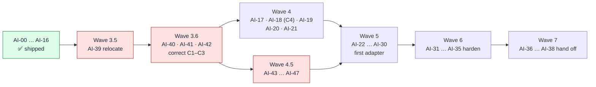

Two divergences from the retired map's phase-level diagram, recorded here rather than left silent:

1. **Waves 4 and 4.5 run in parallel above.** The retired map's phase diagram drew Phase D → Phase H sequential, but its own milestone-level `Depends on:` fields never made a Phase H milestone depend on a Phase D one — the map disagreed with itself, and this document follows the milestone-level edges. With the map absorbed here, the parallel reading is canonical; the sequential phase diagram was retired with the map.
2. **Three edges cross between the parallel waves:** AI-20.5 (iterator view) depends on AI-47; AI-19.7 (scripted reasoning) depends on AI-45; AI-21.8 (optional-capability cases) depends on AI-45 and AI-46. So milestones AI-19, AI-20 and AI-21 cannot *fully* close before those wave-4.5 milestones land — schedule AI-46 and AI-47 early (both are cheap), and sequence AI-45 before the fake's reasoning node.

Within waves, the per-milestone graphs below expose finer parallelism than the phase ordering: e.g. AI-46 depends only on AI-39; AI-25 runs parallel to AI-24.

### Delivery sequence

| Wave | Milestones | Exit condition |
| --- | --- | --- |
| 1 — Decide | AI-00 to AI-02 | ✅ **Shipped.** Vocabulary, lifecycle, and v1 capabilities are unambiguous. |
| 2 — Model | AI-03 to AI-10 | ✅ **Shipped.** Neutral request values compile and validate independently. |
| 3 — Stream | AI-11 to AI-16 | ✅ **Shipped** (AI-16 in PR #87). Layer 2-facing provider interface is defined without vendor leakage. |
| **3.5 — Relocate** | **AI-39** | The agent stack is its own module and **both** import directions are mechanically guarded. |
| **3.6 — Correct** | **AI-40 to AI-42** | No shipped contract contradicts its own documentation. Content is readable from another package. |
| 4 — Prove contracts | AI-17 to AI-21 | Errors — including a constructible terminal error — fake provider, test helpers, and conformance suite are reusable. |
| **4.5 — Close contract gaps** | **AI-43 to AI-47** | Cache breakpoints, per-request options, reasoning round-trip and stop reasons are expressible; the stream carrier is decided. |
| 5 — Connect vendor | AI-22 to AI-30 | First adapter streams normalized text/tools/metadata and maps failures. |
| 6 — Harden | AI-31 to AI-35 | Cancellation, pressure, retries, redaction, and observability are safe. |
| 7 — Hand off | AI-36 to AI-38 | Adapter passes conformance and Layer 2 can consume the stable v1 API. |

Waves 3.5, 3.6 and 4.5 were inserted on 2026-07-30. Their placement is not arbitrary: 3.5 and 3.6 must precede wave 4, or the test kit and conformance suite freeze the current defects into assertions; 4.5 must precede wave 5, or every contract-gap change has to migrate an existing adapter in lock-step.

**Next SDD to start: AI-39** (`cachicamas-agent-module-promotion`). Its preconditions are satisfied: ADR 0005 merged (PR #81) and AI-16 merged (PR #87). Run it on a quiet tree — it is mechanical, but it rewrites the import path in 18 files and conflicts with anything else in flight. Then AI-40, before the test kit exists — a conformance suite written against the process-global sequence counter freezes that bug permanently. Then AI-41 and AI-42 in parallel; AI-41 is a hard blocker on AI-24, so it cannot slip. Only then AI-17 and the rest of wave 4.

> The original guidance, retained because it still explains *why* the ordering matters: the model adapter is a boundary. If the boundary vocabulary and stream ownership are vague, provider details harden into accidental architecture and every later layer pays for it. The 2026-07-30 review is that principle applied to what already shipped — four contracts hardened into shapes their own documentation contradicts, and they are cheapest to correct now, while no adapter depends on them.

---

## Wave 3.5 — Relocate

### AI-39 — Promote the agent stack to its own module

SDD change: `cachicamas-agent-module-promotion` · Closes: ADR 0005 § D2. Mostly mechanical; its TDD content is concentrated in the two guards, which follow the guard-leaf discipline (prove they bite).

**Charter**

- **Goal:** Move the agent stack out of `database_administrator` into the sibling module `backend/agent`, per [ADR 0005 § D2](../../adr/0005-promote-agent-stack-to-own-module.md#d2--location-mapping-v2).
- **Deliverable:** New module (`go.mod`, `Makefile`, `.golangci.yml`, `README.md`, `.gitignore`); `src/ai/` and `src/agenttest/` relocated; import paths rewritten; the forward import guard upgraded to a module allowlist and to `go list -deps`; a **new reverse guard** in `database_administrator`; a repo-root `go.work`.
- **Acceptance:** `make test` is green in every module; both import directions are mechanically guarded; `git log --follow` traverses the move; no behavior changes.
- **Depends on:** ADR 0005 (merged, PR #81); AI-16 (merged, PR #87). **Both satisfied — AI-39 is unblocked.** · **Blocks:** AI-17 and everything after it.
- **Out of scope:** Adding any dependency, including OpenTelemetry. `go.mod` stays empty — Layer 1 is stdlib-only today.
- **Also in scope — three lint findings confirmed on 2026-07-30** when AI-16 landed: `make lint` reports `newStreamBuffer` and `validatePreStream` in `provider.go` as **unused**, plus unreachable code in `agenttest/consumer_test.go`. The two helpers are documented as *"Adapters MUST call this helper … so the pre-stream branch is mechanically identical across implementations"* — but they are **unexported**, and adapters live in other packages, so no adapter can ever call them; the comment two lines below each concedes it. The module move is the natural moment to resolve this, because it is the point at which adapters get a known home: export them, delete them, or relocate them. Note `make lint` already exits non-zero on `main` for unrelated pre-existing reasons (~56 issues, mostly `errcheck` in tests), so this milestone should state whether it is also fixing the baseline or only its own three.
- **Note:** The `git mv` and the import-path rewrite are **separate commits**. Committing the move with byte-identical content makes every file a 100 % similarity rename; combining them destroys `git blame` for ~38 files. The build is broken between those two commits — say so in the PR body.

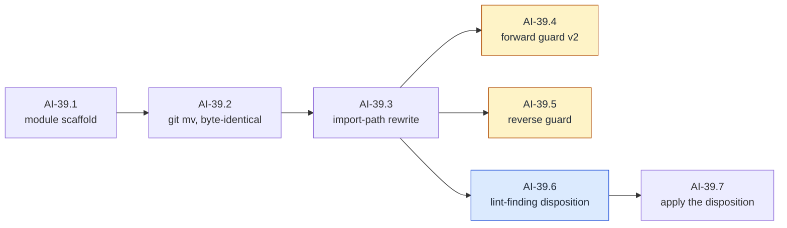

#### AI-39.1 — Module scaffold `[mechanical]`

- **Check list:**
  1. WHEN `backend/agent/` exists with `go.mod` (`github.com/cachicamas/backend/agent`, `go 1.26.3`, **zero dependencies**), `Makefile`, `.golangci.yml`, `README.md`, `.gitignore` THEN `make test` and `make lint` run (trivially green) inside the new module.
  2. WHEN a repo-root `go.work` lists all three modules THEN `go build ./...` succeeds from each module directory independently.
  3. `database_administrator/go.mod` gains **no** `replace` directive (ADR 0005 § Migration).
- **Depends on:** — (ADR 0005 merged, AI-16 merged; both satisfied).
- **Out of scope:** moving any file (AI-39.2); adding any dependency, including OpenTelemetry (forbidden by the map's AI-39 entry).

#### AI-39.2 — Move, byte-identical `[mechanical]`

- **Check list:**
  1. `git mv` of `src/tools/agent/ai/` → `backend/agent/src/ai/` and `src/tools/agent/agenttest/` → `backend/agent/src/agenttest/` lands as **its own commit** with every file at 100 % rename similarity (`git log --follow` traverses; verified and recorded in the PR).
  2. `src/tools/tools.go` is untouched (ADR 0005 § D2 pinned constraint).
  3. `src/agenttest/` remains a **direct sibling** of `src/ai/` — the shipped signature guard resolves `../ai/provider.go` via `runtime.Caller`.
- **Depends on:** AI-39.1.
- **Out of scope:** compiling (the build is legitimately broken between AI-39.2 and AI-39.3 — the PR body says so, per the map).

#### AI-39.3 — Import-path rewrite `[mechanical]`

- **Check list:**
  1. WHEN import paths are rewritten in a separate commit THEN `make test` is green in **every** module (all 288 shipped tests pass unmodified in their new home).
  2. No source file's non-import content changed between AI-39.2 and AI-39.3 (mechanical diff check, recorded).
- **Depends on:** AI-39.2.
- **Out of scope:** fixing any lint finding (AI-39.6).

#### AI-39.4 — Forward guard v2 `[guard]`

- **Test list:**
  1. The boundary test is upgraded from `go list .Imports` to **`go list -deps` with an allowlist** (stdlib + own module), covering test imports and transitive dependencies — the two shipped blind spots recorded in ADR 0005 § Guard A.
  2. Forbidden-prefix coverage includes both sibling backend modules **and** the future sibling layers (`src/agent`, `src/coding`, `src/cmd`), plus the § D3 split: OTel **API** paths allowed, OTel **SDK**/exporter/`otelslog` paths forbidden.
  3. **Bite proof:** a scratch commit importing `database_administrator` (and separately, the OTel SDK) makes the guard fail; the red output is recorded in the PR, then the violation is dropped.
- **Depends on:** AI-39.3.
- **Out of scope:** the reverse direction (AI-39.5).

#### AI-39.5 — Reverse guard `[guard]`

- **Test list:**
  1. A new test in `database_administrator` asserts no package outside `src/application/` and `src/cmd/server` imports the agent module (ADR 0005 § Guard B — green from birth by design).
  2. The shipped `domain/imports_test.go` forbidden-prefix list is extended to name the agent module — Guard B's first half, which the module-scope test subsumes functionally but the ADR names separately.
  3. **Bite proof:** a scratch import of `backend/agent` from `src/domain` fails the guard; recorded, dropped.
- **Depends on:** AI-39.3. **Parallel with:** AI-39.4.
- **Out of scope:** exercising the permitted row-5 import (a non-goal for all of v1).

#### AI-39.6 — Lint-finding disposition `[decision]`

- **Closing checklist:**
  1. `newStreamBuffer` and `validatePreStream` (unexported, zero call sites, documented as "adapters MUST call") are each dispositioned: **export, delete, or relocate** — one recorded choice per helper, with the reasoning.
  2. The decision states explicitly whether this milestone fixes only its own three findings or also the ~56-issue `make lint` baseline — and the recommended answer is *only its own three* (budget rule).
- **Depends on:** AI-39.3.

#### AI-39.7 — Apply the disposition `[mechanical]`

- **Check list:**
  1. The chosen disposition is applied; `make lint` no longer reports the two helpers as unused, and the unreachable block in `agenttest/consumer_test.go` is gone (the lint findings are the red signal; their absence is the green).
  2. The GoDoc contradiction ("adapters MUST call" vs unexported) is resolved in whichever direction AI-39.6 chose; the diff touches nothing outside the three findings.
- **Depends on:** AI-39.6.

---

## Wave 3.6 — Correct the shipped contracts

The three milestones share one constraint the map states and this graph enforces with an explicit joint node: AI-41 (make content readable) and AI-42 (seal the bypass) pull in opposite directions, and the shipped reasoning type is the only strategy satisfying both — inspectable *and* zero-value-invalid. Decide once, apply twice.

### AI-40 — Make the event sequence per-stream

SDD change: `cachicamas-ai-per-stream-sequence` · Closes: **C3**. The charter flags this as likely over budget — the node boundary AI-40.2 / AI-40.3 is the planned PR-chain point.

**Charter**

- **Goal:** Close review finding **C3**. The sequence counter is a package-global atomic, so the contract's "the first event of every stream carries sequence 1" is achievable only for the first stream in a process. The same GoDoc block admits the contradiction.
- **Deliverable:** Per-stream, 1-based, contiguous, producer-assigned sequence, with the process-global counter removed.
- **Acceptance:** Two concurrent streams each start at 1 and are independently contiguous; gap detection becomes possible.
- **Depends on:** AI-39. · **Blocks:** AI-19, AI-20, AI-21, AI-26.
- **Note:** Contract-breaking, and **it flips a green test**: the existing concurrent-stream test documents the cross-stream gaps as expected behavior and must be rewritten. Expect a reviewer to read that test as a spec. Likely over the review budget — plan a chained PR. One design worth the SDD's consideration, though the SDD owns the decision: keep the event constructors' signatures, have them emit sequence 0, and add a producer-owned stamper — that turns a break across every constructor into a test-only change.

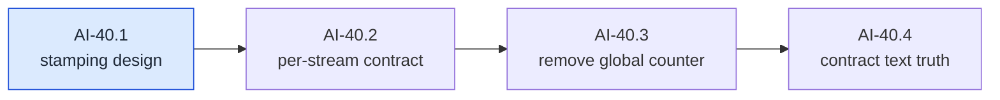

#### AI-40.1 — Stamping design `[decision]`

- **Closing checklist:**
  1. Decide who assigns sequence numbers: the map's suggested default is that event constructors become sequence-neutral and a **producer-owned stamper** assigns 1-based values — turning a break across every constructor into a mostly test-side change. The SDD owns the final call.
  2. Decide the migration path for the ~dozen internal tests that depend on absolute sequence values via `resetSequenceCounter()` (`event_test.go`, the package's one internal test file).
  3. Decide what a hand-constructed, never-stamped event carries, and whether validation rejects it at the provider boundary.
- **Depends on:** AI-39.

#### AI-40.2 — Per-stream sequence contract `[leaf]`

- **Test list:**
  1. WHEN two producers stream concurrently THEN **each** stream's first event carries sequence 1 (the shipped `T-AI16-006` asserts `!= 0` and logs gaps as expected; it is rewritten to assert `== 1` and no gaps — expect a reviewer to read the old test as a spec, per the map).
  2. WHEN a stream emits N events THEN sequences are exactly 1…N, contiguous, under `-race`.
  3. Cross-stream sequence overlap is now *permitted and meaningless* — the rewritten test asserts nothing about ordering across producers.
  4. WHEN a third stream starts after two complete THEN it also starts at 1 (no residual process state).
  5. No remaining test depends on process-wide sequence state — the internal reset helper's ~dozen client tests are migrated to per-stream expectations.
- **Depends on:** AI-40.1.
- **Out of scope:** gap *detection* helpers (AI-20.3); conformance enforcement (AI-21).
- **Split if:** the constructor-signature blast radius exceeds the review budget — then AI-40.2 keeps the new contract behind the stamper and AI-40.3 becomes the chained PR.

#### AI-40.3 — Remove the process-global counter `[guard]`

- **Test list:**
  1. A mechanical scan (AST or grep, in the shipped guard style) asserts the two identifiers `sequenceCounter` and `resetSequenceCounter` no longer exist in the package. **Bite proof:** a scratch re-introduction fails the scan; recorded, dropped.
  2. If nothing needs package internals after the removal, `event_test.go` converts to the external-test convention; if something still does, its header justification is updated to name it — either way the file's opening comment matches its package clause (an objective, reviewable artifact).
- **Depends on:** AI-40.2.

#### AI-40.4 — Contract text tells the truth `[guard]`

- **Test list:**
  1. The shipped doc-guard convention (byte-suffix scan of `doc.go`) is updated so the AI-40 paragraph is appended and guarded like AI-08 … AI-16's; a mechanical scan asserts the retired contradiction sentence ("MAY interleave their sequence values") appears nowhere in the package.
- **Depends on:** AI-40.3.
- **Note:** the full prose-accuracy sweep — every sequencing claim in `event.go` and the provider preamble matches the new behavior — is the milestone verify-report's checklist, not a test; only its mechanical fragments live here.

### AI-41 — Make content parts readable from another package

SDD change: `cachicamas-ai-contentpart-accessors` · Closes: **C2** — the hard blocker on AI-24.

**Charter**

- **Goal:** Close review finding **C2**. The text, tool-call and tool-result wrappers are unexported and expose only their discriminator, so **a provider adapter in another package cannot read content back out of a request**.
- **Deliverable:** A readable accessor for every content-part variant, and a reconciliation of the two competing strategies now in the package — the reasoning type implements the part interface directly and is therefore inspectable; the other three are wrapped and are not.
- **Acceptance:** An external-package test can extract text, tool-call arguments and tool-result content from a constructed request.
- **Depends on:** AI-39. · **Blocks:** **AI-24 (hard blocker — request translation is structurally impossible without this)**, AI-19, AI-21.
- **Note:** The reasoning type's own GoDoc already explains why direct implementation was chosen for inspectability, in terms that apply verbatim to the three types that actually carry payload data.

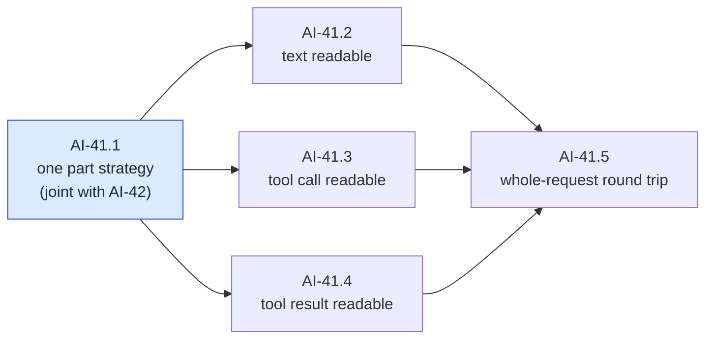

#### AI-41.1 — One content-part strategy `[decision]`

- **Closing checklist:**
  1. Reconcile the two shipped strategies **in the direction the reasoning type already chose** (direct interface implementation, unexported fields, invalid zero value — its own GoDoc at `reasoning.go` argues the case "in terms that apply verbatim" to the other three, per the map). The SDD may choose differently but must rebut that argument.
  2. The chosen strategy must simultaneously satisfy AI-41 (payload readable from another package) and AI-42 (zero value cannot validate) — this checklist item is the shared edge with AI-42.1.
  3. Decide the fate of the three unexported wrappers (`textPart`, `toolCallPart`, `toolResultPart` in `content.go`) and of the accidental partial escape (`part.(ai.Text)` works only for hand-built values, not constructed ones).
- **Depends on:** AI-39.

#### AI-41.2 — Text is readable `[leaf]`

- **Test list:**
  1. WHEN an external-package test builds a request containing a constructed text part THEN it can read the exact text back through the public surface.
  2. Discriminator and payload agree: the part that reports the text kind yields text, never a zero payload.
  3. Every construction-rule violation (empty, whitespace-only, over-length) still fails exactly as shipped — readability adds no new construction path.
- **Depends on:** AI-41.1.
- **Out of scope:** the zero-value seal (AI-42.2); tool parts (siblings).

#### AI-41.3 — Tool call is readable `[leaf]`

- **Test list:**
  1. An external-package test reads a constructed tool call's identity and its **exact argument bytes** back out of a message.
  2. Argument bytes survive unmodified — no re-marshalling, no key reordering (byte-equality assertion; this is what AI-24 will depend on).
- **Depends on:** AI-41.1. **Parallel with:** AI-41.2, AI-41.4.

#### AI-41.4 — Tool result is readable `[leaf]`

- **Test list:**
  1. An external-package test reads a constructed tool result's call correlation and content back out of a message.
  2. Correlation identity round-trips exactly (the future synthetic-ID mapping from the leakage register row 7 hangs off this).
- **Depends on:** AI-41.1. **Parallel with:** AI-41.2, AI-41.3.

#### AI-41.5 — Whole-request round trip `[leaf]`

- **Test list:**
  1. WHEN an external-package test walks a request holding every part variant (text, reasoning, tool call, tool result) THEN it can reconstruct an equal request from what it read — the property AI-24's translator needs, proven before AI-24 exists.
  2. *(pin)* The walk's kind handling is exhaustive over the registered kinds, mirroring the shipped registration-order pin — adding a kind without a readable accessor fails the pin.
- **Depends on:** AI-41.2, AI-41.3, AI-41.4.
- **Out of scope:** translation to any wire shape (AI-24).

### AI-42 — Close the content-part construction bypass

SDD change: `cachicamas-ai-text-seal` · Closes: **C1**. Parallel with AI-41 after the shared decision.

**Charter**

- **Goal:** Close review finding **C1**. The exported text value type satisfies the content-part interface directly, so its zero value is a valid part that passes message validation and bypasses every construction rule.
- **Deliverable:** A seal that actually seals, plus correction of the package comment that currently claims this is already prevented.
- **Acceptance:** A zero-value text part cannot reach a request; the claim in the package comment is true.
- **Depends on:** AI-39. **Parallel with:** AI-41. · **Blocks:** AI-24.
- **Note:** Not theoretical — a zero-value text part serializes to an empty text block, which at least one provider rejects at the API.

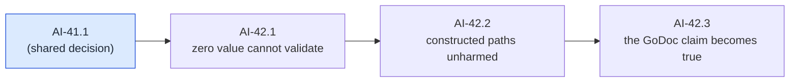

#### AI-42.1 — A zero-value text part cannot reach a request `[leaf]`

- **Test list:**
  1. **Red first, against shipped behavior:** a zero-value exported text value placed directly into message content currently passes validation with empty text (the C1 bypass — `Text.Kind()` at `text.go:91-94` makes it a valid part). The new test asserts it is rejected; it fails today by construction.
  2. WHEN a message containing any unconstructed (zero or hand-rolled) text part is validated THEN validation fails with a typed, `errors.Is`-matchable sentinel.
  3. WHEN the request-level validation runs THEN the same value cannot arrive via the request path either (defense at both boundaries, matching shipped validation ordering).
- **Depends on:** AI-41.1.
- **Out of scope:** reasoning/tool parts — already sealed by unexported fields + invalid zero state; a regression item lives in AI-42.2.

#### AI-42.2 — Constructed paths are unharmed `[leaf]`

- **Test list:**
  1. *(pin)* Every shipped construction path (text, reasoning, tool call, tool result constructors) still validates and round-trips — the full shipped test suite stays green unmodified except tests that asserted the bypass.
  2. *(pin)* The zero values of the *other* three part types remain detectably invalid, so the C1 class cannot reopen elsewhere.
- **Depends on:** AI-42.1.

#### AI-42.3 — The sealing claim becomes true `[guard]`

- **Test list:**
  1. A guard pins the seal mechanically. **Bite proof:** the PR records a scratch attempt to smuggle an unvalidated part into a valid message, failing; recorded, dropped.
- **Depends on:** AI-42.2.
- **Note:** correcting the `content.go` GoDoc claims ("callers MUST go through the constructor", "cannot bypass validation") to match the now-true reality is the verify-report's checklist item.

---

## Wave 4 — Prove the contracts

### AI-17 — Define validation error taxonomy

SDD change: `cachicamas-ai-validation-errors`.

**Charter**

- **Goal:** Separate caller-contract failures from network/provider failures.
- **Deliverable:** Typed validation errors with stable `errors.Is`/`errors.As` behavior.
- **Acceptance:** Invalid requests fail before a stream goroutine or HTTP request starts.
- **Depends on:** AI-09.
- **Out of scope:** Provider status-code mapping.

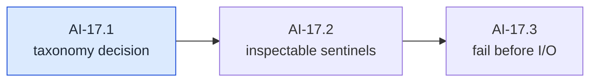

#### AI-17.1 — Taxonomy boundary decision `[decision]`

- **Closing checklist:**
  1. Define the line between a *caller-contract* failure (invalid request — the caller's bug) and a *provider/transport* failure (AI-18's territory), and how the ~40 shipped validation sentinels map into it without renaming any.
  2. Decide whether validation failures aggregate (report all) or short-circuit (first failure) — the shipped convention is ordered first-failure; keeping it is the default.
- **Depends on:** AI-39.

#### AI-17.2 — Sentinels are inspectable `[leaf]`

- **Test list:**
  1. Every validation failure is `errors.Is`-matchable to its sentinel through at least one layer of wrapping.
  2. WHEN a failure carries positional context (which message, which part) THEN `errors.As` extraction works and the message text never carries content bodies (redaction posture starts here, not at AI-34).
- **Depends on:** AI-17.1.

#### AI-17.3 — Invalid requests fail before I/O `[leaf]`

- **Test list:**
  1. WHEN an invalid request is streamed THEN the call fails pre-stream — nil channel, no goroutine started, no HTTP attempted (the shipped pre-stream/mid-stream split in the provider contract).
  2. WHEN the context is already cancelled at call time THEN the same pre-stream path reports it — the shipped pre-stream contract's cancellation-before-validation behavior, regardless of what AI-39.6 did with the helper that used to document it.
- **Depends on:** AI-17.2.

### AI-18 — Define provider error taxonomy

SDD change: `cachicamas-ai-provider-errors` · Closes: **C4** and half of **G8**. This is the wave's keystone: AI-19 and AI-21 are blocked on it.

**Charter**

> **Amended 2026-07-30. This milestone owns review finding C4.** The provider interface and the terminal-kind helper both declare that a stream ends with exactly one completion event **or** one error event — but no error payload type exists and the payload interface is sealed, so **no adapter can construct the error terminal today**. AI-16 shipped the contract before AI-18 enabled it.
>
> Deliverable gains: a terminal error payload implementing the sealed payload interface, its constructor, and its accessor. Deliverable also gains a **partial-output discriminator** (finding G8), so a mid-stream disconnect after emitted events is distinguishable from a pre-stream failure — that is the most common real-world failure and the one naive retry logic excludes.
>
> Acceptance gains: after this milestone an adapter can actually emit the terminal error the provider interface declares mandatory. `Depends on:` gains AI-16 (shipped).

- **Goal:** Normalize authentication, authorization, rate limit, unavailable, timeout, cancellation, malformed response, unsupported capability, and unknown failures.
- **Deliverable:** Typed errors carrying safe metadata and retry hints.
- **Acceptance:** Error strings never require secrets or full response bodies; wrapped causes remain inspectable.
- **Depends on:** AI-01, AI-16, AI-17.
- **Out of scope:** Automatic retry behavior.

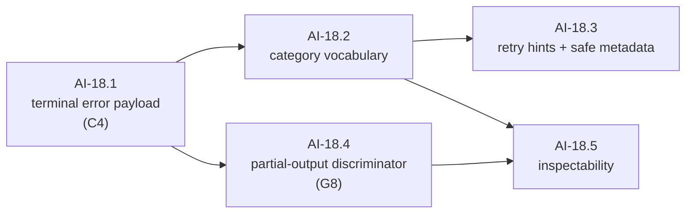

#### AI-18.1 — The terminal error event becomes constructible `[leaf]`

- **Test list:**
  1. **Red first, against shipped behavior:** the error event kind is registered but has no payload — 8 payloads exist for 12 kinds, and the sealed payload interface means no adapter can construct the terminal that the provider contract declares mandatory. The first test constructs an error event through a new public constructor and fails today by absence.
  2. WHEN an error event is constructed THEN it satisfies the shipped envelope invariants: kind derived from payload, validation catches nil/mismatch, terminal-kind helper reports it terminal.
  3. Terminal exclusivity is expressible: a stream can end in completion **or** error, and the payload cannot be confused with a completion payload.
- **Depends on:** AI-17.1 (the taxonomy line). The map's AI-18 entry adds no AI-40 edge, and constructing a payload does not touch sequencing — the keystone is deliberately not gated on the sequence rework.
- **Out of scope:** which categories exist (AI-18.2); emission by a real adapter (AI-30).

#### AI-18.2 — Category vocabulary `[leaf]`

- **Test list:**
  1. The taxonomy distinguishes, at minimum: authentication, authorization, rate limit, unavailable/overloaded, timeout, cancellation, malformed response, unsupported capability, unknown — each constructible, each distinguishable.
  2. WHEN a provider reports a category the vocabulary does not model THEN it maps to unknown **with the raw provider label preserved** for diagnostics (the lesson from every normalizer that crashed on a novel value).
  3. Category membership is closed and enumerable, so AI-21's conformance suite can iterate it exhaustively.
- **Depends on:** AI-18.1.
- **Split if:** category-specific metadata (e.g. rate-limit reset) grows the list past 7 items — metadata then becomes AI-18.6, appended.

#### AI-18.3 — Retry hints and safe metadata `[leaf]`

- **Test list:**
  1. Every category carries a machine-readable retryability signal; the classification lives here (Layer 1, where the wire evidence is), the *decision* to retry lives one layer up — seam 7 of the v2 reference.
  2. WHEN a provider supplies a retry-after duration THEN it is carried typed (never re-parsed from message text by callers).
  3. Error strings never require secrets or response bodies to be useful; machine fields (status class, provider request ID where one exists) are separate from human text.
- **Depends on:** AI-18.2.
- **Out of scope:** backoff execution (AI-33); redaction adversarial tests (AI-34).

#### AI-18.4 — Partial-output discriminator `[leaf]`

- **Test list:**
  1. A terminal error states whether normalized output events preceded it — pre-stream failure, mid-stream failure with zero output, and mid-stream failure after output are three distinguishable shapes.
  2. WHEN a consumer holds the terminal error THEN it can decide "is naive retry safe?" from the error alone, without replaying the stream (the single most common real failure, per the map's G8 amendment).
- **Depends on:** AI-18.1. **Parallel with:** AI-18.2.

#### AI-18.5 — Inspectability `[leaf]`

- **Test list:**
  1. `errors.Is`/`errors.As` reach category, retryability, and the wrapped cause through at least one wrap.
  2. The terminal error *event payload* and the pre-stream *returned error* expose the same taxonomy — one vocabulary, two delivery paths (the shipped contract's split).
- **Depends on:** AI-18.2, AI-18.4.

### AI-19 — Build a scripted fake provider

SDD change: `cachicamas-ai-fake-provider`. Everything Layer 2 will ever test against starts here; the walking skeleton is deliberately the first node.

**Charter**

> **Amended 2026-07-30:** `Depends on:` gains **AI-40** and **AI-41**. The fake must script a terminal error (impossible before AI-18), start each scripted stream at sequence 1 (impossible before AI-40), and inspect request content to assert what it received (impossible before AI-41).

- **Goal:** Let Layer 1 and future Layer 2 tests script events, delays, failures, and cancellation without network access.
- **Deliverable:** Test-only or exported testing package implementing the provider interface.
- **Acceptance:** Tests can script a text response, tool call, terminal error, blocked stream, and context cancellation deterministically.
- **Depends on:** AI-16, AI-18.
- **Out of scope:** Mocking a particular vendor wire format.


#### AI-19.1 — Walking skeleton: a scripted text response `[leaf]`

- **Test list:**
  1. WHEN a test scripts "start, two text deltas, complete" THEN draining the stream yields exactly those events, sequenced 1…N, terminated by channel close — no network, fully deterministic.
  2. The fake satisfies the provider interface from an external package (it lives in the sibling test package, next to the shipped signature guard).
  3. Two fakes streaming concurrently are independent (per-stream sequencing proven at the consumer, exercising AI-40).
- **Depends on:** AI-16 (shipped), AI-40.2 (the per-stream contract — not AI-40's doc-guard tail).
- **Out of scope:** every other script shape (siblings).

#### AI-19.2 — Scripted tool call `[leaf]`

- **Test list:**
  1. A scripted call streams start → deltas → end and reconstructs to exact argument bytes.
  2. A scripted call streams start → end with **zero deltas** (the delta-optional contract of the AI-15 amendment) and consumers cannot tell the difference after reconstruction.
  3. Interleaved scripted calls reconstruct independently.
- **Depends on:** AI-19.1.

#### AI-19.3 — Scripted terminal error `[leaf]`

- **Test list:**
  1. A script can end in a terminal error of any AI-18 category, with and without prior output (both partial-output discriminator states).
  2. After the terminal error, the channel closes and nothing follows (terminal exclusivity observed).
- **Depends on:** AI-19.1, AI-18.1, AI-18.2, AI-18.4.

#### AI-19.4 — Delays and the blocked stream `[leaf]`

- **Test list:**
  1. A script can hold the stream open without emitting (for consumer-timeout testing) and release on demand.
  2. A script can emit faster than an unread consumer drains, deterministically exercising the buffer-full path (the shipped saturated-channel drop contract).
- **Depends on:** AI-19.1.
- **Note:** no scripted schedule may rely on wall-clock sleeps in assertions — coordination is by synchronization points. A test-kit authoring rule enforced in review, not a behavior of the fake.

#### AI-19.5 — Cancellation fidelity `[leaf]`

- **Test list:**
  1. WHEN the consumer cancels mid-script THEN the fake behaves exactly as the provider contract requires: bounded-time close, late events dropped, no terminal event on the saturated path — the fake must be *contract-faithful*, not merely convenient, or Layer 2 learns the wrong physics.
  2. WHEN cancellation precedes the call THEN the fake takes the pre-stream path (nil channel, typed error).
- **Depends on:** AI-19.1.

#### AI-19.6 — Request capture `[leaf]`

- **Test list:**
  1. WHEN a test streams a request through the fake THEN it can assert afterwards on everything the request carried — model, message content (via AI-41 readability), tools, options.
  2. Captured requests are copies or immutable — later caller mutation cannot corrupt recorded history.
- **Depends on:** AI-19.1, AI-41.5.

#### AI-19.7 — Scripted reasoning `[leaf]`

- **Test list:**
  1. A script can stream reasoning content — deltas, a round-trip token, and the terminal shape — and the drained events carry the token byte-exact.
  2. Redacted and signature-only (token, no text) reasoning shapes are scriptable (the AI-45.3 variants, available to Layer 2's tests).
  3. Scripted reasoning never appears in text events (the fake enforces the same wall the real adapter must).
- **Depends on:** AI-19.1, AI-45.

#### AI-19.8 — Sequential-call scripting `[leaf]`

- **Test list:**
  1. WHEN consecutive stream calls hit one fake THEN they consume consecutive scripts (call one → a tool call, call two → final text) — the multi-turn shape every Layer 2 agent-loop test is made of.
  2. WHEN the script queue is exhausted THEN the next call fails the test loudly — never hangs, never repeats the last script.
- **Depends on:** AI-19.1.

### AI-20 — Build stream recording and assertion helpers

SDD change: `cachicamas-ai-stream-testkit`.

**Charter**

- **Goal:** Make event-order and goroutine-lifecycle assertions concise and repeatable.
- **Deliverable:** Package-importable drain/record helpers, timeout-safe assertions, and leak-sensitive test patterns; unlike AI-19, this milestone provides assertions rather than a provider implementation.
- **Acceptance:** A broken producer cannot hang the test suite indefinitely; event differences are readable.
- **Depends on:** AI-19.
- **Out of scope:** General-purpose testing framework.

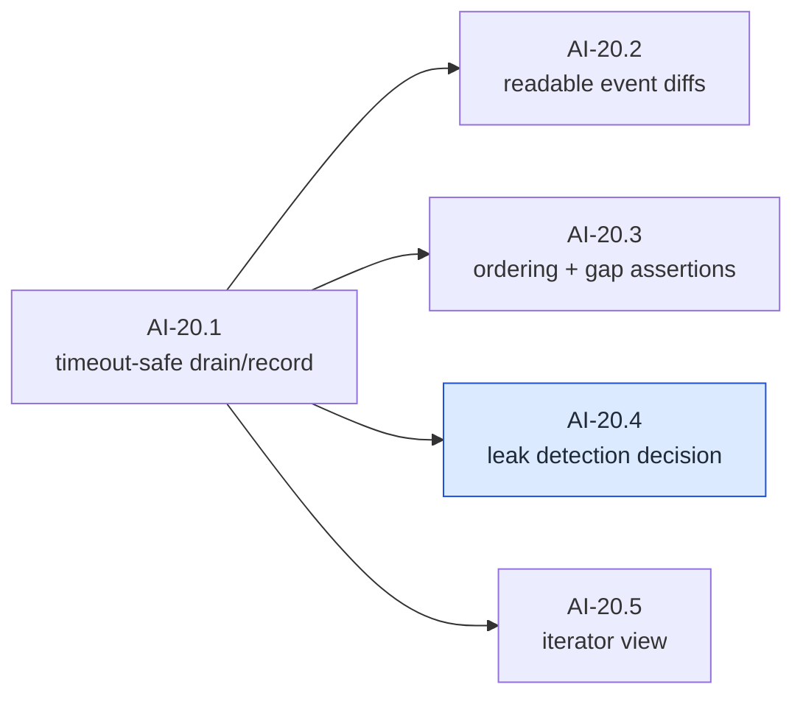

#### AI-20.1 — Timeout-safe drain and record `[leaf]`

- **Test list:**
  1. WHEN a producer never closes THEN the drain helper fails the test with a deadline, never hangs the suite (the map's acceptance: a broken producer cannot hang the run).
  2. WHEN a stream completes THEN the recording preserves every event in order, reusable across assertions.
- **Depends on:** AI-19.1.

#### AI-20.2 — Readable event diffs `[leaf]`

- **Test list:**
  1. WHEN an expected and actual event sequence differ THEN the failure output localizes the first divergence (index, kind, payload summary) — without printing content bodies verbatim beyond a bounded excerpt.
- **Depends on:** AI-20.1.

#### AI-20.3 — Ordering and gap assertions `[leaf]`

- **Test list:**
  1. Helpers assert: starts-at-1, contiguity, exactly-one-terminal, kind-ordering legality (start before delta before end, per the shipped envelope docs) — the per-stream guarantees AI-40 created, packaged for reuse.
  2. WHEN a sequence gap exists THEN the gap assertion reports it precisely (this is where the shipped `TODO(ai-20)` gap-detection debt lands).
- **Depends on:** AI-20.1, AI-40.

#### AI-20.4 — Leak-detection approach `[decision]`

- **Closing checklist:**
  1. Choose the goroutine-leak detection mechanism: a third-party detector requires **its own ADR** (no new top-level dependency without one — openspec rule); the alternative is a hand-rolled before/after goroutine accounting helper in the test kit. Either way the abandoned-consumer and cancellation paths get leak assertions.
  2. Decide where it applies by default (every stream test? opt-in?) and its interaction with `t.Parallel()`.
- **Depends on:** AI-20.1.

#### AI-20.5 — Iterator view `[leaf]`

- **Test list:**
  1. The test kit exposes an iterator-shaped view over an event channel (the AI-47 default's ergonomic half): loop, terminal error surfaced after the loop, cancellation respected.
  2. *(pin)* The package boundary still speaks channels: the shipped interface signature guard continues to name a channel, unmodified — the mechanical form of AI-47's decision.
- **Depends on:** AI-20.1, AI-47.

### AI-21 — Create provider conformance suite

SDD change: `cachicamas-ai-conformance-suite`. The suite is the reason a second adapter will ever be cheap; every required case is a node so that omissions are visible.

**Charter**

> **Amended 2026-07-30:** the suite gains two required cases — a **tool call delivered whole, with zero delta events** (finding G12a), and a **mid-stream disconnect that preserves partial output** (finding G8). Both are behaviours a real provider exhibits and neither is exercised by a naive happy-path suite. `Depends on:` gains AI-40, since a conformance suite written against the process-global sequence counter would freeze that bug permanently.

- **Goal:** Define behavior every concrete adapter must pass.
- **Deliverable:** Reusable contract tests for text, tools, completion, errors, cancellation, stream closure, and redaction.
- **Acceptance:** A provider factory can be plugged into the suite without copying assertions.
- **Depends on:** AI-18, AI-20.
- **Out of scope:** Live API credentials.

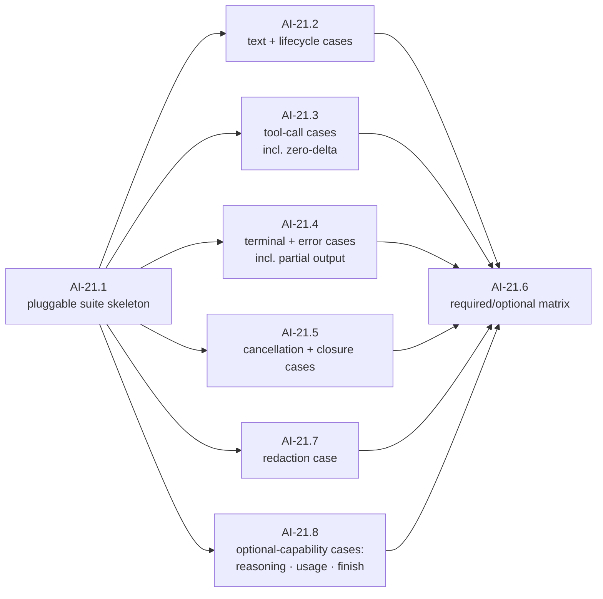

#### AI-21.1 — Pluggable suite skeleton `[leaf]`

- **Test list:**
  1. WHEN a provider factory is plugged in THEN the suite runs every case against it without copied assertions (the map's acceptance) — proven by running it against the AI-19 fake as its first subject.
  2. A suite case can be marked required or optional-capability; skips are explicit and reported, never silent.
- **Depends on:** AI-19, AI-20.

#### AI-21.2 — Text and lifecycle cases `[leaf]`

- **Test list:**
  1. Start → text deltas → complete: order legal, sequence contiguous from 1, concatenated deltas reconstruct the text exactly (including a case with a multi-byte rune split across deltas, per the shipped UTF-8 boundary contract).
  2. Empty completion (no content blocks) is legal and distinguishable from failure.
- **Depends on:** AI-21.1.

#### AI-21.3 — Tool-call cases `[leaf]`

- **Test list:**
  1. Fragmented call: interleaved deltas across two calls reconstruct independently with exact bytes.
  2. **Whole call, zero deltas** — required by the AI-15 amendment; a suite without it would certify a broken adapter for at least one real provider.
  3. Call ordinal is observable so results can rejoin in call order (the G5 forward requirement's Layer 1 half).
  4. Mixed-content response: text block(s) then tool-call block(s) in one response, ending in the tool-call finish reason, reconstructs both — the dominant real agent-loop shape, and heterogeneous-block state bleed is a distinct bug from two-tool interleave.
- **Depends on:** AI-21.1.

#### AI-21.4 — Terminal and error cases `[leaf]`

- **Test list:**
  1. Exactly one terminal per stream: completion and error are mutually exclusive; anything after a terminal is a conformance failure.
  2. **Mid-stream failure preserves partial output** and says so via the discriminator — required by the G8 amendment.
  3. Every error category the taxonomy defines is emittable by a conforming adapter's mapping layer (iterated exhaustively via the closed vocabulary).
- **Depends on:** AI-21.1, AI-18.1, AI-18.2, AI-18.4.

#### AI-21.5 — Cancellation and closure cases `[leaf]`

- **Test list:**
  1. Cancel mid-stream: bounded-time close, no goroutine leak (using AI-20.4's mechanism), no send after done.
  2. Abandoned-then-cancelled consumer: producer exits; saturated-drop behavior matches the shipped contract.
- **Depends on:** AI-21.1, AI-20.4.

#### AI-21.7 — Redaction case `[leaf]`

- **Test list:**
  1. The suite plants a distinctive sentinel secret through the provider factory's configuration and asserts it appears in **no** event, error string, or test-failure output the run produces — the map's own required-case list names redaction, and it must be a *suite* case so every future adapter inherits it, not only the first adapter's private hardening (that is AI-34).
- **Depends on:** AI-21.1.

#### AI-21.8 — Optional-capability cases: reasoning, usage, finish `[leaf]`

- **Test list:**
  1. Reasoning cases (optional capability): streamed reasoning never leaks into text events; a round-trip token survives normalization byte-exact; redacted and signature-only shapes normalize to their states. A provider without the capability records "absent", not a silent skip.
  2. Finish-reason case: every normalized finish reason is emittable by a conforming adapter's mapping (iterated over the closed enum, the way AI-21.4 iterates error categories).
  3. Usage case: completion usage is present when the transcript reports it, and absent-vs-zero is honored.
- **Depends on:** AI-21.1, AI-45, AI-46.
- **Out of scope:** the first adapter's own reasoning/usage mapping (AI-27, AI-29) — this node makes the *suite* able to judge any adapter's.

#### AI-21.6 — Required/optional capability matrix `[leaf]`

- **Test list:**
  1. The suite emits a per-provider capability report (reasoning? token counting? which optional cases ran) — the artifact AI-36 records and AI-38 publishes.
  2. A provider failing a *required* case cannot pass the suite; a provider skipping an *optional* case passes with the skip recorded.
- **Depends on:** AI-21.2 … AI-21.5, AI-21.7, AI-21.8.

---

## Wave 4.5 — Close the contract gaps

### AI-43 — Make cache breakpoints expressible

SDD change: `cachicamas-ai-cache-breakpoints` · Closes: **G4** (Layer 1 half). Blocks AI-22 and AI-24.

**Charter**

- **Goal:** Close gap **G4**. The system instruction is a flat string, so there is nowhere to mark a prompt-cache boundary.
- **Deliverable:** Ordered, markable segments for the system instruction, plus breakpoint markers on tool declarations and messages. Markers are advisory — an adapter for an auto-caching provider ignores them.
- **Acceptance:** A request can express a breakpoint set that honours the vendor cap on breakpoint count and the tools → system → messages invalidation ordering, and an adapter can render or ignore it.
- **Depends on:** AI-41, AI-42. · **Blocks:** **AI-22, AI-24**.
- **Out of scope:** Any measurement of actual cache hit rate. Also **out of scope: usage reporting** — the usage type already carries the cache-read and cache-write token counts.

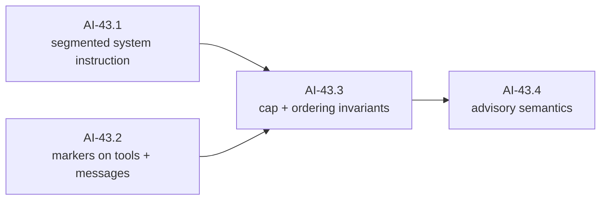

#### AI-43.1 — Segmented system instruction `[leaf]`

- **Test list:**
  1. WHEN a request carries a system instruction as ordered segments THEN segment order and content round-trip exactly through construction and readback (via AI-41's readability).
  2. The shipped flat-string construction path still works, normalizing to a single unmarked segment — additive migration, no caller breaks unannounced.
  3. A segment can carry a cache-boundary marker; marker placement round-trips.
- **Depends on:** AI-41, AI-42.
- **Split if:** migrating the shipped flat-string option's validation rules collides with the segment rules — then normalization becomes AI-43.5.

#### AI-43.2 — Markers on tool declarations and messages `[leaf]`

- **Test list:**
  1. A tool declaration and a message can each carry a cache-boundary marker; the marker survives request construction and readback.
  2. Markers do not participate in message/tool validity — an unmarked request and a marked request validate identically.
- **Depends on:** AI-41, AI-42. **Parallel with:** AI-43.1.

#### AI-43.3 — Cap and ordering invariants `[leaf]`

- **Test list:**
  1. WHEN a request's total marker count exceeds the documented cap THEN request validation fails before I/O (the vendor cap is small and hard; catching it client-side is the point of the seam).
  2. The tools → system → messages invalidation ordering is expressible and documented: the request can state markers in all three regions and an adapter can read them **in that order**.
- **Depends on:** AI-43.1, AI-43.2.

#### AI-43.4 — Advisory semantics `[leaf]`

- **Test list:**
  1. WHEN an adapter ignores every marker THEN the request is still fully translatable — markers are advisory by contract (auto-caching providers ignore them; the leakage register row 9).
  2. *(pin)* The exported usage-related surface is unchanged by this milestone (a golden identifier-list pin) — the cache-accounting half already shipped; this milestone adds request-side expression only.
- **Depends on:** AI-43.3.

### AI-44 — Add per-request options and a provider escape hatch

SDD change: `cachicamas-ai-request-extension-points` · Closes: **G9**. Blocks AI-22, AI-24, and Layer 2's pre-request hook.

**Charter**

- **Goal:** Close gap **G9**. Generation options are fixed at request construction, and there is no way to carry a provider-specific field the neutral vocabulary does not model.
- **Deliverable:** Per-request options, a typed-but-opaque provider pass-through, and copy-on-write rebuilding so a caller can derive a modified request from an existing one.
- **Acceptance:** A provider-specific field survives to its adapter without any other adapter needing to know it exists; a request can be rebuilt without mutating the original.
- **Depends on:** AI-43. · **Blocks:** AI-22, AI-24; and Layer 2's pre-request hook.
- **Note:** The design principle is deliberate and worth restating in the SDD — the correct response to provider divergence is a typed pass-through, **not** a wider neutral vocabulary. Every field added to the neutral model for one provider becomes a field every other adapter must ignore.

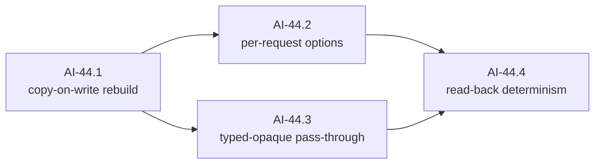

#### AI-44.1 — Copy-on-write rebuild `[leaf]`

- **Test list:**
  1. WHEN a caller derives a modified request from an existing one THEN the original is observably unmodified (deep-compare before/after), and the derived request validates independently.
  2. Deriving is total: every region of the request (messages, tools, options, system segments) is reachable by the rebuild path — this is the seam the pre-request hook stands on.
- **Depends on:** AI-43 (segments exist first, so the rebuild covers them).

#### AI-44.2 — Per-request options `[leaf]`

- **Test list:**
  1. WHEN a per-request option overrides a construction-time option THEN the effective value is the override, observable via readback; absent overrides fall through.
  2. Option validation runs at derive time with the same sentinels as construction (no second, weaker validation path).
- **Depends on:** AI-44.1.

#### AI-44.3 — Typed-but-opaque pass-through `[leaf]`

- **Test list:**
  1. WHEN a caller attaches a provider-namespaced opaque value THEN it survives to the adapter that claims the namespace, byte-exact.
  2. WHEN an adapter for a *different* provider translates the same request THEN the foreign value is invisible to it and translation is unaffected — the register's design rule: a pass-through, not a wider neutral vocabulary.
  3. The pass-through is inert in equality/validation: two requests differing only in another provider's namespace still validate identically.
- **Depends on:** AI-44.1.

#### AI-44.4 — Read-back determinism `[leaf]`

- **Test list:**
  1. Reading or iterating the option set and the pass-through values of one request twice yields identical order and content — the extension surfaces expose no map-iteration nondeterminism to a future serializer.
- **Depends on:** AI-44.2, AI-44.3.
- **Out of scope:** wire-byte determinism — owned by AI-24.1/AI-24.4, where wire bytes first exist; this node only guarantees the neutral surface cannot be the source of the nondeterminism.

### AI-45 — Carry a reasoning round-trip token

SDD change: `cachicamas-ai-reasoning-roundtrip` · Closes: **G12(b)**. Blocks AI-27.

**Charter**

- **Goal:** Close gap **G12(b)**. Reasoning content exposes its state and its text and cannot carry a provider blob that must be returned byte-identical.
- **Deliverable:** An opaque round-trip token on reasoning content, never interpreted by cachicamas, preserved exactly through normalization and session persistence.
- **Acceptance:** A reasoning block survives a full round trip byte-for-byte; nothing in Layer 1 parses or reformats it.
- **Depends on:** AI-41. · **Blocks:** AI-27.
- **Note:** Correctness, not metadata. At least one provider signs thinking blocks cryptographically; if the signature is not returned exactly, multi-turn extended thinking with tool use fails.

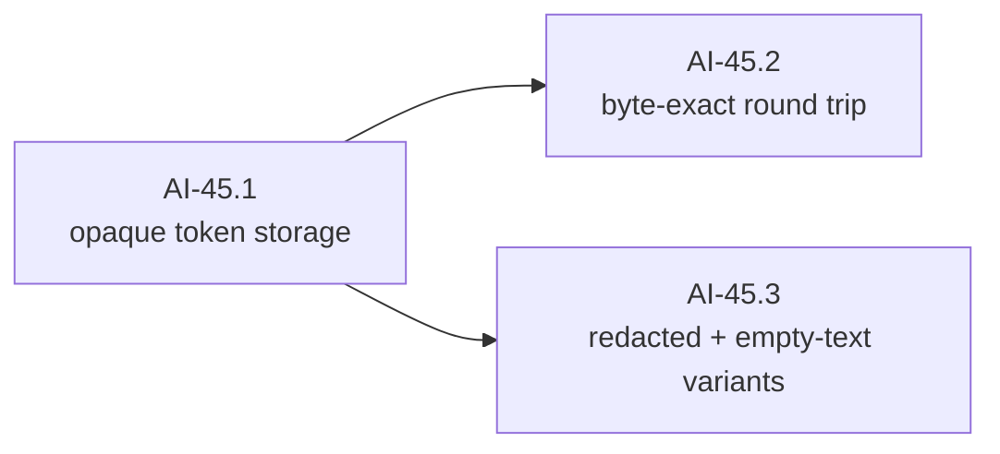

#### AI-45.1 — Opaque token storage `[leaf]`

- **Test list:**
  1. Reasoning content can carry an opaque provider token alongside its state and text; absence is distinguishable from an empty token.
  2. Nothing in the package interprets, validates, or length-caps the token beyond a sanity bound — it is a byte carrier, per the map ("never parsed, never reformatted").
- **Depends on:** AI-41 (the strategy decision fixed how reasoning exposes payloads).

#### AI-45.2 — Byte-exact round trip `[leaf]`

- **Test list:**
  1. WHEN a reasoning part with a token is placed in a request, read back, and re-attached THEN the token is byte-identical — including tokens containing every byte class (binary, high Unicode, embedded NULs).
  2. The property holds through message copy and request rebuild — the paths session persistence will later travel.
- **Depends on:** AI-45.1, AI-44.1 (the rebuild path must exist before the property can cover it — a deliberate cross-milestone edge the map's coarser graph does not draw).

#### AI-45.3 — Redacted and empty-text variants `[leaf]`

- **Test list:**
  1. A **redacted** reasoning part carries its opaque payload byte-exact (at least one provider ships encrypted redacted blocks that must replay verbatim).
  2. A reasoning part with a token but **no text** is constructible and valid — a real provider shape (signature-only blocks), and the "provider emitted no reasoning text" state from the leakage register row 2.
- **Depends on:** AI-45.1.

### AI-46 — Add refusal and pause finish reasons

SDD change: `cachicamas-ai-finishreason-refusal-pause` · Closes: **G12(c)**. Depends only on AI-39 (the relocation gates everything) — the earliest schedulable milestone after it.

**Charter**

- **Goal:** Close gap **G12(c)**. Refusal and pause-turn both collapse into the unknown fallback.
- **Deliverable:** Two additional finish reasons, added additively to the frozen enum.
- **Acceptance:** Layer 2 can distinguish "the model declined", "the model paused, resume it", and "I do not recognise this provider string" — three states with three different correct responses.
- **Blocks:** AI-29.
- **Note:** This is a loop-termination bug, not a cosmetic gap.

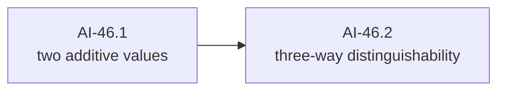

#### AI-46.1 — Two additive values `[leaf]`

- **Test list:**
  1. Refusal and pause are added to the frozen 6-value enum **additively**: every shipped value, string form, and normalization mapping is unchanged (regression pin over the whole shipped table).
  2. The provider-string normalization maps the known refusal/pause synonym families to the new values instead of unknown; the mapping remains lowercased/trimmed like the shipped table.
- **Depends on:** AI-39.
- **Out of scope:** the shipped no-raw-retention design (deliberate; not reopened here). Note that refusal already differs from content-filter in the shipped table — the SDD must state the line between them.

#### AI-46.2 — Three-way distinguishability `[leaf]`

- **Test list:**
  1. "The model declined", "the model paused — resume it", and "unrecognized provider string" are three distinct values with three distinct behaviors under exhaustive switch — the loop-termination bug the map describes is structurally impossible to reintroduce without a compile-visible change.
  2. An exhaustiveness pin (mirroring the shipped all-kinds registration pattern) fails when a future value is added without updating consumers' known set.
- **Depends on:** AI-46.1.

### AI-47 — Close the stream-carrier decision

SDD change: `cachicamas-ai-stream-carrier-decision` · Closes: **G13**. Decision only.

**Charter**

- **Goal:** Close gap **G13**. Re-evaluate the receive-only channel against a range-over-func iterator at the package boundary, **before** a concrete adapter exists.
- **Deliverable:** **A decision, no production code.**
- **Acceptance:** The decision is recorded with its rationale, and it is closed before AI-22 starts.
- **Depends on:** AI-16. · **Blocks:** AI-22.
- **Note — documented default: keep channels**, and expose an iterator view from the AI-20 test kit for ergonomics. The canonical objection — a consumer who stops reading strands the producer goroutine — is already closed by the v1 contract, which selects on cancellation for every send and makes the caller's context the sole liveness signal. What remains is a caller who abandons the stream *and* never cancels, which is a contract violation rather than a design flaw. Against that, switching carriers now would invalidate AI-16's interface signature guard and its behavioural scenarios, merged days ago.

#### AI-47.1 — Record the carrier decision `[decision]`

- **Closing checklist:**
  1. Channel vs range-over-func iterator at the package boundary, decided with rationale, before AI-22 starts. **Documented default: keep channels** — the stranded-producer hazard is already closed by the shipped select-on-cancellation send discipline, and switching would invalidate the shipped interface signature guard and behavioral scenarios.
  2. If channels stay: the iterator-ergonomics requirement is delegated to AI-20.5 (test kit view), and the decision says so.
  3. If iterators win: this document's wave-4 and wave-5 graphs gain amendment nodes (the living-graph clause applies to the plan itself).
- **Depends on:** AI-16 (shipped), AI-39 (the relocation gates everything after AI-16, decision-only work included).

---
## Wave 5 — Connect the vendor

> **Framing assumption, stated once.** AI-22 owns the vendor and transport choice. The graphs for AI-24 … AI-30 are written against the documented default assumption — HTTPS with server-sent-event-style framing, the shape every candidate vendor's streaming API takes today. If AI-22 selects a transport that is not SSE-shaped, the affected nodes (chiefly inside AI-25) are re-derived under the living-graph clause; the node *structure* (framing decoded separately from semantics) survives any such choice, because it is the two-layer decomposition every mature SDK converged on independently.

### AI-22 — Select first provider and transport

SDD change: `cachicamas-ai-first-provider-decision`.

**Charter**

> **Amended 2026-07-30:** `Depends on:` gains **AI-43, AI-44, AI-47** — all of wave 4.5 must be closed first. Acceptance gains four questions the decision must answer explicitly, because each is a documented cross-provider divergence ([v2 architecture § 3.3](../0001-cachicamas-agent-stack-v2.md#33-the-provider-leakage-register)): how this provider expresses cache breakpoints (or whether it caches automatically); whether tool results are a block in a user-role message, a distinct role, or a nested object; whether an explicit output-token limit is mandatory; and whether the provider assigns tool-call identifiers at all.

- **Goal:** Choose the first vendor/protocol and `net/http` versus SDK using evidence.
- **Deliverable:** Decision covering capability fit, streaming quality, testability, dependency weight, endpoint configurability, maintenance, and credential handling boundary.
- **Acceptance:** The decision names one first adapter and explains rejected alternatives. If the transport adds a top-level `go.mod` dependency, its artifact must include or be promoted to the ADR required by `openspec/AGENTS.md` before AI-23 adds that dependency.
- **Depends on:** AI-02, AI-21.
- **Out of scope:** Adapter implementation.

#### AI-22.1 — The provider decision `[decision]`

- **Closing checklist:**
  1. One vendor named; rejected alternatives recorded with reasons (capability fit, streaming quality, testability, dependency weight, endpoint configurability, maintenance, credential-handling boundary).
  2. The four leakage-register questions answered explicitly for the chosen vendor: cache-breakpoint expression (or auto-caching), tool-result message shape, whether an output-token limit is mandatory, whether tool-call identifiers are assigned.
  3. Two questions this graph adds, because wave-5 nodes depend on the answers: does the vendor stream tool-call arguments in fragments or whole (drives AI-28's case weighting), and does it sign reasoning blocks (drives AI-27.2)?
- **Depends on:** AI-21, AI-43 … AI-47 (all of wave 4.5 closed — the map's hard gate).

#### AI-22.2 — The transport decision `[decision]`

- **Closing checklist:**
  1. `net/http` versus vendor SDK, decided with evidence. If the choice adds any `go.mod` dependency, **the ADR required by `openspec/AGENTS.md` exists before AI-23 adds it** — the map makes this a gate, not a formality.
  2. The streaming framing is named precisely (which event/field dialect, which terminal sentinel convention), because AI-25's test fixtures encode it.
- **Depends on:** AI-22.1.

### AI-23 — Provider configuration and client construction

SDD change: `cachicamas-ai-provider-client`.

**Charter**

- **Goal:** Construct the adapter from injected endpoint, credential/token source, HTTP client, and safe defaults.
- **Deliverable:** Adapter shell with testable constructor.
- **Acceptance:** Tests inject `httptest.Server`; invalid endpoint/config fails early; the adapter does not read environment variables itself.
- **Depends on:** AI-22.
- **Out of scope:** Catalog files, login, persistence, request sending.

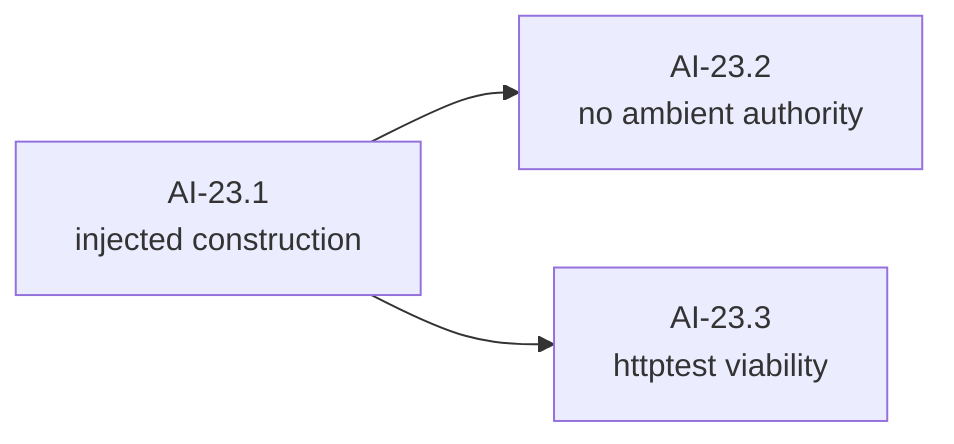

#### AI-23.1 — Injected construction `[leaf]`

- **Test list:**
  1. WHEN the adapter is constructed with endpoint, credential source, and HTTP client injected THEN construction succeeds and the values are used (observable via a stub transport).
  2. WHEN endpoint or credential configuration is invalid THEN construction fails early with a typed error — before any request exists.
  3. Defaults are safe: no default endpoint that silently targets production from a test, no implicit global client mutation.
  4. Defaults kill no streams: the constructed client carries no whole-request timeout (connect and idle bounds only) — a whole-request timeout kills every stream longer than it, surfacing later as a baffling mid-read death; the canonical Go streaming footgun.
  5. Path-bearing and trailing-slash base endpoints (a self-hosted gateway at `…/proxy/v1`) join to correct request paths — no doubled or dropped segments.
- **Depends on:** AI-22.

#### AI-23.2 — No ambient authority `[guard]`

- **Test list:**
  1. The adapter package reads no environment variables and touches no filesystem — proven mechanically with an AST import-and-call scan in the shipped guard style, not by convention.
  2. **Bite proof:** a scratch `os.Getenv` in the adapter fails the guard; recorded, dropped.
- **Depends on:** AI-23.1.

#### AI-23.3 — httptest viability `[leaf]`

- **Test list:**
  1. WHEN the adapter is pointed at an `httptest` server THEN a request reaches it with the configured credential attached in the vendor's expected header shape.
- **Depends on:** AI-23.1.
- **Out of scope:** secrecy assertions — the wire-error-body bound is AI-30.5's; the exhaustive sentinel sweep across all paths is AI-34.1's. This node only proves attachment.

### AI-24 — Translate normalized requests to wire requests

SDD change: `cachicamas-ai-request-translation` · Was structurally impossible before AI-41; that is why its first dependency edge points there. Pure translation, golden-tested, no network. **Likely over one review budget: the node boundaries below are the planned chain points.**

**Charter**

> **Amended 2026-07-30:** `Depends on:` gains **AI-41 (hard blocker)**, AI-42 and AI-43. Until AI-41 lands, this milestone is **structurally impossible** — the content-part wrappers are unexported and expose only their discriminator, so translation code in the adapter package cannot read the text, tool-call arguments or tool-result content out of the request it is translating.
>
> Acceptance gains: consecutive same-role messages are merged where the provider enforces strict alternation; a mandatory output-token limit is supplied from a documented default rather than silently truncating; and synthetic tool-call identifiers, if the provider assigns none, are minted here and recorded so they survive session reload.

- **Goal:** Map system instructions, messages, text, tools, and options into the selected provider request.
- **Deliverable:** Pure translation code and golden/table tests.
- **Acceptance:** No credential appears in serialized test fixtures; unsupported normalized features fail explicitly rather than being dropped silently.
- **Depends on:** AI-09, AI-23.
- **Out of scope:** Network execution and stream parsing.

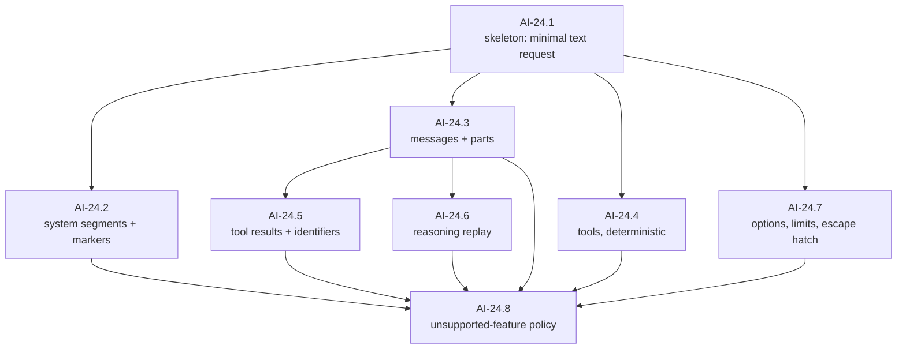

#### AI-24.1 — Skeleton: minimal text request `[leaf]`

- **Test list:**
  1. WHEN a request with one user text message translates THEN the wire body matches a golden fixture byte-for-byte.
  2. Translating the same request twice yields identical bytes (determinism from birth — AI-44.4's property extended to the wire).
  3. No golden fixture contains a credential (fixture-wide sentinel scan, per the map's acceptance).
- **Depends on:** AI-41.5 (the round-trip readability the translator consumes), AI-42, AI-23.

#### AI-24.2 — System segments and cache markers `[leaf]`

- **Test list:**
  1. Ordered system segments render into the vendor's system shape preserving order and content.
  2. Cache-boundary markers render into the vendor's cache annotation (or are dropped whole if AI-22 chose an auto-caching vendor — the advisory contract), at the marked positions, respecting the tools → system → messages hierarchy.
  3. WHEN markers exceed the vendor's cap THEN translation refuses — the request-level cap (AI-43.3) and the vendor cap are reconciled here, and the error names the excess.
- **Depends on:** AI-24.1, AI-43.

#### AI-24.3 — Messages and content parts `[leaf]`

- **Test list:**
  1. Every readable part variant translates: text, reasoning (state-dependent), tool call, tool result — one golden fixture per variant.
  2. WHEN consecutive same-role messages occur THEN they merge if and only if the vendor enforces strict alternation (leakage register row 5 — queued steering messages make this live, not theoretical).
  3. Message order and intra-message part order are preserved exactly.
- **Depends on:** AI-24.1.

#### AI-24.4 — Tools, deterministically `[leaf]`

- **Test list:**
  1. Tool declarations translate with name, description, and schema passed through byte-faithfully.
  2. Tool ordering in the wire body is **deterministic across process runs** — map-iteration order in translation would silently invalidate the vendor's cache prefix on every call: no failure, just a 10× input bill.
  3. Duplicate/invalid tool sets were already rejected at validation (pin — translation never sees them).
- **Depends on:** AI-24.1.

#### AI-24.5 — Tool results and identifiers `[leaf]`

- **Test list:**
  1. Tool results translate into the vendor's result shape (block-in-user-message, distinct role, or nested object — whichever AI-22.1 recorded; leakage register row 4).
  2. IF the vendor assigns no tool-call identifiers THEN synthetic identifiers are minted here, deterministically, and the mapping is exposed so sessions can persist it (register row 7 — the Layer 3 half is out of scope, the mint-and-expose half is this node).
  3. Result-to-call correlation survives translation for interleaved multi-call turns.
- **Depends on:** AI-24.3.

#### AI-24.6 — Reasoning replay `[leaf]`

- **Test list:**
  1. A reasoning part with a round-trip token renders the token **byte-identically** into the wire body — never parsed, never re-encoded (a signed block altered in flight fails the vendor's validation on the next turn; this is correctness, not metadata).
  2. Redacted reasoning replays verbatim as its opaque payload.
  3. Reasoning parts with no text but a token render correctly (the signature-only shape).
  4. Block order within an assistant message is preserved — vendors validate reasoning-block position.
- **Depends on:** AI-24.3, AI-45.

#### AI-24.7 — Options, limits, escape hatch `[leaf]`

- **Test list:**
  1. Every neutral generation option maps to its vendor field; unsupported combinations fail explicitly.
  2. IF the vendor mandates an output-token limit and the request omits one THEN a documented default is supplied — visibly documented, never silently truncating (register row 6).
  3. Escape-hatch values in this vendor's namespace merge into the wire body; foreign namespaces are ignored whole.
- **Depends on:** AI-24.1, AI-44.

#### AI-24.8 — Unsupported-feature policy `[compound]`

Exit check: no expressible request feature can be silently dropped by translation.

##### AI-24.8.1 — The expressible-feature inventory `[decision]`

- **Closing checklist:**
  1. Enumerate every feature a request can express: the base surface plus AI-43's segments and markers plus AI-44's options and pass-through.
  2. Name the mechanism that keeps the inventory honest when the surface grows (a registration list, a reflective walk — the SDD decides), so AI-24.8.2's test fails when a feature is added without a policy entry.
- **Depends on:** AI-24.2 … AI-24.7.

##### AI-24.8.2 — The exhaustive walk `[leaf]`

- **Test list:**
  1. WHEN a request expresses something the vendor cannot receive THEN translation fails with a typed unsupported-capability error naming the feature — dropped-silently is the one forbidden outcome (the map's acceptance).
  2. The policy is total: the inventory-driven walk asserts every feature is either translated or explicitly refused, and grows automatically with the inventory.
- **Depends on:** AI-24.8.1.

### AI-25 — Implement the streaming frame decoder

SDD change: `cachicamas-ai-stream-decoder` · Framing only — no semantic mapping (that is AI-26's front, and keeping the layers separate is the decomposition every mature SDK independently arrived at). Runs **parallel to AI-24** after AI-23.

**Charter**

- **Goal:** Decode the selected transport framing independently from semantic event mapping.
- **Deliverable:** Incremental decoder for split frames, multiple frames per read, keep-alives, EOF, and malformed data.
- **Acceptance:** Arbitrary read boundaries do not change decoded frames; malformed/truncated frames return typed failures.
- **Depends on:** AI-18, AI-23. **Parallel with:** AI-24 after AI-23.


#### AI-25.1 — Skeleton: one frame `[leaf]`

- **Test list:**
  1. WHEN a well-formed single frame arrives in one read THEN the decoder yields exactly one frame with its event name and data intact.
  2. Frames are yielded in arrival order; the decoder is a pure incremental function over bytes (no HTTP, no goroutines) — independently testable forever.
- **Depends on:** AI-22.2 (framing named), AI-23 (the map's edge — the decoder itself is pure, but the edge sequences the SDDs inside one adapter package). **Parallel with:** AI-24.

#### AI-25.2 — Field grammar `[leaf]`

- **Test list:**
  1. Field parsing matches the framing spec: name/value split at the first colon, exactly one leading space stripped from values, a field line with no colon treated as an empty-value field.
  2. Multi-line data fields concatenate with the spec's separator; the dispatch-time trailing separator is removed.
  3. All three line endings (CRLF, LF, lone CR) terminate lines.
  4. A leading byte-order mark on the stream is stripped once; anywhere else it is content.
  5. An event with an empty data buffer dispatches nothing.
  6. After a dispatch, the event-type and data buffers reset: a following frame with no type line dispatches as the default type, never the previous frame's — spec-mandated, latent until a dialect omits the type line.
  7. The framing's last-event-id and retry-interval fields have a pinned disposition (ignoring them is fine, but by test, not by accident), including identifier values containing NUL.
- **Depends on:** AI-25.1.

#### AI-25.3 — Chunk-boundary re-entrancy `[leaf]`

- **Test list:**
  1. WHEN a frame is split across reads at **any byte offset** — including mid-field-name, mid-rune, and between the CR and LF of a CRLF — THEN decoded output is identical to the unsplit case.
  2. The property is proven mechanically: every golden transcript replayed split at every byte offset yields identical frames (the fuzz that catches the classic phantom-blank-line bug no example-based test finds).
- **Depends on:** AI-25.1.
- **Split if:** the exhaustive-offset replay is too slow for the suite — then a bounded-random-offset variant with a fixed seed becomes AI-25.3.1 and the exhaustive run moves behind a long-test flag as AI-25.3.2.

#### AI-25.4 — Keep-alives and unknowns `[leaf]`

- **Test list:**
  1. Comment lines (the framing's keep-alive idiom) are ignored without disturbing accumulation state.
  2. Unknown field names are ignored; unknown event names are yielded, not dropped (the *semantic* layer decides — new event types are a documented forward-compatibility promise of every candidate vendor).
- **Depends on:** AI-25.2.

#### AI-25.5 — Bounded memory `[leaf]`

- **Test list:**
  1. A single multi-megabyte frame decodes correctly — the 64 KiB default-line-limit trap is a documented real-world failure class, and large tool results will hit it.
  2. A frame exceeding the configured hard cap aborts with a typed error, not unbounded growth — both directions of the trap (truncation and OOM) are pinned.
- **Depends on:** AI-25.1, AI-18.2 (the cap error is typed against the taxonomy).

#### AI-25.6 — EOF discipline `[leaf]`

- **Test list:**
  1. Clean EOF at a frame boundary ends decoding without error.
  2. EOF **mid-frame** yields a typed truncation error, and the buffered partial frame is *not* dispatched as complete — silent truncation is the failure mode that reports success on a half-answer.
- **Depends on:** AI-25.1, AI-18.2 (the truncation error is typed against the taxonomy).

### AI-26 — Translate response lifecycle and text

SDD change: `cachicamas-ai-provider-text-stream` · The adapter's walking skeleton: the first node is the first time a real wire transcript becomes a normalized event stream end-to-end.

**Charter**

- **Goal:** Map provider response-start, text deltas, and completion into neutral events.
- **Deliverable:** End-to-end `httptest` stream for a text-only response.
- **Acceptance:** Event order satisfies AI-11/12/13 and the conformance text cases pass.
- **Depends on:** AI-24, AI-25.
- **Out of scope:** Tool calls and reasoning.

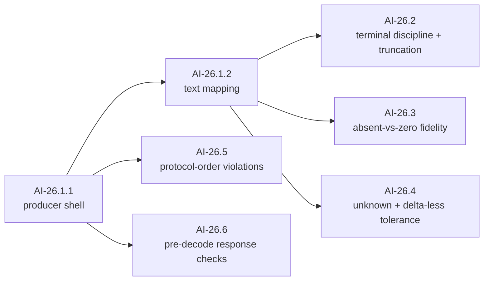

#### AI-26.1 — Skeleton: text end-to-end `[compound]`

Exit check: a recorded text transcript replayed through `httptest` drains as a fully normalized, contract-conformant stream. Pre-split because this is the single largest implementation step in the document — the producer core and the text mapping are separate PRs by design.

##### AI-26.1.1 — Producer shell `[leaf]`

- **Test list:**
  1. WHEN an `httptest` server replays a minimal transcript THEN the consumer observes response start → completion, sequenced from 1, channel closed exactly once — request issue, decode, emit, and close proven over the smallest semantic surface.
  2. The vendor's response identity and model fields land in the start event's normalized fields.
- **Depends on:** AI-24.1, AI-25.
- **Split if:** the producer's goroutine/channel lifecycle alone exceeds the budget — the close discipline then splits from the emit path.

##### AI-26.1.2 — Text mapping `[leaf]`

- **Test list:**
  1. Text block start, deltas, and end map to normalized text events; concatenated deltas reconstruct the text byte-exactly, including a delta boundary inside a multi-byte rune (the shipped UTF-8 boundary contract, now proven against wire data).
  2. The conformance text case (AI-21.2) passes against real transport for the first time.
- **Depends on:** AI-26.1.1.

#### AI-26.2 — Terminal discipline and truncation `[leaf]`

- **Test list:**
  1. WHEN the connection closes without the vendor's terminal frame THEN the stream ends in a typed terminal **error** (with partial output preserved and flagged) — never in silent success with a truncated message. Proxies and load balancers make this a routine event, and it is a documented SDK bug class.
  2. IF the dialect uses a data-only terminal sentinel THEN it is recognized as clean termination, never JSON-parsed, and never trips the truncation detector (the fixture encodes AI-22.2's recorded answer).
  3. Frames arriving after the vendor's terminal frame and before EOF are ignored, not surfaced.
- **Depends on:** AI-26.1.2, AI-18.4.

#### AI-26.3 — Absent-vs-zero fidelity `[leaf]`

- **Test list:**
  1. Usage fields never present in the transcript are absent in the normalized usage, not zero — the shipped absent-vs-zero distinction, honored by the adapter.
- **Depends on:** AI-26.1.2.
- **Out of scope:** the cumulative-usage merge and field mapping — wholly AI-29.2's (the map scopes usage translation to AI-29; an earlier draft owned the merge here too, and the overlap was a defect).

#### AI-26.4 — Unknown and delta-less tolerance `[leaf]`

- **Test list:**
  1. Unknown frame types, unknown delta types, and unknown block types inside a transcript are skipped without corrupting adjacent accumulation — every candidate vendor's versioning policy says new types will appear.
  2. A content block that opens and closes with **zero deltas** normalizes cleanly (real transcripts contain them).
  3. Keep-alive frames interleaved anywhere do not perturb the event stream.
- **Depends on:** AI-26.1.2.

#### AI-26.5 — Protocol-order violations `[leaf]`

- **Test list:**
  1. A table over structural violations — a delta for an index with no open block, a delta after that index's close, a duplicate open on one index, a close without an open, a second response-start — each yields a typed malformed-response terminal (partial output preserved), never a panic. Index-keyed accumulators that crash on out-of-order frames are a shipped bug class in real vendor SDKs, and a buggy proxy can produce these frames at will.
  2. A frame whose payload is not valid JSON for its declared, *known* type yields the same typed malformed-response terminal — distinguished from AI-26.4's unknown types, which skip by contract.
- **Depends on:** AI-26.1.1, AI-18.2.

#### AI-26.6 — Pre-decode response checks `[leaf]`

- **Test list:**
  1. WHEN a 200 response carries a non-stream content type (a proxy's HTML error page) THEN the adapter refuses before decoding, with a typed error carrying a bounded body excerpt; the content-type match tolerates parameters and case (`; charset=utf-8`).
  2. Non-200 responses route to the failure mapping before any decode — observable as zero normalized content events preceding the terminal.
- **Depends on:** AI-26.1.1, AI-30.1.
- **Note:** relocated from an earlier draft's AI-25.7 — these are HTTP-response behaviors, and AI-25 is framing-only by contract.

### AI-27 — Translate the reasoning stream

SDD change: `cachicamas-ai-provider-reasoning-stream`.

**Charter**

> **Amended 2026-07-30** (finding G12b): `Depends on:` gains **AI-45**. The provider's reasoning round-trip token must be captured here and preserved byte-exact — never parsed, never reformatted. Acceptance gains a round-trip test proving the bytes are unchanged.

- **Goal:** Implement the chosen optional reasoning behavior for the first provider.
- **Deliverable:** Mapping, unsupported behavior, or documented capability absence.
- **Acceptance:** Provider reasoning never leaks into text events; conformance behavior matches AI-06/14.
- **Depends on:** AI-14, AI-26. **Parallel with:** AI-28 where adapter internals permit.

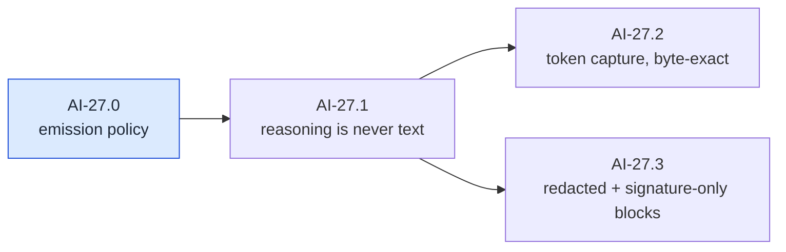

#### AI-27.0 — Reasoning emission policy `[decision]`

- **Closing checklist:**
  1. Record whether v1 emits reasoning events for the first provider, or documents a capability absence — the shipped AI-14 no-op contract makes both legal, and every sibling below assumes emission.
  2. If absence wins: AI-27.1 … AI-27.3 are struck via the living-graph clause, and the conformance reasoning case (AI-21.8) records "absent" as this adapter's capability outcome.
- **Depends on:** AI-22.1 (the vendor's reasoning shape is known).

#### AI-27.1 — Reasoning is never text `[leaf]`

- **Test list:**
  1. WHEN a transcript interleaves reasoning and text blocks THEN reasoning content appears only in reasoning-typed events and never leaks into text events (the map's acceptance, verbatim) — including multiple reasoning blocks per response at arbitrary positions.
- **Depends on:** AI-26, AI-27.0.

#### AI-27.2 — Token capture, byte-exact `[leaf]`

- **Test list:**
  1. WHEN the vendor streams a reasoning signature THEN it is captured into the round-trip token **byte-exactly** and survives capture → normalized content → re-translation (AI-24.6) unchanged — the full-circle test the map demands.
  2. The signature attaches to its block even when it arrives as the block's only content.
- **Depends on:** AI-27.1, AI-45.

#### AI-27.3 — Redacted and signature-only blocks `[leaf]`

- **Test list:**
  1. Redacted reasoning blocks normalize to the redacted state with their opaque payload preserved verbatim — invisible in tests unless deliberately exercised, and unrecoverable in production if dropped.
  2. A block with a signature and no reasoning text normalizes to valid empty-text reasoning (AI-45.3's shape, now from wire data).
- **Depends on:** AI-27.1.

### AI-28 — Translate the tool-call stream

SDD change: `cachicamas-ai-provider-tool-stream`.

**Charter**

> **Amended 2026-07-30** (finding G5): acceptance gains that the tool-call **ordinal survives normalization**, so Layer 2 can restore results in call order regardless of completion order — several providers require tool results to correspond positionally to their calls. If the first provider needs an explicit index to make this work, the SDD promotes it to the AI-15 payload as an **additive** change. Also gains the zero-delta case from AI-15's amendment.

- **Goal:** Map fragmented and interleaved provider tool calls into neutral events.
- **Deliverable:** Tool-call mapping and reconstruction tests.
- **Acceptance:** Multiple interleaved calls preserve identity, order, and exact argument bytes; malformed completion yields a typed failure.
- **Depends on:** AI-15, AI-26.
- **Out of scope:** JSON argument validation against the tool schema and tool execution.

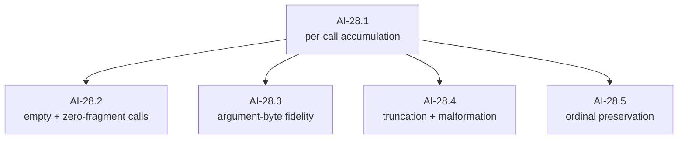

#### AI-28.1 — Per-call accumulation `[leaf]`

- **Test list:**
  1. WHEN a transcript interleaves argument fragments for two concurrent calls THEN each call's arguments accumulate in its own buffer, keyed by the vendor's block position — cross-contamination corrupts parallel tool calls and is a shipped-SDK bug class.
  2. Call identity and name are available from the call's start event, before any argument bytes arrive (early UI display depends on it).
  3. Assembly happens exactly once, at the call's end — fragments are never partially parsed.
  4. Per-call accumulation is memory-bounded across fragments: a runaway fragment sequence into one call hits a documented cap with a typed failure, never unbounded growth (AI-25.5 bounds a single frame; this bounds the sum).
- **Depends on:** AI-26.

#### AI-28.2 — Empty and zero-fragment calls `[leaf]`

- **Test list:**
  1. An empty first fragment is a no-op (routine in real transcripts), not an error.
  2. A call that closes with **zero accumulated bytes** (a no-argument tool) normalizes to the canonical empty-arguments form rather than a parse failure on empty input.
  3. A call delivered whole with no fragments (the delta-optional contract) normalizes identically to its fragmented equivalent.
- **Depends on:** AI-28.1.

#### AI-28.3 — Argument-byte fidelity `[leaf]`

- **Test list:**
  1. Reassembled arguments are byte-identical to the transcript's fragments concatenated — including exotic-but-legal JSON (Unicode escapes, scientific-notation numbers) that has crashed shipped SDK parsers.
  2. The end event carries exact argument bytes; nothing re-marshals them (byte-equality against the fixture).
- **Depends on:** AI-28.1.

#### AI-28.4 — Truncation and malformation `[leaf]`

- **Test list:**
  1. WHEN generation stops mid-arguments (length-limit cutoff) THEN the stream terminates predictably with a typed failure that **carries the raw partial fragment** — surfaced, never silently discarded and never a panic.
  2. Arguments that assemble to invalid JSON at the call's end produce the same typed, raw-carrying failure (some vendor modes stream unvalidated fragments by design).
- **Depends on:** AI-28.1, AI-18.1, AI-18.2.

#### AI-28.5 — Ordinal preservation `[leaf]`

- **Test list:**
  1. WHEN multiple calls stream in one response THEN each normalized call's ordinal position is observable, regardless of fragment interleaving — Layer 2's call-ordered rejoin (G5) needs it, and several vendors reject positionally mismatched results.
- **Depends on:** AI-28.1.
- **Split if:** the vendor requires an explicit index to satisfy item 1 — the additive promotion into the shipped event payload becomes AI-28.6, with its own map amendment (the map's AI-28 amendment pre-authorizes exactly this).

### AI-29 — Translate usage and finish reasons

SDD change: `cachicamas-ai-provider-completion`.

**Charter**

> **Amended 2026-07-30** (finding G12c): `Depends on:` gains **AI-46**. Refusal and pause-turn map to their own finish reasons, not to the unknown fallback. Acceptance gains that mapping.

- **Goal:** Complete terminal metadata mapping for the first provider.
- **Deliverable:** Usage, finish reason, unknown-value, and partial-metadata handling.
- **Acceptance:** Terminal events contain every available normalized field and never invent unavailable usage.
- **Depends on:** AI-10, AI-26. **Parallel with:** AI-27 and AI-28 after AI-26.

```mermaid
flowchart LR
    U1["AI-29.1<br/>finish-reason mapping"] --> U3["AI-29.3<br/>never invent, never assume position"]
    U2["AI-29.2<br/>usage mapping"] --> U3
```

#### AI-29.1 — Finish-reason mapping `[leaf]`

- **Test list:**
  1. Every vendor stop value maps to its normalized reason — including refusal and pause to the AI-46 values, not to unknown.
  2. A novel vendor stop value maps to unknown without error (the normalizer-crash bug class, pinned).
  3. Refusal-after-partial-output and refusal-before-output both normalize with the right reason and the right partial-output posture (AI-18.4's discriminator applies to refusals too).
  4. WHEN generation ends on a stop-sequence match THEN the matched value's disposition is pinned by test — captured, or its absence from the neutral surface recorded as deliberate (callers running multiple stop sequences cannot branch without it; the SDD owns the choice).
- **Depends on:** AI-26, AI-46.
- **Note:** pause-style finishes resume by replaying received content verbatim. If a paused response can contain block types the normalization skips (AI-26.4), resume is lossy — the AI-22 SDD records whether v1 excludes the features that produce such blocks or carries them opaquely.

#### AI-29.2 — Usage mapping `[leaf]`

- **Test list:**
  1. Cache-read, cache-write, and reasoning token counts map into the shipped optional usage fields when the vendor reports them; absent stays absent.
  2. WHEN the vendor delivers usage across multiple frames (input-side figures at stream start, cumulative output-side updates later) THEN the completion event's usage merges them **without double-counting** — cumulative-not-incremental is an explicit vendor-doc trap, and this node solely owns the merge.
  3. The inclusive-or-exclusive semantics of the normalized input-token field with respect to cache-read/cache-write tokens are pinned by test against a cache-hit transcript, and the resulting cost formula over the shipped fields is documented — on at least one vendor the plain input figure *excludes* cached tokens, so summing the wrong fields silently under-reports spend on every cached call.
- **Depends on:** AI-26.

#### AI-29.3 — Never invent, never assume position `[leaf]`

- **Test list:**
  1. WHEN the vendor omits a usage field or delivers stop metadata in an unexpected frame position THEN normalization neither invents values nor crashes — metadata is gathered wherever it appears, and the terminal event reports only what arrived.
  2. A metadata-only frame with no content is tolerated (a real shape in at least one dialect).
- **Depends on:** AI-29.1, AI-29.2.

### AI-30 — Map HTTP and provider failures

SDD change: `cachicamas-ai-provider-error-mapping` · Converts wire failures into AI-18's taxonomy; runs parallel to AI-26 after AI-25.

**Charter**

> **Amended 2026-07-30** (finding G8): a mid-stream disconnect must produce a **terminal error event** carrying AI-18's partial-output discriminator, not merely a returned error. The distinction matters because the harness's retry decision depends on whether anything was already emitted.

- **Goal:** Convert transport/status/body failures into the AI-18 taxonomy.
- **Deliverable:** Tests for auth, permission, rate limit, unavailable, timeout, malformed body, unexpected status, and mid-stream disconnect.
- **Acceptance:** Response bodies are size-limited and sanitized; retry hints and status metadata are preserved safely.
- **Depends on:** AI-18, AI-25. **Parallel with:** AI-26 after shared decoder dependencies.

```mermaid
flowchart TB
    V1["AI-30.1<br/>status taxonomy"] --> V4["AI-30.4<br/>retry metadata"]
    V1 --> V2["AI-30.2<br/>mid-stream error frames"]
    V1 --> V3["AI-30.3<br/>disconnects + deadlines"]
    V2 --> V5["AI-30.5<br/>bounded, sanitized capture"]
    V3 --> V5
    V1 --> V5
```

#### AI-30.1 — Status taxonomy `[leaf]`

- **Test list:**
  1. Each failing status class maps to its AI-18 category: authentication, permission, not-found/invalid, rate limit, overload/unavailable, timeout — table-tested over the vendor's documented codes, including its nonstandard ones.
  2. Retryability follows the taxonomy: client-contract failures are terminal; rate-limit/overload/timeout are retryable-flagged (the flag, not the retry — AI-33 owns acting on it).
  3. An unparseable error body still maps (category from status, body kept as bounded diagnostic).
  4. A status code outside the vendor's documented table maps through the taxonomy's fallback without crashing — the "unexpected status" case the map's deliverable names explicitly.
- **Depends on:** AI-25, AI-18.1, AI-18.2.

#### AI-30.2 — Mid-stream error frames `[leaf]`

- **Test list:**
  1. WHEN the vendor emits an in-stream error frame THEN the stream terminates with a typed terminal error event carrying the vendor's error identity and the partial-output discriminator — an in-band frame, not a transport failure, and the two are distinguishable.
- **Depends on:** AI-30.1, AI-26.

#### AI-30.3 — Disconnects and deadlines `[leaf]`

- **Test list:**
  1. A mid-stream disconnect after emitted output produces a terminal error event with partial output preserved — the map's amendment, stated as the node's whole job: *a terminal event*, not merely a returned error.
  2. A disconnect before any output takes the pre-stream error path (no channel ever existed, or the error is the first and only terminal).
  3. Context deadline expiry mid-stream maps to the **timeout** category; explicit cancellation maps to **cancellation** — distinguishable via `errors.Is` and in the terminal event. Conflating the two (a classic Go bug) corrupts Layer 2's retry policy: timeouts are often retryable, cancellations never are.
- **Depends on:** AI-30.1, AI-26.

#### AI-30.4 — Retry metadata `[leaf]`

- **Test list:**
  1. Retry-after arrives typed, parsed from both delay-seconds and HTTP-date forms.
  2. Rate-limit telemetry headers are captured into safe machine-readable metadata (they are non-secret and support-relevant).
- **Depends on:** AI-30.1.

#### AI-30.5 — Bounded, sanitized capture `[leaf]`

- **Test list:**
  1. Error-body capture is size-limited and the remainder drained; a multi-megabyte error body cannot balloon memory (limit + truncation marker asserted).
  2. A sentinel credential echoed inside an error body does not survive into the typed error's text (AI-34 broadens this; the wire-error path is pinned here because this is where bodies enter).
- **Depends on:** AI-30.1, AI-30.2, AI-30.3.

---
## Wave 6 — Harden

### AI-31 — Prove cancellation and goroutine cleanup

SDD change: `cachicamas-ai-cancellation`. Four cancellation moments, one node each — they fail differently and are debugged differently. Every node runs its scenarios over text **and tool-call** streams (the charter's AI-28 edge): a cancellation proof that never crosses the tool-call accumulation path proves nothing about its buffers.

**Charter**

- **Goal:** Ensure cancellation works before headers, between chunks, during a blocked send, and after completion.
- **Deliverable:** Cancellation-safe producer logic and deterministic tests.
- **Acceptance:** Requests stop, channels close once, no send occurs forever without observing context, and no goroutine leak is detected.
- **Depends on:** AI-26, AI-28, AI-30.
- **Out of scope:** Agent-level stop UX.

```mermaid
flowchart LR
    W1["AI-31.1<br/>before headers"] --> W5["AI-31.5<br/>resource discipline"]
    W2["AI-31.2<br/>between frames"] --> W5
    W3["AI-31.3<br/>during a blocked send"] --> W5
    W4["AI-31.4<br/>after completion"] --> W5
```

#### AI-31.1 — Cancel before headers `[leaf]`

- **Test list:**
  1. WHEN cancellation lands before the response begins THEN the call returns the pre-stream cancellation error, the request is torn down, and no goroutine or channel outlives the call (leak-checked via AI-20.4).
- **Depends on:** AI-26, AI-28, AI-30, AI-20.4.

#### AI-31.2 — Cancel between frames `[leaf]`

- **Test list:**
  1. WHEN cancellation lands while the stream is idle between frames THEN the channel closes within bounded time with the contract's cancellation posture, under `-race`, leak-checked.
  2. The underlying response body is closed — a stalled server cannot pin the connection (proven with a deliberately stalling `httptest` handler).
- **Depends on:** AI-26, AI-28, AI-20.4.

#### AI-31.3 — Cancel during a blocked send `[leaf]`

- **Test list:**
  1. WHEN the consumer has stopped reading and the producer is blocked mid-send THEN cancellation unblocks it: late events dropped, channel closed without a terminal event — the shipped saturated-channel contract, now proven against the real producer, leak-checked.
- **Depends on:** AI-26, AI-28, AI-20.4.

#### AI-31.4 — Cancel after completion `[leaf]`

- **Test list:**
  1. WHEN cancellation lands after the terminal event THEN nothing changes: the channel is already closed or closes cleanly, close happens exactly once, no panic on any interleaving (race-detector coverage over repeated runs).
- **Depends on:** AI-26, AI-28, AI-20.4.

#### AI-31.5 — Resource discipline `[leaf]`

- **Test list:**
  1. On **every** exit path — completion, error, each cancellation moment — the response body is drained-or-closed so the transport's connection pool is not poisoned; the failure and cancellation paths are exactly the ones naive implementations leak on.
  2. A full-suite leak check over the adapter package passes (the AI-20.4 mechanism applied wholesale).
- **Depends on:** AI-31.1 … AI-31.4.

### AI-32 — Lock backpressure and buffer behavior

SDD change: `cachicamas-ai-backpressure`.

**Charter**

- **Goal:** Implement the AI-01 decision with measurements rather than arbitrary channel sizes.
- **Deliverable:** Buffer constant/configuration, slow-consumer tests, and rationale.
- **Acceptance:** Ordering is stable, memory is bounded, and cancellation unblocks a saturated producer.
- **Depends on:** AI-31.
- **Out of scope:** Dropping text or tool-call events; those must remain lossless.

```mermaid
flowchart LR
    X1["AI-32.1<br/>measured buffer decision"] --> X2["AI-32.2<br/>lossless ordering under pressure"]
    X2 --> X3["AI-32.3<br/>saturation behavior pinned"]
    classDef d fill:#dbeafe,stroke:#1d4ed8,color:#1f2937
    class X1 d
```

#### AI-32.1 — Measured buffer decision `[decision]`

- **Closing checklist:**
  1. The shipped default buffer size (16, carrying a `TODO(ai-32)`) is confirmed or changed **with measurements**, not vibes — the map's words; the decision records the workload measured and the numbers.
  2. Whether the size is a constant or configurable is decided, with the configuration surface named if so.
- **Depends on:** AI-31.

#### AI-32.2 — Lossless ordering under pressure `[leaf]`

- **Test list:**
  1. The AI-32.1 decision is applied and observable — the stream buffer's capacity equals the decided size (capacity assertion), replacing the shipped `TODO(ai-32)` default if the decision changed it.
  2. WHEN the consumer drains slower than the producer emits THEN every event still arrives, in order — text and tool-call events are lossless by contract; backpressure means *waiting*, never dropping (the map's out-of-scope clause, stated as a test).
  3. No auxiliary queue exists beyond the decided channel capacity — asserted by capacity plus the observation that the producer blocks (rather than buffering elsewhere) once the channel is full.
- **Depends on:** AI-32.1.

#### AI-32.3 — No unsanctioned loss path `[leaf]`

- **Test list:**
  1. Beyond the one sanctioned loss path — cancellation on a saturated channel, proven at AI-31.3 — **no other loss path exists**: an exhaustive-path test drains every non-cancelled scenario (slow consumer, bursty consumer, pause-resume consumer) losslessly.
- **Depends on:** AI-32.2.
- **Out of scope:** the sanctioned path's own behavior — AI-31.3 owns it; owning it twice was an earlier draft's overlap defect.

### AI-33 — Define retry and idempotency policy

SDD change: `cachicamas-ai-retry-policy` · The amendment's core sentence, promoted to structure: **the partial-output case is never retried at Layer 1.**

**Charter**

> **Amended 2026-07-30** (finding G8): make explicit what the current wording only implies. The **partial-output case is never retried at Layer 1** — it is handed up as a typed error and the harness decides. The acceptance clause must say not only what must *not* happen but what *does*. This matters because a stream that dies after emitting output is the single most common real-world failure, and the naive retry predicate ("retry if nothing was emitted") is precisely the one that excludes it.

- **Goal:** Decide and implement only retries that cannot duplicate a partially observed response.
- **Deliverable:** Explicit pre-stream retry conditions, backoff bounds, `Retry-After` handling, or a documented no-auto-retry v1 policy.
- **Acceptance:** No automatic retry occurs after any semantic event has been emitted unless the protocol provides a proven resume mechanism.
- **Depends on:** AI-30, AI-31.
- **Out of scope:** Agent-turn retries and fallback to another model.

```mermaid
flowchart LR
    Y0["AI-33.0<br/>policy + seam decision"] --> Y1["AI-33.1<br/>the retry predicate"]
    Y1 --> Y2["AI-33.2<br/>backoff mechanics"]
    Y1 --> Y3["AI-33.3<br/>replayability"]
    classDef d fill:#dbeafe,stroke:#1d4ed8,color:#1f2937
    class Y0 d
```

#### AI-33.0 — Retry policy and seam `[decision]`

- **Closing checklist:**
  1. Auto-retry versus the map-sanctioned alternative — "a documented no-auto-retry v1 policy" — decided with rationale; an earlier draft silently presupposed the executor, which forecloses a decision the map deliberately left open.
  2. If auto-retry: where the mechanism lives (inside the adapter, or a wrapping component) — the seam AI-33.1's first test cannot be written without.
  3. If no-auto-retry: AI-33.2 and AI-33.3 are struck via the living-graph clause, AI-33.1 shrinks to its never-retry assertions, and the documented policy is the milestone's deliverable.
- **Depends on:** AI-30, AI-31.

#### AI-33.1 — The retry predicate `[leaf]`

- **Test list:**
  1. WHEN a retryable-flagged failure occurs **before any semantic event is emitted** THEN retry is permitted; the boundary is "nothing emitted", not "nothing completed".
  2. WHEN any semantic event has been emitted THEN no automatic retry occurs — the typed error with its partial-output discriminator is handed up, and the test asserts the absence of a second wire request.
  3. Terminal-category failures (auth, invalid request) never retry regardless of position.
- **Depends on:** AI-33.0, AI-30, AI-31, AI-18.4.

#### AI-33.2 — Backoff mechanics `[leaf]`

- **Test list:**
  1. Retry-after, when present, overrides computed backoff; absent, backoff grows within documented bounds with jitter (seeded, assertable).
  2. Backoff waits on the context, never sleeps blind: cancellation during backoff aborts immediately, and a remaining context budget smaller than the next delay short-circuits to the last error.
  3. All timing is injected — no wall-clock sleeps in tests.
  4. A documented maximum attempt count terminates retrying — asserted as exactly N+1 wire requests followed by the last error; unbounded retry against a hard-down endpoint is a real incident class.
- **Depends on:** AI-33.1.

#### AI-33.3 — Replayability `[leaf]`

- **Test list:**
  1. A retried request re-issues from scratch with an identical body (byte-compare across attempts) — nothing consumed on attempt one can corrupt attempt two.
  2. The attempt count and final cause are both reachable from the returned error chain.
  3. Each failed attempt's response body is closed and drained before the next attempt begins — a per-attempt connection leak exhausts the pool exactly during the rate-limit storm that triggers retries.
- **Depends on:** AI-33.1.

### AI-34 — Enforce secret redaction

SDD change: `cachicamas-ai-redaction` · Adversarial by design: every test plants a sentinel and asserts absence.

**Charter**

- **Goal:** Prevent credentials, authorization headers, sensitive prompt bodies, and unbounded provider errors from entering logs/errors.
- **Deliverable:** Safe diagnostic metadata and adversarial redaction tests.
- **Acceptance:** Sentinel secrets do not appear in errors, logs, fixtures, event metadata, or test failure output.
- **Depends on:** AI-23, AI-30. **Parallel with:** AI-31 through AI-33 after error mapping.

```mermaid
flowchart LR
    Z1["AI-34.1<br/>sentinel sweep"] --> Z2["AI-34.2<br/>header + config redaction"]
    Z1 --> Z3["AI-34.3<br/>failure-output hygiene"]
```

#### AI-34.1 — Sentinel sweep `[leaf]`

- **Test list:**
  1. A distinctive sentinel credential, configured into the adapter, appears in **no** error string, wrapped cause, formatted verbatim (`%v`/`%+v`), or event metadata across every failure path the suite can trigger.
  2. A distinctive sentinel **prompt body**, sent through the adapter, is equally absent from every error, log field, and event metadatum — the map's goal names "sensitive prompt bodies", not only credentials; content leaks through error paths are the quieter half of the same defect.
  3. The sweep is a reusable helper, not a one-off — future failure paths inherit it.
- **Depends on:** AI-30, AI-23.
- **Out of scope:** the credential-attachment proof (AI-23.3) and the wire-error-body size bound (AI-30.5) — this node owns the reusable sweep and every path those two did not already pin.

#### AI-34.2 — Header and config redaction `[leaf]`

- **Test list:**
  1. Any diagnostic that captures request/response headers redacts the credential-bearing ones by default; redaction is opt-out-explicit, never opt-in.
  2. Printing or logging the adapter's configuration value redacts the credential field (safe-to-print by construction).
- **Depends on:** AI-34.1.

#### AI-34.3 — Failure-output hygiene `[leaf]`

- **Test list:**
  1. Test-failure output itself never prints the sentinel (assertion helpers summarize, they do not dump) — the map's acceptance names test failure output explicitly.
  2. Fixtures are sentinel-free by scan (extends AI-24.1's fixture check to the whole adapter tree).
- **Depends on:** AI-34.1.

### AI-35 — Add the observability boundary

SDD change: `cachicamas-ai-observability` · Governed by ADR 0005 § D3: OTel **API** only, allowlist attributes, absolute content denylist.

**Charter**

> **Amended 2026-07-30** (finding S5): reword to [ADR 0005 § D3](../../adr/0005-promote-agent-stack-to-own-module.md#d3--observability-boundary). Layer 1 **may** import the OpenTelemetry **API** and **must not** import the OTel SDK, any exporter, or `database_administrator/src/otel`. The existing acceptance clause "Layer 1 does not import Cachicamas `otel`" stays literally true and becomes precise rather than accidental. Deliverable gains the § D3 attribute **allowlist** (GenAI semantic conventions) and its **absolute denylist**: no prompt, completion, reasoning, tool-argument or tool-result text, no header, no credential, no raw response body.

- **Goal:** Expose enough safe timing/request metadata for callers without coupling Layer 1 to application telemetry policy.
- **Deliverable:** Decision and minimal hooks/attributes, preferably through context and safe result metadata.
- **Acceptance:** Layer 1 does not import Cachicamas `otel`; model content and secrets are not recorded by default.
- **Depends on:** AI-29, AI-30, AI-34.
- **Out of scope:** Dashboards, exporters, and application tracing setup.

```mermaid
flowchart LR
    AA1["AI-35.1<br/>API-only guard"] --> AA2["AI-35.2<br/>allowlist attributes"]
    AA2 --> AA3["AI-35.3<br/>denylist proven by absence"]
    AA2 --> AA4["AI-35.4<br/>nil-safe no-op"]
```

#### AI-35.1 — API-only guard `[guard]`

- **Test list:**
  1. The forward guard (AI-39.4) already forbids the OTel SDK; this node extends it to assert the adapter imports only the § D3-permitted API modules and records the **first OTel dependency addition's ADR linkage** (§ D3 declares itself that ADR — the guard cites it).
  2. **Bite proof:** a scratch SDK import fails; recorded, dropped.
- **Depends on:** AI-29, AI-30, AI-34 (the map's edge: redaction discipline exists before anything is recorded).

#### AI-35.2 — Allowlist attributes `[leaf]`

- **Test list:**
  1. WHEN a traced request completes THEN the span carries only § D3-allowlisted attributes (system, models, finish reasons, token counts, status, retry count, event count) with values matching the normalized result exactly — asserted with an in-memory test tracer.
  2. Attribute keys are spelled exactly as the § D3 allowlist spells them — the OTel GenAI semantic-convention names, not ad-hoc equivalents; renaming telemetry later is a breaking change for every consumer of it.
  3. Streaming spans close at the terminal event, and usage attributes equal the completion event's usage.
- **Depends on:** AI-35.1.

#### AI-35.3 — Denylist proven by absence `[leaf]`

- **Test list:**
  1. No span attribute, span event, or recorded error carries prompt, completion, reasoning, tool-argument or tool-result text, a header, or a credential — asserted by **absence** over a run that used all of them (the denylist is absolute in this repo; there is no content-capture opt-in at Layer 1).
- **Depends on:** AI-35.2.

#### AI-35.4 — Nil-safe no-op `[leaf]`

- **Test list:**
  1. WHEN no tracer is configured THEN streaming behaves identically — the drained event sequences with and without tracing are equal — and nothing panics; the API's no-op default suffices without adapter-side nil checks failing.
- **Depends on:** AI-35.2.

---

## Wave 7 — Hand off

### AI-36 — Run full deterministic adapter conformance

SDD change: `cachicamas-ai-adapter-conformance`.

**Charter**

- **Goal:** Run the reusable AI-21 suite against the first concrete adapter through `httptest`.
- **Deliverable:** One deterministic end-to-end test matrix covering text, reasoning policy, tools, usage, all terminal paths, errors, cancellation, and closure.
- **Acceptance:** The first adapter passes every required capability; optional capability results are recorded explicitly.
- **Depends on:** AI-27 through AI-35.
- **Out of scope:** Real vendor network calls.

```mermaid
flowchart LR
    AB1["AI-36.1<br/>suite × adapter"] --> AB2["AI-36.2<br/>capability record"]
    AB1 --> AB3["AI-36.3<br/>boundary-replay matrix"]
```

#### AI-36.1 — Suite × adapter `[leaf]`

- **Test list:**
  1. The AI-21 suite runs against the real adapter through `httptest` transcript replay and passes every required case — the first time both suite and adapter are proven against each other.
  2. Any suite case the adapter cannot pass is a defect in one of them, resolved before this node closes (no waivers — that is what "required" means).
  3. Conformance transcripts are regenerable: a recording helper captures a stream into the exact fixture format the replay harness consumes — hand-typed fixtures drifting from real wire behavior is the root cause of "passes conformance, fails in production".
- **Depends on:** AI-27 … AI-35, AI-21.

#### AI-36.2 — Capability record `[leaf]`

- **Test list:**
  1. The optional-capability outcomes (reasoning, token counting, anything AI-21.6 tracks) are recorded explicitly in a generated capability report — the concrete artifact the matrix test asserts against and AI-38.2 publishes; "not implemented" is a recorded result, never an unrun test.
- **Depends on:** AI-36.1.

#### AI-36.3 — Boundary-replay matrix `[leaf]`

- **Test list:**
  1. Every conformance transcript replays split at adversarial chunk boundaries (reusing AI-25.3's mechanism at the integration level) with identical outcomes — the end-to-end proof that no layer above the decoder secretly depends on framing luck.
- **Depends on:** AI-36.1.

### AI-37 — Add the opt-in live smoke test

SDD change: `cachicamas-ai-live-smoke`.

**Charter**

- **Goal:** Prove the real provider still matches recorded assumptions without making CI depend on credentials.
- **Deliverable:** Explicitly gated test infrastructure, such as an internal smoke-test package unreachable from application `cmd/` entry points, with safe setup instructions.
- **Acceptance:** It skips cleanly without credentials, uses a bounded request, has a timeout, and never prints the credential or full sensitive prompt.
- **Depends on:** AI-36.
- **Out of scope:** A user-facing CLI, production deployment, and scheduled billing-consuming CI.

#### AI-37.1 — Gated, bounded, silent about secrets `[leaf]`

- **Test list:**
  1. Without credentials the smoke test **skips cleanly** — CI and `make test` never depend on it.
  2. With credentials it sends one bounded request under a hard timeout and asserts only stream-shape invariants (start, ≥1 content event, one terminal) — not model output.
  3. Its output never contains the credential or the full prompt, even on failure (sentinel-style assertion on captured output).
  4. It is unreachable from any application entry point — proven mechanically: the smoke package is internal, and `go list -deps` over each composition root shows no path to it.
  5. Credential-safe setup instructions ship with the package (the map's deliverable clause), and following them never requires writing the credential to a file inside the repository.
- **Depends on:** AI-36.

### AI-38 — Publish the Layer 2 readiness contract

SDD change: `cachicamas-ai-layer2-handoff` · Layer 1's exit: the surface freezes here.

**Charter**

- **Goal:** Freeze the v1 surface that `cachicamas_agent` may consume.
- **Deliverable:** Package examples, compatibility statement, supported-capability matrix, and a fake-provider example for future `AgentLoop` tests.
- **Acceptance:** A tiny external-package test can construct a request, invoke a fake provider, drain events, handle cancellation/errors, and compile without vendor imports.
- **Depends on:** AI-36; AI-37 may remain optional.
- **Out of scope:** Implementing `AgentLoop` or `AgentHarness`.

```mermaid
flowchart LR
    AC1["AI-38.1<br/>consumer proof"] --> AC3["AI-38.3<br/>compatibility statement"]
    AC2["AI-38.2<br/>capability matrix + examples"] --> AC3
```

#### AI-38.1 — Consumer proof `[leaf]`

- **Test list:**
  1. A tiny external-package test — the future Layer 2 in miniature — constructs a request, invokes the fake provider, drains events, handles a scripted error and a cancellation, and compiles with **zero vendor imports** (proven by the guard mechanism, not by inspection).
- **Depends on:** AI-36; AI-37 optional.

#### AI-38.2 — Capability matrix and examples `[leaf]`

- **Test list:**
  1. Runnable package examples cover: request construction, streaming, tool-call reconstruction, error inspection — examples compile and run under the normal test run (Go example-test discipline, so documentation cannot rot silently).
  2. The supported-capability matrix (from AI-36.2) is published in the package documentation.
- **Depends on:** AI-36.

#### AI-38.3 — Compatibility statement `[decision]`

- **Closing checklist:**
  1. The v1 surface is enumerated and declared frozen; anything experimental is marked; the statement names what Layer 2 may rely on.
  2. The map's completion checklist is walked item by item, each row citing the node in this document that closed it (the spine below is the template).
  3. The abandoned-consumer-who-never-cancels posture is stated as documented contract — the caller owns the context, the producer blocks until context end, and abandoning a stream without cancelling is a contract violation. Tests cover abandoned-*then-cancelled* (AI-21.5, AI-31.3); the never-cancelled case is the one Layer 2 authors write by accident, and it must be documented because it cannot be tested to termination.
- **Depends on:** AI-38.1, AI-38.2.

---

## Layer 1 completion checklist

Layer 1 is complete when every box holds. The [traceability spine](#completion-checklist--nodes) maps each item, in this order, to the node that proves it.

- [ ] Package exists at the ADR-defined location.
- [ ] Import direction is mechanically guarded.
- [ ] Neutral request/message/content/tool contracts are documented and tested.
- [ ] Event order and stream ownership are explicit.
- [ ] Cancellation cannot leak goroutines.
- [ ] Backpressure is bounded and lossless.
- [ ] Provider interface exposes no vendor type.
- [ ] Error taxonomy is typed, safe, and inspectable.
- [ ] Fake provider supports deterministic Layer 2 tests.
- [ ] Conformance suite can be reused for every future adapter.
- [ ] First concrete adapter passes deterministic conformance tests.
- [ ] Secrets and sensitive bodies are absent from diagnostics by default.
- [ ] Live test is optional and bounded.
- [ ] Layer 2 handoff example compiles without vendor dependencies.
- [ ] The package lives in `backend/agent` and `src/tools/` is vacated. *(added 2026-07-30)*
- [ ] **Both** import directions are mechanically guarded, not just Layer 1 purity. *(added 2026-07-30)*
- [ ] Event sequence is per-stream and provably starts at 1 for every stream. *(added 2026-07-30)*
- [ ] Every content-part variant is readable from another package. *(added 2026-07-30)*
- [ ] Cache breakpoints are expressible, and per-request provider options have an escape hatch. *(added 2026-07-30)*
- [ ] Provider round-trip tokens survive byte-exact through normalization and persistence. *(added 2026-07-30)*

## Explicitly deferred until after Layer 1

- `AgentLoop` and `AgentHarness`.
- Agent-level events such as `AgentStart`, `TurnStart`, and tool-execution events.
- Tool execution.
- `CodingSession` and JSONL persistence.
- Provider catalog and model-selection UI.
- Skills, project instructions, slash commands, CLI, TUI, and print mode.
- Multi-provider fallback/routing.
- Cost policy, quota management, and organization billing.
- Production rollout.

### Named Layer 2 / Layer 3 forward requirements *(added 2026-07-30)*

These are deferred **with a reserved seam**, not merely unscheduled. Each is placed in
[the v2 architecture reference § 6](../0001-cachicamas-agent-stack-v2.md#6-the-twelve-seams-that-must-exist-now)
and dispositioned in [§ 7](../0001-cachicamas-agent-stack-v2.md#7-forward-requirements-register). None
requires Layer 1 work, which is why they appear here rather than as milestones — but all of them
shape Layer 2's design, so none should be rediscovered later as a surprise.

| ID | Deferred requirement | Owner |
| --- | --- | --- |
| G1 | Permission as a suspendable protocol on the event stream, with allow-once / allow-always / deny / modify-input | L2 protocol, L3 policy |
| G2 | Sandboxed tool execution, applied to the whole spawned process tree | L3 |
| G3 | Context compaction that protects recent turns, never orphans a call/result pair, and is recoverable | L2 |
| G5 | Parallel tool execution with call-ordered re-join | L2 |
| G6 | Dynamic, supervised tool sources | L3 |
| G7 | Subagents as a harness invoked from a tool | L2 |
| G10 | Cost as first-class events plus a price table — **the Layer 1 half is already done** | L2 emits, L3 prices |
| G11 | Hook taxonomy: pre-request, pre-compact, post-turn, session-start. Observers never synchronous on the streaming path | L2 + L3 |

---

## Traceability spine

Two-way coverage: every review finding, contract gap, and completion-checklist item maps to the node(s) that close it; every node traces back to a map milestone. A finding with no node, or a node with no purpose, is a bug in this document.

### Findings and gaps → closing nodes

| Finding / gap | Closed by |
| --- | --- |
| **C1** — zero-value text part bypasses construction | AI-42.1 → AI-42.3 |
| **C2** — content unreadable from another package | AI-41.2 … AI-41.5 |
| **C3** — process-global sequence counter | AI-40.2 → AI-40.4 |
| **C4** — unconstructible terminal error | AI-18.1 |
| **G4** — cache breakpoints (L1 half) | AI-43.1 … AI-43.4; rendered by AI-24.2 |
| **G5** — tool-call ordinal survives normalization | AI-28.5; suite case AI-21.3 |
| **G8** — partial-output discriminator + typed taxonomy | AI-18.4, AI-30.2/30.3, AI-33.1; suite case AI-21.4 |
| **G9** — options + escape hatch | AI-44.1 … AI-44.4; rendered by AI-24.7 |
| **G12(a)** — delta-optional tool calls | AI-19.2, AI-21.3, AI-28.2 |
| **G12(b)** — reasoning round-trip token | AI-45.1 … AI-45.3; suite case AI-21.8; wire-proven by AI-27.2, AI-24.6 |
| **G12(c)** — refusal + pause finish reasons | AI-46.1/46.2; suite case AI-21.8; mapped by AI-29.1 |
| **G13** — stream carrier | AI-47.1; ergonomics AI-20.5 |
| Leakage register rows 1–9 | row 1 = G12(a) above · row 2 = G12(b) above + AI-45.3/AI-27.3 · row 3 = G12(c) above · row 4 AI-24.5 · row 5 AI-24.3 · row 6 AI-24.7 · row 7 AI-24.5 · row 8 AI-43.1 + AI-24.2 · row 9 AI-43.4 |
| Map AI-21 required case "redaction" | AI-21.7 (suite); AI-34 (adapter hardening) |
| ADR 0005 Guards A/B/C | AI-39.4 · AI-39.5 (both halves) · AI-39.2 (sibling pinning) |
| § D3 observability boundary | AI-35.1 … AI-35.4 |

### Completion checklist → nodes

Each of [the completion checklist](#layer-1-completion-checklist)'s twenty items, in that order: (1) package at the ADR location — AI-39.2/39.3 · (2) import direction guarded — AI-39.4 · (3) neutral contracts documented and tested — shipped + wave 3.6 · (4) event order and ownership explicit — AI-40, AI-20.3 · (5) cancellation leak-free — AI-31 · (6) backpressure bounded and lossless — AI-32 · (7) no vendor type on the interface — AI-38.1 · (8) typed error taxonomy — AI-17/AI-18 · (9) fake provider — AI-19 · (10) reusable conformance — AI-21, AI-36.1 · (11) first adapter passes conformance — AI-36 · (12) secrets absent from diagnostics — AI-34, suite case AI-21.7 · (13) live test optional and bounded — AI-37 · (14) handoff example — AI-38.1 · (15) `src/tools/` vacated — AI-39.2 · (16) **both** import directions guarded — AI-39.4 + AI-39.5 · (17) per-stream sequence from 1 — AI-40.2 · (18) every part readable — AI-41.5 · (19) breakpoints + escape hatch — AI-43/AI-44 · (20) round-trip tokens byte-exact — AI-45.2, AI-27.2.

## Method sources

The decomposition rules are a synthesis of published practice, applied to this repo's constraints; recorded so the rules read as decisions, not habits.

- **Canon TDD test lists** (Kent Beck) — a leaf's body is an ordered behavior list, converted to one failing test at a time; discovered cases append to the list.
- **Mikado method** — the revert-and-record clause; the graph grows by recorded discovery, never by pushing through on a broken tree.
- **HTN planning** — the compound/primitive node grammar: a node decomposes or executes, never both.
- **WBS rules** — the 100 % rule and sibling mutual exclusivity as the fractal invariants; audit by union and by overlap.
- **INVEST / SPIDR / Elephant Carpaccio** — the split axes and the leaf sizing (thin vertical slices over the public surface, first test passing within minutes).
- **Walking skeleton (Cockburn) / GOOS double loop** — skeleton-first ordering inside every capability-bearing milestone.
- **Spec-driven task conventions** (this repo's openspec pipeline) — leaves become `tasks.md` phases; Given/When/Then acceptance; the 250/400-line review budget as a split trigger.

