# Layer 1 milestones and task graph — `cachicamas_ai` model adapter

> **Status:** Not started — **0 of 41** milestones shipped. **AI-00 is the first milestone.** Neither the `backend/agent` module nor a single line of Layer 1 exists on disk; this document is written before the first file so that every contract is built correct at birth rather than corrected afterwards.
> **Single source.** This document owns milestone identity, scope and delivery sequence **as well as** the inside of each milestone — the subtask graph an implementer walks with red-green-refactor. It supersedes the plan dated 2026-07-30 that assumed seventeen shipped milestones inside `database_administrator`; see [what changed and why](#what-changed-from-the-retired-plan) for the identifier map from that plan to this one.
> **Architecture reference:** [cachicamas agent stack v2](../0001-cachicamas-agent-stack-v2.md) · **Decisions:** [ADR 0004](../../adr/0004-adopt-tau-3-layer-agentic-architecture.md) · [ADR 0005](../../adr/0005-promote-agent-stack-to-own-module.md) · [ADR 0006](../../adr/0006-resolve-skill-and-prompt-source-of-truth.md)
> **Sibling plans:** [Layer 2 task graph (doc 0003)](./0003-cachicamas-agent-layer-2-task-graph.md) — downstream · [Layer 3 task graph (doc 0004)](./0004-cachicamas-coding-layer-3-task-graph.md) — downstream
> **Target module:** `backend/agent/` (`github.com/cachicamas/backend/agent`), created by AI-00 per [ADR 0005 § D2](../../adr/0005-promote-agent-stack-to-own-module.md#d2--location-mapping-v2). **Target package:** `backend/agent/src/ai/`.
> **Date:** 2026-07-30.
> **Milestone identifiers are append-only from this document forward.** AI-NN ids are contiguous in dependency order today because the plan is starting from zero and nothing yet cites them. From the first merged milestone onward the append-only rule binds: new work takes the next free number, and logical insertion points are expressed with a `Blocks:` field, never by renumbering.
> **Node identifiers are append-only.** A node is `AI-NN.p` (subtask of milestone AI-NN) or `AI-NN.p.q` (fractal subdivision of `AI-NN.p`). Splitting a node appends children under it; it never renumbers siblings. A node discovered during implementation is appended with the next free ordinal and an edge, exactly like the milestone rule above.

> [!IMPORTANT]
> **Authoring constraint, inherited from the v2 reference.** This document states *behaviors* and *what a test must prove*. It never invents Go type names, field names, or signatures — each milestone's SDD cycle owns those. "The request", "the envelope", "the provider interface" are concept names from the architecture reference, not type names. Unlike the retired plan, this document can cite **no shipped code as evidence**, because none exists: every citation points at a contract document, an ADR, or the architecture reference.

---

## Outcome first

Walking every leaf of this graph to green, in dependency order, produces Layer 1 from nothing: a new Go module at `backend/agent/`, a provider-neutral package in `backend/agent/src/ai/` that Layer 2 can call without importing any vendor SDK or wire type, one conformant vendor adapter, a reusable conformance suite, and a deterministic fake provider for Layer 2's own tests.

The plan starts at `mkdir`. AI-00 creates the module, its build tooling, and both import guards; nothing else may begin until it merges, because there is nowhere to put a test.

Every leaf is sized to be implemented test-first in one sitting, is verifiable by one command, and states what it deliberately does not do. If a leaf turns out not to have those properties when someone picks it up, the correct move is defined in [the living-graph clause](#the-graph-is-alive--the-revert-and-record-clause) — split it and record the split — not to push through.

## Quick navigation

- [Layer boundary](#layer-boundary) — what Layer 1 owns and must not own
- [Rules for every future SDD milestone](#rules-for-every-future-sdd-milestone)
- [How to read this document](#how-to-read-this-document) — node grammar, leaf anatomy, milestone charter, split triggers, evidence gate
- [The graph is alive](#the-graph-is-alive--the-revert-and-record-clause) — what to do when implementation disproves the plan
- [What changed from the retired plan](#what-changed-from-the-retired-plan) — the identifier map, and why five milestones no longer exist
- [Global dependency graph](#global-dependency-graph) · [Delivery sequence](#delivery-sequence)
- [Wave 0 — Found](#wave-0--found): [AI-00](#ai-00--create-the-module-and-both-boundary-guards) · [AI-01](#ai-01--record-the-layer-1-contract-vocabulary) · [AI-02](#ai-02--decide-stream-lifecycle-ownership-and-the-carrier) · [AI-03](#ai-03--decide-the-v1-capability-set-and-optional-capability-discovery)
- [Wave 1 — Model](#wave-1--model): [AI-04](#ai-04--define-the-validation-error-taxonomy) · [AI-05](#ai-05--define-roles-and-message-identity) · [AI-06](#ai-06--define-content-parts-readable-and-sealed) · [AI-07](#ai-07--define-reasoning-content-with-its-round-trip-token) · [AI-08](#ai-08--define-tool-declarations) · [AI-09](#ai-09--define-tool-calls-and-tool-results) · [AI-10](#ai-10--define-the-normalized-request-core) · [AI-11](#ai-11--add-cache-boundary-markers) · [AI-12](#ai-12--add-per-request-options-the-escape-hatch-and-rebuild) · [AI-13](#ai-13--define-finish-reasons-and-usage)
- [Wave 2 — Stream](#wave-2--stream): [AI-14](#ai-14--define-the-event-envelope-with-per-stream-sequencing) · [AI-15](#ai-15--add-response-lifecycle-events) · [AI-16](#ai-16--add-text-delta-events) · [AI-17](#ai-17--add-reasoning-delta-events) · [AI-18](#ai-18--add-tool-call-delta-events) · [AI-19](#ai-19--define-the-provider-error-taxonomy-and-the-terminal-error-event) · [AI-20](#ai-20--define-the-provider-interface)
- [Wave 3 — Prove](#wave-3--prove): [AI-21](#ai-21--build-a-scripted-fake-provider) · [AI-22](#ai-22--build-stream-recording-and-assertion-helpers) · [AI-23](#ai-23--create-the-provider-conformance-suite)
- [Wave 4 — Connect the vendor](#wave-4--connect-the-vendor): [AI-24](#ai-24--select-first-provider-and-transport) · [AI-25](#ai-25--provider-configuration-and-client-construction) · [AI-26](#ai-26--translate-normalized-requests-to-wire-requests) · [AI-27](#ai-27--implement-the-streaming-frame-decoder) · [AI-28](#ai-28--translate-response-lifecycle-and-text) · [AI-29](#ai-29--translate-the-reasoning-stream) · [AI-30](#ai-30--translate-the-tool-call-stream) · [AI-31](#ai-31--translate-usage-and-finish-reasons) · [AI-32](#ai-32--map-http-and-provider-failures)
- [Wave 5 — Harden](#wave-5--harden): [AI-33](#ai-33--prove-cancellation-and-goroutine-cleanup) · [AI-34](#ai-34--lock-backpressure-and-buffer-behavior) · [AI-35](#ai-35--define-retry-and-idempotency-policy) · [AI-36](#ai-36--enforce-secret-redaction) · [AI-37](#ai-37--add-the-observability-boundary)
- [Wave 6 — Hand off](#wave-6--hand-off): [AI-38](#ai-38--run-full-deterministic-adapter-conformance) · [AI-39](#ai-39--add-the-opt-in-live-smoke-test) · [AI-40](#ai-40--publish-the-layer-2-readiness-contract)
- [Layer 1 completion checklist](#layer-1-completion-checklist)
- [Explicitly deferred until after Layer 1](#explicitly-deferred-until-after-layer-1)
- [Traceability spine](#traceability-spine) — every defect class, gap and checklist item mapped to the node that closes it
- [Method sources](#method-sources)

---

## Layer boundary

Settled by ADR 0004 as amended by ADR 0005 — constraints, not questions for later milestones: dependencies flow only `cachicamas_coding -> cachicamas_agent -> cachicamas_ai`, and the reverse direction is forbidden; Layer 1 owns provider-specific request/stream translation and exposes provider-neutral contracts to Layer 2; Layer 1 imports only the Go standard library, `net/http`, the selected vendor dependency, and the OpenTelemetry **API** per [ADR 0005 § D1 row 1](../../adr/0005-promote-agent-stack-to-own-module.md#d1--dependency-rule-v2) and [§ D3](../../adr/0005-promote-agent-stack-to-own-module.md#d3--observability-boundary); streaming uses Go primitives rather than copying another language's async-iterator APIs; frontends and session persistence are outside Layer 1.

**Layer 1 owns:** provider-neutral model request contracts; message and content-part contracts at the model boundary; tool declaration and emitted tool-call contracts; streaming event contracts; the provider interface and stream lifecycle contract; the provider/transport error taxonomy; concrete provider adapters; adapter conformance tests and deterministic fakes.

**Layer 1 must not own:** agent turns, loop termination, or transcript mutation; tool execution or tool-result scheduling; session history persistence; provider/model catalog files or user preference storage; environment-variable loading, login flows, or secret persistence; CLI, TUI, HTTP handlers, slash commands, skills, prompts, or project instructions; application-specific retries that could duplicate an agent turn.

Two wording traps, kept because both keep resurfacing: **"Layer 1 does not know what a tool is" is too broad** — Layer 1 must understand the provider-neutral *transport representation* of tool declarations and tool calls because those cross the model API; it must not execute tools, resolve tool names, or own application behavior. **"Provider swap is a config change" applies only after adapters exist** — switching between already-supported providers can be configuration-only; adding a new vendor still requires a new adapter unless it is genuinely compatible with an existing transport.

## Rules for every future SDD milestone

Each milestone below should become its **own change** unless its SDD exploration proves it is too small to review independently.

- One primary contract or behavior per milestone.
- Tests travel with the behavior they prove.
- Prefer less than 250 changed lines; stop and reassess before 400.
- No production secrets or live-network dependency in normal tests.
- Imports are governed by [ADR 0005 § D1](../../adr/0005-promote-agent-stack-to-own-module.md#d1--dependency-rule-v2) and [§ D3](../../adr/0005-promote-agent-stack-to-own-module.md#d3--observability-boundary): the Go standard library, the selected provider dependency, and the OpenTelemetry **API** modules only. The OTel **SDK**, any exporter, and every package of `database_administrator` / `workspace_syncer` remain forbidden.
- Public types need stable semantics before a concrete adapter depends on them.
- A milestone may refine later names, but it must not violate ADR 0004.
- Each SDD must state what remains intentionally unsupported.
- **The module stays dependency-free until a milestone has an ADR to add one.** `go.mod` carries zero requires from AI-00 until AI-24 selects a transport (its own ADR gate) and AI-37 adds the OTel API (pre-authorized by ADR 0005 § D3, and by nothing else).

---

## How to read this document

### Node grammar

Every node in every graph is exactly one of:

| Node type | Marker | What it is | How it closes |
| --- | --- | --- | --- |
| **Compound** | `[compound]` | A scope with children. Never worked on directly. | All children closed, and its own one-line exit check holds. |
| **Behavior leaf** | `[leaf]` | An ordered test list over observable behavior. | Every test-list item taken red → green → refactored, in order. |
| **Guard leaf** | `[guard]` | A mechanical check (import scan, AST scan, byte-suffix scan) that must keep failing forever when violated. | The guard is shown to **bite** — it fails against a deliberate scratch violation — then lands green. |
| **Decision leaf** | `[decision]` | A recorded choice with a closing checklist. No production code. | The decision artifact answers every listed question and is merged. |
| **Mechanical leaf** | `[mechanical]` | Repo surgery with no testable behavior of its own — a scaffold, a bulk rewrite. Carries a **Check list** of recorded, objective checks instead of a test list. | Every check's recorded evidence (build output, diff scan, command output) is attached; exempt from red-green, never exempt from the checks. |

A node may not be both compound and leaf: if it has children, its own test list is empty and its scope is exactly the union of its children (nothing missing, nothing extra — the 100 % rule). Siblings never overlap: no behavior, file, or contract clause is owned by two nodes at the same depth. These two invariants hold at *every* depth, which is what makes the decomposition fractal — any subtree, cut out alone, is a well-formed plan.

### Leaf anatomy

Every behavior leaf carries four fields. The fifth — the evidence gate — is global and stated once, below.

- **Test list** — 1 to 7 ordered items, each phrased as an observable behavior (`WHEN … THEN …` or a property), never as an implementation move. "Add a mutex" is illegal; "two concurrent streams each observe their own contiguous sequence under `-race`" is legal. One additional item class is legal: a **pin**, marked `*(pin)*` — a green-from-birth regression assertion protecting a property an earlier leaf established; exempt from red-first, still fully mechanical. Prose claims with no objective check (documentation accuracy, "the SDD should consider…") belong in the milestone's verify-report checklist, never in a test list. The list is Canon TDD's test list: pick one item, write the one failing test, make it pass minimally, refactor, strike it, repeat. New cases discovered mid-leaf are *appended to the list*, not chased ad hoc.
- **Depends on** — node IDs (or milestone IDs) that must be closed first. A leaf whose dependencies are closed is on the frontier and may start.
- **Out of scope** — the adjacent behaviors this leaf deliberately does not prove, each with the node that does. This is the field that keeps siblings mutually exclusive in practice.
- **Split if** — the leaf's own pre-declared fission trigger, where one is foreseeable.

**Evidence gate (global).** A leaf closes only on recorded green output of `make test` in `backend/agent/` (which is `go test -race -v ./...`) — plus, for guard leaves, the recorded red run against the scratch violation. Two scoped exceptions: AI-00.4's test lives in `database_administrator/`, so its gate is `make test` there; mechanical leaves close on their recorded check evidence instead. Test functions follow the convention `Test<Subject>_<Behavior>_<Expectation>`; scenario banners cite the leaf ID (`// AI-14.2 — …`). Milestone-level SDD artifacts (proposal, spec, design, tasks, verify-report under `openspec/changes/<slug>/`) govern each milestone; the leaves of that milestone's graph become its `tasks.md` phases.

**One repo-wide caveat, stated once.** No CI exists — `.github/workflows/` is absent ([ADR 0005 § Enforcement](../../adr/0005-promote-agent-stack-to-own-module.md#enforcement)). Every gate above runs only when a human runs `make test` inside a module directory, and after AI-00 there are three such directories. Until that changes, "recorded green output" means output pasted into the PR, not a check mark from a runner.

### Split triggers

A node **must** be subdivided — before or during implementation — when any of these fires:

1. Its test list exceeds ~7 items, or spans more than one publicly observable behavior.
2. It cannot plausibly go green-to-green inside one sitting (half a day at most).
3. Making its first test pass would require touching a seam that does not exist yet — the missing seam becomes a prerequisite node (see the living-graph clause).
4. Its projected diff, tests included, pushes the milestone past the review budget: **prefer < 250 changed lines, stop and reassess before 400** ([milestone rules](#rules-for-every-future-sdd-milestone)). The node boundary is the PR-chain boundary.
5. Two people (or agents) could work it concurrently without conflict — then it was two nodes all along.

Split along these axes, in preference order: **data subsets** (text before tool calls before reasoning), **paths** (happy before error), **rules** (relaxed validation first, tightened later), **interfaces** (fake provider before real one), **spikes** (an unknown becomes a time-boxed decision leaf).

### Milestone charter

Every milestone section opens with a **Charter** — its identity block: goal, deliverable, acceptance, dependency edges, out-of-scope clauses, and any dated amendments. The charter is the normative scope; the graph below it is the decomposition. The two must agree at every depth — a node proving something outside its charter, or a charter clause no node proves, is a bug, and the [traceability spine](#traceability-spine) is the audit trail.

### Ordering inside a milestone

The first behavior leaf of any milestone that produces new capability is its **walking skeleton**: the thinnest end-to-end path through the public surface, proven by one outer acceptance test. Every later leaf widens that working path; no leaf opens a second unintegrated front. Error paths follow happy paths; hardening follows function.

## The graph is alive — the revert-and-record clause

Implementation *will* disprove parts of this plan; that is expected and priced in. The rule, borrowed from the Mikado method:

1. If a leaf's first red test cannot be driven green in small steps, **do not push through on a broken tree.** Revert to green.
2. Record what was learned as graph structure: append the discovered prerequisite as a new node (next free ordinal), draw the edge, and — if the original leaf is now compound — move its remaining test items into new children.
3. The graph amendment lands **in the same PR** that resumes work, so this document remains the single true map. Newly discovered *test cases* (not prerequisites) are appended to the owning leaf's test list instead.
4. Amendments follow one convention for milestones and nodes alike: blockquote `> **Amended YYYY-MM-DD** …` under the touched heading; struck-through text for superseded claims; never silent edits.

---

## What changed from the retired plan

The previous version of this document planned Layer 1 as *seventeen shipped milestones plus corrections*. That code no longer exists: the package under `database_administrator/src/tools/agent/` was removed, and with it the audit trail — GoDoc citations, commit messages, PR titles, test names — that made the old identifiers worth preserving. This version therefore renumbers into dependency order and starts at zero.

**Five milestones disappear entirely, and their disappearance is the point of the rewrite.** The retired plan carried a relocation milestone and four corrective ones, each existing only because a contract had already been built the wrong way. Built from zero, those defects are not corrected — they are never created:

| Retired defect / gap | Why it needed its own milestone | Where it is prevented now |
| --- | --- | --- |
| **C1** — an exported text value satisfied the content-part interface directly, so its zero value passed validation and bypassed every construction rule | The seal was designed after the type | AI-06.1 decides one part strategy that is simultaneously readable and zero-value-invalid; AI-06.3 proves the seal before a second variant exists |
| **C2** — content parts were unreadable from another package, making request translation structurally impossible | Readability was never a stated requirement of the part contract | AI-06.1 makes external readability a defining property; AI-06.2 proves it from an external test package on day one |
| **C3** — the event sequence counter was a process-global atomic, so only the first stream in a process could satisfy the documented contract | The counter was written before the concept of "a stream" owned anything | AI-14.2 defines the sequence as a per-stream property; AI-14.3 guards against a package-global reappearing |
| **C4** — the provider interface declared a mandatory terminal error event whose payload no adapter could construct | The interface shipped before the taxonomy it depended on | AI-19 lands the full error taxonomy and the constructible terminal event **before** AI-20 defines the interface that requires it |
| **G4 / G9 / G12(b) / G12(c)** — cache breakpoints, per-request options and escape hatch, reasoning round-trip token, refusal and pause finish reasons | All four were breaking changes to a frozen surface | Built into the defining milestones: AI-11, AI-12, AI-07, AI-13.1 |
| **Module relocation** | The stack was built inside the wrong module | AI-00 creates `backend/agent` before anything is written into it |

**Identifier map**, for anyone following a link from ADR 0005, the architecture reference, an Engram observation, or a sibling plan:

| Retired id | Retired scope | New id |
| --- | --- | --- |
| AI-00 | contract vocabulary | **AI-01** |
| AI-01 | stream lifecycle decision | **AI-02** (merged with retired AI-47) |
| AI-02 | minimum capability set | **AI-03** |
| AI-03 | package scaffold + import boundary | **AI-00** (merged with retired AI-39) |
| AI-04 | roles and message identity | **AI-05** |
| AI-05 | text content parts | **AI-06** (merged with retired AI-41, AI-42) |
| AI-06 | reasoning content | **AI-07** (merged with retired AI-45) |
| AI-07 | tool declarations | **AI-08** |
| AI-08 | tool calls and results | **AI-09** |
| AI-09 | normalized request | **AI-10** |
| AI-10 | finish reasons and usage | **AI-13** (merged with retired AI-46) |
| AI-11 | event envelope | **AI-14** (merged with retired AI-40) |
| AI-12 … AI-15 | response / text / reasoning / tool-call events | **AI-15 … AI-18** |
| AI-16 | provider interface | **AI-20** — now *after* the error taxonomy |
| AI-17 | validation error taxonomy | **AI-04** — now *before* the first validating contract |
| AI-18 | provider error taxonomy | **AI-19** |
| AI-19 … AI-21 | fake provider, test kit, conformance suite | **AI-21 … AI-23** |
| AI-22 … AI-38 | vendor adapter through Layer 2 handoff | **AI-24 … AI-40** |
| AI-39 | module promotion | folded into **AI-00** |
| AI-40, AI-41, AI-42 | C3, C2, C1 corrections | folded into **AI-14**, **AI-06**, **AI-06** |
| AI-43, AI-44, AI-45, AI-46 | G4, G9, G12(b), G12(c) | folded into **AI-11**, **AI-12**, **AI-07**, **AI-13** |
| AI-47 | stream carrier decision | folded into **AI-02** |

Two consequences worth stating plainly rather than leaving to be discovered:

- **The carrier decision is genuinely reopened.** The retired plan's recommendation to keep channels rested partly on "switching now would invalidate a shipped signature guard and behavioural scenarios merged days ago". Nothing is shipped, so that argument is void. AI-02 must decide the carrier on its merits alone. The documented default remains channels — but for the first time it is a free choice, and the SDD has to say why it made it.
- **ADR 0005's Context and Migration sections are now stale.** They describe seventeen shipped milestones and assign the move to AI-39. The decisions themselves (D1–D4, Enforcement) stand unchanged and this document implements them; the narrative around them describes a history that was undone. Amending the ADR is out of this document's scope and worth doing separately.

---

## Global dependency graph

```mermaid
flowchart LR
    W0["Wave 0 — Found<br/>AI-00 module + guards<br/>AI-01 · AI-02 · AI-03"] --> W1["Wave 1 — Model<br/>AI-04 … AI-13<br/>the neutral request"]
    W1 --> W2["Wave 2 — Stream<br/>AI-14 … AI-20<br/>events, errors, interface"]
    W2 --> W3["Wave 3 — Prove<br/>AI-21 · AI-22 · AI-23<br/>fake, test kit, conformance"]
    W3 --> W4["Wave 4 — Connect<br/>AI-24 … AI-32<br/>first adapter"]
    W4 --> W5["Wave 5 — Harden<br/>AI-33 … AI-37"]
    W5 --> W6["Wave 6 — Hand off<br/>AI-38 · AI-39 · AI-40"]

    classDef w fill:#dbeafe,stroke:#1d4ed8,color:#1f2937
    classDef g fill:#dcfce7,stroke:#15803d,color:#1f2937
    class W0 g
    class W1,W2,W3,W4,W5,W6 w
```

The wave boundaries are barriers only where a barrier is real. Within them the per-milestone graphs expose far more parallelism than the wave order suggests: AI-08 and AI-09 run beside each other after AI-06; AI-15 … AI-18 all hang off AI-14 independently; AI-27 runs parallel to AI-26; AI-29, AI-30 and AI-31 run parallel after AI-28; AI-36 runs parallel to AI-33 … AI-35.

One structural property is worth naming because the retired plan lacked it: **there are no cross-wave back-edges.** Every dependency in this document points backwards in milestone order. The retired plan had a fake provider that could not be finished until three later milestones landed, and a conformance suite blocked on two of them; that came from correcting contracts after the fact. Built in order, the frontier only ever moves forward.

### Delivery sequence

| Wave | Milestones | Exit condition |
| --- | --- | --- |
| **0 — Found** | AI-00 to AI-03 | The module exists, both import directions bite, and vocabulary, stream lifecycle, carrier and capability scope are recorded decisions. |
| **1 — Model** | AI-04 to AI-13 | A complete neutral request — readable, sealed, cache-markable, rebuildable, with reasoning round-trip tokens and the full finish-reason vocabulary — validates independently of any stream. |
| **2 — Stream** | AI-14 to AI-20 | Per-stream sequenced events for every content family, a constructible terminal error with its taxonomy, and a provider interface that exposes no vendor type. |
| **3 — Prove** | AI-21 to AI-23 | A scripted fake, reusable stream assertions, and a conformance suite that already judges the fake. |
| **4 — Connect the vendor** | AI-24 to AI-32 | The first adapter streams normalized text, reasoning, tools and metadata, and maps every failure into the taxonomy. |
| **5 — Harden** | AI-33 to AI-37 | Cancellation, backpressure, retry, redaction and observability are safe and proven. |
| **6 — Hand off** | AI-38 to AI-40 | The adapter passes conformance deterministically and Layer 2 can consume a frozen v1 API. |

**First SDD to start: AI-00** (`cachicamas-agent-module-scaffold`). Its preconditions are satisfied — ADR 0005 and ADR 0006 are merged, and the tree is quiet because there is nothing to conflict with. Nothing else may start before it: there is no module to hold a test.

> The original guidance, retained because it still explains *why* the ordering matters: the model adapter is a boundary. If the boundary vocabulary and stream ownership are vague, provider details harden into accidental architecture and every later layer pays for it. The 2026-07-30 adversarial review is that principle applied to a first attempt — four contracts hardened into shapes their own documentation contradicted. This plan's ordering is the review's findings converted into a build order: the error vocabulary before the types that report through it, the taxonomy before the interface that requires it, readability and sealing decided together, and the sequence owned by the thing that owns a stream.

---

## Wave 0 — Found

### AI-00 — Create the module and both boundary guards

SDD change: `cachicamas-agent-module-scaffold` · Closes: [ADR 0005 § D2](../../adr/0005-promote-agent-stack-to-own-module.md#d2--location-mapping-v2) and [§ Enforcement](../../adr/0005-promote-agent-stack-to-own-module.md#enforcement). Mostly mechanical; its TDD content is concentrated in the two guards, which follow the guard-leaf discipline — prove they bite.

**Charter**

- **Goal:** Bring the module ADR 0005 defines into existence, with the guards it mandates, before any contract code is written into it.
- **Deliverable:** `backend/agent/` with `go.mod` (`github.com/cachicamas/backend/agent`, `go 1.26.3`, **zero requires**), `Makefile`, `.golangci.yml`, `README.md`, `.gitignore`; the `src/ai/` package and its `src/agenttest/` sibling; a repo-root `go.work` listing all three modules; the forward import guard; a new reverse guard in `database_administrator`.
- **Acceptance:** `make test` and `make lint` are green in the new module and unchanged in the other two; both import directions are mechanically guarded and both guards are recorded biting.
- **Depends on:** ADR 0005, ADR 0006 (both merged). · **Blocks:** every other milestone in this document, and the first milestone of docs 0003 and 0004.
- **Out of scope:** Any dependency, including OpenTelemetry — the module is stdlib-only until AI-24 and AI-37. Any `replace` directive in `database_administrator/go.mod` (ADR 0005 § Migration: a `replace` with no requirer is dead weight that also disguises the D1 row-5 build cost). `database_administrator/src/tools/tools.go`, which stays exactly where it is — S3 is resolved by vacating the name, not by moving a standard-idiom file.
- **Note:** The `Makefile` and `.golangci.yml` are copies of `database_administrator`'s, and ADR 0005 records the drift risk that creates. The copy is deliberate: a shared build config would be a fourth thing to own and would couple two modules that must not be coupled. What the SDD must state is which targets are load-bearing for the evidence gate — `test` is `go test -race -v ./...`, and `lint` runs `golangci-lint` at the pinned version — so that a later divergence is visible rather than silent.

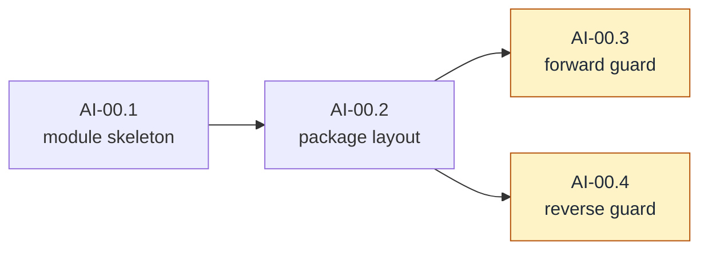

#### AI-00.1 — Module skeleton `[mechanical]`

- **Check list:**
  1. WHEN `backend/agent/` exists with `go.mod` (module path and Go version as chartered, **zero requires**), `Makefile`, `.golangci.yml`, `README.md`, `.gitignore` THEN `make test` and `make lint` run and pass inside the new module (trivially — there is nothing to test yet, and an empty pass is still evidence the tooling is wired).
  2. WHEN a repo-root `go.work` lists all three modules THEN `go build ./...` succeeds from each module directory independently, and `make test` in `database_administrator` and `workspace_syncer` is unchanged from its pre-change output.
  3. `database_administrator/go.mod` gains **no** `replace` directive, and `database_administrator/src/tools/tools.go` is byte-identical (diff recorded).
  4. The `README.md` states the module's one-paragraph purpose, its three-layer contents, and the fact that `make test` must be run here separately because no CI exists.
- **Depends on:** —
- **Out of scope:** any package content (AI-00.2); any dependency.

#### AI-00.2 — Package and test-package layout `[mechanical]`

- **Check list:**
  1. `src/ai/` exists as the Layer 1 package with a package documentation file that states the layer boundary and the import rule, and nothing else — the contract text grows one milestone at a time and each milestone's doc paragraph is guarded where it makes a checkable claim.
  2. `src/agenttest/` exists as a **direct sibling** of `src/ai/`, holding an external-package test that imports `src/ai` and compiles. This is the structural constraint of [ADR 0005 § D2](../../adr/0005-promote-agent-stack-to-own-module.md#d2--location-mapping-v2) and Guard C: AI-20.4's signature guard will resolve the Layer 1 source path relative to its own source file, so any other layout breaks it silently.
  3. The layout leaves room for the sibling layers `src/agent/`, `src/coding/` and `src/cmd/cachicamas/` without creating them — they belong to docs 0003 and 0004, and creating empty directories now would make the forward guard's forbidden-prefix list untestable.
- **Depends on:** AI-00.1.

#### AI-00.3 — Forward guard: Layer 1 purity `[guard]`

- **Test list:**
  1. The boundary test uses **`go list -deps` with an allowlist** (stdlib plus this module's own packages), so it covers test imports and transitive dependencies — the two blind spots ADR 0005 § Guard A records in the `.Imports`-only approach it replaces.
  2. Forbidden-prefix coverage names both sibling backend modules **and** the future sibling layers (`src/agent`, `src/coding`, `src/cmd`), plus the § D3 split: OTel **API** paths allowed, OTel **SDK**, exporter and `otelslog` paths forbidden.
  3. The allowlist is a *deny-by-default* list: a dependency that is neither stdlib nor own-module fails the guard even if nobody thought to forbid it by name. This is what makes AI-24's transport choice a visible, ADR-gated event rather than a quiet `go get`.
  4. **Bite proof:** three scratch violations — an import of `database_administrator`, an import of the OTel SDK, and an import of an arbitrary third-party module — each make the guard fail; the red output is recorded in the PR, then the violations are dropped.
- **Depends on:** AI-00.2.
- **Out of scope:** the reverse direction (AI-00.4); the ambient-authority scan over the adapter package (AI-25.2).

#### AI-00.4 — Reverse guard: nothing reaches back `[guard]`

- **Test list:**
  1. A new module-scope test in `database_administrator` asserts that no package outside `src/application/` and `src/cmd/server` imports the agent module (ADR 0005 § Guard B — green from birth by design, and that is the point: it fails on the first accidental import rather than on the first production incident).
  2. The existing `src/domain` forbidden-prefix import test is extended to name the agent module — Guard B's first half, which the module-scope test subsumes functionally but the ADR names separately.
  3. **Bite proof:** a scratch import of `backend/agent` from `src/domain` fails the guard; recorded, dropped.
- **Depends on:** AI-00.2. **Parallel with:** AI-00.3.
- **Evidence gate exception:** this leaf's gate is `make test` in `backend/database_administrator/`, not in `backend/agent/`.
- **Out of scope:** exercising the permitted D1 row-5 import — a non-goal for all of v1, and one that breaks `docker compose build` (ADR 0005 prices it).

### AI-01 — Record the Layer 1 contract vocabulary

SDD change: `cachicamas-ai-contract-vocabulary` · Names before code. Cheap, and the only milestone that can prevent a whole class of later argument.

**Charter**

- **Goal:** Name every concept Layer 1 exposes, once, so later milestones argue about behavior rather than nouns.
- **Deliverable:** A recorded vocabulary: one definition per term, one owning milestone per term, and an explicit list of terms that are deliberately *not* Layer 1's.
- **Acceptance:** Every subsequent milestone's charter can be written using only these terms; a term that turns out to be missing is appended by amendment rather than invented in a PR.
- **Depends on:** AI-00. · **Blocks:** AI-02, AI-03, and every contract milestone.
- **Out of scope:** Go identifiers. The vocabulary is conceptual; each milestone's SDD chooses spellings.

#### AI-01.1 — The vocabulary `[decision]`

- **Closing checklist:**
  1. Request-side terms defined: role, message, content part and its kinds, tool declaration, tool choice, tool call, tool result, system-instruction segment, cache-boundary marker, generation option, provider escape hatch.
  2. Stream-side terms defined: event, event kind, payload, sequence, stream, terminal event, delta, block index, call ordinal.
  3. Metadata terms defined: finish reason, usage, token-count field, absence versus zero.
  4. Failure terms defined and separated: caller-contract failure (AI-04's territory) versus provider/transport failure (AI-19's), and the pre-stream versus mid-stream delivery split.
  5. Terms explicitly **excluded** from Layer 1, with their owner named: agent turn, transcript, session, tool execution, permission, compaction, cost, price, frontend.
  6. The two wording traps from [the layer boundary](#layer-boundary) are restated in the artifact, because both have already caused one wrong decision each.
- **Depends on:** AI-00.

### AI-02 — Decide stream lifecycle, ownership, and the carrier

SDD change: `cachicamas-ai-stream-lifecycle` · Closes the concern the retired plan tracked as **G13**. Decision only — no production code — but it constrains every event and provider milestone that follows.

**Charter**

- **Goal:** Settle who creates a stream, who closes it, what cancellation means, what happens under pressure, and what carries the events — before any event type exists.
- **Deliverable:** A recorded decision covering carrier, ownership, cancellation, buffering and the failure-delivery split.
- **Acceptance:** AI-14 … AI-20 can be written without reopening any of these five questions; AI-34's buffer measurement has a stated starting point to confirm or change.
- **Depends on:** AI-01. · **Blocks:** AI-14, AI-20, AI-21, AI-22.
- **Note — the carrier choice is free here, and only here.** The retired plan's default (keep channels) leaned partly on the cost of invalidating shipped guards. Nothing is shipped. The stranded-producer objection to channels — a consumer who stops reading strands the producer goroutine forever — is answerable by the send discipline this decision adopts (every send selects on cancellation, the caller owns the context), not by the carrier. The documented default therefore remains a receive-only channel with an iterator *view* offered from the test kit (AI-22.5), but the SDD must record why it chose what it chose, given that this is the last cheap moment to choose differently.

#### AI-02.1 — Lifecycle, ownership and carrier `[decision]`

- **Closing checklist:**
  1. **Carrier:** receive-only channel versus range-over-func iterator at the package boundary, decided with rationale. If channels win, the iterator-ergonomics requirement is delegated to AI-22.5 and the decision says so. If iterators win, this document's waves 2–5 gain amendment nodes under the living-graph clause.
  2. **Ownership:** the producer creates the stream and closes it exactly once; nothing else closes it; the consumer never closes it. What "exactly once" means across the completion, error and cancellation paths is stated, not implied.
  3. **Cancellation:** the caller owns a cancellable context; every send selects on it; cancellation closes the stream within bounded time. Abandoning a stream *without* cancelling is a documented contract violation rather than a supported mode — a statement that must appear in the package contract because it cannot be tested to termination (AI-40.3 re-states it at the freeze).
  4. **Buffering:** a bounded buffer with a decided starting capacity, revisited with measurements at AI-34; the sanctioned loss path (a saturated buffer during cancellation drops late events and closes without a terminal) is stated here and proven at AI-20.3.
  5. **Failure delivery:** what a caller observes when the request never becomes a stream, versus when a stream dies mid-flight — the split AI-19.5 implements as one vocabulary over two delivery paths.
- **Depends on:** AI-01.

### AI-03 — Decide the v1 capability set and optional-capability discovery

SDD change: `cachicamas-ai-minimum-capabilities` · Fixes what a conforming adapter must do, what it may do, and how "may" is discovered without widening the provider contract.

**Charter**

- **Goal:** Decide the minimum capability set every adapter must satisfy, the optional capabilities it may advertise, and the mechanism by which an optional capability is discovered.
- **Deliverable:** A recorded capability matrix with a required/optional column and a discovery mechanism.
- **Acceptance:** AI-23's suite can mark each case required or optional from this list alone; a provider lacking an optional capability is fully conformant and records "absent" rather than skipping silently.
- **Depends on:** AI-01, AI-02. · **Blocks:** AI-20.5, AI-23, AI-24.
- **Note:** Token counting is optional and **discovered by assertion on the provider value**, not part of the provider interface. That placement is load-bearing beyond Layer 1: Layer 2's compaction (v2 § 7 G3) needs a real token count and must degrade to an estimate when there is none, and making counting mandatory would force every future adapter to implement it or lie.

#### AI-03.1 — The capability matrix `[decision]`

- **Closing checklist:**
  1. Required capabilities enumerated: streaming text, tool calls, completion metadata (finish reason and usage), cancellation, typed failures with the partial-output distinction.
  2. Optional capabilities enumerated: reasoning content, token counting, honoring cache-boundary markers, and anything else v1 admits — each with the reason it is optional rather than required.
  3. Explicitly excluded for v1, with the reason: multimodal content beyond text (it needs per-provider capability detection v1 does not model), embeddings, batch APIs, server-side tool execution.
  4. The **discovery mechanism** is decided: an optional capability is an additional, separately-asserted contract on the provider value, so the core provider interface never widens. How an adapter advertises it, and how a consumer asks, are both stated.
  5. "Absent" is a **recorded outcome**, not an unrun test: the shape of the capability record AI-23.6 emits and AI-38.2 asserts is sketched here.
- **Depends on:** AI-01, AI-02.

---

## Wave 1 — Model

The wave builds the neutral request from the inside out: the failure vocabulary first, then the smallest addressable unit of a transcript, then content, then the request that holds it all, then the metadata a response returns. Nothing in this wave knows what a stream is.

### AI-04 — Define the validation error taxonomy

SDD change: `cachicamas-ai-validation-errors` · **Deliberately first.** The retired plan defined this taxonomy seventeenth, after ten milestones had each invented their own sentinels, and then spent a milestone rationalizing them. Defining it before the first validating contract costs one small milestone and removes that debt entirely.

**Charter**

- **Goal:** Separate caller-contract failures from network/provider failures, and give every later contract one way to report a rule violation.
- **Deliverable:** Typed validation errors with stable `errors.Is`/`errors.As` behavior and a positional-context carrier.
- **Acceptance:** Every construction and validation rule in AI-05 … AI-13 reports through this taxonomy; failures are matchable through at least one layer of wrapping; no error message carries a content body.
- **Depends on:** AI-01. · **Blocks:** AI-05 … AI-13, AI-19.
- **Out of scope:** Provider status-code mapping and anything that happens after a request leaves the process (AI-19).

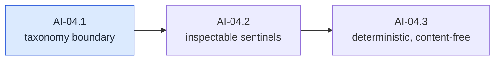

#### AI-04.1 — Taxonomy boundary `[decision]`

- **Closing checklist:**
  1. The line between a *caller-contract* failure (an invalid request — the caller's bug, knowable without I/O) and a *provider/transport* failure (AI-19's territory) is stated with examples on both sides and at least one borderline case resolved.
  2. Granularity is decided: one sentinel per rule, per type, or per category — with the consequence for `errors.Is` matching stated. The recommended default is one sentinel per rule class, reusable across types, so that "empty value" is one thing everywhere.
  3. Aggregate versus short-circuit is decided: report all violations, or the first in a documented order. The recommended default is ordered first-failure, because it makes tests deterministic and keeps error construction allocation-free on the hot path.
  4. How positional context (which message, which content index, which tool) attaches without becoming a second, parallel error type.
- **Depends on:** AI-01.

#### AI-04.2 — Sentinels are inspectable `[leaf]`

- **Test list:**
  1. WHEN a validation failure is wrapped at least once THEN `errors.Is` still matches its sentinel.
  2. WHEN a failure carries positional context THEN `errors.As` extracts it, and the extracted value names the position unambiguously (which message, which part index).
  3. The human-readable message never carries a content body, an argument payload, or a credential — the redaction posture starts here, not at AI-36, because a validation error is the first thing in the package that formats caller data.
- **Depends on:** AI-04.1.

#### AI-04.3 — Deterministic and content-free `[leaf]`

- **Test list:**
  1. WHEN a value violates several rules at once THEN the reported failure is the first in the documented order, identically across runs and across `-race` (no map iteration deciding which rule fires).
  2. A validation failure never panics on any input, including deeply nested, empty, and maximum-size values.
  3. *(pin)* Constructing an error does not retain a reference to the offending content — asserted by the message-content check of AI-04.2 applied to a distinctive sentinel body, so a later refactor that starts embedding payloads fails here.
- **Depends on:** AI-04.2.

### AI-05 — Define roles and message identity

SDD change: `cachicamas-ai-message-roles`.

**Charter**

- **Goal:** Define the smallest addressable unit of a transcript: a message with a role and ordered content.
- **Deliverable:** A closed role vocabulary, message identity, ordered content, and copy-on-construct semantics.
- **Acceptance:** A message is constructible only through the rules, its content order round-trips, and a caller cannot mutate a constructed message from outside.
- **Depends on:** AI-04. · **Blocks:** AI-06 … AI-10.
- **Out of scope:** What content parts *are* (AI-06 … AI-09); anything about requests (AI-10).

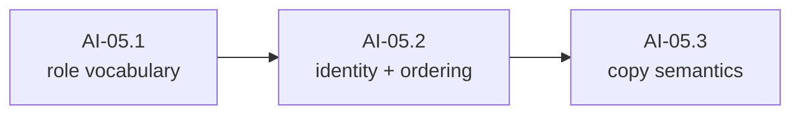

#### AI-05.1 — Walking skeleton: a message with a role `[leaf]`

- **Test list:**
  1. WHEN a message is constructed with each vocabulary role THEN construction succeeds and the role reads back exactly.
  2. WHEN a role outside the vocabulary is used THEN construction fails with an AI-04 sentinel — the vocabulary is closed, not advisory.
  3. Each role's string form is stable, lowercase, and round-trips through parse-and-render.
  4. *(pin)* An exhaustiveness assertion over the registered roles fails when a role is added without extending the parse table — the pattern every later closed vocabulary in this package reuses.
- **Depends on:** AI-04.
- **Out of scope:** whether a given role may carry a given content kind — a request-level rule (AI-10.3).

#### AI-05.2 — Identity and content ordering `[leaf]`

- **Test list:**
  1. A message carries a stable identity that is comparable and does not change across reads.
  2. A message carries ordered content, and the order reads back exactly as constructed, including with repeated identical parts.
  3. WHEN a message is constructed with no content THEN it fails with an AI-04 sentinel — an empty message is a caller bug, and every provider rejects it downstream anyway.
- **Depends on:** AI-05.1.

#### AI-05.3 — Copy semantics `[leaf]`

- **Test list:**
  1. WHEN a caller mutates the slice or values it passed to the constructor THEN the constructed message is observably unchanged — construction copies, it does not alias.
  2. WHEN a caller reads content back out THEN mutating what it received does not change the message — reads return copies or immutable views.
- **Depends on:** AI-05.2.
- **Note:** this is the property that lets AI-21.6's request capture assert on history without defensive copying at the call site, and the one whose absence produces the most confusing class of test failure in a streaming package.

### AI-06 — Define content parts: readable and sealed

SDD change: `cachicamas-ai-content-parts` · **The keystone of wave 1.** The retired design needed two corrective milestones here — one to make parts readable from another package, one to close a construction bypass — because the two properties were decided separately and pulled in opposite directions. One decision, applied once, is the whole point of this milestone.

**Charter**

- **Goal:** Define the content-part contract — discriminator, construction rules, and payload accessors — and the text variant as its first subject.
- **Deliverable:** One part strategy that makes every variant's payload readable from another package **and** every unconstructed value invalid; the text variant built against it; a registration guard.
- **Acceptance:** An external-package test constructs a text part and reads its exact text back; the same test cannot smuggle a zero-value or hand-rolled part into a message.
- **Depends on:** AI-04, AI-05. · **Blocks:** AI-07, AI-08, AI-09, AI-10, and — through readability — AI-26, which is structurally impossible without it.
- **Note:** The two properties are in tension: a part whose payload is readable from another package is usually one that can also be *built* there, which is exactly the bypass to avoid. Any strategy that satisfies one and not the other has failed this milestone, which is why AI-06.1 decides them together and every later variant inherits the answer instead of re-deriving it.

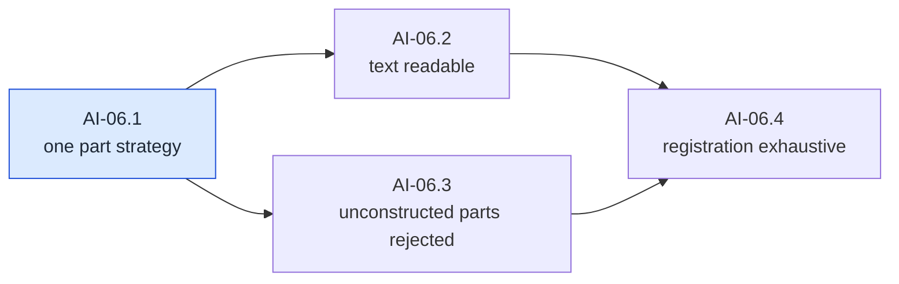

#### AI-06.1 — One content-part strategy `[decision]`

- **Closing checklist:**
  1. A single strategy is chosen that simultaneously satisfies: **(a)** an adapter in another package can read a part's payload out of a constructed message, and **(b)** no value that skipped the constructor — zero value, hand-rolled implementation, or struct literal — can validate. The artifact demonstrates both properties against the chosen strategy before any code exists.
  2. The relationship between discriminator and payload is fixed: the kind is *derived from* the payload rather than set alongside it, so the two can never disagree.
  3. The procedure for adding a new kind later is stated — registration, accessor, construction rule, and the guard that fails when one of the three is missing (AI-06.4 mechanizes it).
  4. The accessor shape is decided once for all variants: how a caller discovers a part's kind and obtains the typed payload without a type switch over unexported types.
- **Depends on:** AI-04, AI-05.

#### AI-06.2 — Text is constructible and readable `[leaf]`

- **Test list:**
  1. WHEN an **external-package** test constructs a text part and places it in a message THEN it can read the exact text back through the public surface — byte-equal, no re-encoding.
  2. Discriminator and payload agree: the part that reports the text kind yields text, never an empty or zero payload.
  3. Construction rules fail through AI-04 sentinels: empty text, whitespace-only text, and text over the documented length bound.
  4. Valid text survives construction unaltered, including embedded newlines, high Unicode, and content that looks like markup.
- **Depends on:** AI-06.1.
- **Out of scope:** reasoning, tool-call and tool-result variants (AI-07, AI-09); the seal (AI-06.3).

#### AI-06.3 — Unconstructed parts cannot reach a message `[leaf]`

- **Test list:**
  1. WHEN a zero value of any exported part-related type is placed directly into message content THEN validation rejects it with an AI-04 sentinel — the retired plan's C1 defect, made impossible before a second variant exists to inherit it.
  2. WHEN an external package attempts to implement the part contract itself THEN either the compiler prevents it or validation rejects the result; whichever the AI-06.1 strategy chose, the test proves it.
  3. WHEN the same value is offered through the request path instead of the message path THEN it is rejected there too — defense at both boundaries, in the documented validation order.
- **Depends on:** AI-06.1. **Parallel with:** AI-06.2.

#### AI-06.4 — Kind registration is exhaustive `[guard]`

- **Test list:**
  1. A mechanical scan asserts that every registered part kind has all three of: a constructor with rules, a payload accessor, and a validation path. **Bite proof:** a scratch kind registered with only two of the three fails the guard; recorded, dropped.
  2. The package documentation's list of kinds matches the registration table — a checkable claim, guarded, rather than prose that drifts.
- **Depends on:** AI-06.2, AI-06.3.

### AI-07 — Define reasoning content with its round-trip token

SDD change: `cachicamas-ai-reasoning-content` · Absorbs what the retired plan deferred to a later breaking change (**G12(b)**). The token is not metadata; it is correctness.

**Charter**

- **Goal:** Define optional reasoning content that can carry an opaque provider blob returned byte-identically.
- **Deliverable:** A reasoning content variant with a state, optional text, and an opaque round-trip token that cachicamas never interprets.
- **Acceptance:** A reasoning part survives construction and readback with its token byte-for-byte identical; redacted and signature-only shapes are constructible and valid; nothing in the package parses or reformats the token.
- **Depends on:** AI-06. · **Blocks:** AI-17, AI-29.
- **Note:** At least one provider signs reasoning blocks cryptographically. If the signature is not returned exactly, multi-turn extended thinking with tool use fails at the API — a silent correctness failure that appears only on the second turn of a tool-using conversation, which is why the storage must exist before the adapter that produces it.

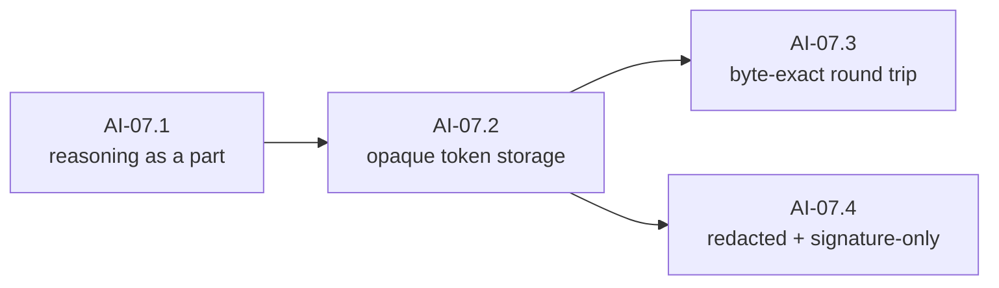

#### AI-07.1 — Reasoning as a content part `[leaf]`

- **Test list:**
  1. A reasoning part is constructed and read back through the AI-06.1 strategy, exactly like text — no second strategy, no special case.
  2. Reasoning and text are structurally distinct: no accessor yields reasoning content as text, and a consumer switching on kind cannot conflate them.
  3. The reasoning state vocabulary is closed and each state is constructible: with text, redacted, and token-only.
- **Depends on:** AI-06.

#### AI-07.2 — Opaque token storage `[leaf]`

- **Test list:**
  1. A reasoning part can carry an opaque provider token alongside its state and text; **absence is distinguishable from an empty token** (the distinction a naive design collapses and an adapter cannot recover).
  2. Nothing in the package interprets, validates, normalizes or length-caps the token beyond a documented sanity bound — proven by constructing tokens that are not valid UTF-8, not valid JSON, and not printable.
- **Depends on:** AI-07.1.

#### AI-07.3 — Byte-exact round trip `[leaf]`

- **Test list:**
  1. WHEN a reasoning part with a token is placed in a message, read back, and re-attached THEN the token is byte-identical — covering every byte class: binary, high Unicode, embedded NUL, and a token longer than any plausible buffer boundary.
  2. The property survives the copy semantics of AI-05.3: copying a message copies the token exactly, and mutating the caller's byte slice afterwards does not change it.
- **Depends on:** AI-07.2.
- **Out of scope:** survival through request rebuild — proven at AI-12.1 once the rebuild path exists; survival through the wire — AI-26.6 and AI-29.2.

#### AI-07.4 — Redacted and signature-only variants `[leaf]`

- **Test list:**
  1. A **redacted** reasoning part carries its opaque payload byte-exact and is distinguishable from a part that merely has no text — at least one provider ships encrypted redacted blocks that must replay verbatim.
  2. A reasoning part with a token but **no text** is constructible and valid — the signature-only shape, and the "this provider emitted no reasoning text" state from the leakage register.
  3. Neither variant can be confused with a text part or with an absent part by any accessor.
- **Depends on:** AI-07.2. **Parallel with:** AI-07.3.

### AI-08 — Define tool declarations

SDD change: `cachicamas-ai-tool-declarations`.

**Charter**

- **Goal:** Define the provider-neutral transport representation of the tools a model may call.
- **Deliverable:** A tool declaration with name, description and schema bytes; tool-set rules; the tool-choice vocabulary.
- **Acceptance:** Schema bytes pass through byte-faithfully; a tool set has a deterministic iteration order; tool choice is validated against the declared set.
- **Depends on:** AI-04, AI-05. **Parallel with:** AI-06, AI-07. · **Blocks:** AI-10, AI-18, AI-26.
- **Out of scope:** Validating a tool's JSON schema against a schema meta-schema, executing tools, and resolving tool names — none of which is Layer 1's.

#### AI-08.1 — A declaration is constructible and readable `[leaf]`

- **Test list:**
  1. A declaration is constructed with name, description and schema bytes, and all three read back exactly from an external package.
  2. Schema bytes pass through **unmodified** — no re-marshalling, no key reordering, byte-equality asserted. This is the property AI-26.4 needs for a stable cache prefix, and it cannot be added later without breaking every fixture.
  3. Construction rules fail through AI-04 sentinels: empty name, a name outside the documented character rules, empty schema bytes.
- **Depends on:** AI-04.

#### AI-08.2 — Tool-set rules `[leaf]`

- **Test list:**
  1. Duplicate tool names in one set are rejected with an AI-04 sentinel.
  2. An empty tool set is legal — a request with no tools is the common case, not an error.
  3. WHEN a tool set is iterated twice THEN the order is identical, and it is the order the caller supplied. Map-iteration order reaching the wire would silently invalidate a provider's cache prefix on every call: no failure, just a tenfold input bill.
- **Depends on:** AI-08.1.

#### AI-08.3 — Tool choice `[leaf]`

- **Test list:**
  1. The tool-choice vocabulary is closed and each value is constructible: automatic, none, required, and a specific named tool.
  2. WHEN tool choice names a tool that is not in the declared set THEN validation fails with an AI-04 sentinel.
  3. WHEN tool choice is anything other than "none" and the tool set is empty THEN validation fails — the combination every provider rejects, caught client-side.
- **Depends on:** AI-08.2.

### AI-09 — Define tool calls and tool results

SDD change: `cachicamas-ai-tool-messages`.

**Charter**

- **Goal:** Define the two content variants that carry a model's tool invocation and its answer.
- **Deliverable:** A tool-call part with identity, name, exact argument bytes and an observable ordinal; a tool-result part with call correlation, content and a failure indication.
- **Acceptance:** Argument bytes round-trip byte-equal from an external package; a result's correlation to its call round-trips exactly; ordinal position is observable.
- **Depends on:** AI-06. **Parallel with:** AI-07, AI-08. · **Blocks:** AI-10, AI-18, AI-26.
- **Out of scope:** Validating arguments against the tool's schema, executing anything, and enforcing call/result pairing across a transcript — the last is Layer 2's history invariant, and the request-level fragment of it is AI-10.3's decision.

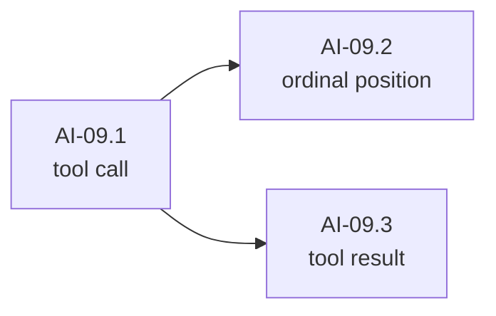

#### AI-09.1 — Tool call `[leaf]`

- **Test list:**
  1. An external-package test reads a constructed tool call's identity, name and **exact argument bytes** back out of a message.
  2. Argument bytes survive unmodified — no re-marshalling, no key reordering, no whitespace normalization (byte-equality asserted; this is what AI-26 and AI-30 depend on).
  3. Construction rules fail through AI-04 sentinels: empty identity, empty name, argument bytes that are not syntactically well-formed for the documented encoding.
  4. A call with **empty arguments** is constructible and normalizes to one canonical empty form — a no-argument tool is routine, and a parse failure on empty input is a shipped-SDK bug class.
- **Depends on:** AI-06.

#### AI-09.2 — Ordinal position `[leaf]`

- **Test list:**
  1. WHEN a message carries several tool calls THEN each call's ordinal position is observable and stable across reads.
  2. The ordinal survives message copy and readback — Layer 2's call-ordered rejoin depends on it, and several providers reject tool results that do not correspond positionally to their calls.
- **Depends on:** AI-09.1.

#### AI-09.3 — Tool result `[leaf]`

- **Test list:**
  1. An external-package test reads a constructed tool result's call correlation and content back out of a message.
  2. Correlation identity round-trips exactly, including identities an adapter minted synthetically (AI-26.5 depends on this, and so does session reload one layer up).
  3. A result that reports a **tool failure** is distinguishable from one that reports success — a failing tool is a normal outcome the model must see, not a transport error.
- **Depends on:** AI-09.1. **Parallel with:** AI-09.2.

### AI-10 — Define the normalized request core

SDD change: `cachicamas-ai-model-request` · The first milestone that assembles the wave's pieces into the thing a provider receives.

**Charter**

- **Goal:** Define the normalized request: model identity, an **ordered, segmented** system instruction, ordered messages, the tool set and tool choice, and generation options.
- **Deliverable:** A request that validates once, before any I/O, and exposes everything it holds to a reader in another package.
- **Acceptance:** A request round-trips: an external-package test walks every region and reconstructs an equal request from what it read — the property AI-26's translator needs, proven before AI-26 exists.
- **Depends on:** AI-06, AI-07, AI-08, AI-09. · **Blocks:** AI-11, AI-12, AI-20, AI-26.
- **Note — the system instruction is segmented from birth.** The retired plan shipped it as a flat string and then needed a breaking change to make cache boundaries expressible at all. Ordered segments cost nothing here: a single-segment request is the common case, and the ergonomic constructor for it is part of this milestone's deliverable.

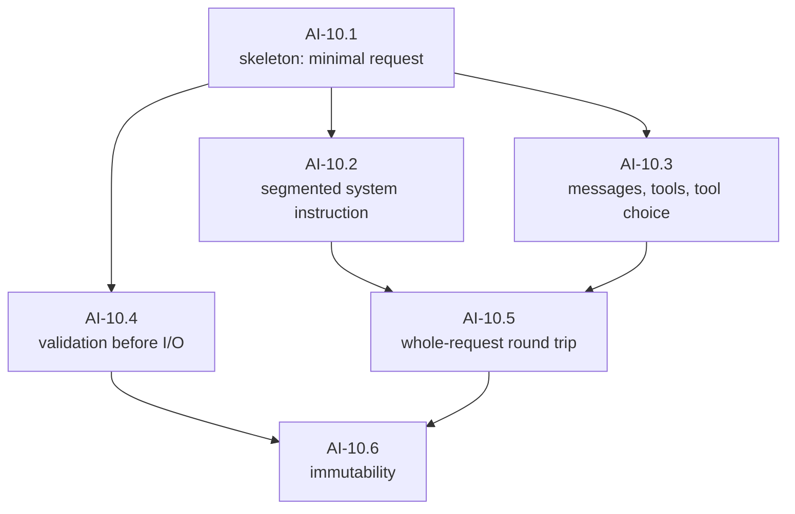

#### AI-10.1 — Walking skeleton: a minimal valid request `[leaf]`

- **Test list:**
  1. WHEN a request is constructed with a model identity and one user text message THEN it validates, and both read back exactly from an external package.
  2. WHEN the model identity is empty, or there are no messages THEN validation fails with AI-04 sentinels.
  3. Generation options carry through construction and read back — the neutral vocabulary decided in AI-01, no more.
- **Depends on:** AI-06, AI-09.
- **Out of scope:** every other region (siblings); overrides and rebuilding (AI-12).

#### AI-10.2 — Segmented system instruction `[leaf]`

- **Test list:**
  1. WHEN a request carries a system instruction as ordered segments THEN segment order and content round-trip exactly.
  2. The single-segment convenience path produces a request indistinguishable from one built segment-by-segment with one segment.
  3. An absent system instruction is legal and distinguishable from one empty segment.
  4. Segment construction rules fail through AI-04 sentinels (empty segment, whitespace-only segment).
- **Depends on:** AI-10.1.
- **Out of scope:** cache markers on segments (AI-11.1).

#### AI-10.3 — Messages, tools and tool choice on the request `[leaf]`

- **Test list:**
  1. Message order and intra-message content order are preserved exactly through construction and readback.
  2. The tool set and tool choice attach to the request, and AI-08.3's cross-validation runs at the request boundary too.
  3. Role-versus-content-kind rules are enforced where they exist and their disposition is pinned by test where they do not — for example whether a tool-result part may appear in a non-tool role is *decided here and asserted*, rather than left to the first adapter to discover.
  4. WHEN a tool result correlates to no tool call anywhere in the request THEN the documented disposition applies — reject, or accept and let the provider judge — and the test pins whichever the SDD chose, with its reason.
- **Depends on:** AI-10.1.

#### AI-10.4 — Validation happens once, before I/O `[leaf]`

- **Test list:**
  1. WHEN a request is validated THEN the first failure in the documented order is reported, identically across runs (AI-04.3's property at the request level).
  2. Validation is total over the regions: every region's rules run, and a request that passes cannot contain an unconstructed part, a duplicate tool name, or an unresolvable tool choice.
  3. Validation performs no I/O — asserted mechanically in the AI-00.3 guard style: the request path's dependency closure contains no network or filesystem package.
- **Depends on:** AI-10.2, AI-10.3.

#### AI-10.5 — Whole-request round trip `[leaf]`

- **Test list:**
  1. WHEN an external-package test walks a request holding every part variant — text, reasoning with a token, tool call, tool result — plus segments, tools and options THEN it can reconstruct an **equal** request from what it read.
  2. *(pin)* The walk's kind handling is exhaustive over the registered kinds (AI-06.4's registration, consumed): adding a kind without a readable accessor fails this pin.
- **Depends on:** AI-10.2, AI-10.3.
- **Out of scope:** translation to any wire shape (AI-26).

#### AI-10.6 — Immutability `[leaf]`

- **Test list:**
  1. WHEN a caller mutates anything a reader returned THEN the request is observably unchanged on re-read.
  2. WHEN a caller mutates the values it passed to the constructor THEN the constructed request is observably unchanged (AI-05.3's property, at request scope).
  3. Two requests constructed from identical inputs compare equal by the documented equality, and neither is affected by operations on the other.
- **Depends on:** AI-10.4, AI-10.5.

### AI-11 — Add cache-boundary markers

SDD change: `cachicamas-ai-cache-breakpoints` · Closes the Layer 1 half of **G4**, at the moment it is free.

**Charter**

- **Goal:** Make prompt-cache boundaries expressible on the request.
- **Deliverable:** Cache-boundary markers on system segments, tool declarations and messages; a documented cap; the tools → system → messages invalidation ordering readable by an adapter.
- **Acceptance:** A request can express a legal breakpoint set and an adapter can either render it or ignore it whole — markers are advisory by contract.
- **Depends on:** AI-10. · **Blocks:** AI-24, AI-26.2.
- **Out of scope:** Measuring cache hit rates; usage accounting — AI-13.3 already carries the cache-read and cache-write token fields, and this milestone adds nothing there.
- **Note:** Caching is opt-in per breakpoint on at least one provider, with a strict invalidation cascade and a small hard cap on breakpoint count; cached reads cost roughly a tenth of fresh input. A design that cannot express a breakpoint can never obtain that discount, and the omission is invisible until the bill arrives.

#### AI-11.1 — Markers on segments, tools and messages `[leaf]`

- **Test list:**
  1. A system segment, a tool declaration and a message can each carry a cache-boundary marker; marker placement round-trips through construction and readback.
  2. Markers do not participate in validity: a marked request and its unmarked twin validate identically and are otherwise equal.
  3. A marker is readable from an external package wherever it can be set — the adapter is the only consumer that will ever care.
- **Depends on:** AI-10.

#### AI-11.2 — Cap and ordering invariants `[leaf]`

- **Test list:**
  1. WHEN a request's total marker count exceeds the documented cap THEN validation fails before I/O with an AI-04 sentinel naming the excess — the vendor cap is small and hard, and catching it client-side is the point of the seam.
  2. An adapter can read markers **in tools → system → messages order** regardless of the order in which they were set, because that is the order the invalidation cascade runs in.
- **Depends on:** AI-11.1.

#### AI-11.3 — Advisory semantics `[leaf]`

- **Test list:**
  1. WHEN a translator ignores every marker THEN the request is still fully translatable and semantically unchanged — an adapter for an auto-caching provider is conformant while ignoring them entirely.
  2. *(pin)* The usage-side surface is untouched by this milestone — the cache token fields exist from AI-13.3 and this milestone adds request-side expression only.
- **Depends on:** AI-11.2.

### AI-12 — Add per-request options, the escape hatch, and rebuild

SDD change: `cachicamas-ai-request-extension-points` · Closes **G9**, and provides the seam Layer 2's pre-request hook stands on ([v2 § 6 seam 1](../0001-cachicamas-agent-stack-v2.md#6-the-twelve-seams-that-must-exist-now)).

**Charter**

- **Goal:** Let a caller derive a modified request from an existing one, override generation options per call, and carry a provider-specific value the neutral vocabulary does not model.
- **Deliverable:** Copy-on-write rebuilding, per-request option overrides, and a typed-but-opaque namespaced pass-through.
- **Acceptance:** A provider-specific value survives to its adapter without any other adapter needing to know it exists; a rebuilt request leaves the original observably unmodified.
- **Depends on:** AI-10, AI-11. · **Blocks:** AI-24, AI-26.7; and Layer 2's pre-request hook.
- **Note:** The design principle is deliberate and belongs in the SDD: the correct response to provider divergence is a typed pass-through, **not** a wider neutral vocabulary. Every field added to the neutral model for one provider becomes a field every other adapter must ignore, and the model grows without bound.


#### AI-12.1 — Copy-on-write rebuild `[leaf]`

- **Test list:**
  1. WHEN a caller derives a modified request from an existing one THEN the original is observably unmodified (deep comparison before and after) and the derived request validates independently.
  2. Deriving is **total**: every region — system segments, messages, tools, tool choice, options, markers — is reachable by the rebuild path. A region the hook cannot reach is a region a cache breakpoint or injected context can never be applied to.
  3. *(pin)* A request carrying reasoning round-trip tokens rebuilds with every token byte-identical (AI-07.3's property, extended across the path session persistence will later travel).
- **Depends on:** AI-11.

#### AI-12.2 — Per-request options `[leaf]`

- **Test list:**
  1. WHEN a per-request option overrides a construction-time option THEN the effective value is the override, observable via readback; absent overrides fall through to the constructed value.
  2. Option validation runs at derive time with the same AI-04 sentinels as construction — there is no second, weaker validation path.
- **Depends on:** AI-12.1.

#### AI-12.3 — Typed-but-opaque pass-through `[leaf]`

- **Test list:**
  1. WHEN a caller attaches a provider-namespaced opaque value THEN it survives to the adapter that claims the namespace, byte-exact.
  2. WHEN an adapter for a *different* provider reads the same request THEN the foreign value is invisible to it and its translation is unaffected.
  3. The pass-through is inert in validation and equality: two requests differing only in a third provider's namespace validate identically.
- **Depends on:** AI-12.1. **Parallel with:** AI-12.2.

#### AI-12.4 — Read-back determinism `[leaf]`

- **Test list:**
  1. Reading or iterating the option set and the pass-through values of one request twice yields identical order and content — the extension surfaces expose no map-iteration nondeterminism to a future serializer or wire body.
- **Depends on:** AI-12.2, AI-12.3.
- **Out of scope:** wire-byte determinism — owned by AI-26.1 and AI-26.4, where wire bytes first exist. This node only guarantees the neutral surface cannot be the source of the nondeterminism.

### AI-13 — Define finish reasons and usage

SDD change: `cachicamas-ai-completion-metadata` · Absorbs **G12(c)**: refusal and pause are in the vocabulary from birth, not added later to a frozen enum.

**Charter**

- **Goal:** Define the terminal metadata a response carries: why generation stopped, and what it consumed.
- **Deliverable:** A closed finish-reason vocabulary including refusal and pause-turn; a usage record whose absent fields are distinguishable from zero.
- **Acceptance:** Layer 2 can distinguish "the model declined", "the model paused — resume it" and "I do not recognise this provider string" as three states with three correct responses; a cost formula can be written from the usage fields without ambiguity.
- **Depends on:** AI-04. **Parallel with:** AI-06 … AI-12. · **Blocks:** AI-15.2, AI-31.
- **Note:** Collapsing refusal and pause into an unknown fallback is a loop-termination bug, not a cosmetic gap — it is the retired plan's G12(c), and it costs nothing to avoid here.

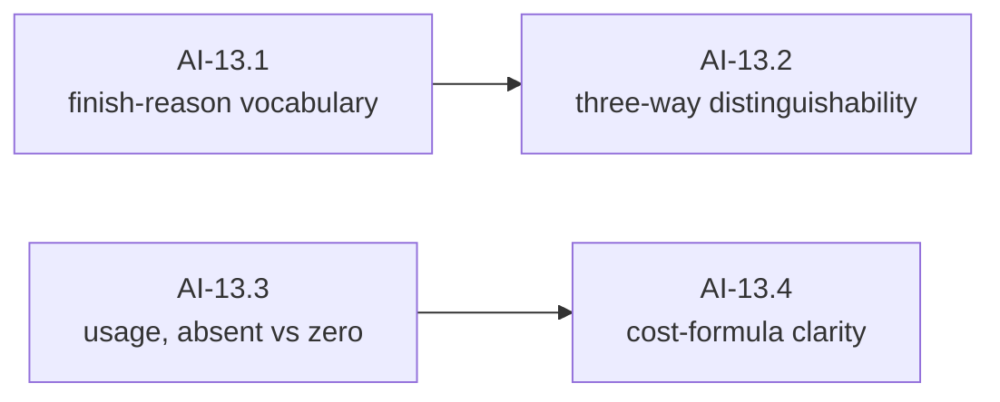

#### AI-13.1 — The finish-reason vocabulary `[leaf]`

- **Test list:**
  1. The vocabulary is closed and each value is constructible, including **refusal** and **pause-turn** alongside natural stop, length, tool calls, content filter and unknown.
  2. Refusal and content filter are distinct values, and the line between them is documented — they are different events with different correct responses.
  3. Provider strings normalize into the vocabulary after trimming and lowercasing; each known synonym family maps to its value.
  4. WHEN a provider string is unrecognized THEN it maps to the unknown value without error — the normalizer-crash bug class, pinned from the first day.
  5. *(pin)* An exhaustiveness assertion fails when a value is added without extending the normalization table and the string form.
- **Depends on:** AI-04.

#### AI-13.2 — Three-way distinguishability `[leaf]`

- **Test list:**
  1. "The model declined", "the model paused — resume it" and "unrecognized provider string" are three distinct values that a consumer's exhaustive switch must handle separately; reintroducing the collapse requires a compile-visible change.
  2. The documented obligation attached to each value is stated and testable where it is testable: a paused finish expects resumption with received content replayed verbatim, and that obligation is recorded here for AI-31.1 and Layer 2 to honor.
- **Depends on:** AI-13.1.

#### AI-13.3 — Usage: absent is not zero `[leaf]`

- **Test list:**
  1. Usage carries input, output, cache-read, cache-write and reasoning token counts, and **an absent field is distinguishable from a zero field** on every one of them.
  2. Usage is constructible with any subset present — a provider that reports only input and output produces a valid usage record, not a record full of zeros.
  3. Usage is readable from an external package, field by field, with absence surfaced rather than defaulted.
- **Depends on:** AI-04. **Parallel with:** AI-13.1.

#### AI-13.4 — Cost-formula clarity `[leaf]`

- **Test list:**
  1. The inclusive-or-exclusive semantics of the input-token field with respect to cache-read and cache-write tokens are **documented and pinned by test** against a constructed cache-hit record — on at least one vendor the plain input figure excludes cached tokens, so summing the wrong fields silently under-reports spend on every cached call.
  2. The documented cost formula over the fields is expressed as an assertion in the test, so a later field addition that changes the formula cannot land silently.
- **Depends on:** AI-13.3.
- **Out of scope:** money, price tables, and per-turn cost events — all Layer 2 and Layer 3 (v2 § 7 G10). Layer 1's obligation ends at honest token counts.

---

## Wave 2 — Stream

Wave 1 built what goes to the model. This wave builds what comes back, and the interface that carries it. The ordering inside the wave is the wave's whole design decision: the envelope first, then one milestone per content family, then the error taxonomy, and only then the provider interface — because an interface that declares a mandatory terminal error before the error exists is exactly how the retired plan produced an unconstructible contract.

### AI-14 — Define the event envelope with per-stream sequencing

SDD change: `cachicamas-ai-event-envelope` · Absorbs **C3**: the sequence is a property of a stream, owned by whatever owns the stream.

**Charter**

- **Goal:** Define the event envelope — kind, payload, sequence — and the ordering invariants every stream must satisfy.
- **Deliverable:** An envelope whose kind is derived from its payload, a per-stream 1-based contiguous sequence assigned by the producer, and stated ordering invariants a consumer can assert.
- **Acceptance:** Two concurrent streams each start at sequence 1 and are independently contiguous under `-race`; a mismatched or payload-less envelope cannot be constructed.
- **Depends on:** AI-02, AI-04. · **Blocks:** AI-15 … AI-20.
- **Note:** The retired design used a process-global atomic counter, which made "the first event of every stream carries sequence 1" achievable only for the first stream in a process — and a shipped test documented the resulting gaps as expected behavior. The fix is not a smaller counter; it is putting the counter where the stream is.

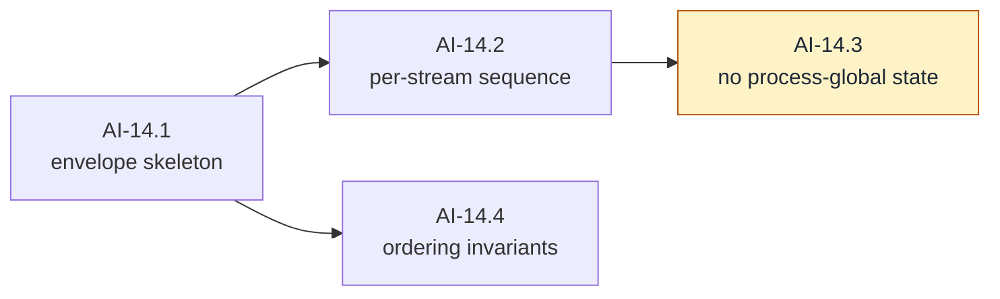

#### AI-14.1 — Envelope skeleton `[leaf]`

- **Test list:**
  1. WHEN an event is constructed from a payload THEN its kind is **derived from** that payload — a caller cannot set a kind that disagrees with what the event carries.
  2. A payload-less event cannot be constructed; validation rejects it with an AI-04 sentinel.
  3. Every registered kind has a constructible payload — asserted as a table over the registry, so the retired plan's C4 (a registered kind with no constructible payload) fails this test the day it is reintroduced.
  4. An event is readable from an external package: kind, sequence and typed payload, without a type switch over unexported types.
- **Depends on:** AI-02, AI-04.

#### AI-14.2 — Per-stream sequence `[leaf]`

- **Test list:**
  1. WHEN a stream emits N events THEN their sequences are exactly 1…N, contiguous, with the first carrying 1.
  2. WHEN two producers stream concurrently THEN **each** stream's first event carries 1 and each is independently contiguous, under `-race`.
  3. Nothing is asserted across streams: cross-stream sequence overlap is permitted and meaningless, and the contract text says so.
  4. WHEN a third stream starts after two have completed THEN it also starts at 1 — no residual process state.
  5. A hand-constructed, never-stamped event carries the documented sentinel value and is rejected at the producer boundary; what that value is and where it is rejected are stated, not implied.
- **Depends on:** AI-14.1.
- **Out of scope:** gap-detection helpers (AI-22.3); conformance enforcement (AI-23).

#### AI-14.3 — No process-global sequence state `[guard]`

- **Test list:**
  1. A mechanical scan asserts the package holds no package-level mutable sequence state and no reset helper for one. **Bite proof:** a scratch package-level counter fails the scan; recorded, dropped.
  2. The guard's rationale is recorded in its own source comment, naming C3 — a guard whose reason is not written down is deleted by the first person who finds it inconvenient.
- **Depends on:** AI-14.2.

#### AI-14.4 — Ordering invariants `[leaf]`

- **Test list:**
  1. The legal orderings are stated and checkable: a block's start precedes its deltas which precede its end; exactly one terminal event per stream; nothing follows a terminal.
  2. Deltas carry an index and never a snapshot of accumulated content — the [v2 § 4.3 invariant](../0001-cachicamas-agent-stack-v2.md#43-the-agent-event-envelope) applied at Layer 1, where a full copy per token would be quadratic allocation or a data race.
  3. The invariants are expressed as something a consumer can run against a recorded stream, not only as prose — this is the form AI-22.3 packages and AI-23 enforces.
- **Depends on:** AI-14.1. **Parallel with:** AI-14.2.

### AI-15 — Add response lifecycle events

SDD change: `cachicamas-ai-response-events`.

**Charter**

- **Goal:** Define the events that open and close a response.
- **Deliverable:** A response-start event carrying response identity and model, and a completion event carrying finish reason and usage.
- **Acceptance:** A stream that starts and completes with no content is legal, ordered, and distinguishable from a failure.
- **Depends on:** AI-13, AI-14. · **Blocks:** AI-16 … AI-19.

#### AI-15.1 — Response start `[leaf]`

- **Test list:**
  1. A response-start event carries the provider's response identity and the model actually used, as normalized fields readable from an external package.
  2. Exactly one response start per stream; a second one violates the AI-14.4 invariants and is detectable as such.
- **Depends on:** AI-14.

#### AI-15.2 — Completion `[leaf]`

- **Test list:**
  1. A completion event carries a finish reason and a usage record, with absent usage fields still absent (AI-13.3's property, preserved across the event boundary).
  2. Completion is terminal: the invariants of AI-14.4 mark it as such, and nothing may follow it.
  3. A stream of exactly response-start then completion — an empty response — is legal and distinguishable from every failure shape.
- **Depends on:** AI-15.1, AI-13.

### AI-16 — Add text delta events

SDD change: `cachicamas-ai-text-events`.

**Charter**

- **Goal:** Define streamed text content: block start, deltas, block end.
- **Deliverable:** Indexed text block events whose deltas concatenate to exact bytes.
- **Acceptance:** Concatenated deltas reconstruct the text byte-exactly, including a delta boundary that splits a multi-byte rune.
- **Depends on:** AI-15. **Parallel with:** AI-17, AI-18.

#### AI-16.1 — Text block lifecycle `[leaf]`

- **Test list:**
  1. Start, delta and end events for a text block carry a block index, and events for two blocks are attributable to their own block by index alone.
  2. Deltas carry a fragment, never the accumulated text — the consumer accumulates (AI-14.4 invariant 2, proven for this family).
- **Depends on:** AI-15.

#### AI-16.2 — Byte fidelity across deltas `[leaf]`

- **Test list:**
  1. Concatenating a block's deltas reconstructs the text byte-exactly.
  2. A delta boundary that splits a multi-byte rune reconstructs correctly — the contract states deltas are **byte** fragments, not string fragments, and this test is what makes that statement true rather than aspirational.
- **Depends on:** AI-16.1.

#### AI-16.3 — Zero-delta blocks `[leaf]`

- **Test list:**
  1. A text block that opens and closes with **no deltas** is legal and reconstructs to empty content — real transcripts contain them, and a consumer that requires at least one delta breaks on the first one.
- **Depends on:** AI-16.1.

### AI-17 — Add reasoning delta events

SDD change: `cachicamas-ai-reasoning-events`.

**Charter**

- **Goal:** Define streamed reasoning content, including the delivery of its round-trip token.
- **Deliverable:** Reasoning block events structurally distinct from text events, carrying the AI-07 token byte-exact.
- **Acceptance:** Reasoning content can never arrive as a text event; the token survives the event boundary byte-identically; redacted and signature-only shapes are streamable.
- **Depends on:** AI-07, AI-15. **Parallel with:** AI-16, AI-18.

#### AI-17.1 — Reasoning block lifecycle `[leaf]`

- **Test list:**
  1. Start, delta and end events for a reasoning block mirror the text family's shape and indexing.
  2. Reasoning events are a **structurally distinct** family — not a flag on a text event — so no consumer can render reasoning as assistant output by omitting a check.
- **Depends on:** AI-15, AI-07.

#### AI-17.2 — Token delivery `[leaf]`

- **Test list:**
  1. The round-trip token arrives on the block's events at the documented position and is byte-exact there, for every byte class AI-07.2 covers.
  2. A reasoning block with no token is valid and distinguishable from one with an empty token.
- **Depends on:** AI-17.1.

#### AI-17.3 — Redacted and signature-only streams `[leaf]`

- **Test list:**
  1. A redacted reasoning block streams with its opaque payload preserved verbatim and normalizes to the redacted state.
  2. A block carrying a token and no text streams as valid, empty-text reasoning (AI-07.4's shape, now on the wire side of the contract).
- **Depends on:** AI-17.2.

### AI-18 — Add tool-call delta events

SDD change: `cachicamas-ai-tool-call-events` · Absorbs the delta-optional requirement the retired plan tracked as **G12(a)**.

**Charter**

- **Goal:** Define streamed tool calls, whether they arrive in fragments or whole.
- **Deliverable:** Call start / optional deltas / call end events, with identity and name available at start, exact argument bytes at end, and an observable ordinal.
- **Acceptance:** A call delivered whole with zero deltas is indistinguishable, after reconstruction, from a fragmented one; no consumer may require a delta before the end event.
- **Depends on:** AI-09, AI-15. **Parallel with:** AI-16, AI-17.
- **Note:** At least one real provider delivers each tool call in a single chunk. A contract that assumes fragments certifies adapters that break against it, which is why "deltas are optional" is a contract clause with its own test rather than a tolerance nobody wrote down.

#### AI-18.1 — Call lifecycle `[leaf]`

- **Test list:**
  1. The start event carries call identity and tool name **before any argument byte arrives** — early display depends on it, and a design that only reveals the name at the end forecloses that forever.
  2. The end event carries the exact argument bytes; nothing re-marshals them (byte-equality asserted).
  3. Argument deltas carry fragments with the call's index, never accumulated arguments.
- **Depends on:** AI-15, AI-09.

#### AI-18.2 — Deltas are optional `[leaf]`

- **Test list:**
  1. A call represented as start-then-end with **zero deltas** is complete and valid.
  2. After reconstruction, a consumer cannot distinguish a whole call from its fragmented equivalent — asserted by reconstructing both forms of the same call and comparing.
  3. *(pin)* The contract text states that no consumer may require at least one delta, and no assertion anywhere in the package or test kit does.
- **Depends on:** AI-18.1.

#### AI-18.3 — Interleaving and ordinal `[leaf]`

- **Test list:**
  1. WHEN two calls stream with interleaved fragments THEN each reconstructs independently with exact bytes and no cross-contamination.
  2. Each call's ordinal position is observable from its events regardless of fragment interleaving — Layer 2's call-ordered rejoin (v2 § 7 G5) consumes it, and several providers reject positionally mismatched results.
- **Depends on:** AI-18.1.

### AI-19 — Define the provider error taxonomy and the terminal error event

SDD change: `cachicamas-ai-provider-errors` · The wave's keystone, and **deliberately placed before the provider interface**. Closes **C4** by construction and the Layer 1 half of **G8**.

**Charter**

- **Goal:** Normalize provider and transport failures into one inspectable vocabulary, delivered by two paths.
- **Deliverable:** A constructible terminal error event; a closed category vocabulary; retryability and safe metadata; a partial-output discriminator.
- **Acceptance:** An adapter in another package can construct the terminal error the provider contract will declare mandatory; error strings never require secrets or response bodies to be useful; wrapped causes remain inspectable.
- **Depends on:** AI-04, AI-14, AI-15. · **Blocks:** AI-20, AI-21, AI-23, AI-27, AI-32.
- **Note:** The retired plan defined the provider interface first and this taxonomy second, producing a contract that declared a mandatory terminal error whose payload no adapter could build. The ordering here is the fix, and it is the reason this milestone is a wave-2 keystone rather than a wave-3 afterthought.

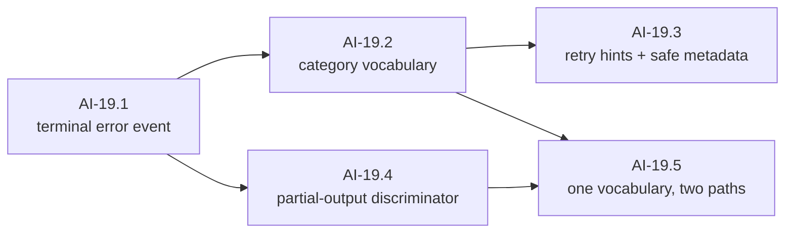

#### AI-19.1 — The terminal error event `[leaf]`

- **Test list:**
  1. WHEN an adapter in **another package** constructs a terminal error event through the public surface THEN it succeeds — the property whose absence was C4.
  2. The constructed event satisfies the AI-14 envelope invariants: kind derived from payload, validation catches a nil or mismatched payload, and the event is terminal.
  3. Terminal exclusivity holds: a stream ends in completion **or** error, never both, and the error payload cannot be confused with a completion payload by any accessor.
- **Depends on:** AI-14, AI-15.
- **Out of scope:** which categories exist (AI-19.2); emission by a real adapter (AI-32).

#### AI-19.2 — Category vocabulary `[leaf]`

- **Test list:**
  1. The taxonomy distinguishes at minimum: authentication, authorization, rate limit, unavailable/overloaded, timeout, cancellation, malformed response, unsupported capability, and unknown — each constructible, each distinguishable.
  2. WHEN a provider reports something the vocabulary does not model THEN it maps to unknown **with the raw provider label preserved** for diagnostics — the lesson from every normalizer that crashed on a novel value.
  3. Category membership is closed and enumerable, so AI-23.4 can iterate it exhaustively rather than listing cases by hand.
- **Depends on:** AI-19.1.
- **Split if:** category-specific metadata (rate-limit reset, quota identity) grows the list past seven items — metadata then becomes AI-19.6, appended.

#### AI-19.3 — Retry hints and safe metadata `[leaf]`

- **Test list:**
  1. Every category carries a machine-readable retryability signal. The **classification** lives here, where the wire evidence is; the **decision** to retry lives one layer up ([v2 § 6 seam 7](../0001-cachicamas-agent-stack-v2.md#6-the-twelve-seams-that-must-exist-now)).
  2. WHEN a provider supplies a retry-after duration THEN it is carried typed — never re-parsed from message text by a caller.
  3. Machine-readable fields (status class, provider request identity where one exists) are separate from human text, and the human text is useful without containing a credential or a response body.
- **Depends on:** AI-19.2.
- **Out of scope:** backoff execution (AI-35); adversarial redaction sweeps (AI-36).

#### AI-19.4 — Partial-output discriminator `[leaf]`

- **Test list:**
  1. A terminal error states whether normalized output events preceded it: pre-stream failure, mid-stream failure with zero output, and mid-stream failure after output are three distinguishable shapes.
  2. WHEN a consumer holds the terminal error THEN it can decide "is a naive retry safe?" from the error alone, without replaying the stream.
- **Depends on:** AI-19.1. **Parallel with:** AI-19.2.
- **Note:** a stream that dies after emitting output is the most common real-world failure and the one a naive retry predicate ("retry if nothing completed") gets wrong. AI-35.1 turns this discriminator into policy.

#### AI-19.5 — One vocabulary, two delivery paths `[leaf]`

- **Test list:**
  1. `errors.Is` and `errors.As` reach category, retryability and the wrapped cause through at least one layer of wrapping.
  2. The terminal error **event payload** and the pre-stream **returned error** expose the same taxonomy — one vocabulary, two delivery paths, as AI-02.1 decided.
  3. A caller that only ever inspects the returned error, and a caller that only ever inspects the terminal event, can each classify every failure the taxonomy defines.
- **Depends on:** AI-19.2, AI-19.4.

### AI-20 — Define the provider interface

SDD change: `cachicamas-ai-model-provider` · Layer 1's outward face. Everything it declares already exists, which is the entire difference from the retired plan.

**Charter**

- **Goal:** Define the one interface Layer 2 calls: normalized request in, normalized event stream out.
- **Deliverable:** The interface, its pre-stream and mid-stream contracts, a signature guard, and the optional-capability discovery mechanism from AI-03.
- **Acceptance:** No vendor type appears on the boundary; an external package can implement the interface; an invalid request fails before any stream or goroutine exists.
- **Depends on:** AI-03, AI-10, AI-12, AI-14, AI-19. · **Blocks:** AI-21 and everything after it.
- **Out of scope:** Any concrete adapter (wave 4); retry (AI-35).

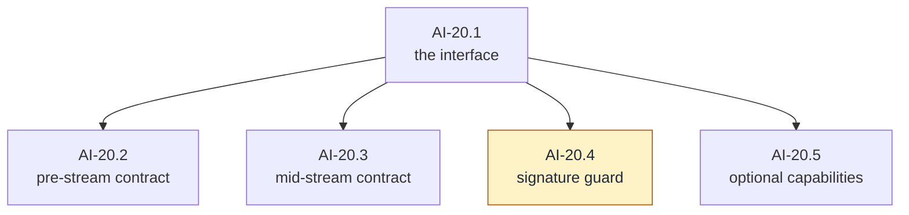

#### AI-20.1 — The interface `[leaf]`

- **Test list:**
  1. One streaming method takes a context and a normalized request and returns the AI-02 carrier plus an error; **no vendor type and no wire type appears in the signature**.
  2. An external package can implement the interface — proven by a stub in `src/agenttest/` that compiles and is exercised.
  3. The interface's documentation states the ownership rules AI-02.1 decided: who closes the stream, who owns the context, and what abandoning without cancelling means.
- **Depends on:** AI-10, AI-12, AI-14, AI-19.

#### AI-20.2 — Pre-stream contract `[leaf]`

- **Test list:**
  1. WHEN the request is invalid THEN the call fails **before** any stream exists: no goroutine started, no carrier returned, a typed AI-04 error.
  2. WHEN the context is already cancelled at call time THEN the same pre-stream path reports the cancellation category, in the documented order relative to validation.
  3. Nothing observable happens before validation passes — no I/O, no allocation of a stream, no partial state.
- **Depends on:** AI-20.1.

#### AI-20.3 — Mid-stream contract `[leaf]`

- **Test list:**
  1. The producer creates the stream and closes it **exactly once**, on every path: completion, terminal error, and cancellation.
  2. Every send selects on cancellation; a producer whose consumer stops reading exits when the context ends, in bounded time.
  3. The one sanctioned loss path behaves as AI-02.1 stated: on cancellation with a saturated buffer, late events are dropped and the stream closes **without** a terminal event — and the contract says so, so that a consumer treating a missing terminal as corruption is the one in error.
  4. Cancellation mid-stream closes within bounded time under `-race`, with no send after close.
- **Depends on:** AI-20.1.
- **Out of scope:** the same properties against a real transport (AI-33); buffer sizing (AI-34).

#### AI-20.4 — Signature guard `[guard]`

- **Test list:**
  1. An AST check in `src/agenttest/` pins the boundary: the streaming method's parameter and result types are the neutral ones and the AI-02 carrier, and no imported vendor package appears in the interface's declaration. It resolves the Layer 1 source relative to its own source file — the sibling-layout dependency ADR 0005 Guard C names, here made explicit rather than implicit.
  2. **Bite proof:** a scratch change to the signature — adding a vendor type, and separately changing the carrier — fails the guard; recorded, dropped.
- **Depends on:** AI-20.1.

#### AI-20.5 — Optional capabilities are discovered, not required `[leaf]`

- **Test list:**
  1. WHEN a provider advertises the optional token-counting capability THEN a consumer discovers it by the AI-03.1 mechanism and uses it; WHEN it does not THEN the consumer observes a clean absence, not an error and not a zero.
  2. A provider implementing only the required surface is fully conformant — asserted by exercising the whole required path against a value that advertises nothing optional.
  3. *(pin)* The core interface does not widen: a guard-style assertion over the interface's method set fails if an optional capability is folded into it.
- **Depends on:** AI-20.1, AI-03.

---

## Wave 3 — Prove

Three milestones with no vendor in sight. They exist so that the first adapter is judged by something written before it, and so that Layer 2 has a substrate to test against that never opens a socket.

### AI-21 — Build a scripted fake provider

SDD change: `cachicamas-ai-fake-provider` · Everything Layer 2 will ever test against starts here; the walking skeleton is deliberately the first node.

**Charter**

- **Goal:** Let Layer 1 and future Layer 2 tests script events, delays, failures and cancellation without network access.
- **Deliverable:** An importable testing package implementing the provider interface, scriptable per call.
- **Acceptance:** A test can script a text response, a tool call, a terminal error, a blocked stream, reasoning with a token, and a context cancellation — deterministically, with no wall-clock dependence.
- **Depends on:** AI-20. · **Blocks:** AI-22, AI-23, and doc 0003's wave C.
- **Out of scope:** Mocking any particular vendor's wire format — that is what AI-27's fixtures and AI-38's transcripts are for.
- **Note:** The fake must be **contract-faithful, not convenient.** A fake that closes cleanly where the real contract drops events teaches Layer 2 the wrong physics, and Layer 2 will build on what the fake does, not on what the document says.

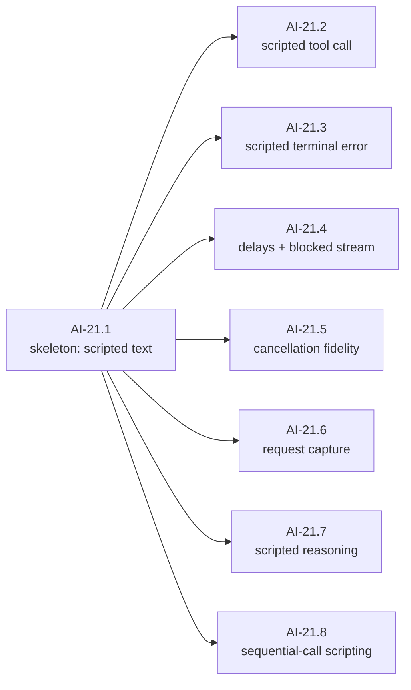

#### AI-21.1 — Walking skeleton: a scripted text response `[leaf]`

- **Test list:**
  1. WHEN a test scripts "start, two text deltas, complete" THEN draining the stream yields exactly those events, sequenced 1…N, terminated by the carrier's close — no network, fully deterministic.
  2. The fake satisfies the provider interface **from an external package** — it lives beside the signature guard in `src/agenttest/`, so its existence is itself a proof that the interface is externally implementable.
  3. Two fakes streaming concurrently are independent: per-stream sequencing observed at the consumer (AI-14.2, proven through a real implementation).
- **Depends on:** AI-20.
- **Out of scope:** every other script shape (siblings).

#### AI-21.2 — Scripted tool call `[leaf]`

- **Test list:**
  1. A scripted call streams start → deltas → end and reconstructs to exact argument bytes.
  2. A scripted call streams start → end with **zero deltas**, and consumers cannot distinguish the two after reconstruction (AI-18.2, exercised).
  3. Interleaved scripted calls reconstruct independently with their ordinals intact.
- **Depends on:** AI-21.1.

#### AI-21.3 — Scripted terminal error `[leaf]`

- **Test list:**
  1. A script can end in a terminal error of any AI-19.2 category, with and without prior output — both partial-output discriminator states.
  2. After the terminal error the stream closes and nothing follows it; terminal exclusivity is observable at the consumer.
- **Depends on:** AI-21.1, AI-19.

#### AI-21.4 — Delays and the blocked stream `[leaf]`

- **Test list:**
  1. A script can hold the stream open without emitting, for consumer-timeout testing, and release on demand.
  2. A script can emit faster than an unread consumer drains, deterministically exercising the saturated-buffer path AI-20.3 defines.
- **Depends on:** AI-21.1.
- **Note:** no scripted schedule may rely on wall-clock sleeps in assertions — coordination is by synchronization point. This is a test-kit authoring rule enforced in review, not a behavior of the fake, and it is the rule that keeps the suite from becoming flaky as it grows.

#### AI-21.5 — Cancellation fidelity `[leaf]`

- **Test list:**
  1. WHEN the consumer cancels mid-script THEN the fake behaves exactly as AI-20.3 requires: bounded-time close, late events dropped, no terminal event on the saturated path.
  2. WHEN cancellation precedes the call THEN the fake takes the pre-stream path of AI-20.2 — no stream, typed error.
- **Depends on:** AI-21.1.

#### AI-21.6 — Request capture `[leaf]`

- **Test list:**
  1. WHEN a test streams a request through the fake THEN it can assert afterwards on everything the request carried — model, message content, tools, options, markers, pass-through values — using AI-10.5's readability.
  2. Captured requests are copies or immutable: later caller mutation cannot corrupt recorded history (AI-10.6, consumed).
- **Depends on:** AI-21.1, AI-10.5.

#### AI-21.7 — Scripted reasoning `[leaf]`

- **Test list:**
  1. A script can stream reasoning content — deltas, a round-trip token, and the terminal shape — and the drained events carry the token byte-exact.
  2. Redacted and signature-only reasoning shapes are scriptable, so Layer 2's tests can exercise them without a vendor.
  3. Scripted reasoning never appears in text events — the fake enforces the same wall AI-29.1 requires of the real adapter.
- **Depends on:** AI-21.1, AI-17.

#### AI-21.8 — Sequential-call scripting `[leaf]`

- **Test list:**
  1. WHEN consecutive stream calls hit one fake THEN they consume consecutive scripts — call one a tool call, call two the final text. This is the multi-turn shape every Layer 2 agent-loop test is made of.
  2. WHEN the script queue is exhausted THEN the next call fails the test loudly — it never hangs and never repeats the last script.
- **Depends on:** AI-21.1.

### AI-22 — Build stream recording and assertion helpers

SDD change: `cachicamas-ai-stream-testkit`.

**Charter**

- **Goal:** Make event-order and goroutine-lifecycle assertions concise and repeatable.
- **Deliverable:** Importable drain and record helpers, timeout-safe assertions, ordering and gap assertions, a leak-detection mechanism, and the iterator view AI-02 delegated here.
- **Acceptance:** A broken producer cannot hang the test suite indefinitely, and event differences are readable at a glance.
- **Depends on:** AI-21. · **Blocks:** AI-23, AI-33, and doc 0003's hardening wave.
- **Out of scope:** A general-purpose testing framework. Every helper here exists to assert something this document's contracts state.

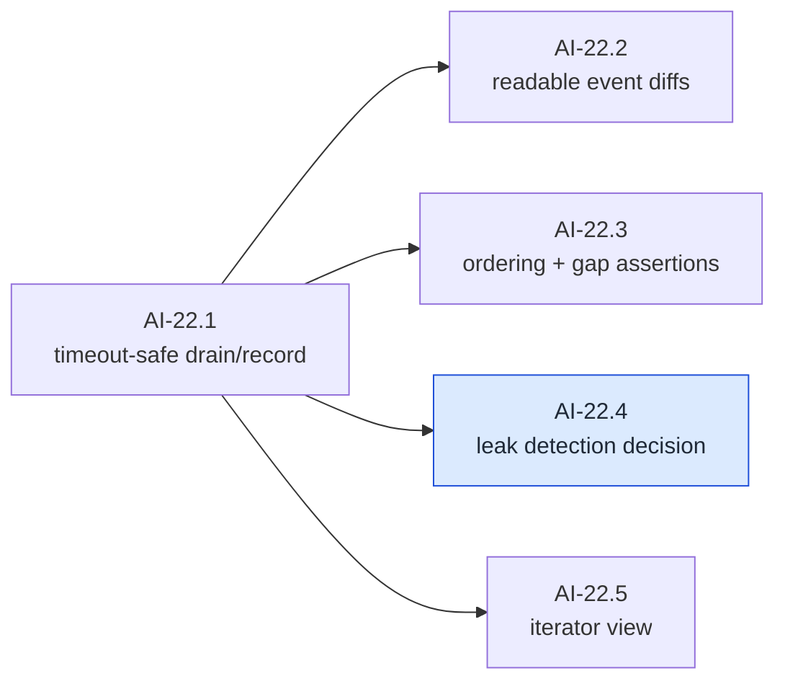

#### AI-22.1 — Timeout-safe drain and record `[leaf]`

- **Test list:**
  1. WHEN a producer never closes THEN the drain helper fails the test with a deadline — it never hangs the run.
  2. WHEN a stream completes THEN the recording preserves every event in order, reusable across several assertions without re-draining.
- **Depends on:** AI-21.1.

#### AI-22.2 — Readable event diffs `[leaf]`

- **Test list:**
  1. WHEN expected and actual event sequences differ THEN the failure output localizes the **first** divergence by index, kind and a bounded payload summary — without printing content bodies verbatim beyond that bound.
- **Depends on:** AI-22.1.

#### AI-22.3 — Ordering and gap assertions `[leaf]`

- **Test list:**
  1. Helpers assert the AI-14.4 invariants over a recorded stream: starts at 1, contiguous, exactly one terminal, legal kind ordering.
  2. WHEN a sequence gap exists THEN the gap assertion reports it precisely — which sequence is missing, between which events.
- **Depends on:** AI-22.1, AI-14.4.

#### AI-22.4 — Leak-detection approach `[decision]`

- **Closing checklist:**
  1. Choose the goroutine-leak detection mechanism. A third-party detector requires **its own ADR** — no new top-level dependency without one (`openspec/AGENTS.md` rule 5), and this module is deliberately dependency-free until AI-24. The alternative is a hand-rolled before/after goroutine accounting helper in the test kit.
  2. Decide where it applies by default (every stream test, or opt-in) and how it interacts with parallel tests.
  3. Whichever is chosen, the abandoned-consumer and cancellation paths get leak assertions — those are the two paths this whole discipline exists for.
- **Depends on:** AI-22.1.

#### AI-22.5 — Iterator view `[leaf]`

- **Test list:**
  1. The test kit exposes an iterator-shaped view over an event stream — loop, terminal error surfaced after the loop, cancellation respected — the ergonomic half of AI-02.1's carrier decision.
  2. *(pin)* The package boundary still speaks the decided carrier: AI-20.4's signature guard passes unmodified, which is the mechanical form of "the view is a convenience, not a second contract".
- **Depends on:** AI-22.1, AI-02.
- **Note:** if AI-02.1 chose iterators as the carrier, this node inverts — the view becomes a channel adapter — and the inversion lands as an amendment under the living-graph clause rather than as a silent reinterpretation.

### AI-23 — Create the provider conformance suite

SDD change: `cachicamas-ai-conformance-suite` · The suite is the reason a second adapter will ever be cheap. Every required case is its own node so that an omission is visible in the graph rather than discovered in production.

**Charter**

- **Goal:** Define the behavior every concrete adapter must exhibit, as a suite any provider factory can be plugged into.
- **Deliverable:** Reusable contract tests for text, tools, completion, errors, cancellation, closure, redaction and optional capabilities, plus a required/optional capability report.
- **Acceptance:** A provider factory runs the whole suite without copying assertions; the AI-21 fake is its first subject and passes.
- **Depends on:** AI-19, AI-21, AI-22, AI-03. · **Blocks:** AI-24, AI-38.
- **Out of scope:** Live API credentials — the suite is deterministic by construction (AI-39 owns the one credentialed test).

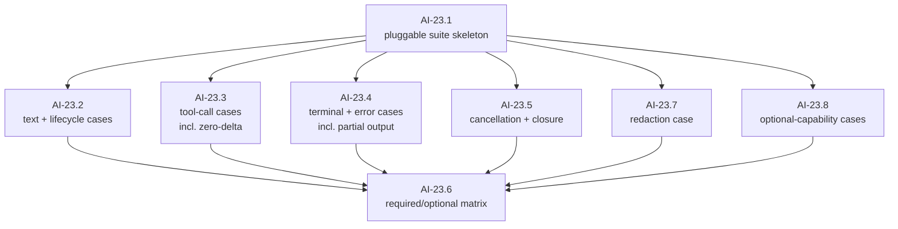

#### AI-23.1 — Pluggable suite skeleton `[leaf]`

- **Test list:**
  1. WHEN a provider factory is plugged in THEN the suite runs every case against it with no copied assertions — proven by running it against the AI-21 fake as its first subject.
  2. A case can be marked required or optional-capability; a skipped optional case is **reported**, never silent.
- **Depends on:** AI-21, AI-22, AI-03.

#### AI-23.2 — Text and lifecycle cases `[leaf]`

- **Test list:**
  1. Start → text deltas → complete: ordering legal, sequence contiguous from 1, concatenated deltas reconstruct the text exactly — including a multi-byte rune split across deltas.
  2. An empty completion (no content blocks) is legal and distinguishable from any failure.
- **Depends on:** AI-23.1.

#### AI-23.3 — Tool-call cases `[leaf]`

- **Test list:**
  1. Fragmented calls: interleaved deltas across two calls reconstruct independently with exact bytes.
  2. **Whole call, zero deltas** — a suite without this case certifies an adapter that is broken against at least one real provider.
  3. The call ordinal is observable so results can rejoin in call order.
  4. Mixed content: text block(s) then tool-call block(s) in one response ending in the tool-call finish reason reconstructs both — the dominant real agent-loop shape, and heterogeneous-block state bleed is a distinct bug from two-call interleave.
- **Depends on:** AI-23.1.

#### AI-23.4 — Terminal and error cases `[leaf]`

- **Test list:**
  1. Exactly one terminal per stream: completion and error are mutually exclusive, and anything after a terminal is a conformance failure.
  2. **A mid-stream failure preserves partial output** and says so through the discriminator.
  3. Every category the taxonomy defines is emittable by a conforming adapter's mapping — iterated exhaustively over the closed vocabulary (AI-19.2), so a new category cannot be added without a suite case appearing for it.
- **Depends on:** AI-23.1, AI-19.

#### AI-23.5 — Cancellation and closure cases `[leaf]`

- **Test list:**
  1. Cancel mid-stream: bounded-time close, no goroutine leak (AI-22.4's mechanism), no send after done.
  2. Abandoned-then-cancelled consumer: the producer exits and the saturated-drop behavior matches AI-20.3 exactly.
- **Depends on:** AI-23.1, AI-22.4.

#### AI-23.7 — Redaction case `[leaf]`

- **Test list:**
  1. The suite plants a distinctive sentinel secret through the provider factory's configuration and asserts it appears in **no** event, error string, or test-failure output the run produces. This must be a *suite* case so every future adapter inherits it, not merely the first adapter's private hardening (that is AI-36).
- **Depends on:** AI-23.1.

#### AI-23.8 — Optional-capability cases `[leaf]`

- **Test list:**
  1. Reasoning: streamed reasoning never leaks into text events; a round-trip token survives normalization byte-exact; redacted and signature-only shapes normalize to their states. A provider without the capability records **absent**, not a silent skip.
  2. Finish reasons: every normalized value is emittable by a conforming adapter's mapping, iterated over the closed vocabulary the way AI-23.4 iterates categories.
  3. Usage: completion usage is present when the transcript reports it, and absent-versus-zero is honored.
  4. Token counting: a provider advertising the optional capability answers a count; one that does not is still conformant (AI-20.5, at suite level).
- **Depends on:** AI-23.1, AI-03.
- **Out of scope:** the first adapter's own reasoning and usage mapping (AI-29, AI-31) — this node makes the *suite* able to judge any adapter's.

#### AI-23.6 — Required/optional capability matrix `[leaf]`

- **Test list:**
  1. The suite emits a per-provider capability report — which optional cases ran, which recorded absence — as the artifact AI-38.2 asserts against and AI-40.2 publishes.
  2. A provider failing a **required** case cannot pass the suite; a provider skipping an **optional** case passes with the skip recorded.
- **Depends on:** AI-23.2 … AI-23.5, AI-23.7, AI-23.8.

---

## Wave 4 — Connect the vendor

> **Framing assumption, stated once.** AI-24 owns the vendor and transport choice. The graphs for AI-26 … AI-32 are written against the documented default assumption — HTTPS with server-sent-event-style framing, the shape every candidate vendor's streaming API takes today. If AI-24 selects a transport that is not SSE-shaped, the affected nodes (chiefly inside AI-27) are re-derived under the living-graph clause; the node *structure* — framing decoded separately from semantics — survives any such choice, because it is the two-layer decomposition every mature SDK converged on independently.

### AI-24 — Select first provider and transport

SDD change: `cachicamas-ai-first-provider-decision` · The first milestone that may add a dependency, and only through the ADR gate.

**Charter**

- **Goal:** Choose the first vendor and protocol, and `net/http` versus a vendor SDK, using evidence.
- **Deliverable:** A decision covering capability fit, streaming quality, testability, dependency weight, endpoint configurability, maintenance, and the credential-handling boundary.
- **Acceptance:** The decision names one first adapter and explains the rejected alternatives. If the transport adds a `go.mod` dependency, its artifact must include or be promoted to the ADR required by `openspec/AGENTS.md` rule 5 **before** AI-25 adds that dependency — the AI-00.3 guard fails until then, by design.
- **Depends on:** AI-03, AI-11, AI-12, AI-23. · **Blocks:** AI-25 … AI-32.
- **Out of scope:** Adapter implementation.

#### AI-24.1 — The provider decision `[decision]`

- **Closing checklist:**
  1. One vendor named; rejected alternatives recorded with reasons (capability fit, streaming quality, testability, dependency weight, endpoint configurability, maintenance, credential-handling boundary).
  2. Four documented cross-provider divergences answered explicitly for the chosen vendor, because each drives a later node: how it expresses cache breakpoints or whether it caches automatically; whether tool results are a block inside a user-role message, a distinct role, or a nested object; whether an explicit output-token limit is mandatory; and whether it assigns tool-call identifiers at all.
  3. Two further questions this graph adds: does the vendor stream tool-call arguments in fragments or whole (drives AI-30's case weighting), and does it sign reasoning blocks (drives AI-29.2)?
  4. Which optional capabilities from AI-03.1 this vendor supports, recorded as the expected capability report before AI-38.2 generates the real one.
- **Depends on:** AI-23, AI-03.

#### AI-24.2 — The transport decision `[decision]`

- **Closing checklist:**
  1. `net/http` versus a vendor SDK, decided with evidence. If the choice adds any `go.mod` dependency, **the ADR exists before AI-25 adds it** — a gate, not a formality, and one the forward guard enforces mechanically.
  2. The streaming framing is named precisely — which event and field dialect, which terminal sentinel convention — because AI-27's fixtures encode it.
  3. The credential-handling boundary is stated: what the adapter receives, what it never reads, and where the value comes from (Layer 3's concern, named here so AI-25.2's guard has something to enforce).
- **Depends on:** AI-24.1.

### AI-25 — Provider configuration and client construction

SDD change: `cachicamas-ai-provider-client`.

**Charter**

- **Goal:** Construct the adapter from an injected endpoint, credential source, HTTP client and safe defaults.
- **Deliverable:** An adapter shell with a testable constructor.
- **Acceptance:** Tests inject a local test server; invalid configuration fails early; the adapter reads no environment variable and touches no file.
- **Depends on:** AI-24. · **Blocks:** AI-26 … AI-32.
- **Out of scope:** Catalog files, login flows, persistence, and sending any request.

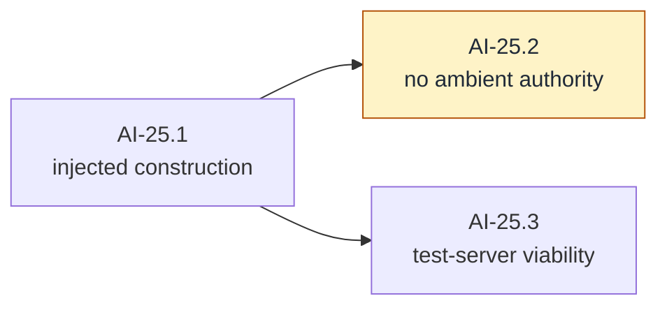

#### AI-25.1 — Injected construction `[leaf]`

- **Test list:**
  1. WHEN the adapter is constructed with endpoint, credential source and HTTP client injected THEN construction succeeds and each value is actually used, observable through a stub transport.
  2. WHEN endpoint or credential configuration is invalid THEN construction fails early with a typed error — before any request exists.
  3. Defaults are safe: no default endpoint that silently targets production from a test, no mutation of any shared global client.
  4. Defaults kill no streams: the constructed client carries **no whole-request timeout** — connect and idle bounds only. A whole-request timeout kills every stream longer than it and surfaces later as a baffling mid-read death; it is the canonical Go streaming footgun.
  5. Path-bearing and trailing-slash base endpoints (a self-hosted gateway at a sub-path) join to correct request paths, with no doubled or dropped segments.
- **Depends on:** AI-24.

#### AI-25.2 — No ambient authority `[guard]`

- **Test list:**
  1. The adapter package reads no environment variable, touches no filesystem, and spawns no process — proven mechanically with an AST import-and-call scan in the AI-00.3 style, not by convention.
  2. **Bite proof:** a scratch environment read in the adapter fails the guard; recorded, dropped.
- **Depends on:** AI-25.1.

#### AI-25.3 — Test-server viability `[leaf]`

- **Test list:**
  1. WHEN the adapter is pointed at a local test server THEN a request reaches it with the configured credential attached in the vendor's expected header shape.
- **Depends on:** AI-25.1.
- **Out of scope:** secrecy assertions — the wire-error-body bound is AI-32.5's and the exhaustive sentinel sweep is AI-36.1's. This node proves attachment only.

### AI-26 — Translate normalized requests to wire requests

SDD change: `cachicamas-ai-request-translation` · Pure translation, golden-tested, no network. **Likely over one review budget: the node boundaries below are the planned chain points.**

**Charter**

- **Goal:** Map model identity, system segments, messages, content, tools and options into the selected provider's request shape.
- **Deliverable:** Pure translation code and golden or table tests.
- **Acceptance:** No credential appears in any serialized fixture; unsupported normalized features fail explicitly rather than being dropped silently; translating the same request twice yields identical bytes.
- **Depends on:** AI-10, AI-11, AI-12, AI-25. **Parallel with:** AI-27. · **Blocks:** AI-28.
- **Note:** This is the milestone that was structurally impossible in the retired design, because content could not be read back out of a request from another package. Here it is ordinary work, and AI-10.5's round-trip property is exactly the precondition it consumes.

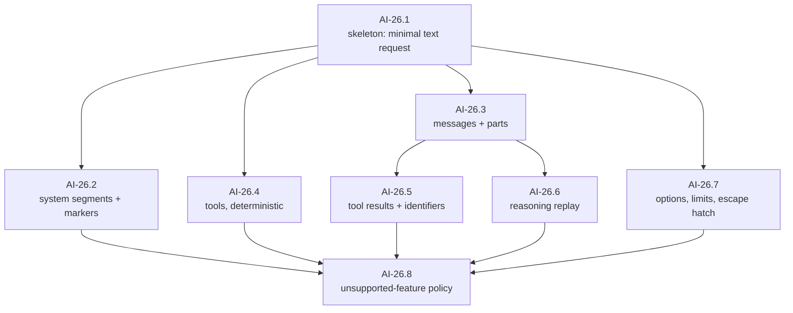

#### AI-26.1 — Skeleton: minimal text request `[leaf]`

- **Test list:**
  1. WHEN a request with one user text message is translated THEN the wire body matches a golden fixture byte-for-byte.
  2. Translating the same request twice yields identical bytes — determinism from birth, AI-12.4's property extended to the wire.
  3. No golden fixture contains a credential — a fixture-wide sentinel scan, run over the whole fixture tree.
- **Depends on:** AI-10.5, AI-25.

#### AI-26.2 — System segments and cache markers `[leaf]`

- **Test list:**
  1. Ordered system segments render into the vendor's system shape preserving order and content.
  2. Cache-boundary markers render into the vendor's cache annotation at the marked positions, respecting the tools → system → messages hierarchy — or are dropped whole if AI-24.1 recorded an auto-caching vendor, which is the advisory contract of AI-11.3 exercised.
  3. WHEN markers exceed the vendor's own cap THEN translation refuses with an error naming the excess — the request-level cap (AI-11.2) and the vendor cap are reconciled here.
- **Depends on:** AI-26.1, AI-11.

#### AI-26.3 — Messages and content parts `[leaf]`

- **Test list:**
  1. Every readable part variant translates — text, reasoning by state, tool call, tool result — with one golden fixture per variant.
  2. WHEN consecutive same-role messages occur THEN they merge if and only if the vendor enforces strict alternation. Queued steering messages one layer up make this live, not theoretical.
  3. Message order and intra-message part order are preserved exactly.
- **Depends on:** AI-26.1.

#### AI-26.4 — Tools, deterministically `[leaf]`

- **Test list:**
  1. Tool declarations translate with name, description and schema passed through byte-faithfully (AI-08.1's property, carried to the wire).
  2. Tool ordering in the wire body is **deterministic across process runs** — map-iteration order here would silently invalidate the vendor's cache prefix on every call: no failure, just a tenfold input bill.
  3. *(pin)* Duplicate and invalid tool sets were already rejected at validation — translation never sees them.
- **Depends on:** AI-26.1.

#### AI-26.5 — Tool results and identifiers `[leaf]`

- **Test list:**
  1. Tool results translate into the vendor's result shape — block inside a user-role message, distinct role, or nested object, whichever AI-24.1 recorded.
  2. IF the vendor assigns no tool-call identifiers THEN synthetic identifiers are minted here, deterministically, and the mapping is **exposed** so a session can persist it — the Layer 3 half is out of scope, the mint-and-expose half is this node.
  3. Result-to-call correlation survives translation for interleaved multi-call turns.
- **Depends on:** AI-26.3.

#### AI-26.6 — Reasoning replay `[leaf]`

- **Test list:**
  1. A reasoning part with a round-trip token renders the token **byte-identically** into the wire body — never parsed, never re-encoded. A signed block altered in flight fails the vendor's validation on the next turn.
  2. Redacted reasoning replays verbatim as its opaque payload.
  3. Reasoning parts with no text but a token render correctly — the signature-only shape.
  4. Block order within an assistant message is preserved; vendors validate reasoning-block position.
- **Depends on:** AI-26.3, AI-07.

#### AI-26.7 — Options, limits and the escape hatch `[leaf]`

- **Test list:**
  1. Every neutral generation option maps to its vendor field; unsupported combinations fail explicitly.
  2. IF the vendor mandates an output-token limit and the request omits one THEN a **documented** default is supplied — visible in the adapter's documentation, never a silent truncation.
  3. Escape-hatch values in this vendor's namespace merge into the wire body; foreign namespaces are ignored whole (AI-12.3's property, at the wire).
- **Depends on:** AI-26.1, AI-12.

#### AI-26.8 — Unsupported-feature policy `[compound]`

Exit check: no expressible request feature can be silently dropped by translation.

##### AI-26.8.1 — The expressible-feature inventory `[decision]`

- **Closing checklist:**
  1. Enumerate every feature a request can express: the AI-10 base surface plus AI-11's markers plus AI-12's options and pass-through.
  2. Name the mechanism that keeps the inventory honest as the surface grows — a registration list, a reflective walk; the SDD decides — so that AI-26.8.2's test fails when a feature is added without a policy entry.
- **Depends on:** AI-26.2 … AI-26.7.

##### AI-26.8.2 — The exhaustive walk `[leaf]`

- **Test list:**
  1. WHEN a request expresses something the vendor cannot receive THEN translation fails with a typed unsupported-capability error naming the feature — dropped-silently is the one forbidden outcome.
  2. The policy is total: the inventory-driven walk asserts every feature is either translated or explicitly refused, and it grows automatically with the inventory.
- **Depends on:** AI-26.8.1.

### AI-27 — Implement the streaming frame decoder

SDD change: `cachicamas-ai-stream-decoder` · Framing only, no semantic mapping — the separation every mature SDK arrived at independently. Runs **parallel to AI-26** after AI-25.

**Charter**

- **Goal:** Decode the selected transport's framing independently from semantic event mapping.
- **Deliverable:** An incremental decoder handling split frames, multiple frames per read, keep-alives, EOF and malformed data.
- **Acceptance:** Arbitrary read boundaries do not change decoded frames; malformed and truncated frames return typed failures.
- **Depends on:** AI-19, AI-24.2, AI-25. **Parallel with:** AI-26. · **Blocks:** AI-28, AI-32.

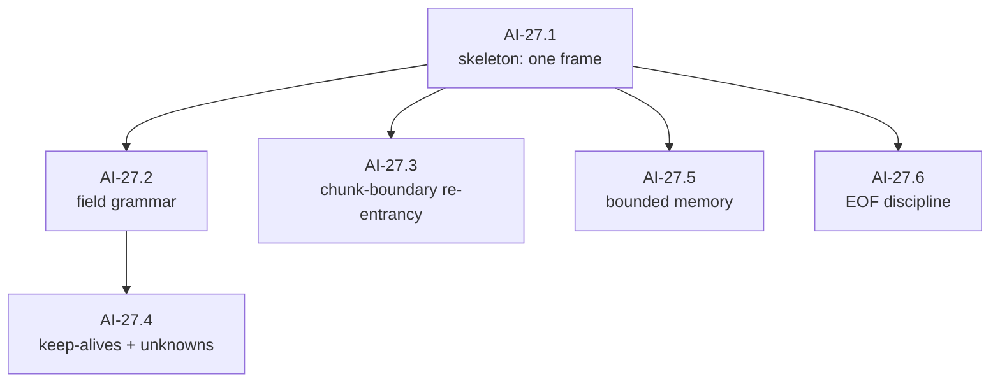

#### AI-27.1 — Skeleton: one frame `[leaf]`

- **Test list:**
  1. WHEN a well-formed single frame arrives in one read THEN the decoder yields exactly one frame with its event name and data intact.
  2. Frames are yielded in arrival order, and the decoder is a **pure incremental function over bytes** — no HTTP, no goroutines — so it stays independently testable forever.
- **Depends on:** AI-24.2, AI-25.

#### AI-27.2 — Field grammar `[leaf]`

- **Test list:**
  1. Field parsing matches the framing spec: name and value split at the first colon, exactly one leading space stripped from the value, a line with no colon treated as an empty-value field.
  2. Multi-line data fields concatenate with the spec's separator, and the dispatch-time trailing separator is removed.
  3. All three line endings — CRLF, LF, lone CR — terminate lines.
  4. A leading byte-order mark is stripped once at the start of the stream; anywhere else it is content.
  5. An event with an empty data buffer dispatches nothing.
  6. After a dispatch, the event-type and data buffers reset: a following frame with no type line dispatches as the default type, never the previous frame's. Spec-mandated, and latent until a dialect omits the type line.
  7. The framing's last-event-id and retry-interval fields have a pinned disposition — ignoring them is fine, but by test rather than by accident — including identifier values containing NUL.
- **Depends on:** AI-27.1.

#### AI-27.3 — Chunk-boundary re-entrancy `[leaf]`

- **Test list:**
  1. WHEN a frame is split across reads at **any byte offset** — mid-field-name, mid-rune, and between the CR and LF of a CRLF — THEN decoded output is identical to the unsplit case.
  2. The property is proven mechanically: every golden transcript replayed split at every byte offset yields identical frames. This is the sweep that catches the classic phantom-blank-line bug no example-based test finds.
- **Depends on:** AI-27.1.
- **Split if:** the exhaustive-offset replay is too slow for the suite — then a bounded-random-offset variant with a fixed seed becomes AI-27.3.1 and the exhaustive run moves behind a long-test flag as AI-27.3.2.

#### AI-27.4 — Keep-alives and unknowns `[leaf]`

- **Test list:**
  1. Comment lines — the framing's keep-alive idiom — are ignored without disturbing accumulation state.
  2. Unknown field names are ignored; unknown **event** names are yielded rather than dropped, because the semantic layer decides and every candidate vendor documents new event types as a forward-compatibility promise.
- **Depends on:** AI-27.2.

#### AI-27.5 — Bounded memory `[leaf]`

- **Test list:**
  1. A single multi-megabyte frame decodes correctly — the default-line-limit trap is a documented real-world failure class, and large tool results will hit it.
  2. A frame exceeding the configured hard cap aborts with a typed AI-19 error rather than growing unbounded — both directions of the trap, truncation and exhaustion, are pinned.
- **Depends on:** AI-27.1, AI-19.2.

#### AI-27.6 — EOF discipline `[leaf]`

- **Test list:**
  1. Clean EOF at a frame boundary ends decoding without error.
  2. EOF **mid-frame** yields a typed truncation error, and the buffered partial frame is *not* dispatched as complete — silent truncation is the failure mode that reports success on a half-answer.
- **Depends on:** AI-27.1, AI-19.2.

### AI-28 — Translate response lifecycle and text

SDD change: `cachicamas-ai-provider-text-stream` · The adapter's walking skeleton: the first time a real wire transcript becomes a normalized event stream end to end.

**Charter**

- **Goal:** Map provider response-start, text deltas and completion into neutral events.
- **Deliverable:** An end-to-end streamed text response served by a local test server.
- **Acceptance:** Event order satisfies AI-14 … AI-16 and the conformance text cases pass against real transport.
- **Depends on:** AI-26, AI-27. · **Blocks:** AI-29 … AI-33.
- **Out of scope:** Tool calls (AI-30) and reasoning (AI-29).

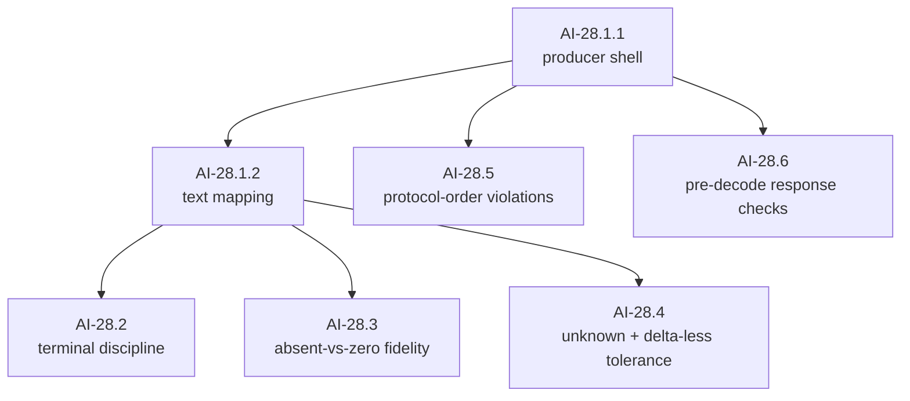

#### AI-28.1 — Skeleton: text end to end `[compound]`

Exit check: a recorded text transcript replayed through a local test server drains as a fully normalized, contract-conformant stream. Pre-split because this is the single largest implementation step in the document — the producer core and the text mapping are separate PRs by design.

##### AI-28.1.1 — Producer shell `[leaf]`

- **Test list:**
  1. WHEN a test server replays a minimal transcript THEN the consumer observes response start → completion, sequenced from 1, with the stream closed exactly once — request issue, decode, emit and close proven over the smallest possible semantic surface.
  2. The vendor's response identity and model land in the start event's normalized fields.
  3. The producer honors AI-20.3 on this path: sends select on cancellation and the close discipline is the contract's, not an approximation of it.
- **Depends on:** AI-26.1, AI-27.
- **Split if:** the goroutine and stream lifecycle alone exceeds the budget — the close discipline then splits from the emit path.

##### AI-28.1.2 — Text mapping `[leaf]`

- **Test list:**
  1. Text block start, deltas and end map to normalized text events; concatenated deltas reconstruct the text byte-exactly, including a delta boundary inside a multi-byte rune — AI-16.2's contract, now proven against wire data.
  2. The conformance text case (AI-23.2) passes against real transport for the first time.
- **Depends on:** AI-28.1.1.

#### AI-28.2 — Terminal discipline and truncation `[leaf]`

- **Test list:**
  1. WHEN the connection closes without the vendor's terminal frame THEN the stream ends in a typed terminal **error** with partial output preserved and flagged — never in silent success with a truncated message. Proxies and load balancers make this routine, and it is a documented SDK bug class.
  2. IF the dialect uses a data-only terminal sentinel THEN it is recognized as clean termination, never parsed as payload, and never trips the truncation detector.
  3. Frames arriving after the vendor's terminal frame and before EOF are ignored rather than surfaced.
- **Depends on:** AI-28.1.2, AI-19.4.

#### AI-28.3 — Absent-versus-zero fidelity `[leaf]`

- **Test list:**
  1. Usage fields never present in the transcript are **absent** in the normalized usage, not zero — AI-13.3's distinction, honored by the adapter rather than quietly flattened.
- **Depends on:** AI-28.1.2.
- **Out of scope:** the cumulative-usage merge and full field mapping — wholly AI-31.2's.

#### AI-28.4 — Unknown and delta-less tolerance `[leaf]`

- **Test list:**
  1. Unknown frame types, unknown delta types and unknown block types inside a transcript are skipped without corrupting adjacent accumulation — every candidate vendor's versioning policy says new types will appear.
  2. A content block that opens and closes with **zero deltas** normalizes cleanly (real transcripts contain them).
  3. Keep-alive frames interleaved anywhere do not perturb the event stream.
- **Depends on:** AI-28.1.2.

#### AI-28.5 — Protocol-order violations `[leaf]`

- **Test list:**
  1. A table over structural violations — a delta for an index with no open block, a delta after that index's close, a duplicate open on one index, a close without an open, a second response start — each yields a typed malformed-response terminal with partial output preserved, and never a panic. Index-keyed accumulators that crash on out-of-order frames are a shipped bug class in real vendor SDKs, and a buggy proxy can produce these frames at will.
  2. A frame whose payload is malformed for its declared, *known* type yields the same typed malformed-response terminal — distinguished from AI-28.4's unknown types, which skip by contract.
- **Depends on:** AI-28.1.1, AI-19.2.

#### AI-28.6 — Pre-decode response checks `[leaf]`

- **Test list:**
  1. WHEN a success response carries a non-stream content type — a proxy's HTML error page — THEN the adapter refuses before decoding, with a typed error carrying a bounded body excerpt; the content-type match tolerates parameters and case.
  2. Failure statuses route to the failure mapping before any decode, observable as zero normalized content events preceding the terminal.
- **Depends on:** AI-28.1.1, AI-32.1.
- **Note:** these are HTTP-response behaviors and deliberately not AI-27's, which is framing-only by contract.

### AI-29 — Translate the reasoning stream

SDD change: `cachicamas-ai-provider-reasoning-stream`.

**Charter**

- **Goal:** Implement the chosen reasoning behavior for the first provider.
- **Deliverable:** A mapping, or a documented capability absence.
- **Acceptance:** Provider reasoning never leaks into text events; the round-trip token is captured byte-exact and replays through AI-26.6 unchanged.
- **Depends on:** AI-07, AI-17, AI-28. **Parallel with:** AI-30, AI-31.
- **Out of scope:** Deciding whether reasoning is worth emitting at all — AI-29.0 owns that, and AI-03.1 already made it optional.

```mermaid
flowchart LR
    X0["AI-29.0<br/>emission policy"] --> X1["AI-29.1<br/>reasoning is never text"]
    X1 --> X2["AI-29.2<br/>token capture, byte-exact"]
    X1 --> X3["AI-29.3<br/>redacted + signature-only"]
    classDef d fill:#dbeafe,stroke:#1d4ed8,color:#1f2937
    class X0 d
```

#### AI-29.0 — Reasoning emission policy `[decision]`

- **Closing checklist:**
  1. Record whether v1 emits reasoning events for the first provider or documents a capability absence — AI-03.1 makes both legal, and every sibling node below assumes emission.
  2. If absence wins: AI-29.1 … AI-29.3 are struck under the living-graph clause and AI-23.8 records "absent" as this adapter's capability outcome, which is a result rather than a gap.
- **Depends on:** AI-24.1.

#### AI-29.1 — Reasoning is never text `[leaf]`

- **Test list:**
  1. WHEN a transcript interleaves reasoning and text blocks THEN reasoning content appears only in reasoning-typed events and never leaks into text events — including several reasoning blocks per response at arbitrary positions.
- **Depends on:** AI-28, AI-29.0.

#### AI-29.2 — Token capture, byte-exact `[leaf]`

- **Test list:**
  1. WHEN the vendor streams a reasoning signature THEN it is captured into the round-trip token **byte-exactly** and survives capture → normalized content → re-translation (AI-26.6) unchanged — the full-circle property, proven in one test.
  2. The signature attaches to its own block even when it arrives as that block's only content.
- **Depends on:** AI-29.1, AI-07.

#### AI-29.3 — Redacted and signature-only blocks `[leaf]`

- **Test list:**
  1. Redacted reasoning blocks normalize to the redacted state with their opaque payload preserved verbatim — invisible in tests unless deliberately exercised, and unrecoverable in production if dropped.
  2. A block with a signature and no reasoning text normalizes to valid empty-text reasoning (AI-07.4's shape, now from wire data).
- **Depends on:** AI-29.1.

### AI-30 — Translate the tool-call stream

SDD change: `cachicamas-ai-provider-tool-stream`.

**Charter**

- **Goal:** Map fragmented and whole provider tool calls into neutral events.
- **Deliverable:** Tool-call mapping and reconstruction tests.
- **Acceptance:** Multiple interleaved calls preserve identity, order and exact argument bytes; a malformed or truncated call yields a typed failure carrying its raw partial fragment.
- **Depends on:** AI-18, AI-28. **Parallel with:** AI-29, AI-31.
- **Out of scope:** Validating arguments against the tool schema, and executing anything.

```mermaid
flowchart TB
    Y1["AI-30.1<br/>per-call accumulation"] --> Y2["AI-30.2<br/>empty + zero-fragment calls"]
    Y1 --> Y3["AI-30.3<br/>argument-byte fidelity"]
    Y1 --> Y4["AI-30.4<br/>truncation + malformation"]
    Y1 --> Y5["AI-30.5<br/>ordinal preservation"]
```

#### AI-30.1 — Per-call accumulation `[leaf]`

- **Test list:**
  1. WHEN a transcript interleaves argument fragments for two concurrent calls THEN each accumulates in its own buffer, keyed by the vendor's block position — cross-contamination corrupts parallel tool calls and is a shipped-SDK bug class.
  2. Call identity and name are available from the call's start event, before any argument byte arrives (AI-18.1, from wire data).
  3. Assembly happens exactly once, at the call's end — fragments are never partially parsed.
  4. Per-call accumulation is memory-bounded across fragments: a runaway fragment sequence into one call hits a documented cap with a typed failure. AI-27.5 bounds a single frame; this bounds the sum.
- **Depends on:** AI-28.

#### AI-30.2 — Empty and zero-fragment calls `[leaf]`

- **Test list:**
  1. An empty first fragment is a no-op — routine in real transcripts — not an error.
  2. A call that closes with **zero accumulated bytes** normalizes to the canonical empty-arguments form rather than failing to parse empty input.
  3. A call delivered whole with no fragments normalizes identically to its fragmented equivalent (AI-18.2, from wire data).
- **Depends on:** AI-30.1.

#### AI-30.3 — Argument-byte fidelity `[leaf]`

- **Test list:**
  1. Reassembled arguments are byte-identical to the transcript's fragments concatenated — including exotic-but-legal payloads (escape sequences, extreme numeric forms) that have crashed shipped SDK parsers.
  2. The end event carries exact argument bytes and nothing re-marshals them, asserted byte-equal against the fixture.
- **Depends on:** AI-30.1.

#### AI-30.4 — Truncation and malformation `[leaf]`

- **Test list:**
  1. WHEN generation stops mid-arguments — a length-limit cutoff — THEN the stream terminates predictably with a typed failure that **carries the raw partial fragment**: surfaced, never silently discarded, never a panic.
  2. Arguments that assemble to a malformed payload at the call's end produce the same typed, raw-carrying failure — some vendor modes stream unvalidated fragments by design.
- **Depends on:** AI-30.1, AI-19.

#### AI-30.5 — Ordinal preservation `[leaf]`

- **Test list:**
  1. WHEN several calls stream in one response THEN each normalized call's ordinal position is observable regardless of fragment interleaving — Layer 2's call-ordered rejoin needs it, and several vendors reject positionally mismatched results.
- **Depends on:** AI-30.1.
- **Split if:** the vendor requires an explicit index that the neutral event does not carry — the additive promotion into the AI-18 payload becomes AI-30.6, with its own amendment under the living-graph clause.

### AI-31 — Translate usage and finish reasons

SDD change: `cachicamas-ai-provider-completion`.

**Charter**

- **Goal:** Complete terminal metadata mapping for the first provider.
- **Deliverable:** Usage mapping, finish-reason mapping, unknown-value handling and partial-metadata handling.
- **Acceptance:** Terminal events contain every available normalized field and never invent an unavailable one; refusal and pause map to their own values rather than to unknown.
- **Depends on:** AI-13, AI-28. **Parallel with:** AI-29, AI-30.

```mermaid
flowchart LR
    Z1["AI-31.1<br/>finish-reason mapping"] --> Z3["AI-31.3<br/>never invent, never assume"]
    Z2["AI-31.2<br/>usage mapping"] --> Z3
```

#### AI-31.1 — Finish-reason mapping `[leaf]`

- **Test list:**
  1. Every vendor stop value maps to its normalized reason — including refusal and pause to their own AI-13.1 values, never to unknown.
  2. A novel vendor stop value maps to unknown without error, with the raw label preserved (the normalizer-crash bug class, pinned).
  3. Refusal after partial output and refusal before any output both normalize with the right reason and the right partial-output posture — AI-19.4's discriminator applies to refusals too.
  4. WHEN generation ends on a stop-sequence match THEN the matched value's disposition is pinned by test: captured, or its absence from the neutral surface recorded as deliberate. Callers running several stop sequences cannot branch without it.
- **Depends on:** AI-28, AI-13.
- **Note:** pause-style finishes resume by replaying received content verbatim (AI-13.2's obligation). If a paused response can contain block types normalization skips (AI-28.4), resume is lossy — the AI-24 decision records whether v1 excludes the features that produce such blocks or carries them opaquely.

#### AI-31.2 — Usage mapping `[leaf]`

- **Test list:**
  1. Cache-read, cache-write and reasoning token counts map into the neutral usage fields when the vendor reports them; absent stays absent.
  2. WHEN the vendor delivers usage across several frames — input-side figures at stream start, cumulative output-side updates later — THEN the completion event's usage merges them **without double-counting**. Cumulative-not-incremental is an explicit vendor-documentation trap, and this node solely owns the merge.
  3. The inclusive-or-exclusive semantics pinned at AI-13.4 are verified against a real cache-hit transcript, so the documented cost formula is true of this adapter and not only of the neutral type.
- **Depends on:** AI-28, AI-13.

#### AI-31.3 — Never invent, never assume position `[leaf]`

- **Test list:**
  1. WHEN the vendor omits a usage field or delivers stop metadata in an unexpected frame position THEN normalization neither invents values nor crashes — metadata is gathered wherever it appears and the terminal event reports only what arrived.
  2. A metadata-only frame with no content is tolerated — a real shape in at least one dialect.
- **Depends on:** AI-31.1, AI-31.2.

### AI-32 — Map HTTP and provider failures

SDD change: `cachicamas-ai-provider-error-mapping` · Converts wire failures into AI-19's taxonomy. Runs parallel to AI-28 after AI-27.

**Charter**

- **Goal:** Convert transport, status and body failures into the AI-19 taxonomy.
- **Deliverable:** Mappings and tests for authentication, permission, rate limit, unavailable, timeout, malformed body, unexpected status, and mid-stream disconnect.
- **Acceptance:** A mid-stream disconnect produces a **terminal error event** carrying the partial-output discriminator, not merely a returned error; response bodies are size-limited and sanitized; retry hints and status metadata survive safely.
- **Depends on:** AI-19, AI-27. **Parallel with:** AI-28 after the shared decoder dependency.
- **Note:** the distinction in the acceptance clause is the load-bearing one: the harness's retry decision depends on whether anything was already emitted, and an error that arrives only as a return value has thrown that information away.

```mermaid
flowchart TB
    AA1["AI-32.1<br/>status taxonomy"] --> AA4["AI-32.4<br/>retry metadata"]
    AA1 --> AA2["AI-32.2<br/>mid-stream error frames"]
    AA1 --> AA3["AI-32.3<br/>disconnects + deadlines"]
    AA2 --> AA5["AI-32.5<br/>bounded, sanitized capture"]
    AA3 --> AA5
    AA1 --> AA5
```

#### AI-32.1 — Status taxonomy `[leaf]`

- **Test list:**
  1. Each failing status class maps to its AI-19.2 category — authentication, permission, not-found or invalid, rate limit, overload or unavailable, timeout — table-tested over the vendor's documented codes, including its nonstandard ones.
  2. Retryability follows the taxonomy: client-contract failures are terminal; rate limit, overload and timeout are retryable-flagged. The flag, not the retry — AI-35 owns acting on it.
  3. An unparseable error body still maps: category from status, body kept as a bounded diagnostic.
  4. A status outside the vendor's documented table maps through the taxonomy's fallback without crashing.
- **Depends on:** AI-27, AI-19.

#### AI-32.2 — Mid-stream error frames `[leaf]`

- **Test list:**
  1. WHEN the vendor emits an in-stream error frame THEN the stream terminates with a typed terminal error event carrying the vendor's error identity and the partial-output discriminator — an in-band frame, not a transport failure, and the two remain distinguishable.
- **Depends on:** AI-32.1, AI-28.

#### AI-32.3 — Disconnects and deadlines `[leaf]`

- **Test list:**
  1. A mid-stream disconnect after emitted output produces a terminal **event** with partial output preserved — the whole point of this node.
  2. A disconnect before any output takes the pre-stream error path of AI-20.2.
  3. Context deadline expiry mid-stream maps to **timeout**; explicit cancellation maps to **cancellation** — distinguishable through `errors.Is` and in the terminal event. Conflating them is a classic Go bug and it corrupts the layer above: timeouts are often retryable, cancellations never are.
- **Depends on:** AI-32.1, AI-28.

#### AI-32.4 — Retry metadata `[leaf]`

- **Test list:**
  1. Retry-after arrives typed, parsed from both the delay-seconds and the HTTP-date forms.
  2. Rate-limit telemetry headers are captured into safe machine-readable metadata — they are non-secret and support-relevant.
- **Depends on:** AI-32.1.

#### AI-32.5 — Bounded, sanitized capture `[leaf]`

- **Test list:**
  1. Error-body capture is size-limited and the remainder drained: a multi-megabyte error body cannot balloon memory, with the limit and a truncation marker both asserted.
  2. A sentinel credential echoed inside an error body does not survive into the typed error's text. AI-36 broadens this; the wire-error path is pinned here because this is where bodies enter the process.
- **Depends on:** AI-32.1, AI-32.2, AI-32.3.

---

## Wave 5 — Harden

### AI-33 — Prove cancellation and goroutine cleanup

SDD change: `cachicamas-ai-cancellation` · Four cancellation moments, one node each — they fail differently and are debugged differently. Every node runs its scenarios over text **and tool-call** streams: a cancellation proof that never crosses the tool-call accumulation path proves nothing about its buffers.

**Charter**

- **Goal:** Ensure cancellation works before headers, between frames, during a blocked send, and after completion.
- **Deliverable:** Cancellation-safe producer logic and deterministic tests.
- **Acceptance:** Requests stop, streams close exactly once, no send ever occurs without observing the context, and no goroutine leak is detected.
- **Depends on:** AI-28, AI-30, AI-32, AI-22.4. · **Blocks:** AI-34, AI-35.
- **Out of scope:** Agent-level stop behavior — Layer 2's.

```mermaid
flowchart LR
    AB1["AI-33.1<br/>before headers"] --> AB5["AI-33.5<br/>resource discipline"]
    AB2["AI-33.2<br/>between frames"] --> AB5
    AB3["AI-33.3<br/>during a blocked send"] --> AB5
    AB4["AI-33.4<br/>after completion"] --> AB5
```

#### AI-33.1 — Cancel before headers `[leaf]`

- **Test list:**
  1. WHEN cancellation lands before the response begins THEN the call returns the pre-stream cancellation error, the request is torn down, and no goroutine or stream outlives the call (leak-checked via AI-22.4).
- **Depends on:** AI-28, AI-30, AI-32, AI-22.4.

#### AI-33.2 — Cancel between frames `[leaf]`

- **Test list:**
  1. WHEN cancellation lands while the stream is idle between frames THEN it closes within bounded time with the AI-20.3 posture, under `-race`, leak-checked.
  2. The underlying response body is closed, so a stalled server cannot pin the connection — proven with a deliberately stalling test handler.
- **Depends on:** AI-28, AI-30, AI-22.4.

#### AI-33.3 — Cancel during a blocked send `[leaf]`

- **Test list:**
  1. WHEN the consumer has stopped reading and the producer is blocked mid-send THEN cancellation unblocks it: late events dropped, stream closed without a terminal event — the sanctioned loss path of AI-20.3, now proven against the real producer and leak-checked.
- **Depends on:** AI-28, AI-30, AI-22.4.

#### AI-33.4 — Cancel after completion `[leaf]`

- **Test list:**
  1. WHEN cancellation lands after the terminal event THEN nothing changes: the stream is already closed or closes cleanly, close happens exactly once, and no interleaving panics — race-detector coverage over repeated runs.
- **Depends on:** AI-28, AI-30, AI-22.4.

#### AI-33.5 — Resource discipline `[leaf]`

- **Test list:**
  1. On **every** exit path — completion, terminal error, each cancellation moment — the response body is drained or closed so the transport's connection pool is not poisoned. The failure and cancellation paths are exactly the ones naive implementations leak on.
  2. A full-package leak check passes with the AI-22.4 mechanism applied wholesale.
- **Depends on:** AI-33.1 … AI-33.4.

### AI-34 — Lock backpressure and buffer behavior

SDD change: `cachicamas-ai-backpressure`.

**Charter**

- **Goal:** Confirm or change AI-02.1's buffer decision with measurements rather than an arbitrary number.
- **Deliverable:** A buffer constant or configuration, slow-consumer tests, and the recorded rationale.
- **Acceptance:** Ordering is stable, memory is bounded, and cancellation unblocks a saturated producer.
- **Depends on:** AI-33. · **Blocks:** AI-38.
- **Out of scope:** Dropping text or tool-call events — those remain lossless, and the single sanctioned loss path stays exactly where AI-20.3 put it.

#### AI-34.1 — Measured buffer decision `[decision]`

- **Closing checklist:**
  1. AI-02.1's starting capacity is confirmed or changed **with measurements** — the decision records the workload measured and the numbers, not a preference.
  2. Whether the size is a constant or configurable is decided, with the configuration surface named if so.
- **Depends on:** AI-33.

#### AI-34.2 — Lossless ordering under pressure `[leaf]`

- **Test list:**
  1. The AI-34.1 decision is applied and observable: the stream's capacity equals the decided size, asserted directly.
  2. WHEN the consumer drains slower than the producer emits THEN every event still arrives, in order — backpressure means *waiting*, never dropping.
  3. No auxiliary queue exists beyond the decided capacity — asserted by capacity plus the observation that the producer blocks rather than buffering elsewhere once full.
- **Depends on:** AI-34.1.

#### AI-34.3 — No unsanctioned loss path `[leaf]`

- **Test list:**
  1. Beyond the one sanctioned loss path proven at AI-33.3, **no other loss path exists**: an exhaustive-path test drains every non-cancelled scenario — slow consumer, bursty consumer, pause-resume consumer — losslessly.
- **Depends on:** AI-34.2.
- **Out of scope:** the sanctioned path's own behavior — AI-33.3 owns it.

### AI-35 — Define retry and idempotency policy

SDD change: `cachicamas-ai-retry-policy` · One sentence promoted to structure: **the partial-output case is never retried at Layer 1.**

**Charter**

- **Goal:** Decide and implement only retries that cannot duplicate a partially observed response.
- **Deliverable:** Explicit pre-stream retry conditions, backoff bounds and retry-after handling — or a documented no-auto-retry v1 policy.
- **Acceptance:** No automatic retry occurs after any semantic event has been emitted, and the acceptance states what *does* happen: the typed error with its discriminator is handed up and the harness decides.
- **Depends on:** AI-32, AI-33. · **Blocks:** AI-38.
- **Out of scope:** Agent-turn retries and model failover — both Layer 2's (v2 § 6 seams 7 and 8).
- **Note:** a stream that dies after emitting output is the single most common real-world failure, and the naive retry predicate — "retry if nothing completed" — is precisely the one that gets it wrong.

```mermaid
flowchart LR
    AC0["AI-35.0<br/>policy + seam decision"] --> AC1["AI-35.1<br/>the retry predicate"]
    AC1 --> AC2["AI-35.2<br/>backoff mechanics"]
    AC1 --> AC3["AI-35.3<br/>replayability"]
    classDef d fill:#dbeafe,stroke:#1d4ed8,color:#1f2937
    class AC0 d
```

#### AI-35.0 — Retry policy and seam `[decision]`

- **Closing checklist:**
  1. Auto-retry versus a documented **no-auto-retry v1 policy**, decided with rationale. Presupposing an executor forecloses a decision that should stay open until the evidence exists.
  2. If auto-retry: where the mechanism lives — inside the adapter, or a wrapping component — because AI-35.1's first test cannot be written without that seam.
  3. If no-auto-retry: AI-35.2 and AI-35.3 are struck under the living-graph clause, AI-35.1 shrinks to its never-retry assertions, and the documented policy is the milestone's deliverable.
- **Depends on:** AI-32, AI-33.

#### AI-35.1 — The retry predicate `[leaf]`

- **Test list:**
  1. WHEN a retryable-flagged failure occurs **before any semantic event is emitted** THEN retry is permitted — the boundary is "nothing emitted", not "nothing completed".
  2. WHEN any semantic event has been emitted THEN no automatic retry occurs: the typed error with its partial-output discriminator is handed up, asserted by the **absence of a second wire request**.
  3. Terminal-category failures — authentication, invalid request — never retry regardless of position.
- **Depends on:** AI-35.0, AI-19.4.

#### AI-35.2 — Backoff mechanics `[leaf]`

- **Test list:**
  1. Retry-after, when present, overrides computed backoff; absent, backoff grows within documented bounds with jitter that is seeded and therefore assertable.
  2. Backoff waits on the context and never sleeps blind: cancellation during backoff aborts immediately, and a remaining context budget smaller than the next delay short-circuits to the last error.
  3. All timing is injected — no wall-clock sleeps in tests.
  4. A documented maximum attempt count terminates retrying, asserted as exactly N+1 wire requests followed by the last error. Unbounded retry against a hard-down endpoint is a real incident class.
- **Depends on:** AI-35.1.

#### AI-35.3 — Replayability `[leaf]`

- **Test list:**
  1. A retried request re-issues from scratch with an identical body, byte-compared across attempts — nothing consumed on attempt one can corrupt attempt two.
  2. The attempt count and the final cause are both reachable from the returned error chain.
  3. Each failed attempt's response body is closed and drained before the next begins — a per-attempt connection leak exhausts the pool exactly during the rate-limit storm that triggered the retries.
- **Depends on:** AI-35.1.

### AI-36 — Enforce secret redaction

SDD change: `cachicamas-ai-redaction` · Adversarial by design: every test plants a sentinel and asserts absence.

**Charter**

- **Goal:** Keep credentials, authorization headers, sensitive prompt bodies and unbounded provider errors out of logs, errors and test output.
- **Deliverable:** Safe diagnostic metadata and a reusable adversarial sweep.
- **Acceptance:** Sentinel secrets appear in no error, log field, fixture, event metadatum, or test-failure output.
- **Depends on:** AI-25, AI-32. **Parallel with:** AI-33 … AI-35. · **Blocks:** AI-37.

#### AI-36.1 — Sentinel sweep `[leaf]`

- **Test list:**
  1. A distinctive sentinel credential, configured into the adapter, appears in **no** error string, wrapped cause, verbose formatting, or event metadatum across every failure path the suite can trigger.
  2. A distinctive sentinel **prompt body**, sent through the adapter, is equally absent from every error, log field and event metadatum — content leaks through error paths are the quieter half of the same defect.
  3. The sweep is a reusable helper rather than a one-off, so future failure paths inherit it.
- **Depends on:** AI-32, AI-25.
- **Out of scope:** the credential-attachment proof (AI-25.3) and the wire-error-body size bound (AI-32.5).

#### AI-36.2 — Header and config redaction `[leaf]`

- **Test list:**
  1. Any diagnostic that captures request or response headers redacts the credential-bearing ones by default; redaction is opt-out-explicit, never opt-in.
  2. Printing or logging the adapter's configuration value redacts the credential field — safe to print by construction.
- **Depends on:** AI-36.1.

#### AI-36.3 — Failure-output hygiene `[leaf]`

- **Test list:**
  1. Test-failure output itself never prints the sentinel: assertion helpers summarize rather than dump (AI-22.2's bounded-excerpt rule, enforced adversarially).
  2. Fixtures are sentinel-free by scan, extending AI-26.1's fixture check across the whole adapter tree.
- **Depends on:** AI-36.1.

### AI-37 — Add the observability boundary

SDD change: `cachicamas-ai-observability` · Governed by [ADR 0005 § D3](../../adr/0005-promote-agent-stack-to-own-module.md#d3--observability-boundary): OTel **API** only, an attribute allowlist, an absolute content denylist. The second and last milestone permitted to add a dependency.

**Charter**

- **Goal:** Expose enough safe timing and request metadata for callers without coupling Layer 1 to application telemetry policy.
- **Deliverable:** Minimal spans and attributes drawn from the § D3 allowlist, plus the guard that keeps the SDK out.
- **Acceptance:** Layer 1 imports the OTel API and nothing else from that ecosystem; model content and secrets are never recorded; streaming behaves identically with no tracer configured.
- **Depends on:** AI-31, AI-32, AI-36. · **Blocks:** AI-38.
- **Out of scope:** Dashboards, exporters and application tracing setup — the composition root's, per § D3.
- **Note:** § D3 **is** the ADR for this dependency: it pre-authorizes exactly the API paths in its table and nothing else. Any exporter, any contrib package, and any additional OTel module needs its own ADR.

```mermaid
flowchart LR
    AD1["AI-37.1<br/>API-only guard"] --> AD2["AI-37.2<br/>allowlist attributes"]
    AD2 --> AD3["AI-37.3<br/>denylist proven by absence"]
    AD2 --> AD4["AI-37.4<br/>nil-safe no-op"]
    classDef g fill:#fef3c7,stroke:#b45309,color:#1f2937
    class AD1 g
```

#### AI-37.1 — API-only guard `[guard]`

- **Test list:**
  1. AI-00.3's forward guard is extended to assert the module imports only the § D3-permitted API paths, and the guard's source cites § D3 as the authorizing ADR.
  2. **Bite proof:** a scratch SDK import and a scratch exporter import each fail the guard; recorded, dropped.
- **Depends on:** AI-31, AI-32, AI-36 — redaction discipline exists before anything is recorded, deliberately.

#### AI-37.2 — Allowlist attributes `[leaf]`

- **Test list:**
  1. WHEN a traced request completes THEN the span carries only § D3-allowlisted attributes — system, models, finish reasons, token counts, status, retry count, event count — with values matching the normalized result exactly, asserted with an in-memory test tracer.
  2. Attribute keys are spelled exactly as § D3 spells them (the OTel GenAI semantic-convention names, not ad-hoc equivalents) — renaming telemetry later is a breaking change for every consumer of it.
  3. Streaming spans close at the terminal event, and usage attributes equal the completion event's usage.
- **Depends on:** AI-37.1.

#### AI-37.3 — Denylist proven by absence `[leaf]`

- **Test list:**
  1. No span attribute, span event, or recorded error carries prompt, completion, reasoning, tool-argument or tool-result text, a header, or a credential — asserted by **absence** over a run that used all of them. The denylist is absolute in this repo; there is no content-capture opt-in at Layer 1.
- **Depends on:** AI-37.2.

#### AI-37.4 — Nil-safe no-op `[leaf]`

- **Test list:**
  1. WHEN no tracer is configured THEN streaming behaves identically — drained event sequences with and without tracing are equal — and nothing panics; the API's no-op default suffices without adapter-side nil checks.
- **Depends on:** AI-37.2.

---

## Wave 6 — Hand off

### AI-38 — Run full deterministic adapter conformance

SDD change: `cachicamas-ai-adapter-conformance`.

**Charter**

- **Goal:** Run the AI-23 suite against the first concrete adapter through replayed transcripts.
- **Deliverable:** One deterministic end-to-end matrix covering text, reasoning policy, tools, usage, every terminal path, errors, cancellation and closure.
- **Acceptance:** The adapter passes every **required** capability; optional-capability outcomes are recorded explicitly.
- **Depends on:** AI-23, AI-29 … AI-37. · **Blocks:** AI-39, AI-40.
- **Out of scope:** Real vendor network calls — AI-39's, and gated.

```mermaid
flowchart LR
    AE1["AI-38.1<br/>suite × adapter"] --> AE2["AI-38.2<br/>capability record"]
    AE1 --> AE3["AI-38.3<br/>boundary-replay matrix"]
```

#### AI-38.1 — Suite × adapter `[leaf]`

- **Test list:**
  1. The AI-23 suite runs against the real adapter through transcript replay and passes every required case — the first time suite and adapter are proven against each other.
  2. Any suite case the adapter cannot pass is a defect in one of the two, resolved before this node closes. There are no waivers; that is what "required" means.
  3. Conformance transcripts are **regenerable**: a recording helper captures a real stream into the exact fixture format the replay harness consumes. Hand-typed fixtures drifting from real wire behavior is the root cause of "passes conformance, fails in production".
- **Depends on:** AI-23, AI-29 … AI-37.

#### AI-38.2 — Capability record `[leaf]`

- **Test list:**
  1. The optional-capability outcomes AI-23.6 tracks are emitted as a generated capability report, asserted against AI-24.1's recorded expectation — "not implemented" is a recorded result, never an unrun test.
- **Depends on:** AI-38.1.

#### AI-38.3 — Boundary-replay matrix `[leaf]`

- **Test list:**
  1. Every conformance transcript replays split at adversarial chunk boundaries, reusing AI-27.3's mechanism at the integration level, with identical outcomes — the end-to-end proof that no layer above the decoder secretly depends on framing luck.
- **Depends on:** AI-38.1.

### AI-39 — Add the opt-in live smoke test

SDD change: `cachicamas-ai-live-smoke`.

**Charter**

- **Goal:** Prove the real provider still matches recorded assumptions, without making any normal test run depend on credentials.
- **Deliverable:** Explicitly gated test infrastructure — an internal smoke package unreachable from any composition root — with safe setup instructions.
- **Acceptance:** It skips cleanly without credentials, uses a bounded request under a hard timeout, and never prints a credential or a full prompt.
- **Depends on:** AI-38. · **Blocks:** nothing — AI-40 may treat it as optional.
- **Out of scope:** A user-facing CLI, production deployment, and any scheduled billing-consuming run.

#### AI-39.1 — Gated, bounded, silent about secrets `[leaf]`

- **Test list:**
  1. Without credentials the smoke test **skips cleanly** — `make test` never depends on it.
  2. With credentials it sends one bounded request under a hard timeout and asserts only stream-shape invariants — start, at least one content event, exactly one terminal — never model output.
  3. Its output never contains the credential or the full prompt, even on failure, asserted sentinel-style over captured output.
  4. It is unreachable from any application entry point, proven mechanically: the package is internal and a dependency walk from each composition root shows no path to it.
  5. Credential-safe setup instructions ship with the package, and following them never requires writing a credential to a file inside the repository.
- **Depends on:** AI-38.

### AI-40 — Publish the Layer 2 readiness contract

SDD change: `cachicamas-ai-layer2-handoff` · Layer 1's exit. The surface freezes here, and doc 0003's entry gate points at this milestone.

**Charter**

- **Goal:** Freeze the v1 surface `cachicamas_agent` may consume.
- **Deliverable:** Runnable package examples, a compatibility statement, the supported-capability matrix, and a fake-provider example for future Layer 2 tests.
- **Acceptance:** A tiny external-package test constructs a request, invokes a fake provider, drains events, handles cancellation and a scripted error, and compiles with zero vendor imports.
- **Depends on:** AI-38; AI-39 may remain optional. · **Blocks:** doc 0003's AG-03 onward.
- **Out of scope:** Implementing anything in Layer 2.

```mermaid
flowchart LR
    AF1["AI-40.1<br/>consumer proof"] --> AF3["AI-40.3<br/>compatibility statement"]
    AF2["AI-40.2<br/>capability matrix + examples"] --> AF3
    classDef d fill:#dbeafe,stroke:#1d4ed8,color:#1f2937
    class AF3 d
```

#### AI-40.1 — Consumer proof `[leaf]`

- **Test list:**
  1. A tiny external-package test — the future Layer 2 in miniature — constructs a request, invokes the AI-21 fake, drains events, handles a scripted error and a cancellation, and compiles with **zero vendor imports**, proven by the AI-00.3 guard mechanism rather than by inspection.
- **Depends on:** AI-38; AI-39 optional.

#### AI-40.2 — Capability matrix and examples `[leaf]`

- **Test list:**
  1. Runnable package examples cover request construction, streaming, tool-call reconstruction and error inspection — compiled and run under the normal test run, so documentation cannot rot silently.
  2. The supported-capability matrix from AI-38.2 is published in the package documentation.
- **Depends on:** AI-38.

#### AI-40.3 — Compatibility statement `[decision]`

- **Closing checklist:**
  1. The v1 surface is enumerated and declared frozen; anything experimental is marked as such; the statement names exactly what Layer 2 may rely on.
  2. [The completion checklist](#layer-1-completion-checklist) is walked item by item, each row citing the node that closed it — the [spine](#traceability-spine) is the template.
  3. The abandoned-consumer-who-never-cancels posture is restated as documented contract: the caller owns the context, the producer blocks until the context ends, and abandoning a stream without cancelling is a contract violation. Tests cover abandoned-*then-cancelled* (AI-23.5, AI-33.3); the never-cancelled case is the one Layer 2 authors write by accident, and it must be documented because it cannot be tested to termination.
- **Depends on:** AI-40.1, AI-40.2.

---

## Layer 1 completion checklist

Layer 1 is complete when every box holds. The [traceability spine](#completion-checklist--nodes) maps each item, in this order, to the node that proves it.

- [ ] The `backend/agent` module exists at the ADR-defined location, and `database_administrator/src/tools/` is untouched.
- [ ] **Both** import directions are mechanically guarded, and each guard has been recorded biting.
- [ ] Neutral request, message, content and tool contracts are documented and tested.
- [ ] Every content-part variant is readable from another package, and no unconstructed value can reach a request.
- [ ] Cache breakpoints are expressible; per-request options and a provider escape hatch exist; a request is rebuildable without mutation.
- [ ] Provider round-trip tokens survive byte-exact through normalization, rebuild, and the wire.
- [ ] Event order and stream ownership are explicit, and the sequence is per-stream and provably starts at 1 for every stream.
- [ ] Every event kind that can be emitted has a payload that can actually be constructed.
- [ ] The error taxonomy is typed, safe and inspectable, with a partial-output discriminator.
- [ ] The provider interface exposes no vendor type, and optional capabilities are discovered rather than required.
- [ ] Cancellation cannot leak goroutines.
- [ ] Backpressure is bounded and lossless, with exactly one sanctioned loss path.
- [ ] The fake provider supports deterministic Layer 2 tests.
- [ ] The conformance suite can be reused for every future adapter.
- [ ] The first concrete adapter passes deterministic conformance.
- [ ] Secrets and sensitive bodies are absent from diagnostics by default.
- [ ] The live test is optional, bounded, and unreachable from any entry point.
- [ ] The Layer 2 handoff example compiles without vendor dependencies, and the v1 surface is declared frozen.

## Explicitly deferred until after Layer 1

- The agent loop and the harness.
- Agent-level events — run, turn, and tool-execution lifecycles.
- Tool execution.
- The coding session and its persistence.
- The provider catalog and model-selection UI.
- Skills, project instructions, slash commands, CLI, TUI and print mode.
- Multi-provider fallback and routing.
- Cost policy, quota management and organization billing.
- A second Layer 1 provider. One adapter proven against the suite is the v1 target; the suite is what makes the second adapter cheap, and building two before the suite makes both expensive.
- Multimodal content beyond text — it requires per-provider capability detection v1 does not model (AI-03.1 records the exclusion).
- Production rollout.

### Named Layer 2 / Layer 3 forward requirements

These are deferred **with a reserved seam**, not merely unscheduled. Each is placed in [the v2 architecture reference § 6](../0001-cachicamas-agent-stack-v2.md#6-the-twelve-seams-that-must-exist-now) and dispositioned in [§ 7](../0001-cachicamas-agent-stack-v2.md#7-forward-requirements-register). None requires Layer 1 work — which is why they appear here rather than as milestones — but all of them shape Layer 2's design, so none should be rediscovered later as a surprise.

| ID | Deferred requirement | Owner | Layer 1's obligation |
| --- | --- | --- | --- |
| G1 | Permission as a suspendable protocol on the event stream, with allow-once / allow-always / deny / modify-input | L2 protocol, L3 policy | none |
| G2 | Sandboxed tool execution, applied to the whole spawned process tree | L3 | none |
| G3 | Context compaction that protects recent turns, never orphans a call/result pair, and is recoverable | L2 | **met** — optional token counting, discovered by assertion (AI-03.1, AI-20.5) |
| G5 | Parallel tool execution with call-ordered rejoin | L2 | **met** — the call ordinal survives normalization (AI-09.2, AI-18.3, AI-30.5) |
| G6 | Dynamic, supervised tool sources | L3 | none — tool declarations already exist |
| G7 | Subagents as a harness invoked from a tool | L2 | none |
| G10 | Cost as first-class events plus a price table | L2 emits, L3 prices | **met** — cache and reasoning token counts with absent-versus-zero fidelity and a pinned cost formula (AI-13.3, AI-13.4) |
| G11 | Hook taxonomy: pre-request, pre-compact, post-turn, session-start; observers never synchronous on the streaming path | L2 + L3 | **met** — the rebuildable request (AI-12.1) is the pre-request hook's mechanism |

---

## Traceability spine

Two-way coverage: every defect class, gap and completion-checklist item maps to the node that closes it; every node traces back to a milestone charter. A finding with no node, or a node with no purpose, is a bug in this document.

### Retired findings and gaps → where they are now impossible

| Finding / gap | Closed by |
| --- | --- |
| **C1** — an unconstructed content part passes validation | AI-06.1 (joint strategy) → AI-06.3 → AI-06.4 |
| **C2** — content unreadable from another package | AI-06.1 → AI-06.2, AI-07.1, AI-09.1, AI-09.3 → AI-10.5 |
| **C3** — process-global sequence counter | AI-14.2 → AI-14.3 |
| **C4** — unconstructible terminal error | AI-19.1, guarded by AI-14.1 item 3; ordering enforced by AI-19 preceding AI-20 |
| **G4** — cache breakpoints (Layer 1 half) | AI-10.2 (segments from birth), AI-11.1 … AI-11.3; rendered by AI-26.2 |
| **G5** — tool-call ordinal survives normalization | AI-09.2, AI-18.3, AI-30.5; suite case AI-23.3 |
| **G8** — partial-output discriminator and typed taxonomy | AI-19.2 … AI-19.5, AI-32.2, AI-32.3, AI-35.1; suite case AI-23.4 |
| **G9** — per-request options and escape hatch | AI-12.1 … AI-12.4; rendered by AI-26.7 |
| **G12(a)** — delta-optional tool calls | AI-18.2; exercised by AI-21.2, AI-30.2; suite case AI-23.3 |
| **G12(b)** — reasoning round-trip token | AI-07.2 … AI-07.4, AI-17.2; wire-proven by AI-29.2 and AI-26.6; suite case AI-23.8 |
| **G12(c)** — refusal and pause finish reasons | AI-13.1, AI-13.2; mapped by AI-31.1; suite case AI-23.8 |
| **G13** — stream carrier | AI-02.1; ergonomics AI-22.5; pinned by AI-20.4 |
| Leakage register rows 1–9 | row 1 = G12(a) above · row 2 = G12(b) above · row 3 = G12(c) above · row 4 AI-26.5 · row 5 AI-26.3 · row 6 AI-26.7 · row 7 AI-26.5 · row 8 AI-10.2 + AI-26.2 · row 9 AI-11.3 |
| Required conformance case "redaction" | AI-23.7 (suite); AI-36 (adapter hardening) |
| ADR 0005 Guards A / B / C | AI-00.3 · AI-00.4 (both halves) · AI-00.2 + AI-20.4 |
| ADR 0005 § D3 observability boundary | AI-37.1 … AI-37.4 |
| ADR 0005 § D2 location mapping | AI-00.1, AI-00.2 |

### Completion checklist → nodes

Each of [the completion checklist](#layer-1-completion-checklist)'s eighteen items, in order: (1) module exists, `src/tools/` untouched — AI-00.1 · (2) both directions guarded and biting — AI-00.3, AI-00.4 · (3) neutral contracts documented and tested — AI-05 … AI-10 · (4) parts readable and sealed — AI-06.2, AI-06.3, AI-10.5 · (5) breakpoints, options, rebuild — AI-11, AI-12 · (6) round-trip tokens byte-exact — AI-07.3, AI-12.1, AI-26.6, AI-29.2 · (7) order and per-stream sequence — AI-14.2, AI-14.4, AI-22.3 · (8) every kind constructible — AI-14.1, AI-19.1 · (9) typed, inspectable taxonomy with the discriminator — AI-19 · (10) no vendor type, optional capabilities discovered — AI-20.1, AI-20.4, AI-20.5 · (11) cancellation leak-free — AI-33 · (12) bounded, lossless backpressure — AI-34 · (13) fake provider — AI-21 · (14) reusable conformance — AI-23, AI-38.1 · (15) first adapter passes — AI-38 · (16) secrets absent — AI-36, suite case AI-23.7 · (17) live test optional and unreachable — AI-39.1 · (18) handoff example and frozen surface — AI-40.1, AI-40.3.

## Method sources

The decomposition rules are a synthesis of published practice, applied to this repo's constraints; recorded so the rules read as decisions, not habits.

- **Canon TDD test lists** (Kent Beck) — a leaf's body is an ordered behavior list, converted to one failing test at a time; discovered cases append to the list.
- **Mikado method** — the revert-and-record clause; the graph grows by recorded discovery, never by pushing through on a broken tree.
- **HTN planning** — the compound/primitive node grammar: a node decomposes or executes, never both.
- **WBS rules** — the 100 % rule and sibling mutual exclusivity as the fractal invariants; audit by union and by overlap.
- **INVEST / SPIDR / Elephant Carpaccio** — the split axes and the leaf sizing (thin vertical slices over the public surface, first test passing within minutes).
- **Walking skeleton (Cockburn) / GOOS double loop** — skeleton-first ordering inside every capability-bearing milestone.
- **Spec-driven task conventions** (this repo's openspec pipeline) — leaves become `tasks.md` phases; Given/When/Then acceptance; the 250/400-line review budget as a split trigger.


