# Layer 2 milestones and task graph — `cachicamas_agent` portable brain

> **Status:** Not started — **0 of 24** milestones shipped. **AG-00 is the first milestone.** Layer 2 code does not exist; this document is written before the first line so that the seams named in [the v2 architecture reference § 4](../0001-cachicamas-agent-stack-v2.md#4-layer-2--the-portable-brain) are built in rather than retrofitted.
> **Entry gate:** [AI-40 — the Layer 2 readiness contract](./0002-cachicamas-ai-layer-1-task-graph.md#ai-40--publish-the-layer-2-readiness-contract). See [the entry gate](#entry-gate--what-layer-2-waits-for) for what may start earlier and at what recorded risk.
> **Architecture reference:** [cachicamas agent stack v2](../0001-cachicamas-agent-stack-v2.md) · **Decisions:** [ADR 0004](../../adr/0004-adopt-tau-3-layer-agentic-architecture.md) · [ADR 0005](../../adr/0005-promote-agent-stack-to-own-module.md) · [ADR 0006](../../adr/0006-resolve-skill-and-prompt-source-of-truth.md)
> **Sibling plans:** [Layer 1 task graph (doc 0002)](./0002-cachicamas-ai-layer-1-task-graph.md) — upstream · [Layer 3 task graph (doc 0004)](./0004-cachicamas-coding-layer-3-task-graph.md) — downstream
> **Target package:** `backend/agent/src/agent/` (Layer 2 of module `github.com/cachicamas/backend/agent`, per [ADR 0005 § D2](../../adr/0005-promote-agent-stack-to-own-module.md#d2--location-mapping-v2)).
> **Date:** 2026-07-30.
> **Milestone identifiers are append-only.** AG-NN ids follow the same rule as AI-NN ids in doc 0002: new work appends the next free number; logical insertion points are expressed with a `Blocks:` field, never by renumbering. Node identifiers (`AG-NN.p`, `AG-NN.p.q`) are equally append-only.

> [!IMPORTANT]
> **Authoring constraint, inherited from the v2 reference.** This document states *behaviors* and *what a test must prove*. It never invents Go type names, field names, or signatures — each milestone's SDD cycle owns those. "The loop", "the harness", "the envelope" are concept names from the architecture reference, not type names. No layer has shipped code — the stack restarts from zero ([doc 0002](./0002-cachicamas-ai-layer-1-task-graph.md)) — so every citation here points at a contract document, an ADR, or the architecture reference, never at code.

---

## Outcome first

Walking every leaf of this graph to green, in dependency order, produces the portable brain the architecture reference defines: a `backend/agent/src/agent/` package that turns a provider, a tool set, and a transcript into a complete agent conversation — streaming events, executing tools under an asked-not-assumed permission protocol, holding history that never orphans a tool call, surviving interruption, compacting its own context, and reporting every token it spends — while performing **no I/O of its own** and knowing nothing about frontends, sessions on disk, or skills.

Completion is measured the same way Layer 1's was: a readiness contract (AG-23) that Layer 3 can consume, proven by an external-package test that scripts an entire multi-turn agent run — fake provider, fake tools, scripted permission decisions — with zero vendor imports and zero real I/O.

Every leaf is sized to be implemented test-first in one sitting, verifiable by one command, and explicit about what it does not do. When implementation disproves a leaf, [doc 0002's living-graph clause](./0002-cachicamas-ai-layer-1-task-graph.md#the-graph-is-alive--the-revert-and-record-clause) applies to this document verbatim: revert to green, record the discovery as graph structure, land the amendment in the resuming PR.

## Quick navigation

- [Layer boundary](#layer-boundary) — what Layer 2 owns and must not own
- [Method](#method--inherited-from-doc-0002) — node grammar, leaf anatomy, evidence gate, all inherited
- [Entry gate](#entry-gate--what-layer-2-waits-for) — what waits for AI-40 and what may start earlier
- [Global dependency graph](#global-dependency-graph) · [Delivery sequence](#delivery-sequence)
- [Wave A — Decide](#wave-a--decide): [AG-00](#ag-00--record-the-layer-2-contract-vocabulary) · [AG-01](#ag-01--decide-event-delivery-and-the-observer-model) · [AG-02](#ag-02--decide-the-layer-2-v1-capability-scope)
- [Wave B — Envelope](#wave-b--the-event-envelope): [AG-03](#ag-03--package-scaffold-and-boundary-guards) · [AG-04](#ag-04--define-the-agent-event-envelope-and-ordering-invariants) · [AG-05](#ag-05--add-message-and-tool-execution-event-families) · [AG-06](#ag-06--add-permission-cost-delegation-and-compaction-event-families)
- [Wave C — Loop](#wave-c--the-loop): [AG-07](#ag-07--build-the-one-turn-walking-skeleton) · [AG-08](#ag-08--add-the-pre-request-hook-seam) · [AG-09](#ag-09--define-the-tool-execution-contract-and-scheduler) · [AG-10](#ag-10--implement-the-permission-protocol) · [AG-11](#ag-11--complete-turn-termination-and-typed-failure-reporting)
- [Wave D — Harness](#wave-d--the-harness): [AG-12](#ag-12--implement-history-and-the-pairing-invariant) · [AG-13](#ag-13--drive-the-multi-turn-run) · [AG-14](#ag-14--build-the-cancellation-tree) · [AG-15](#ag-15--implement-retry-policy-and-the-failover-seam) · [AG-16](#ag-16--emit-cost-and-usage-events)
- [Wave E — Context](#wave-e--context): [AG-17](#ag-17--add-the-context-strategy-seam-and-token-accounting) · [AG-18](#ag-18--implement-compaction)
- [Wave F — Delegation and hooks](#wave-f--delegation-and-hooks): [AG-19](#ag-19--prove-re-entrancy-and-delegation-readiness) · [AG-20](#ag-20--complete-the-hook-taxonomy)
- [Wave G — Harden and hand off](#wave-g--harden-and-hand-off): [AG-21](#ag-21--harden-concurrency-backpressure-and-leaks) · [AG-22](#ag-22--add-the-observability-boundary) · [AG-23](#ag-23--publish-the-layer-3-readiness-contract)
- [Layer 2 completion checklist](#layer-2-completion-checklist)
- [Explicitly deferred until after Layer 2 v1](#explicitly-deferred-until-after-layer-2-v1)
- [Traceability spine](#traceability-spine)

---

## Layer boundary

Settled by ADR 0004 as amended by ADR 0005 — constraints, not questions for later milestones. Layer 2 (`backend/agent/src/agent/`) may import Layer 1, the Go standard library, and the OpenTelemetry **API** ([ADR 0005 § D1 row 2](../../adr/0005-promote-agent-stack-to-own-module.md#d1--dependency-rule-v2)). It must not import Layer 3, `cmd/`, any other backend module, the OTel SDK or any exporter. **Layer 2 performs no I/O of its own**: no environment reads, no filesystem, no `net/http` — it calls the provider contract and the tool execution contract, and everything else arrives injected.

**Layer 2 owns:** the agent event envelope — the only contract between it and everything above it; the stateless loop (one assistant turn: stream, schedule tools, collect, decide continue/stop); the pre-request hook seam; the tool execution contract and its scheduler (concurrency policy, bounded fan-out, call-ordered rejoin); the permission *protocol* (ask, suspend, resume — never the answer); the stateful harness (history with the pairing invariant, the multi-turn run, queued steering input, cancellation tree, retry policy, cost aggregation, the compaction trigger and its execution); re-entrancy for delegation; the hook taxonomy.

**Layer 2 must not own:** permission *policy* (which calls are allowed — a Layer 3 port); tool implementations and sandbox semantics (Layer 3); skills, prompts, project instructions, system-prompt assembly (Layer 3); session persistence or any filesystem path; provider catalogs, model selection UI, credential handling; price tables and money (it reports tokens; Layer 3 prices them); rendering, frontends, slash commands; provider request translation or vendor anything (Layer 1).

Two wording traps, recorded because each will resurface:

- **"The loop executes tools" is too broad.** The loop *schedules* execution against an injected execution contract and drives the permission protocol around it. What a tool does, whether it is allowed, and under what confinement it runs are all decided above; the loop owns ordering, concurrency, suspension, and the rejoin.
- **"The harness holds state" does not mean the harness persists state.** The harness holds the conversation *in memory* and exposes it for a Layer 3 session to persist. A harness that touches a file has crossed the boundary; the no-I/O guard (AG-03.3) exists to make that mechanical.

## Rules for every future SDD milestone

Identical to [doc 0002's rules](./0002-cachicamas-ai-layer-1-task-graph.md#rules-for-every-future-sdd-milestone), with the import row restated for this layer: imports are governed by ADR 0005 § D1 row 2 and § D3 — the Go standard library, `backend/agent/src/ai`, and the OpenTelemetry **API** modules only. Everything else in that section — one behavior per milestone, tests travel with behavior, the 250/400-line review budget, no live-network tests, stable semantics before dependents, explicit statements of what remains unsupported — applies unchanged.

## Method — inherited from doc 0002

The [node grammar](./0002-cachicamas-ai-layer-1-task-graph.md#node-grammar) (compound / behavior leaf / guard / decision / mechanical), [leaf anatomy](./0002-cachicamas-ai-layer-1-task-graph.md#leaf-anatomy) (test list, depends-on, out-of-scope, split-if), [split triggers](./0002-cachicamas-ai-layer-1-task-graph.md#split-triggers), [milestone charter convention](./0002-cachicamas-ai-layer-1-task-graph.md#milestone-charter), [walking-skeleton ordering](./0002-cachicamas-ai-layer-1-task-graph.md#ordering-inside-a-milestone), and [the living-graph clause](./0002-cachicamas-ai-layer-1-task-graph.md#the-graph-is-alive--the-revert-and-record-clause) are defined once, in doc 0002, and apply to this document verbatim. They are not restated here; a reader implementing an AG leaf must have read that section first.

**Evidence gate (adapted).** A leaf closes only on recorded green output of `make test` in `backend/agent/` (`go test -race -v ./...`) — the same gate as Layer 1, because both layers live in the same module. Guard leaves additionally record the red run against their scratch violation. Test naming follows the module convention doc 0002 sets (`Test<Subject>_<Behavior>_<Expectation>`); scenario banners cite the leaf ID (`// AG-07.1 — …`). Milestone-level SDD artifacts under `openspec/changes/<slug>/` govern each milestone; the milestone's leaves become its `tasks.md` phases.

**One Layer 2-specific test rule, stated now because every wave needs it:** Layer 2 tests never use a real provider, a real tool, or wall-clock sleeps in assertions. The AI-21 fake provider and AI-22 test kit are the substrate; tools in tests are scripted in-memory implementations of the AG-09 contract; all coordination is by synchronization point. A Layer 2 test that opens a socket or a file is a boundary violation regardless of what it proves.

---

## Entry gate — what Layer 2 waits for

**The normative gate is AI-40.** Layer 1's surface freezes there, and every code-bearing milestone in this document (AG-03 onward) depends on it. Building Layer 2 against a pre-freeze Layer 1 means every Layer 1 amendment lands twice.

Three exceptions, priced explicitly:

1. **AG-00 … AG-02 are decision milestones.** They consume the Layer 1 *contract documents* (doc 0002's wave 0–2 decisions and contract milestones), not its code, and may run concurrently with Layer 1 waves 3–6. Risk: if a later-wave discovery amends a Layer 1 contract, the affected decision is re-opened under the living-graph clause. Recorded as acceptable — decisions are cheap to amend, code is not.
2. **Nothing in this document may start before doc 0002's wave 2 closes.** Before that, the contract surface Layer 2 stands on — the carrier (AI-02), the reasoning round-trip token (AI-07), cache markers (AI-11), per-request options and rebuild (AI-12), refusal/pause finish reasons (AI-13), the envelope (AI-14) — is not yet defined, and any Layer 2 decision made against an undefined surface is guaranteed rework.
3. **The fake provider (AI-21) and test kit (AI-22) are hard prerequisites for AG-07 onward** independently of the freeze — they are the substrate every loop and harness test stands on. They are covered by the AI-40 gate in the normal course; the dependency is named separately so that a hypothetical early start knows exactly what it cannot do without.

---

## Global dependency graph

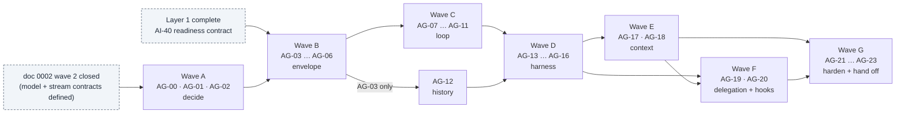

Parallelism worth exploiting: AG-05 ∥ AG-06 inside wave B; AG-12 runs beside all of wave C; AG-08 ∥ AG-09 after AG-07; AG-14 ∥ AG-15 after AG-13, with AG-16 following AG-15; AG-17 can start as soon as AG-13 closes (its other edges — AG-12, AG-02 — close earlier).

### Delivery sequence

| Wave | Milestones | Exit condition |
| --- | --- | --- |
| A — Decide | AG-00 to AG-02 | Vocabulary, event delivery model, and v1 scope are unambiguous and recorded. |
| B — Envelope | AG-03 to AG-06 | Every event family the v2 reference names is constructible, validated, and guarded; the package exists with its boundary guards biting. |
| C — Loop | AG-07 to AG-11 | One assistant turn runs end-to-end against the fake provider: streaming, hooks, scheduled tools, permission suspension, typed failure, termination. |
| D — Harness | AG-12 to AG-16 | A multi-turn run completes with history integrity, steering, a working cancellation tree, retry policy, and cost events. |
| E — Context | AG-17 to AG-18 | The context strategy seam exists; compaction works, is recorded, and is recoverable. |
| F — Delegation + hooks | AG-19 to AG-20 | The harness is provably re-entrant with nested cancellation/cost/permission scope; the four-hook taxonomy is complete. |
| G — Harden + hand off | AG-21 to AG-23 | Race- and leak-clean under adversarial schedules; observability inside the § D3 allowlist; Layer 3 readiness contract published and frozen. |

**First SDD to start: AG-00** (`cachicamas-agent-contract-vocabulary`), once doc 0002's wave 2 closes. First code-bearing SDD: AG-03, gated on AI-40.

---

## Wave A — Decide

### AG-00 — Record the Layer 2 contract vocabulary

SDD change: `cachicamas-agent-contract-vocabulary` · The AI-01 of this layer: names before code.

**Charter**

- **Goal:** Fix the meaning of every term the later milestones use, so that no SDD re-litigates what a *run*, a *turn*, a *transcript entry*, a *tool call/result pair*, a *suspension*, or a *steering message* is.
- **Deliverable:** A recorded vocabulary artifact covering at minimum: run vs turn vs provider call (one run = many turns; one turn = one assistant response plus its tool results; one turn may span several provider calls only via retry); transcript and the pairing invariant; the loop/harness responsibility split in this repo's words (the v2 reference § 4.1–4.2 restated as testable statements); suspension and resumption; steering; delegation and the parent relationship; the cost event's token-only scope.
- **Acceptance:** Every later AG milestone's charter can cite a vocabulary entry instead of defining a term inline; conflicting uses in doc 0001/0002 are reconciled or flagged.
- **Depends on:** doc 0002 wave 2 closed (the model and stream contracts are defined). · **Blocks:** everything.
- **Out of scope:** Any decision with a design alternative (AG-01, AG-02 own those).

#### AG-00.1 — The vocabulary decision `[decision]`

- **Closing checklist:**
  1. Every term above has exactly one definition, phrased observably (a test could cite it), including the boundary cases: is a turn with zero tool calls still a turn (yes — the terminal one); is a compaction summary a transcript entry or metadata about entries; is a steering message part of the current turn or the next one.
  2. The vocabulary states which Layer 1 identities Layer 2 reuses as-is (message identity, tool-call identity, finish reasons, usage) and which it wraps (events — Layer 2's envelope is its own, carrying Layer 1 payloads).
  3. The loop's six must-nevers and the harness's one must-never (v2 § 4.1–4.2) are restated as vocabulary-level obligations that AG-03's guards and later test lists cite.
- **Depends on:** — .

### AG-01 — Decide event delivery and the observer model

SDD change: `cachicamas-agent-event-delivery` · The G13 of this layer, decided before any event exists.

**Charter**

- **Goal:** Decide how agent events reach consumers — the carrier at the package boundary, the buffering/backpressure posture, who closes what, how observers attach without being able to stall token delivery (envelope invariant 3) — and how the **upward path** (permission decisions, steering input, interrupts) re-enters a live run.
- **Deliverable:** A recorded decision, no production code.
- **Acceptance:** The decision answers every question in the closing checklist and is closed before AG-04 starts.
- **Depends on:** AG-00. · **Blocks:** AG-04.
- **Note — documented default: keep channels,** for symmetry with the Layer 1 carrier decision (AI-02) and for the same reasons: the select-on-cancellation send discipline closes the stranded-producer hazard, and one carrier idiom across the module is worth more than marginal ergonomics. The iterator-view ergonomics live in the test kit, as doc 0002's AI-22 provides.

#### AG-01.1 — The delivery decision `[decision]`

- **Closing checklist:**
  1. Carrier at the boundary (documented default: channels, matching AI-02), with the same caller-owns-the-context liveness rule as Layer 1.
  2. Backpressure posture: agent events are **lossless** — message and tool events must all arrive, in order; the decision states whether the harness's consumer-facing stream may apply the same single sanctioned loss path as Layer 1 (cancellation on a saturated channel) and no other.
  3. The observer model: how a second consumer (a session logger, a cost meter) attaches; the decision must make envelope invariant 3 structural — a slow observer must be unable to stall the streaming path, by decoupling mechanism, not by convention.
  4. Close/ownership rules: who closes the per-turn stream, who closes the per-run stream, and what a consumer may assume after a terminal event — mirroring Layer 1's exactly-one-terminal discipline at the agent level.
  5. **The upward path.** How a permission decision, a steering message, or an interrupt enters a live run — the only upward arrow in [v2 § 2.2](../0001-cachicamas-agent-stack-v2.md#22-layer-view) — is decided here: the surface a frontend calls, how a decision finds its suspended call, and what happens to an upward message addressed to a run that already ended (typed rejection, never a silent drop). AG-10 and AG-13 consume this decision; neither may invent its own channel.
- **Depends on:** AG-00.

### AG-02 — Decide the Layer 2 v1 capability scope

SDD change: `cachicamas-agent-v1-scope` · The AI-03 of this layer.

**Charter**

- **Goal:** Decide, once, which of the concerns the forward-requirements register assigns to Layer 2 are *implemented* in v1 and which are *seams with trivial implementations* — so no later milestone re-litigates scope.
- **Deliverable:** A recorded decision with one verdict per concern: G1 protocol (documented default: implement — it is unretrofittable), G3 compaction (default: implement, AG-18 — the trigger seam alone is not testable against nothing), G4's Layer 2 half — prefix stability (default: implement, AG-08.2 — Layer 1 made breakpoints expressible; a harness that churns the prefix silently forfeits the discount), G5 parallel tools (default: implement), G7 delegation (default: **prove re-entrancy, ship no subagent tool** — v2 § 8 makes subagents a v1 non-goal; the structural property is the part that cannot be added later), G8's Layer 2 half (default: retry in v1, failover as a named seam with a trivial "none" implementation), G10's Layer 2 half (default: implement cost events), G11 hooks (default: taxonomy complete, pre-request and post-turn live, pre-compact live with AG-18, session-start emitted for Layer 3's use).
- **Acceptance:** Every G-concern owned by L2 in [v2 § 7](../0001-cachicamas-agent-stack-v2.md#7-forward-requirements-register) has a verdict here; any verdict that diverges from a documented default rebuts it explicitly.
- **Depends on:** AG-00, AG-01. · **Blocks:** AG-17, AG-18, AG-19.
- **Out of scope:** Anything Layer 3 owns (sandbox semantics, permission policy content, pricing).

#### AG-02.1 — The scope decision `[decision]`

- **Closing checklist:**
  1. One verdict per register row owned by L2, each citing the register and stating implement-now / seam-with-trivial-impl / deferred, with the trivial implementation named where applicable.
  2. The verdicts are consistent with this document's graph: a concern verdicted "implement" has milestones below; a concern verdicted "seam" has a named seam-bearing node; a mismatch is a bug in one of them and is fixed before the decision closes.
- **Depends on:** AG-00, AG-01.

---

## Wave B — The event envelope

### AG-03 — Package scaffold and boundary guards

SDD change: `cachicamas-agent-package-scaffold` · The AI-00 of this layer; the guards are the milestone.

**Charter**

- **Goal:** Create `backend/agent/src/agent/` with its import and I/O boundaries mechanically guarded from birth, so the no-I/O rule is never a matter of review vigilance.
- **Deliverable:** The package with a doc comment stating the layer contract; a forward import guard; a no-ambient-authority guard; both proven to bite.
- **Acceptance:** `make test` green in `backend/agent/`; both guards recorded failing against scratch violations.
- **Depends on:** AI-40 (normative gate), AG-00. · **Blocks:** everything code-bearing.
- **Out of scope:** Any event, loop, or harness behavior.

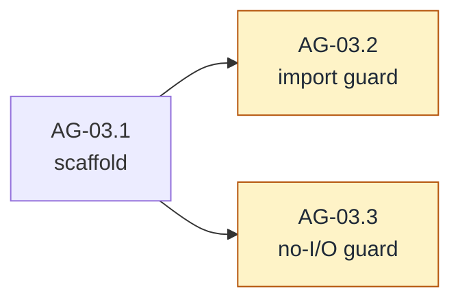

#### AG-03.1 — Scaffold `[mechanical]`

- **Check list:**
  1. WHEN `backend/agent/src/agent/` exists with a package doc comment stating the layer contract (imports row, no-I/O rule, event stream as the only upward contract) THEN `make test` and `make lint` remain green in the module.
  2. The doc comment carries the doc-guard byte-suffix convention doc 0002's guards establish, so later milestones append guarded paragraphs the same way.
- **Depends on:** AI-40, AG-00.

#### AG-03.2 — Forward import guard `[guard]`

- **Test list:**
  1. A `go list -deps`-with-allowlist guard (the AI-00 forward-guard mechanism, retargeted) asserts the Layer 2 package imports only: stdlib, `backend/agent/src/ai`, and the § D3-permitted OTel API paths. Forbidden by name: `src/coding`, `src/cmd`, both sibling backend modules, the OTel SDK/exporters/`otelslog`, and `net/http`.
  2. **Bite proof:** scratch imports of `src/coding` and of `net/http` each fail the guard; red output recorded, violations dropped.
- **Depends on:** AG-03.1.
- **Out of scope:** ambient authority (AG-03.3); the reverse direction (owned by Layer 1's and the hexagon's guards).

#### AG-03.3 — No-ambient-authority guard `[guard]`

- **Test list:**
  1. An AST scan (the no-ambient-authority guard style doc 0002 plans at AI-25) asserts the Layer 2 package makes no environment reads, no filesystem calls, and no process spawns — the mechanical form of "Layer 2 performs no I/O of its own" and of the loop's must-nevers from AG-00.1.
  2. **Bite proof:** a scratch environment read fails the scan; recorded, dropped.
- **Depends on:** AG-03.1.

### AG-04 — Define the agent event envelope and ordering invariants

SDD change: `cachicamas-agent-event-envelope` · The AI-14 of this layer, built with the 2026-07-30 review's scar tissue: every registered kind constructible from birth (the C4 lesson), sequence semantics per-stream from birth (the C3 lesson).

**Charter**

- **Goal:** Ship the envelope every agent event travels in — identity, kind, ordering — plus the run and turn lifecycle families, satisfying the four envelope invariants of [v2 § 4.3](../0001-cachicamas-agent-stack-v2.md#43-the-agent-event-envelope).
- **Deliverable:** The envelope with validation; run lifecycle events; turn lifecycle events; ordering invariants stated in the package documentation and pinned by test; and a **stream-contract validator** — the reusable checker these tests (and later the AG-23 kit) run over any event sequence. No producer exists until wave C, so the invariants must be assertable over hand-built sequences, and the validator is the named surface that makes them so.
- **Acceptance:** An external-package test constructs, validates, and inspects every event kind this milestone registers; the membership test for what belongs on the stream — "if it is not on the stream, no frontend can render it and no log can reconstruct it" — is stated in the package docs as the criterion later families are judged by.
- **Depends on:** AG-01, AG-03. · **Blocks:** AG-05, AG-06, AG-07.
- **Out of scope:** Message/tool families (AG-05); the four new families (AG-06); delivery mechanics beyond what AG-01 decided.

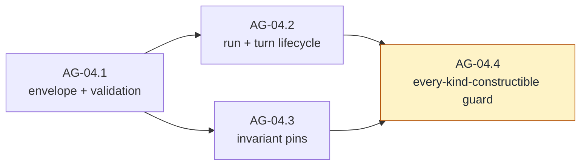

#### AG-04.1 — Envelope and validation `[leaf]`

- **Test list:**
  1. WHEN an event is constructed THEN its kind derives from its payload, a nil or mismatched payload fails validation, and identity fields (run, turn, parent) are readable from an external package — the review's C1/C2 defect class made structurally impossible on day one.
  2. Event ordering identity is **per-consumer-stream and 1-based from birth** (the C3 lesson): two hand-built streams stamped through the envelope's public ordering mechanism carry independent, contiguous, 1-based orderings under `-race` — proven via the validator, with no producer required.
  3. An event's parent identifier is optional at the envelope level, present exactly when the event belongs to a delegated harness (the field exists now; delegation fills it in AG-19 — envelope invariant 2 cannot be retrofitted).
- **Depends on:** AG-01, AG-03.

#### AG-04.2 — Run and turn lifecycle `[leaf]`

- **Test list:**
  1. A run-start / run-end pair brackets everything: the validator accepts exactly the hand-built sequences where one run-start precedes all other events and one run-end (carrying the run's outcome: completed, interrupted, failed) follows them, and rejects every violating permutation.
  2. Turn-start / turn-end pairs nest strictly inside the run and never overlap for one harness — turn-end distinguishes "model finished" from "turn aborted" by typed outcome — asserted over hand-built sequences via the validator.
  3. Terminal discipline mirrors Layer 1: the validator rejects anything after run-end — the discipline every later producer (AG-07, AG-13) is tested against.
- **Depends on:** AG-04.1.

#### AG-04.3 — Invariant pins `[leaf]`

- **Test list:**
  1. *(pin)* Deltas carry an index, never a snapshot: the envelope exposes no way to attach an accumulated-message payload to a delta kind — invariant 1, pinned before any delta family exists so AG-05 inherits it rather than re-deciding it.
  2. *(pin)* Typed errors: the envelope's failure payloads are inspectable values (`errors.Is`/`errors.As` reach category and cause), never message strings with special meaning — invariant 4's Layer 2 half, aligned with the AI-19 taxonomy for provider-originated failures.
- **Depends on:** AG-04.1.

#### AG-04.4 — Every kind constructible `[guard]`

- **Test list:**
  1. A guard iterates every registered event kind and constructs a valid instance of each through the public surface — the mechanical negation of Layer 1's C4 ("a kind two files declare mandatory cannot be constructed"). It must keep failing forever when a kind is registered without a constructible payload. **Bite proof:** a scratch kind with no payload fails the guard; recorded, dropped.
- **Depends on:** AG-04.2, AG-04.3.

### AG-05 — Add message and tool execution event families

SDD change: `cachicamas-agent-message-tool-events`.

**Charter**

- **Goal:** Ship the two high-volume families: message lifecycle (start, deltas, end — reasoning distinguished from text) and tool execution lifecycle (start, progress, end — typed failure distinguished from a result that reports failure).
- **Deliverable:** Both families, constructible and validated, with reconstruction proven.
- **Acceptance:** A consumer accumulating deltas reconstructs the message exactly; a tool event stream distinguishes the three end states (success, result-reports-failure, execution failed) by type, not by convention.
- **Depends on:** AG-04. **Parallel with:** AG-06.
- **Out of scope:** Producing these events from a live loop (AG-07, AG-09); permission events around tools (AG-06, AG-10).

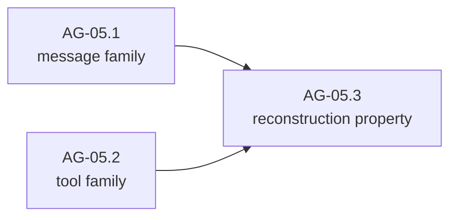

#### AG-05.1 — Message family `[leaf]`

- **Test list:**
  1. Message start / delta / end events carry Layer 1 content identities; reasoning deltas are distinguishable from text deltas at the event-kind level (a frontend renders them differently without inspecting payload internals).
  2. Deltas carry the index invariant pinned at AG-04.3 — asserted here against real delta payloads.
  3. A message that arrives whole (no deltas — the delta-optional contract of doc 0002's AI-18) is expressible as start-then-end, and consumers cannot distinguish it from a fragmented equivalent after reconstruction.
- **Depends on:** AG-04.

#### AG-05.2 — Tool execution family `[leaf]`

- **Test list:**
  1. Tool start (identity, name, arguments), progress (optional, indexed), end — with the end distinguishing by type: success with result; the tool ran and its result reports failure; the execution itself failed (typed error).
  2. Tool events carry the call ordinal (the G5 thread from doc 0002 AI-30's ordinal preservation), so a consumer can correlate events to call order regardless of completion order.
- **Depends on:** AG-04.

#### AG-05.3 — Reconstruction property `[leaf]`

- **Test list:**
  1. WHEN a scripted event sequence interleaves two messages' deltas and two tools' progress THEN a consumer reconstructs each independently and completely — the property Layer 3's session log will depend on, proven before any producer exists.
- **Depends on:** AG-05.1, AG-05.2.

### AG-06 — Add permission, cost, delegation and compaction event families

SDD change: `cachicamas-agent-protocol-events` · The four families [v2 § 4.3](../0001-cachicamas-agent-stack-v2.md#43-the-agent-event-envelope) marks **absent** from the v1 design — G1, G10, G7, G3's visible halves.

**Charter**

- **Goal:** Make the four missing families constructible and validated, before the mechanisms that emit them exist — so that AG-10, AG-16, AG-18 and AG-19 emit events rather than invent them.
- **Deliverable:** Permission family (decision required / decision made / resolution remembered); cost family (per-turn and cumulative, labelled estimate vs final); delegation family (subagent started / ended, parent-linked); compaction family (started / finished / what was removed).
- **Acceptance:** Every payload constructible externally (AG-04.4's guard extends over them); each family's semantics documented against its G-finding.
- **Depends on:** AG-04. **Parallel with:** AG-05.
- **Out of scope:** Emission (AG-10, AG-16, AG-18, AG-19 respectively).
- **Note — one v2 conflict, reconciled here (the AG-00 reconcile-or-flag duty, executed):** [v2 § 4.3](../0001-cachicamas-agent-stack-v2.md#43-the-agent-event-envelope)'s cost-family row and the § 2.3 diagram show the harness reporting "tokens, cache hits and money", while [ADR 0005 § D4](../../adr/0005-promote-agent-stack-to-own-module.md#d4--v1-scope-for-cross-cutting-concerns) and v2 § 7 rule "L2 emits, L3 prices". The verdict wins: the Layer 2 payload is token-only, and money joins the stream as Layer 3 enrichment ([doc 0004 CO-18](./0004-cachicamas-coding-layer-3-task-graph.md#co-18--price-the-run)). The v2 family row reads as the stack's obligation, satisfied at the session stream.

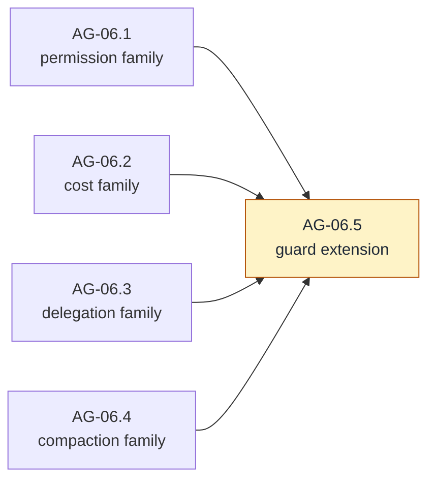

#### AG-06.1 — Permission family `[leaf]`

- **Test list:**
  1. A decision-required event carries the call identity, tool name, and arguments — everything a frontend needs to ask; a decision-made event carries the outcome vocabulary (allow once / allow always / deny / modify input) and, for modify-input, the modified arguments.
  2. A resolution-remembered event is distinct from decision-made — "remembered" is a fact about future calls, and the stream must record it or the session log cannot explain why later calls were never asked (the family table's third entry).
- **Depends on:** AG-04.

#### AG-06.2 — Cost family `[leaf]`

- **Test list:**
  1. A cost event carries per-turn and cumulative token figures (input, output, cache read, cache write, reasoning — mirroring Layer 1's usage fields) and **no money** — pricing is Layer 3's, and the payload has no field to smuggle it in.
  2. A cost event is labelled estimate or final; the estimate label is mandatory for any figure emitted before the stream's final usage update (the adaptive-reasoning nuance from v2 § 7's G10 disposition).
- **Depends on:** AG-04.

#### AG-06.3 — Delegation family `[leaf]`

- **Test list:**
  1. Subagent-started / subagent-ended events carry the parent identifier and the child's run identity; a consumer can attribute any event to the delegation tree by walking parents (envelope invariant 2, exercised).
- **Depends on:** AG-04.

#### AG-06.4 — Compaction family `[leaf]`

- **Test list:**
  1. Compaction-started / compaction-finished events; finished carries what was removed (a description a session log can persist: which span of transcript entries was replaced, by what summary identity) — the "recorded rather than silently applied" requirement of v2 § 5.2, expressible before AG-18 exists.
  2. A compaction-failed terminal is constructible and distinct from finished — interrupted compaction must be visible on the stream, or recovery (AG-18.4) has nothing to reason from.
- **Depends on:** AG-04.

#### AG-06.5 — Guard extension `[guard]`

- **Test list:**
  1. AG-04.4's every-kind-constructible guard is re-run over the enlarged registry and still bites (fresh scratch violation recorded against one of the new kinds).
- **Depends on:** AG-06.1 … AG-06.4.

---

## Wave C — The loop

### AG-07 — Build the one-turn walking skeleton

SDD change: `cachicamas-agent-loop-skeleton` · The single most important node in this document: the first time Layer 1 and Layer 2 meet.

**Charter**

- **Goal:** One assistant turn, end to end, smallest possible surface: given a system instruction, transcript, empty tool set and options, the loop calls the fake provider, re-emits normalized content as agent message events, and reports the turn complete.
- **Deliverable:** The stateless turn runner in its thinnest form.
- **Acceptance:** A test scripts a text response on the AI-21 fake, runs one turn, drains message start/deltas/end plus turn lifecycle events in contract order, and observes turn completion with the finish reason surfaced. The loop holds no state between calls — two sequential turns on one loop value are independent.
- **Depends on:** AI-40 (which delivers AI-21/AI-22), AG-05. · **Blocks:** AG-08 … AG-11.
- **Out of scope:** Tools (AG-09), hooks (AG-08), errors beyond pass-through (AG-11), reasoning display policy (a frontend concern — reasoning events flow through like text with their own kind).

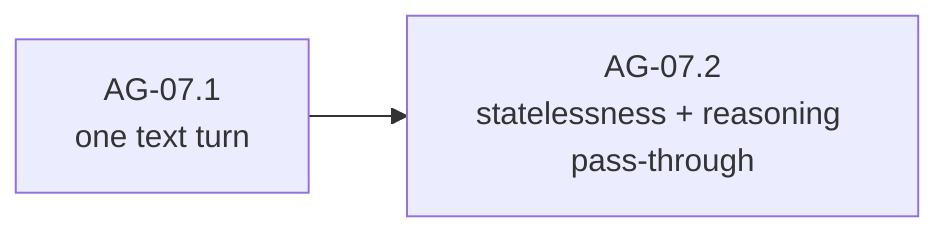

#### AG-07.1 — One text turn `[leaf]`

- **Test list:**
  1. WHEN the loop runs one turn against a scripted text response THEN the consumer observes: turn start, message start, the deltas in order, message end, turn end with the model's finish reason — and nothing else.
  2. The provider stream is drained to its terminal and its cancellation contract respected (the loop passes the caller's context down; it creates no context of its own beyond derivation).
  3. The turn's assistant message is available to the caller as a Layer 1 message value, exactly as reconstructable from the emitted deltas (one source of truth, proven by comparison).
- **Depends on:** AI-40, AG-05.

#### AG-07.2 — Statelessness and reasoning pass-through `[leaf]`

- **Test list:**
  1. Two sequential turns on one loop value share nothing: the second turn's events are independent of the first's (fresh ordering, no residue) — the stateless contract of v2 § 4.1 as a test.
  2. A scripted response interleaving reasoning and text re-emits both, distinguished by kind, with the reasoning round-trip token preserved into the assistant message (AI-07's byte-exactness, now proven through the loop).
- **Depends on:** AG-07.1.

### AG-08 — Add the pre-request hook seam

SDD change: `cachicamas-agent-pre-request-hook` · Seam 1 of [v2 § 6](../0001-cachicamas-agent-stack-v2.md#6-the-twelve-seams-that-must-exist-now): the only point where the outgoing request exists as data.

**Charter**

- **Goal:** Give the loop the hook that runs immediately before the provider call — the seam cache breakpoints, injected context and prompt trimming will stand on.
- **Deliverable:** The hook seam with an identity default, using Layer 1's copy-on-write rebuild (AI-12) as its mutation mechanism; the loop-side prefix-stability guarantee (**G4**'s Layer 2 half).
- **Acceptance:** A hook can observe and replace the outgoing request; the identity default changes nothing; hook failures are typed and abort the turn before I/O; identical inputs yield identical outgoing requests across turns.
- **Depends on:** AG-07. **Parallel with:** AG-09.
- **Out of scope:** Any concrete hook (cache-breakpoint placement is Layer 3 wiring — doc 0004 CO-24); the other three hook points (AG-20).

#### AG-08.1 — The hook seam `[leaf]`

- **Test list:**
  1. WHEN a hook is installed THEN it receives the fully-assembled outgoing request and its return value is what the provider receives — proven by a hook that adds a system segment and a fake-provider request capture (AI-21) showing the segment arrived.
  2. WHEN no hook is installed THEN behavior is byte-identical to AG-07 (identity default, asserted by captured-request equality).
  3. WHEN the hook fails THEN the turn fails pre-I/O with a typed error attributing the hook — never a half-mutated request sent anyway.
  4. The hook cannot mutate the loop's input in place: the original request is observably unchanged after a mutating hook runs (AI-12's rebuild property, consumed here).
- **Depends on:** AG-07.

#### AG-08.2 — Prefix stability `[leaf]`

Closes **G4**'s Layer 2 half: Layer 1 made cache breakpoints expressible (AI-11); this leaf makes the loop incapable of churning the prefix they mark.

- **Test list:**
  1. WHEN successive turns run with unchanged system material, tools, and hook THEN the outgoing requests' tool and system regions are **byte-identical** across turns and the message region grows strictly by append (fake-capture comparison over the tools → system → messages cascade) — a silent prefix break is a silent 10× input-cost regression, per v2 § 3.2.
  2. The hook seam is deterministic for identical inputs (same request in → same request out, asserted across invocations), so hook-applied breakpoint markers cannot oscillate between turns and invalidate the very prefix they exist to cache.
- **Depends on:** AG-08.1.
- **Out of scope:** history append-only ordering (AG-12.1); the changed-tool-set visibility event (Layer 3's — doc 0004 CO-02); actual marker placement (doc 0004 CO-24).

### AG-09 — Define the tool execution contract and scheduler

SDD change: `cachicamas-agent-tool-scheduler` · Closes: **G5**. Seams 2 and 3's Layer 2 anchor: the execution call carries a policy parameter it does not interpret.

**Charter**

- **Goal:** Define what a tool is to Layer 2 — an executable with a declaration, an effect class, and a typed failure mode — and schedule requested calls: reads parallel, writes and shell serialized, bounded fan-out, results rejoined in call order.
- **Deliverable:** The execution contract; the scheduler; tool execution events emitted per AG-05.2.
- **Acceptance:** Interleaved completions rejoin in call order; a failing tool yields a typed execution-failure result while its siblings complete; the execution call carries an opaque per-call policy slot Layer 2 never reads (the sandbox seam).
- **Depends on:** AG-07, AG-05. **Parallel with:** AG-08. · **Blocks:** AG-10; doc 0004's built-in tools implement this contract.
- **Out of scope:** Permission (AG-10 wraps this); what any tool does; sandbox semantics (Layer 3 interprets the policy slot).

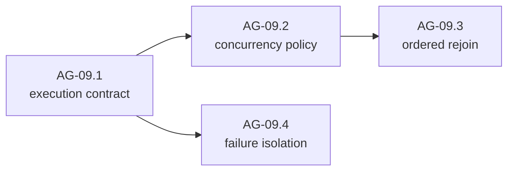

#### AG-09.1 — The execution contract `[leaf]`

- **Test list:**
  1. A tool exposes its Layer 1 declaration (what the model sees) and an effect class (at minimum: read, mutating, execute) the scheduler consumes; an in-test scripted tool satisfies the contract from an external package.
  2. Execution receives the call's arguments and a per-call policy value that Layer 2 passes through opaquely — asserted by a scripted tool observing the exact value the caller injected (seam 3: confinement is a property of the call site, and this is the call site).
  3. A tool's result and a tool's typed execution failure are distinct outcomes (the AG-05.2 three-state distinction, at the contract level).
- **Depends on:** AG-07, AG-05.

#### AG-09.2 — Concurrency policy `[leaf]`

- **Test list:**
  1. WHEN a turn requests multiple read-class calls THEN they run concurrently (proven by synchronization points, not timing); WHEN it requests mutating or execute-class calls THEN those serialize among themselves in call order.
  2. Fan-out is bounded: with more read calls than the bound, no more than the bound run at once, and all complete.
  3. Tool start events are emitted at execution start (not at rejoin), so a frontend shows live progress in true execution order.
- **Depends on:** AG-09.1.

#### AG-09.3 — Ordered rejoin `[leaf]`

- **Test list:**
  1. WHEN completions arrive out of call order THEN results are delivered to the transcript in **call order** (G5's core: several providers reject positionally mismatched results) — scripted with deliberate completion inversion.
  2. The rejoin preserves the Layer 1 call/result correlation identities exactly, including synthetic identifiers minted by an adapter (leakage register row 7's Layer 2 leg).
- **Depends on:** AG-09.2.

#### AG-09.4 — Failure isolation `[leaf]`

- **Test list:**
  1. WHEN one call's execution fails THEN its siblings run to completion, the failure enters the rejoin as a typed result-position (the model sees a failure result, the stream sees a typed failure event), and the turn continues — one bad tool does not abort a turn.
  2. WHEN a tool panics THEN the panic is contained to that call and converted to the typed execution failure, under `-race` — a tool author's bug must not kill the loop.
- **Depends on:** AG-09.1.

### AG-10 — Implement the permission protocol

SDD change: `cachicamas-agent-permission-protocol` · Closes: **G1** (protocol half). Seam 2: if approval is not a suspension in the loop, every frontend reimplements it out of band.

**Charter**

- **Goal:** Around every scheduled call: ask the injected policy; if the policy defers to a human, emit decision-required, **suspend that call without blocking anything else**, resume on the decision; emit decision-made and, when applicable, resolution-remembered.
- **Deliverable:** The ask–suspend–resume protocol in the loop's scheduling path, driving AG-06.1's events, against an injected policy contract.
- **Acceptance:** A suspended call blocks neither its siblings nor event delivery; all four outcomes work (allow once / allow always / deny / modify input); deny produces a denial result the model can see; modify-input executes with the modified arguments and the stream says so.
- **Depends on:** AG-09, AG-06. · **Blocks:** AG-13 (a run must be resumable across a suspension).
- **Out of scope:** Policy content (Layer 3 port — doc 0004); persistence of remembered rules (Layer 3 session); derived scope for subagents (AG-19.3).

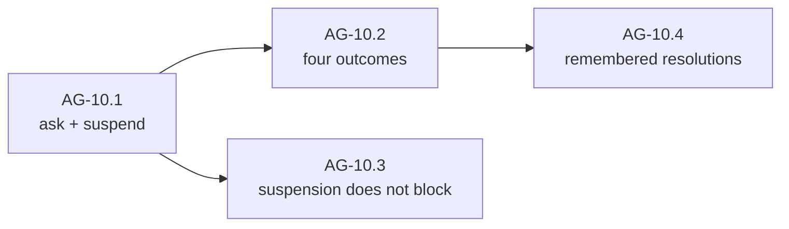

#### AG-10.1 — Ask and suspend `[leaf]`

- **Test list:**
  1. WHEN the injected policy answers immediately (allow or deny) THEN no decision-required event is emitted and execution proceeds/skips accordingly — the policy is asked before every call, and silence on the stream means nobody needed to be asked.
  2. WHEN the policy defers THEN a decision-required event is emitted carrying everything AG-06.1 promised, and that call parks until a decision arrives via the upward path AG-01.1 decided (closing-checklist item 5) — the loop implements that decision; it does not invent a channel.
  3. A decision that arrives for an unknown or already-decided call identity is a typed protocol error, not a silent no-op.
- **Depends on:** AG-09, AG-06.

#### AG-10.2 — Four outcomes `[leaf]`

- **Test list:**
  1. Allow-once executes exactly as scheduled. Deny skips execution and rejoins a typed denial result in call order — the model is told, in the transcript, that the call was denied.
  2. Modify-input executes with the modified arguments; the decision-made event carries both original and modified arguments so the session log can reconstruct what actually ran.
  3. Allow-always executes and reports the resolution as remembered-eligible to the policy — whether it *is* remembered is the policy's answer, and the loop emits resolution-remembered only when the policy says so.
- **Depends on:** AG-10.1.

#### AG-10.3 — Suspension does not block `[leaf]`

- **Test list:**
  1. WHEN one call is suspended THEN sibling calls schedule, execute, and emit events; message deltas already in flight keep flowing — proven with synchronization points holding one call suspended while others complete.
  2. WHEN the run is cancelled while a call is suspended THEN the suspension resolves as aborted (typed), the turn winds down per the cancellation contract, and no goroutine waits forever for a decision that will never come.
- **Depends on:** AG-10.1.

#### AG-10.4 — Remembered resolutions `[leaf]`

- **Test list:**
  1. WHEN the policy reports a resolution remembered THEN subsequent identical calls in the same run are not asked (the policy answers from memory) and the stream shows the initial resolution-remembered event followed by unasked executions — the sequence a session log needs to explain why no further prompts appear.
- **Depends on:** AG-10.2.
- **Out of scope:** cross-session memory of resolutions — Layer 3 persistence.

### AG-11 — Complete turn termination and typed failure reporting

SDD change: `cachicamas-agent-turn-termination` · Where AI-13's three-way distinction and AI-19's taxonomy pay off.

**Charter**

- **Goal:** The loop decides turn completion correctly for every finish reason and reports every provider failure as a typed value upward — deciding nothing about retries.
- **Deliverable:** Termination handling over the full finish-reason vocabulary; typed failure propagation preserving the partial-output discriminator.
- **Acceptance:** Tool-calls finish → the turn continues into scheduling; end-turn → complete; refusal → complete-with-refusal (distinct outcome); pause → suspended-resumable outcome (distinct from refusal — the loop-termination bug AI-13 exists to prevent); provider terminal error → typed turn failure carrying category, retryability, and partial output; the loop never retries.
- **Depends on:** AG-07, AG-09. · **Blocks:** AG-13, AG-15.
- **Out of scope:** Acting on retryability (AG-15); acting on pause (the harness resumes; AG-13).

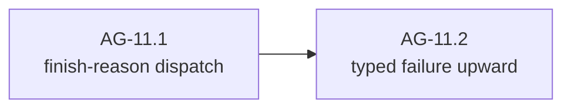

#### AG-11.1 — Finish-reason dispatch `[leaf]`

- **Test list:**
  1. Each normalized finish reason maps to a distinct, typed turn outcome under exhaustive switch, with the AI-13 exhaustiveness pin extended here: a future finish reason fails compilation-or-test until the loop handles it.
  2. Refusal and pause produce different outcomes with different documented obligations (refusal: the turn is over; pause: the turn expects resumption with the transcript replayed verbatim, per the pause-replay note of doc 0002's AI-31).
- **Depends on:** AG-07, AG-09.
- **Out of scope:** pairing enforcement for turns that fail mid-tool-calls — the typed failure path (AG-11.2) plus the history boundary and orphan synthesis (AG-12) own that jointly; this leaf owns only the dispatch.

#### AG-11.2 — Typed failure upward `[leaf]`

- **Test list:**
  1. WHEN the provider stream ends in a terminal error THEN the loop's turn outcome carries the AI-19 taxonomy unwrapped-inspectable (`errors.Is`/`errors.As` through the turn outcome), including the partial-output discriminator and any partial assistant content, and the event stream carries the corresponding typed failure event.
  2. The loop issues **no second provider call** on any failure — asserted via fake-provider call count; retry is the harness's decision (seam 7's split, tested from the loop side).
- **Depends on:** AG-11.1.

---

## Wave D — The harness

### AG-12 — Implement history and the pairing invariant

SDD change: `cachicamas-agent-history` · The invariant everything else leans on: **every tool call has a matching result, enforced at the history boundary.**

**Charter**

- **Goal:** The harness's transcript store: append-only within a run, validated at the boundary, with orphan synthesis for interruption.
- **Deliverable:** History with the pairing invariant; orphan-synthesis behavior; read access for the loop and (eventually) Layer 3 persistence.
- **Acceptance:** A transcript that would orphan a call cannot be committed; interruption synthesizes results for orphaned calls before the next turn; the enforcement lives at the boundary, not at call sites (v2 § 4.2's exact phrasing, as architecture).
- **Depends on:** AG-03 (and Layer 1 message contracts via AI-40). **Parallel with:** all of wave C. · **Blocks:** AG-13, AG-17.
- **Out of scope:** Persistence (Layer 3); compaction's interaction (AG-18.2 re-proves the invariant post-compaction).

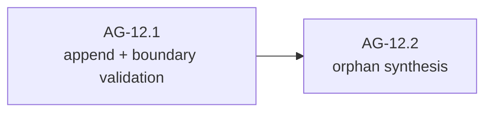

#### AG-12.1 — Append and boundary validation `[leaf]`

- **Test list:**
  1. WHEN messages append in conversation order THEN reads return them in order, and appending a tool-result entry whose call identity has no prior call fails typed — as does committing a state where a call has no result once the turn closes.
  2. The invariant is boundary-enforced: there is exactly one commit path, and a test constructing an orphaning sequence through any public route is rejected (no privileged bypass for internal callers — the C1 lesson applied to history).
  3. History exposes what the loop needs (the transcript as Layer 1 values) and what a future session needs (stable entry identity), read-only.
  4. History is constructible over a pre-existing transcript, and seeded construction runs the same boundary validation (every pair matched, order valid; an invalid seed rejected typed) — the seam session resume and next-run model switching stand on (doc 0004 CO-16, CO-19), named here because AG-23 freezes it.
- **Depends on:** AG-03.

#### AG-12.2 — Orphan synthesis `[leaf]`

- **Test list:**
  1. WHEN a turn is interrupted after calls were issued but before results arrived THEN synthesized results (typed as interruption artifacts, distinguishable from real results) complete every orphaned pair before the next turn can start.
  2. Synthesis is idempotent and total: applied twice it changes nothing; applied to a transcript with N orphans it closes exactly N.
- **Depends on:** AG-12.1.

### AG-13 — Drive the multi-turn run

SDD change: `cachicamas-agent-run-driver` · The harness's core: turns until the model stops asking for tools.

**Charter**

- **Goal:** The harness runs the loop repeatedly — append user message, run turn, execute/append results (via the loop), repeat — until a terminal finish reason, emitting run lifecycle events, handling pause-resumption, and accepting queued steering input.
- **Deliverable:** The run driver over AG-07…AG-12; steering-message queueing.
- **Acceptance:** A scripted two-call-then-answer conversation (the AI-21 fake's sequential-call scripting) completes with correct history and a correctly ordered event stream; a steering message queued mid-turn enters the transcript at the next turn boundary; pause resumes; the run survives a permission suspension spanning a turn.
- **Depends on:** AG-10, AG-11, AG-12. · **Blocks:** AG-14 … AG-19.
- **Out of scope:** Retry/failover (AG-15); compaction check (AG-17 inserts it); cancellation details (AG-14).

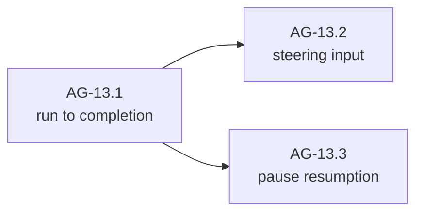

#### AG-13.1 — Run to completion `[leaf]`

- **Test list:**
  1. WHEN the fake scripts turn 1 = tool call, turn 2 = final text THEN one prompt yields: run start, turn 1 (with tool execution and result append), turn 2, run end — history holding the full alternating transcript with every pair matched.
  2. The run's event stream is the complete story: replaying it reconstructs every message and tool outcome the history holds (the envelope's membership test, asserted at run scope).
  3. The harness never dictates loop logic: the loop is driven through its public one-turn surface only — no privileged channel (mechanically: the harness compiles against the same surface AG-07's external tests use).
- **Depends on:** AG-10, AG-11, AG-12.

#### AG-13.2 — Steering input `[leaf]`

- **Test list:**
  1. WHEN a user message arrives mid-turn THEN it queues, the current turn completes untouched, and the queued message enters history at the turn boundary before the next provider call — consecutive same-role entries are legal in the neutral transcript (adapters merge them; leakage register row 5 stays adapter-local).
  2. Multiple queued messages preserve arrival order; queueing during the final turn yields a new turn rather than a dropped message.
- **Depends on:** AG-13.1.

#### AG-13.3 — Pause resumption `[leaf]`

- **Test list:**
  1. WHEN a turn ends in the pause finish reason THEN the harness resumes by replaying received content verbatim (doc 0002 AI-31's pause-replay obligation) and the run continues to a real terminal — with the pause visible on the stream as its own turn outcome, not silently absorbed.
- **Depends on:** AG-13.1.

### AG-14 — Build the cancellation tree

SDD change: `cachicamas-agent-cancellation-tree` · Interrupt ≠ shutdown, and both ≠ deadline.

**Charter**

- **Goal:** Two distinguishable signals — user interrupt (abort the turn, keep the session) and shutdown (flush and exit) — propagated down through loop, provider and tools, with bounded-time wind-down and history integrity after either.
- **Deliverable:** The cancellation tree over the run driver.
- **Acceptance:** Interrupt mid-turn: provider stream cancelled per the Layer 1 contract, running tools cancelled, orphans synthesized, run ends as interrupted, harness ready for the next prompt. Shutdown: same wind-down, then the harness refuses new prompts. Both distinguishable in run-end outcomes and error chains.
- **Depends on:** AG-13. **Parallel with:** AG-15, AG-16.
- **Out of scope:** Subagent inheritance (AG-19.2); frontend signal wiring (Layer 3).

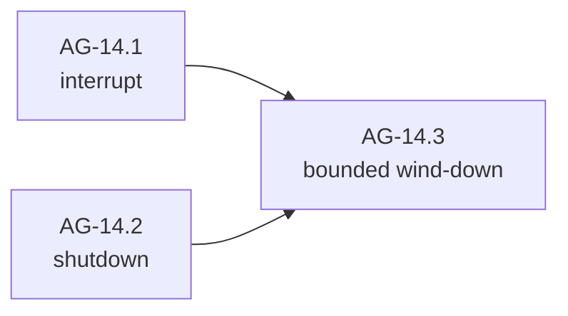

#### AG-14.1 — Interrupt `[leaf]`

- **Test list:**
  1. WHEN interrupt fires mid-stream THEN the provider call is cancelled (observed via the AI-21 fake's cancellation-fidelity contract), in-flight tools observe cancellation, orphan synthesis runs, and the run ends with the interrupted outcome — after which a new prompt on the same harness works.
  2. WHEN interrupt fires during a permission suspension THEN the suspension aborts typed (AG-10.3's case, now at run scope) and history closes cleanly.
  3. Interrupt is idempotent: a second interrupt during wind-down changes nothing and panics nothing.
- **Depends on:** AG-13.

#### AG-14.2 — Shutdown `[leaf]`

- **Test list:**
  1. WHEN shutdown fires THEN wind-down proceeds as interrupt does, the run-end outcome says shutdown, and subsequent prompts fail typed — the two signals produce distinguishable outcomes end to end (`errors.Is` distinguishes them through every layer they cross).
- **Depends on:** AG-13.

#### AG-14.3 — Bounded wind-down `[leaf]`

- **Test list:**
  1. WHEN a tool ignores cancellation THEN the run still ends within a documented bound, the offending call is reported typed (which tool, still running), and no goroutine belonging to the harness leaks — the tool's goroutine is detached and named, not silently abandoned (the AG-21 leak checks depend on this being precise).
- **Depends on:** AG-14.1, AG-14.2.

### AG-15 — Implement retry policy and the failover seam

SDD change: `cachicamas-agent-retry-failover` · Closes: **G8**'s Layer 2 half. Seam 7 consumed, seam 8 reserved.

**Charter**

- **Goal:** The harness decides what the loop refused to: whether to retry a failed turn. Policy consumes AI-19's typed evidence — category, retryability, partial-output discriminator, retry-after — and the failover seam exists with a trivial "none" implementation.
- **Deliverable:** Turn-level retry in the run driver; the failover seam.
- **Acceptance:** Pre-output retryable failures retry within bounds; **any failure after emitted output is surfaced, never silently retried** (the G8 sentence, now at the harness); terminal categories never retry; backoff waits on the context; the failover seam is a named injection point whose v1 implementation declines.
- **Depends on:** AG-11, AG-13. **Parallel with:** AG-14, AG-16.
- **Out of scope:** Wire-level retry (Layer 1's AI-35 owns pre-stream mechanics); model failover implementation (post-v1: re-budgeting tokens and prices crosses into AG-17/Layer 3 territory, per seam 8's rationale).
- **Note — composed bounds:** if doc 0002's AI-35 policy decision chooses Layer 1 auto-retry, wire-level attempts multiply under harness attempts. AG-15.2 states and tests the combined ceiling so the first rate-limit storm is not the first time anyone computes it.

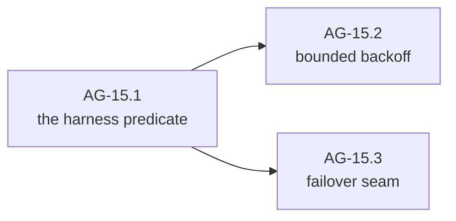

#### AG-15.1 — The harness predicate `[leaf]`

- **Test list:**
  1. WHEN a turn fails retryable-with-no-output THEN the harness re-runs it (fresh provider call, identical transcript) up to a documented bound, and the stream shows each attempt distinctly — attempts are visible, not silent.
  2. WHEN a turn fails **after partial output** THEN no automatic retry occurs; the typed failure surfaces on the stream with its partial content, and the run ends failed — the naive predicate ("retry if retryable") is exactly what this test forbids.
  3. Non-retryable categories surface immediately regardless of position.
- **Depends on:** AG-11, AG-13.

#### AG-15.2 — Bounded backoff `[leaf]`

- **Test list:**
  1. Retry-after, when carried by the error, overrides computed backoff; backoff waits on the context (interrupt during backoff aborts immediately); all timing is injected.
  2. The harness's attempt bound holds regardless of any Layer 1 retrying beneath it (asserted by provider-call count against a fake scripted to fail pre-stream forever), and the documented combined ceiling — harness attempts × Layer 1 attempts — is stated in the policy's documentation, where both layers' readers will find it.
- **Depends on:** AG-15.1.

#### AG-15.3 — Failover seam `[leaf]`

- **Test list:**
  1. The retry path consults an injected failover decision point before giving up; the v1 implementation always declines, and the seam's contract documents what a real implementation must handle (re-counting the context budget, restarting the cache prefix — seam 8's rationale, recorded where the implementer will look).
  2. *(pin)* With the "none" implementation, behavior is identical to AG-15.1's — the seam's existence changes nothing.
- **Depends on:** AG-15.1.

### AG-16 — Emit cost and usage events

SDD change: `cachicamas-agent-cost-events` · Closes: **G10**'s Layer 2 half. Layer 1 already counts; Layer 2 reports.

**Charter**

- **Goal:** Every turn ends with a cost event; the run maintains cumulative figures; estimates are labelled; delegated work aggregates into the parent (the aggregation half lands with AG-19).
- **Deliverable:** Cost emission in the run driver from Layer 1 usage.
- **Acceptance:** Per-turn events match the fake's scripted usage exactly, including cache and reasoning figures; cumulative equals the sum over turns including retries (a retried attempt's tokens are real spend and must be counted); absent usage yields an event that says absent rather than inventing zeros.
- **Depends on:** AG-13, AG-06, AG-15 (retry-inclusive accounting cannot be tested before retries exist). **Parallel with:** AG-14.
- **Out of scope:** Money (Layer 3 price table); mid-stream incremental cost display (a frontend may accumulate deltas itself; the estimate-labelled event at minimum covers it).

#### AG-16.1 — Per-turn and cumulative cost `[leaf]`

- **Test list:**
  1. WHEN a turn completes THEN its cost event carries the turn's usage (all five token figures, absent-vs-zero honored) labelled final; WHEN a multi-turn run completes THEN cumulative equals the per-turn sum, retries included.
  2. WHEN usage arrives only on the final stream update (adaptive reasoning) THEN any earlier emitted figure was labelled estimate and the final event corrects it — the estimate/final protocol of AG-06.2, driven by a real scripted sequence.
- **Depends on:** AG-13, AG-06.

---

## Wave E — Context

### AG-17 — Add the context strategy seam and token accounting

SDD change: `cachicamas-agent-context-strategy` · Seams 5 and 6: the check before every turn, and the optional counting capability.

**Charter**

- **Goal:** Before each provider call, the harness consults an injected context strategy with the transcript and the model's budget; the v1 default never compacts. Token accounting discovers the provider's optional counting capability by type assertion and falls back to a documented estimate.
- **Deliverable:** The strategy seam in the run driver; the accounting helper with capability discovery.
- **Acceptance:** The strategy is consulted before every provider call with both inputs (transcript, budget); the never-compact default changes nothing; with a counting-capable fake the accounting uses it, without one it estimates and says so.
- **Depends on:** AG-12, AG-13, AG-02. · **Blocks:** AG-18.
- **Out of scope:** Compaction itself (AG-18); budget configuration (Layer 3 supplies the model's budget via options).

#### AG-17.1 — The strategy seam `[leaf]`

- **Test list:**
  1. WHEN a run executes N turns THEN the injected strategy was consulted exactly N times, before each provider call, receiving the current transcript and budget — proven with a recording strategy.
  2. *(pin)* The never-compact default: a run with the default strategy emits no compaction events and mutates no history.
- **Depends on:** AG-12, AG-13, AG-02.

#### AG-17.2 — Token accounting `[leaf]`

- **Test list:**
  1. WHEN the provider asserts the optional counting capability (doc 0002 AI-03's optional-capability discovery) THEN accounting uses it; WHEN it does not THEN the estimate path runs and its figures are labelled estimates — the two paths distinguishable to the strategy consuming them.
  2. The estimate is documented as an estimate with its method stated; no code path treats an estimate as exact (the seam-6 rationale: character-count compaction is wrong by enough to matter).
- **Depends on:** AG-17.1.

### AG-18 — Implement compaction

SDD change: `cachicamas-agent-compaction` · Closes: **G3**. A model call with its own provider, cost, and cancellation — and the invariant-preserving transcript surgery around it.

**Charter**

- **Goal:** When the strategy says compact: summarize the compactable span via a model call, replace that span with the summary, protect recent turns, never orphan a pair, record everything on the stream, and survive interruption.
- **Deliverable:** Compaction as a strategy implementation plus the harness mechanics it needs; an **on-demand entry point** (the same mechanics invoked at a turn boundary — doc 0004's `/compact` stands on it); the summarization instruction arrives **injected** — Layer 2 owns no prompt content, so this milestone's tests script one.
- **Acceptance:** Post-compaction history validates under AG-12's invariant; recent turns configured protected are byte-identical; the compaction model call has its own provider/options/cost and cancels independently; compaction-started/finished events carry what AG-06.4 promised; an interrupted compaction leaves the pre-compaction transcript intact and usable.
- **Depends on:** AG-17, AG-06, AG-16 (compaction spend is reported spend). 
- **Out of scope:** When to compact (the strategy's threshold is Layer 3 configuration); the summarization instruction's content (injected by Layer 3); persistence of the record (Layer 3 session).

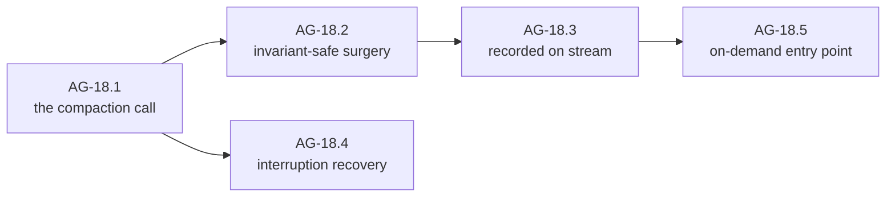

#### AG-18.1 — The compaction call `[leaf]`

- **Test list:**
  1. Compaction issues a model call with its own injected provider and options (which may differ from the run's), reports its usage into the run's cost as compaction spend, and cancels via the run's cancellation tree without killing the session.
  2. The summarization instruction is injected alongside the provider and options, and the fake's captured request proves the injected instruction — and no content authored by Layer 2 — is what the compaction call carried.
- **Depends on:** AG-17, AG-16.

#### AG-18.2 — Invariant-safe surgery `[leaf]`

- **Test list:**
  1. WHEN a span is replaced by its summary THEN the resulting transcript passes AG-12's boundary validation, with no call/result pair split across the compaction boundary — a span boundary that would split a pair moves to include the whole pair, by construction.
  2. Protected recent turns are untouched byte-identical; the summary entry is typed as a compaction artifact, distinguishable from a model message.
- **Depends on:** AG-18.1.

#### AG-18.3 — Recorded on stream `[leaf]`

- **Test list:**
  1. Compaction emits started and finished events; finished identifies the replaced span and the summary entry, sufficient for a session log to record the operation and for a resumed session to reconstruct exactly what the model now sees (v2 § 5.2's "recorded rather than silently applied", proven from the emitting side).
- **Depends on:** AG-18.2.

#### AG-18.4 — Interruption recovery `[leaf]`

- **Test list:**
  1. WHEN compaction is interrupted mid-call THEN the transcript remains the pre-compaction transcript, a compaction-failed event is emitted, and the next turn proceeds against the uncompacted history — compaction is atomic-or-absent, never half-applied.
- **Depends on:** AG-18.1.

#### AG-18.5 — On-demand entry point `[leaf]`

- **Test list:**
  1. WHEN compaction is invoked on demand at a turn boundary (no strategy trigger) THEN the same mechanics run under the same invariants and emit the same events — strategy-triggered and demanded compaction are one path observed two ways, asserted by event-sequence equality over equivalent transcripts.
  2. WHEN invoked while a turn is in flight THEN the request is refused typed (compaction happens only at turn boundaries) — never queued silently, never racing the loop.
- **Depends on:** AG-18.2, AG-18.3.

---

## Wave F — Delegation and hooks

### AG-19 — Prove re-entrancy and delegation readiness

SDD change: `cachicamas-agent-delegation-readiness` · Closes: **G7**'s structural half. Seam 12: re-entrancy cannot be added later. **No subagent tool ships in v1** (AG-02's default verdict; v2 § 8).

**Charter**

- **Goal:** Prove the harness is invocable from within a tool execution — nested run, nested cancellation, nested cost, parent-identified events, derived permission scope — using a test-only tool that hosts a child harness.
- **Deliverable:** The structural properties, proven; the delegation events (AG-06.3) emitted by the nesting path.
- **Acceptance:** A scripted parent run whose tool runs a child harness completes with: child events parent-identified and interleaved legally on the parent stream; parent interrupt cancelling the child; child cost aggregated into parent cumulative; child permission requests flowing through a scope derived from the parent's policy.
- **Depends on:** AG-13, AG-14, AG-16, AG-10, AG-06, AG-02.
- **Out of scope:** A production subagent tool, subagent configuration, and depth limits — post-v1, on this proven substrate.

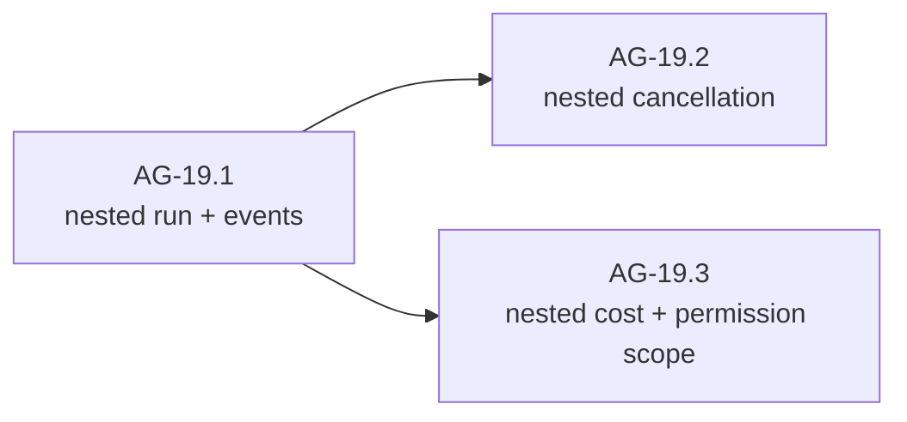

#### AG-19.1 — Nested run and events `[leaf]`

- **Test list:**
  1. WHEN a tool hosts a child harness running a scripted conversation THEN the parent's stream carries subagent-started, the child's events (each parent-identified per AG-04.1), and subagent-ended — and a consumer separates the two conversations by walking parents (invariant 2, end to end).
  2. Two sibling tools each hosting a child run concurrently interleave without cross-talk — the harness is re-entrant in fact, not just in documentation.
- **Depends on:** AG-13, AG-06.

#### AG-19.2 — Nested cancellation `[leaf]`

- **Test list:**
  1. WHEN the parent is interrupted mid-child THEN the child winds down first (its orphans synthesized, its run-end emitted) and then the parent's wind-down completes — the tree cancels leaf-first, and both transcripts close valid.
- **Depends on:** AG-19.1, AG-14.

#### AG-19.3 — Nested cost and permission scope `[leaf]`

- **Test list:**
  1. Child cost events aggregate into the parent's cumulative figures and remain separately attributable (by parent identity) — a frontend can show both "this subagent cost X" and "the run cost Y".
  2. Child permission requests pass through a derived scope: what the parent's policy allowed flows down, what it would ask about is asked on the **parent's** stream — one place a human watches, per G1's derived-scope clause.
- **Depends on:** AG-19.1, AG-16, AG-10.

### AG-20 — Complete the hook taxonomy

SDD change: `cachicamas-agent-hook-taxonomy` · Closes: **G11**. Four hook points, one discipline: observers never block the streaming path.

**Charter**

- **Goal:** The full taxonomy — pre-request (exists, AG-08), pre-compact, post-turn, session-start — with one registration surface and the asynchrony discipline enforced.
- **Deliverable:** The three remaining hook points; a uniform contract stating which hooks may mutate (pre-request, pre-compact) and which only observe (post-turn, session-start).
- **Acceptance:** Each hook fires at its documented moment with its documented payload; a deliberately slow observing hook delays no event delivery (proven with synchronization points); a mutating hook's failure is typed and attributed.
- **Depends on:** AG-08, AG-13, AG-18.
- **Out of scope:** Any concrete hook implementation (Layer 3 wires them).

#### AG-20.1 — The remaining hook points `[leaf]`

- **Test list:**
  1. Session-start fires once per harness before the first turn; post-turn fires after each turn with the turn's outcome and cost; pre-compact fires before the compaction call with the planned span and may adjust it within invariant-safe bounds (AG-18.2 revalidates).
  2. Hook ordering is documented and pinned: multiple hooks at one point run in registration order, deterministically.
- **Depends on:** AG-08, AG-13, AG-18.

#### AG-20.2 — Observer asynchrony `[leaf]`

- **Test list:**
  1. WHEN an observing hook blocks THEN token delivery and event delivery proceed unimpeded (invariant 3 as a mechanical test with a deliberately stalled observer); the stalled observer is eventually reported typed, not silently dropped — the contract states what "eventually" means.
- **Depends on:** AG-20.1.

---

## Wave G — Harden and hand off

### AG-21 — Harden concurrency, backpressure and leaks

SDD change: `cachicamas-agent-concurrency-hardening` · The AI-33/AI-34 of this layer, over the whole assembly.

**Charter**

- **Goal:** Prove the assembled harness clean under adversarial schedules: no goroutine leaks on any exit path, lossless ordered delivery under slow consumers, race-free under `-race` across every wave-C/D/E/F feature in combination.
- **Deliverable:** A hardening suite over combined scenarios (suspension + interrupt + steering + compaction in one run), leak checks via the AI-22 leak-detection mechanism.
- **Acceptance:** Full-package leak check passes; a slow consumer loses nothing and observes contract order; the combined-scenario matrix passes under `-race`; abandoned-consumer-who-cancels winds down within bounds.
- **Depends on:** AG-14, AG-15, AG-16, AG-18, AG-19, AG-20.
- **Out of scope:** Performance targets — correctness under pressure only.

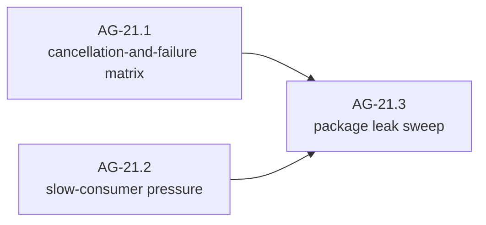

#### AG-21.1 — Cancellation-and-failure matrix `[leaf]`

- **Test list:**
  1. A matrix over {suspension pending, steering queued, compaction mid-run, child harness active} × {interrupt, shutdown, provider failure} completes every cell with valid history and contract-ordered events — the interactions no single-milestone test exercises.
- **Depends on:** AG-14 … AG-20.
- **Split if:** any state row proves more than a sitting — rows become children (AG-21.1.x), one per state, same signals.

#### AG-21.2 — Slow-consumer pressure `[leaf]`

- **Test list:**
  1. WHEN the event consumer stalls THEN the run makes exactly the progress the AG-01 backpressure decision permits and loses nothing — message and tool events arrive complete and ordered once the consumer resumes.
  2. Cancellation during the stall unblocks within bounds per contract, and the AG-01 sanctioned-loss rule (if any) is the only loss observed.
- **Depends on:** AG-14 … AG-20. **Parallel with:** AG-21.1.

#### AG-21.3 — Package leak sweep `[leaf]`

- **Test list:**
  1. The full-package goroutine-leak check (the AI-22 leak-detection mechanism, wholesale) passes over the entire suite including AG-21.1's and AG-21.2's cells; any detached-tool report from AG-14.3 is accounted, not leaked.
- **Depends on:** AG-21.1, AG-21.2.

### AG-22 — Add the observability boundary

SDD change: `cachicamas-agent-observability` · Governed by [ADR 0005 § D3](../../adr/0005-promote-agent-stack-to-own-module.md#d3--observability-boundary): API only, allowlist attributes, absolute content denylist.

**Charter**

- **Goal:** Spans for runs, turns, tool executions and compactions through the OTel **API** only, carrying a **decided Layer 2 attribute vocabulary** under § D3's discipline, and provably nothing from the denylist.
- **Deliverable:** The attribute-vocabulary decision — § D3 defines its allowlist **for Layer 1 spans only**, so Layer 2's must be decided and recorded as a § D3 extension before anything is recorded; then the instrumentation. The AG-03.2 guard already covers the API/SDK split.
- **Acceptance:** In-memory-tracer tests show run/turn/tool/compaction spans nested correctly with attributes from the decided vocabulary matching emitted events; a full-featured run records no prompt, completion, reasoning, tool argument/result text, header, or credential anywhere in telemetry (absence-asserted); with no tracer configured, behavior is identical and nothing panics.
- **Depends on:** AG-21.
- **Out of scope:** Exporters, SDK, dashboards — composition root.

#### AG-22.1 — The Layer 2 attribute vocabulary `[decision]`

- **Closing checklist:**
  1. Span names and attributes for run, turn, tool-execution and compaction spans are decided — following the OTel GenAI semantic conventions where they exist, inventing nothing gratuitous where they do not — and recorded as an extension of [ADR 0005 § D3](../../adr/0005-promote-agent-stack-to-own-module.md#d3--observability-boundary)'s table (§ D3 is the OTel dependency ADR; Layer 2 attributes join it on the record, not ad hoc). The § D3 denylist applies absolutely and is restated, not weakened.
  2. What is deliberately **not** recorded is stated: per-delta events, hook timings, permission argument content — each named with its reason.
- **Depends on:** AG-21.

#### AG-22.2 — Spans within the boundary `[leaf]`

- **Test list:**
  1. Run/turn/tool/compaction spans nest correctly (child spans under parents, delegation trees preserved) with attributes drawn only from the AG-22.1 vocabulary and values equal to the corresponding events'.
  2. The denylist proven by absence over a run that used tools, reasoning, permission and compaction; the no-tracer path is behaviorally identical (event-sequence equality).
- **Depends on:** AG-22.1.

### AG-23 — Publish the Layer 3 readiness contract

SDD change: `cachicamas-agent-layer3-handoff` · Layer 2's exit: the surface freezes here.

**Charter**

- **Goal:** Freeze the v1 surface `cachicamas_coding` may consume, prove it sufficient by consuming it, and hand Layer 3 the deterministic test substrate it will build sessions on.
- **Deliverable:** Package examples; a compatibility statement; a scripted-harness test kit (fake provider + scripted tools + scripted permission decisions, packaged); the consumer proof.
- **Acceptance:** An external-package test builds a harness from injected fakes, runs a multi-turn conversation with tool execution, a permission suspension resolved by script, an interrupt, a resumed prompt, and a second harness constructed over the first's transcript via seeded history (AG-12.1 item 4 — the surface session resume and next-run model switching stand on, frozen here) — drains and validates the full event stream — and compiles with zero vendor imports and zero I/O.
- **Depends on:** AG-21, AG-22.
- **Out of scope:** Implementing anything in Layer 3.

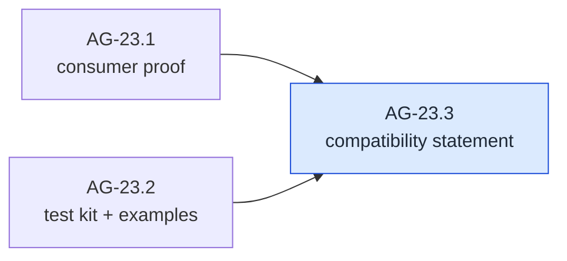

#### AG-23.1 — Consumer proof `[leaf]`

- **Test list:**
  1. The Layer-3-in-miniature test above passes, using only the public surface and the packaged fakes, with vendor-import absence proven by the guard mechanism — the AI-40 consumer-proof discipline, one layer up.
- **Depends on:** AG-21, AG-22.

#### AG-23.2 — Test kit and examples `[leaf]`

- **Test list:**
  1. The scripted-harness kit is importable by Layer 3's tests (external package, sibling to the Layer 1 kit conventions) and can script: provider turns, tool results, permission decisions, interrupts — deterministically, no wall clocks.
  2. Runnable package examples cover: building a harness, driving a run, consuming events, handling a suspension — compiling under the normal test run so documentation cannot rot.
- **Depends on:** AG-21.

#### AG-23.3 — Compatibility statement `[decision]`

- **Closing checklist:**
  1. The v1 surface is enumerated and frozen; experimental corners are marked; the statement names what Layer 3 may rely on, including every seam's injection point and its v1 default.
  2. The [Layer 2 completion checklist](#layer-2-completion-checklist) is walked item by item, each citing its closing node.
  3. The known-limitations register is stated: no subagent tool, failover declines, never-compact default, and the abandoned-consumer contract inherited from Layer 1 — each with its post-v1 path.
- **Depends on:** AG-23.1, AG-23.2.

---

## Layer 2 completion checklist

- [ ] The package exists at the ADR 0005 § D2 location with both boundary guards biting.
- [ ] Every event family of v2 § 4.3 — all eight — is constructible, validated, and guarded.
- [ ] All four envelope invariants hold by test: indexed deltas, explicit nesting, non-blocking observers, typed errors.
- [ ] One turn runs end to end against the fake provider with events in contract order.
- [ ] The pre-request hook can rebuild the outgoing request; the identity default changes nothing; unchanged inputs yield byte-identical prefix regions across turns.
- [ ] Tools execute with read-parallel/write-serial policy, bounded fan-out, and call-ordered rejoin.
- [ ] Permission is a suspension on the stream with all four outcomes; suspension blocks nothing else.
- [ ] Refusal, pause, and unknown finish reasons produce three distinct behaviors.
- [ ] The loop never retries and never decides policy; the guards and tests that prove it stay green.
- [ ] History cannot orphan a tool call; interruption synthesizes results; enforcement is at the boundary.
- [ ] A multi-turn run completes with steering, pause resumption, and a complete event story.
- [ ] Interrupt and shutdown are distinguishable end to end; wind-down is bounded.
- [ ] Partial-output failures are never silently retried; retry attempts are visible events.
- [ ] Every turn emits a cost event; cumulative figures include retries and compaction; estimates are labelled.
- [ ] The context strategy is consulted before every call; token counting is capability-discovered with a labelled fallback.
- [ ] Compaction protects recent turns, preserves the pairing invariant, is recorded on the stream, recovers from interruption, and is invocable on demand at a turn boundary.
- [ ] The harness is re-entrant: nested runs with nested cancellation, cost, and permission scope, parent-identified.
- [ ] All four hook points fire; observers cannot stall the stream.
- [ ] The package is race-clean and leak-free under the combined-scenario matrix.
- [ ] Telemetry stays inside the § D3 allowlist with the denylist proven by absence.
- [ ] The Layer 3 readiness contract is published with the consumer proof and the scripted-harness kit.

## Explicitly deferred until after Layer 2 v1

- A production **subagent tool** and delegation depth limits — the substrate is proven (AG-19); the tool is Layer 3/post-v1 work.
- **Failover** to another model — the seam exists (AG-15.3); the implementation re-opens token budgets and cache prefixes and needs its own design.
- **Compaction quality** work (what makes a good summary) — AG-18 proves mechanics; prompt engineering is iterative and Layer 3-configurable.
- **Permission rule persistence** across sessions — Layer 3's session owns it.
- **Cross-run cost aggregation** — Layer 3 and beyond (v2 § 8).
- Any **frontend**, any **persistence**, any **catalog** — Layer 3 (doc 0004).

## Traceability spine

### Findings, gaps and seams → closing nodes

| Concern | Closed by |
| --- | --- |
| **G1** — permission as a suspendable protocol (protocol half) | AG-06.1, AG-10.1 … AG-10.4; policy half → doc 0004 |
| **G3** — compaction | AG-06.4, AG-17.1/17.2, AG-18.1 … AG-18.4 |
| **G4** — Layer 2 half: prefix stability | AG-08.2; history append-only AG-12.1; concrete breakpoint placement → doc 0004 CO-24 |
| **G5** — parallel tools, call-ordered rejoin | AG-09.2, AG-09.3; ordinal from doc 0002 AI-30 |
| **G7** — subagents (structural half) | AG-06.3, AG-19.1 … AG-19.3; production tool deferred |
| **G8** — Layer 2 half: retry policy, failover seam | AG-15.1 … AG-15.3; loop-never-retries AG-11.2 |
| **G10** — Layer 2 half: cost events | AG-06.2, AG-16.1; pricing → doc 0004 |
| **G11** — hook taxonomy | AG-08.1, AG-20.1, AG-20.2 |
| Envelope invariant 1 (indexed deltas) | AG-04.3, AG-05.1 |
| Envelope invariant 2 (explicit nesting) | AG-04.1, AG-19.1 |
| Envelope invariant 3 (non-blocking observers) | AG-01.1, AG-20.2 |
| Envelope invariant 4 (typed errors) | AG-04.3, AG-11.2 |
| Seam 1 (pre-request hook) | AG-08.1 |
| Seam 2 (permission decision in the loop) | AG-10.1 |
| Seam 3 (sandbox as execution parameter) — L2 anchor | AG-09.1 item 2; semantics → doc 0004 |
| Seam 5 (context strategy) | AG-17.1 |
| Seam 6 (token counting, optional capability) | AG-17.2 |
| Seam 7 (retry classification consumed above) | AG-11.2, AG-15.1 |
| Seam 8 (failover) | AG-15.3 |
| Seam 12 (delegation re-entrancy) | AG-19.1 … AG-19.3 |
| Loop must-nevers (v2 § 4.1) — all six | persist / read filesystem-environment → AG-03.3; render + know-which-frontend → AG-03.2 (no rendering or frontend dependency is importable) plus the stream-only contract AG-04 pins; decide-whether-allowed → AG-10.1; decide-whether-to-retry → AG-11.2 |
| Harness must-never (v2 § 4.2) | AG-13.1 item 3 |
| v2 § 2.3 turn sequence, all six load-bearing steps | context check AG-17.1 · pre-request hook AG-08.1 · typed mid-stream path AG-11.2/AG-15.1 · permission suspension AG-10 · parallel + ordered rejoin AG-09 · cost event AG-16.1 |

### Method sources

Identical to [doc 0002's](./0002-cachicamas-ai-layer-1-task-graph.md#method-sources); this document adds nothing to the method and inherits all of it.
