# Layer 2 milestones and task graph — the `cachicamas_agent` portable agent runtime

> **Status (updated 2026-08-19):** Wave 0 complete, Wave 2 opens with AG-07…AG-11, Wave 3 complete (AG-12…AG-16), Wave 4 complete (AG-17…AG-18) — **18 of 24** milestones shipped. Wave 0 (AG-00 contract vocabulary, AG-01 event delivery, AG-02 v1 scope — all `[decision]` leaves) merged via PR #159 (`47813e6c`) on 2026-08-11. AG-03 (package scaffold and boundary guards) lands `backend/agent/src/agent/` — Layer 2's first code — with a machine-checked doc contract, a forward import guard over both closures, and a no-ambient-authority guard, all seven required bites recorded RED then GREEN; verified PASS WITH WARNINGS, 0 CRITICAL. AG-04 (event envelope and ordering invariants) lands Layer 2's first behavior — the event envelope, per-lane ordering, the run and turn lifecycle families, the stream-contract validator's two-level scope engine, the two invariant pins, and the every-kind-constructible guard — closing on its own recorded guard bites (S-AEV-082/083/090/092), the `L2C-04` doc-contract row, and the `S-AEV-102` documentation pin, all RED-first under strict TDD. Wave 1 complete (AG-05 event assembly, AG-06 codec family). Wave 2 progress (AG-07 walking skeleton, AG-08 hook seam, AG-09 tool scheduler, AG-10 permission protocol, AG-11 turn termination) — 5 of 7 wave-2 milestones shipped; AG-10 closes G1's protocol half (R-10) and v2 § 6 seam 2, and AG-11 closes R-08's typed mid-stream path — the loop now maps every normalized finish reason to a distinct typed turn outcome under an exhaustive dispatch, and reports a terminal provider failure upward as a typed value carrying category, retryability and the partial-output discriminator, without ever retrying. AG-12 (history and the pairing invariant) opens Wave 3 — it stands only on AG-03 and runs beside all of wave 2 — and closes R-07's boundary enforcement: the transcript store now rejects an orphaned call/result pairing at the boundary rather than at call sites, and synthesizes results for calls an interruption left orphaned before the next turn begins. AG-13 (the multi-turn run driver) is Wave 3's second milestone and closes R-08's driving loop while consuming R-09's upward path: a value-form `Harness` drives `Turn` repeatedly to a run's terminal decision, appending the user-side messages, bracketing the whole run with one run bracket over N turn brackets on one contiguous lane, queueing steering input at turn boundaries with zero drops, resuming a paused turn verbatim, and surviving a permission suspension that spans a turn through an externally woken parked call. AG-14 (the cancellation tree) is Wave 3's third milestone and closes R-08's typed mid-stream path for the cancellation case while consuming R-09's upward path a second way: two named signals — interrupt and shutdown — propagate down through the loop, the provider and tools as one context-cancellation cause, an interrupted run winds down (orphan synthesis, a clean turn close, an interrupted run-end carrying no failure) and leaves the harness ready for the next prompt, a shutdown winds down identically and then terminally refuses further prompts, the two signals stay distinguishable through both the run-end outcome and the error chain, and a documented per-call bound reports any tool that outlives it typed by tool name and call identity rather than letting it hold the run hostage. AG-15 (retry policy and the failover seam) is Wave 3's fourth milestone and closes R-15's Layer 2 half (G8): a pure, ordered-gate predicate decides whether a failed turn surfaces, retries, or has exhausted its budget on the failed turn's own typed evidence — a retryable failure with no emitted output retries visibly over a byte-identical transcript, one turn bracket per attempt on the run's own lane; a failure after emitted output is never silently retried, even when it reports itself retryable, closing the G8 sentence the charter opened; a non-retryable failure surfaces immediately regardless of delivery position; the backoff wait runs through an injected timing seam, a reported retry-after overrides the computed exponential-with-jitter delay, and an interrupt or shutdown fired during the wait aborts it and winds the run down like any other signal; the harness's own attempt bound composes with Layer 1's own retry budget into a documented worst-case ceiling whose two-layer wording divergence is enforced by a test, not a comment; the exhausted-retry report now preserves the failed turn's true category, retryability, retry-after and delivery evidence by wrapping the identical typed failure rather than reconstructing it; and the failover seam is a named, nil-safe injection point consulted exactly once at exhaustion, shipping one declining implementation proven behaviorally identical to no policy at all, with the fallback route itself deferred past v1 (AGS-D). AG-16 (cost and usage events) is Wave 3's fifth milestone and closes G10's Layer 2 half: every non-aborted turn now emits a per-turn cost figure carrying Layer 1's own per-figure presence — absence read as absence, never an invented zero — and the harness folds every emitted per-turn figure into a run-scoped cumulative, reporting a running estimate between continued turns and exactly one final figure immediately before every run close (success, failure and cancellation alike, retries counted by construction), so a run's real token spend is observable on every outcome with no new event kind and no field that could carry money. AG-17 (the context strategy seam and token accounting) is Wave 4's opening milestone and closes R-18's seams 5 and 6: a nil-default context-strategy seam on the caller-owned harness is consulted exactly once per logical turn at the run driver's turn boundary — never per retry attempt — carrying the coming transcript, Layer 3's stated budget and a type-level token accounting whose figure is unreadable without its provenance; the accounting is discovered by type-asserting the shipped Layer 1 counting contract and falls back to a documented byte-based estimate only on a genuinely absent capability, never on an advertised counter that declines to answer; the shipped default never compacts, unconstructibly so at the type level — installing it changes nothing observable — and compaction itself, together with any threshold arithmetic over the budget and the accounting, remains wholly AG-18's. AG-18 (implement compaction) closes Wave 4 and discharges **G3** (R-11), the verdict AG-17 explicitly did not: the seam's verdict type gains the one field AG-17 forecast, re-homing the never-compact guarantee from the type onto the zero value — the strongest form still available once the extension point opens; a summarization call on an injected provider, injected options and an injected instruction distinct from the run's own replaces the resolved prefix of a transcript with one typed summary entry through history's single validating commit primitive, at a boundary that is both turn-mark-aligned and pairing-closed, with the protected tail preserved value-identical in Layer 1 values and origins and its entries renumbered — ordinal identity stays stable only within a transcript generation, never across a compaction, with the turn identifier as the durable cross-generation handle; the compaction event family emits for the first time after twelve milestones constructible-but-unemitted, inside its own dedicated turn bracket, with the stream validator, every Layer 1 boundary and the whole compaction payload vocabulary byte-unchanged; atomicity is a property of ordering, not a mechanism — the commit is unreachable until the call succeeded and the replacement validated, so an interrupted compaction leaves the pre-compaction transcript intact with no journal and no rollback log, and the run's own cancellation wind-down is never entered from inside compaction; and an on-demand entry point invokes the identical operation, refusing typed whenever a run is in flight — reusing the harness's existing signal state rather than a new flag — and never queueing. Layer 2 code now exists and carries behavior; the seams named in [the v2 architecture reference § 4](../0001-cachicamas-agent-stack-v2.md#4-layer-2--the-portable-agent-runtime) are being built in as each milestone lands, per the entry-gate discipline below.
> **Entry gate:** [AI-40](./0002-cachicamas-ai-layer-1-task-graph.md#ai-40--publish-the-layer-2-readiness-contract) — **satisfied 2026-08-10**. See [the entry gate](#entry-gate--what-layer-2-waits-for) for the record of what it froze.
> **Architecture reference:** [cachicamas agent stack v2](../0001-cachicamas-agent-stack-v2.md) · **Decisions:** [ADR 0004](../../adr/0004-adopt-tau-3-layer-agentic-architecture.md) · [ADR 0005](../../adr/0005-promote-agent-stack-to-own-module.md) · [ADR 0006](../../adr/0006-resolve-skill-and-prompt-source-of-truth.md) · [ADR 0007](../../adr/0007-adopt-dag-convention-for-task-graphs.md) (DAG convention)
> **Sibling plans:** [Layer 1 task graph (doc 0002)](./0002-cachicamas-ai-layer-1-task-graph.md) — upstream, complete · [Layer 3 task graph (doc 0004)](./0004-cachicamas-coding-layer-3-task-graph.md) — downstream
> **Target package:** `backend/agent/src/agent/` (Layer 2 of module `github.com/cachicamas/backend/agent`, per [ADR 0005 § D2](../../adr/0005-promote-agent-stack-to-own-module.md#d2--location-mapping-v2)).
> **Date:** 2026-07-30 (v1) · restructured to v2 on 2026-08-11.
> **Milestone identifiers are append-only.** AG-NN ids follow the same rule as AI-NN ids in doc 0002: new work appends the next free number; logical insertion points are expressed with a `Blocks:` field, never by renumbering. Node identifiers (`AG-NN.p`, `AG-NN.p.q`) are equally append-only. Once the first milestone merges, edits to merged content become dated amendment blockquotes with struck-through text.

> [!NOTE]
> **Restructured 2026-08-11 — v1 → v2, on user request, before any milestone started.** The v1 revision is archived verbatim at [`archive/0003-cachicamas-agent-layer-2-task-graph-v1.md`](./archive/0003-cachicamas-agent-layer-2-task-graph-v1.md). The graph's identity is unchanged: the same 24 milestones (AG-00 … AG-23), the same 64 nodes, the same ids and milestone headings. What changed: (1) every `[leaf]`/`[guard]` behavior is now a Gherkin scenario; (2) waves are numbered 0–6 (previously lettered A–G — no external document linked a wave anchor); (3) every wave opens with its rendered DAG tree and the delivery table carries a gate column, per [ADR 0007](../../adr/0007-adopt-dag-convention-for-task-graphs.md); (4) the dependency-edge defects found in the 2026-08-11 pre-implementation audit are fixed — each fix is a row in [the inconsistency register](#sources-and-research) below; (5) the stale from-zero premise is corrected: Layer 1 has shipped, and this document now cites its real surface where that is stronger than citing a plan. The 2026-08-10 vocabulary amendment (*portable agent runtime*, never *the portable brain*) is folded into the body; its full rationale lives in the archived v1 and in [doc 0001's amendment](../0001-cachicamas-agent-stack-v2.md).

> [!IMPORTANT]
> **Authoring constraint.** This document states behaviors as Gherkin scenarios and what evidence closes each node. It never invents type names, field names, or signatures — each milestone's SDD cycle owns those. "The loop", "the harness", "the envelope" are concept names from the architecture reference, not type names. It is implementation-language-agnostic: tool bindings live only in [Method](#method--sdd-milestone-rules). Layer 1 is shipped code, so citations may point at contract documents, ADRs, **or the shipped Layer 1 surface** — but never at Layer 2 code, which does not exist yet.

---

## Outcome first

Walking every leaf of this graph to green, in dependency order, produces the portable agent runtime the architecture reference defines: a `backend/agent/src/agent/` package that turns a provider, a tool set, and a transcript into a complete agent conversation — streaming events, executing tools under an asked-not-assumed permission protocol, holding history that never orphans a tool call, surviving interruption, compacting its own context, and reporting every token it spends — while performing **no I/O of its own** and knowing nothing about frontends, sessions on disk, or skills.

Read that list twice for what is *absent* from it. The runtime never decides whether a tool may run, what a summary should say, which model is worth its price, or what belongs in a system prompt. It asks, suspends, and executes the answer it is given. Every verb above is mechanism, and that is the definition of the word *runtime* in this stack — the [§ 4 amendment](../0001-cachicamas-agent-stack-v2.md) records why the previous name was retired for implying otherwise.

Completion is measured the same way Layer 1's was: a readiness contract (AG-23) that **any** Layer 3 application can consume — `cachicamas_coding` ([doc 0004](./0004-cachicamas-coding-layer-3-task-graph.md)) being the first, not the only — proven by an external-package test that scripts an entire multi-turn agent run with fake provider, fake tools and scripted permission decisions, with zero vendor imports and zero real I/O. If that proof ever needs something only a *coding* agent would supply, the contract has leaked an application's assumptions into the runtime and the leak is the bug.

Every leaf is sized to be implemented test-first in one sitting, verifiable by one command, and explicit about what it does not do. When implementation disproves a leaf, [doc 0002's living-graph clause](./0002-cachicamas-ai-layer-1-task-graph.md#the-graph-is-alive--the-revert-and-record-clause) applies to this document verbatim: revert to green, record the discovery as graph structure, land the amendment in the resuming PR.

## Quick navigation

| Section | What it settles |
| --- | --- |
| [Sources and research](#sources-and-research) | Requirements inventory · research digest · inconsistency register |
| [Scope boundary](#scope-boundary) | What Layer 2 owns, must not own, and the four wording traps |
| [Method](#method--sdd-milestone-rules) | Node grammar citation, evidence gate, tool bindings, TDD cycle |
| [Entry gate](#entry-gate--what-layer-2-waits-for) | The AI-40 gate — satisfied — and what it froze |
| [Global dependency graph](#global-dependency-graph) | Wave-level DAG + [delivery sequence](#delivery-sequence) with gates |
| [Wave 0 — Decide](#wave-0--decide) | AG-00 · AG-01 · AG-02 |
| [Wave 1 — The event envelope](#wave-1--the-event-envelope) | AG-03 · AG-04 · AG-05 · AG-06 |
| [Wave 2 — The loop](#wave-2--the-loop) | AG-07 · AG-08 · AG-09 · AG-10 · AG-11 |
| [Wave 3 — The harness](#wave-3--the-harness) | AG-12 · AG-13 · AG-14 · AG-15 · AG-16 |
| [Wave 4 — Context](#wave-4--context) | AG-17 · AG-18 |
| [Wave 5 — Delegation and hooks](#wave-5--delegation-and-hooks) | AG-19 · AG-20 |
| [Wave 6 — Harden and hand off](#wave-6--harden-and-hand-off) | AG-21 · AG-22 · AG-23 |
| [Layer 2 completion checklist](#layer-2-completion-checklist) | The observable outcomes, each with its closing node |
| [Explicitly deferred](#explicitly-deferred-until-after-layer-2-v1) | Deferrals with their named seams |
| [Traceability spine](#traceability-spine) | Requirement → node, two-way |

## Sources and research

**Requirements inventory** (Phase 0). The source documents are the v2 architecture reference ([doc 0001](../0001-cachicamas-agent-stack-v2.md)), the ADRs it executes, and the Layer 1 handoff. Every requirement this plan closes, with a stable handle:

| Id | Requirement (cited) |
| --- | --- |
| R-01 | Layer 2 imports only Layer 1, the standard library, and the OTel **API**; never Layer 3, `cmd/`, sibling backend modules, the OTel SDK or exporters ([ADR 0005 § D1 row 2](../../adr/0005-promote-agent-stack-to-own-module.md#d1--dependency-rule-v2)). |
| R-02 | Layer 2 performs **no I/O of its own**: no environment reads, no filesystem, no direct network access — everything arrives injected (v2 § 4; [ADR 0004](../../adr/0004-adopt-tau-3-layer-agentic-architecture.md)). |
| R-03 | The package lives at `backend/agent/src/agent/` ([ADR 0005 § D2](../../adr/0005-promote-agent-stack-to-own-module.md#d2--location-mapping-v2)). |
| R-04 | An agent event envelope is the only contract between the runtime and everything above it; all eight event families of [v2 § 4.3](../0001-cachicamas-agent-stack-v2.md#43-the-agent-event-envelope) are constructible and validated. |
| R-05 | The four envelope invariants hold: indexed deltas, explicit nesting, non-blocking observers, typed errors ([v2 § 4.3](../0001-cachicamas-agent-stack-v2.md#43-the-agent-event-envelope)). |
| R-06 | The loop is stateless and honors its six must-nevers — never persists, never reads filesystem/environment, never renders, never knows which frontend, never decides permission, never retries ([v2 § 4.1](../0001-cachicamas-agent-stack-v2.md#4-layer-2--the-portable-agent-runtime)). |
| R-07 | The harness holds conversation state in memory, enforces the pairing invariant at the history boundary, and never persists ([v2 § 4.2](../0001-cachicamas-agent-stack-v2.md#4-layer-2--the-portable-agent-runtime)). |
| R-08 | One turn follows the six load-bearing steps of [v2 § 2.3](../0001-cachicamas-agent-stack-v2.md#23-turn-sequence): context check, pre-request hook, typed mid-stream failure path, permission suspension, parallel tools with ordered rejoin, cost event. |
| R-09 | Permission decisions, steering input and interrupts re-enter a live run through one decided upward path — the only upward arrow in [v2 § 2.2](../0001-cachicamas-agent-stack-v2.md#22-layer-view). |
| R-10 | **G1** — permission is an ask–suspend–resume protocol in the loop; policy content stays above ([v2 § 7](../0001-cachicamas-agent-stack-v2.md#7-forward-requirements-register)). |
| R-11 | **G3** — compaction: strategy-triggered and on-demand, invariant-preserving, recorded on the stream, interruption-safe (v2 § 5.2, § 7). |
| R-12 | **G4** (Layer 2 half) — the loop cannot churn the cached prefix: byte-stable tool/system regions, append-only message region (v2 § 3.2, § 7). |
| R-13 | **G5** — parallel tool execution with bounded fan-out and call-ordered rejoin (v2 § 7). |
| R-14 | **G7** (structural half) — the harness is re-entrant for delegation; **no subagent tool ships in v1** (v2 § 7, § 8). |
| R-15 | **G8** (Layer 2 half) — turn-level retry on typed evidence; failures after emitted output are never silently retried; failover is a named seam (v2 § 7). |
| R-16 | **G10** (Layer 2 half) — every turn emits a cost event, token-only; money is Layer 3 enrichment ([ADR 0005 § D4](../../adr/0005-promote-agent-stack-to-own-module.md#d4--v1-scope-for-cross-cutting-concerns)). |
| R-17 | **G11** — the four-hook taxonomy: pre-request, pre-compact, post-turn, session-start; observers never block the streaming path (v2 § 7). |
| R-18 | Seams 1, 2, 3, 5, 6, 7, 8 and 12 of [v2 § 6](../0001-cachicamas-agent-stack-v2.md#6-the-twelve-seams-that-must-exist-now) exist in v1, each with its default named. |
| R-19 | Telemetry crosses the boundary only through the OTel API with a decided attribute vocabulary; the [§ D3](../../adr/0005-promote-agent-stack-to-own-module.md#d3--observability-boundary) content denylist is absolute — § D3's allowlist covers Layer 1 spans only, so Layer 2's vocabulary is a recorded § D3 extension. |
| R-20 | Layer 2 starts only on the frozen Layer 1 surface (AI-40) and tests only on the shipped substrate: the AI-21 fake provider and AI-22 stream kit (`backend/agent/src/agenttest`) ([doc 0002](./0002-cachicamas-ai-layer-1-task-graph.md#ai-40--publish-the-layer-2-readiness-contract)). |
| R-21 | Layer 2 exits through a readiness contract any Layer 3 **application** can consume, proven by a generic consumer test — never by a coding-agent miniature ([doc 0001 amendment](../0001-cachicamas-agent-stack-v2.md); v2 § 4). |

**Research digest** (Phase 1). The v1 plan was authored on Layer 1's execution evidence (the 2026-07-30 review's C1–C4 lessons, cited on the nodes they shaped). This restructure did not re-run domain research — the design is fixed by doc 0001 and its ADRs — but re-verified the plan against the **shipped** repository, which v1 could not do. New findings, each with what it changed here:

| Finding | Source | What it changed here |
| --- | --- | --- |
| `backend/agent/src/ai`'s transitive import closure is free of direct network access in **both** the production and test closures — but the vendor subtree `src/ai/openaicompat/**` and `src/ai/internal/retry` do reach it. | Measured 2026-08-11: `go list -deps` and `go list -deps -test` over the shipped module. | AG-03.2's allowlist names the vendor subtree as denied-by-name; admitting the Layer 1 tree by prefix would silently admit the vendor adapter. |
| The AI-21 fake and AI-22 kit live in `backend/agent/src/agenttest` (+ `/sweep`, `/tracetest`) — siblings of `src/ai`, not inside it. Layer 1's own import guard runs over the **test closure** precisely because a `-deps`-only scan misses test imports. | `backend/agent/src/agenttest/`; `backend/agent/src/ai/import_boundary_test.go`. | AG-03.2 distinguishes the production closure from the test closure; v1's allowlist would have failed AG-07's very first test. |
| `backend/agent/src/handoff` is intentionally empty — its external-package test **is** the AI-40 consumer proof. Nothing imports it. | `backend/agent/src/handoff/doc.go`. | The AI-40 dependency stays a gate (a frozen surface), not an import; the allowlist does not include it. |
| Layer 1 closed 42/42 with the living-graph clause used 35 times; AI-40 froze the v1 surface. | [doc 0002](./0002-cachicamas-ai-layer-1-task-graph.md); merge `7326a813`. | The entry gate is recorded satisfied; the from-zero premise is retired. |

**Inconsistency register** (Phase 2). The 2026-08-11 pre-implementation audit of v1, every finding with its disposition. Reconciliations are applied in this document; none was picked silently.

| # | Conflict (both sides cited) | Disposition |
| --- | --- | --- |
| 1 | v1 AG-03.2 admitted "stdlib, `backend/agent/src/ai`, § D3 OTel API paths" and forbade direct network access by name. Too narrow: the test substrate (R-20) lives in `src/agenttest`, outside that list, and the guard mechanism it retargets scans the test closure — the first loop test would have failed the guard. Too broad: the `src/ai` prefix admits `src/ai/openaicompat/**`, the vendor adapter Layer 2 must never touch, which today is caught only by accident via its network dependency. | **Reconciled:** AG-03.2 now specifies both closures — production admits stdlib + the Layer 1 contract package + § D3 OTel API paths; the test closure additionally admits `src/agenttest` (+ subpackages); the vendor subtree is denied by name in both. |
| 2 | v1 AG-15 declared itself parallel with AG-16 while AG-16's charter depends on AG-15 ("retry-inclusive accounting cannot be tested before retries exist") — a milestone cannot be parallel with its own prerequisite. AG-16.1 additionally omitted the AG-15 edge its own scenario ("retries included") requires. | **Reconciled** in the dependency's favor (the global parallelism note already agreed): AG-15 is parallel with AG-14 only; AG-16 and AG-16.1 both carry the AG-15 edge. |
| 3 | v1's premise "No layer has shipped code — the stack restarts from zero … every citation points at a contract document, never at code" vs the repository: Layer 1 complete 42/42, AI-40 merged `7326a813`, `src/{ai,agenttest,handoff}` on disk. | **Reconciled:** status header and authoring constraint updated; the entry gate is recorded satisfied; citations may now point at the shipped Layer 1 surface. |
| 4 | Five edge fields used ellipsis ranges (e.g. "AG-14 … AG-20") vs [ADR 0007 D2 item 4](../../adr/0007-adopt-dag-convention-for-task-graphs.md#d2--the-machine-readable-contract): every edge is a bare node id; a range mechanically collapses to its endpoints, silently dropping the interior edges. | **Reconciled:** every edge field enumerates bare ids. Ranges survive only in derived summaries (the delivery table, where ADR 0007 expects a milestone range). |
| 5 | Charter-declared dependencies that no node carried: AG-07 (the test substrate, the envelope), AG-12 (the frozen Layer 1 surface), AG-16.1 (retry), AG-18 (the event families, the scope verdict), AG-19.1 (the scope verdict). The method requires charter and node graph to agree at every depth. | **Reconciled:** each gap closed on the node that consumes the dependency; each milestone's node-dependency union now equals its charter. |
| 6 | One-way `Blocks:` edges (AG-02 → AG-18, AG-04 → AG-07) and a one-way `Parallel with:` (AG-21.2). Legal under ADR 0007 — `Blocks:` is itself an edge — but drift-prone. | **Reconciled** with an explicit convention for this document: `Blocks:` is optional gating emphasis, never the edge list — the `Depends on:` fields alone are complete — but where a `Blocks:` field appears, every entry names a direct dependent, is mirrored by that dependent's `Depends on:`, and the field omits no direct dependent; `Parallel with:` is stated on both sides or neither. |
| 7 | [ADR 0007](../../adr/0007-adopt-dag-convention-for-task-graphs.md) names docs 0002–0004 its exemplars, and the v2 skill requires citing it — yet no exemplar cited it, and the ADR sat in **Proposed** while accumulating three amendments and being enforced as normative. | **Reconciled outside this file** (same change): this document now cites ADR 0007 in its references; the ADR's acceptance is proposed to the user in the delivering PR. Docs 0002/0004 remain pre-v2 exemplars per the ADR's own no-retroactive-restyle rule. |
| 8 | The v2 skill's Hard Rules state the Gherkin and per-wave-mermaid mandates unconditionally, while its Decision Gates exempt pre-Gherkin docs via `--profile v1` — an agent reading only the Hard Rules would restructure a merged exemplar unasked. | **Flagged and fixed in the skill** (same change): the exemption moves into the Hard Rule itself. This document is v2 either way, and validates under the v2 profile. |

## Scope boundary

Settled by ADR 0004 as amended by ADR 0005 — constraints, not questions for later milestones. Layer 2 (`backend/agent/src/agent/`) may import Layer 1, the Go standard library, and the OpenTelemetry **API** ([ADR 0005 § D1 row 2](../../adr/0005-promote-agent-stack-to-own-module.md#d1--dependency-rule-v2)). It must not import Layer 3, `cmd/`, any other backend module, the OTel SDK or any exporter. **Layer 2 performs no I/O of its own**: no environment reads, no filesystem, no direct network access — it calls the provider contract and the tool execution contract, and everything else arrives injected.

**Owns:** the agent event envelope — the only contract between it and everything above it; the stateless loop (one assistant turn: stream, schedule tools, collect, decide continue/stop); the pre-request hook seam; the tool execution contract and its scheduler (concurrency policy, bounded fan-out, call-ordered rejoin); the permission *protocol* (ask, suspend, resume — never the answer); the stateful harness (history with the pairing invariant, the multi-turn run, queued steering input, cancellation tree, retry policy, cost aggregation, the compaction trigger and its execution); re-entrancy for delegation; the hook taxonomy.

**Must not own:** permission *policy* (which calls are allowed — a Layer 3 port); tool implementations and sandbox semantics (Layer 3); skills, prompts, project instructions, system-prompt assembly (Layer 3); session persistence or any filesystem path (Layer 3); provider catalogs, model selection UI, credential handling (Layer 3); price tables and money — it reports tokens; Layer 3 prices them; rendering, frontends, slash commands (Layer 3); provider request translation or vendor anything (Layer 1).

**Wording traps**, recorded because each will resurface:

- **"The loop executes tools" is too broad.** The loop *schedules* execution against an injected execution contract and drives the permission protocol around it. What a tool does, whether it is allowed, and under what confinement it runs are all decided above; the loop owns ordering, concurrency, suspension, and the rejoin.
- **"The harness holds state" does not mean the harness persists state.** The harness holds the conversation *in memory* and exposes it for a Layer 3 session to persist. A harness that touches a file has crossed the boundary; the no-I/O guard (AG-03.3) exists to make that mechanical.
- **"The runtime" is this layer, never Go's `runtime` package.** The term names the loop-plus-harness assembly — the thing that *runs* an agent conversation. Nothing in `backend/agent` imports Go's `runtime`, and AG-03.2's allowlist would have to be widened deliberately for that to change, so the collision is a reading cost only. When a sentence needs the distinction, write "the agent runtime". No cognitive or biological metaphor names any Layer 2 concept — the retired *brain* framing is recorded in AG-00.1 so the reason survives the rename.
- **"Layer 3" in this document means the layer, not the coding agent.** Every out-of-scope line below that hands something to Layer 3 — policy content, pricing, persistence, prompt material, frontends — hands it to *whichever application is standing on the runtime*, which today is `cachicamas_coding` and tomorrow may not be. A test, a contract, or a milestone that only makes sense for a coding agent has put an application's assumption inside the runtime; that is a boundary violation with the same weight as an import violation, and AG-23's consumer proof is where it surfaces.

## Method — SDD milestone rules

The [node grammar](./0002-cachicamas-ai-layer-1-task-graph.md#node-grammar) (compound / behavior leaf / guard / decision / mechanical), [leaf anatomy](./0002-cachicamas-ai-layer-1-task-graph.md#leaf-anatomy), [split triggers](./0002-cachicamas-ai-layer-1-task-graph.md#split-triggers), [milestone charter convention](./0002-cachicamas-ai-layer-1-task-graph.md#milestone-charter), [walking-skeleton ordering](./0002-cachicamas-ai-layer-1-task-graph.md#ordering-inside-a-milestone), and [the living-graph clause](./0002-cachicamas-ai-layer-1-task-graph.md#the-graph-is-alive--the-revert-and-record-clause) are defined once, in doc 0002, and apply to this document verbatim — with one v2 delta: `[leaf]` and `[guard]` bodies here are Gherkin scenarios per the v2 skill (`.claude/skills/task-graph-milestone-doc/references/gherkin-authoring.md`), not free-form test lists. Everything in doc 0002's [rules for every future SDD milestone](./0002-cachicamas-ai-layer-1-task-graph.md#rules-for-every-future-sdd-milestone) — one behavior per milestone, tests travel with behavior, the 250/400-line review budget, no live-network tests, stable semantics before dependents, explicit statements of what remains unsupported — applies unchanged, with the import row restated for this layer by R-01.

Bindings for this project (each scenario names a role; this section binds the role to the tool, once):

- **Evidence gate:** one command closes a leaf — `make test` in `backend/agent/` (`go test -race -v ./...`), the same gate as Layer 1 because both layers live in the same module. "The race detector" in any scenario means this command's `-race`. Guard leaves additionally record the red run against their scratch violation. Per-node exceptions are named on the node.
- **The import guard** is Layer 1's `go list`-allowlist mechanism (`backend/agent/src/ai/import_boundary_test.go`), retargeted: deny-by-default, forbidden prefixes checked before the allowlist, run over **both** the production closure (`go list -deps`) and the test closure (`go list -deps -test`) — the test closure is scanned because a production-only scan misses test imports, the exact defect Layer 1's guard exists to prevent.
- **The no-ambient-authority guard** is an AST scan in the style doc 0002 establishes at AI-25.
- **The test substrate** is the AI-21 fake provider and AI-22 stream kit (`backend/agent/src/agenttest`, with `/sweep` and `/tracetest`). Layer 2 tests never use a real provider, a real tool, or wall-clock sleeps in assertions; tools in tests are scripted in-memory implementations of the AG-09 contract; all coordination is by synchronization point. A Layer 2 test that opens a socket or a file is a boundary violation regardless of what it proves.
- **TDD cycle per scenario:** RED (transcribed from the scenario) → implementation → GREEN → refactor (performance, clean code, Go idioms) → review. Test naming follows the module convention doc 0002 sets (`Test<Subject>_<Behavior>_<Expectation>`); scenario banners cite the leaf id (`// AG-07.1 — …`).
- **SDD:** each milestone is one SDD change under its declared slug (artifacts under `openspec/changes/<slug>/`); its leaves become the change's tasks.

## Entry gate — what Layer 2 waits for

**The normative gate was AI-40, and it is satisfied:** Layer 1 completed 42 of 42 milestones and [AI-40](./0002-cachicamas-ai-layer-1-task-graph.md#ai-40--publish-the-layer-2-readiness-contract) merged as `7326a813` on 2026-08-10, freezing the Layer 1 v1 surface. Every milestone in this document may start, in dependency order, beginning with AG-00.

The gate's structure is kept on the record because it explains edges that remain in the graph:

1. **AG-00 … AG-02 consume contract documents, not code.** They were priced to run before the freeze; that flexibility is now moot, but their dependency lines still cite the doc 0002 wave 2 contract surface (the carrier, the reasoning round-trip token, cache markers, per-request options, refusal/pause finish reasons, the Layer 1 envelope) because that is what they decide against.
2. **Every code-bearing milestone (AG-03 onward) depends on AI-40** — the frozen surface, not merely the merged code. If a Layer 1 amendment ever reopens that surface, the living-graph clause reopens the affected AG milestones with it.
3. **The fake provider (AI-21) and stream kit (AI-22) are the test substrate for AG-07 onward** — shipped in `backend/agent/src/agenttest`, named as explicit edges on the milestones that stand on them.

---

## Global dependency graph

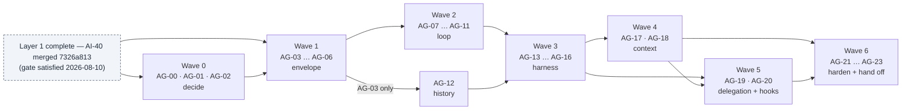

Parallelism worth exploiting: AG-05 ∥ AG-06 inside wave 1; AG-12 runs beside all of wave 2; AG-08 ∥ AG-09 after AG-07; AG-14 ∥ AG-15 after AG-13, with AG-16 following AG-15; AG-17 can start as soon as AG-13 closes (its other edges close earlier).

### Delivery sequence

| Wave | Milestones | Gate | Exit condition (the wave's value) |
| --- | --- | --- | --- |
| 0 — Decide | AG-00 … AG-02 | doc 0002 wave 2 contracts frozen — **satisfied** | Vocabulary, event delivery model, and v1 scope are unambiguous and recorded. |
| 1 — Envelope | AG-03 … AG-06 | AI-40 merged — **satisfied 2026-08-10** · AG-00 · AG-01 | Every event family the v2 reference names is constructible, validated, and guarded; the package exists with its boundary guards biting. |
| 2 — Loop | AG-07 … AG-11 | AG-04 · AG-05 · AG-06, plus the shipped AI-21/AI-22 substrate | One assistant turn runs end-to-end against the fake provider: streaming, hooks, scheduled tools, permission suspension, typed failure, termination. |
| 3 — Harness | AG-12 … AG-16 | AG-03 (for AG-12) · AG-06 · AG-10 · AG-11 (for the rest) | A multi-turn run completes with history integrity, steering, a working cancellation tree, retry policy, and cost events. |
| 4 — Context | AG-17 … AG-18 | AG-02 · AG-06 · AG-12 · AG-13 · AG-16 | The context strategy seam exists; compaction works, is recorded, and is recoverable. |
| 5 — Delegation + hooks | AG-19 … AG-20 | AG-02 · AG-06 · AG-08 · AG-10 · AG-13 · AG-14 · AG-16 · AG-18 | The harness is provably re-entrant with nested cancellation/cost/permission scope; the four-hook taxonomy is complete. |
| 6 — Harden + hand off | AG-21 … AG-23 | AG-14 · AG-15 · AG-16 · AG-18 · AG-19 · AG-20 | Race- and leak-clean under adversarial schedules; observability inside the § D3 boundary; Layer 3 readiness contract published and frozen. |

**First SDD to start: AG-00** (`cachicamas-agent-contract-vocabulary`) — unblocked now. First code-bearing SDD: AG-03.

---

## Wave 0 — Decide

Foundational wave: no code, three recorded decisions. Its value is that every later milestone cites a vocabulary entry, a delivery decision, or a scope verdict instead of re-litigating one — everything after it is cheap and safe.

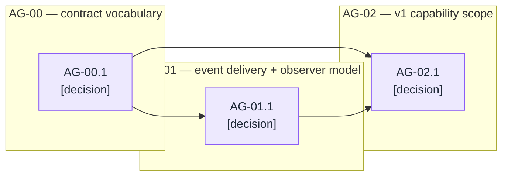

### AG-00 — Record the Layer 2 contract vocabulary

SDD change: `cachicamas-agent-contract-vocabulary` · Closes: R-20's start condition; the AI-01 of this layer: names before code.

**Charter**

- **Goal:** Fix the meaning of every term the later milestones use, so that no SDD re-litigates what a *run*, a *turn*, a *transcript entry*, a *tool call/result pair*, a *suspension*, or a *steering message* is.
- **Deliverable:** A recorded vocabulary artifact covering at minimum: **the runtime and its two parts** (the runtime *is* the loop plus the harness — not a third thing wrapping them, and not a synonym for either alone); run vs turn vs provider call (one run = many turns; one turn = one assistant response plus its tool results; one turn may span several provider calls only via retry); transcript and the pairing invariant; the loop/harness responsibility split in this repo's words (the v2 reference § 4.1–4.2 restated as testable statements); suspension and resumption; steering; delegation and the parent relationship; the cost event's token-only scope.
- **Acceptance:** Every later AG milestone's charter can cite a vocabulary entry instead of defining a term inline; conflicting uses in doc 0001/0002 are reconciled or flagged.
- **Depends on:** the doc 0002 wave 2 contract surface (frozen — the model and stream contracts shipped with Layer 1). · **Blocks:** AG-01, AG-02, AG-03 — and through them everything.
- **Out of scope:** Any decision with a design alternative (AG-01, AG-02 own those).

#### AG-00.1 — The vocabulary decision `[decision]`

- **Closing checklist:**
  1. Every term above has exactly one definition, phrased observably (a test could cite it), including the boundary cases: is a turn with zero tool calls still a turn (yes — the terminal one); is a compaction summary a transcript entry or metadata about entries; is a steering message part of the current turn or the next one.
  2. The vocabulary states which Layer 1 identities Layer 2 reuses as-is (message identity, tool-call identity, finish reasons, usage) and which it wraps (events — Layer 2's envelope is its own, carrying Layer 1 payloads).
  3. The loop's six must-nevers and the harness's one must-never (v2 § 4.1–4.2) are restated as vocabulary-level obligations that AG-03's guards and later scenarios cite.
  4. **The layer's own name is fixed here, with its two exclusions stated.** "The portable agent runtime" denotes the loop-plus-harness assembly; the artifact records (a) that no cognitive or biological metaphor is used for any Layer 2 concept — the retired *brain* framing is named so the reason survives the rename, not just the result — and (b) that "the runtime" never abbreviates Go's `runtime` package. It also fixes **"a Layer 3 application"** as the term for the runtime's consumer, so that no later milestone writes a contract, test name, or acceptance criterion in terms of a *coding* agent specifically. AG-23's consumer proof is the mechanical check on that; this item is what gives it a definition to check against.
- **Depends on:** — .

### AG-01 — Decide event delivery and the observer model

SDD change: `cachicamas-agent-event-delivery` · The G13 of this layer, decided before any event exists.

**Charter**

- **Goal:** Decide how agent events reach consumers — the carrier at the package boundary, the buffering/backpressure posture, who closes what, how observers attach without being able to stall token delivery (envelope invariant 3) — and how the **upward path** (permission decisions, steering input, interrupts) re-enters a live run (R-09).
- **Deliverable:** A recorded decision, no production code.
- **Acceptance:** The decision answers every question in the closing checklist and is closed before AG-04 starts.
- **Depends on:** AG-00. · **Blocks:** AG-02, AG-04.
- **Note — documented default: keep channels,** for symmetry with the Layer 1 carrier decision (AI-02) and for the same reasons: the select-on-cancellation send discipline closes the stranded-producer hazard, and one carrier idiom across the module is worth more than marginal ergonomics. The iterator-view ergonomics live in the test kit, as doc 0002's AI-22 provides.

#### AG-01.1 — The delivery decision `[decision]`

- **Closing checklist:**
  1. Carrier at the boundary (documented default: channels, matching AI-02), with the same caller-owns-the-context liveness rule as Layer 1.
  2. Backpressure posture: agent events are **lossless** — message and tool events must all arrive, in order; the decision states whether the harness's consumer-facing stream may apply the same single sanctioned loss path as Layer 1 (cancellation on a saturated channel) and no other.
  3. The observer model: how a second consumer (a session logger, a cost meter) attaches; the decision must make envelope invariant 3 structural — a slow observer must be unable to stall the streaming path, by decoupling mechanism, not by convention.
  4. Close/ownership rules: who closes the per-turn stream, who closes the per-run stream, and what a consumer may assume after a terminal event — mirroring Layer 1's exactly-one-terminal discipline at the agent level.
  5. **The upward path.** How a permission decision, a steering message, or an interrupt enters a live run — the only upward arrow in [v2 § 2.2](../0001-cachicamas-agent-stack-v2.md#22-layer-view) — is decided here: the surface a frontend calls, how a decision finds its suspended call, and what happens to an upward message addressed to a run that already ended (typed rejection, never a silent drop). AG-10 and AG-13 consume this decision; neither may invent its own channel.
- **Depends on:** AG-00.

### AG-02 — Decide the Layer 2 v1 capability scope

SDD change: `cachicamas-agent-v1-scope` · The AI-03 of this layer.

**Charter**

- **Goal:** Decide, once, which of the concerns the forward-requirements register assigns to Layer 2 are *implemented* in v1 and which are *seams with trivial implementations* — so no later milestone re-litigates scope.
- **Deliverable:** A recorded decision with one verdict per concern: G1 protocol (documented default: implement — it is unretrofittable), G3 compaction (default: implement, AG-18 — the trigger seam alone is not testable against nothing), G4's Layer 2 half — prefix stability (default: implement, AG-08.2 — Layer 1 made breakpoints expressible; a harness that churns the prefix silently forfeits the discount), G5 parallel tools (default: implement), G7 delegation (default: **prove re-entrancy, ship no subagent tool** — v2 § 8 makes subagents a v1 non-goal; the structural property is the part that cannot be added later), G8's Layer 2 half (default: retry in v1, failover as a named seam with a trivial "none" implementation), G10's Layer 2 half (default: implement cost events), G11 hooks (default: taxonomy complete, pre-request and post-turn live, pre-compact live with AG-18, session-start emitted for Layer 3's use).
- **Acceptance:** Every G-concern owned by L2 in [v2 § 7](../0001-cachicamas-agent-stack-v2.md#7-forward-requirements-register) has a verdict here; any verdict that diverges from a documented default rebuts it explicitly.
- **Depends on:** AG-00, AG-01. · **Blocks:** AG-17, AG-18, AG-19.
- **Out of scope:** Anything Layer 3 owns (sandbox semantics, permission policy content, pricing).

#### AG-02.1 — The scope decision `[decision]`

- **Closing checklist:**
  1. One verdict per register row owned by L2, each citing the register and stating implement-now / seam-with-trivial-impl / deferred, with the trivial implementation named where applicable.
  2. The verdicts are consistent with this document's graph: a concern verdicted "implement" has milestones below; a concern verdicted "seam" has a named seam-bearing node; a mismatch is a bug in one of them and is fixed before the decision closes.
- **Depends on:** AG-00, AG-01.

---

## Wave 1 — The event envelope

The package is born with its guards biting, and every event family exists — constructible and validated — before any producer does. Everything wave 2 emits is defined here.

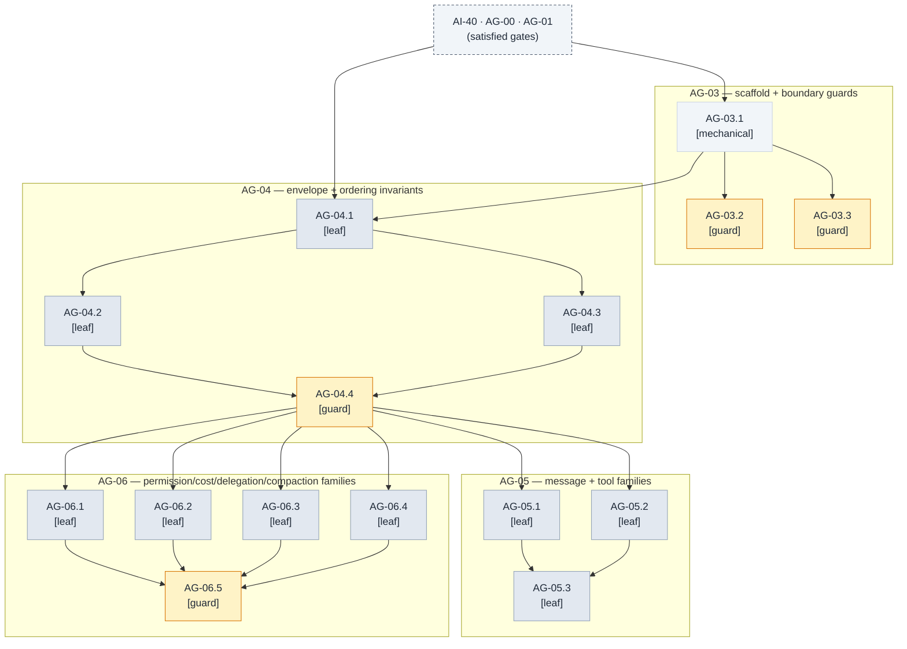

### AG-03 — Package scaffold and boundary guards

SDD change: `cachicamas-agent-package-scaffold` · Closes: R-01, R-02, R-03 mechanically · The AI-00 of this layer; the guards are the milestone.

**Charter**

- **Goal:** Create `backend/agent/src/agent/` with its import and I/O boundaries mechanically guarded from birth, so the no-I/O rule is never a matter of review vigilance.
- **Deliverable:** The package with a doc comment stating the layer contract; a forward import guard covering both the production and the test import closures; a no-ambient-authority guard; both proven to bite.
- **Acceptance:** `make test` green in `backend/agent/`; both guards recorded failing against scratch violations.
- **Depends on:** AI-40 (satisfied), AG-00. · **Blocks:** AG-04, AG-12 — and through them everything code-bearing.
- **Out of scope:** Any event, loop, or harness behavior.

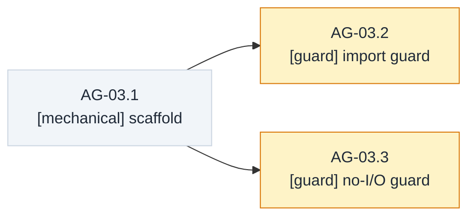

#### AG-03.1 — Scaffold `[mechanical]`

- **Check list:**
  1. `backend/agent/src/agent/` exists with a package doc comment stating the layer contract (imports row, no-I/O rule, event stream as the only upward contract); `make test` and `make lint` remain green in the module.
  2. The doc comment carries the doc-guard byte-suffix convention doc 0002's guards establish, so later milestones append guarded paragraphs the same way.
- **Depends on:** AI-40, AG-00.

#### AG-03.2 — Forward import guard `[guard]`

The import guard (see [Method](#method--sdd-milestone-rules)) retargeted at the Layer 2 package. Two closures, one deny-by-default posture:

- **Production closure admits only:** the standard library; the Layer 1 contract package `backend/agent/src/ai` and its transitive closure (measured free of direct network access, 2026-08-11); the [§ D3](../../adr/0005-promote-agent-stack-to-own-module.md#d3--observability-boundary)-permitted OTel API paths.
- **Test closure additionally admits:** the test substrate `backend/agent/src/agenttest` and its subpackages (`sweep`, `tracetest`). Nothing imports `src/handoff` — it is Layer 1's own consumer proof.
- **Denied by name, even where an allowlisted prefix would otherwise admit them:** the vendor adapter subtree `backend/agent/src/ai/openaicompat/…`; `src/coding`; `src/cmd`; both sibling backend modules; the OTel SDK, exporters, and `otelslog`; `net/http`.

- **Bite proof:**

```gherkin
Scenario: the guard bites on an application-layer import
  Given a scratch import of the application layer in the Layer 2 package
  When the import guard runs
  Then it fails naming the violating import path

Scenario: the guard bites on direct network access
  Given a scratch import of the standard HTTP client in the Layer 2 package
  When the import guard runs
  Then it fails naming the violating import path

Scenario: the vendor adapter is denied despite living under the Layer 1 tree
  Given a scratch import of the vendor adapter subtree in the Layer 2 package
  When the import guard runs
  Then it fails naming the violating import path
  And the recorded reason is the deny-by-name rule, not a network side effect

Scenario: the test substrate widens only the test closure
  Given a test file importing the test substrate and no production import of it
  When the import guard runs over the production closure and over the test closure
  Then the production closure passes without admitting the substrate
  And the test closure passes admitting it
```

- **Depends on:** AG-03.1.
- **Out of scope:** ambient authority (AG-03.3); the reverse direction (owned by Layer 1's and the hexagon's guards).

#### AG-03.3 — No-ambient-authority guard `[guard]`

The no-ambient-authority guard (see [Method](#method--sdd-milestone-rules)): the mechanical form of "Layer 2 performs no I/O of its own" and of the loop's must-nevers from AG-00.1 — no environment reads, no filesystem calls, no process spawns.

- **Bite proof:**

```gherkin
Scenario: the guard bites on an ambient environment read
  Given a scratch environment read in the Layer 2 package
  When the no-ambient-authority scan runs
  Then it fails naming the violation and its location
```

- **Depends on:** AG-03.1.

### AG-04 — Define the agent event envelope and ordering invariants

SDD change: `cachicamas-agent-event-envelope` · Closes: R-04 (lifecycle families), R-05 · The AI-14 of this layer, built with the 2026-07-30 review's scar tissue: every registered kind constructible from birth (the C4 lesson), sequence semantics per-stream from birth (the C3 lesson).

**Charter**

- **Goal:** Ship the envelope every agent event travels in — identity, kind, ordering — plus the run and turn lifecycle families, satisfying the four envelope invariants of [v2 § 4.3](../0001-cachicamas-agent-stack-v2.md#43-the-agent-event-envelope).
- **Deliverable:** The envelope with validation; run lifecycle events; turn lifecycle events; ordering invariants stated in the package documentation and pinned by test; and a **stream-contract validator** — the reusable checker these tests (and later the AG-23 kit) run over any event sequence. No producer exists until wave 2, so the invariants must be assertable over hand-built sequences, and the validator is the named surface that makes them so.
- **Acceptance:** An external-package test constructs, validates, and inspects every event kind this milestone registers; the membership test for what belongs on the stream — "if it is not on the stream, no frontend can render it and no log can reconstruct it" — is stated in the package docs as the criterion later families are judged by.
- **Depends on:** AG-01, AG-03. · **Blocks:** AG-05, AG-06, AG-07.
- **Out of scope:** Message/tool families (AG-05); the four new families (AG-06); delivery mechanics beyond what AG-01 decided.

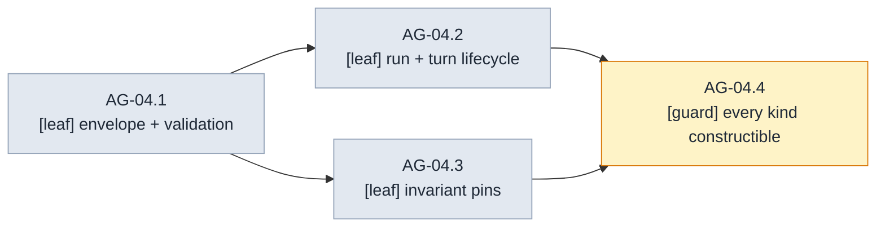

#### AG-04.1 — Envelope and validation `[leaf]`

- **Scenarios:**

```gherkin
Scenario: an event's kind derives from its payload
  Given an event constructed through the public surface
  When it is validated
  Then its kind matches its payload, a nil or mismatched payload fails validation
  And its identity fields — run, turn, parent — are readable from an external package

Scenario: ordering is per-consumer-stream and 1-based from birth
  Given two hand-built event streams stamped through the envelope's public ordering mechanism
  When both are checked by the stream-contract validator under the race detector
  Then each stream carries an independent, contiguous, 1-based ordering

Scenario: the parent identifier exists before delegation does
  Given the envelope surface, before any delegation mechanism exists
  When an event belonging to a delegated harness and an event belonging to no delegation are constructed
  Then the delegated event carries its parent identifier and the top-level event carries none — the field exists now because explicit nesting cannot be retrofitted; delegation fills it later
```

- **Depends on:** AG-01, AG-03.
- **Out of scope:** lifecycle semantics (AG-04.2); what any family means (its owning milestone).

#### AG-04.2 — Run and turn lifecycle `[leaf]`

- **Scenarios:**

```gherkin
Scenario: one run-start and one run-end bracket everything
  Given hand-built sequences where one run-start precedes all other events and one run-end follows them
  When the stream-contract validator checks them
  Then exactly those sequences are accepted and every violating permutation is rejected
  And the run-end carries the run's outcome: completed, interrupted, or failed

Scenario: turns nest strictly inside the run and never overlap
  Given hand-built sequences of turn-start and turn-end pairs for one harness
  When the validator checks them
  Then pairs inside the run bracket are accepted, overlapping turns are rejected
  And turn-end distinguishes "model finished" from "turn aborted" by typed outcome

Scenario: nothing follows the terminal
  Given a hand-built sequence with any event after run-end
  When the validator checks it
  Then it is rejected — the discipline every later producer is tested against
```

- **Depends on:** AG-04.1.

#### AG-04.3 — Invariant pins `[leaf]`

- **Scenarios:**

```gherkin
Scenario: deltas carry an index, never a snapshot (pin)
  Given the envelope's public construction surface
  When a delta kind is constructed
  Then no route exists to attach an accumulated-message payload to it

Scenario: failure payloads are typed values, not message strings (pin)
  Given a failure payload carried by the envelope
  When a consumer inspects it through the typed-failure surface
  Then category and cause are reachable as values, aligned with the Layer 1 failure taxonomy
  And no code path assigns meaning to a message string
```

- **Depends on:** AG-04.1.

#### AG-04.4 — Every kind constructible `[guard]`

The mechanical negation of Layer 1's C4 defect ("a kind two files declare mandatory cannot be constructed"): the guard iterates every registered event kind and constructs a valid instance of each through the public surface. It must keep failing forever when a kind is registered without a constructible payload.

- **Bite proof:**

```gherkin
Scenario: the guard bites on a kind without a constructible payload
  Given a scratch event kind registered with no constructible payload
  When the every-kind-constructible guard runs
  Then it fails naming the kind
```

- **Depends on:** AG-04.2, AG-04.3.

### AG-05 — Add message and tool execution event families

SDD change: `cachicamas-agent-message-tool-events` · Closes: R-04 (the two high-volume families).

**Charter**

- **Goal:** Ship the two high-volume families: message lifecycle (start, deltas, end — reasoning distinguished from text) and tool execution lifecycle (start, progress, end — typed failure distinguished from a result that reports failure).
- **Deliverable:** Both families, constructible and validated, with reconstruction proven.
- **Acceptance:** A consumer accumulating deltas reconstructs the message exactly; a tool event stream distinguishes the three end states (success, result-reports-failure, execution failed) by type, not by convention.
- **Depends on:** AG-04. **Parallel with:** AG-06.
- **Out of scope:** Producing these events from a live loop (AG-07, AG-09); permission events around tools (AG-06, AG-10).

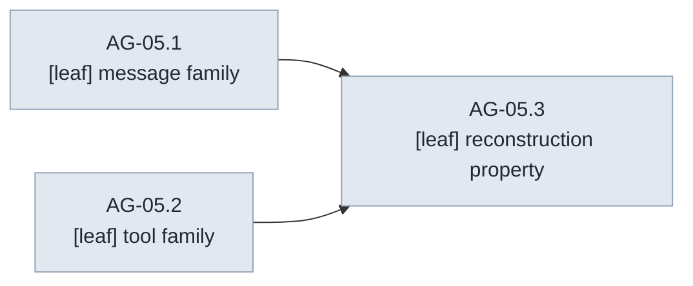

#### AG-05.1 — Message family `[leaf]`

- **Scenarios:**

```gherkin
Scenario: message events carry Layer 1 content identities
  Given message start, delta, and end events for one assistant message
  When a consumer inspects them
  Then the Layer 1 content identities are readable
  And reasoning deltas are distinguishable from text deltas at the event-kind level

Scenario: real delta payloads honor the index pin
  Given a fragmented message expressed as indexed deltas
  When the deltas are validated
  Then each carries its index per the invariant pinned upstream, and none carries a snapshot

Scenario: a whole message is indistinguishable from a fragmented one after reconstruction
  Given one message delivered whole as start-then-end and an equivalent message delivered as deltas
  When a consumer reconstructs both
  Then the reconstructions are equal
```

- **Depends on:** AG-04.
- **Out of scope:** tool events (AG-05.2); cross-family interleavings (AG-05.3).

#### AG-05.2 — Tool execution family `[leaf]`

- **Scenarios:**

```gherkin
Scenario: the start event carries what a frontend needs
  Given a tool start event for one call
  When a consumer inspects it
  Then it carries the call identity, the tool name, and the arguments — enough to render "running tool X with these arguments" live
  And progress events, when present, are indexed

Scenario: the three end states are distinct by type
  Given tool start, optional indexed progress, and end events for one call
  When a consumer inspects the end event
  Then success-with-result, the-tool-ran-but-its-result-reports-failure, and execution-itself-failed are three typed outcomes
  And no convention over payload contents is needed to tell them apart

Scenario: events carry the call ordinal
  Given tool events for several calls issued in one turn
  When completions arrive in any order
  Then each event's call ordinal correlates it to call order regardless of completion order
```

- **Depends on:** AG-04.
- **Out of scope:** scheduling and rejoin (AG-09); permission events (AG-06.1).

#### AG-05.3 — Reconstruction property `[leaf]`

- **Scenarios:**

```gherkin
Scenario: interleaved streams reconstruct independently and completely
  Given a scripted event sequence interleaving two messages' deltas and two tools' progress
  When a consumer reconstructs each message and each tool outcome
  Then every reconstruction is independent and complete — the property a session log will depend on, proven before any producer exists
```

- **Depends on:** AG-05.1, AG-05.2.

### AG-06 — Add permission, cost, delegation and compaction event families

SDD change: `cachicamas-agent-protocol-events` · Closes: R-04 — the four families [v2 § 4.3](../0001-cachicamas-agent-stack-v2.md#43-the-agent-event-envelope) marks **absent** from the v1 design: G1, G10, G7, G3's visible halves.

**Charter**

- **Goal:** Make the four missing families constructible and validated, before the mechanisms that emit them exist — so that AG-10, AG-16, AG-18 and AG-19 emit events rather than invent them.
- **Deliverable:** Permission family (decision required / decision made / resolution remembered); cost family (per-turn and cumulative, labelled estimate vs final); delegation family (subagent started / ended, parent-linked); compaction family (started / finished / failed / what was removed).
- **Acceptance:** Every payload constructible externally (AG-04.4's guard extends over them); each family's semantics documented against its G-finding.
- **Depends on:** AG-04. **Parallel with:** AG-05.
- **Out of scope:** Emission (AG-10, AG-16, AG-18, AG-19 respectively).
- **Note — one v2 conflict, reconciled here (the AG-00 reconcile-or-flag duty, executed):** [v2 § 4.3](../0001-cachicamas-agent-stack-v2.md#43-the-agent-event-envelope)'s cost-family row and the § 2.3 diagram show the harness reporting "tokens, cache hits and money", while [ADR 0005 § D4](../../adr/0005-promote-agent-stack-to-own-module.md#d4--v1-scope-for-cross-cutting-concerns) and v2 § 7 rule "L2 emits, L3 prices". The verdict wins: the Layer 2 payload is token-only, and money joins the stream as Layer 3 enrichment ([doc 0004 CO-18](./0004-cachicamas-coding-layer-3-task-graph.md#co-18--price-the-run)). The v2 family row reads as the stack's obligation, satisfied at the session stream.

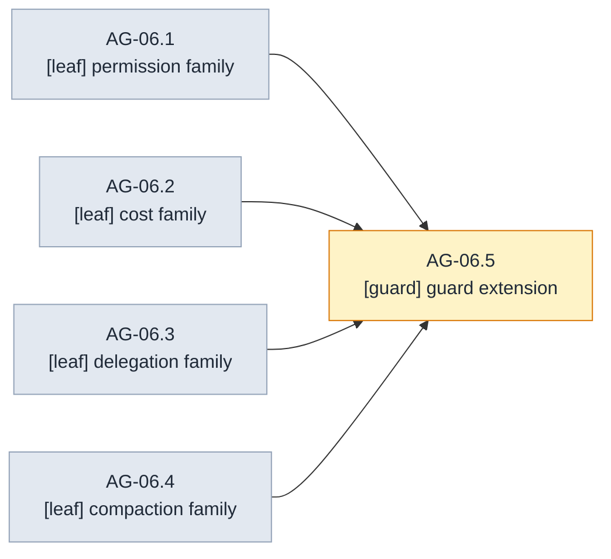

#### AG-06.1 — Permission family `[leaf]`

- **Scenarios:**

```gherkin
Scenario: a decision-required event carries everything a frontend needs to ask
  Given a decision-required event for one scheduled call
  When a consumer inspects it
  Then the call identity, tool name, and arguments are readable

Scenario: a decision-made event carries the full outcome vocabulary
  Given decision-made events for each outcome — allow once, allow always, deny, modify input
  When a consumer inspects them
  Then each outcome is a distinct typed value
  And the modify-input outcome carries the modified arguments

Scenario: resolution-remembered is distinct from decision-made
  Given a resolution-remembered event
  When a consumer inspects it
  Then it is a distinct kind — a fact about future calls the session log needs, or it cannot explain why later calls were never asked
```

- **Depends on:** AG-04.

#### AG-06.2 — Cost family `[leaf]`

- **Scenarios:**

```gherkin
Scenario: a cost event is token-only
  Given a cost event
  When a consumer inspects it
  Then per-turn and cumulative figures cover input, output, cache read, cache write, and reasoning tokens — mirroring Layer 1's usage fields
  And the payload has no field that could carry money

Scenario: every figure is labelled estimate or final
  Given cost events emitted before and after the stream's final usage update
  When a consumer inspects their labels
  Then any figure emitted before the final update is labelled estimate and the final figure is labelled final
```

- **Depends on:** AG-04.

#### AG-06.3 — Delegation family `[leaf]`

- **Scenarios:**

```gherkin
Scenario: delegation events make the tree walkable
  Given subagent-started and subagent-ended events for a delegated run
  When a consumer walks parent identifiers
  Then every event is attributable to its place in the delegation tree
```

- **Depends on:** AG-04.

#### AG-06.4 — Compaction family `[leaf]`

- **Scenarios:**

```gherkin
Scenario: compaction-finished says what was removed
  Given compaction-started and compaction-finished events
  When a consumer inspects the finished event
  Then it identifies the replaced span of transcript entries and the summary identity — enough for a session log to persist the operation

Scenario: interrupted compaction is visible
  Given a compaction-failed terminal event
  When a consumer inspects it
  Then it is distinct from compaction-finished — or recovery has nothing to reason from
```

- **Depends on:** AG-04.

#### AG-06.5 — Guard extension `[guard]`

- **Bite proof:**

```gherkin
Scenario: the constructibility guard still bites over the enlarged registry
  Given a fresh scratch violation against one of the four new kinds
  When the every-kind-constructible guard runs over the enlarged registry
  Then it fails naming the kind
```

- **Depends on:** AG-06.1, AG-06.2, AG-06.3, AG-06.4.

---

## Wave 2 — The loop

One assistant turn, end to end: the first time Layer 1 and Layer 2 meet, then the seams and contracts that widen it — hooks, scheduled tools, the permission protocol, typed termination.

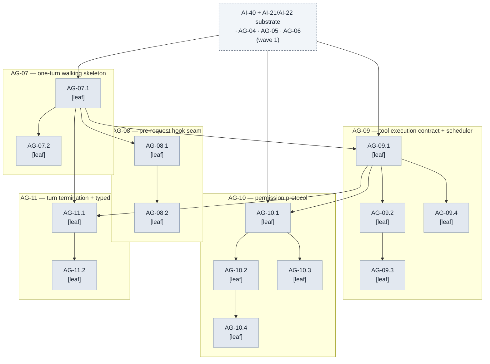

### AG-07 — Build the one-turn walking skeleton

SDD change: `cachicamas-agent-loop-skeleton` · Closes: R-06's stateless core · The single most important node in this document: the first time Layer 1 and Layer 2 meet.

**Charter**

- **Goal:** One assistant turn, end to end, smallest possible surface: given a system instruction, transcript, empty tool set and options, the loop calls the fake provider, re-emits normalized content as agent message events, and reports the turn complete.
- **Deliverable:** The stateless turn runner in its thinnest form.
- **Acceptance:** Given a text response scripted on the fake provider, When one turn runs, Then the consumer drains message start/deltas/end plus turn lifecycle events in contract order and observes turn completion with the finish reason surfaced — and two sequential turns on one loop value are independent.
- **Depends on:** AI-40, AI-21, AI-22, AG-04, AG-05. · **Blocks:** AG-08, AG-09, AG-11.
- **Out of scope:** Tools (AG-09), hooks (AG-08), errors beyond pass-through (AG-11), reasoning display policy (a frontend concern — reasoning events flow through like text with their own kind).

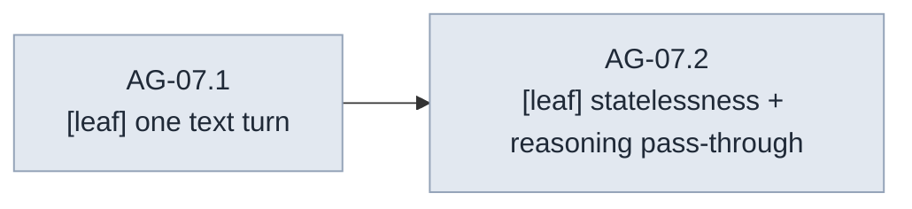

#### AG-07.1 — One text turn `[leaf]`

- **Scenarios:**

```gherkin
Scenario: walking skeleton — the thinnest end-to-end turn
  Given a text response scripted on the fake provider
  When the loop runs one turn
  Then the consumer observes turn start, message start, the deltas in order, message end, and turn end carrying the model's finish reason — and nothing else

Scenario: the provider stream is drained and the caller's context respected
  Given a turn in progress
  When the provider stream reaches its terminal
  Then the loop has drained it fully and passed the caller's context down, creating no context of its own beyond derivation

Scenario: one source of truth for the assistant message
  Given a completed turn
  When the caller reads the turn's assistant message and a consumer reconstructs it from the emitted deltas
  Then the two are equal, as Layer 1 message values
```

- **Depends on:** AI-40, AI-21, AI-22, AG-04, AG-05.
- **Out of scope:** anything beyond a single text-only turn.

#### AG-07.2 — Statelessness and reasoning pass-through `[leaf]`

- **Scenarios:**

```gherkin
Scenario: two sequential turns share nothing
  Given one loop value that has already run a turn
  When a second turn runs on it
  Then the second turn's events are independent of the first's — fresh ordering, no residue

Scenario: reasoning flows through distinguished, byte-exact
  Given a scripted response interleaving reasoning and text
  When the loop re-emits it
  Then reasoning and text are distinguished by kind
  And the reasoning round-trip token is preserved byte-exact into the assistant message
```

- **Depends on:** AG-07.1.

### AG-08 — Add the pre-request hook seam

SDD change: `cachicamas-agent-pre-request-hook` · Closes: R-12; seam 1 of [v2 § 6](../0001-cachicamas-agent-stack-v2.md#6-the-twelve-seams-that-must-exist-now): the only point where the outgoing request exists as data.

**Charter**

- **Goal:** Give the loop the hook that runs immediately before the provider call — the seam cache breakpoints, injected context and prompt trimming will stand on.
- **Deliverable:** The hook seam with an identity default, using Layer 1's copy-on-write rebuild (AI-12) as its mutation mechanism; the loop-side prefix-stability guarantee (**G4**'s Layer 2 half).
- **Acceptance:** A hook can observe and replace the outgoing request; the identity default changes nothing; hook failures are typed and abort the turn before I/O; identical inputs yield identical outgoing requests across turns.
- **Depends on:** AG-07. **Parallel with:** AG-09. · **Blocks:** AG-20.
- **Out of scope:** Any concrete hook (cache-breakpoint placement is Layer 3 wiring — doc 0004 CO-24); the other three hook points (AG-20).

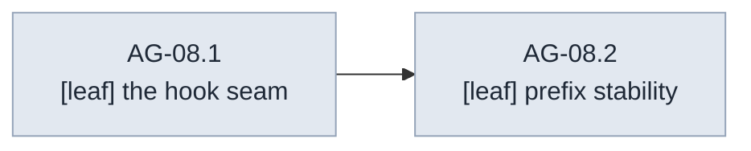

#### AG-08.1 — The hook seam `[leaf]`

- **Scenarios:**

```gherkin
Scenario: an installed hook sees and shapes the outgoing request
  Given a hook that adds a system segment
  When a turn runs
  Then the fake provider's captured request contains the segment — the hook received the fully-assembled request and its return value is what the provider received

Scenario: the identity default changes nothing
  Given no hook installed
  When a turn runs
  Then the captured request is byte-identical to the skeleton's

Scenario: a failing hook aborts before I/O
  Given a hook that fails
  When a turn runs
  Then the turn fails before any provider call with a typed error attributing the hook — never a half-mutated request sent anyway

Scenario: the hook cannot mutate the loop's input in place
  Given a mutating hook
  When a turn runs
  Then the loop's original request value is observably unchanged afterward — the copy-on-write rebuild property, consumed here
```

- **Depends on:** AG-07.

#### AG-08.2 — Prefix stability `[leaf]`

Closes **G4**'s Layer 2 half: Layer 1 made cache breakpoints expressible (AI-11); this leaf makes the loop incapable of churning the prefix they mark. A silent prefix break is a silent 10× input-cost regression (v2 § 3.2).

- **Scenarios:**

```gherkin
Scenario: unchanged inputs yield a byte-stable prefix across turns
  Given successive turns with unchanged system material, tools, and hook
  When the captured requests are compared over the tools → system → messages cascade
  Then the tool and system regions are byte-identical across turns
  And the message region grows strictly by append

Scenario: the hook is deterministic for identical inputs
  Given one hook invoked repeatedly with an identical request
  When its outputs are compared
  Then they are identical — hook-applied breakpoint markers cannot oscillate between turns and invalidate the prefix they exist to cache
```

- **Depends on:** AG-08.1.
- **Out of scope:** history append-only ordering (AG-12.1); the changed-tool-set visibility event (Layer 3's — doc 0004 CO-02); actual marker placement (doc 0004 CO-24).

### AG-09 — Define the tool execution contract and scheduler

SDD change: `cachicamas-agent-tool-scheduler` · Closes: **G5** (R-13); seams 2 and 3's Layer 2 anchor: the execution call carries a policy parameter it does not interpret.

**Charter**

- **Goal:** Define what a tool is to Layer 2 — an executable with a declaration, an effect class, and a typed failure mode — and schedule requested calls: reads parallel, writes and shell serialized, bounded fan-out, results rejoined in call order.
- **Deliverable:** The execution contract; the scheduler; tool execution events emitted per AG-05.2.
- **Acceptance:** Interleaved completions rejoin in call order; a failing tool yields a typed execution-failure result while its siblings complete; the execution call carries an opaque per-call policy slot Layer 2 never reads (the sandbox seam).
- **Depends on:** AG-05, AG-07. **Parallel with:** AG-08. · **Blocks:** AG-10, AG-11; doc 0004's built-in tools implement this contract.
- **Out of scope:** Permission (AG-10 wraps this); what any tool does; sandbox semantics (Layer 3 interprets the policy slot).

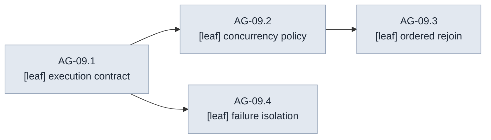

#### AG-09.1 — The execution contract `[leaf]`

- **Scenarios:**

```gherkin
Scenario: a tool satisfies the contract from outside
  Given an in-test scripted tool
  When it is inspected through the contract from an external package
  Then it exposes its Layer 1 declaration and an effect class — at minimum read, mutating, execute — that the scheduler consumes

Scenario: the policy slot passes through opaquely
  Given a caller injecting a per-call policy value
  When the scripted tool executes
  Then it observes the exact value injected — confinement is a property of the call site, and this is the call site

Scenario: result and execution failure are distinct outcomes
  Given one tool returning a result and one failing to execute
  When both outcomes are inspected
  Then they are distinct typed outcomes at the contract level, matching the event family's three-state distinction
```

- **Depends on:** AG-05, AG-07.

#### AG-09.2 — Concurrency policy `[leaf]`

- **Scenarios:**

```gherkin
Scenario: reads run concurrently, mutations serialize
  Given a turn requesting multiple read-class calls and multiple mutating or execute-class calls
  When the scheduler runs them under synchronization points
  Then the read-class calls run concurrently and the mutating and execute-class calls serialize among themselves in call order

Scenario: fan-out is bounded
  Given more read-class calls than the fan-out bound
  When the scheduler runs them
  Then no more than the bound run at once and all complete

Scenario: start events reflect true execution order
  Given scheduled calls starting at different times
  When their start events are observed
  Then each is emitted at execution start, not at rejoin — a frontend shows live progress in true order
```

- **Depends on:** AG-09.1.

#### AG-09.3 — Ordered rejoin `[leaf]`

- **Scenarios:**

```gherkin
Scenario: completions rejoin in call order
  Given scripted tools completing in deliberately inverted order
  When the scheduler rejoins their results
  Then the transcript receives results in call order — several providers reject positionally mismatched results

Scenario: correlation identities survive the rejoin
  Given calls whose identifiers include synthetic ones minted by an adapter
  When their results rejoin
  Then the Layer 1 call/result correlation identities are preserved exactly
```

- **Depends on:** AG-09.2.

#### AG-09.4 — Failure isolation `[leaf]`

- **Scenarios:**

```gherkin
Scenario: one bad tool does not abort the turn
  Given one call whose execution fails among healthy siblings
  When the turn runs
  Then the siblings complete, the failure enters the rejoin as a typed result in its call position — the model sees a failure result, the stream sees a typed failure event — and the turn continues

Scenario: a panicking tool is contained
  Given a scripted tool that panics
  When it executes under the race detector
  Then the panic is contained to that call and converted to the typed execution failure — a tool author's bug must not kill the loop
```

- **Depends on:** AG-09.1.

### AG-10 — Implement the permission protocol

SDD change: `cachicamas-agent-permission-protocol` · Closes: **G1**'s protocol half (R-10); seam 2: if approval is not a suspension in the loop, every frontend reimplements it out of band.

**Charter**

- **Goal:** Around every scheduled call: ask the injected policy; if the policy defers to a human, emit decision-required, **suspend that call without blocking anything else**, resume on the decision; emit decision-made and, when applicable, resolution-remembered.
- **Deliverable:** The ask–suspend–resume protocol in the loop's scheduling path, driving AG-06.1's events, against an injected policy contract.
- **Acceptance:** A suspended call blocks neither its siblings nor event delivery; all four outcomes work (allow once / allow always / deny / modify input); deny produces a denial result the model can see; modify-input executes with the modified arguments and the stream says so.
- **Depends on:** AG-06, AG-09. · **Blocks:** AG-13, AG-19 — a run must be resumable across a suspension, and delegation derives its scope from this protocol.
- **Out of scope:** Policy content (Layer 3 port — doc 0004); persistence of remembered rules (Layer 3 session); derived scope for subagents (AG-19.3).

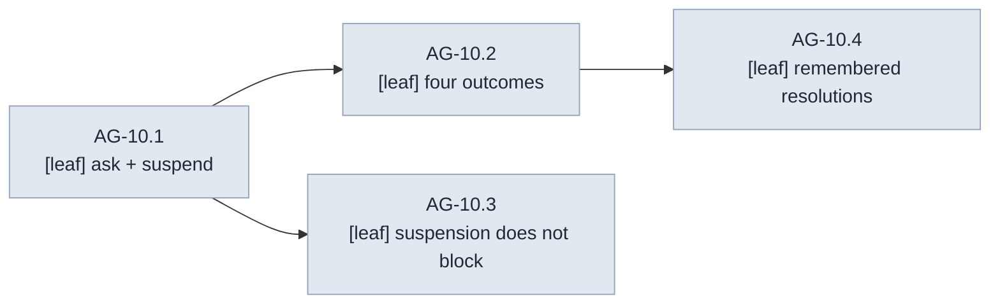

#### AG-10.1 — Ask and suspend `[leaf]`

- **Scenarios:**

```gherkin
Scenario: an immediate answer needs no event
  Given an injected policy answering immediately with allow or deny
  When a call is scheduled
  Then no decision-required event is emitted and execution proceeds or skips accordingly — the policy is asked before every call, and silence on the stream means nobody needed to be asked

Scenario: a deferring policy suspends the call
  Given an injected policy that defers to a human
  When a call is scheduled
  Then a decision-required event is emitted carrying the call identity, tool name, and arguments
  And that call parks until a decision arrives via the decided upward path — the loop implements that decision, it does not invent a channel

Scenario: a stray decision is a typed protocol error
  Given a decision addressed to an unknown or already-decided call identity
  When it arrives
  Then it is rejected as a typed protocol error, never a silent no-op
```

- **Depends on:** AG-06, AG-09.

#### AG-10.2 — Four outcomes `[leaf]`

- **Scenarios:**

```gherkin
Scenario: allow-once executes as scheduled
  Given a suspended call
  When the decision allow-once arrives
  Then the call executes exactly as scheduled

Scenario: deny is told to the model, in order
  Given a suspended call
  When the decision deny arrives
  Then execution is skipped and a typed denial result rejoins in call order — the transcript tells the model the call was denied

Scenario: modify-input runs the modified call and says so
  Given a suspended call
  When a modify-input decision arrives
  Then execution uses the modified arguments
  And the decision-made event carries both original and modified arguments so the session log can reconstruct what actually ran

Scenario: allow-always defers remembering to the policy
  Given a suspended call
  When the decision allow-always arrives
  Then the call executes and the resolution is reported remembered-eligible to the policy
  And resolution-remembered is emitted only when the policy says it was remembered
```

- **Depends on:** AG-10.1.

#### AG-10.3 — Suspension does not block `[leaf]`

- **Scenarios:**

```gherkin
Scenario: siblings and deltas flow past a suspension
  Given one call held suspended by synchronization points
  When sibling calls and in-flight message deltas proceed
  Then the siblings schedule, execute, and emit events, and the deltas keep flowing

Scenario: cancellation resolves a suspension typed
  Given a run cancelled while a call is suspended
  When the wind-down runs
  Then the suspension resolves as aborted with a typed outcome and no task waits forever for a decision that will never come
```

- **Depends on:** AG-10.1.

#### AG-10.4 — Remembered resolutions `[leaf]`

- **Scenarios:**

```gherkin
Scenario: a remembered resolution silences later identical calls
  Given a policy that reports a resolution remembered
  When subsequent identical calls occur in the same run
  Then they are not asked — the policy answers from memory
  And the stream shows the initial resolution-remembered event followed by unasked executions, the sequence a session log needs to explain why no further prompts appear
```

- **Depends on:** AG-10.2.
- **Out of scope:** cross-session memory of resolutions — Layer 3 persistence.

### AG-11 — Complete turn termination and typed failure reporting

SDD change: `cachicamas-agent-turn-termination` · Closes: R-08's typed mid-stream path · Where AI-13's three-way distinction and AI-19's taxonomy pay off.

**Charter**

- **Goal:** The loop decides turn completion correctly for every finish reason and reports every provider failure as a typed value upward — deciding nothing about retries.
- **Deliverable:** Termination handling over the full finish-reason vocabulary; typed failure propagation preserving the partial-output discriminator.
- **Acceptance:** Tool-calls finish → the turn continues into scheduling; end-turn → complete; refusal → complete-with-refusal (distinct outcome); pause → suspended-resumable outcome (distinct from refusal — the loop-termination bug AI-13 exists to prevent); provider terminal error → typed turn failure carrying category, retryability, and partial output; the loop never retries.
- **Depends on:** AG-07, AG-09. · **Blocks:** AG-13, AG-15.
- **Out of scope:** Acting on retryability (AG-15); acting on pause (the harness resumes; AG-13).

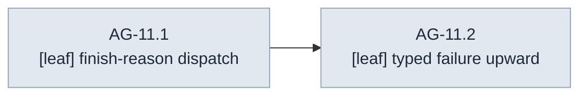

#### AG-11.1 — Finish-reason dispatch `[leaf]`

- **Scenarios:**

```gherkin
Scenario: every finish reason maps to a distinct typed outcome
  Given each normalized finish reason in turn
  When the loop dispatches on it
  Then each maps to a distinct typed turn outcome under an exhaustive dispatch
  And a future finish reason fails the build or the suite until the loop handles it — the exhaustiveness pin, extended here

Scenario: refusal and pause diverge
  Given one turn ending in refusal and one ending in pause
  When their outcomes are inspected
  Then refusal means the turn is over
  And pause means the turn expects resumption with received content replayed verbatim, visible as its own outcome
```

- **Depends on:** AG-07, AG-09.
- **Out of scope:** pairing enforcement for turns that fail mid-tool-calls — the typed failure path (AG-11.2) plus the history boundary and orphan synthesis (AG-12) own that jointly; this leaf owns only the dispatch.

#### AG-11.2 — Typed failure upward `[leaf]`

- **Scenarios:**

```gherkin
Scenario: a terminal provider error surfaces typed, with its partial output
  Given a provider stream scripted to end in a terminal error after partial content
  When the turn ends
  Then the turn outcome carries the Layer 1 failure taxonomy inspectable as typed values, including the partial-output discriminator and any partial assistant content
  And the event stream carries the corresponding typed failure event

Scenario: the loop never issues a second provider call
  Given any failing turn
  When the loop winds it down
  Then the fake provider's call count shows exactly one call — retry is the harness's decision, tested from the loop side
```

- **Depends on:** AG-11.1.

---

## Wave 3 — The harness

The stateful half of the runtime: history with the pairing invariant, the multi-turn run driver, cancellation, retry, and cost reporting. AG-12 stands only on AG-03 and runs beside all of wave 2.

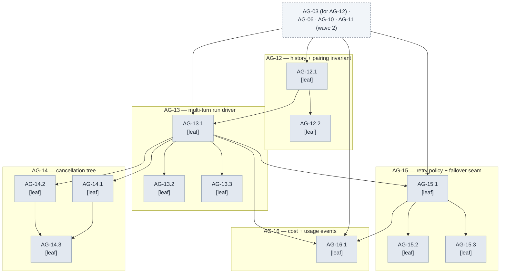

### AG-12 — Implement history and the pairing invariant

SDD change: `cachicamas-agent-history` · Closes: R-07's boundary enforcement · The invariant everything else leans on: **every tool call has a matching result, enforced at the history boundary.**

**Charter**

- **Goal:** The harness's transcript store: append-only within a run, validated at the boundary, with orphan synthesis for interruption.
- **Deliverable:** History with the pairing invariant; orphan-synthesis behavior; read access for the loop and (eventually) Layer 3 persistence.
- **Acceptance:** A transcript that would orphan a call cannot be committed; interruption synthesizes results for orphaned calls before the next turn; the enforcement lives at the boundary, not at call sites (v2 § 4.2's exact phrasing, as architecture).
- **Depends on:** AG-03, AI-40 — the frozen Layer 1 message contracts. · **Blocks:** AG-13, AG-17.
- **Note:** the whole milestone runs beside wave 2 — its only in-document edge is the scaffold; the wave-3 introduction and the global parallelism note record the concurrency.
- **Out of scope:** Persistence (Layer 3); compaction's interaction (AG-18.2 re-proves the invariant post-compaction).

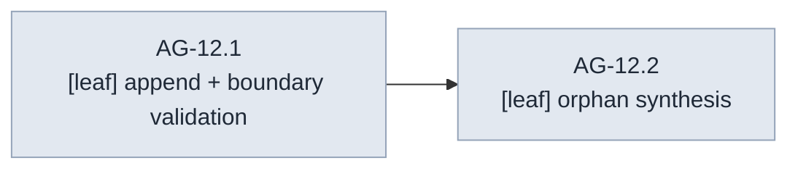

#### AG-12.1 — Append and boundary validation `[leaf]`

- **Scenarios:**

```gherkin
Scenario: appends keep order and orphans are rejected typed
  Given messages appended in conversation order
  When they are read back
  Then they return in order
  And appending a tool-result entry whose call identity has no prior call fails typed, as does committing a state where a call has no result once the turn closes

Scenario: the invariant has exactly one commit path
  Given every public route into history
  When a test constructs an orphaning sequence through any of them
  Then it is rejected — no privileged bypass for internal callers, the C1 lesson applied to history

Scenario: history exposes read-only views for loop and session
  Given a populated history
  When the loop reads the transcript and a future session reads entry identities
  Then the transcript arrives as Layer 1 values with stable entry identity, read-only

Scenario: seeded construction validates like appends do
  Given a pre-existing transcript, one valid and one with an unmatched pair
  When a history is constructed over each
  Then the valid seed is accepted and the invalid seed is rejected typed — the seam session resume and next-run model switching stand on, frozen at the handoff
```

- **Depends on:** AG-03, AI-40.

#### AG-12.2 — Orphan synthesis `[leaf]`

- **Scenarios:**

```gherkin
Scenario: interruption synthesizes results for orphaned calls
  Given a turn interrupted after calls were issued but before results arrived
  When synthesis runs before the next turn
  Then every orphaned pair is completed with a synthesized result typed as an interruption artifact, distinguishable from a real result

Scenario: synthesis is idempotent and total
  Given a transcript with N orphans
  When synthesis is applied twice
  Then it closes exactly N pairs on the first application and changes nothing on the second
```

- **Depends on:** AG-12.1.

### AG-13 — Drive the multi-turn run

SDD change: `cachicamas-agent-run-driver` · Closes: R-08's driving loop · The harness's core: turns until the model stops asking for tools.

**Charter**

- **Goal:** The harness runs the loop repeatedly — append user message, run turn, execute/append results (via the loop), repeat — until a terminal finish reason, emitting run lifecycle events, handling pause-resumption, and accepting queued steering input.
- **Deliverable:** The run driver over the loop, permission protocol, termination, and history; steering-message queueing.
- **Acceptance:** A scripted two-call-then-answer conversation completes with correct history and a correctly ordered event stream; a steering message queued mid-turn enters the transcript at the next turn boundary; pause resumes; the run survives a permission suspension spanning a turn.
- **Depends on:** AG-10, AG-11, AG-12. · **Blocks:** AG-14, AG-15, AG-16, AG-17, AG-19, AG-20.
- **Out of scope:** Retry/failover (AG-15); compaction check (AG-17 inserts it); cancellation details (AG-14).

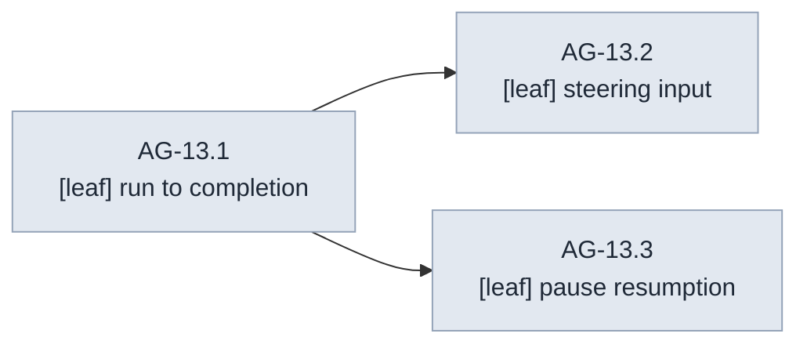

#### AG-13.1 — Run to completion `[leaf]`

- **Scenarios:**

```gherkin
Scenario: a two-turn conversation runs to its terminal
  Given the fake provider scripted with turn one requesting a tool call and turn two answering with final text
  When one prompt drives the run
  Then the consumer observes run start, turn one with tool execution and result append, turn two, and run end
  And history holds the full alternating transcript with every pair matched

Scenario: the event stream is the complete story
  Given a completed run
  When its event stream is replayed
  Then every message and tool outcome the history holds is reconstructable from it — the envelope's membership test, asserted at run scope

Scenario: the harness holds no privileged channel into the loop
  Given the harness driving turns
  When its use of the loop is compiled and exercised
  Then it goes through the same public one-turn surface the skeleton's external tests use
```

- **Depends on:** AG-10, AG-11, AG-12.

#### AG-13.2 — Steering input `[leaf]`

- **Scenarios:**

```gherkin
Scenario: a mid-turn user message queues to the boundary
  Given a run with a turn in flight
  When a user message arrives
  Then it queues, the current turn completes untouched, and the message enters history at the turn boundary before the next provider call — consecutive same-role entries are legal in the neutral transcript

Scenario: queued messages keep arrival order and are never dropped
  Given multiple messages queued during a run, including during the final turn
  When the run continues
  Then the messages enter in arrival order
  And a message queued during the final turn yields a new turn rather than a dropped message
```

- **Depends on:** AG-13.1.

#### AG-13.3 — Pause resumption `[leaf]`

- **Scenarios:**

```gherkin
Scenario: pause resumes with verbatim replay
  Given a turn ending in the pause finish reason
  When the harness resumes
  Then received content is replayed verbatim and the run continues to a real terminal
  And the pause is visible on the stream as its own turn outcome, not silently absorbed
```

- **Depends on:** AG-13.1.

### AG-14 — Build the cancellation tree

SDD change: `cachicamas-agent-cancellation-tree` · Interrupt ≠ shutdown, and both ≠ deadline.

**Charter**

- **Goal:** Two distinguishable signals — user interrupt (abort the turn, keep the session) and shutdown (flush and exit) — propagated down through loop, provider and tools, with bounded-time wind-down and history integrity after either.
- **Deliverable:** The cancellation tree over the run driver.
- **Acceptance:** Interrupt mid-turn: provider stream cancelled per the Layer 1 contract, running tools cancelled, orphans synthesized, run ends as interrupted, harness ready for the next prompt. Shutdown: same wind-down, then the harness refuses new prompts. Both distinguishable in run-end outcomes and error chains.
- **Depends on:** AG-13. **Parallel with:** AG-15, AG-16.
- **Out of scope:** Subagent inheritance (AG-19.2); frontend signal wiring (Layer 3).

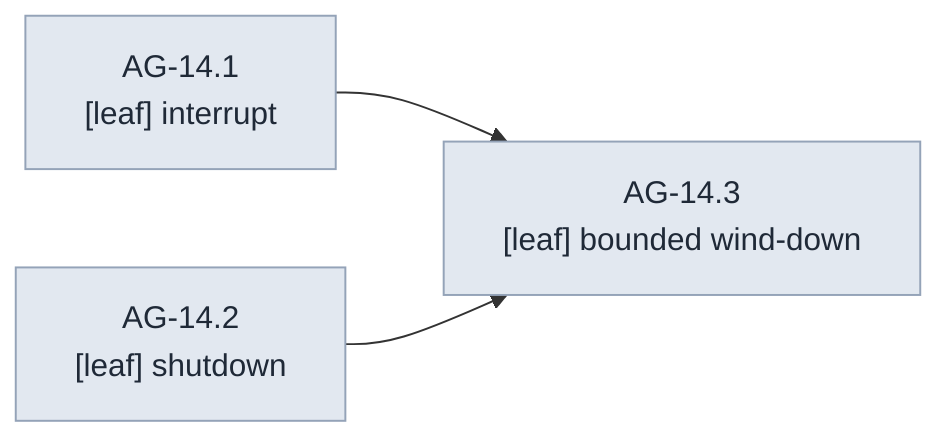

#### AG-14.1 — Interrupt `[leaf]`

- **Scenarios:**

```gherkin
Scenario: interrupt aborts the turn and keeps the session
  Given a run with a provider stream and tools in flight
  When interrupt fires
  Then the provider call is cancelled per the fake's cancellation-fidelity contract, in-flight tools observe cancellation, orphan synthesis runs, and the run ends with the interrupted outcome
  And a new prompt on the same harness works afterward

Scenario: interrupt during a suspension aborts it typed
  Given a run holding a permission suspension
  When interrupt fires
  Then the suspension aborts with a typed outcome and history closes cleanly

Scenario: interrupt is idempotent
  Given a run already winding down from an interrupt
  When a second interrupt fires
  Then nothing changes and nothing panics
```

- **Depends on:** AG-13.

#### AG-14.2 — Shutdown `[leaf]`

- **Scenarios:**

```gherkin
Scenario: shutdown winds down and then refuses new work
  Given a run in flight
  When shutdown fires
  Then wind-down proceeds as interrupt does and the run-end outcome says shutdown
  And subsequent prompts fail typed — the two signals stay distinguishable through every layer they cross
```

- **Depends on:** AG-13.

#### AG-14.3 — Bounded wind-down `[leaf]`

- **Scenarios:**

```gherkin
Scenario: a cancellation-deaf tool cannot hold the run hostage
  Given a scripted tool that ignores cancellation
  When the run winds down
  Then it still ends within the documented bound
  And the offending call is reported typed — which tool, still running — with its task detached and named, not silently abandoned
  And no task belonging to the harness itself remains after the wind-down — the later package-wide leak sweep depends on this report being precise
```

- **Depends on:** AG-14.1, AG-14.2.

### AG-15 — Implement retry policy and the failover seam

SDD change: `cachicamas-agent-retry-failover` · Closes: **G8**'s Layer 2 half (R-15); seam 7 consumed, seam 8 reserved.

**Charter**

- **Goal:** The harness decides what the loop refused to: whether to retry a failed turn. Policy consumes AI-19's typed evidence — category, retryability, partial-output discriminator, retry-after — and the failover seam exists with a trivial "none" implementation.
- **Deliverable:** Turn-level retry in the run driver; the failover seam.
- **Acceptance:** Pre-output retryable failures retry within bounds; **any failure after emitted output is surfaced, never silently retried** (the G8 sentence, now at the harness); terminal categories never retry; backoff waits on the context; the failover seam is a named injection point whose v1 implementation declines.
- **Depends on:** AG-11, AG-13. **Parallel with:** AG-14.
- **Out of scope:** Wire-level retry (Layer 1's AI-35 owns pre-stream mechanics); model failover implementation (post-v1: re-budgeting tokens and prices crosses into AG-17/Layer 3 territory, per seam 8's rationale).
- **Note — composed bounds:** Layer 1's wire-level attempts multiply under harness attempts. AG-15.2 states and tests the combined ceiling so the first rate-limit storm is not the first time anyone computes it.

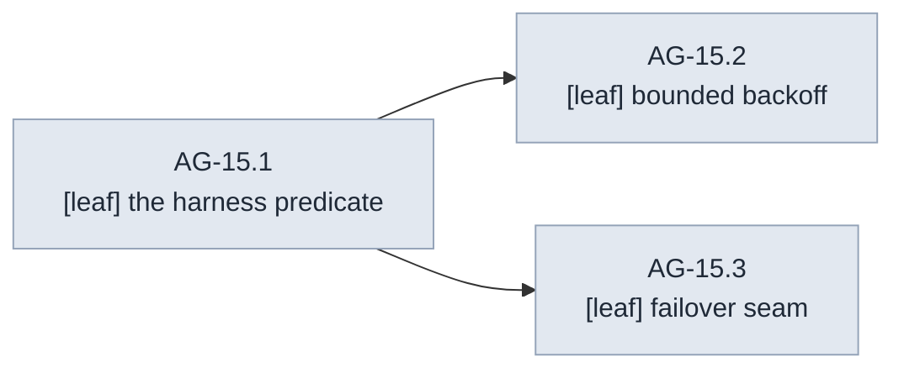

#### AG-15.1 — The harness predicate `[leaf]`

- **Scenarios:**

```gherkin
Scenario: retryable-with-no-output retries visibly
  Given a turn failing retryable before any output
  When the harness re-runs it up to the documented bound
  Then each attempt is a fresh provider call over an identical transcript
  And the stream shows each attempt distinctly — attempts are visible, not silent

Scenario: partial output forbids automatic retry
  Given a turn failing after partial output was emitted
  When the harness decides
  Then no automatic retry occurs, the typed failure surfaces on the stream with its partial content, and the run ends failed — the naive "retry if retryable" predicate is exactly what this scenario forbids

Scenario: non-retryable surfaces immediately
  Given a turn failing with a terminal category
  When the harness decides
  Then the failure surfaces immediately regardless of position
```

- **Depends on:** AG-11, AG-13.

#### AG-15.2 — Bounded backoff `[leaf]`

- **Scenarios:**

```gherkin
Scenario: retry-after wins and backoff waits on the context
  Given a retryable failure carrying a retry-after value
  When backoff runs with injected timing
  Then retry-after overrides computed backoff
  And an interrupt during backoff aborts it immediately

Scenario: the harness bound holds above any lower-layer retrying
  Given the fake provider scripted to fail pre-stream forever with Layer 1 retrying beneath
  When the harness exhausts its attempts
  Then the provider call count proves the harness's own bound held
  And the combined ceiling — harness attempts times wire-level attempts — is stated in the policy's documentation, where both layers' readers will find it
```

- **Depends on:** AG-15.1.

#### AG-15.3 — Failover seam `[leaf]`

- **Scenarios:**

```gherkin
Scenario: the retry path consults the failover seam before giving up
  Given the injected failover decision point
  When retries exhaust
  Then the seam is consulted, the v1 implementation declines, and its contract documents what a real implementation must handle — re-counting the context budget, restarting the cache prefix

Scenario: the none implementation changes nothing (pin)
  Given the v1 declining implementation
  When the same failures run with and without the seam installed
  Then observable behavior is identical — the seam's existence changes nothing
```

- **Depends on:** AG-15.1.

### AG-16 — Emit cost and usage events

SDD change: `cachicamas-agent-cost-events` · Closes: **G10**'s Layer 2 half (R-16). Layer 1 already counts; Layer 2 reports.

**Charter**

- **Goal:** Every turn ends with a cost event; the run maintains cumulative figures; estimates are labelled; delegated work aggregates into the parent (the aggregation half lands with AG-19).
- **Deliverable:** Cost emission in the run driver from Layer 1 usage.
- **Acceptance:** Per-turn events match the fake's scripted usage exactly, including cache and reasoning figures; cumulative equals the sum over turns including retries (a retried attempt's tokens are real spend and must be counted); absent usage yields an event that says absent rather than inventing zeros.
- **Depends on:** AG-06, AG-13, AG-15 — retry-inclusive accounting cannot be tested before retries exist. **Parallel with:** AG-14.
- **Out of scope:** Money (Layer 3 price table); mid-stream incremental cost display (a frontend may accumulate deltas itself; the estimate-labelled event at minimum covers it).
- **Note — two v2 conflicts, reconciled here (the AG-00 reconcile-or-flag duty, executed):** (1) The charter's "a retried attempt's tokens are real spend" (above, and AG-16.1 scenario 2) admits a reading that would require capturing a *failed* attempt's own spend — unbuildable, since `ai.Failure` carries no usage and Layer 1 is never edited. It is reconciled to the sum-over-emitted-events rule instead: cumulative is the sum over every cost event an attempt that reached a completion actually emitted, retry-inclusive by construction, with no failure-side capture needed. (2) AG-16.1 scenario 3's "usage arriving only on the final stream update" reads, taken literally, as a per-turn figure that could be labelled estimate — but Layer 1 folds every wire-chunk usage update into one terminal completion before Layer 2 ever sees it, so no earlier per-turn figure exists to label. It is reconciled to the run-scoped estimate/final axis this out-of-scope line already assigns: the estimate-labelled event is the run's own running total between turns, and the final event is the run's terminal total — never a per-turn figure.

#### AG-16.1 — Per-turn and cumulative cost `[leaf]`

- **Scenarios:**

```gherkin
Scenario: per-turn cost is exact and honest about absence
  Given scripted usage on each turn, one turn with usage absent
  When each turn completes
  Then its cost event carries the turn's five token figures labelled final, honoring absent-vs-zero — absence is reported as absence, never invented zeros

Scenario: cumulative counts every attempt
  Given a multi-turn run that included a retried attempt
  When the run completes
  Then cumulative equals the per-turn sum with the retried attempt's tokens included — a retried attempt's tokens are real spend

Scenario: late usage corrects an estimate
  Given usage arriving only on the final stream update
  When cost events are emitted
  Then any earlier figure was labelled estimate and the final event corrects it — the estimate/final protocol, driven by a real scripted sequence
```

- **Depends on:** AG-06, AG-13, AG-15.

---

## Wave 4 — Context

The runtime learns to manage its own window: a strategy seam consulted before every call, capability-discovered token accounting, and compaction that is invariant-safe, recorded, and interruption-proof.

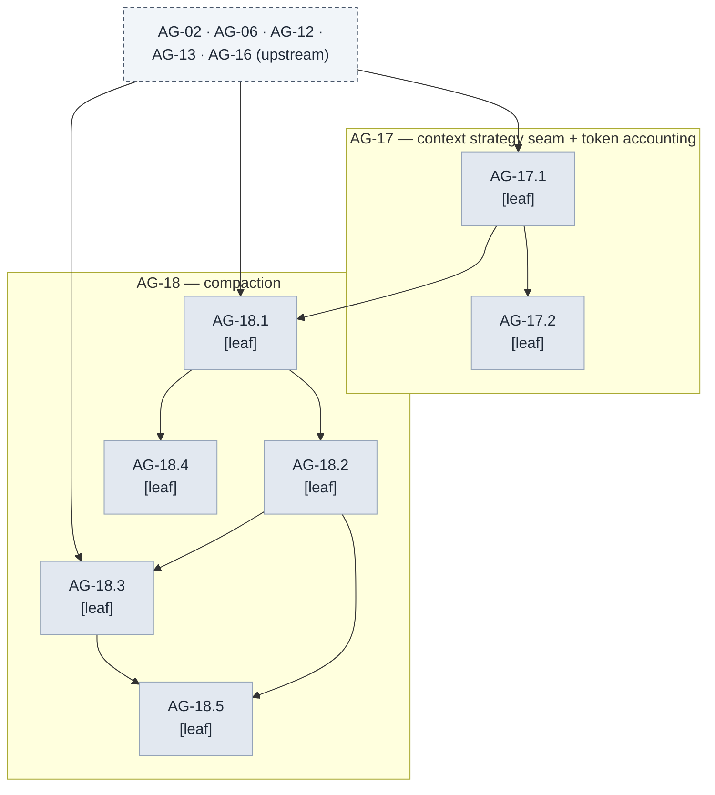

### AG-17 — Add the context strategy seam and token accounting

SDD change: `cachicamas-agent-context-strategy` · Closes: seams 5 and 6 (R-18): the check before every turn, and the optional counting capability.

**Charter**

- **Goal:** Before each provider call, the harness consults an injected context strategy with the transcript and the model's budget; the v1 default never compacts. Token accounting discovers the provider's optional counting capability by type assertion and falls back to a documented estimate.
- **Deliverable:** The strategy seam in the run driver; the accounting helper with capability discovery.
- **Acceptance:** The strategy is consulted before every provider call with both inputs (transcript, budget); the never-compact default changes nothing; with a counting-capable fake the accounting uses it, without one it estimates and says so.
- **Depends on:** AG-02, AG-12, AG-13. · **Blocks:** AG-18.
- **Out of scope:** Compaction itself (AG-18); budget configuration (Layer 3 supplies the model's budget via options).

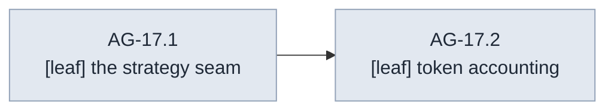

#### AG-17.1 — The strategy seam `[leaf]`

- **Scenarios:**

```gherkin
Scenario: the strategy is consulted before every call
  Given a recording strategy injected into a run of N turns
  When the run completes
  Then the strategy was consulted exactly N times, before each provider call, receiving the current transcript and budget

Scenario: the never-compact default changes nothing (pin)
  Given a run with the default strategy
  When it completes
  Then no compaction events were emitted and no history was mutated
```

- **Depends on:** AG-02, AG-12, AG-13.

#### AG-17.2 — Token accounting `[leaf]`

- **Scenarios:**

```gherkin
Scenario: counting capability is discovered and used
  Given a counting-capable fake provider and one without the capability
  When accounting runs against each
  Then the capable path uses the provider's counting and the other runs the estimate path with its figures labelled estimates — the two paths distinguishable to the strategy consuming them

Scenario: an estimate never masquerades as exact
  Given the estimate path
  When its figure is consumed
  Then the estimate is documented as an estimate with its method stated, and no code path treats it as exact — character-count compaction is wrong by enough to matter
```

- **Depends on:** AG-17.1.

### AG-18 — Implement compaction

SDD change: `cachicamas-agent-compaction` · Closes: **G3** (R-11). A model call with its own provider, cost, and cancellation — and the invariant-preserving transcript surgery around it.

**Charter**

- **Goal:** When the strategy says compact: summarize the compactable span via a model call, replace that span with the summary, protect recent turns, never orphan a pair, record everything on the stream, and survive interruption.
- **Deliverable:** Compaction as a strategy implementation plus the harness mechanics it needs; an **on-demand entry point** (the same mechanics invoked at a turn boundary — doc 0004's `/compact` stands on it); the summarization instruction arrives **injected** — Layer 2 owns no prompt content, so this milestone's tests script one.
- **Acceptance:** Post-compaction history validates under AG-12's invariant; recent turns configured protected are byte-identical; the compaction model call has its own provider/options/cost and cancels independently; compaction-started/finished events carry what AG-06.4 promised; an interrupted compaction leaves the pre-compaction transcript intact and usable.
- **Depends on:** AG-02, AG-06, AG-16, AG-17 — compaction spend is reported spend, and the scope verdict authorized the implementation.
- **Out of scope:** When to compact (the strategy's threshold is Layer 3 configuration); the summarization instruction's content (injected by Layer 3); persistence of the record (Layer 3 session).

```mermaid
flowchart LR
    M1["AG-18.1<br/>[leaf] the compaction call"] --> M2["AG-18.2<br/>[leaf] invariant-safe surgery"]
    M2 --> M3["AG-18.3<br/>[leaf] recorded on stream"]
    M1 --> M4["AG-18.4<br/>[leaf] interruption recovery"]
    M2 --> M5["AG-18.5<br/>[leaf] on-demand entry point"]
    M3 --> M5
    classDef leaf fill:#e2e8f0,stroke:#94a3b8,color:#1f2937
    class M1,M2,M3,M4,M5 leaf
```

#### AG-18.1 — The compaction call `[leaf]`

- **Scenarios:**

```gherkin
Scenario: compaction is its own model call with its own spend
  Given a compaction with its own injected provider and options, which may differ from the run's
  When it executes
  Then its usage reports into the run's cost as compaction spend
  And it cancels via the run's cancellation tree without killing the session

Scenario: the instruction is injected, never authored
  Given a scripted summarization instruction injected alongside provider and options
  When the compaction call runs
  Then the fake's captured request proves the injected instruction — and no content authored by the runtime — is what the call carried
```

- **Depends on:** AG-02, AG-16, AG-17.

#### AG-18.2 — Invariant-safe surgery `[leaf]`

- **Scenarios:**

```gherkin
Scenario: the replaced span never splits a pair
  Given a compactable span whose naive boundary would split a call/result pair
  When the span is replaced by its summary
  Then the boundary moved to include the whole pair, by construction
  And the resulting transcript passes the history boundary validation

Scenario: protected turns are untouched and the summary is typed
  Given recent turns configured protected
  When compaction completes
  Then the protected turns are byte-identical
  And the summary entry is typed as a compaction artifact, distinguishable from a model message
```

- **Depends on:** AG-18.1.

#### AG-18.3 — Recorded on stream `[leaf]`

- **Scenarios:**

```gherkin
Scenario: the stream records what compaction did
  Given a completed compaction
  When its started and finished events are inspected
  Then finished identifies the replaced span and the summary entry — sufficient for a session log to record the operation and for a resumed session to reconstruct exactly what the model now sees
```

- **Depends on:** AG-06, AG-18.2.

#### AG-18.4 — Interruption recovery `[leaf]`

- **Scenarios:**

```gherkin
Scenario: compaction is atomic-or-absent
  Given a compaction interrupted mid-call
  When the run continues
  Then the transcript is the pre-compaction transcript, a compaction-failed event was emitted, and the next turn proceeds against the uncompacted history — never half-applied
```

- **Depends on:** AG-18.1.

#### AG-18.5 — On-demand entry point `[leaf]`

- **Scenarios:**

```gherkin
Scenario: demanded and strategy-triggered compaction are one path
  Given equivalent transcripts, one compacted on demand at a turn boundary and one by strategy trigger
  When their event sequences are compared
  Then they are equal — one path observed two ways, under the same invariants

Scenario: mid-turn demands are refused typed
  Given a turn in flight
  When compaction is invoked on demand
  Then the request is refused typed — compaction happens only at turn boundaries, never queued silently, never racing the loop
```

- **Depends on:** AG-18.2, AG-18.3.

---

## Wave 5 — Delegation and hooks

The structural properties that cannot be retrofitted: a harness invocable from within a tool execution, and the complete hook taxonomy with observers that cannot stall the stream.

```mermaid
flowchart TB
    GATE["AG-02 · AG-06 · AG-08 · AG-10 ·<br/>AG-13 · AG-14 · AG-16 · AG-18 (upstream)"]
    subgraph AG19["AG-19 — re-entrancy + delegation readiness"]
        AG19_1["AG-19.1<br/>[leaf]"]
        AG19_2["AG-19.2<br/>[leaf]"]
        AG19_3["AG-19.3<br/>[leaf]"]
        AG19_1 --> AG19_2
        AG19_1 --> AG19_3
    end
    subgraph AG20["AG-20 — hook taxonomy"]
        AG20_1["AG-20.1<br/>[leaf]"]
        AG20_2["AG-20.2<br/>[leaf]"]
        AG20_1 --> AG20_2
    end
    GATE --> AG19_1
    GATE --> AG19_2
    GATE --> AG19_3
    GATE --> AG20_1

    classDef leaf fill:#e2e8f0,stroke:#94a3b8,color:#1f2937
    classDef gate fill:#f1f5f9,stroke:#475569,color:#1f2937,stroke-dasharray: 4 3
    class AG19_1,AG19_2,AG19_3,AG20_1,AG20_2 leaf
    class GATE gate
```

### AG-19 — Prove re-entrancy and delegation readiness

SDD change: `cachicamas-agent-delegation-readiness` · Closes: **G7**'s structural half (R-14); seam 12: re-entrancy cannot be added later. **No subagent tool ships in v1** (AG-02's default verdict; v2 § 8).

**Charter**

- **Goal:** Prove the harness is invocable from within a tool execution — nested run, nested cancellation, nested cost, parent-identified events, derived permission scope — using a test-only tool that hosts a child harness.
- **Deliverable:** The structural properties, proven; the delegation events (AG-06.3) emitted by the nesting path.
- **Acceptance:** A scripted parent run whose tool runs a child harness completes with: child events parent-identified and interleaved legally on the parent stream; parent interrupt cancelling the child; child cost aggregated into parent cumulative; child permission requests flowing through a scope derived from the parent's policy.
- **Depends on:** AG-02, AG-06, AG-10, AG-13, AG-14, AG-16.
- **Out of scope:** A production subagent tool, subagent configuration, and depth limits — post-v1, on this proven substrate.

```mermaid
flowchart LR
    N1["AG-19.1<br/>[leaf] nested run + events"] --> N2["AG-19.2<br/>[leaf] nested cancellation"]
    N1 --> N3["AG-19.3<br/>[leaf] nested cost + permission scope"]
    classDef leaf fill:#e2e8f0,stroke:#94a3b8,color:#1f2937
    class N1,N2,N3 leaf
```

#### AG-19.1 — Nested run and events `[leaf]`

- **Scenarios:**

```gherkin
Scenario: a child harness runs inside a tool, on the parent's stream
  Given a test-only tool hosting a child harness running a scripted conversation
  When the parent run completes
  Then the parent's stream carries subagent-started, the child's events each parent-identified, and subagent-ended
  And a consumer separates the two conversations by walking parents

Scenario: sibling children interleave without cross-talk
  Given two sibling tools each hosting a child run
  When both run concurrently
  Then their events interleave without cross-talk — the harness is re-entrant in fact, not just in documentation
```

- **Depends on:** AG-02, AG-06, AG-13.

#### AG-19.2 — Nested cancellation `[leaf]`

- **Scenarios:**

```gherkin
Scenario: the tree cancels leaf-first
  Given a parent run with an active child harness
  When the parent is interrupted
  Then the child winds down first — its orphans synthesized, its run-end emitted — and then the parent's wind-down completes, with both transcripts closing valid
```

- **Depends on:** AG-14, AG-19.1.

#### AG-19.3 — Nested cost and permission scope `[leaf]`

- **Scenarios:**

```gherkin
Scenario: child cost aggregates and stays attributable
  Given a child run spending tokens
  When the parent's cost events are inspected
  Then child cost aggregates into the parent's cumulative figures and remains separately attributable by parent identity — a frontend can show both "this subagent cost X" and "the run cost Y"

Scenario: child permission flows through a derived scope to one place
  Given a child whose calls need permission
  When the child's policy scope is derived from the parent's
  Then what the parent's policy allowed flows down
  And what it would ask about is asked on the parent's stream — one place a human watches
```

- **Depends on:** AG-10, AG-16, AG-19.1.

### AG-20 — Complete the hook taxonomy

SDD change: `cachicamas-agent-hook-taxonomy` · Closes: **G11** (R-17). Four hook points, one discipline: observers never block the streaming path.

**Charter**

- **Goal:** The full taxonomy — pre-request (exists, AG-08), pre-compact, post-turn, session-start — with one registration surface and the asynchrony discipline enforced.
- **Deliverable:** The three remaining hook points; a uniform contract stating which hooks may mutate (pre-request, pre-compact) and which only observe (post-turn, session-start).
- **Acceptance:** Each hook fires at its documented moment with its documented payload; a deliberately slow observing hook delays no event delivery (proven with synchronization points); a mutating hook's failure is typed and attributed.
- **Depends on:** AG-08, AG-13, AG-18.
- **Out of scope:** Any concrete hook implementation (Layer 3 wires them).

```mermaid
flowchart LR
    R1N["AG-20.1<br/>[leaf] the remaining hook points"] --> R2N["AG-20.2<br/>[leaf] observer asynchrony"]
    classDef leaf fill:#e2e8f0,stroke:#94a3b8,color:#1f2937
    class R1N,R2N leaf
```

#### AG-20.1 — The remaining hook points `[leaf]`

- **Scenarios:**

```gherkin
Scenario: each hook fires at its documented moment
  Given hooks registered at session-start, post-turn, and pre-compact
  When a run with a compaction executes
  Then session-start fires once per harness before the first turn, post-turn fires after each turn with the turn's outcome and cost, and pre-compact fires before the compaction call with the planned span

Scenario: pre-compact adjustments stay invariant-safe
  Given a pre-compact hook that adjusts the planned span
  When compaction proceeds
  Then the adjusted span is revalidated by the invariant-safe surgery before use

Scenario: hook ordering is deterministic (pin)
  Given multiple hooks registered at one point
  When that point fires
  Then the hooks run in registration order, deterministically
```

- **Depends on:** AG-08, AG-13, AG-18.

#### AG-20.2 — Observer asynchrony `[leaf]`

- **Scenarios:**

```gherkin
Scenario: a stalled observer cannot stall the stream
  Given a deliberately stalled observing hook held by synchronization points
  When token and event delivery proceed
  Then delivery is unimpeded — envelope invariant 3 as a mechanical test
  And the stalled observer is eventually reported typed, with the contract stating what "eventually" means
```

- **Depends on:** AG-20.1.

---

## Wave 6 — Harden and hand off

Correctness under pressure, telemetry inside the boundary, and the frozen surface a Layer 3 application builds on. The layer exits here.

```mermaid
flowchart TB
    GATE["AG-14 · AG-15 · AG-16 · AG-18 ·<br/>AG-19 · AG-20 (upstream)"]
    subgraph AG21["AG-21 — concurrency, backpressure, leaks"]
        AG21_1["AG-21.1<br/>[leaf]"]
        AG21_2["AG-21.2<br/>[leaf]"]
        AG21_3["AG-21.3<br/>[leaf]"]
        AG21_1 --> AG21_3
        AG21_2 --> AG21_3
    end
    subgraph AG22["AG-22 — observability boundary"]
        AG22_1["AG-22.1<br/>[decision]"]
        AG22_2["AG-22.2<br/>[leaf]"]
        AG22_1 --> AG22_2
    end
    subgraph AG23["AG-23 — Layer 3 readiness contract"]
        AG23_1["AG-23.1<br/>[leaf]"]
        AG23_2["AG-23.2<br/>[leaf]"]
        AG23_3["AG-23.3<br/>[decision]"]
        AG23_1 --> AG23_3
        AG23_2 --> AG23_3
    end
    GATE --> AG21_1
    GATE --> AG21_2
    AG21_3 --> AG22_1
    AG21_3 --> AG23_1
    AG21_3 --> AG23_2
    AG22_2 --> AG23_1

    classDef leaf fill:#e2e8f0,stroke:#94a3b8,color:#1f2937
    classDef decision fill:#ede9fe,stroke:#8b5cf6,color:#1f2937
    classDef gate fill:#f1f5f9,stroke:#475569,color:#1f2937,stroke-dasharray: 4 3
    class AG21_1,AG21_2,AG21_3,AG22_2,AG23_1,AG23_2 leaf
    class AG22_1,AG23_3 decision
    class GATE gate
```

### AG-21 — Harden concurrency, backpressure and leaks

SDD change: `cachicamas-agent-concurrency-hardening` · The AI-33/AI-34 of this layer, over the whole assembly.

**Charter**

- **Goal:** Prove the assembled harness clean under adversarial schedules: no goroutine leaks on any exit path, lossless ordered delivery under slow consumers, race-free across every feature of waves 2–5 in combination.
- **Deliverable:** A hardening suite over combined scenarios (suspension + interrupt + steering + compaction in one run), leak checks via the AI-22 leak-detection mechanism.
- **Acceptance:** Full-package leak check passes; a slow consumer loses nothing and observes contract order; the combined-scenario matrix passes under the race detector; an abandoned consumer who cancels winds down within bounds.
- **Depends on:** AG-14, AG-15, AG-16, AG-18, AG-19, AG-20.
- **Out of scope:** Performance targets — correctness under pressure only.

```mermaid
flowchart LR
    P1["AG-21.1<br/>[leaf] cancellation-and-failure matrix"] --> P3["AG-21.3<br/>[leaf] package leak sweep"]
    P2["AG-21.2<br/>[leaf] slow-consumer pressure"] --> P3
    classDef leaf fill:#e2e8f0,stroke:#94a3b8,color:#1f2937
    class P1,P2,P3 leaf
```

#### AG-21.1 — Cancellation-and-failure matrix `[leaf]`

- **Scenarios:**

```gherkin
Scenario Outline: every combined state survives every signal
  Given a run holding <state>
  When <signal> fires
  Then the run completes its wind-down with valid history and contract-ordered events — the interactions no single-milestone test exercises

  Examples:
    | state                  | signal           |
    | a suspension pending   | interrupt        |
    | a suspension pending   | shutdown         |
    | a suspension pending   | provider failure |
    | steering queued        | interrupt        |
    | steering queued        | shutdown         |
    | steering queued        | provider failure |
    | compaction mid-run     | interrupt        |
    | compaction mid-run     | shutdown         |
    | compaction mid-run     | provider failure |
    | a child harness active | interrupt        |
    | a child harness active | shutdown         |
    | a child harness active | provider failure |
```

- **Depends on:** AG-14, AG-15, AG-16, AG-18, AG-19, AG-20. **Parallel with:** AG-21.2.
- **Split if:** any state row proves more than a sitting — rows become children (AG-21.1.x), one per state, same signals.

#### AG-21.2 — Slow-consumer pressure `[leaf]`

- **Scenarios:**

```gherkin
Scenario: a stalled consumer loses nothing
  Given the event consumer stalled by synchronization points
  When the run makes exactly the progress the delivery decision permits
  Then message and tool events arrive complete and ordered once the consumer resumes — and the sanctioned loss path, if the decision granted one, is the only loss observed

Scenario: cancellation unblocks a stalled stream within bounds
  Given a consumer stall in progress
  When cancellation fires
  Then the run unblocks and winds down within the documented bound
```

- **Depends on:** AG-14, AG-15, AG-16, AG-18, AG-19, AG-20. **Parallel with:** AG-21.1.

#### AG-21.3 — Package leak sweep `[leaf]`

- **Scenarios:**

```gherkin
Scenario: the whole package leaks nothing
  Given the full suite including the matrix and pressure cells
  When the package-wide goroutine-leak check runs — the AI-22 leak-detection mechanism, wholesale
  Then it passes, with any detached-tool report from the bounded wind-down accounted, not leaked
```

- **Depends on:** AG-21.1, AG-21.2.

### AG-22 — Add the observability boundary

SDD change: `cachicamas-agent-observability` · Closes: R-19 · Governed by [ADR 0005 § D3](../../adr/0005-promote-agent-stack-to-own-module.md#d3--observability-boundary): API only, allowlist attributes, absolute content denylist.

**Charter**

- **Goal:** Spans for runs, turns, tool executions and compactions through the OTel **API** only, carrying a **decided Layer 2 attribute vocabulary** under § D3's discipline, and provably nothing from the denylist.
- **Deliverable:** The attribute-vocabulary decision — § D3 defines its allowlist **for Layer 1 spans only**, so Layer 2's must be decided and recorded as a § D3 extension before anything is recorded; then the instrumentation. The AG-03.2 guard already covers the API/SDK split.
- **Acceptance:** In-memory-tracer tests show run/turn/tool/compaction spans nested correctly with attributes from the decided vocabulary matching emitted events; a full-featured run records no prompt, completion, reasoning, tool argument/result text, header, or credential anywhere in telemetry (absence-asserted); with no tracer configured, behavior is identical and nothing panics.
- **Depends on:** AG-21.
- **Out of scope:** Exporters, SDK, dashboards — composition root.

```mermaid
flowchart LR
    S1["AG-22.1<br/>[decision] the attribute vocabulary"] --> S2["AG-22.2<br/>[leaf] spans within the boundary"]
    classDef leaf fill:#e2e8f0,stroke:#94a3b8,color:#1f2937
    classDef decision fill:#ede9fe,stroke:#8b5cf6,color:#1f2937
    class S2 leaf
    class S1 decision
```

#### AG-22.1 — The Layer 2 attribute vocabulary `[decision]`

- **Closing checklist:**
  1. Span names and attributes for run, turn, tool-execution and compaction spans are decided — following the OTel GenAI semantic conventions where they exist, inventing nothing gratuitous where they do not — and recorded as an extension of [ADR 0005 § D3](../../adr/0005-promote-agent-stack-to-own-module.md#d3--observability-boundary)'s table (§ D3 is the OTel dependency ADR; Layer 2 attributes join it on the record, not ad hoc). The § D3 denylist applies absolutely and is restated, not weakened.
  2. What is deliberately **not** recorded is stated: per-delta events, hook timings, permission argument content — each named with its reason.
- **Depends on:** AG-21.

#### AG-22.2 — Spans within the boundary `[leaf]`

- **Scenarios:**

```gherkin
Scenario: spans nest correctly with vocabulary attributes only
  Given an in-memory tracer over a run using tools, delegation and compaction
  When the spans are inspected
  Then run, turn, tool-execution and compaction spans nest correctly with delegation trees preserved
  And every attribute is drawn from the decided vocabulary with values equal to the corresponding events'

Scenario: the denylist is proven by absence
  Given a full-featured run that used tools, reasoning, permission and compaction
  When all recorded telemetry is scanned
  Then no prompt, completion, reasoning, tool argument or result text, header, or credential appears anywhere

Scenario: no tracer, no difference
  Given the same run with no tracer configured
  When its event sequence is compared to the traced run's
  Then behavior is identical and nothing panics
```

- **Depends on:** AG-22.1.

### AG-23 — Publish the Layer 3 readiness contract

SDD change: `cachicamas-agent-layer3-handoff` · Closes: R-21 · Layer 2's exit: the surface freezes here.

**Charter**

- **Goal:** Freeze the v1 surface **a Layer 3 application** may consume, prove it sufficient by consuming it, and hand that application the deterministic test substrate it will build sessions on. `cachicamas_coding` ([doc 0004](./0004-cachicamas-coding-layer-3-task-graph.md)) is the first consumer and the one that exercises the contract in anger — but the contract is written for the position, not for the occupant, and the consumer proof below deliberately builds a *generic* harness client rather than a miniature coding agent.
- **Deliverable:** Package examples; a compatibility statement; a scripted-harness test kit (fake provider + scripted tools + scripted permission decisions, packaged); the consumer proof.
- **Acceptance:** An external-package test builds a harness from injected fakes, runs a multi-turn conversation with tool execution, a permission suspension resolved by script, an interrupt, a resumed prompt, and a second harness constructed over the first's transcript via seeded history — drains and validates the full event stream — and compiles with zero vendor imports and zero I/O.
- **Depends on:** AG-21, AG-22.
- **Out of scope:** Implementing anything in Layer 3.

```mermaid
flowchart LR
    O1["AG-23.1<br/>[leaf] consumer proof"] --> O3["AG-23.3<br/>[decision] compatibility statement"]
    O2["AG-23.2<br/>[leaf] test kit + examples"] --> O3
    classDef leaf fill:#e2e8f0,stroke:#94a3b8,color:#1f2937
    classDef decision fill:#ede9fe,stroke:#8b5cf6,color:#1f2937
    class O1,O2 leaf
    class O3 decision
```

#### AG-23.1 — Consumer proof `[leaf]`

- **Scenarios:**

```gherkin
Scenario: a generic Layer 3 application in miniature
  Given a harness built from injected fakes through the public surface only
  When it runs a multi-turn conversation with tool execution, a scripted permission suspension, an interrupt, a resumed prompt, and a second harness seeded over the first's transcript
  Then the full event stream drains and validates
  And vendor-import absence is proven by the guard mechanism — the AI-40 consumer-proof discipline, one layer up
```

- **Depends on:** AG-21, AG-22.

#### AG-23.2 — Test kit and examples `[leaf]`

- **Scenarios:**

```gherkin
Scenario: the scripted-harness kit is deterministic and importable
  Given a Layer 3 test importing the kit from an external package, sibling to the Layer 1 kit conventions
  When it scripts provider turns, tool results, permission decisions, and interrupts
  Then the run is deterministic, with no wall clocks

Scenario: examples compile under the normal test run
  Given runnable package examples covering building a harness, driving a run, consuming events, and handling a suspension
  When the normal test run executes
  Then every example compiles and runs — documentation cannot rot
```

- **Depends on:** AG-21.

#### AG-23.3 — Compatibility statement `[decision]`

- **Closing checklist:**
  1. The v1 surface is enumerated and frozen; experimental corners are marked; the statement names what a Layer 3 application may rely on, including every seam's injection point and its v1 default. It is written without reference to files, shells, skills or terminals — anything a *coding* agent needs and a different application would not is a leak, and naming one here is cheaper than discovering it at the second application.
  2. The [Layer 2 completion checklist](#layer-2-completion-checklist) is walked item by item, each citing its closing node.
  3. The known-limitations register is stated: no subagent tool, failover declines, never-compact default, and the abandoned-consumer contract inherited from Layer 1 — each with its post-v1 path.
- **Depends on:** AG-23.1, AG-23.2.

---

## Layer 2 completion checklist

- [ ] The package exists at the ADR 0005 § D2 location with both boundary guards biting — closed by AG-03.
- [ ] Every event family of v2 § 4.3 — all eight — is constructible, validated, and guarded — closed by AG-04, AG-05, AG-06.
- [ ] All four envelope invariants hold by test: indexed deltas, explicit nesting, non-blocking observers, typed errors — closed by AG-04.3, AG-19.1, AG-20.2, AG-11.2.
- [ ] One turn runs end to end against the fake provider with events in contract order — closed by AG-07.
- [ ] The pre-request hook can rebuild the outgoing request; the identity default changes nothing; unchanged inputs yield byte-identical prefix regions across turns — closed by AG-08.
- [ ] Tools execute with read-parallel/write-serial policy, bounded fan-out, and call-ordered rejoin — closed by AG-09.
- [ ] Permission is a suspension on the stream with all four outcomes; suspension blocks nothing else — closed by AG-10.
- [x] Refusal, pause, and unknown finish reasons produce three distinct behaviors — closed by AG-11.1.
- [ ] The loop never retries and never decides policy; the guards and tests that prove it stay green — closed by AG-11.2, AG-10.1, AG-03.3.
- [x] History cannot orphan a tool call; interruption synthesizes results; enforcement is at the boundary — closed by AG-12.
- [x] A multi-turn run completes with steering, pause resumption, and a complete event story — closed by AG-13.
- [x] Interrupt and shutdown are distinguishable end to end; wind-down is bounded — closed by AG-14.
- [x] Partial-output failures are never silently retried; retry attempts are visible events — closed by AG-15.1.
- [ ] Every turn emits a cost event; cumulative figures include retries and compaction; estimates are labelled — closed by AG-16.1, AG-18.1.
- [x] The context strategy is consulted before every call; token counting is capability-discovered with a labelled fallback — closed by AG-17.
- [ ] Compaction protects recent turns, preserves the pairing invariant, is recorded on the stream, recovers from interruption, and is invocable on demand at a turn boundary — closed by AG-18.
- [ ] The harness is re-entrant: nested runs with nested cancellation, cost, and permission scope, parent-identified — closed by AG-19.
- [ ] All four hook points fire; observers cannot stall the stream — closed by AG-20.
- [ ] The package is race-clean and leak-free under the combined-scenario matrix — closed by AG-21.
- [ ] Telemetry stays inside the § D3 boundary with the denylist proven by absence — closed by AG-22.
- [ ] The Layer 3 readiness contract is published with the consumer proof and the scripted-harness kit — closed by AG-23.

## Explicitly deferred until after Layer 2 v1

| Capability | Seam where it attaches later | Decided by |
| --- | --- | --- |
| A production **subagent tool** and delegation depth limits | The proven re-entrancy substrate (AG-19) | AG-02's G7 verdict; v2 § 8 |
| **Failover** to another model | The failover seam (AG-15.3) — its implementation re-opens token budgets and cache prefixes and needs its own design | AG-02's G8 verdict; seam 8's rationale |
| **Compaction quality** (what makes a good summary) | The injected summarization instruction (AG-18.1) — prompt engineering is iterative and Layer 3-configurable | AG-02's G3 verdict |
| **Permission rule persistence** across sessions | The policy port's remembered-resolution report (AG-10.4) — Layer 3's session owns storage | v2 § 7 G1 disposition |
| **Cross-run cost aggregation** | The cost event stream (AG-16.1) — Layer 3 and beyond | v2 § 8 |
| Any **frontend**, any **persistence**, any **catalog** | The event stream and seeded history (AG-12.1, AG-23) — Layer 3 ([doc 0004](./0004-cachicamas-coding-layer-3-task-graph.md)) | ADR 0004's layer split |

## Traceability spine

### Requirements → closing nodes

| Id | Closed by |
| --- | --- |
| R-01 | AG-03.2 |
| R-02 | AG-03.3; AG-03.2 (network half) |
| R-03 | AG-03.1 |
| R-04 | AG-04.1, AG-04.2 (lifecycle); AG-05.1, AG-05.2 (message/tool); AG-06.1, AG-06.2, AG-06.3, AG-06.4 (protocol families); AG-04.4, AG-06.5 (guarded) |
| R-05 | AG-04.3, AG-05.1 (invariant 1); AG-04.1, AG-19.1 (invariant 2); AG-01.1, AG-20.2 (invariant 3); AG-04.3, AG-11.2 (invariant 4) |
| R-06 | AG-07.2 (stateless); AG-03.3 (persist/read); AG-03.2 + AG-04's stream-only contract (render/frontend); AG-10.1 (decide-allowed); AG-11.2 (decide-retry) |
| R-07 | AG-12.1, AG-12.2; AG-13.1 (no privileged channel) |
| R-08 | AG-17.1 (context check) · AG-08.1 (pre-request hook) · AG-11.2, AG-15.1 (typed mid-stream path) · AG-10 (suspension) · AG-09.2, AG-09.3 (parallel + ordered rejoin) · AG-16.1 (cost event) |
| R-09 | AG-01.1 (decided); AG-10.1, AG-13.2, AG-14.1 (consumed) |
| R-10 | AG-06.1, AG-10.1, AG-10.2, AG-10.3, AG-10.4; policy half → doc 0004 |
| R-11 | AG-06.4, AG-17.1, AG-17.2, AG-18.1, AG-18.2, AG-18.3, AG-18.4, AG-18.5 |
| R-12 | AG-08.2; history append-only AG-12.1; concrete breakpoint placement → doc 0004 CO-24 |
| R-13 | AG-09.2, AG-09.3; ordinal from doc 0002 AI-30 |
| R-14 | AG-06.3, AG-19.1, AG-19.2, AG-19.3; production tool deferred |
| R-15 | AG-15.1, AG-15.2, AG-15.3; loop-never-retries AG-11.2 |
| R-16 | AG-06.2, AG-16.1; compaction spend AG-18.1; pricing → doc 0004 |
| R-17 | AG-08.1, AG-20.1, AG-20.2 |
| R-18 | Seam 1 → AG-08.1 · seam 2 → AG-10.1 · seam 3 → AG-09.1 (semantics → doc 0004) · seam 5 → AG-17.1 · seam 6 → AG-17.2 · seam 7 → AG-11.2, AG-15.1 · seam 8 → AG-15.3 · seam 12 → AG-19.1, AG-19.2, AG-19.3 |
| R-19 | AG-22.1, AG-22.2; AG-03.2 (API/SDK split) |
| R-20 | The entry gate record; AG-03.2's test closure; every wave-2-onward scenario running on the substrate |
| R-21 | AG-23.1, AG-23.2, AG-23.3 |

### Research findings and inconsistency dispositions → where they landed

| Row | Landed in |
| --- | --- |
| Closure measurement (digest row 1) | AG-03.2's deny-by-name list |
| Substrate location + test-closure scan (digest row 2) | AG-03.2's two-closure spec; [Method](#method--sdd-milestone-rules) binding |
| `src/handoff` is a consumer proof (digest row 3) | AG-03.2 (excluded from allowlist); entry gate record |
| Layer 1 complete (digest row 4) | Status header; entry gate; authoring constraint |
| Register #1 (import guard) | AG-03.2 |
| Register #2 (retry/cost ordering) | AG-15 charter, AG-16 charter, AG-16.1 |
| Register #3 (stale premise) | Status header; entry gate; authoring constraint |
| Register #4 (ellipsis ranges) | AG-06.5, AG-07, AG-13, AG-21.1, AG-21.2 edge fields |
| Register #5 (charter-vs-node gaps) | AG-07.1, AG-12.1, AG-16.1, AG-18.1, AG-18.3, AG-19.1 |
| Register #6 (edge-mirroring convention) | Every `Blocks:` field in this document |
| Register #7–8 (ADR 0007 status; skill Hard Rules) | The delivering PR, outside this file |

### Nodes trace back to scope

Every milestone's purpose, for the reverse direction of the spine:

| Milestone | Traces to |
| --- | --- |
| AG-00 | R-20 (start condition), the vocabulary duty of doc 0001's amendment |
| AG-01 | R-05 (invariant 3), R-09 |
| AG-02 | v2 § 7's register — every G-verdict below stands on it |
| AG-03 | R-01, R-02, R-03 |
| AG-04 | R-04, R-05 |
| AG-05 | R-04 |
| AG-06 | R-04 (G1, G10, G7, G3's visible halves) |
| AG-07 | R-06, R-20 |
| AG-08 | R-12, R-17 (seam 1) |
| AG-09 | R-13, R-18 (seams 2–3) |
| AG-10 | R-10 |
| AG-11 | R-06 (never retries), R-08 |
| AG-12 | R-07 |
| AG-13 | R-08, R-09 |
| AG-14 | R-08 (wind-down), v2 § 4.2 |
| AG-15 | R-15 |
| AG-16 | R-16 |
| AG-17 | R-18 (seams 5–6) |
| AG-18 | R-11 |
| AG-19 | R-14 |
| AG-20 | R-17 |
| AG-21 | R-05 (invariant 3 under pressure), the assembled whole |
| AG-22 | R-19 |
| AG-23 | R-21 |

### Method sources

Identical to [doc 0002's](./0002-cachicamas-ai-layer-1-task-graph.md#method-sources); this document adds nothing to the method and inherits all of it, plus the v2 skill's Gherkin discipline (`.claude/skills/task-graph-milestone-doc/references/gherkin-authoring.md`).
