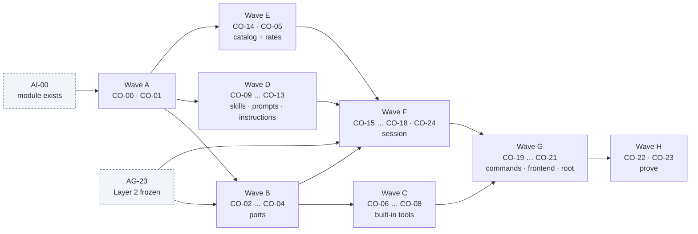
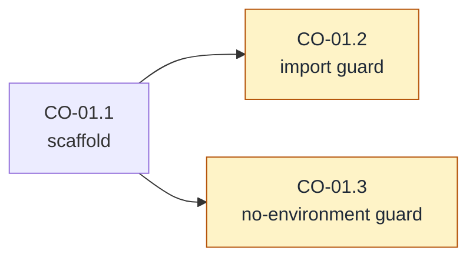
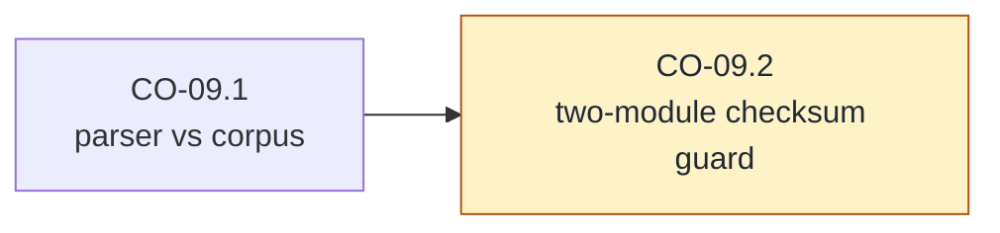
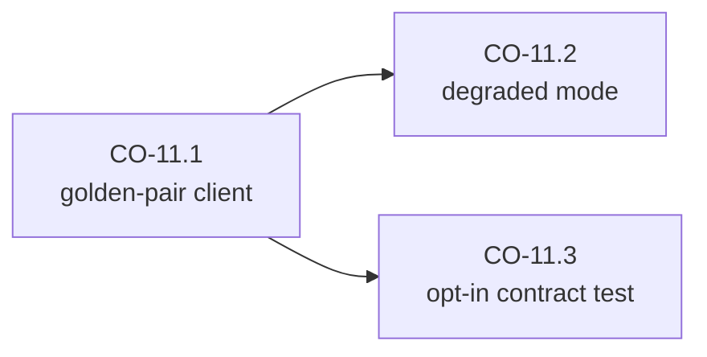
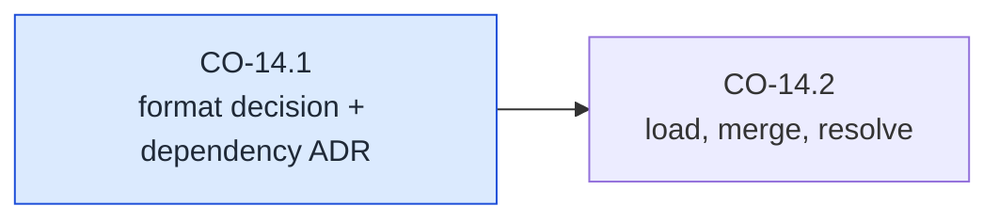
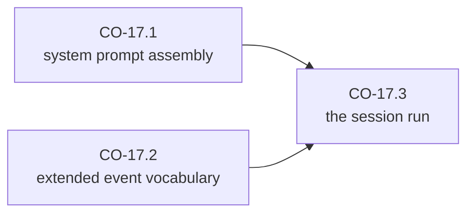
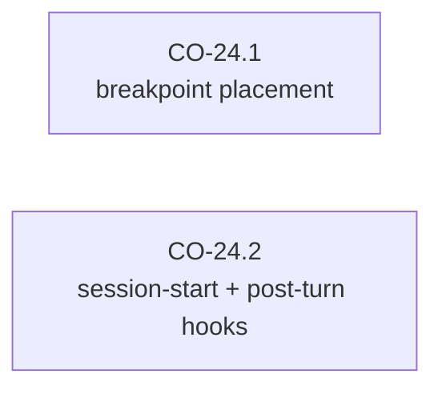
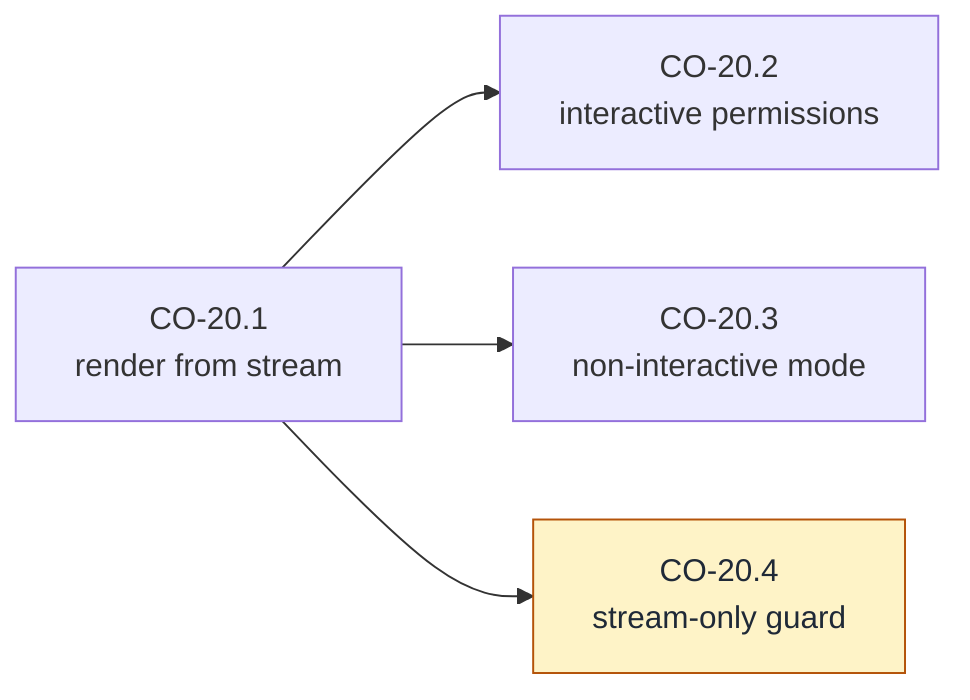
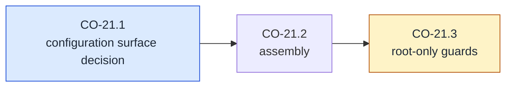

# Layer 3 milestones and task graph — `cachicamas_coding` application

> **Status:** Not started — **0 of 25** milestones shipped. **CO-00 is the first milestone.** Layer 3 code does not exist. This document is the third and last of the stack's plans: it turns [the v2 architecture reference § 5](../0001-cachicamas-agent-stack-v2.md#5-layer-3--the-coding-application), [ADR 0005 § D1 row 3 / § D2](../../adr/0005-promote-agent-stack-to-own-module.md#d1--dependency-rule-v2) and [ADR 0006](../../adr/0006-resolve-skill-and-prompt-source-of-truth.md) into an executable graph.
> **Entry gate:** [AG-23 — the Layer 3 readiness contract](./0003-cachicamas-agent-layer-2-task-graph.md#ag-23--publish-the-layer-3-readiness-contract) for everything that consumes the harness. A resource track may start far earlier — see [the entry gate](#entry-gate--three-tracks-two-gates).
> **Architecture reference:** [cachicamas agent stack v2](../0001-cachicamas-agent-stack-v2.md) · **Decisions:** [ADR 0004](../../adr/0004-adopt-tau-3-layer-agentic-architecture.md) · [ADR 0005](../../adr/0005-promote-agent-stack-to-own-module.md) · [ADR 0006](../../adr/0006-resolve-skill-and-prompt-source-of-truth.md)
> **Sibling plans:** [Layer 1 task graph (doc 0002)](./0002-cachicamas-ai-layer-1-task-graph.md) · [Layer 2 task graph (doc 0003)](./0003-cachicamas-agent-layer-2-task-graph.md)
> **Target packages:** `backend/agent/src/coding/` (Layer 3) and `backend/agent/src/cmd/cachicamas/` (the composition root — CO-21 only), per [ADR 0005 § D2](../../adr/0005-promote-agent-stack-to-own-module.md#d2--location-mapping-v2).
> **Date:** 2026-07-30.
> **Milestone identifiers are append-only.** CO-NN ids follow the same rule as AI-NN and AG-NN: append, never renumber; insertion points are `Blocks:` fields. Node identifiers (`CO-NN.p`) are equally append-only.

> [!IMPORTANT]
> **Authoring constraint, inherited from the v2 reference.** Behaviors and what a test must prove — never Go type names, field names, or signatures for code that does not exist. Port names (`ToolSource`, `SkillSource`, `PromptSource`, `PermissionPolicy`, `Sandbox`, `PriceTable`) appear because the v2 reference § 5.1 names them as *concepts*; each milestone's SDD owns their spelling.

---

## Outcome first

Walking every leaf of this graph to green, in dependency order, produces the thing a user runs: the `cachicamas` CLI in print mode — a coding agent that reads, writes, edits, and shells under an asked permission policy; loads skills and prompts from three precedence-ordered sources with visible shadowing; assembles its system prompt from project instructions; persists every session as an append-only record that resumes faithfully; prices every turn; and is wired together in exactly one place.

Layer 3 is where policy lives. Its milestones therefore split into three tracks, and the graph keeps them apart: **resources** (skills, prompts, instructions, catalog, rates — no Layer 2 dependency at all), **contract implementations** (ports and tools that implement Layer 2's seams), and **the session assembly** (everything that consumes the harness). The first track runs while Layer 2 is still being written; the other two are gated on the AG-23 freeze, the contract track with a priced early start.

Every leaf is sized for one test-first sitting and verifiable by one command. The [living-graph clause of doc 0002](./0002-cachicamas-ai-layer-1-task-graph.md#the-graph-is-alive--the-revert-and-record-clause) applies verbatim.

## Quick navigation

- [Layer boundary](#layer-boundary) — what Layer 3 owns and must not own
- [Method](#method--inherited-from-doc-0002) — inherited; evidence-gate adaptations listed
- [Entry gate](#entry-gate--three-tracks-two-gates) — the resource, contract, and session tracks
- [Global dependency graph](#global-dependency-graph) · [Delivery sequence](#delivery-sequence)
- [Wave A — Decide and scaffold](#wave-a--decide-and-scaffold): [CO-00](#co-00--record-the-layer-3-contract-vocabulary-and-v1-scope) · [CO-01](#co-01--package-scaffold-and-boundary-guards)
- [Wave B — Ports](#wave-b--the-ports): [CO-02](#co-02--define-the-tool-source-port) · [CO-03](#co-03--implement-permission-policy) · [CO-04](#co-04--define-the-sandbox-seam)
- [Wave C — Built-in tools](#wave-c--built-in-tools): [CO-06](#co-06--build-the-read-tool) · [CO-07](#co-07--build-the-write-and-edit-tools) · [CO-08](#co-08--build-the-bash-tool)
- [Wave D — Skills, prompts, instructions](#wave-d--skills-prompts-and-instructions): [CO-09](#co-09--implement-the-skillmd-parser-against-the-golden-corpus) · [CO-10](#co-10--implement-the-filesystem-sources) · [CO-11](#co-11--implement-the-http-catalog-sources) · [CO-12](#co-12--implement-the-source-chain-and-shadowing) · [CO-13](#co-13--load-project-instructions)
- [Wave E — Catalog and rates](#wave-e--catalog-and-rates): [CO-14](#co-14--build-the-provider-catalog-and-credential-seam) · [CO-05](#co-05--define-the-price-table-port)
- [Wave F — Session](#wave-f--session): [CO-15](#co-15--persist-session-records) · [CO-16](#co-16--resume-with-reload-fidelity) · [CO-17](#co-17--assemble-the-codingsession-and-its-event-stream) · [CO-18](#co-18--price-the-run) · [CO-24](#co-24--wire-the-concrete-hooks-breakpoints-and-session-hooks)
- [Wave G — Commands and frontend](#wave-g--commands-and-frontend): [CO-19](#co-19--implement-slash-commands) · [CO-20](#co-20--build-the-print-mode-frontend) · [CO-21](#co-21--build-the-composition-root)
- [Wave H — Prove](#wave-h--prove): [CO-22](#co-22--run-the-end-to-end-deterministic-acceptance) · [CO-23](#co-23--publish-the-v1-completion-statement)
- [Layer 3 completion checklist](#layer-3-completion-checklist)
- [Explicitly deferred until after v1](#explicitly-deferred-until-after-v1)
- [Traceability spine](#traceability-spine)

---

## Layer boundary

Settled by ADR 0004 as amended by ADR 0005. Layer 3 (`backend/agent/src/coding/`) may import Layers 1–2, the Go standard library, the OTel API, `net/http`, `otelslog` (permitted by [ADR 0005 § D3](../../adr/0005-promote-agent-stack-to-own-module.md#d3--observability-boundary)'s import table), and approved third-party TUI/TOML/tokenizer dependencies ([ADR 0005 § D1 row 3](../../adr/0005-promote-agent-stack-to-own-module.md#d1--dependency-rule-v2) — each new `go.mod` dependency still needs its ADR per `openspec/AGENTS.md` rule 5). It must not import `src/cmd/…`, any Go package of `database_administrator` or `workspace_syncer` (HTTP only, never an import), or the OTel SDK. The composition root (`src/cmd/cachicamas`, CO-21) is the sole exception: it may import everything, and nothing may import it.

**Layer 3 owns:** the six named ports of v2 § 5.1 (five table rows — the skill and prompt sources share one) and their v1 implementations; the built-in tools; the SKILL.md parser duplicate and its golden corpus (ADR 0006 § D4); the three-source skill/prompt chains with shadowing (ADR 0006 § D1–D3); project instructions and system-prompt assembly; the provider catalog and the credential-source seam; session persistence with parent chains; the coding session that wraps the harness and its extended event stream; pricing; slash commands; the print-mode frontend; the composition root.

**Layer 3 must not own:** the agent loop, harness internals, or any Layer 2 protocol (it injects policy, it does not re-implement mechanism); provider adapters or wire formats (Layer 1); environment reads or flag parsing anywhere except the composition root (v2 § 5.2: "Nothing below it reads the environment"); the OTel SDK anywhere except the composition root; writes to Postgres — the agent never writes back (ADR 0006 § D1).

One wording trap, recorded now: **"Layer 3 is where policy lives" does not make Layer 3 a second brain.** Every behavior in this document either implements a port Layer 2 consumes, supplies a resource, or consumes the event stream. A Layer 3 component that needs a capability the harness does not expose is a Layer 2 amendment (doc 0003, living-graph clause), never a workaround import or a parallel mechanism.

## Rules for every future SDD milestone

Identical to [doc 0002's rules](./0002-cachicamas-ai-layer-1-task-graph.md#rules-for-every-future-sdd-milestone), with the import row restated per ADR 0005 § D1 row 3 above, and one addition: **a milestone that adds a third-party dependency (TOML parser, TUI toolkit, tokenizer) must include or cite the ADR that authorizes it before the dependency lands** — the AI-24 transport-dependency gate, generalized.

## Method — inherited from doc 0002

[Node grammar](./0002-cachicamas-ai-layer-1-task-graph.md#node-grammar), [leaf anatomy](./0002-cachicamas-ai-layer-1-task-graph.md#leaf-anatomy), [split triggers](./0002-cachicamas-ai-layer-1-task-graph.md#split-triggers), [charter convention](./0002-cachicamas-ai-layer-1-task-graph.md#milestone-charter), [walking-skeleton ordering](./0002-cachicamas-ai-layer-1-task-graph.md#ordering-inside-a-milestone), and [the living-graph clause](./0002-cachicamas-ai-layer-1-task-graph.md#the-graph-is-alive--the-revert-and-record-clause) apply verbatim.

**Evidence gate (adapted).** A leaf closes on recorded green `make test` in `backend/agent/`, with three scoped exceptions: **CO-09.2's corpus checksum tests live in both modules**, so its gate is green `make test` in `backend/agent/` **and** `backend/database_administrator/`; **CO-11.3's live contract test is opt-in** (skips without a reachable backend, per ADR 0006 § D2) and its gate is the recorded skip plus a recorded run against a local backend; **CO-21/CO-22 include a binary build check** (`go build` of the composition root) as recorded evidence. Test naming and scenario banners follow the module conventions doc 0002 sets, with `// CO-NN.p — …` citations.

**Two Layer 3-specific test rules.** (1) Layer 3 tests touching the filesystem use test-scoped temporary directories injected through the same seams production uses — a test that reads a developer's real `~/.cachicamas` is a defect. (2) Everything that consumes the harness tests against the AG-23 scripted-harness kit, never against a real provider; the only live-network test in this document is CO-11.3's opt-in contract check.

---

## Entry gate — three tracks, two gates

**The resource track** — CO-00, CO-01, CO-09 … CO-14, and CO-05 — depends on Layer 2 not at all (CO-00 reads doc 0003 for vocabulary alignment only). Its gate is **AI-00** (the module exists). It runs concurrently with all of Layer 2's development and is the schedule's slack.

**The contract track** — CO-02 … CO-04 (ports facing Layer 2's seams) and CO-06 … CO-08 (tools implementing the Layer 2 execution contract) — implements shapes doc 0003 defines and AG-23 freezes. Its **normative gate is AG-23**; the milestone `Depends on:` fields below state that gate, and it is the one the delivery sequence schedules by. One priced early start is recorded: once the shaping milestones merge (AG-09/AG-10 for the ports, AG-09 for the tools), this track may begin against the unfrozen surface, accepting that any pre-freeze amendment lands on every implementation started early. Early-started work still cannot *close* its AG-23-gated proof items (e.g. CO-04.1's pass-through round trip) before AG-23 does.

**The session track** — CO-15 … CO-24 — consumes the harness, its event vocabulary, or its test kit. Its gate is **AG-23**, with no early start: a session built against an unfrozen harness re-litigates every freeze amendment twice.

Wave order below is dependency order, not calendar order: the tracks interleave in practice, and the [delivery sequence](#delivery-sequence) notes each wave's gate.

---

## Global dependency graph

Parallelism worth exploiting: all of wave D runs beside Layer 2's development; CO-14 is gate-free, and CO-05 follows it while staying gate-free of Layer 2; CO-06 ∥ CO-07 ∥ CO-08 after CO-02/CO-04; CO-09 blocks only CO-10 … CO-12 inside wave D.

### Delivery sequence

| Wave | Milestones | Gate | Exit condition |
| --- | --- | --- | --- |
| A — Decide + scaffold | CO-00, CO-01 | AI-00 | Vocabulary and v1 scope recorded; package exists with guards biting. |
| B — Ports | CO-02 to CO-04 | AG-23 normative (early start priced after AG-09/AG-10 merge) | The Layer 2-facing ports — tool source, permission policy, sandbox — have contracts and v1 implementations. |
| C — Built-in tools | CO-06 to CO-08 | AG-23 normative (early start priced after AG-09 merges) | read/write/edit/bash implement the execution contract safely. |
| D — Resources | CO-09 to CO-13 | AI-00 — **gate-free of Layer 2** | Skills/prompts resolve through three sources with visible shadowing; instructions load; the corpus guards both parsers. |
| E — Catalog and rates | CO-14, CO-05 | AI-00 — **gate-free of Layer 2** | Providers/models resolvable from embedded + override catalog; credential seam defined; rates price tokens into money. |
| F — Session | CO-15 to CO-18, CO-24 | AG-23 | Sessions persist, resume faithfully, wrap the harness, are priced, and the concrete hooks are wired. |
| G — Commands + frontend | CO-19 to CO-21 | AG-23 | Slash commands work; print mode renders a full run; the composition root wires everything and is the only env-reader. |
| H — Prove | CO-22, CO-23 | all | The e2e acceptance passes deterministically; the v1 statement is published. |

**First SDD to start: CO-00**, any time after AI-00. The resource track is the schedule's slack: it fills the calendar while doc 0003's waves C–G execute.

---

## Wave A — Decide and scaffold

### CO-00 — Record the Layer 3 contract vocabulary and v1 scope

SDD change: `cachicamas-coding-contract-vocabulary`.

**Charter**

- **Goal:** Fix the terms and the v1 scope so later milestones cite instead of re-deciding: what a *session* is (vs a run — one session holds many runs), a *session record*, a *frontend*, a *slash command* (session control, never sent to the model), a *skill in scope*, *shadowing*, *print mode*.
- **Deliverable:** A recorded vocabulary artifact plus the v1 scope verdicts: print mode is the only v1 frontend (TUI deferred — v2 § 8's reasoning: a TUI written first acquires state the stream does not carry); MCP tool sources deferred (the ToolSource port is the seam); sandbox implementations deferred ("none" ships); the subagent tool deferred; session branching supported by the format, exposed by no UI.
- **Acceptance:** Every deferred item cites the v2 § 8 non-goal or names its seam; every v1 item has milestones below; a mismatch is a bug fixed before this closes.
- **Depends on:** AI-00; doc 0003 exists (vocabulary alignment). · **Blocks:** everything.

#### CO-00.1 — The vocabulary and scope decision `[decision]`

- **Closing checklist:**
  1. Each term above has one observable definition, including the boundary cases: is a resumed session the same session (yes — same record, new process); is a slash command's effect recorded in the session (yes, as session metadata — it never enters the model transcript); is a shadowing event part of the agent stream or the session stream (the session stream — Layer 2 knows nothing of skills).
  2. The v1 scope verdicts are recorded with the non-goal/seam citations, and the transparency principle is adopted as a Layer 3 obligation: **everything the model will receive is enumerable from the session** (the spike's honest-sidebar rule, which print mode and any future TUI inherit).
  3. The session/run/turn vocabulary is checked against doc 0003's AG-00 artifact for conflicts; conflicts resolve here or amend there — never both silently.
- **Depends on:** AI-00.

### CO-01 — Package scaffold and boundary guards

SDD change: `cachicamas-coding-package-scaffold`.

**Charter**

- **Goal:** Create `backend/agent/src/coding/` with its boundaries mechanically guarded from birth.
- **Deliverable:** The package and doc comment; the import guard; the no-environment guard.
- **Acceptance:** `make test` green; both guards recorded biting.
- **Depends on:** AI-00, CO-00. · **Blocks:** all Layer 3 code.
- **Out of scope:** the composition root package (CO-21 creates it — it has different rules).

#### CO-01.1 — Scaffold `[mechanical]`

- **Check list:**
  1. WHEN `backend/agent/src/coding/` exists with a package doc comment stating the layer contract (imports row, no-env rule, HTTP-never-import toward other modules) THEN `make test` and `make lint` stay green in the module.
- **Depends on:** AI-00, CO-00.

#### CO-01.2 — Import guard `[guard]`

- **Test list:**
  1. The `go list -deps` allowlist guard (doc 0002 AI-00's forward-guard mechanism, retargeted): stdlib, `src/ai`, `src/agent`, OTel API + `otelslog`, `net/http`, and the ADR-authorized third-party list — nothing else; forbidden by name: `src/cmd/…`, both sibling backend modules' Go packages, the OTel SDK and exporters.
  2. **Bite proof:** a scratch import of a `database_administrator` package fails the guard; recorded, dropped.
- **Depends on:** CO-01.1.

#### CO-01.3 — No-environment guard `[guard]`

- **Test list:**
  1. An AST scan asserts no environment-variable read and no flag parsing anywhere in `src/coding/` — v2 § 5.2's "nothing below the composition root reads the environment", mechanical. (Filesystem access is legal in this layer; *which* directories is an injected decision, and the scan also flags home-directory resolution calls, which belong to the root.)
  2. **Bite proof:** a scratch environment read fails; recorded, dropped.
- **Depends on:** CO-01.1.

---

## Wave B — The ports

### CO-02 — Define the tool source port

SDD change: `cachicamas-coding-tool-source` · Closes: **G6**'s seam. Seam 4: re-readable per turn.

**Charter**

- **Goal:** The port answering "which tools exist right now", re-read at each turn boundary, with the v1 implementation a static list of the built-ins.
- **Deliverable:** The port contract; the static source; the cache-prefix consequence documented.
- **Acceptance:** The session consumes the port per turn; a source whose answer changes between turns changes the next turn's tool set and is *visible* (an event on the session stream — the § 5.1 note: a changed tool list invalidates the cache prefix and "should say so rather than quietly re-billing").
- **Depends on:** CO-01; AG-23 for the consuming side (contract draftable earlier). · **Blocks:** CO-06 … CO-08, CO-17.
- **Out of scope:** MCP and any dynamic source (deferred; this port is their seam); per-session filtering beyond the port's answer.

#### CO-02.1 — The port and the static source `[leaf]`

- **Test list:**
  1. WHEN the session begins a turn THEN the tool set is the port's current answer (proven with a scripted source that changes answers between turns), and each tool satisfies the Layer 2 execution contract.
  2. A tool-set change between turns emits a session-stream event naming what changed — the cache-prefix honesty rule as a behavior.
  3. *(pin)* The static built-in source returns a stable, deterministically ordered list — order instability would silently invalidate the provider cache prefix every call (the deterministic tool-ordering lesson of doc 0002's AI-26, one layer up).
- **Depends on:** CO-01.

### CO-03 — Implement permission policy

SDD change: `cachicamas-coding-permission-policy` · Closes: **G1**'s policy half (the protocol is AG-10's).

**Charter**

- **Goal:** The policy port's v1 implementations: always-ask, allow-all (for scripted/test use), and a rule-set policy over tool names and argument patterns with permission modes; in-session memory for allow-always resolutions.
- **Deliverable:** The implementations, composable (mode wraps rules wraps memory), each deterministic and testable in isolation.
- **Acceptance:** Driven through the AG-23 kit: always-ask defers every call; rules allow/deny/defer per configuration; allow-always resolutions are remembered for matching later calls in the session and reported remembered (so AG-10.4's event fires); deny reasons are stated.
- **Depends on:** CO-01, AG-23. · **Blocks:** CO-17, CO-20.
- **Out of scope:** Persistence of remembered rules across resume (CO-16); UI for deciding (CO-20); sandbox interplay (CO-04 is orthogonal).

#### CO-03.1 — Rule evaluation `[leaf]`

- **Test list:**
  1. A rule set over tool name and argument patterns yields allow / deny / defer deterministically; an unmatched call falls to the mode's default; evaluation order is documented and pinned.
  2. Always-ask defers everything; allow-all allows everything; both are the degenerate rule sets, proven by the same table.
- **Depends on:** CO-01, AG-23.

#### CO-03.2 — In-session memory `[leaf]`

- **Test list:**
  1. WHEN a deferred call is resolved allow-always THEN the policy reports it remembered and answers matching later calls without deferring — the match criterion (tool + argument scope) documented and pinned; non-matching calls still defer.
  2. Memory is session-scoped state injected into the policy, enumerable (the session can persist and display it), and empty at construction.
- **Depends on:** CO-03.1.

### CO-04 — Define the sandbox seam

SDD change: `cachicamas-coding-sandbox-seam` · Closes: **G2**'s seam. Seam 3's Layer 3 half: Layer 2 carries the policy value; Layer 3 defines and interprets it.

**Charter**

- **Goal:** The confinement vocabulary (v1: none; named future states: workspace-write, platform-native) as the per-call policy value tools receive through the AG-09 execution contract, with the interpretation contract each tool must honor.
- **Deliverable:** The policy vocabulary; the "none" implementation; the obligation statement tools are tested against (CO-06 … CO-08 each prove they consult it).
- **Acceptance:** A scripted execution shows the policy value arriving at the tool unmodified through the Layer 2 pass-through; "none" is explicit, never an absent-value default — absence is a construction error, so forgetting to wire confinement fails loudly rather than running unconfined silently.
- **Depends on:** CO-01; AG-23 for the pass-through proof (the vocabulary itself is draftable earlier per the contract track's priced start). · **Blocks:** CO-06 … CO-08, CO-17.
- **Out of scope:** Any real confinement implementation (deferred, v2 § 8); process-tree kill discipline (CO-08 owns it as tool behavior — it applies even under "none").

#### CO-04.1 — The vocabulary and the none policy `[leaf]`

- **Test list:**
  1. The confinement vocabulary is closed and enumerable; "none" is a constructed value distinct from zero/absent, and a tool invoked with an absent policy fails typed at the execution boundary.
  2. The policy value round-trips the Layer 2 pass-through untouched (AG-09.1 item 2, proven from the Layer 3 side with a real tool stub).
- **Depends on:** CO-01, AG-23.

---

## Wave C — Built-in tools

> The four built-ins implement the Layer 2 execution contract (AG-09.1): declaration + effect class + typed failure, consulting the CO-04 policy value. Shared rules, stated once and tested per tool: paths resolve within an injected workspace root — escape attempts (absolute paths outside it, `..` traversal, symlinks pointing out) are typed failures, not clamps; results are size-bounded with explicit truncation markers; a tool's *result reporting failure* (file not found) is distinct from the tool *failing to execute* (the AG-05.2 three-state split, from the producing side).

### CO-06 — Build the read tool

SDD change: `cachicamas-coding-tool-read`.

**Charter**

- **Goal:** Read file content for the model: offset/limit windows, byte-size bounds, binary detection.
- **Deliverable:** The read tool against the shared rules.
- **Acceptance:** Reads inside the root succeed with correct content and windowing; escapes fail typed; oversized reads truncate with a marker stating what was omitted; a binary file yields a typed not-text result rather than garbage in the transcript.
- **Depends on:** CO-02, CO-04. **Parallel with:** CO-07, CO-08.
- **Out of scope:** Images/multimodal (deferred with the Layer 1 non-goal); write access (CO-07).

#### CO-06.1 — Read behaviors `[leaf]`

- **Test list:**
  1. Content, offset/limit windowing, and end-of-file behavior are exact against fixture files, including multi-byte runes at window boundaries (no split-rune output).
  2. The shared rules hold: escape attempts fail typed; oversize truncates with a marker; binary detected; effect class is read (the scheduler may parallelize it — AG-09.2's premise, honored from the tool side).
  3. The declaration's schema matches the accepted arguments exactly — a mismatch between what the model is told and what the tool accepts is the defect class this item pins.
- **Depends on:** CO-02, CO-04.

### CO-07 — Build the write and edit tools

SDD change: `cachicamas-coding-tool-write-edit`.

**Charter**

- **Goal:** Create/overwrite files, and apply exact string-replacement edits.
- **Deliverable:** Both tools against the shared rules, effect class mutating (serialized by AG-09.2).
- **Acceptance:** Writes land atomically (no partial file observable, proven via injected-failure simulation); edit's old-string matching is exact and fails typed on zero or multiple matches (the ambiguity rule that keeps edits deterministic); both refuse escapes; parent-directory creation behavior is decided and pinned.
- **Depends on:** CO-02, CO-04. **Parallel with:** CO-06, CO-08.
- **Out of scope:** Diff rendering (frontend concern from tool events).

#### CO-07.1 — Write behaviors `[leaf]`

- **Test list:**
  1. Create and overwrite are exact; a simulated mid-write failure leaves either the old content or the new, never a torn file.
  2. Escapes fail typed; the result reports the path and byte count (what a frontend needs to narrate the change).
- **Depends on:** CO-02, CO-04.

#### CO-07.2 — Edit behaviors `[leaf]`

- **Test list:**
  1. Exact-match replacement with unique-match enforcement: zero matches and >1 matches are distinct typed result-failures naming the count; replace-all is a distinct documented mode.
  2. Content outside the matched span is byte-untouched, including line endings and trailing whitespace (fixture byte-equality).
- **Depends on:** CO-07.1.

### CO-08 — Build the bash tool

SDD change: `cachicamas-coding-tool-bash` · The v2 § 9 checklist row lands here: **kill the process group, not the direct child.**

**Charter**

- **Goal:** Run shell commands with bounded output, a timeout, cancellation that kills the whole spawned tree, and the policy value consulted.
- **Deliverable:** The bash tool, effect class execute (serialized).
- **Acceptance:** Stdout/stderr captured interleaved-order-preserving and size-bounded with truncation markers; exit codes reported as results (non-zero is a result reporting failure, not an execution failure); timeout and cancellation kill the process group — a grandchild that outlives its parent is the defect, proven with a spawning fixture; the working directory is the injected root.
- **Depends on:** CO-02, CO-04. **Parallel with:** CO-06, CO-07.
- **Out of scope:** Real confinement (the policy value is consulted and, under "none", recorded — the seam is exercised even when the answer is "unconfined"); interactive commands (documented unsupported).

#### CO-08.1 — Execution and capture `[leaf]`

- **Test list:**
  1. Commands run in the injected working directory; stdout/stderr are captured with interleaving order preserved and bounded with markers; the exit code lands in the result (non-zero ≠ execution failure).
  2. Environment passed to the child is an injected, documented set — never the parent process environment wholesale (the no-ambient-authority discipline extended through the spawn boundary).
- **Depends on:** CO-02, CO-04.

#### CO-08.2 — Process-tree termination `[leaf]`

- **Test list:**
  1. WHEN a command spawns children and the call is cancelled or times out THEN the entire process group is terminated within a documented bound — proven by a fixture that spawns a grandchild and asserts its death; the timeout and cancellation paths both covered.
  2. Termination is reported typed, distinguishing timeout from cancellation (the timeout-versus-cancellation distinction of doc 0002's AI-32, honored at the tool).
- **Depends on:** CO-08.1.

---

## Wave D — Skills, prompts, and instructions

### CO-09 — Implement the SKILL.md parser against the golden corpus

SDD change: `cachicamas-coding-skillmd-parser` · Executes [ADR 0006 § D4](../../adr/0006-resolve-skill-and-prompt-source-of-truth.md#d4--the-accepted-parser-duplication): the accepted duplication, guarded by a shared corpus.

**Charter**

- **Goal:** The second implementation of the SKILL.md frontmatter contract (~60 lines) plus the corpus that keeps both implementations honest.
- **Deliverable:** The parser in `src/coding/skill/`; the golden corpus at `docs/architecture/testdata/skillmd/`; corpus-driven tests in **both** modules; the checksum guard in both.
- **Acceptance:** Both parsers pass the identical corpus: name regex, description cap (runes), body cap (bytes), reserved words, frontmatter/name lock-step — valid documents parse to matching fields, invalid ones fail with the paired sentinel; changing the corpus without re-running both suites fails the checksum test in the untouched module.
- **Depends on:** CO-01. **Gate-free of Layer 2.** · **Blocks:** CO-10, CO-11, CO-12.
- **Out of scope:** Loading from anywhere (CO-10/CO-11); prompt parsing beyond what the corpus shares (prompts follow skills — ADR 0006's neutral consequence — and reuse this parser's frontmatter layer).
- **Note:** the corpus content derives from `database_administrator/src/domain/skill.go`'s shipped rules — the corpus *encodes* those rules as files; neither parser is the reference, the files are (ADR 0006's exact sentence).

#### CO-09.1 — Parser vs corpus `[leaf]`

- **Test list:**
  1. Every valid corpus document parses to the expected name/description/body; every invalid one fails with its paired sentinel — the corpus enumerates at minimum: regex violations, over-cap description (rune-counted), over-cap body (byte-counted), reserved words, missing frontmatter keys, name/frontmatter lock-step breaks.
  2. Rune-vs-byte counting is proven with multi-byte fixtures sized to pass one counting rule and fail the other — the drift class ADR 0006 § D4 names.
- **Depends on:** CO-01.

#### CO-09.2 — Two-module checksum guard `[guard]`

- **Test list:**
  1. A corpus-manifest checksum test exists in both modules; regenerating the manifest is part of changing the corpus. **Bite proof:** a scratch corpus edit without manifest regeneration fails both modules' tests; adding a `database_administrator`-side corpus test that runs its shipped parser over the same files is part of this leaf (its evidence lives in that module's `make test`).
- **Depends on:** CO-09.1.
- **Note:** touching `backend/database_administrator/src/` is legal here only because the SDD change declares that module in scope — `openspec/AGENTS.md` forbids modifying it otherwise. The `cachicamas-coding-skillmd-parser` proposal must say so explicitly.

### CO-10 — Implement the filesystem sources

SDD change: `cachicamas-coding-fs-sources` · ADR 0006 § D2's `fsource`, for skills and prompts.

**Charter**

- **Goal:** Read-only skill/prompt sources over injected directories (repo-local and user-local are the same implementation with different roots).
- **Deliverable:** The filesystem source for both ports.
- **Acceptance:** Valid documents under an injected root are enumerable and retrievable by name; invalid ones are reported as diagnostics (name, path, sentinel) and excluded — one bad skill never breaks the set; changes on disk are visible on next enumeration (re-read semantics documented); nothing writes.
- **Depends on:** CO-09. **Gate-free of Layer 2.**
- **Out of scope:** Precedence (CO-12); watching/hot-reload (enumeration-time re-read only, documented).

#### CO-10.1 — Enumeration and retrieval `[leaf]`

- **Test list:**
  1. Enumeration over a fixture tree yields exactly the valid documents with parsed fields; retrieval by name returns the body; a document failing CO-09's rules is excluded and its diagnostic is retrievable — never a silent absence (the ADR's "mysteriously absent capability" failure mode, made loud).
  2. The source is read-only by construction and enumeration order is deterministic.
- **Depends on:** CO-09.

### CO-11 — Implement the HTTP catalog sources

SDD change: `cachicamas-coding-http-sources` · ADR 0006 § D2's `httpsource`: wire JSON only, optional at runtime.

**Charter**

- **Goal:** Skill/prompt sources over `database_administrator`'s HTTP routes — never a Go import — resilient to the backend being absent.
- **Deliverable:** The HTTP source; the golden wire-shape pair; the opt-in live contract test; the degraded-mode behavior.
- **Acceptance:** Against an `httptest` server replaying the golden pair, enumeration and retrieval work; an unreachable catalog yields a degraded-but-working source that reports a warning the session stream will carry (ADR 0006 § D2: "a warning on the session stream, not a startup failure"); wire-shape drift is caught by the golden pair and the opt-in contract test, the two guards ADR 0006 names for a contract with no compiler check.
- **Depends on:** CO-09. **Gate-free of Layer 2.**
- **Out of scope:** Authentication/credentials for the route (a named prerequisite for precedence level 3, per ADR 0006's consequences — the credential seam is CO-14's; wiring it here happens when session auth exists).

#### CO-11.1 — Golden-pair client `[leaf]`

- **Test list:**
  1. Enumeration and retrieval against `httptest` replaying the checked-in golden responses; parsed results match the goldens' expectations; the parser applied to fetched bodies is CO-09's (one contract, both stores).
  2. Malformed and unexpected-status responses yield typed diagnostics, size-bounded (the bounded-capture discipline of doc 0002's AI-32, applied to this client).
- **Depends on:** CO-09.

#### CO-11.2 — Degraded mode `[leaf]`

- **Test list:**
  1. WHEN the endpoint is unreachable or times out THEN the source reports itself degraded with a typed warning and enumerates empty — construction never fails for absence, and the warning is retrievable for the session stream.
- **Depends on:** CO-11.1.

#### CO-11.3 — Opt-in contract test `[leaf]`

- **Test list:**
  1. WHEN pointed at a reachable local backend (opt-in, the gating discipline of doc 0002's AI-39) THEN live responses satisfy the same assertions as the goldens; without the backend the test skips cleanly, recorded.
- **Depends on:** CO-11.1.

### CO-12 — Implement the source chain and shadowing

SDD change: `cachicamas-coding-source-chain` · Executes [ADR 0006 § D3](../../adr/0006-resolve-skill-and-prompt-source-of-truth.md#d3--precedence-and-shadowing): repo > user > org, shadowing visible.

**Charter**

- **Goal:** The ordered fan-in over sources, resolving name collisions by precedence and emitting shadowing information.
- **Deliverable:** The chain for both ports.
- **Acceptance:** With all three sources populated and overlapping, resolution follows repo > user > org exactly; every collision yields a shadowing record (name, winner, shadowed sources) the session stream will carry — a silent precedence resolution is the defect (ADR 0006: the sidebar's honesty depends on it); a degraded member's warning propagates; an empty chain is legal.
- **Depends on:** CO-10, CO-11. **Gate-free of Layer 2.** · **Blocks:** CO-17.
- **Out of scope:** Which directories/endpoints feed the chain (composition root wiring).

#### CO-12.1 — Precedence and shadowing `[leaf]`

- **Test list:**
  1. The three-source overlap table: unique names resolve from their source; collisions resolve to the highest precedence with a complete shadowing record; the enumeration presents each name once, with its winner's content.
  2. Chain composition is order-defined (the constructor's order is the precedence), and a two-member or one-member chain behaves as the same rule — no hidden three-source assumption.
- **Depends on:** CO-10, CO-11.

### CO-13 — Load project instructions

SDD change: `cachicamas-coding-project-instructions` · Filesystem only, per ADR 0006's neutral consequence.

**Charter**

- **Goal:** Read and merge project instructions — `AGENTS.md`, then `.cachicamas/`, then `.agents/` — into the ordered instruction material for system-prompt assembly.
- **Deliverable:** The loader with documented merge order.
- **Acceptance:** Present files merge in documented order with provenance retained per fragment (the session must be able to say which file contributed what — the transparency rule); absent files skip silently (absence is normal); unreadable-but-present files are typed diagnostics; size bounds with markers.
- **Depends on:** CO-01. **Gate-free of Layer 2.** · **Blocks:** CO-17.
- **Out of scope:** Skill/prompt content (CO-12); any Postgres notion of instructions (none exists, deliberately).

#### CO-13.1 — Merge with provenance `[leaf]`

- **Test list:**
  1. The presence/absence matrix over the three locations yields documented merge order with per-fragment provenance; absent locations skip; present-but-unreadable is a typed diagnostic.
  2. Oversized instruction material is bounded with an explicit marker, and the bound is documented where users will look for it.
- **Depends on:** CO-01.

---

## Wave E — Catalog and rates

### CO-14 — Build the provider catalog and credential seam

SDD change: `cachicamas-coding-provider-catalog` · ADR 0005 § D2's row: embedded default + user override; and the S4 correction — per-developer state under the home directory belongs to the CLI, not a container.

**Charter**

- **Goal:** The catalog answering "which providers and models exist, with which endpoints, capabilities and rates" from an embedded default merged with an optional user override; and the credential-source seam (resolution happens in the composition root — the catalog names *which* credential a provider needs, never its value).
- **Deliverable:** Catalog loading/merging/validation; model resolution; the credential-source contract; the price-rate entries CO-05 consumes.
- **Acceptance:** The embedded catalog parses and validates at build time (a test, so a bad embedded catalog cannot ship); a user override merges by documented rules (override wins per entry, malformed override is a typed diagnostic that leaves the embedded catalog usable), and **the override is read from an injected path** — the `~/.cachicamas/catalog.toml` default of ADR 0005 § D2 is resolved by the composition root, since CO-01.3's guard makes in-package home resolution a defect; model lookup yields endpoint + capability + context budget + rates; no code path reads an environment variable or a credential value.
- **Depends on:** CO-01. **Gate-free of Layer 2.** · **Blocks:** CO-05, CO-17, CO-21.
- **Out of scope:** Login flows and credential storage (composition root + future work); provider adapter construction (the root builds adapters from catalog entries).

#### CO-14.1 — Format decision and dependency ADR `[decision]`

- **Closing checklist:**
  1. The catalog format is decided (the ADR 0005 § D2 row says TOML with an embedded default; this decision confirms or rebuts it). The catalog is deliberately *not* env-var configuration, and the decision justifies that on the record against both readings of the repo convention: ADR 0005 § S4's broad gloss ("configuration is environment variables per `openspec/AGENTS.md` rule 3") and the literal rule 3, which scopes env-var configuration to observability endpoints.
  2. If the format needs a third-party parser, the dependency ADR exists before CO-14.2 adds it (the generalized AI-24 transport-dependency gate).
  3. The schema is enumerated: providers, models, endpoints, capability flags (including caching mode — explicit versus automatic, which CO-24 consumes), **context-window budgets per model** (the figure AG-17's strategy needs — no other node owns supplying it), rate entries, credential *names* — and what happens to unknown fields (tolerated-and-reported, for forward compatibility) is decided.
- **Depends on:** CO-01.

#### CO-14.2 — Load, merge, resolve `[leaf]`

- **Test list:**
  1. The embedded default parses, validates, and answers model lookups; the build-time validity test fails on a malformed embedded catalog.
  2. Override merge: per-entry override wins; the override is read from an injected path; malformed override degrades typed to embedded-only; the merged view is what lookups see — proven by a table over (embedded, override) pairs.
  3. Lookup answers carry endpoint, capabilities, context budget, rates, and the credential *name*; no value-shaped credential field exists in the catalog surface (safe-by-construction, the redaction discipline of doc 0002's AI-36).
- **Depends on:** CO-14.1.

### CO-05 — Define the price table port

SDD change: `cachicamas-coding-price-table` · Closes: **G10**'s Layer 3 half (with CO-18). Numbered with the ports (it is one); scheduled in this wave because its only dependency beyond the scaffold is the catalog — and, unlike the wave-B ports, it faces no Layer 2 seam.

**Charter**

- **Goal:** The port converting Layer 2 cost events (tokens) into money, per model, catalog-driven.
- **Deliverable:** The port contract and a table implementation fed by CO-14's catalog entries.
- **Acceptance:** Given a cost event and a model, the price honors distinct rates for input, output, cache-read, cache-write (and reasoning where the model prices it separately); absent usage prices as unknown, never as zero; an unpriced model yields a typed unknown-price answer, never a silent zero — a zero bill and an unknown bill are different facts.
- **Depends on:** CO-01, CO-14 (rates live in the catalog). **Gate-free of Layer 2** — its input vocabulary is Layer 2's cost-event *data*, consumed from doc 0003's contract, with no harness dependency. · **Blocks:** CO-18.
- **Out of scope:** Emission timing and estimate labelling (Layer 2's, consumed by CO-18); org-wide aggregation (deferred, v2 § 8).

#### CO-05.1 — The table `[leaf]`

- **Test list:**
  1. A rate table prices each token class independently; the arithmetic is exact over integer token counts (no float drift in the money path — money is carried in a smallest-unit representation, pinned by test).
  2. Absent-vs-zero and unknown-model behave as the charter states, each a distinct typed outcome.
- **Depends on:** CO-01, CO-14.

---

## Wave F — Session

### CO-15 — Persist session records

SDD change: `cachicamas-coding-session-persistence` · v2 § 5.2's format: append-only, parent chains, under the user's home — with the two "easy now, expensive later" consequences built in from birth.

**Charter**

- **Goal:** The session record store: append-only JSONL-style records with parent chains for branching, in an injected base directory.
- **Deliverable:** Record schema (versioned from record one); append and enumerate; the two § 5.2 obligations — synthetic tool-call identifiers persist, compaction is recorded, never silently applied.
- **Acceptance:** A session's events and metadata append durably and in order (crash-consistent: a torn final line is detected and isolated on read, not a corrupted session); records carry a schema version; parent-chain records express branching; adapter-minted synthetic identifiers round-trip; compaction lands as its own record carrying the AG-18.3 description.
- **Depends on:** CO-01, AG-23 (the event vocabulary is what gets persisted). · **Blocks:** CO-16, CO-17.
- **Out of scope:** Resume semantics (CO-16); any UI (branching has no v1 UI — CO-00's verdict).

#### CO-15.1 — Record format decision `[decision]`

- **Closing checklist:**
  1. What a record is (which event kinds persist verbatim, which summarize, what session metadata exists outside events), the schema-version policy, and the parent-chain encoding — decided for the agent-event vocabulary **plus an extension policy** under which session-only kinds (CO-17.2's shadowing, warning, priced-cost and slash-effect events) register later without reopening this decision. All of it decided against the reconstruction requirement: **a resumed session must rebuild exactly the transcript the model would have seen**, including compactions and synthetic identifiers (v2 § 5.2's sentence, as the acceptance bar).
  2. The base-directory contract: injected, with the default (`~/.cachicamas/sessions/`) resolved only by the composition root.
- **Depends on:** CO-01, AG-23.

#### CO-15.2 — Append and read discipline `[leaf]`

- **Test list:**
  1. Appends are ordered and durable; reading a record stream with a torn final line yields the intact prefix plus a typed torn-tail diagnostic — never a parse failure over the whole session.
  2. Synthetic tool-call identifiers and compaction records round-trip byte-faithfully per the CO-15.1 schema; a session containing both reads back complete.
  3. Records are append-only by construction: the store exposes no mutation path, and a parent-chain record expresses branching without rewriting history.
- **Depends on:** CO-15.1.

### CO-16 — Resume with reload fidelity

SDD change: `cachicamas-coding-session-resume`.

**Charter**

- **Goal:** Rebuild a live harness state from a session record: seeded history, remembered permission resolutions, cumulative cost, and the model-visible transcript — exactly.
- **Deliverable:** Resume over CO-15's records, standing on the seeded-history construction AG-12.1 item 4 names and AG-23 freezes — the readiness contract explicitly promises history-seeded harness construction, so this milestone consumes a frozen surface rather than discovering a missing one.
- **Acceptance:** A persisted session with tool calls, a compaction, synthetic identifiers and remembered permissions resumes such that: the reconstructed transcript equals what the model last saw (compaction applied as recorded, not re-derived); orphaned calls from a crash are synthesized per AG-12.2 before the first new turn; remembered resolutions are restored into the policy's memory; cumulative cost continues rather than resets; resuming a torn-tail session works from the intact prefix and says so.
- **Depends on:** CO-15, CO-03, AG-23. · **Blocks:** CO-17, CO-19 (the resume command).
- **Out of scope:** Branch selection UI; cross-machine portability guarantees beyond the schema version.

#### CO-16.1 — Faithful reconstruction `[leaf]`

- **Test list:**
  1. The round trip: drive a scripted harness conversation through the AG-23 kit (tools, compaction, remembered permission), persisting via CO-15 — "session" here means the record, not the CO-17 object, which depends on this milestone and does not exist yet — then resume by constructing a new harness over the reloaded history (AG-12.1's seeded construction) and byte-compare the reconstructed model-visible transcript against the pre-shutdown one; synthetic identifiers survive into the resumed harness's correlation (leakage register row 7's Layer 3 half closes here).
  2. Crash cases: orphaned calls synthesized on resume; torn tail resumed-with-diagnostic; a session persisted before any turn resumes to an empty-but-valid state.
  3. Remembered permissions and cumulative cost restore; a fresh session and a resumed one are distinguishable in metadata (same session identity, new process — CO-00's vocabulary).
- **Depends on:** CO-15, CO-03, AG-23.

### CO-17 — Assemble the CodingSession and its event stream

SDD change: `cachicamas-coding-session-assembly` · The layer's keystone: everything meets here.

**Charter**

- **Goal:** The coding session: wraps one harness; assembles the system prompt from instructions + resolved skills/prompts with enumerable provenance; supplies tools per turn from the tool source; injects policy, sandbox, strategy; consumes the agent stream and re-emits the **coding session stream** — agent events enriched with session identity, plus session-only events (shadowing, degraded-source warnings, tool-set changes, slash-command effects, pricing).
- **Deliverable:** The session over the AG-23 kit; the extended event vocabulary.
- **Acceptance:** A scripted conversation flows end to end: the fake provider's captured request proves the system prompt contains exactly the enumerated instruction and skill material (the transparency rule as a test — what the sidebar would show is what the model got); agent events re-emit enriched, order preserved, losslessly; session events interleave without perturbing agent-event order; every event persists via CO-15 as it flows (the record is written by the session, not reconstructed after).
- **Depends on:** CO-02, CO-03, CO-04, CO-12, CO-13, CO-14, CO-15, CO-16, AG-23. · **Blocks:** CO-18 … CO-22, CO-24.
- **Out of scope:** Pricing math (CO-18 attaches it); rendering (CO-20); construction from configuration (CO-21 wires; the session takes everything injected).
- **Note — where the context strategy's inputs come from:** the strategy itself is Layer 2's seam (AG-17); the session injects it configured with the model's **context budget from the catalog** (CO-14's per-model field) and the **compaction threshold from configuration** (CO-21.1's surface). No other node owns those two figures.

#### CO-17.1 — System prompt assembly `[leaf]`

- **Test list:**
  1. The assembled system material = base prompt + instructions (CO-13 order) + in-scope skill material (CO-12 resolution), with per-fragment provenance enumerable; the fake-provider capture proves the model received exactly that — nothing more (no hidden injection), nothing less.
  2. Assembly is deterministic for a fixed resource state; a changed skill changes the next run's assembly and the provenance says so.
- **Depends on:** CO-12, CO-13.

#### CO-17.2 — Extended event vocabulary `[leaf]`

- **Test list:**
  1. Session events (shadowing, degraded-source warning, tool-set change, slash effect, priced cost) are constructible, validated, and kind-distinguishable from wrapped agent events; the every-kind-constructible discipline (AG-04.4's) extends over them.
  2. Enrichment is lossless and order-preserving: stripping enrichment from the session stream yields the agent stream verbatim (a mechanical adapter test).
- **Depends on:** AG-23, CO-15.

#### CO-17.3 — The session run `[leaf]`

- **Test list:**
  1. The end-to-end scripted conversation of the charter passes: prompt → turns with tools under policy → enriched stream → persisted record; the persisted record replays to the same stream (CO-15/CO-16 consumed, not re-proven).
  2. Tool-set re-read per turn (CO-02's contract) and permission memory (CO-03.2) are exercised through the session — the ports are consumed where the architecture says they are.
- **Depends on:** CO-17.1, CO-17.2, CO-16.

### CO-18 — Price the run

SDD change: `cachicamas-coding-run-pricing` · Closes: **G10** end to end.

**Charter**

- **Goal:** Attach money to the session stream: each Layer 2 cost event gains a priced counterpart via the price table; estimates stay labelled; unknown prices stay unknown.
- **Deliverable:** Pricing in the session's enrichment path.
- **Acceptance:** Priced events carry the cost event's figures plus money per rate class and total; estimate-labelled inputs yield estimate-labelled prices (the adaptive-reasoning nuance survives pricing); unknown-model pricing is a typed unknown on the stream, never zero; cumulative money matches the sum of finals.
- **Depends on:** CO-05, CO-17.
- **Out of scope:** Budgets/quotas (deferred); display formatting (CO-20).

#### CO-18.1 — Priced enrichment `[leaf]`

- **Test list:**
  1. The scripted-usage table prices exactly per CO-05's rates through the live enrichment path, estimate labels preserved, unknown-model typed; cumulative equals the final sum and includes compaction spend (AG-18.1's reported usage priced like any turn's).
- **Depends on:** CO-05, CO-17.

### CO-24 — Wire the concrete hooks: breakpoints and session hooks

SDD change: `cachicamas-coding-hook-wiring` · Closes: **G11**'s Layer 3 half and **G4**'s payoff — the milestone that makes the cache-marker contract (doc 0002 AI-11) and AG-08's seam actually earn their cost. Appended 2026-07-30 after adversarial review found the hooks' Layer 3 half owned by no node.

**Charter**

- **Goal:** Layer 3's concrete hook implementations, wired through AG-20's registration surface: a **pre-request hook** that places cache-boundary markers according to the selected provider's caching capability (none for an auto-caching provider — leakage register row 9), honoring the marker cap and the tools → system → messages ordering; a **session-start hook** emitting the session's enumeration; a **post-turn hook** checkpointing persistence.
- **Deliverable:** The hook implementations; the recorded v1 disposition of the pre-compact hook (default: none installed — the seam stays exercised by AG-20's tests alone).
- **Acceptance:** With an explicit-caching capability flag (CO-14), captured requests carry markers at documented positions, stable across turns (AG-08.2's stability preserved, proven by capture comparison); with an auto-caching flag, zero markers; the marker cap is respected so AI-11's cap validation never trips in normal assembly; hook failures surface typed per AG-08.1 and AG-20.
- **Depends on:** CO-14, CO-15, CO-17, AG-23 (AG-08, AG-20 frozen within it).
- **Out of scope:** Measuring cache hit rates (a non-goal at every layer); injected repository-context hooks (post-v1 — same seam); the summarization instruction for compaction (CO-17 injects it as part of assembly, per AG-18's injected-instruction contract).

#### CO-24.1 — Breakpoint placement `[leaf]`

- **Test list:**
  1. Marker placement per capability flag: explicit-caching → markers at the documented positions (after tool declarations, after stable system segments, at the documented message boundary), within the cap; auto-caching → zero markers — captured-request assertions both ways.
  2. Placement is stable across successive turns with unchanged material and moves correctly when material legitimately changes — composed with AG-08.2's determinism, this closes the full G4 chain: Layer 1 expresses (AI-11), Layer 2 stabilizes (AG-08.2), Layer 3 places (here).
- **Depends on:** CO-14, CO-17.

#### CO-24.2 — Session-start and post-turn hooks `[leaf]`

- **Test list:**
  1. The session-start hook emits/records the enumeration the transparency rule promises, equal to CO-17.1's provenance enumeration (one source of truth); the post-turn hook checkpoints the record so a crash after turn N loses nothing at or before N (proven with an injected-failure store).
  2. The pre-compact disposition (none installed) is recorded, and installing no hook changes nothing (pin against AG-20's defaults).
- **Depends on:** CO-15, CO-17. **Parallel with:** CO-24.1.

---

## Wave G — Commands and frontend

### CO-19 — Implement slash commands

SDD change: `cachicamas-coding-slash-commands` · Session controls that never touch the model.

**Charter**

- **Goal:** The v1 command set as session operations: inspect (`/session` — the honest-sidebar enumeration in text: model, tools, skills with provenance and shadowing, instruction files, cost so far), switch model (`/model`), compact now (`/compact`), resume (`/resume`), plus parse/dispatch/unknown-command behavior.
- **Deliverable:** Command parsing and dispatch against the session's surface; each command's effect on the session stream.
- **Acceptance:** No command produces a provider call except `/compact` — which invokes the harness's **on-demand compaction entry point (AG-18.5)**, correctly attributed; every command's effect is a session event (recorded per CO-15); unknown commands are typed errors to the frontend, never sent to the model; `/model` takes effect at the **next run boundary** — the session constructs a fresh harness over the seeded history (AG-12.1's construction path, frozen by AG-23) with the new provider, options, and context budget from the catalog, and the cache-prefix restart plus re-derived budget are noted on the stream (seam 8's price, paid visibly rather than a mid-run switch the harness does not offer).
- **Depends on:** CO-17; CO-16 (`/resume` and the seeded-history reconstruction `/model` reuses). 
- **Out of scope:** TUI-only commands (hotkeys, tree browsing — deferred with the TUI); shell passthrough (`!` — a frontend input convention, CO-20 decides its v1 fate).

#### CO-19.1 — The command set `[leaf]`

- **Test list:**
  1. Parse/dispatch over the v1 set with exact-effect assertions per command (the charter's acceptance items, one table row each), fake-provider call counts proving the never-touch-the-model rule.
  2. `/session`'s output enumerates everything the next provider call will carry, provenance included — asserted equal to the CO-17.1 assembly enumeration (one source of truth).
- **Depends on:** CO-17, CO-16.

### CO-20 — Build the print-mode frontend

SDD change: `cachicamas-coding-print-frontend` · The minimum viable frontend, and the proof the stream is sufficient (v2 § 8's reasoning for deferring the TUI).

**Charter**

- **Goal:** A frontend that consumes the session stream and renders a run as text: streaming output, tool activity, permission prompts (interactive), cost summary — plus a non-interactive mode for scripted use.
- **Deliverable:** Print mode as a stream consumer over injected reader/writer.
- **Acceptance:** A scripted session renders deterministically (golden output over injected streams); interactive permission prompts present the decision-required payload and feed the decision back through the session's resumption path; non-interactive mode never blocks on input — it requires a policy that cannot defer, and a deferring policy in non-interactive mode is a typed startup error, not a hang; rendering consumes **only** the stream (a frontend needing more is a stream gap — file a doc 0003 amendment, the v2 § 8 rule operationalized).
- **Depends on:** CO-17, CO-03, CO-19.
- **Out of scope:** The TUI (deferred); terminal capability detection beyond plain text.

#### CO-20.1 — Render from stream `[leaf]`

- **Test list:**
  1. Golden rendering of a scripted session covering: streamed text, reasoning presence (rendered distinctly or elided — decided and pinned), tool start/end with results summarized bounded, shadowing warnings, the cost summary with estimate labels — over injected I/O, deterministic.
- **Depends on:** CO-17, CO-19.

#### CO-20.2 — Interactive permissions `[leaf]`

- **Test list:**
  1. WHEN a decision-required event arrives THEN the prompt renders the call's identity/name/arguments and accepts the four outcomes (scripted stdin), feeding the decision to the session; the stream then shows AG-10's decision-made sequence — the full loop through a real frontend.
- **Depends on:** CO-20.1, CO-03.

#### CO-20.3 — Non-interactive mode `[leaf]`

- **Test list:**
  1. WHEN constructed non-interactive with a defer-capable policy THEN construction fails typed; with a non-deferring policy, a scripted run completes with no input read — proven with a reader that fails the test if touched.
- **Depends on:** CO-20.1.

#### CO-20.4 — Stream-only guard `[guard]`

- **Test list:**
  1. A mechanical check asserts the frontend consumes only the session stream and the injected I/O — no session internals, no direct port access, no import of anything below the session's public surface (the stream-sufficiency lesson v2 § 8 defers the TUI over). **Bite proof:** a scratch direct read of session internals fails the check; recorded, dropped.
- **Depends on:** CO-20.1.

### CO-21 — Build the composition root

SDD change: `cachicamas-coding-composition-root` · v2 § 5.2 made real: the only place policy meets mechanism.

**Charter**

- **Goal:** `backend/agent/src/cmd/cachicamas`: parse flags/env; resolve the catalog and credentials; install the OTel SDK; build the source chains, tool set, policies, price table, context strategy (budget from the catalog, compaction threshold from configuration), hooks (CO-24's), and session store (resolving the home directory); construct the session; attach exactly one frontend; map process signals to the AG-14 interrupt/shutdown distinction.
- **Deliverable:** The `package main` plus a testable assembly function it delegates to (the root stays thin; assembly is testable without a process).
- **Acceptance:** `go build` produces the binary (recorded); assembly-level tests prove: flags/env resolve to the documented configuration surface with documented precedence; a missing credential for the selected provider is a startup error naming the credential *name* and never echoing values; signal mapping (interrupt → AG-14.1, termination → AG-14.2) is wired; the OTel SDK is installed here and nowhere else (the § D3 guard extended: SDK imports permitted only in this package).
- **Depends on:** CO-14, CO-17, CO-20, CO-24; every port implementation it wires.
- **Out of scope:** Login flows (post-v1); the `database_administrator`-drives-an-agent path (non-goal, ADR 0005 row 5).

#### CO-21.1 — Configuration surface decision `[decision]`

- **Closing checklist:**
  1. The full flag/env surface is enumerated with precedence (flag > env > catalog default, or as decided), each entry documented with its default — including the compaction threshold and any context-budget override; credential sourcing is env-var-shaped, by *name* from the catalog.
  2. What starts a session (prompt argument = print mode run; no argument = v1 behavior decided — likely print-mode interactive-on-stdin or a usage message; the TUI is not an option yet).
- **Depends on:** CO-14, CO-00.

#### CO-21.2 — Assembly `[leaf]`

- **Test list:**
  1. The assembly function, fed a scripted configuration, builds a working session wired exactly as CO-17 expects (proven by running a scripted turn through the assembled object with the fake provider injected via a test seam the root also uses).
  2. Failure cases are startup-typed and secret-safe: unknown model, missing credential name, malformed override catalog, unwritable session directory — each named, none echoing a value.
  3. Signal mapping and shutdown ordering: on termination the session winds down (AG-14.2), the record is flushed, the OTel SDK shuts down last — ordering proven with injected fakes.
- **Depends on:** CO-21.1, CO-17, CO-20.

#### CO-21.3 — Root-only guards `[guard]`

- **Test list:**
  1. The module-wide guard set gains: OTel SDK/exporter imports appear **only** under `src/cmd/cachicamas` (extending AI-00's forward guard and CO-01.2); environment reads appear only there (extending CO-01.3 module-wide). **Bite proof:** a scratch SDK import in `src/coding` fails; recorded, dropped.
- **Depends on:** CO-21.2.

---

## Wave H — Prove

### CO-22 — Run the end-to-end deterministic acceptance

SDD change: `cachicamas-coding-e2e-acceptance` · The AI-38 of the stack: everything, together, deterministically.

**Charter**

- **Goal:** One acceptance matrix over the assembled system — composition-root assembly, real Layer 2, fake provider, real tools in a temp workspace, print frontend over injected I/O.
- **Deliverable:** The matrix, runnable in the normal suite (no network, no credentials, no wall-clock flakiness).
- **Acceptance:** At minimum these scenarios pass with golden streams/output: (1) prompt → read tool → answer, priced; (2) write+edit+bash with interactive permissions, deny included, bash killing a process tree on timeout; (3) skills with shadowing visible in `/session` and in the system prompt; (4) compaction mid-session, recorded, resumed faithfully; (5) interrupt mid-turn, session resumable, orphans synthesized; (6) non-interactive run with a rule policy; (7) degraded org catalog, warning visible, session functional.
- **Depends on:** CO-18, CO-19, CO-20, CO-21, CO-24.
- **Out of scope:** Live-provider smoke — Layer 1's AI-39 owns the stack's only live-*provider* test; CO-11.3's opt-in backend contract check is the only other live-network test in the stack, and it needs no vendor credentials.

#### CO-22.1 — The acceptance matrix `[leaf]`

- **Test list:**
  1. Scenarios 1–7 above, one test each, golden-asserted over stream and rendered output, in-suite deterministic — each scenario cites the milestones it integrates, and a scenario failure names the seam it crossed.
- **Depends on:** CO-18 … CO-21, CO-24.
- **Split if:** the matrix exceeds a sitting per scenario — then scenarios become CO-22.1.x children, one each, same goldens.

### CO-23 — Publish the v1 completion statement

SDD change: `cachicamas-coding-v1-statement` · The stack's exit.

**Charter**

- **Goal:** Declare v1 of the whole stack: what ships, what is frozen, what is deferred and where its seam is.
- **Deliverable:** The statement; the walked checklists (this document's, and confirmation that docs 0002/0003's gates held); the deferred register with seams named.
- **Acceptance:** Every checklist item below cites its closing node; every v2 § 8 non-goal is either still deferred with its seam named or has become scheduled follow-up work; the first-run experience is documented (install, credential setup by name, first prompt) and was executed as written on a clean environment (recorded).
- **Depends on:** CO-22.

#### CO-23.1 — The statement `[decision]`

- **Closing checklist:**
  1. The completion checklist is walked, node-cited, all boxes held.
  2. The deferred register is republished with current seam locations (TUI, MCP, sandbox implementations, subagent tool, failover, session-branching UI, org cost aggregation, multimodal — each pointing at its seam and its owning future document).
  3. The documented first-run was performed on a clean environment and recorded; discrepancies were fixed in docs or code before close.
- **Depends on:** CO-22.

---

## Layer 3 completion checklist

- [ ] `src/coding/` exists with import and no-environment guards biting; SDK-and-env-only-in-root guarded module-wide.
- [ ] All six named v2 § 5.1 ports exist with v1 implementations: static tool source (change-visible), permission policies with in-session memory, sandbox vocabulary with explicit "none", catalog-driven price table, skill and prompt chains.
- [ ] The concrete hooks are wired: breakpoints placed per caching capability and stable across turns; session-start and post-turn hooks live; the pre-compact disposition recorded.
- [ ] read/write/edit/bash implement the Layer 2 execution contract with workspace-root confinement, typed failures, bounded output, and process-group kill.
- [ ] Both SKILL.md parsers pass the shared golden corpus; the checksum guard bites in both modules.
- [ ] Skills and prompts resolve repo > user > org with shadowing visible; the org source degrades to a warning, never a startup failure.
- [ ] Project instructions merge in documented order with provenance.
- [ ] The catalog loads embedded + override, validates at build time, and never touches a credential value.
- [ ] Sessions persist append-only with parent chains, schema versions, synthetic-identifier and compaction records; torn tails isolate.
- [ ] Resume reconstructs the model-visible transcript exactly; orphans synthesize; permissions and cost restore.
- [ ] The session assembles a fully-enumerable system prompt and re-emits the agent stream losslessly with session enrichment.
- [ ] Every cost event has a priced counterpart; estimates stay labelled; unknown prices stay typed unknowns.
- [ ] Slash commands never touch the model (except `/compact`'s attributed compaction call) and their effects are recorded.
- [ ] Print mode renders from the stream alone; interactive permissions work; non-interactive mode cannot hang.
- [ ] The composition root is the only env-reader and OTel-SDK installer; startup failures are typed and secret-safe; signals map to interrupt/shutdown.
- [ ] The seven-scenario acceptance matrix passes deterministically in the normal suite.
- [ ] The v1 statement is published with every deferral seam-named.

## Explicitly deferred until after v1

Per CO-00's verdicts and the deferrals this stack inherits (doc 0003's AG-02/AG-15.3 for failover; Layer 1's non-goal for multimodal; v2 § 8 for org cost aggregation; CO-21's charter for login flows) — each with its seam: the **TUI** (consumes the same session stream print mode proved sufficient); **MCP tool sources** (the tool source port); **sandbox implementations** (the CO-04 vocabulary; workspace-write first); the **subagent tool** (AG-19's proven substrate); **failover** (AG-15.3); **session branching UI** (the parent-chain format); **login flows / credential storage** (the credential-name seam); **org catalog authentication** (named prerequisite, ADR 0006); **multimodal content** (Layer 1 non-goal); **org-wide cost aggregation** (a `database_administrator` concern, v2 § 8).

## Traceability spine

### Findings, gaps, decisions → closing nodes

| Concern | Closed by |
| --- | --- |
| **G1** — permission policy half (protocol is AG-10) | CO-03.1, CO-03.2; persistence CO-16.1; UI CO-20.2 |
| **G2** — sandbox seam (implementations deferred) | CO-04.1; consulted by CO-06 … CO-08; process-tree kill CO-08.2 |
| **G6** — dynamic tool sources (seam; MCP deferred) | CO-02.1 |
| **G10** — Layer 3 half: price table, money on stream | CO-05.1, CO-18.1 |
| **G11** — Layer 3 half: concrete hooks | CO-24.1, CO-24.2 (registration surface is AG-20's) |
| **G4** — payoff: breakpoint placement per provider capability | CO-24.1 (expressed by doc 0002 AI-11, stabilized by AG-08.2) |
| Model switch at the run boundary (seam 8's visible price) | CO-19.1 over AG-12.1's seeded construction |
| ADR 0006 § D1 (two stores, read-only agent) | CO-10.1, CO-11.1 (read-only by construction) |
| ADR 0006 § D2 (ports, httpsource optional, wire-JSON-only) | CO-11.1 … CO-11.3 |
| ADR 0006 § D3 (precedence + shadowing events) | CO-12.1; carried by CO-17.2 |
| ADR 0006 § D4 (parser duplication + corpus guard) | CO-09.1, CO-09.2 |
| v2 § 5.1 note — dynamic tools invalidate the cache prefix, say so | CO-02.1 item 2 |
| v2 § 5.2 — composition root wires everything, only env-reader | CO-21.1 … CO-21.3 |
| v2 § 5.2 — synthetic identifiers survive reload | CO-15.2, CO-16.1 |
| v2 § 5.2 — compaction recorded, never silently applied | CO-15.2, CO-16.1 (consuming AG-18.3) |
| Leakage register row 7 (synthetic IDs, Layer 3 half) | CO-16.1 |
| v2 § 9 — process-group kill checklist row | CO-08.2 |
| S4 correction — CLI/session state belongs to the CLI | CO-14 (catalog), CO-15.1 (home resolution in root), CO-21 |
| Spike's transparency rule (honest sidebar) | CO-00.1 item 2, CO-17.1, CO-19.1 item 2 |
| Print mode before TUI (v2 § 8 reasoning) | CO-20.1 … CO-20.3 |

### Method sources

Identical to [doc 0002's](./0002-cachicamas-ai-layer-1-task-graph.md#method-sources); inherited without addition.
