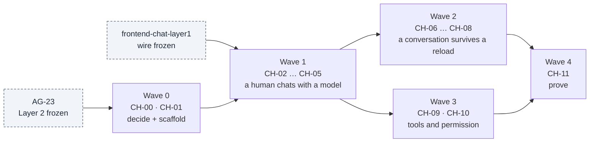
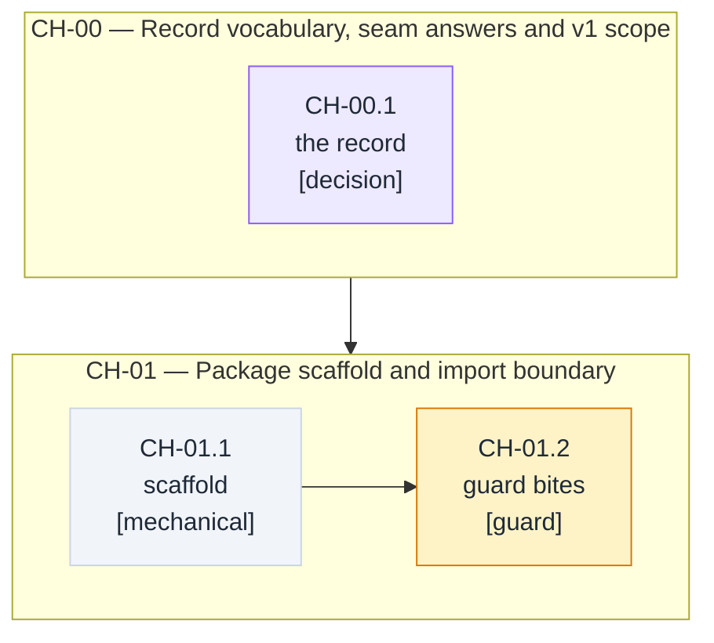
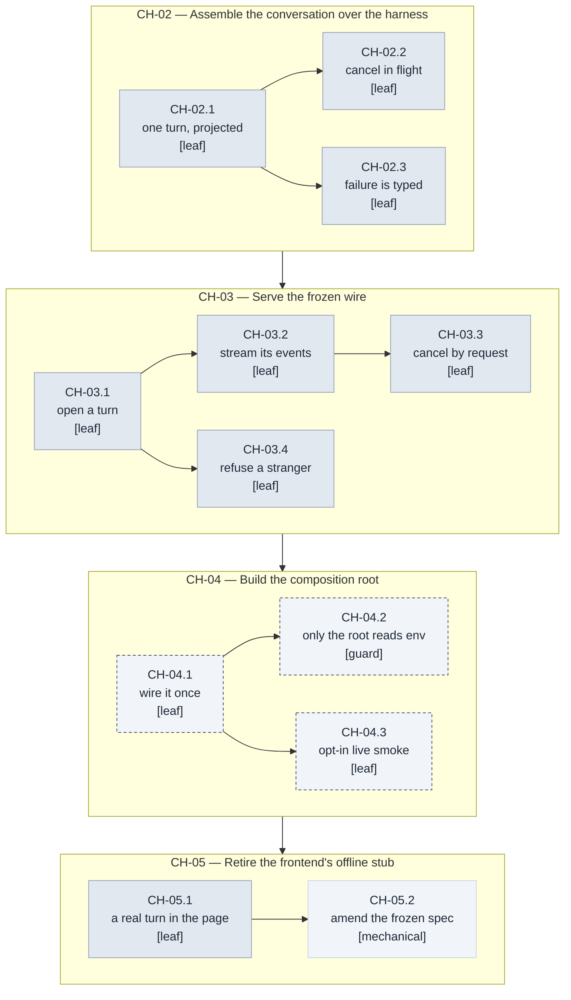
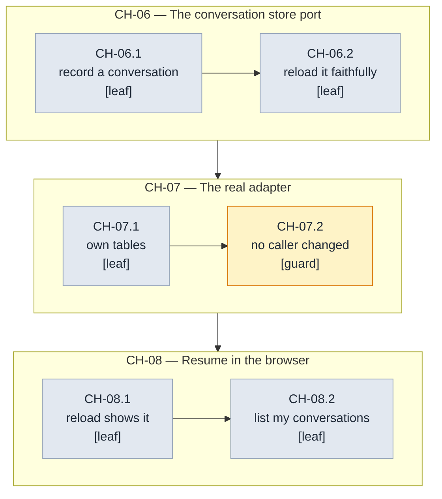
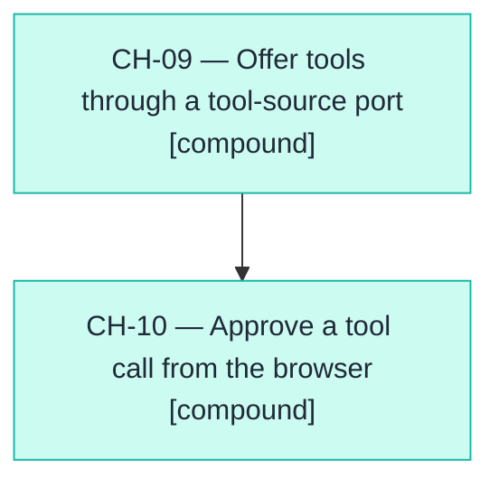
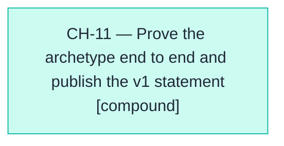

# Layer 3 milestones and task graph — `cachicamas_chat`, the chat archetype

> **Status:** In progress — **8 of 12** milestones shipped. **CH-00 is the first milestone.** After CH-03 the archetype owns its HTTP+SSE serving surface: `POST /api/agent/turns`, `GET …/events`, `DELETE …/:id` — the frozen wire that `frontend-chat-layer1` already drives. CH-04 (composition root, env wiring) shipped 2026-08-24: `backend/agent/src/cmd/chat/` now reads every required env var, installs the OpenTelemetry SDK, builds the openrouter provider + JWE IdentityResolver shim, mounts the chat surface, and binds Echo with graceful OTel shutdown on SIGTERM/SIGINT. CH-07 (chat store adapter, swap-in of the real database adapter) shipped 2026-08-24: `backend/agent/src/chat/store_postgres.go` implements the same two methods of the closed `ConversationStore` port, the chat-owned forward-only migration runner + 0001_init.sql land in `backend/agent/src/chat/{migrator,migrations}/`, the composition root reads `CACHICAMAS_CHAT_STORE_DSN` and dials Postgres through `pgx/v5/stdlib`, and the CH-07.2 guard at `backend/agent/src/chat/store_guard_test.go` walks the archetype's own file tree to prove the adapter swap changed no caller. CH-08 (browser resume) remains.
> **Scope:** this is the plan for **one archetype**, not for the layer. Layer 3 is the position in the stack where policy, resources, persistence and frontends live ([ADR 0009 § D2](../../adr/0009-redefine-cachicamas-as-a-multiplayer-agentic-system.md)); `cachicamas_chat` is one occupant of that position, and `cachicamas_coding` ([doc 0004](./0004-cachicamas-coding-layer-3-task-graph.md)) is another. Neither defines the layer.
> **Entry gate:** [AG-23 — the Layer 3 readiness contract](./0003-cachicamas-agent-layer-2-task-graph.md) for everything that consumes the harness. Layer 2 is frozen and complete at 24 of 24; this document is its first real consumer.
> **References:** [cachicamas agent stack v2](../0001-cachicamas-agent-stack-v2.md) · [ADR 0004](../../adr/0004-adopt-tau-3-layer-agentic-architecture.md) · [ADR 0005](../../adr/0005-promote-agent-stack-to-own-module.md) · [ADR 0007 — the DAG convention](../../adr/0007-adopt-dag-convention-for-task-graphs.md) · [ADR 0009](../../adr/0009-redefine-cachicamas-as-a-multiplayer-agentic-system.md) · [`agent-layer3-handoff`](../../../openspec/specs/agent-layer3-handoff/spec.md) · [`frontend-chat-layer1`](../../../openspec/specs/frontend-chat-layer1/spec.md)
> **Sibling plans:** [Layer 1 task graph (doc 0002)](./0002-cachicamas-ai-layer-1-task-graph.md) · [Layer 2 task graph (doc 0003)](./0003-cachicamas-agent-layer-2-task-graph.md) · [the coding archetype (doc 0004)](./0004-cachicamas-coding-layer-3-task-graph.md)
> **Target packages:** `backend/agent/src/chat/` (the archetype) and `backend/agent/src/cmd/chat/` (its composition root), per [ADR 0005 § D2](../../adr/0005-promote-agent-stack-to-own-module.md). One root **per archetype**, not one per repository.
> **Date:** 2026-08-22.
> **Milestone identifiers are append-only.** CH-NN ids follow the same rule as AI-NN, AG-NN and CO-NN: append, never renumber; insertion points are `Blocks:` fields. Node identifiers (`CH-NN.p`) are equally append-only.

> [!IMPORTANT]
> **Authoring constraint, inherited from the v2 reference.** This document states behaviors as Gherkin scenarios and what evidence closes each node. It never states type names, field names, or signatures for code that does not exist — each milestone's SDD cycle owns those. It cites only artifacts that exist at HEAD, and it is implementation-language-agnostic: tool bindings live only in [Method](#method--sdd-milestone-rules).

---

## What this document is, and is not

**`cachicamas_chat` is the thinnest archetype that is still a real one.** It offers a human one capability — a conversation with a model — and it fills every Layer 2 seam that capability touches. It is scheduled first not because it is the most valuable archetype but because it is the **cheapest complete proof** that the architecture works: an archetype that ships end to end, through the real frontend, without reaching through a single boundary.

**It is not a stepping stone to the coding archetype, and it does not replace it.** [Doc 0004](./0004-cachicamas-coding-layer-3-task-graph.md) plans `cachicamas_coding` and remains valid and unamended. Two archetypes may be planned at once; ADR 0009 § D2 says an occupant never defines the position. What this document takes from doc 0004 is only the **left-hand column** of its obligations table — the rules that bind *any* archetype — and none of its right-hand answers.

**A second archetype is additive.** This one brings `src/chat/` and `src/cmd/chat/`, fills the same Layer 2 seams with its own answers, and changes no file in `src/agent/` or below. If it ever cannot — if it needs a capability the runtime does not expose — the defect is in Layer 2's seam set, and the fix is a [doc 0003 living-graph amendment](./0003-cachicamas-agent-layer-2-task-graph.md), never a shortcut import, a fork of the harness, or a parallel mechanism.

---

## Outcome first

Walking every leaf of this graph to green, in dependency order, produces the thing a user runs: **an authenticated employee opens `/chat` in a browser, types a message, and watches a real model answer token by token.** Stop cancels the turn. A failure arrives as a typed error in the conversation rather than a spinner that never ends. Reloading the page brings the conversation back. Behind that page sits a Layer 3 archetype that defines its own ports, fills every Layer 2 seam it uses with a stated answer, persists conversations in tables it owns, and is wired together in exactly one place that nothing imports.

It produces one thing more, and it is the reason this archetype is scheduled first: **the stack's first end-to-end proof with a real consumer.** [AG-23](../../../openspec/specs/agent-layer3-handoff/spec.md) proved Layer 2 was *consumable* by an external test package standing in for an archetype. This document replaces that stand-in with a real one — or it finds the seam that was missing, which is the same value delivered as a defect report.

## Quick navigation

| Section | What it settles |
| --- | --- |
| [Sources and research](#sources-and-research) | Requirements inventory · SOTA digest · inconsistency register |
| [Scope boundary](#scope-boundary) | Owns / must not own / wording traps |
| [Method](#method--sdd-milestone-rules) | Node grammar citation, evidence gate, TDD cycle |
| [Entry gate](#entry-gate) | What must be frozen upstream before a wave opens |
| [Global dependency graph](#global-dependency-graph) | Wave-level DAG + delivery sequence |
| [Wave 0](#wave-0--decide-and-scaffold) · [Wave 1](#wave-1--a-human-chats-with-a-model-in-the-browser) · [Wave 2](#wave-2--a-conversation-survives-a-reload) · [Wave 3](#wave-3--tools-and-permission) · [Wave 4](#wave-4--prove) | The milestones |
| [Completion checklist](#completion-checklist--the-chat-archetype) | Every box has a closing node |
| [Explicitly deferred](#explicitly-deferred-until-after-v1) | Absence as a decision, with its seam |
| [Traceability spine](#traceability-spine) | Requirement → node, two-way |

---

## Sources and research

### Requirements inventory (Phase 0)

Every claim this plan executes, with a stable handle. A requirement that reaches no node is a bug in this document.

| Id | Requirement (cited) |
| --- | --- |
| R-01 | cachicamas is a multiplayer agentic system for building and running a company; specialist agents are what employees talk and work with (ADR 0009 § D1) |
| R-02 | An archetype is the implementation of one specialist agent: its policy, tools, resources, persistence, and frontend (ADR 0009 § D2) |
| R-03 | Fill every seam Layer 2 names — an unfilled seam is not a default, it is an unbuildable session (v2 § 5, doc 0004 obligations table) |
| R-04 | Define the ports you need as your own contracts; never reach into runtime internals (v2 § 5) |
| R-05 | Consume the agent event stream and nothing else; a capability the stream lacks is a Layer 2 amendment, never a private channel (v2 § 5) |
| R-06 | Exactly one composition root, imported by nothing; the only package that reads the environment and the only one permitted the OTel SDK (v2 § 5.2, ADR 0005 § D3) |
| R-07 | Reach other backend modules over the network only, never by import (ADR 0005 § D1 row 3) |
| R-08 | Each business system owns its own tables; no archetype writes to another system's schema (ADR 0009 § D6) |
| R-09 | MCP is the standard pattern by which archetypes reach business systems (ADR 0009 § D4) |
| R-10 | Everything that consumes the harness tests against the AG-23 scripted kit, never against a live provider (doc 0004 § method; `agent-layer3-handoff` R-L3H-003) |
| R-11 | The browser wire is already frozen: a turn is opened by request, its events arrive on a subscribed stream, and it is cancelled by a discrete signal (`frontend-chat-layer1` REQ-1, REQ-2) |
| R-12 | A backend error surfaces inline as a typed envelope and the client never auto-retries — retry is a harness concern (`frontend-chat-layer1` REQ-4; v2 § 4.1) |
| R-13 | The dev-mode offline literal exists only because no backend is wired; a real backend must retire it on the record (`frontend-chat-layer1` REQ-5) |
| R-14 | Access to the conversation surface is authenticated, and a participant sees only their own conversations (`frontend-chat-layer1` REQ-3) |
| R-15 | A permission decision must be a suspension inside the loop; if approval happens out of band the event stream stops being a complete description of the session (v2 § 6 seam 2) |
| R-16 | Assistant text is rendered sanitized; raw model HTML is never injected (`frontend-chat-layer1` REQ-6) |
| R-17 | Higher layers may be added above Layer 3; cross-archetype coordination is not an archetype's job (ADR 0009 § D3) — recorded as a non-goal, not built here |

### Research digest (Phase 1)

State of the art for the one problem this archetype has that no prior cachicamas document has solved: **carrying a long-running agent run to a browser over the network.**

| Finding | Source | What it changed here |
| --- | --- | --- |
| Open-then-subscribe (a request that starts the task, then a separate subscription for its events) is the settled shape for agent chat backends | [LangGraph fullstack SSE streaming](https://deepwiki.com/agentailor/fullstack-langgraph-nextjs-agent/6.3-sse-streaming) | Confirmed the wire the frontend already froze (R-11); no redesign, and CH-03's node split follows the two halves |
| Server-sent events remain the default over websockets for one-directional agent output; bidirectionality is the only thing that justifies the upgrade | [Agent streaming protocol decision matrix, 2026](https://agentmarketcap.ai/blog/2026/04/07/agent-streaming-architecture-sse-websocket-http-2026) | Settled a question this plan would otherwise have re-opened. Recorded as a non-goal rather than a milestone: v1 keeps the frozen transport |
| Resumable reconnect is not a transport feature — honouring a last-seen-event marker requires server-side replay over a durable, ordered event log. Practitioners report the first implementation takes a week and the edge cases take a month | [Everyone said SSE token streaming was easy](https://zknill.io/posts/everyone-said-sse-token-streaming-was-easy/) · [Resume tokens and last-event ids](https://ably.com/blog/resume-tokens-last-event-id-llm-streaming-reconnection) | **Changed the plan.** Resumable mid-turn reconnect is removed from v1 and recorded in the deferred register against a named seam. Wave 2 delivers *reload fidelity between turns*, which is cheap, instead of *reconnect fidelity within a turn*, which is not |
| A real, shipped instance of exactly that failure: an agent platform's event stream silently loses events on reconnect because no replay exists behind it | [opencode #25657](https://github.com/anomalyco/opencode/issues/25657) | Named in the deferred register as the failure mode the deferral must not be mistaken for having solved |
| The event stream is a transport for updates, never the store of record; durable state must be recoverable independently of any connection | [SSE as core infrastructure for agentic platforms](https://medium.com/@balajibal/understanding-server-sent-events-core-infrastructure-for-agentic-platforms-b42f348c4789) | **Changed the plan.** Conversation persistence became its own milestone behind its own port (CH-06) instead of a property of the transport, and the port-fake-swap pattern applies: in-memory adapter demoable, real database adapter late |
| Tool approval in a browser agent is an explicit protocol carried on the same stream as the output, and an approval request is only decidable if it carries what the agent is about to do | [AG-UI human approval](https://learn.microsoft.com/en-us/agent-framework/integrations/by-component/ui/ag-ui/) · [LangChain human-in-the-loop](https://docs.langchain.com/oss/python/langchain/frontend/human-in-the-loop) | Confirmed R-15 from outside the project, and fixed wave 3's shape: the approval round-trip rides the existing event stream, and the decision returns through the same turn rather than a side channel |

**What the research did not change:** the wire format, the auth chain, and the error envelope. All three were already frozen by `frontend-chat-layer1` and all three match current practice.

### Inconsistency register (Phase 2)

| # | Conflict, both sides cited | Disposition |
| --- | --- | --- |
| 1 | ADR 0009 § D7(b) reserves *"milestone doc 0005 (prefix `DF-`)"* for the re-scoped PRD 0001 delivery loop. This document takes 0005 with prefix `CH-`. | **Reconciled, and recorded here rather than in the ADR.** Milestone numbers are assigned by the milestone sequence's own append-only rule at creation time, not reserved by decision records. ADR 0009 is deliberately left unedited: an ADR fixes decisions, not filenames, and amending it to track a filename would couple the two surfaces the project keeps apart. The delivery-loop document takes the next free number when it is written. `DF-` remains unused and free. |
| 2 | Doc 0004 § Outcome-first calls the coding archetype *"the stack's only end-to-end proof that the architecture works"* and schedules it first. This document ships an archetype before it. | **Reconciled without amending doc 0004.** That sentence is true of the plan that existed when it was written — CO was the only archetype planned. It claims priority among *planned* archetypes, not exclusivity. Doc 0004's own § "What this document is, and is not" already states that being first "is the only thing that makes it special", so the claim transfers to whichever archetype ships first. No milestone, node, edge or acceptance criterion of doc 0004 changes; CO-23.1's first-archetype report now has a predecessor to compare against, which strengthens it. |
| 3 | Doc 0004 persists sessions as append-only records under the user's home directory (v2 § 5.2, CO-15). A browser archetype serving many authenticated employees cannot. | **Reconciled.** v2 § 5.2's home-directory answer is explicitly *"how sessions persist"* in doc 0004's **right-hand** column — this archetype's answer, not a layer rule, as ADR 0009 § D6 makes explicit for the sibling case. This archetype persists server-side, per participant, in tables it owns (R-08). The layer obligation both archetypes share is only *that* persistence sits behind the archetype's own port. |
| 4 | `frontend-chat-layer1` REQ-5 **mandates** the literal offline phrase whenever the backend is unreachable. This plan makes the backend reachable. | **Reconciled.** REQ-5 is a dev-mode honesty requirement whose stated purpose is to make an architectural gap greppable. Closing the gap therefore requires a recorded **spec delta** modifying REQ-5, never a silent deletion of the string. CH-05.2 owns that delta and closes on it. |
| 5 | ADR 0009 § D4 makes MCP the standard business-system integration pattern, and this archetype integrates no business system. | **Reconciled.** D4 binds archetypes that *reach* a business system; a conversation surface owns none. MCP is recorded in the deferred register against its seam (the tool-source port, CH-09), so its absence reads as sequencing rather than omission. The Database Administrator archetype (ADR 0009 § D5) is the first one D4 actually binds. |
| 6 | ADR 0009 § D7(a) has not landed: shipped Layer 2 artifacts and the promoted `agent-contract-vocabulary` spec still say *"a Layer 3 application"*. | **Reconciled by read-with-substitution**, exactly as ADR 0009 establishes. Where a cited Layer 2 artifact says "application", this document reads "archetype". CH-00.1 records the substitution so a first implementer meets it as a stated convention rather than as drift. This document does not attempt the rename; that is D7(a)'s own SDD change. |

---

## Scope boundary

**Any Layer 3 archetype owns** — the obligations, not the list: a port for every Layer 2 seam it fills and their implementations; whatever tools it offers the model; whatever resources it feeds the system prompt; its persistence; its frontend; its composition root.

**This archetype owns, concretely:** the conversation — one participant, one model, a sequence of turns; the projection from the agent event stream onto the frozen browser wire; the network surface that opens, streams and cancels a turn; the conversation store port and its adapters; the tables that store conversations; the tool-source and permission ports it fills, and their v1 answers; the system prompt it assembles; the composition root at `src/cmd/chat`; and the frontend delta that retires the offline stub.

**No Layer 3 archetype may own:** the agent loop, harness internals, or any Layer 2 protocol — it injects policy, it does not re-implement mechanism; provider adapters or wire formats (Layer 1); environment reads or flag parsing anywhere except its composition root; the OTel SDK anywhere except that root; another business system's tables (ADR 0009 § D6); cross-archetype coordination, which ADR 0009 § D3 reserves for a layer above this one.

**This archetype specifically does not own:** the coding archetype's tools, skills, prompts, slash commands, session format, price table or print-mode frontend — all owned by [doc 0004](./0004-cachicamas-coding-layer-3-task-graph.md); the identity and session cookie chain, owned by the existing `frontend-auth` capability; the browser's rendering, sanitization and route guard, owned by `frontend-chat-layer1` and consumed here unchanged.

Three wording traps, recorded now:

- **"The chat archetype" is not "the chat page."** The page exists already and is frozen. This document is the archetype *behind* it: policy, ports, persistence and the root. When a milestone below says "the conversation", it means the archetype's model of one, not a component in a browser.
- **"Simple" does not license an unfilled seam.** A chat with no tools still has a tool-source seam, and its v1 answer is *an empty source, stated*. R-03 is the rule that makes the difference between an answer and an omission, and CH-00.1 is where every seam gets one.
- **"It works in the browser" is not the exit condition of wave 1.** Wave 1 exits when a *real* turn streams from a *real* provider through the archetype into the page. A green frontend suite against a fake proves the client, which `frontend-chat-layer1` already proved.

---

## Method — SDD milestone rules

This document inherits [node grammar](./0002-cachicamas-ai-layer-1-task-graph.md#node-grammar), [leaf anatomy](./0002-cachicamas-ai-layer-1-task-graph.md#leaf-anatomy), [split triggers](./0002-cachicamas-ai-layer-1-task-graph.md#split-triggers), [the charter convention](./0002-cachicamas-ai-layer-1-task-graph.md#milestone-charter), [walking-skeleton ordering](./0002-cachicamas-ai-layer-1-task-graph.md#ordering-inside-a-milestone) and [the living-graph clause](./0002-cachicamas-ai-layer-1-task-graph.md#the-graph-is-alive--the-revert-and-record-clause) from doc 0002, and the DAG contract from [ADR 0007](../../adr/0007-adopt-dag-convention-for-task-graphs.md). Cited, not restated.

- **Evidence gate.** A backend leaf closes on recorded green `make test` in `backend/agent/`. A frontend leaf closes on recorded green `pnpm --filter @cachicamas/frontend test:ci`. Nodes that cross both name both. Per-node exceptions are declared on the node.
- **A cached run is not evidence.** `make test` carries no count flag, so an uncached run is proven by clearing the test cache first — the same discipline `agent-layer3-handoff` S-L3H-002 records for the consumer proof. A leaf closed on a cached suite is not closed.
- **TDD cycle per scenario:** RED (the test transcribed from the scenario, failing for the stated reason) → implementation → GREEN → refactor under green → review. The scenario never changes during refactor.
- **SDD:** each milestone is one SDD change under its declared slug; its leaves become that change's tasks.
- **Test against the kit, never the wire.** Every node that consumes the harness drives it through the AG-23 scripted kit (R-10). Exactly one node in this document touches a live provider — CH-04.3's opt-in smoke check — and it is marked, skipped by default, and never on the evidence path of another node.
- **Sizing:** prefer under 250 changed lines per milestone; reassess before 400. Only waves 0–2 are refined to Gherkin leaves; waves 3–4 carry `Refinement: deferred` and are refined just-in-time in the PR that opens them.

---

## Entry gate

**One gate, already open.** Every milestone in this document consumes the harness, its event vocabulary, or its test kit, so every one of them is gated on **AG-23** — the Layer 3 readiness contract. Layer 2 is complete at 24 of 24 and AG-23 is merged, so the gate is satisfied at authoring time and no milestone here is scheduled against an unfrozen surface.

What the gate promises, and this document relies on by name: a harness constructible through the public surface only, from injected fakes (R-L3H-001); an importable kit that scripts provider turns, tool results, permission decisions and interrupts (R-L3H-003); an exported stream validator (R-L3H-003); and a frozen, capability-enumerated v1 surface naming every seam's injection point and v1 default (R-L3H-006). A capability this plan needs and that enumeration does not promise is a [doc 0003 amendment](./0003-cachicamas-agent-layer-2-task-graph.md), never an assumption.

**Second gate, frontend side:** the browser wire frozen by `frontend-chat-layer1` REQ-1 … REQ-4. It is a contract this document consumes and, in exactly one place (CH-05.2), amends on the record.

---

## Global dependency graph



Parallelism worth exploiting: wave 2 and wave 3 are independent of each other and both depend only on wave 1 — a second implementer can open wave 3 while wave 2 is in flight. Inside wave 1, CH-02 and CH-03 are strictly ordered (the projection must exist before it can be served), but CH-05's frontend work can be prepared against CH-03's shape before CH-04 lands.

### Delivery sequence

| Wave | Milestones | Gate | Exit condition (the wave's value) |
| --- | --- | --- | --- |
| 0 — Decide and scaffold | CH-00, CH-01 | AG-23 | Vocabulary, seam answers and v1 scope are recorded; the package exists and its import guard is shown to bite. |
| 1 — A human chats with a model | CH-02 … CH-05 | Wave 0 + the frozen browser wire | An authenticated employee types in `/chat` and a real model streams back; Stop cancels; a failure arrives typed. The offline literal is gone, on the record. |
| 2 — A conversation survives a reload | CH-06 … CH-08 | Wave 1 | Conversations persist per participant in the archetype's own tables; reloading the page brings the conversation back; a participant sees their own list. |
| 3 — Tools and permission | CH-09, CH-10 | Wave 1 | The model can call a tool, and the human approves it from the browser through a suspension carried on the same event stream. |
| 4 — Prove | CH-11 | Waves 2 and 3 | The end-to-end acceptance passes deterministically and the v1 completion statement is published. |

**First SDD to start: CH-00.**

---

## Wave 0 — Decide and scaffold

The wave's value: everything after it is cheap and safe. Nothing here is demoable to a human, which is what makes it a wave 0 rather than a wave 1.



### CH-00 — Record the archetype's vocabulary, seam answers and v1 scope

SDD change: `cachicamas-chat-vocabulary-and-scope` · Closes: R-02, R-03, and register rows 3, 5, 6.

**Charter**

- **Goal:** state, once and in one durable artifact, what this archetype's words mean, what answer it gives to every Layer 2 seam it touches, and what it does not do in v1.
- **Deliverable:** a decision record in the change folder, cited by every milestone below.
- **Acceptance:** Given the record, When a reader asks what this archetype's answer is to any seam Layer 2 names, Then the record answers it directly and names the seam's injection point, without the reader consulting source.
- **Depends on:** nothing — the first milestone. **Blocks:** CH-01.
- **Out of scope:** implementing any answer — owned by every later milestone. Renaming "application" to "archetype" in Layer 2's promoted spec — owned by ADR 0009 § D7(a)'s own SDD change.
- **Notes:** the trap this milestone exists to prevent is a seam left implicit. "This archetype has no tools" is not a seam answer; "the tool source is empty in v1, injected at session construction, and CH-09 is where it stops being empty" is.

#### CH-00.1 — Answer every question the record must close `[decision]`

**Closing checklist** — the record is closed when each question below has a written answer a reader can verify:

1. What does this archetype call a conversation, a turn, a message and a participant, and which Layer 2 term does each map onto?
2. For **every** seam the frozen AG-23 enumeration names, what is this archetype's v1 answer, and at which injection point is it supplied? Seams with a deliberately empty answer are listed with that answer, never omitted.
3. What is the archetype's name and package path, and what is its composition root's path?
4. Does this archetype write to a database, and to whose tables? (R-08 — the answer must name the owner, not just the intent.)
5. Which frontend attaches, and what about its wire is already frozen and therefore not this document's to design?
6. What is explicitly out of v1, and against which seam does each deferral attach?
7. Which cited Layer 2 artifacts still say "a Layer 3 application", and what is the recorded substitution rule for reading them? (Register row 6.)

- **Depends on:** nothing.
- **Out of scope:** the package itself — owned by CH-01.1.

### CH-01 — Scaffold the package and make its import boundary bite

SDD change: `cachicamas-chat-package-scaffold` · Closes: R-06 (the boundary half), R-07.

**Charter**

- **Goal:** the archetype's package and its composition root exist, and the repository's existing import guard denies everything this position forbids them.
- **Deliverable:** two packages and one extension to **the** existing deny-by-default import guard.
- **Acceptance:** Given a source file placed in the archetype package that imports something the position forbids, When the guard runs, Then it fails naming the file and the denied path.
- **Depends on:** CH-00. **Blocks:** CH-02, CH-03.
- **Out of scope:** any behavior — the packages ship empty of policy. A second guard — the existing one is *extended*, never cloned, exactly as `agent-layer3-handoff` R-L3H-002 requires.
- **Notes:** the forbidden closure for this position is: the OTel SDK anywhere but the root; any `src/cmd/…` package from below the root; any Go package of `database_administrator` or `workspace_syncer` (network only, R-07); and Layer 2 internals.

#### CH-01.1 — Create the archetype package and its composition root `[mechanical]`

- **Check evidence:** both packages build; the composition root's binary builds; nothing imports the root.
- **Depends on:** nothing.
- **Out of scope:** the guard extension — owned by CH-01.2.

#### CH-01.2 — Extend the import guard to the archetype's forbidden closure `[guard]`

- **Bite proof:**

```gherkin
Feature: the archetype's import boundary

Scenario: the guard bites on a forbidden module import
  Given a scratch file in the archetype package importing a Go package of another backend module
  When the import guard runs
  Then it fails naming the scratch file and the denied path
  And the failure cites the deny-by-default rule rather than a missing allowlist entry

Scenario: the guard bites on the observability SDK below the root
  Given a scratch file in the archetype package importing the observability SDK
  When the import guard runs
  Then it fails naming the file
  And the same import inside the composition root passes

Scenario: the guard is green on the merged tree
  Given the merged change with every scratch file removed
  When the import guard runs
  Then it passes
  And the merged diff contains no second, self-contained guard inside the archetype tree
```

- **Depends on:** CH-01.1
- **Out of scope:** the runtime-behavior boundary — a guard proves what may be imported, not what is done with it.

---

## Wave 1 — A human chats with a model in the browser

The wave's value, and the whole point of the document: **an authenticated employee types a message in `/chat` and a real model answers, streaming.** CH-02.1 is the walking skeleton — the thinnest path from a prompt to observable model output. Every later leaf widens it; none opens a second unintegrated front.



### CH-02 — Assemble the conversation over the harness

SDD change: `cachicamas-chat-conversation` · Closes: R-03, R-04, R-05, R-10, R-12.

**Charter**

- **Goal:** a conversation object that owns a harness, drives one turn, and projects the agent event stream onto the vocabulary the browser wire already speaks.
- **Deliverable:** the archetype's conversation and its event projection, driven entirely through the AG-23 kit.
- **Acceptance:** Given a conversation built from scripted fakes, When a prompt is driven to completion, Then the projected events carry the assistant's text in order and terminate exactly once.
- **Depends on:** CH-01. **Blocks:** CH-03, CH-06.
- **Out of scope:** the network surface — owned by CH-03. Persistence — owned by CH-06; a conversation here lives only as long as its caller. Tools and permission — owned by CH-09 and CH-10; v1 supplies the empty and permissive answers CH-00.1 records.
- **Notes:** the projection is the archetype's only reading of Layer 2 (R-05). If a browser-visible behavior needs an event the stream does not carry, that is a doc 0003 amendment and this milestone stops until it lands — it is never a private channel out of the harness.

#### CH-02.1 — Drive one turn and project its events onto the wire vocabulary `[leaf]`

- **Scenarios:**

```gherkin
Feature: one turn, projected

Scenario: walking skeleton — a prompt produces streamed assistant text
  Given a conversation built from a scripted provider that answers in three fragments
  When a prompt is driven to completion
  Then the projected events open the assistant's message once
  And they carry the three fragments in the order the provider produced them
  And they close the turn exactly once

Scenario: an event the wire does not name is not invented
  Given a run whose stream carries an event kind the browser wire has no name for
  When the projection runs
  Then that event produces no projected output
  And the projection records it as unmapped rather than discarding it silently

Scenario: two turns in one conversation continue the same transcript
  Given a conversation that has completed one turn
  When a second prompt is driven on the same conversation
  Then the second turn's request carries the first turn's exchange
  And the projected stream carries two complete turn brackets
```

- **Depends on:** nothing.
- **Out of scope:** cancellation and failure — owned by CH-02.2 and CH-02.3.
- **Split if:** the multi-turn transcript proves to need its own seam answer beyond what CH-00.1 recorded.

#### CH-02.2 — Cancel a turn in flight `[leaf]`

- **Scenarios:**

```gherkin
Feature: cancelling a turn

Scenario: a cancelled turn terminates once and keeps what it produced
  Given a turn held mid-stream at a test gate after two fragments have arrived
  When the conversation is asked to cancel that turn
  Then the projected stream terminates exactly once
  And its terminal event attributes closure to the cancellation rather than to completion
  And the two fragments already projected remain in the transcript

Scenario: cancelling a turn that already finished changes nothing
  Given a turn that has reached its terminal event
  When the conversation is asked to cancel that turn
  Then no further event is projected
  And the request is reported as a no-op rather than as an error
```

- **Depends on:** CH-02.1
- **Out of scope:** the network signal that requests cancellation — owned by CH-03.3.

#### CH-02.3 — Surface a provider failure as a typed terminal event `[leaf]`

- **Scenarios:**

```gherkin
Feature: failure reaches the human

Scenario: a provider failure terminates the turn with a typed error
  Given a scripted provider that fails after one fragment
  When the turn is driven
  Then the projected stream carries a typed error as its terminal event
  And the error carries a message safe to render as text
  And the conversation accepts a new prompt afterwards

Scenario: the archetype never retries on its own
  Given a scripted provider that fails once and would succeed on a second attempt
  When the turn is driven with the runtime's retry seam left at its recorded v1 answer
  Then the number of provider invocations matches that recorded answer
  And no retry is scheduled by the archetype itself
```

- **Depends on:** CH-02.1
- **Out of scope:** how the browser renders the error — frozen by `frontend-chat-layer1` REQ-4.

### CH-03 — Serve the frozen browser wire

SDD change: `cachicamas-chat-http-surface` · Closes: R-11, R-14, and register row 4's precondition.

**Charter**

- **Goal:** the network surface the browser already expects: open a turn, subscribe to its events, cancel it — and refuse anyone who is not its participant.
- **Deliverable:** the archetype's HTTP and streaming surface, serving the wire `frontend-chat-layer1` froze.
- **Acceptance:** Given an authenticated participant, When they open a turn and subscribe to its stream, Then the assistant's text arrives on that stream in order and the stream closes once when the turn ends.
- **Depends on:** CH-02. **Blocks:** CH-04, CH-05.
- **Out of scope:** resuming a stream after a dropped connection — deferred, see the register; the client half of the wire — already shipped and frozen; credential and provider resolution — owned by CH-04.
- **Notes:** this surface is served by the archetype but *mounted* by the composition root (CH-04). Nothing here reads the environment.

#### CH-03.1 — Open a turn and hand back its stream address `[leaf]`

- **Scenarios:**

```gherkin
Feature: opening a turn

Scenario: an accepted prompt returns a turn identity and where to listen
  Given an authenticated participant with a conversation
  When they submit a prompt
  Then the response carries a turn identity and the address of that turn's event stream
  And the turn is driving before the response is written

Scenario: a malformed prompt is refused with the frozen error envelope
  Given an authenticated participant
  When they submit a request whose prompt is absent or empty
  Then the response is refused with the envelope's validation kind
  And no turn is created
```

- **Depends on:** nothing.
- **Out of scope:** the streaming half — owned by CH-03.2.

#### CH-03.2 — Stream a turn's events to a subscribed client `[leaf]`

- **Scenarios:**

```gherkin
Feature: streaming a turn

Scenario: a subscriber receives the turn's events in order and the stream closes once
  Given a turn opened by an authenticated participant
  When the participant subscribes to that turn's stream and the turn runs to completion
  Then the subscriber receives the assistant's fragments in the order they were produced
  And the stream carries a terminal event
  And the connection closes exactly once

Scenario: a subscriber that arrives after the turn ended is told so, not left hanging
  Given a turn that has already reached its terminal event
  When a participant subscribes to that turn's stream
  Then the subscriber receives a terminal event immediately
  And the connection closes without waiting

Scenario: a client that disconnects mid-turn does not stop the turn
  Given a turn streaming to a subscribed participant
  When the subscriber's connection drops without a cancellation request
  Then the turn continues to its own terminal event
  And no goroutine remains blocked on the departed subscriber after the turn ends
```

- **Depends on:** CH-03.1
- **Out of scope:** replaying events the departed subscriber missed — deferred; the register names the seam.
- **Split if:** the disconnect case proves to need a durable event log to close, which would make it wave 2 work rather than this leaf's.

#### CH-03.3 — Cancel a turn by request `[leaf]`

- **Scenarios:**

```gherkin
Feature: cancelling from the browser

Scenario: a cancellation request stops the turn and closes its stream
  Given a turn streaming to its participant
  When the participant issues the cancellation signal for that turn
  Then the turn's stream carries a terminal event attributing closure to the cancellation
  And the connection closes exactly once
  And the text produced before the cancellation remains in the conversation

Scenario: cancelling an unknown turn is refused without side effects
  Given an authenticated participant
  When they issue a cancellation signal for a turn identity that does not exist
  Then the response is refused with the envelope's not-found kind
  And no other turn is affected
```

- **Depends on:** CH-03.2
- **Out of scope:** the loop-level cancellation mechanism — Layer 2's, consumed here through CH-02.2.

#### CH-03.4 — Refuse an unauthenticated or non-participant request `[leaf]`

- **Scenarios:**

```gherkin
Feature: only the participant reaches the conversation

Scenario: an unauthenticated request is refused before a turn exists
  Given a request carrying no valid session
  When it attempts to open a turn
  Then it is refused as unauthenticated
  And no turn is created and no provider call is made

Scenario: a participant cannot subscribe to another participant's turn
  Given two authenticated participants and a turn belonging to the first
  When the second subscribes to that turn's stream
  Then the subscription is refused
  And the refusal does not reveal whether the turn exists

Scenario: a participant cannot cancel another participant's turn
  Given two authenticated participants and a turn belonging to the first
  When the second issues that turn's cancellation signal
  Then the request is refused
  And the first participant's turn continues to its own terminal event
```

- **Depends on:** CH-03.1
- **Out of scope:** how identity is established — owned by the existing `frontend-auth` capability and consumed unchanged.

### CH-04 — Build the composition root

SDD change: `cachicamas-chat-composition-root` · Closes: R-06.

**Charter**

- **Goal:** exactly one package assembles this archetype from the environment, and nothing imports it.
- **Deliverable:** the composition root at `src/cmd/chat`, and the guard proving it is the only environment reader below the archetype.
- **Acceptance:** Given the built root, When it starts with a provider credential in its environment, Then it serves the archetype's surface and a real prompt reaches a real model.
- **Depends on:** CH-03. **Blocks:** CH-05.
- **Out of scope:** provider catalogs, model pickers and price tables — deferred, each named in the register; a login flow — owned by the existing auth capability.
- **Notes:** this is the only milestone in the document permitted to install the observability SDK, and the only one that reads the environment (ADR 0005 § D3).

#### CH-04.1 — Wire the archetype from the environment in exactly one place `[leaf]`

- **Scenarios:**

```gherkin
Feature: one place where policy meets mechanism

Scenario: the root assembles a serving archetype from its environment
  Given an environment carrying a provider credential and a model selection
  When the root starts
  Then it serves the archetype's surface
  And every dependency the archetype uses was supplied by the root rather than read by the archetype

Scenario: a missing credential fails at startup, not at the first prompt
  Given an environment carrying no provider credential
  When the root starts
  Then it refuses to start, naming the missing credential
  And no surface is served

Scenario: nothing imports the root
  Given the merged tree
  When the root's importers are enumerated
  Then the set is empty
```

- **Depends on:** nothing.
- **Out of scope:** the guard that proves the exclusivity — owned by CH-04.2.

#### CH-04.2 — Prove nothing below the root reads the environment `[guard]`

- **Bite proof:**

```gherkin
Feature: the environment is read in one place

Scenario: the guard bites on an environment read below the root
  Given a scratch file in the archetype package reading an environment variable
  When the check runs
  Then it fails naming the file and the read
  And the same read inside the composition root passes

Scenario: the guard is green on the merged tree
  Given the merged change with the scratch file removed
  When the check runs
  Then it passes
```

- **Depends on:** CH-04.1

#### CH-04.3 — Prove one real turn against a live provider, opt in `[leaf]`

- **Scenarios:**

```gherkin
Feature: the wiring is real

Scenario: an opt-in check reaches a real model end to end
  Given a credential supplied through the opt-in environment marker
  When one short prompt is driven through the assembled root
  Then assistant text arrives on the stream
  And the turn terminates once

Scenario: the check skips cleanly with no credential
  Given no opt-in marker in the environment
  When the suite runs
  Then this check reports skipped
  And the suite is green
```

- **Depends on:** CH-04.1
- **Out of scope:** every other node's evidence — this is the document's only live-network check and no other node's gate depends on it.
- **Notes:** its recorded evidence is the skip **and** one recorded run against a live provider. It never gates another leaf, so a credential-less environment can still close the whole wave.

### CH-05 — Retire the frontend's offline stub

SDD change: `cachicamas-chat-frontend-wire` · Closes: R-13, R-16, register row 4.

**Charter**

- **Goal:** the page stops apologising for a missing backend, because the backend exists.
- **Deliverable:** the frontend delta that points the chat client at the served surface, plus the recorded spec amendment retiring the offline literal.
- **Acceptance:** Given the root serving and an authenticated employee on the chat page, When they submit a prompt, Then assistant text streams into the conversation and the offline literal appears nowhere.
- **Depends on:** CH-04.
- **Out of scope:** rendering, sanitization, the route guard and the error envelope — all frozen by `frontend-chat-layer1` and consumed unchanged; conversation history on reload — owned by CH-08.
- **Notes:** the literal is **mandated** by a promoted spec (register row 4). Deleting the string without the delta leaves a shipped requirement falsified by the shipped code, and nothing would fail.

#### CH-05.1 — Stream a real turn into the chat page `[leaf]`

- **Scenarios:**

```gherkin
Feature: the page talks to the archetype

Scenario: a submitted prompt streams assistant text into the conversation
  Given an authenticated employee on the chat page and the archetype serving
  When they submit a prompt
  Then assistant text appears in the conversation as it streams
  And the offline literal appears nowhere in the page

Scenario: stopping a turn from the page cancels it
  Given a turn streaming into the page
  When the employee stops it
  Then the stream closes
  And the partial assistant text remains visible
  And the input returns to a state that accepts a new prompt

Scenario: a backend failure surfaces inline and the page does not retry
  Given the archetype terminating a turn with a typed error
  When the page receives that terminal event
  Then the error message renders inline in the conversation
  And no retry is scheduled by the page
  And the input accepts a new prompt
```

- **Depends on:** nothing.
- **Out of scope:** the spec amendment — owned by CH-05.2.
- **Notes:** this leaf's evidence gate is both suites — the frontend suite and the backend suite — because the behavior is only true across the pair.

#### CH-05.2 — Amend the frozen frontend contract on the record `[mechanical]`

- **Check evidence:** a spec delta modifying the offline-honesty requirement, stating that its purpose — making an unwired backend greppable — is discharged by the archetype now serving the wire, and that the literal is retired rather than forgotten. The merged tree contains no occurrence of the literal, and the amended requirement's scenarios no longer assert it.
- **Depends on:** CH-05.1
- **Out of scope:** the other frozen requirements of that capability, which this change consumes unchanged.

---

## Wave 2 — A conversation survives a reload

The wave's value: **an employee closes the tab, comes back, and their conversation is still there.** The port-fake-swap pattern applies — CH-06 is demoable against an in-memory adapter and the wave's value attaches there; CH-07 lands the real database adapter as a separate, late, low-risk node.



### CH-06 — Define the conversation store port and its in-memory adapter

SDD change: `cachicamas-chat-conversation-store` · Closes: R-04, R-16, register row 3.

**Charter**

- **Goal:** conversation durability is a port this archetype owns, satisfied first by an adapter that needs no database.
- **Deliverable:** the store port and its in-memory adapter, with the conversation recorded as an append-only sequence.
- **Acceptance:** Given a conversation driven through two turns and then reloaded through the port, When the reloaded conversation is driven a third turn, Then the request carries both earlier exchanges.
- **Depends on:** CH-02. **Blocks:** CH-07, CH-08.
- **Out of scope:** the database — owned by CH-07; the browser surface for resuming — owned by CH-08.
- **Notes:** research finding 5 is the reason this is a port and not a property of the streaming surface. Anything that makes durability depend on a live connection has re-made the mistake the finding names.

#### CH-06.1 — Record a conversation as an append-only sequence `[leaf]`

- **Scenarios:**

```gherkin
Feature: recording a conversation

Scenario: every exchange is appended in order
  Given a conversation driven through two turns
  When its record is read through the port
  Then the record carries both exchanges in the order they occurred
  And no earlier entry was rewritten by a later one

Scenario: a cancelled turn is recorded with what it produced
  Given a turn cancelled after producing partial assistant text
  When the record is read
  Then the partial text is present
  And the turn is marked as ended by cancellation rather than by completion

Scenario: a failed turn is recorded as failed
  Given a turn terminated by a typed provider error
  When the record is read
  Then the turn is present and marked failed
  And a later turn on the same conversation still appends after it
```

- **Depends on:** nothing.
- **Out of scope:** faithfulness of reload — owned by CH-06.2.

#### CH-06.2 — Reload a conversation faithfully through the port `[leaf]`

- **Scenarios:**

```gherkin
Feature: reload fidelity

Scenario: a reloaded conversation continues the same transcript
  Given a conversation driven through two turns and then reloaded through the port
  When a third turn is driven on the reloaded conversation
  Then the request carries both earlier exchanges in their original order

Scenario: an identifier minted during a turn survives reload
  Given a turn whose exchange carries an identifier minted while it ran
  When the conversation is reloaded through the port
  Then that identifier is present and unchanged

Scenario: a reload of an unknown conversation is refused, not invented
  Given an identity no conversation was ever recorded under
  When a reload is attempted through the port
  Then it is refused as not found
  And no empty conversation is created as a side effect
```

- **Depends on:** CH-06.1
- **Out of scope:** the store's storage medium — the same scenarios must hold for every adapter, which is what CH-07.2 checks.

### CH-07 — Swap in the real database adapter

SDD change: `cachicamas-chat-store-adapter` · Closes: R-08.

**Charter**

- **Goal:** conversations live in tables this archetype owns, and swapping the adapter changes no caller.
- **Deliverable:** the database adapter behind the CH-06 port, its migration, and the guard proving the swap was a swap.
- **Acceptance:** Given the database adapter installed in place of the in-memory one, When CH-06's scenarios run unchanged against it, Then they pass.
- **Depends on:** CH-06. **Blocks:** CH-08.
- **Out of scope:** any other system's tables — ADR 0009 § D6 forbids it, and a schema question that is not this archetype's belongs to the Database Administrator archetype; connection and credential resolution — owned by CH-04's root.
- **Notes:** this is the late, low-risk node of the port-fake-swap pattern. If it turns out not to be low-risk, that is a finding about the port, and the living-graph clause applies.

> **Closed 2026-08-24** by PR `feat/chat-store-adapter-ch07` (12 commits on the branch; verify-report verdict PASS with 3 WARNINGs, no CRITICALs). The CH-07 charter acceptance (`0005:788`) holds via the shared scenario helper `chat.RunConversationStoreScenarios` running the CH-06 scenario text unchanged against both adapters — memory side passes at runtime; postgres side is `INTEGRATION=1`-gated. Total diff: 29 files / 2151 insertions / 24 deletions (2175 LOC vs the granted 1700 budget — pre-authorized `size:exception` by user preflight). WARNING: `INTEGRATION=1 make test` was not exercised in the archive worker (no docker postgres available); CI MUST run it before merge to satisfy the cross-process scenario `S-CCS-010`. WARNING: the substrate carve-out pattern at `backend/agent/src/agent/ch07_carveout_test.go` admits new `go.mod` deps per the R-AGP-003 same-commit rule; the AGENTS.md pointer is added in this archive (see A-4 follow-up to verify-report WARNING-3). The CH-06 prior body of `openspec/specs/chat-conversation-store/spec.md` is byte-unchanged at the ID level (lines 1–194's R-CCS-001..010, S-CCS-001..009, NFR-CCS-001..004 are all preserved); CH-07 amends it additively (R-CCS-011/012, NFR-CCS-005/006, S-CCS-010…014) per the spec's own amendment header.

#### CH-07.1 — Persist conversations in the archetype's own tables `[leaf]`

- **Scenarios:**

```gherkin
Feature: durable conversations

Scenario: a conversation written by one process is read by another
  Given a conversation recorded through the database adapter
  When it is read back through a separately constructed adapter over the same store
  Then the record matches what was written, in order

Scenario: the adapter writes only tables this archetype owns
  Given the merged migration
  When the tables it creates or alters are enumerated
  Then every one of them belongs to this archetype
  And no table owned by another system appears

Scenario: two participants' conversations never mix
  Given conversations recorded for two different participants
  When each participant's conversations are read
  Then neither set contains an entry belonging to the other
```

- **Depends on:** nothing.
- **Out of scope:** the caller-invariance proof — owned by CH-07.2.

#### CH-07.2 — Prove the adapter swap changed no caller `[guard]`

- **Bite proof:**

```gherkin
Feature: a swap is a swap

Scenario: the port's scenarios run unchanged against both adapters
  Given the conversation store scenarios from CH-06
  When they run against the in-memory adapter and against the database adapter
  Then both runs pass with the scenario text unchanged

Scenario: the guard bites when a caller reaches past the port
  Given a scratch file in the archetype naming the database adapter directly instead of the port
  When the check runs
  Then it fails naming the file and the bypassed port
```

- **Depends on:** CH-07.1

### CH-08 — Resume a conversation in the browser

SDD change: `cachicamas-chat-resume` · Closes: R-14 (the listing half), R-16 (the visible half).

**Charter**

- **Goal:** the durability of wave 2 becomes visible to the human it was built for.
- **Deliverable:** the surface and frontend delta that bring a conversation back on reload and list a participant's conversations.
- **Acceptance:** Given an employee who has held a conversation and reloaded the page, When the page loads, Then their conversation is shown as they left it.
- **Depends on:** CH-07, CH-05.
- **Out of scope:** branching, renaming, deleting and searching conversations — deferred, each named in the register; resuming a turn that was streaming when the tab closed — deferred, see the register's reconnect row.
- **Notes:** `frontend-chat-layer1` lists "session persistence across reloads" as out of its scope and hands it to Layer 3. This milestone is Layer 3 catching it.

#### CH-08.1 — Show a conversation again after a reload `[leaf]`

- **Scenarios:**

```gherkin
Feature: the conversation is still there

Scenario: reloading the page restores the conversation
  Given an employee who has completed two turns and reloads the page
  When the page loads
  Then both exchanges are shown in their original order
  And the input accepts a new prompt that continues the same conversation

Scenario: a reload during a streaming turn shows what was recorded
  Given an employee who reloads while a turn is streaming
  When the page loads
  Then the exchanges recorded before the reload are shown
  And the page does not claim the turn is still streaming
```

- **Depends on:** nothing.
- **Out of scope:** re-attaching to the in-flight turn's stream — deferred; the register names the seam and the failure mode.

#### CH-08.2 — List a participant's own conversations `[leaf]`

- **Scenarios:**

```gherkin
Feature: my conversations

Scenario: a participant sees their own conversations and no others
  Given two participants who have each held conversations
  When one of them requests their list
  Then the list contains only their own conversations
  And each entry identifies its conversation well enough to open it

Scenario: a participant with no conversations gets an empty list
  Given an authenticated participant who has never held a conversation
  When they request their list
  Then the list is empty
  And the response is a success rather than a not-found
```

- **Depends on:** CH-08.1
- **Out of scope:** ordering, paging and search over the list — deferred.

---

## Wave 3 — Tools and permission

The wave's value: **the model can do something, and the human says whether it may.** This is where the archetype stops being a passthrough and starts exercising the two Layer 2 seams that carry the runtime's real weight.

Both milestones are held coarse under lazy refinement. What wave 1 teaches about the projection, and wave 2 about durability, decides their shape — refining them now would bake a guess into every leaf.



### CH-09 — Offer tools through a tool-source port

SDD change: `cachicamas-chat-tool-source` · Closes: R-03 (the tool seam's real answer), R-09's seam. · **Refinement: deferred** — child nodes and scenarios land just-in-time in the PR that opens this wave.

**Charter**

- **Goal:** replace CH-00.1's recorded empty tool answer with a real port and at least one tool the model can call.
- **Deliverable:** the archetype's tool-source port, one tool behind it, and the tool-call events reaching the browser.
- **Acceptance:** Given a conversation whose tool source offers one tool, When the model calls it, Then the call and its result appear on the participant's stream and the turn continues with the result in the transcript.
- **Depends on:** CH-05. **Blocks:** CH-10.
- **Out of scope:** MCP tool sources — deferred against this port, which is exactly the seam ADR 0009 § D4 will attach to; sandboxing — deferred against the execution seam; the coding archetype's tools — owned by doc 0004.
- **Notes:** before refining, settle whether a tool source that can change between turns invalidates the cached request prefix, and whether this archetype should say so rather than quietly re-billing (v2 § 5.1). `frontend-chat-layer1` lists tool-call rendering as out of its scope, so a frontend delta is part of this milestone, not an assumption about the page.

### CH-10 — Approve a tool call from the browser

SDD change: `cachicamas-chat-permission` · Closes: R-15. · **Refinement: deferred** — child nodes and scenarios land just-in-time in the PR that opens this wave.

**Charter**

- **Goal:** a tool call the policy will not allow unilaterally becomes a question the human answers, carried on the same stream as everything else.
- **Deliverable:** the archetype's permission policy, the approval round-trip on the wire, and the frontend delta that asks.
- **Acceptance:** Given a tool call the policy defers, When the participant approves it from the browser, Then the suspended turn resumes and the tool's result reaches the transcript; and when they decline, the turn continues with the refusal recorded and no execution.
- **Depends on:** CH-09.
- **Out of scope:** remembered decisions and rule sets over tool names and arguments — deferred against the policy port; a permission mode selector — deferred.
- **Notes:** the binding constraint is v2 § 6 seam 2 — approval must be a suspension **inside the loop**, so that the event stream stays a complete description of the session. An approval that happens beside the stream is the defect this milestone exists to avoid, not a shortcut to it. Research confirms the same shape from outside the project, and adds one requirement worth carrying into refinement: an approval request is only decidable if it carries what the agent is about to do.

---

## Wave 4 — Prove

The wave's value: the claim that this archetype works becomes falsifiable rather than asserted.



### CH-11 — Prove the archetype end to end and publish the v1 statement

SDD change: `cachicamas-chat-v1-completion` · Closes: the completion checklist, and the first-archetype report Layer 2's handoff contract asked for. · **Refinement: deferred** — child nodes and scenarios land just-in-time in the PR that opens this wave.

**Charter**

- **Goal:** one deterministic acceptance drives the whole archetype, and one durable statement records what v1 is, what it is not, and what the first real consumer discovered about Layer 2's seams.
- **Deliverable:** the end-to-end acceptance and the v1 completion statement.
- **Acceptance:** Given the assembled archetype driven by scripted fakes, When the acceptance runs uncached, Then it exercises conversation, streaming, cancellation, failure, persistence, reload, tool call and approval in one ordered run, and every completion-checklist row cites a merged closing node.
- **Depends on:** CH-08, CH-10.
- **Out of scope:** a live-provider acceptance — CH-04.3 is the document's only live check and this one stays deterministic; a second archetype's report — not this document's.
- **Notes:** the statement's most valuable section is the one nobody plans for: **what Layer 2's seam set got wrong.** AG-23 froze that surface against a stand-in consumer. This document is the first real one, and where a seam turned out to be missing, misplaced or the wrong shape, saying so is the deliverable — a doc 0003 living-graph amendment, not a workaround recorded as a lesson.

---

## Completion checklist — the chat archetype

- [x] Vocabulary, every seam's v1 answer and its injection point, and v1 scope are recorded — closed by CH-00.1
- [x] The package and its composition root exist, and the import guard is shown to bite on the forbidden closure — closed by CH-01.2
- [x] A conversation drives turns over the harness and projects its events onto the browser wire — closed by CH-02.1
- [x] A turn can be cancelled in flight and terminates exactly once — closed by CH-02.2, CH-03.3
- [x] A provider failure reaches the human as a typed error, and the archetype never retries on its own — closed by CH-02.3
- [x] The frozen browser wire is served: open, stream, cancel — closed by CH-03.1, CH-03.2, CH-03.3
- [x] Only the participant reaches their conversation — closed by CH-03.4, CH-07.1, CH-08.2 (R-CHS-004.a/b for CH-03; remaining scope-fenced to CH-07/CH-08)
- [ ] Exactly one package reads the environment, installs the observability SDK, and is imported by nothing — closed by CH-04.1, CH-04.2
- [ ] One real turn against a live provider is recorded, and the suite stays green without a credential — closed by CH-04.3
- [x] The offline literal is retired by a recorded spec amendment, not a silent deletion — closed by CH-05.2
- [x] Conversations persist behind a port this archetype owns, in tables it owns — closed by CH-06.1, CH-07.1
- [x] A conversation reloads faithfully and continues the same transcript — closed by CH-06.2, CH-08.1
- [x] Swapping the store adapter changed no caller — closed by CH-07.2 (CH-07.1 ships the durable adapter; CH-07.2 ships the file-tree guard that proves the swap was a swap, R-04 / R-08 / R-CCS-010 / R-CCS-011 / R-CCS-012)
- [ ] The model can call a tool and the human can approve or decline it, on the same event stream — closed by CH-09, CH-10
- [ ] One deterministic acceptance drives the whole archetype uncached — closed by CH-11
- [ ] The v1 statement is published, every deferral seam-named, and what Layer 2's seam set got wrong is stated — closed by CH-11

## Explicitly deferred until after v1

| Capability | Seam where it attaches later | Decided by |
| --- | --- | --- |
| **Resumable mid-turn reconnect** — replaying events a dropped subscriber missed | The turn's event stream, which would need a durable ordered log behind it. **Not solved by wave 2:** reload fidelity restores what was *recorded between turns*; it does not replay a stream. The failure mode this deferral must not be mistaken for having fixed is the one [opencode #25657](https://github.com/anomalyco/opencode/issues/25657) shipped — events silently lost on reconnect | Research findings 3 and 4; recorded at CH-03.2 |
| **Multi-device and multi-tab delivery of one turn** | The same event stream and log | Research finding 3 — cross-device reliability is unsolved even where resumability shipped |
| **MCP tool sources** | The CH-09 tool-source port — the seam ADR 0009 § D4 attaches to when this archetype or another reaches a business system | ADR 0009 § D4; register row 5 |
| **Sandboxing of tool execution** | The execution seam Layer 2 already carries (v2 § 6 seam 3); v1's answer is "none", stated | CH-00.1 |
| **Remembered permission decisions and rule sets** | The CH-10 permission policy port | CH-10's charter |
| **Provider and model selection by the participant** | The composition root's resolution point (CH-04.1); v1 selects one model from the environment | CH-04's charter |
| **Cost and usage display** | The runtime's accounting seam and the price-table port doc 0004 defines; promoting it to shared Layer 3 code is a separate decision | v2 § 7 G10 |
| **Conversation branching, renaming, deletion and search** | The CH-06 store port and CH-08.2's listing | CH-08's charter |
| **A websocket transport** | The CH-03 surface. Research finding 2 settles that one-directional agent output does not justify it; only a bidirectional need would | Research finding 2 |
| **Promoting any part of this archetype into shared Layer 3 code** | These parts already sit behind their own ports and read nothing ambient, so promotion stays a move rather than a rewrite. The honest time to decide is when the second archetype exists to be measured against — which, with doc 0004 planned, is the first time this decision has ever had two data points | Doc 0004's deferred register, inherited |
| **Cross-archetype coordination** | A layer above 3, whose position ADR 0009 § D3 reserves and deliberately does not design | ADR 0009 § D3 (R-17) |

## Traceability spine

### Requirements and findings → closing nodes

| Source | Closed by |
| --- | --- |
| R-01 — a specialist agent employees talk with | The document's outcome; observably CH-05.1 |
| R-02 — an archetype is policy, tools, resources, persistence, frontend | CH-00.1 (stated), CH-09/CH-10 (tools), CH-06/CH-07 (persistence), CH-05 (frontend), CH-04 (assembly) |
| R-03 — fill every seam, an unfilled seam is unbuildable | CH-00.1 item 2; the empty answers become real at CH-09, CH-10 |
| R-04 — define your own ports | CH-06.1 (store port), CH-09 (tool source), CH-10 (policy) |
| R-05 — consume the event stream and nothing else | CH-02.1, and its unmapped-event scenario |
| R-06 — one composition root, only env reader, only SDK installer | CH-01.2, CH-04.1, CH-04.2 |
| R-07 — other modules over the network only | CH-01.2 |
| R-08 — each system owns its own tables | CH-07.1 |
| R-09 — MCP is the standard integration pattern | Deferred against CH-09's port; register row 5 |
| R-10 — test against the kit, never a live provider | Method § evidence gate; CH-02 throughout; CH-04.3 is the single marked exception |
| R-11 — the frozen wire: open, stream, cancel | CH-03.1, CH-03.2, CH-03.3 |
| R-12 — typed error inline, no client retry | CH-02.3, CH-05.1 |
| R-13 — the offline literal must be retired on the record | CH-05.2 |
| R-14 — authenticated, and only your own | CH-03.4, CH-08.2 |
| R-15 — approval is a suspension in the loop | CH-10 |
| R-16 — sanitized rendering; durable state independent of transport | CH-05.1 (consumed unchanged), CH-06.1, CH-06.2 |
| R-17 — higher layers may exist above Layer 3 | Non-goal; recorded in the deferred register |
| Research 1, 2 — open-then-subscribe; SSE over websocket | CH-03's node split; websocket in the deferred register |
| Research 3, 4 — resumability needs a durable log | CH-03.2's out-of-scope; the register's reconnect row |
| Research 5 — the stream is not the store of record | CH-06 exists as its own milestone rather than a property of CH-03 |
| Research 6 — approval rides the stream and must carry context | CH-10's charter note |
| Register 1 — the doc number | This document's number; ADR 0009 left unedited |
| Register 2 — doc 0004's first-archetype claim | This § What this document is; doc 0004 unamended |
| Register 3 — home-directory sessions are not a layer rule | closed by CH-06 (this PR); CH-07 carries the postgres adapter |
| Register 4 — the mandated offline literal | closed by CH-05.2 (PR <TBD>, this PR) |
| Register 5 — MCP binds archetypes with a business system | Deferred register |
| Register 6 — read "application" as "archetype" | CH-00.1 item 7 |

### Nodes → what they trace back to

| Node | Traces back to |
| --- | --- |
| CH-00.1 | R-02, R-03, register 3, 5, 6 |
| CH-01.1, CH-01.2 | R-06, R-07 |
| CH-02.1 | R-05, R-10 |
| CH-02.2 | R-11 (the cancel half) |
| CH-02.3 | R-12 |
| CH-03.1, CH-03.2, CH-03.3 | R-11, research 1 |
| CH-03.4 | R-14 |
| CH-04.1, CH-04.2 | R-06 |
| CH-04.3 | R-10's single marked exception |
| CH-05.1 | R-12, R-16 |
| CH-05.2 | R-13, register 4 (closed by CH-05.2) |
| CH-06.1, CH-06.2 | closed by CH-06 (R-04, R-16, research 5, register 3) |
| CH-07.1 | R-08 |
| CH-07.2 | R-04 |
| CH-08.1, CH-08.2 | R-14, R-16 |
| CH-09 | R-03, R-09's seam |
| CH-10 | R-15, research 6 |
| CH-11 | The completion checklist |

### Method sources

Identical to [doc 0002's](./0002-cachicamas-ai-layer-1-task-graph.md#method-sources); inherited without addition.
