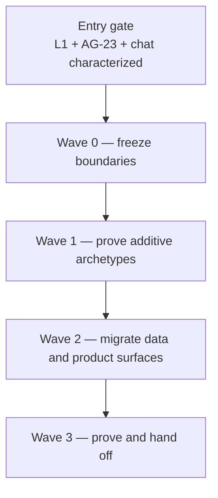
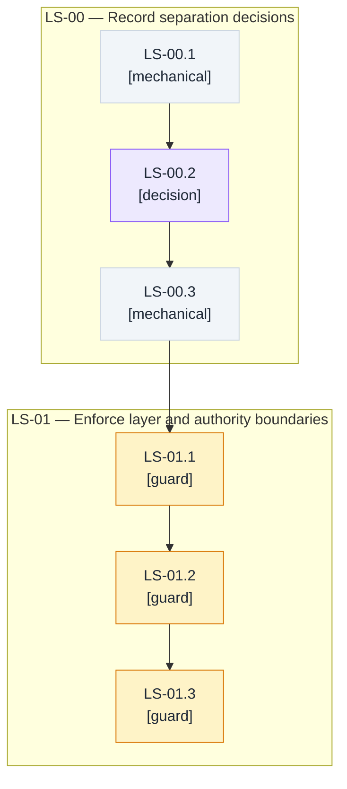
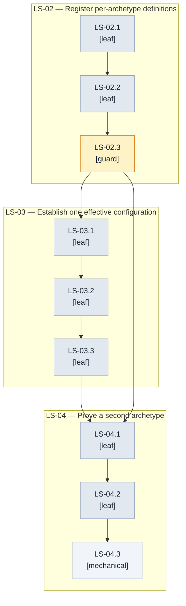
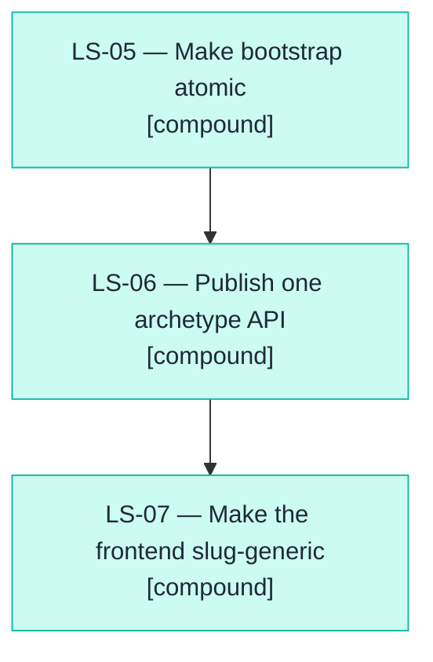
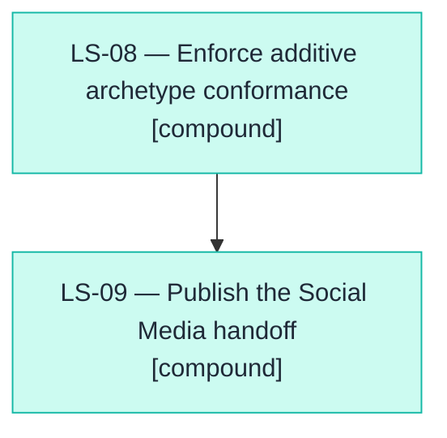

# Cachicamas agent-stack separation — milestones and task graph

> **Status**: 0 of 10 milestones complete. **First SDD to start**: LS-00.
> **Entry gate**: characterize the current contracts and freeze the shipped Layer 1 conformance evidence, AG-23 Layer 3 readiness contract, and completed chat-archetype behavior before moving ownership.
> **References**: [agent-stack architecture v2](../0001-cachicamas-agent-stack-v2.md) · [Layer 1 plan](./0002-cachicamas-ai-layer-1-task-graph.md) · [Layer 2 plan](./0003-cachicamas-agent-layer-2-task-graph.md) · [chat-archetype plan](./0005-cachicamas-chat-archetype-task-graph.md) · [ADR 0004](../../adr/0004-adopt-tau-3-layer-agentic-architecture.md) · [ADR 0005](../../adr/0005-promote-agent-stack-to-own-module.md) · [ADR 0006](../../adr/0006-resolve-skill-and-prompt-source-of-truth.md) · [ADR 0007](../../adr/0007-adopt-dag-convention-for-task-graphs.md) · [ADR 0009](../../adr/0009-redefine-cachicamas-as-a-multiplayer-agentic-system.md).
> **Date**: 2026-08-27.
> **Append-only rule**: once the first milestone merges, ids are never renumbered; new work appends the next free number; amendments are dated blockquotes with struck-through text.

> **Amended 2026-08-27** against `main` at `4df1c064` (PR #215). The shipped archetype-list slice is preserved as partial predecessor evidence: ~~the backend exposes only slug configuration routes and the frontend has no server-backed directory~~ `GET /api/archetypes` now returns a stable, non-archived, organization-projected JSON array and the directory consumes it. LS-06 and LS-07 remain open because profile/configuration contract unification, list-query semantics, server-discovered profile admission, and explicit empty/unavailable states are not yet closed.

> [!IMPORTANT]
> **Authoring constraint.** This document states behaviors as Gherkin scenarios and what evidence closes each node. It never invents type names, field names, signatures, or framework calls; each milestone's SDD cycle owns those. It is implementation-language-agnostic: concrete tool bindings live only in [Method](#method--sdd-milestone-rules).

## Outcome first

The repository exposes three real, mechanically protected layers: Layer 1 translates normalized model requests and events to vendor protocols; Layer 2 runs provider-neutral conversations as a stateless loop plus stateful harness; and Layer 3 contains independently addable specialist archetypes, each with its own policy, resources, persistence, presentation, and composition root. A second synthetic archetype proves the separation without modifying Layer 1, Layer 2, or chat, while a deterministic authoring handoff shows that a Social Media archetype can follow the same path.

## Quick navigation

| Section | What it settles |
| --- | --- |
| [Sources and research](#sources-and-research) | Requirements, authoritative research, and reconciled defects |
| [Scope boundary](#scope-boundary) | Ownership and exclusions for all three layers |
| [Method](#method--sdd-milestone-rules) | SDD, Strict TDD, evidence gates, and living-graph rules |
| [Entry gate](#entry-gate) | Shipped contracts that must remain frozen |
| [Global dependency graph](#global-dependency-graph) | Four-wave dependency order |
| [Wave 0](#wave-0--freeze-the-boundaries) | Authority decisions and executable boundary guards |
| [Wave 1](#wave-1--prove-additive-archetypes) | Definition, effective configuration, and second-archetype proof |
| [Traceability spine](#traceability-spine) | Two-way source-to-node coverage |

## Sources and research

### Requirements inventory

| Id | Requirement |
| --- | --- |
| R-01 | Layer 1 owns only normalized request/event contracts and vendor adapters; vendor types never cross its boundary (architecture v2 §§ 3, 9). |
| R-02 | Layer 2 consumes the provider contract without re-normalizing it and receives typed failures upward. Layer 1 may perform only its shipped bounded pre-stream/transport retry; Layer 2 owns turn-level retry, backoff, exhaustion, and failover after the normalized boundary (doc 0002 AI-35; doc 0003 AG-15; architecture v2 §§ 3.2, 4). |
| R-03 | The completed Layer 1 conformance suite and scripted fake evidence in doc 0002 remain valid throughout separation. |
| R-04 | Layer 2 is mechanism: a stateless loop plus stateful harness; specialist policy is injected by Layer 3 (architecture v2 §§ 4.1–4.2). |
| R-05 | Layer 2 performs no ambient I/O, environment access, filesystem access, rendering, or frontend work, and mechanical guards enforce the rule (ADR 0005 D1; AG-23). |
| R-06 | The Layer 2 event stream is the only upward runtime contract (architecture v2 §§ 2.2, 4.3). |
| R-07 | Layer 2 owns permission, turn-level retry/backoff/failover, and tool-scheduling protocols; each archetype injects decisions and capability content. This does not displace Layer 1's bounded pre-stream/transport retry (doc 0002 AI-35; doc 0003 AG-09, AG-10, AG-15). |
| R-08 | AG-23 readiness remains frozen; frontend, persistence, and catalog ownership remain in Layer 3 (doc 0003 completion and deferral registers). |
| R-09 | Each archetype owns its specialist policy, tools, resources, persistence, frontend projection, and composition root (architecture v2 § 5). |
| R-10 | Layer 3 is a position in the stack, not one program or the chat archetype (ADR 0009 D2). |
| R-11 | A second archetype is additive: its package and root attach to unchanged lower layers and unchanged existing archetypes (architecture v2 § 2.1). |
| R-12 | Ports are owned by the consuming archetype; chat-shaped ports do not become universal runtime contracts (ADR 0005 D1). |
| R-13 | Every archetype has exactly one composition root, imported by none, and that root alone receives ambient authority (architecture v2 § 5.2). |
| R-14 | Other backend modules are reached over network boundaries only; MCP is the standard business-system integration pattern (ADR 0009 D4). |
| R-15 | Each business system owns its own tables; no archetype writes another system's schema (ADR 0009 D6). |
| R-16 | Cross-archetype coordination is above Layer 3 and is not designed by this plan (ADR 0009 D3). |
| R-17 *(derived)* | Generic archetype catalog/configuration behavior is neutral, has one effective-configuration authority, validates per-definition defaults/tools, and separates participant from organization identity (derived from current defects I-01, I-02, I-07, I-11 and R-10 … R-13). |
| R-18 *(derived)* | List, profile, and configuration APIs are server-backed, slug-generic, and share one contract; placeholders are explicit rather than silent Assistant fallbacks (derived from wire/discovery defects I-04 … I-08). |
| R-19 *(derived)* | Archetype registration and defaults bootstrap atomically, proven on both fresh and upgraded databases (derived from migration defects I-09, I-10 and data ownership R-15). |
| R-20 *(derived)* | A future Social Media archetype needs only its definition, package, root, owned migrations, and frontend projection; it does not edit Layer 1, Layer 2, or existing archetypes (derived as the acceptance proof of R-10 … R-15 and current coupling defects I-01, I-02, I-08, I-10). |
| R-21 | Dependency fields are the source of truth and all task graphs conform to ADR 0007. |
| R-22 | Every refined behavior is driven by v2 Gherkin and Strict TDD under the method inherited from doc 0002. |
| R-23 *(derived, amended 2026-08-27)* | The shipped PR #215 list behavior is a protected predecessor: results have stable ordering, exclude terminal/archived parents, include the caller organization's override projection, and encode no rows as a valid `200` JSON empty array. LS-06 extends rather than reimplements this slice. |
| R-24 *(derived, amended 2026-08-27)* | The public list contract must choose exactly one query semantic—validated type filtering or an intentionally unfiltered all-types directory—and backend, frontend, documentation, and cross-language contract tests must enforce the same choice (derived from I-14). |
| R-25 *(derived, amended 2026-08-27)* | Every slug returned by server discovery must be admissible and resolvable through the profile/configuration journey without a static catalog gate; a successful empty list and an unavailable list are distinct explicit UI states and neither may synthesize a phantom Assistant (derived from I-15). |

### Research digest

| Finding | Authoritative source | What it changed here |
| --- | --- | --- |
| Ports should represent a purposeful conversation between an application and the outside world, with adapters replaceable behind them. | [Cockburn, Hexagonal Architecture](https://alistair.cockburn.us/hexagonal-architecture/) | Ports stay with each consuming archetype; Wave 1 proves substitution through a synthetic archetype before real adapters move. |
| Small interfaces are most effective when defined by the consumer, and implicit satisfaction limits coupling. | [Effective Go — Interfaces](https://go.dev/doc/effective_go#interfaces) · [Go at Google: Language Design in the Service of Software Engineering](https://go.dev/talks/2012/splash.article) | The plan forbids a universal chat-shaped archetype port and makes each archetype own the contracts it consumes. |
| Tool calls are a normalized agent protocol concern, while each vendor exposes provider-specific request and response shapes. | [OpenAI function calling](https://developers.openai.com/api/docs/guides/function-calling) · [Anthropic tool definitions](https://platform.claude.com/docs/en/agents-and-tools/tool-use/define-tools) | Layer 1 translates vendor shapes; Layer 2 schedules normalized calls; Layer 3 supplies tool policy and catalog content. |
| MCP tool discovery is capability metadata with model invocation and explicit human approval guidance. | [MCP tools specification](https://modelcontextprotocol.io/specification/draft/server/tools) | Business-system integrations remain archetype-owned network adapters, and approval decisions stay injected rather than hidden in adapters. |
| Executable consumer contracts detect drift at service seams. | [Pact specification](https://docs.pact.io/implementation_guides/pact_specification) · [Pact Go](https://docs.pact.io/implementation_guides/go/docs/consumer) | Wave 2 requires one server/client wire contract and round-trip evidence rather than parallel DTO interpretations. |
| Legacy displacement succeeds through characterized, incremental slices and explicit removal of transitional architecture. | [Fowler, Strangler Fig](https://martinfowler.com/bliki/OriginalStranglerFigApplication.html) · [Transitional Architecture](https://martinfowler.com/articles/patterns-legacy-displacement/transitional-architecture.html) | Wave 0 characterizes current behavior; Wave 1 creates the new authority; Waves 2–3 migrate vertical slices and delete duplicate paths explicitly. |
| Semantic conventions provide neutral telemetry with domain-specific extension points. | [OpenTelemetry semantic conventions](https://opentelemetry.io/docs/specs/semconv/) · [Generative AI attributes](https://opentelemetry.io/docs/specs/semconv/registry/attributes/gen-ai/) | Runtime spans remain provider-neutral, adapters enrich vendor attributes, archetypes add identity, and prompts/tool arguments remain redacted. |

### Inconsistency register

| Id | Conflicting evidence | Disposition |
| --- | --- | --- |
| I-01 | Architecture requires additive archetypes, but chat defaults and registered tool names are process-global (`backend/agent/src/archetype/config.go:302-361`). | **Reconciled:** LS-02 moves defaults and tool validation behind per-archetype definitions; LS-04 proves isolation with a second archetype. |
| I-02 | One effective configuration is required, but runtime and HTTP construct separate legacy and catalog loaders in the chat root. | **Reconciled:** LS-03 establishes one authority and atomically snapshots it for a turn; the duplicate path is deleted during the migration. |
| I-03 | Configuration accepts a model selection, but the update path decodes and then omits it (`backend/agent/src/archetype/http.go:175-220`). | **Reconciled:** LS-03 pins effective model round-trip behavior before LS-06 unifies the external DTO. |
| I-04 | GET/PUT response meanings differ; the frontend types PUT as the richer view returned by neither path consistently. | **Reconciled:** LS-06 publishes one round-trip contract and consumer evidence. |
| I-05 *(amended 2026-08-27)* | ~~The frontend calls list and profile routes while the backend exposes only slug configuration routes.~~ PR #215 now ships the list route and directory consumption, but the frontend still calls a per-slug profile route the backend does not register. | **Reconciled:** LS-06 preserves the shipped list behavior and completes the missing profile plus unified configuration contract before LS-07 removes the remaining static discovery gates. |
| I-06 | A private system child is omitted by backend JSON while frontend types expect its fields. | **Reconciled:** LS-00 records the public/private projection decision; LS-06 executes it without leaking private storage shape. |
| I-07 | Organization configuration is promised, but participant identity currently stands in for organization identity. | **Reconciled:** LS-00 freezes the tenancy semantics; LS-03 and LS-06 carry distinct identities through resolution and authorization. |
| I-08 *(amended 2026-08-27)* | ~~Layer 3 should be plural, but frontend discovery is a static Assistant-only catalog.~~ Latest `main` is a hybrid: PR #215 supplies the directory from the server-backed list, profile admission still requires static `AGENTS`, and a successful empty list falls back to a phantom Assistant. | **Reconciled:** LS-07 retains PR #215's server-backed directory and removes the static profile gate and phantom fallback so discovery is authoritative end to end with explicit empty and unavailable states. |
| I-09 | Bootstrap must be fresh-install safe, but a legacy seed precedes its parent and later migrations do not establish one canonical parent/system/default set. | **Reconciled:** LS-00 records ownership and compatibility; LS-05 supplies atomic fresh and upgrade evidence. |
| I-10 | Generic archetype migrations are currently owned and run from the chat root, obscuring schema ownership. | **Reconciled:** LS-00 assigns migration authority; LS-05 places bootstrap under that recorded owner while preserving per-system tables. |
| I-11 | Configuration includes prompt, tools, deferral, and model, but hot reload applies only prompt changes. | **Reconciled:** LS-03 defines an atomic turn snapshot and explicit activation semantics for every configuration dimension. |
| I-12 | Architecture status prose says Layer 2 is absent, while doc 0003 records 24 of 24 and AG-23 shipped. | **Reconciled:** LS-00 amends stale status prose; shipped contracts remain frozen. |
| I-13 | Doc 0005 reports completion, but its current CH-12 surface is absent from its graph. | **Reconciled:** LS-00 requires a living-graph amendment or an explicit external ownership record before this plan depends on that surface. |
| I-14 *(amended 2026-08-27)* | The frontend names, validates, documents, and sends a `type` query, while PR #215's backend intentionally ignores that query and returns all archetype types. | **Reconciled:** LS-06 refinement records one public semantic decision and drives backend, frontend, documentation, and cross-language contract tests to that single choice while preserving the shipped list invariants in R-23. |
| I-15 *(amended 2026-08-27)* | PR #215 makes directory cards server-backed, but profile admission still requires a matching static `AGENTS` entry; additionally, a successful empty server list falls back to static `AGENTS`, synthesizing an Assistant the server did not return. | **Reconciled:** LS-07 makes list discovery authoritative end to end: every listed slug resolves without static admission, successful-empty renders an explicit empty state, and unavailable renders a distinct unavailable state without inventing an archetype. |

No inconsistency remains a user-blocking design choice: LS-00 is deliberately the recorded decision gate for authority, tenancy, bootstrap, compatibility, and stale-reference reconciliation; LS-06 owns the bounded public list-query decision recorded by I-14.

## Scope boundary

- **Owns:** characterizing and mechanically enforcing the three layer boundaries; replacing global chat-shaped archetype state with per-archetype definitions; establishing one effective-configuration authority; making archetype registration, discovery, configuration, and bootstrap slug-generic; proving a second archetype is additive; and publishing the Social Media authoring handoff.
- **Must not own:** provider protocol redesign or a new vendor adapter — owner: Layer 1 follow-on under doc 0002; runtime protocol expansion — owner: a living-graph amendment to doc 0003; chat product features — owner: doc 0005; cross-archetype coordination — owner: a future layer above Layer 3 under ADR 0009 D3; Social Media business policy, platform adapters, or production rollout — owner: its future archetype plan; MCP server design — owner: each business system.
- **Wording traps:** “generic archetype” means neutral discovery/configuration machinery, not a universal specialist runtime; “definition” means registration metadata and defaults, not the archetype's behavior; “unchanged lower layers” means byte/path/mode evidence across the frozen candidate, not merely compatible compilation.

## Method — SDD milestone rules

This document inherits the node grammar, living-graph clause, evidence discipline, and method sources from [doc 0002](./0002-cachicamas-ai-layer-1-task-graph.md#rules-for-every-future-sdd-milestone), and conforms to ADR 0007's dependency-DAG convention. `Depends on:` fields are the source of truth; Mermaid diagrams and tables are derived summaries.

- **Backend evidence gate:** from `backend/agent`, `make test` closes a backend leaf and includes the race detector required by repository policy.
- **Frontend evidence gate:** from `frontend`, `pnpm verify` closes a frontend leaf.
- **Cross-layer evidence gate:** both commands plus the changed-path/import scan close a cross-layer leaf; Layer 1 conformance, AG-23, and chat characterization fixtures must remain green.
- **Document evidence gate:** the task-graph validator closes this plan and each living-graph amendment.
- **TDD cycle per scenario:** RED (transcribed from the scenario) → implementation → GREEN → refactor (performance, clean code, implementation-language idioms) → review.
- **SDD:** each milestone is one SDD change under its declared slug; refined leaves become its tasks.
- **Strict TDD:** every scenario is observed failing for the intended reason before implementation; guards record both a scratch violation that bites and the restored green run.
- **Sizing and refinement:** only Waves 0 and 1 are fully refined now. Waves 2 and 3 carry `Refinement: deferred` and are decomposed just-in-time when opened.
- **Living graph:** if a red scenario exposes a missing runtime seam, revert to green and amend doc 0003; do not smuggle policy or I/O into Layer 2. If a deferred milestone opens, add its Gherkin leaves in that opening PR without renumbering existing ids.

## Entry gate

Before LS-00 closes, characterization evidence must freeze: (1) doc 0002's completed normalized-provider contract and fake conformance suite; (2) doc 0003's AG-23 consumer kit and event-stream contract; (3) every shipped behavior claimed complete by doc 0005, including an explicit disposition for the undocumented CH-12 surface; and (4) PR #215's partial predecessor behavior from R-23 without treating LS-06 or LS-07 as complete. Any missing Layer 2 seam discovered after this freeze triggers a doc 0003 living-graph amendment and independent runtime change; it is never repaired inside archetype-generic code.

## Global dependency graph



### Delivery sequence

| Wave | Milestones | Gate | Exit condition (the wave's value) |
| --- | --- | --- | --- |
| 0 — Freeze the boundaries | LS-00 … LS-01 | Characterization entry gate | Ownership decisions and executable guards make boundary violations fail before migration begins. |
| 1 — Prove additive archetypes | LS-02 … LS-04 | LS-00, LS-01 | Assistant and a synthetic second archetype run through one neutral definition/configuration path with unchanged Layer 1, Layer 2, and chat behavior. |
| 2 — Migrate data and product surfaces | LS-05 … LS-07 | LS-03, LS-04 | Building on PR #215's list slice, fresh and upgraded stores plus API and frontend expose multiple archetypes through one slug-generic, end-to-end contract with explicit empty and unavailable states. |
| 3 — Prove and hand off | LS-08 … LS-09 | LS-05, LS-06, LS-07 | A deterministic conformance check and authoring handoff make the next archetype additive by construction. |

## Wave 0 — Freeze the boundaries

This foundational wave delivers recorded authority and executable layer fences so subsequent movement is safe and reviewable.



### LS-00 — Record separation decisions

SDD change: `agent-stack-separation-decisions` · Closes: R-03, R-08, R-10, R-13, R-15, R-16, I-06, I-07, I-09, I-10, I-12, I-13.

**Charter**

- **Goal:** freeze current behavior and record every expensive ownership decision before code moves.
- **Deliverable:** a characterization manifest, decision artifact, and reconciled architecture/milestone references.
- **Acceptance:** Given the shipped stack and its conflicting authority paths, When the decision artifact and characterization evidence are reviewed, Then each contract has one owner and every frozen behavior has executable evidence.
- **Depends on:** nothing. **Blocks:** LS-01, LS-02, LS-03, LS-05, LS-06.
- **Out of scope:** implementing the selected ownership — owned by LS-01 … LS-07.
- **Notes:** the decision records observable ownership and compatibility, not implementation shapes.

#### LS-00.1 — Characterize the shipped stack `[mechanical]`

- **Closing evidence:** record the exact Layer 1 conformance, AG-23, chat behavior, route inventory, configuration round trips, migration histories, and changed-path baselines that downstream nodes must preserve.
- **Depends on:** nothing.
- **Out of scope:** correcting failed or absent behavior — owned by the corresponding later milestone.

#### LS-00.2 — Decide authority, tenancy, bootstrap, and compatibility `[decision]`

- **Closing checklist:**
  1. Which layer owns definition metadata, effective configuration, runtime policy, storage migrations, public projection, and composition?
  2. How are participant identity and organization identity represented and authorized independently?
  3. Which public fields are projected without exposing the private system-child storage shape?
  4. Who bootstraps generic registration records and who owns each archetype's business tables?
  5. What compatibility window preserves current Assistant and chat behavior, and which transitional paths must be deleted?
  6. How is the missing CH-12 graph surface reconciled, and which stale architecture status statements are amended?
- **Depends on:** LS-00.1.
- **Out of scope:** implementation of the decisions — owned by LS-01 … LS-07.

#### LS-00.3 — Reconcile governing references `[mechanical]`

- **Closing evidence:** dated amendments remove stale Layer 2 status, reconcile the CH-12 ownership gap, and link the recorded authority decisions without changing shipped Layer 1 or AG-23 contracts.
- **Depends on:** LS-00.2.
- **Out of scope:** rewriting completed milestone histories — historical records remain append-only.

### LS-01 — Enforce layer and authority boundaries

SDD change: `agent-stack-boundary-guards` · Closes: R-01, R-02, R-04, R-05, R-06, R-07, R-09, R-12, R-13, R-14.

**Charter**

- **Goal:** turn the three-layer dependency and ambient-authority rules into failing checks.
- **Deliverable:** guards for imports, ambient authority, archetype isolation, retry-domain ownership, and telemetry ownership/redaction, each with recorded bite and restored-green evidence.
- **Acceptance:** Given scratch violations of the layer, retry, authority, and telemetry boundaries, When the evidence gate runs, Then each fails naming the owning layer or violated rule; after restoration, neutral runtime telemetry is enriched only by the adapter with provider/model/usage and by the archetype with identity, while prompt and tool arguments/results remain absent unless explicitly opted in.
- **Depends on:** LS-00.3. **Blocks:** LS-02, LS-03, LS-04.
- **Out of scope:** moving configuration or product behavior — owned by Waves 1 and 2.
- **Notes:** extend existing guards where they already own the invariant; do not create a competing scanner.

#### LS-01.1 — Guard Layer 1 and Layer 2 contracts `[guard]`

- **Bite proof:**

```gherkin
Scenario: vendor vocabulary cannot cross Layer 1
  Given a scratch vendor-specific type reference outside the model-adapter boundary
  When the boundary evidence gate runs
  Then it fails naming the forbidden reference and its path

Scenario: runtime mechanism cannot acquire ambient authority
  Given a scratch environment, filesystem, network, rendering, or frontend dependency inside Layer 2
  When the boundary evidence gate runs
  Then it fails naming the forbidden capability and its path

Scenario: turn retry policy cannot move into Layer 1
  Given a scratch Layer 1 path that retries after normalized output or decides turn backoff, exhaustion, or failover
  When the boundary evidence gate runs
  Then it fails naming Layer 2 as the owner
  And the shipped bounded pre-stream transport retry remains accepted

Scenario: telemetry enrichment stays with its owning layer
  Given scratch telemetry where the runtime records provider, model, or usage enrichment or an adapter records archetype identity
  When the telemetry ownership gate runs
  Then it fails naming the runtime, adapter, and archetype enrichment boundaries

Scenario: sensitive generative content is redacted by default
  Given scratch telemetry that records a prompt or tool argument or result without explicit opt-in
  When the telemetry redaction gate runs
  Then it fails naming the sensitive field and opt-in requirement
```

- **Depends on:** LS-00.3.
- **Green evidence:** a characterized trace proves neutral runtime spans, adapter-owned provider/model/usage enrichment, archetype-owned identity enrichment, and default absence of prompts and tool arguments/results; an explicit opt-in fixture proves the redaction exception is deliberate and scoped.
- **Out of scope:** provider adapter correctness and runtime behavior — preserved by existing conformance suites; telemetry export infrastructure and vendor dashboards.

#### LS-01.2 — Guard archetype ownership and roots `[guard]`

- **Bite proof:**

```gherkin
Scenario: archetypes cannot own one another
  Given a scratch import from one archetype into another archetype or its composition root
  When the boundary evidence gate runs
  Then it fails naming both archetypes and the forbidden direction

Scenario: a composition root cannot become a library
  Given a scratch import of an archetype composition root
  When the boundary evidence gate runs
  Then it fails naming the root as ambient-authority-only
```

- **Depends on:** LS-01.1.
- **Out of scope:** cross-archetype coordination — reserved above Layer 3 by R-16.

#### LS-01.3 — Guard network and data ownership `[guard]`

- **Bite proof:**

```gherkin
Scenario: an archetype cannot import another backend system
  Given a scratch direct import from an archetype to another backend module
  When the boundary evidence gate runs
  Then it fails and names the required network boundary

Scenario: one archetype cannot migrate another system's tables
  Given a scratch migration targeting a table namespace owned by another system
  When the ownership evidence gate runs
  Then it fails naming the conflicting owner
```

- **Depends on:** LS-01.2.
- **Out of scope:** implementing MCP servers or cross-system migrations — owned by their business systems.

## Wave 1 — Prove additive archetypes

This wave delivers the first credible separation proof: two definitions and two roots consume one configuration authority and the frozen runtime without lower-layer or cross-archetype edits.



### LS-02 — Register per-archetype definitions

SDD change: `per-archetype-definition-registry` · Closes: R-09, R-10, R-11, R-12, R-17, I-01.

**Charter**

- **Goal:** make archetype defaults, capability metadata, and validation belong to independently registered definitions.
- **Deliverable:** a neutral registration boundary containing the existing Assistant definition and one synthetic test definition.
- **Acceptance:** Given two registered definitions with different defaults and tools, When each is resolved by slug, Then each receives only its own metadata and validation rules.
- **Depends on:** LS-00.3, LS-01.3. **Blocks:** LS-03, LS-04, LS-05, LS-06.
- **Out of scope:** database bootstrap — owned by LS-05; external API projection — owned by LS-06.
- **Notes:** no fallback may silently turn an unknown slug into Assistant.

#### LS-02.1 — Resolve independent definitions `[leaf]`

- **Scenarios:**

```gherkin
Scenario: walking skeleton — resolve one registered archetype
  Given the Assistant definition is registered with its own metadata and defaults
  When its slug is resolved
  Then the matching definition is returned without consulting runtime or storage state

Scenario: unknown archetypes remain unknown
  Given no definition is registered for a slug
  When that slug is resolved
  Then the result explicitly reports absence and exposes no Assistant defaults
```

- **Depends on:** LS-01.3.
- **Out of scope:** configuration overrides — owned by LS-03.
- **Split if:** definition resolution and registration lifecycle cannot close in one bounded change.

#### LS-02.2 — Validate defaults and tools per definition `[leaf]`

- **Scenarios:**

```gherkin
Scenario: definitions validate only their own tools
  Given two definitions advertise disjoint tool catalogs
  When each definition's defaults are validated
  Then both pass without either catalog becoming process-global

Scenario: invalid defaults identify their owning archetype
  Given a definition defers or enables a tool absent from its own catalog
  When the definition is registered
  Then registration fails naming the archetype and invalid capability
```

- **Depends on:** LS-02.1.
- **Out of scope:** invoking tools — Layer 2 schedules normalized tool calls under R-07.

#### LS-02.3 — Prevent process-global archetype policy `[guard]`

- **Bite proof:**

```gherkin
Scenario: archetype policy cannot return to global mutable state
  Given a scratch process-global default, tool catalog, or current-archetype value
  When the archetype isolation guard runs
  Then it fails naming the shared state and its path
```

- **Depends on:** LS-02.2.
- **Out of scope:** generic immutable registry infrastructure used only for lookup.

### LS-03 — Establish one effective configuration authority

SDD change: `effective-archetype-configuration` · Closes: R-07, R-12, R-17, I-02, I-03, I-07, I-11.

**Charter**

- **Goal:** ensure administration and runtime resolve the same complete configuration under distinct participant and organization identities.
- **Deliverable:** one effective-resolution path with per-definition defaults, organization overrides, authorization context, and an atomic turn snapshot.
- **Acceptance:** Given a definition and authorized organization override, When HTTP and runtime resolve the same configuration revision, Then they observe identical prompt, model, tool, and deferral values for the whole turn.
- **Depends on:** LS-00.2, LS-01.3, LS-02.3. **Blocks:** LS-04, LS-05, LS-06.
- **Out of scope:** public DTO and routes — owned by LS-06.
- **Notes:** transitional loaders must have an explicit deletion node when this milestone is refined into implementation tasks.

#### LS-03.1 — Resolve one effective configuration `[leaf]`

- **Scenarios:**

```gherkin
Scenario: walking skeleton — definition defaults resolve without an override
  Given a registered archetype and an organization with no override
  When its effective configuration is resolved
  Then the result contains that definition's complete defaults and revision identity

Scenario: an organization override is complete and isolated
  Given two organizations use the same archetype and only one has an override
  When both effective configurations are resolved
  Then only the authorized organization receives the override
  And participant identity is not substituted for organization identity
```

- **Depends on:** LS-02.3.
- **Out of scope:** persistence implementation — the resolution behavior is adapter-independent.

#### LS-03.2 — Round-trip every configurable dimension `[leaf]`

- **Scenarios:**

```gherkin
Scenario: model selection survives an update
  Given an authorized organization updates an archetype's model selection
  When the effective configuration is read again
  Then the selected model is returned unchanged

Scenario: prompt and tool policy activate together
  Given an authorized update changes prompt, enabled tools, and deferred tools in one revision
  When the next effective configuration is resolved
  Then all dimensions come from that revision and no dimension comes from the previous revision
```

- **Depends on:** LS-03.1.
- **Out of scope:** wire representation — owned by LS-06.

#### LS-03.3 — Snapshot configuration for one turn `[leaf]`

- **Scenarios:**

```gherkin
Scenario: a turn observes one configuration revision
  Given a turn starts with one effective configuration revision
  And a newer revision is published while the turn is running
  When the turn evaluates prompt, model, enabled tools, and deferred tools
  Then every value comes from the starting revision

Scenario: the next turn observes the newer revision
  Given a prior turn completed against an older revision
  When the next turn starts after a newer revision is published
  Then the complete newer configuration is used
```

- **Depends on:** LS-03.2.
- **Out of scope:** changing Layer 2's run protocol; Layer 3 supplies the resolved snapshot through frozen seams.

### LS-04 — Prove a second archetype without lower-layer edits

SDD change: `synthetic-second-archetype-proof` · Closes: R-03, R-04, R-08, R-09, R-10, R-11, R-13, R-20.

**Charter**

- **Goal:** prove the architecture with a minimal synthetic archetype whose policy and root differ from chat.
- **Deliverable:** a test-only archetype package and composition root using the AG-23 kit, plus byte/path/mode evidence for frozen surfaces.
- **Acceptance:** Given Assistant/chat and a synthetic archetype, When both execute their walking skeletons, Then each uses its own definition and policy while Layer 1, Layer 2, and chat remain unchanged.
- **Depends on:** LS-01.3, LS-02.3, LS-03.3. **Blocks:** LS-05, LS-06, LS-08.
- **Out of scope:** a production Social Media implementation — owned by a future plan after LS-09.
- **Notes:** the synthetic archetype must be behaviorally distinct enough to expose chat assumptions, but contains no business integration.

#### LS-04.1 — Compose an independent archetype `[leaf]`

- **Scenarios:**

```gherkin
Scenario: walking skeleton — a second root drives the frozen runtime
  Given a synthetic archetype with its own definition, policy, tool, and composition root
  When its root drives one scripted run through the AG-23 kit
  Then its event stream satisfies the frozen runtime contract
  And no chat policy or default is observed

Scenario: roots receive authority independently
  Given chat and the synthetic archetype are composed separately
  When each root receives its own configured resources
  Then neither root imports or mutates the other archetype
```

- **Depends on:** LS-02.3, LS-03.3.
- **Out of scope:** external services and persistent storage.

#### LS-04.2 — Preserve the existing archetype `[leaf]`

- **Scenarios:**

```gherkin
Scenario: Assistant behavior survives neutral registration
  Given the existing Assistant/chat characterization fixtures
  When the same behaviors run through the per-archetype definition and effective configuration path
  Then their observable results remain unchanged

Scenario: definitions cannot contaminate each other
  Given the synthetic definition is resolved before the Assistant definition
  When Assistant configuration and tools are resolved afterward
  Then no synthetic metadata, default, or tool is present
```

- **Depends on:** LS-04.1.
- **Out of scope:** slug-generic browser discovery — owned by LS-07.

#### LS-04.3 — Freeze lower-layer and chat bytes `[mechanical]`

- **Closing evidence:** compare the characterized candidate with the completed proof and record that Layer 1, Layer 2, and existing chat-owned paths have no unintended byte, path, or mode changes; all doc 0002 conformance, AG-23, and chat fixtures pass.
- **Depends on:** LS-04.2.
- **Out of scope:** intentional later amendments requested through their owning milestone documents.

## Wave 2 — Migrate data and product surfaces

This wave makes the proven separation real for fresh and upgraded stores, HTTP clients, and browser discovery. Its details are refined just-in-time using Wave 1's actual seams.



### LS-05 — Make registration and bootstrap atomic

SDD change: `atomic-archetype-bootstrap` · Closes: R-15, R-17, R-19, I-09, I-10. · **Refinement: deferred** — fresh/upgrade migration scenarios, ownership guards, and compatibility cleanup are added when Wave 2 opens.

**Charter**

- **Goal:** make every registered definition boot with exactly one valid parent, system/default state, and clear schema owner.
- **Deliverable:** atomic registration/default bootstrap with fresh-install and every-supported-upgrade-path evidence.
- **Acceptance:** Given either an empty database or any supported prior migration state, When bootstrap completes, Then each registered definition has one complete canonical state and no orphan or duplicate record.
- **Depends on:** LS-00.2, LS-02.3, LS-03.3, LS-04.3. **Blocks:** LS-06, LS-08.
- **Out of scope:** business-system tables — owned by each archetype or business system under R-15.
- **Notes:** Wave 1 determines the exact neutral registration seam before this milestone is decomposed.

### LS-06 — Publish one slug-generic archetype API

SDD change: `slug-generic-archetype-api` · Closes: R-17, R-18, R-23, R-24, I-03, I-04, I-05, I-06, I-07, I-14. · **Refinement: deferred** — consumer-contract, authorization, profile/configuration, and round-trip leaves are added when Wave 2 opens; list refinement starts from PR #215's protected behavior and adds a recorded query-semantics decision plus cross-language tests for the selected contract.

**Charter**

- **Goal:** complete profile and configuration around the shipped list slice so all three resources share one documented public projection, query semantic, and authorization model.
- **Deliverable:** server-backed slug-generic endpoints and one executable backend/frontend wire contract that preserves PR #215's stable ordering, archived exclusion, organization override projection, and valid empty-array response.
- **Acceptance:** Given two registered archetypes and an authorized organization, When a client lists, profiles, updates, and rereads either slug, Then every operation shares one documented field meaning, private storage shape is absent, and the client and server enforce the same recorded choice between validated type filtering and an intentionally unfiltered all-types directory.
- **Depends on:** LS-00.2, LS-03.3, LS-04.3, LS-05. **Blocks:** LS-07, LS-08.
- **Out of scope:** visual design and local UI state — owned by LS-07.
- **Notes:** unsupported or unavailable archetypes return explicit states; they never masquerade as Assistant.

### LS-07 — Make frontend discovery and configuration slug-generic

> **Amended 2026-08-27**: ~~slug-generic routing alone is sufficient~~ every routed slug must render configuration presentation, copy, and capability controls from its selected LS-02 definition and LS-06 projection; Assistant-specific behavior is never the generic fallback.

SDD change: `slug-generic-archetype-frontend` · Closes: R-09, R-10, R-17, R-18, R-25, I-04, I-05, I-08, I-15. · **Refinement: deferred** — authoritative server discovery, static-gate removal, route/configuration, definition-driven presentation/copy/capability controls, successful-empty, unavailable, and explicit-placeholder scenarios are added when Wave 2 opens.

**Charter**

- **Goal:** render and admit any server-discovered archetype without a static Assistant-only catalog, static profile gate, slug-specific configuration code, or Assistant-specific presentation fallback.
- **Deliverable:** slug-generic directory, profile, and configuration presentation that consumes LS-06's projection and derives copy and offered capability controls from the selected LS-02 definition, with distinct successful-empty and unavailable states.
- **Acceptance:** Given any slug returned by server discovery, When a user opens and configures it, Then the profile resolves from server truth without requiring a static `AGENTS` entry. Given the selected archetype definition and public projection declare its presentation and capabilities, When its profile and configuration render, Then their copy and controls represent only that archetype and expose no Assistant-specific tools or copy unless the selected archetype is Assistant. Given the server returns an empty array or the list is unavailable, When the directory renders, Then it shows the corresponding explicit empty or unavailable state and never synthesizes an Assistant.
- **Depends on:** LS-06. **Blocks:** LS-08, LS-09.
- **Out of scope:** specialist Social Media workflows — owned by its future archetype.
- **Notes:** keep presentation policy in Layer 3; no frontend concept enters Layer 2.

## Wave 3 — Prove and hand off

This wave turns the migration into a repeatable authoring contract and hands the next specialist team a deterministic entry point.



### LS-08 — Enforce additive-archetype conformance

SDD change: `additive-archetype-conformance` · Closes: R-01 … R-20. · **Refinement: deferred** — deterministic fixture, changed-path proof, boundary bites, fresh/upgrade state, and public contract scenarios are added when Wave 3 opens.

**Charter**

- **Goal:** make “add one archetype without lower-layer edits” an executable repository contract.
- **Deliverable:** a deterministic conformance suite covering definition isolation, runtime consumption, root authority, storage ownership, API projection, and forbidden changed paths.
- **Acceptance:** Given a fixture archetype added only through approved Layer 3 seams, When conformance runs, Then it passes; when the fixture touches Layer 1, Layer 2, or another archetype, Then it fails naming the violation.
- **Depends on:** LS-04.3, LS-05, LS-06, LS-07. **Blocks:** LS-09.
- **Out of scope:** production policy quality for any specialist — owned by that archetype's plan.
- **Notes:** the suite proves architecture and portability, not usefulness of the fixture's business behavior.

### LS-09 — Publish the archetype-authoring and Social Media handoff

SDD change: `social-media-archetype-entry-contract` · Closes: R-09 … R-20. · **Refinement: deferred** — checklist walkthrough, minimal reproduction, and Social Media readiness scenarios are added when Wave 3 opens.

**Charter**

- **Goal:** document and prove the exact additive path for the next production archetype.
- **Deliverable:** an authoring handoff and a Social Media entry contract naming only the seams it must implement.
- **Acceptance:** Given the completed stack and no Social Media implementation, When an implementer follows the handoff, Then they can plan definition, specialist package, root, owned migrations, platform/MCP adapters, and frontend projection without proposing Layer 1, Layer 2, or existing-archetype edits.
- **Depends on:** LS-07, LS-08. **Blocks:** nothing.
- **Out of scope:** creating, scheduling, approving, or publishing real social posts — owned by the future Social Media milestone document.
- **Notes:** approval-required operations such as scheduling and publishing are archetype decisions injected into the frozen Layer 2 permission protocol.

## Completion checklist

- [ ] Layer 1 remains vendor-contained and its conformance suite remains green — closed by LS-01.1, LS-04.3, LS-08.
- [ ] Layer 2 remains mechanism-only with the event stream as its upward contract — closed by LS-01.1, LS-04.1, LS-08.
- [ ] Retry ownership preserves Layer 1's bounded pre-stream/transport retry while Layer 2 alone owns turn retry, backoff, exhaustion, and failover — closed by LS-01.1, LS-04.3, LS-08.
- [ ] Telemetry is neutral in the runtime, provider/model/usage-enriched by adapters, archetype-identity-enriched at Layer 3, and redacted for prompts/tool arguments/results unless explicitly opted in — closed by LS-01.1, LS-08.
- [ ] Archetype policy, ports, persistence, frontend, and root live at Layer 3 — closed by LS-01.2, LS-02, LS-04, LS-07.
- [ ] Exactly one effective-configuration authority serves administration and runtime — closed by LS-03, LS-06.
- [ ] Participant and organization identities are distinct through resolution and authorization — closed by LS-00.2, LS-03, LS-06.
- [ ] Unknown archetypes and placeholders never inherit Assistant silently — closed by LS-02.1, LS-06, LS-07.
- [ ] Fresh and upgraded databases produce one canonical registration/default state — closed by LS-05.
- [ ] List, profile, and configuration share one executable wire contract — closed by LS-06, LS-07.
- [ ] The list contract preserves stable ordering, archived exclusion, organization override projection, and valid empty-array behavior while backend and frontend enforce one chosen `type`-query semantic — closed by LS-06.
- [ ] Every server-discovered slug resolves through profile/configuration without static admission, and successful-empty differs from unavailable without a phantom Assistant — closed by LS-07.
- [ ] Profile/configuration presentation, copy, and capability controls come from the selected archetype definition and public projection rather than an Assistant-specific fallback — closed by LS-02, LS-06, LS-07.
- [ ] A second archetype is added without lower-layer or existing-archetype edits — closed by LS-04, LS-08.
- [ ] Social Media receives a deterministic, bounded authoring entry contract — closed by LS-09.

## Explicitly deferred

| Capability | Seam where it attaches later | Decided by |
| --- | --- | --- |
| Social Media business policy, content lifecycle, approval rules, platform accounts, scheduling, and publishing | A new Social Media definition, Layer 3 package/root, owned persistence, platform/MCP adapters, and frontend projection after LS-09 | This plan; future Social Media milestone document owns refinement |
| Production social-network adapters and credentials | Social Media-owned network ports wired only in its composition root | This plan under R-13 and R-14 |
| Cross-archetype delegation and coordination | A future layer above Layer 3 | ADR 0009 D3 |
| New vendor model adapters or normalized protocol changes | Layer 1 conformance seam and a doc 0002 living-graph amendment | This plan boundary |
| New runtime protocols or missing AG-23 seams | Doc 0003 living-graph amendment and independent Layer 2 change | Entry-gate rule |
| MCP server implementation for any business system | That system's network boundary and owning archetype plan | ADR 0009 D4 |

## Traceability spine

| Source | Closed by |
| --- | --- |
| R-01, R-02, R-03 | LS-00.1, LS-01.1, LS-04.3, LS-08; AI-35 and AG-15 preserve the two retry domains |
| R-04, R-05, R-06, R-07, R-08 | LS-00, LS-01.1, LS-03, LS-04, LS-08 |
| R-09, R-10, R-11, R-12, R-13 | LS-00.2, LS-01.2, LS-02, LS-04, LS-07, LS-08, LS-09 |
| R-14, R-15, R-16 | LS-00.2, LS-01.3, LS-05, LS-09 |
| R-17 | LS-02, LS-03, LS-05, LS-06, LS-07 |
| R-18 | LS-06, LS-07 |
| R-19 | LS-05, LS-08 |
| R-20 | LS-04, LS-08, LS-09 |
| R-21, R-22 | Every node; validator evidence and SDD execution |
| R-23, R-24 | LS-06 |
| R-25 | LS-07 |
| Research: purposeful consumer-owned ports | LS-01.2, LS-02, LS-04 |
| Research: provider translation and normalized tool protocol | LS-01.1, LS-04.3, LS-08 |
| Research: MCP capability/approval model | LS-01.3, LS-09 |
| Research: executable consumer contracts | LS-06, LS-07, LS-08 |
| Research: characterized transitional migration | LS-00, LS-03, LS-05, LS-06 |
| Research: neutral observability | LS-01.1 (ownership, enrichment, redaction and opt-in evidence), LS-08 (terminal conformance) |
| I-01 … I-15 | LS-00 … LS-08, as assigned in the inconsistency register |
| ADR 0004 / 0005 layer dependency rules | LS-00, LS-01, LS-04, LS-08 |
| ADR 0007 DAG contract | This document and its validator evidence |
| ADR 0009 D2–D6 | LS-00, LS-01.2, LS-01.3, LS-04, LS-05, LS-09 |

| Node | Purpose (traces back to) |
| --- | --- |
| LS-00.1 | R-03, R-08; migration characterization research |
| LS-00.2 | R-10, R-13, R-15, R-16; I-06, I-07, I-09, I-10 |
| LS-00.3 | I-12, I-13; R-03, R-08 |
| LS-01.1 | R-01 … R-08; AI-35/AG-15 retry-domain boundary; provider/tool and observability ownership/redaction research |
| LS-01.2 | R-09 … R-13, R-16; consumer-owned-port research |
| LS-01.3 | R-14, R-15; MCP research |
| LS-02.1 | R-10, R-11, R-17; I-01 |
| LS-02.2 | R-09, R-12, R-17; I-01 |
| LS-02.3 | R-11, R-17; I-01 |
| LS-03.1 | R-17; I-02, I-07 |
| LS-03.2 | R-17; I-03, I-11 |
| LS-03.3 | R-07, R-17; I-02, I-11 |
| LS-04.1 | R-04, R-09 … R-13, R-20 |
| LS-04.2 | R-08, R-10, R-11; I-01 |
| LS-04.3 | R-03, R-08, R-11 |
| LS-05 | R-15, R-17, R-19; I-09, I-10 |
| LS-06 | R-17, R-18, R-23, R-24; I-03 … I-07, I-14 |
| LS-07 | R-09, R-10, R-17, R-18, R-25; I-04, I-05, I-08, I-15; consumes the LS-02 definition contract for presentation and capability ownership |
| LS-08 | R-01 … R-20; all separation research |
| LS-09 | R-09 … R-20; Social Media follow-on |
