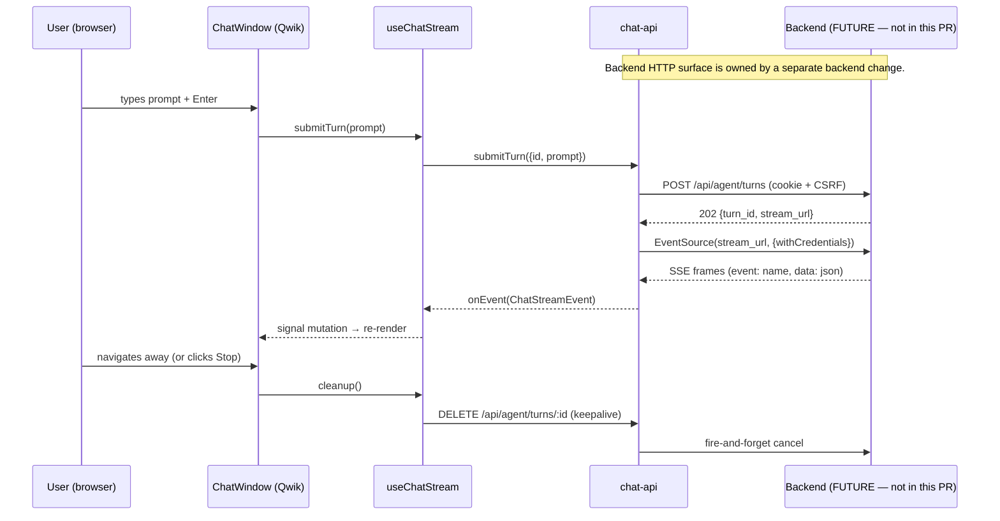

# Design — cachicamas-frontend-chat-layer1

> **Change**: `cachicamas-frontend-chat-layer1` · **Phase**: design · **Date**: 2026-08-06
> Binding: [`openspec/specs/frontend-chat-layer1/spec.md`](../../specs/frontend-chat-layer1/spec.md) REQ-1…REQ-7.
> Decisions D1–D7 in [`proposal.md`](./proposal.md) are accepted unless this file overrides; vocabulary
> alignment per [`docs/architecture/0001-cachicamas-agent-stack-v2.md` §4.3 lines 460-487](../../../../docs/architecture/0001-cachicamas-agent-stack-v2.md) and AI-13.1 finish-reason vocabulary (seven values).
> Strict TDD: vitest `*.spec.{ts,tsx}` is the red-green target. Every type in §2 is a written assertion.

## §1. Architecture overview

The chat is a **fourth consumer** of the `CodingSessionEvent` stream (doc 0001 §2.2 row `CUSTOM`,
lines 153-218). It is the first frontend consumer in the chat-shaped slot.



The signal graph inside the chat: `pendingUserMessage` → `streamingAssistantBubble` → `finalBubble`.
Each `message.delta` appends to the last assistant bubble's `text`; `turn.end` flips `session.status`
to `idle` and closes the EventSource.

## §2. Typed contracts — red-green targets

```ts
// REQ-1: deltas carry an index, consumers accumulate (doc 0001 §4.3 invariant 1)
export type ChatStreamEvent =
  | { readonly kind: "message.start"; readonly messageId: string; readonly index: number }
  | { readonly kind: "message.delta"; readonly index: number; readonly delta: string }
  | { readonly kind: "message.end"; readonly index: number; readonly finishReason: ChatFinishReason }
  | { readonly kind: "turn.end"; readonly usage?: ChatUsage; readonly finishReason?: ChatFinishReason }
  | { readonly kind: "error"; readonly error: ChatStreamError };

// AI-13.1 seven-value vocabulary; UI surfaces them as plain labels in v1
export type ChatFinishReason =
  | "stop" | "length" | "tool_calls" | "refusal" | "pause_turn" | "content_filter" | "unknown";

// REQ-4: token counts deferred beyond input/output; cost-display is doc 0001 §7 G10
export interface ChatUsage {
  readonly inputTokens?: number;
  readonly outputTokens?: number;
}

// REQ-4: typed mid-stream error (mirrors ApiResult's error variants minus "offline",
// which only applies at HTTP/transport boundary — see ChatTurnError below)
export interface ChatStreamError {
  readonly kind: "validation" | "conflict" | "not_found" | "server";
  readonly message: string;
  readonly fields?: Record<string, string>;
}

// D2: POST body — frontend MUST NOT carry provider/model/credential keys
// (user: "the back is who controls the keys")
export interface ChatTurnRequest {
  readonly id: string;            // client-minted UUID; cancellation key
  readonly prompt: string;
  readonly systemHint?: string;   // v1: ignored by backend; reserved seam
}

// D2: POST response — what the backend promises to return
export interface ChatTurnResponse {
  readonly turnId: string;
  readonly streamUrl: string;
}

// REQ-2: cancel path is a discrete wire signal, not just EventSource.close()
export interface ChatCancelRequest { readonly id: string; }

// REQ-4 + REQ-5: union of offline-path + typed-API errors.
// Mirrors lib/api.ts:96-110 ApiResult<T>'s error half verbatim.
export type ChatTurnError =
  | { readonly kind: "offline"; readonly message: string }      // REQ-5: literal "backend not wired — see PR for backend wire"
  | { readonly kind: "validation"; readonly message: string; readonly fields: Record<string, string> }
  | { readonly kind: "conflict"; readonly message: string }
  | { readonly kind: "not_found"; readonly message: string }
  | { readonly kind: "server"; readonly message: string };

// useChatStream signal-store shapes
export interface ChatMessage {
  readonly id: string;
  readonly role: "user" | "assistant";
  text: string;                   // mutated by appendDelta — useSignal<string>
  status: "pending" | "streaming" | "complete" | "error";
  error?: ChatStreamError;        // populated only when status === "error"
}

export interface ChatSession {
  messages: ChatMessage[];        // useStore<{messages: ChatMessage[]}>(...)
  status: "idle" | "submitting" | "streaming" | "cancelling";
  currentTurnId?: string;
}

// REQ-7: typed fixture so vitest can deep-assert against recorded wire bytes
export interface TranscriptFixture {
  readonly name: string;
  readonly raw: string;                                // byte-identical SSE transcript
  readonly expectedEvents: readonly ChatStreamEvent[]; // property-style assertion
  readonly expectTerminalClose: boolean;
}
```

Each `ChatStreamEvent` variant is a vitest `it(...)` test name in `chat-api.spec.ts` and
`use-chat-stream.spec.ts`. The fixture's `raw` is a real `.sse` file under `__fixtures__/`
(R-4 mitigation: byte-drift forces the fixture to change first).

## §3. Module / file shape

| File | Action | Responsibility + exported surface + REQ trace |
|---|---|---|
| `frontend/src/lib/chat-api.ts` | Create | `submitTurn`, `cancelTurn`, `subscribeTurn` + the §2 type vocabulary. Reuses `stateChangingFetch` (REQ-2), `apiBaseUrl` (REQ-3), `ApiResult`'s error-half shape (REQ-4). **Note on D1 refinement:** `parseSSEResponse` (`api.ts:851-881`) does not extract `event:` names — the chat dispatches via `EventSource.addEventListener('message.start', …)` etc. (`api.ts:907` pattern), which is the SSE-correct path. The chunk-split discipline is the shared discipline, not the function. |
| `frontend/src/lib/chat-api.spec.ts` | Create | FakeES + transcript assertion; offline-path; cancel via `keepalive`. REQ-7 + REQ-1 + REQ-4 + REQ-5. |
| `frontend/src/components/chat/use-chat-stream.ts` | Create | `useChatStream$({ prompt, session })` Qwik hook. `useStore` for session, `useSignal` per-bubble-text. POST via `submitTurn` → `EventSource.addEventListener` × 4 → `applyEvent(ChatStreamEvent)` mutator. Cleanup in `useVisibleTask$`. REQ-1 + REQ-2 + REQ-6. |
| `frontend/src/components/chat/use-chat-stream.spec.ts` | Create | Mocked EventSource + mocked `submitTurn`; assert no-goroutine-leak, signal-mutation ordering, cancel race. REQ-7. |
| `frontend/src/components/chat/chat-window.tsx` | Create | Renders `ChatMessage[]` + `<ChatInput/>`. Reads `useChatStream` signals. REQ-1 + REQ-4. |
| `frontend/src/components/chat/chat-window.spec.tsx` | Create | Render with pre-seeded store; delta accumulation + cancel button. REQ-7. |
| `frontend/src/components/chat/message-bubble.tsx` | Create | Single bubble; `renderSanitizedMarkdown` (`lib/markdown.ts:65-67`) for assistant text. **Forbids `dangerouslySetInnerHTML`**. REQ-6. |
| `frontend/src/components/chat/message-bubble.spec.tsx` | Create | DOMPurify strips `<script>` and `onerror=`; no `dangerouslySetInnerHTML`. REQ-6 + REQ-7. |
| `frontend/src/components/chat/chat-input.tsx` | Create | Textarea + Send + Cancel; disabled derived from `session.status !== "idle"`. Enter submits. REQ-1. |
| `frontend/src/components/chat/chat-input.spec.tsx` | Create | Disabled-during-stream + Enter-to-submit. REQ-7. |
| `frontend/src/components/chat/__fixtures__/single-turn.sse` | Create | Recorded transcript: `message.start` → 5×`message.delta` → `message.end` → `turn.end`. Property-style over bytes. |
| `frontend/src/routes/chat/index.tsx` | Create | Page shell; renders `<ChatWindow/>`. REQ-3 + REQ-6. |
| `frontend/src/routes/chat/layout.tsx` | Create | Auth gate (same chain as `routes/home/index.tsx:39-51`). REQ-3. |
| `frontend/src/routes/chat/index.spec.tsx` | Create | anon → `SignInRequiredCard`; offline-error rendering. REQ-3 + REQ-5 + REQ-7. |
| `frontend/src/components/example/example.tsx` | Modify (≤1 line) | One-line sidebar CTA → `/chat` (proposal §2 deferred row). D6. |

## §4. State flow

**REQ-1 happy path:** (1) `<ChatInput/>` onSubmit calls `submitTurn({id: uuid(), prompt})` →
`stateChangingFetch("POST", /api/agent/turns, JSON body)` (`csrf.ts:28-39`). (2) On 202, `use-chat-stream`
opens `new EventSource(streamUrl, {withCredentials: true})` (`api.ts:907`). (3) Registers four
`addEventListener`s: `message.start` / `message.delta` / `message.end` / `turn.end`. (4) On each event,
mutates the `ChatSession` store — `message.start` appends a `role: "assistant"`, `status: "streaming"`
bubble; `message.delta` appends `e.data.delta` to that bubble's `text` signal; `message.end` flips
`status: "complete"`; `turn.end` flips `session.status: "idle"` and `es.close()` (mirroring
`subscribeWorkspaceSyncStream`'s intentional-close pattern at `api.ts:921-952`). (5) Qwik re-renders
the bubble via signal reactivity.

**REQ-2 cancel:** `useVisibleTask$` cleanup calls `cancelTurn(currentTurnId)` which `stateChangingFetch("DELETE", …)` with `keepalive: true` (`use-sync-status.ts:115-138` pattern). The **Stop** button does the same inline. Fire-and-forget; no response parsing needed. Per doc 0001 §4.2 lines 450-455 (cancellation tree), this PR implements "abort this turn" only — shutdown is a separate signal.

**REQ-5 honest offline:** if POST throws `TypeError` (network) OR `EventSource.onerror` fires before any `message.delta`, `chat-api.ts` resolves to `{ ok: false, kind: "offline", message: "backend not wired — see PR for backend wire" }` (`lib/api.ts:96-110` `offline` variant). The window renders this as an inline message; no fake bubble is inserted; no `setTimeout(retry)`.

**REQ-7 strict TDD:** every file above has a colocated `*.spec.{ts,tsx}`. The vitest spec is the red step; `pnpm --filter @cachicamas/frontend test:ci` is the gate (proposal §5 D4). `openspec/AGENTS.md` *Strict TDD* mandates this. No `it.skip` / `it.todo` is shipped (REQ-7.c).

## §5. Trade-offs and rejected alternatives

| Decision | Choice | Rejected | Rationale |
|---|---|---|---|
| Wire format | SSE + `EventSource.addEventListener('message.<x>')` (D1) | WebSocket; JSON-RPC; `parseSSEResponse` unchanged | `api.ts:907` already proves cookie-bearing SSE in browser; typed `EventSource` dispatches by `event:` name natively, so we don't need to re-parse event-name lines |
| Cancel transport | `DELETE /api/agent/turns/:id` with `keepalive: true` (D2) | close-on-disconnect only; long-poll cancel | Doc 0001 §4.2 — cancel must be a discrete wire signal distinguishable from shutdown |
| `ApiResult` reuse | Mirror `lib/api.ts:96-110` error half as `ChatTurnError` (REQ-4+5) | Invent a parallel `ChatResult` | `prompts-api.ts:60-72` already declares its own `ApiResult` (a copy) — chat follows the same convention, not a third shape |
| Verification | Recorded SSE transcript + vitest `FakeES` (D4) | nock; MSW; backend stub server | D4 honest-offline; no fabricated responses; byte-drift forces fixture-first change |
| Subscriber lifecycle | `useVisibleTask$` + `cleanup()` (`use-sync-status.ts:115-138`) | `useTask$` (SSR would crash on `EventSource === undefined`) | SSR safety — EventSource is browser-only |
| Session model | Single `ChatSession` in-memory | URL-encoded session id; LocalStorage | Proposal §4 — reload = empty in v1; defer persistence |
| Markdown | `renderSanitizedMarkdown` (D5) | Streaming incremental parser | marked is sync; re-render is cheap for v1; R5 mitigation deferred until measured |
| Sidebar entry | `<Link href="/chat">` from `components/example/example.tsx` | New `routes/home/layout.tsx` | One-line CTA avoids new route shell; example component already lives in render path |

## §6. Risks register

| # | Risk | Severity | Mitigation |
|---|---|---|---|
| **R1** | Backend HTTP gap (doc 0001 §5.2) — no real e2e possible | Blocker for live demo only | D4 + REQ-5: vitest-only + honest offline |
| **R2** | Single-PR forecast 2100–3750 lines exceeds `review_budget_lines=800` (proposal §6) | High | User fork at `sdd-tasks`: (a) `size:exception` or (b) client-first/UI-second split |
| **R3** | Recorded-fixture may drift from future backend wire | Medium | Typed `ChatStreamEvent` + `TranscriptFixture.expectedEvents` → spec breaks first |
| **R4** | SSE in Qwik: SSR-vs-browser `EventSource` global | Medium | `useVisibleTask$` (`use-sync-status.ts:115-138`); REQ-3 path covers SSR no-op |
| **R5** | Re-render on every delta (long streams) | Low–Med | Acceptable in v1; throttle-counter deferred to a future change |

## §7. Deferred / out of scope

- Real e2e demo (backend PR owns wire).
- Session persistence across reloads (proposal §4; doc 0001 §5.2).
- Tool-call rendering / subagent nesting / permission protocol / reasoning deltas / multimodal (doc 0001 §7 G1/G7/G12 + §8).
- Cost/usage display (doc 0001 §7 G10) — `ChatUsage` already typed for the seam.
- PR split decision (R2) — surfaced to user at `sdd-tasks`.
- Any backend file, `openspec/specs/` modification, `docker-compose.yaml`, `infra/`, top-level frontend deps.

## §8. Cross-references

- Doc 0001 §2.2 lines 153-218 — chat as fourth `CUSTOM` frontend.
- Doc 0001 §4.1 lines 425-427 — retry is harness concern, not frontend.
- Doc 0001 §4.2 lines 450-455 — cancellation tree; discrete wire signal.
- Doc 0001 §4.3 lines 460-487 — event envelope invariants (index-bearing deltas, typed errors).
- AI-13.1 — seven-value `ChatFinishReason` vocabulary.
- `frontend/src/lib/api.ts:96-110` — `ApiResult<T>` error half mirrored.
- `frontend/src/lib/api.ts:907` — `withCredentials: true` pattern.
- `frontend/src/lib/api.ts:851-881` — `parseSSEResponse` chunk-split discipline.
- `frontend/src/lib/api.sse.spec.ts:75-307` — `FakeES` pattern.
- `frontend/src/lib/csrf.ts:28-39` — `stateChangingFetch` (POST/DELETE).
- `frontend/src/lib/markdown.ts:65-67` — `renderSanitizedMarkdown`.
- `frontend/src/components/workspace-sync-card/use-sync-status.ts:115-138` — `useVisibleTask$`+cleanup.
- `frontend/src/routes/home/index.tsx:39-51` — `onRequest` guard chain.
- `openspec/AGENTS.md` — strict TDD; vitest red-green target.
- `openspec/changes/cachicamas-frontend-chat-layer1/explore.md` — frontend primitives survey + backend gap.
- `openspec/changes/cachicamas-frontend-chat-layer1/proposal.md` — D1–D7.
- `openspec/specs/frontend-chat-layer1/spec.md` — REQ-1…REQ-7 (binding contract).

**Threat matrix**: N/A — no routing, shell, subprocess, VCS/PR automation, executable-file classification, or process-integration boundary. Frontend-only HTTP consumer; in-process EventSource only.

**Migration / rollout**: None. Revert = single-PR revert; no DB migration, no env vars, no `go.mod` delta.
