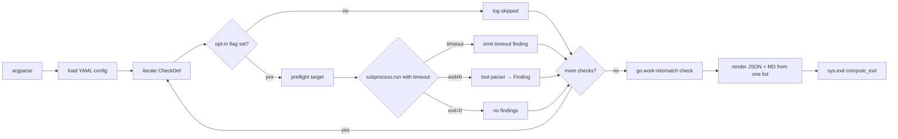

# Design: Repo-level validation harness

## Technical Approach

`scripts/validate.py` (stdlib Python + `uv` shebang) drives 21 subprocesses sequentially (run-all-then-aggregate, R-RVH-001). Each returns to one of 8 per-tool parsers that normalize raw bytes → `list[Finding]`. A single render pass writes both `validation-report.json` and `validation-report.md` from that list (R-RVH-009). Exit code = `compute_exit(findings, threshold)`, a pure function.

## Architecture Decisions (one-line each)

- **Python stdlib only** (`json`, `subprocess`, `argparse`, `dataclasses`, `hashlib`, `pathlib`, `re`): precedent `validate-infra.py`; JSON is the AI consumer's primary need; bash+`jq` is fragile across 7 grammars.
- **Single file (~400 lines)**: v1 surface small; split deferred.
- **`unittest` (not pytest)**: stdlib-only constraint.
- **`subprocess.run` blocking + sequential**: timeout + exit-code determinism (R-RVH-011).
- **Shebang `#!/usr/bin/env -S uv run --no-project --with pyyaml python3`**: matches `validate-infra.py`; YAML config needs pyyaml.
- **Two severity scales** (verbatim `severity` field + mapped `_mapped` for threshold): R-RVH-005 mandates verbatim.
- **Default `--fail-on=high`**: permissive but not silent.
- **`sha256(f"{file}|{line}|{rule}|{message}")[:16]`** for finding IDs: determinism is the spec contract.

## Data Flow



## File Changes (config diff rationale)

| File | Action | Rationale |
|---|---|---|
| `scripts/validate.py` | Create (~400 lines) | Main harness |
| `scripts/test_validate.py` | Create | `unittest` suite over pure functions; per `openspec/AGENTS.md` line 49 |
| `scripts/validate-config.yaml` | Create | Default allowlist `[(backend/agent, install)]` + threshold overrides |
| `validation-report.{json,md}` | Create (artifacts) | Written to `--output-dir` (default `.`); CI-ready deterministic output |
| `openspec/project.md` | Modify | Add `uv 0.11.17` row to "Tooling Versions" — host tool, not project dep |

Untouched (per `openspec/AGENTS.md` hard rules): `docker-compose.yaml`, `infra/`, `backend/*/src/`, all Makefiles, `go.work`.

## Finding Dataclass (R-RVH-010, exact 13 fields in this order)

```python
@dataclass
class Finding:
    id: str          # sha256(file|line|rule|message)[:16]
    severity: str    # VERBATIM from tool ("warn", "error", "high", ...)
    category: str    # lint|typecheck|format|test|vuln|tool-missing|go.work-mismatch|timeout
    tool: str        # golangci-lint|eslint|prettier|tsc|vitest|playwright|govulncheck|pnpm-audit|node-test|make|go
    scope: str       # backend/<mod>|frontend|repo-root
    rule: str | None
    file: str | None # repo-relative (no leading /, no ..)
    line: int | None
    column: int | None
    message: str
    evidence: str | None  # raw tool output, truncated 4 KiB
    reproduce: str        # single shell command from repo root
    fix_hint: str | None

@dataclass
class CheckResult:
    scope: str; name: str; target: str
    status: str  # passed|failed|skipped|tool-missing|timeout|internal-error
    elapsed_seconds: float; findings: list[Finding] = field(default_factory=list)
```

`to_jsonable()` = `dataclasses.asdict`; `None` → JSON `null` (not omitted, R-RVH-010 S-2).

## Check Matrix (21 entries)

Every entry invokes the module's Makefile target or `pnpm` script — **never raw `go test` / `pnpm test`** (`openspec/AGENTS.md` line 10: keeps `-race`, `bin/`, version pins consistent).

| # | Scope | Check | Command | Parser | Output |
|---|---|---|---|---|---|
| 1 | backend/database_administrator | test | `make test` | regex `--- FAIL:`, `DATA RACE` | stdout (-race) |
| 2 | backend/database_administrator | test/cover | `make test/cover` | (none unless fail) | stdout |
| 3 | backend/database_administrator | lint | `bin/golangci-lint run --config=.golangci.yml --out-format=json ./...` | `parse_golangci_json` | JSON |
| 4 | backend/database_administrator | vuln-check | `make vuln-check` | `parse_govulncheck` | NDJSON |
| 5 | backend/database_administrator | test/integration | opt-in (`--include-integration`); `make test/integration` | same as #1 | stdout |
| 6–9 | backend/workspace_syncer | test, test/cover, lint, vuln-check | mirror #1–#4 | same parsers | same |
| 10–12 | backend/agent | test, test/cover, lint | mirror #1–#3 (no vuln-check target) | same parsers | same |
| 13 | backend/agent | **vuln-check** | `make -n vuln-check` (dry-run); absence → `tool-missing` finding; **no govulncheck invocation** (R-RVH-003) | n/a | n/a |
| 14 | frontend | eslint | `pnpm lint -- --format json` | `parse_eslint_json` | JSON |
| 15 | frontend | typecheck | `pnpm build.types -- --pretty false` | regex `^(.+?)\((\d+),(\d+)\): error (TS\d+): (.+)$` | text |
| 16 | frontend | format | `pnpm fmt.check` | filenames on stderr | exit code |
| 17 | frontend | unit test | `pnpm test:ci -- --reporter=json` | `parse_vitest_json` (NDJSON) | JSON |
| 18 | frontend | eslint-rule test | `node --test eslint-rules/*.spec.mjs` | regex `^not ok` | TAP |
| 19 | frontend | vuln-check | `pnpm run vuln-check -- --json` | `parse_pnpm_audit` | JSON |
| 20 | frontend | e2e | opt-in (`--include-e2e`); `pnpm test:e2e` | regex `Error:` | stdout |
| 21 | repo-root | go.work sanity | `go work edit -json` + each `go.mod` | `parse_go_work` | JSON |

## Parser Strategy (1 row per tool)

| Tool | Stdlib parser | Failure mode (unexpected output) |
|---|---|---|
| `golangci-lint --out-format=json` | `json.loads`; walk `.Issues[]` | non-JSON → single `tool-missing` finding |
| `eslint --format json` | `json.loads`; walk array | non-array → single `tool-missing` finding |
| `tsc --pretty false` | regex `file(line,col): error TS\d+:` | no match → no findings |
| `prettier --check` | filenames on stderr | empty stderr + non-zero → `tool-missing` finding |
| `vitest --reporter=json` | NDJSON `json.loads` per line; walk `.testResults[].assertionResults[]` | non-JSON → `tool-missing` |
| `node --test` (TAP) | regex `^not ok \d+ - (.+)$` | parse fail → `tool-missing` |
| `playwright test` | regex `Error:` + test titles | parse fail → `tool-missing` |
| `pnpm audit --json` | `json.loads`; walk `.vulnerabilities{}` | non-JSON → `tool-missing` |
| `govulncheck -json` | NDJSON `json.loads`; filter `osv == true` | skip non-JSON, continue |
| `go work edit -json` | `json.loads`; compare `.Go` vs each `Use.DiskPath/go.mod` | best-effort, no findings if parse fails |

## Severity Ladder (R-RVH-005)

| Tool severity (verbatim in `severity` field) | Mapped (threshold compare) |
|---|---|
| `0` / `off` | `info` |
| `1` / `warn` / `info` | `low` |
| `2` / `error` / `low` / `moderate` / `MEDIUM` | `medium` |
| `high` / `HIGH` | `high` |
| `critical` / `CRITICAL` | `critical` |
| `tool-missing` (synthetic, R-RVH-003) | `medium` |
| `timeout` (synthetic) | `medium` |
| `go.work-mismatch` (synthetic, R-RVH-007) | `medium` |
| `data-race` (synthetic, from go test) | `high` |

## CLI Shape (`argparse`)

```
--output-dir DIR        (default: .)
--include-integration   Run make test/integration (boots Postgres)
--include-e2e           Run pnpm test:e2e (needs compose stack)
--fail-on {info|low|medium|high|critical}  (default: high)
--timeout-check SECS    (default: 600)
--timeout-e2e SECS      (default: 1200)
--config PATH           (default: scripts/validate-config.yaml)
--quiet
```

No `isatty()` calls; piped stdin/stdout work (R-RVH-011 S-3).

## Allowlist (R-RVH-012) — `scripts/validate-config.yaml`

```yaml
allowlist:
  - scope: backend/agent
    target: install   # documented absence per backend/agent/Makefile:55-58
# fail_on: high
# timeout_check: 600
# timeout_e2e: 1200
```

## Per-check Timeout

`subprocess.run([...], capture_output=True, text=True, timeout=N)` (Python ≥3.12; auto-kills on timeout). On `TimeoutExpired`: emit `category="timeout"`, `severity="medium"`, continue. Blocking vs async: ~21 checks, mostly I/O; async buys no wall-clock; blocking keeps timeout + exit codes deterministic (R-RVH-011).

## Test Plan (29 scenarios → 29 unit tests, all pure-function)

In `scripts/test_validate.py`; fixtures in `scripts/testdata/`. Run: `cd scripts && python3 -m unittest test_validate`. Strict TDD per `openspec/AGENTS.md` line 49.

| Req | Test methods (mapping 29 scenarios) |
|---|---|
| R-RVH-001 | `TestAggregator.test_continues_past_failed_check`, `test_includes_tool_missing_with_real_finding` |
| R-RVH-002 | `TestExit.test_zero_when_no_findings_above_threshold`, `test_one_when_finding_above_threshold`, `test_two_on_harness_internal_error` |
| R-RVH-003 | `TestToolMissing.test_absent_target_emits_finding`, `test_does_not_invoke_underlying_tool` (shim binary records invocations) |
| R-RVH-004 | `TestFindingId.test_deterministic_for_same_input`, `test_differs_when_message_differs`, `test_normalizes_null_line` |
| R-RVH-005 | `TestSeverity.test_eslint_warn_stays_warn_in_severity_field`, `test_cachicamas_no_inline_button_class_severity_preserved` |
| R-RVH-006 | `TestOptIn.test_integration_skipped_without_flag`, `test_e2e_skipped_without_flag`, `test_integration_included_with_flag` |
| R-RVH-007 | `TestGoWorkMismatch.test_emits_finding_on_drift`, `test_no_finding_on_match` |
| R-RVH-008 | `TestNoBuildCheck.test_check_matrix_has_no_build_target`, `test_bin_dir_unchanged_after_dry_run` |
| R-RVH-009 | `TestRenderers.test_same_ids_in_both_outputs`, `test_adding_finding_updates_both` |
| R-RVH-010 | `TestFindingPayload.test_all_13_fields_present`, `test_null_preserved_not_omitted`, `test_file_is_repo_relative` |
| R-RVH-011 | `TestCIReady.test_output_dir_creates_files`, `test_deterministic_exit_across_runs`, `test_runs_without_tty` |
| R-RVH-012 | `TestAllowlist.test_default_allowlist_silences_documented_absence`, `test_removing_allowlist_surfaces_finding` |

Parser-specific tests: `TestParsers.{test_golangci,test_eslint,test_tsc,test_prettier,test_vitest,test_node_test,test_playwright,test_pnpm_audit,test_govulncheck,test_go_work}`. Live verification (assert `go.work-mismatch` finding on real workspace) belongs to `sdd-verify`, not the unit suite.

## Threat Matrix

**N/A** — harness invokes subprocesses but does not alter git state, commit, push, open PRs, or classify executable-vs-documentation files. Subprocess boundary is fully covered by the check matrix, parser failure modes, and timeout handling. Per `references/threat-matrix.md`: "If the change has no routing/shell/process boundary, record the matrix as not applicable rather than expanding it."

## Migration / Rollout

Purely additive. Rollback = `git rm scripts/validate.py scripts/test_validate.py scripts/validate-config.yaml validation-report.{json,md}`.

## Open Questions (need user decision)

1. **uv as host tool**: `uv 0.11.17` is installed but not in `openspec/project.md` "Tooling Versions" or any `package.json`. Recommended: add one row to `project.md` only. Does not trigger ADR rule (rule binds Go deps, `openspec/AGENTS.md` line 90). **Confirm.**
2. **YAML via pyyaml**: requires `--with pyyaml` form of the shebang. Alternative is line-based parsing for the 4-line config. Recommended: pyyaml (consistency with `validate-infra.py`). **Confirm or reject.**
3. **`build` exclusion is a meta-check** (R-RVH-008 S-1): introspected at startup, asserted by `TestNoBuildCheck.test_check_matrix_has_no_build_target`. Flagging it as the only non-tool check.
