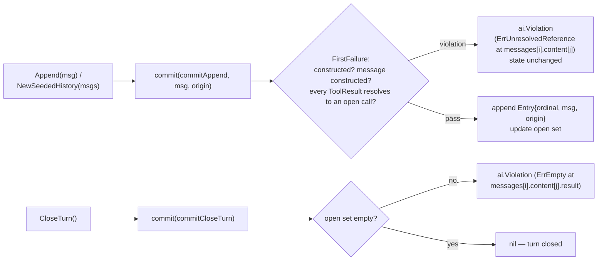
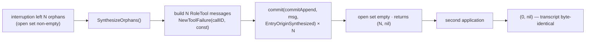

# Design: AG-12 — History and the pairing invariant

> Change `cachicamas-agent-history` · Renders proposal decisions 1–4; re-litigates none.
> New capability `agent-history` (prefix `HIS`). All code in `backend/agent/src/agent/history.go`.

## Technical Approach

An opaque `History` struct (proposal Approach 1) with unexported storage and one unexported
validating commit primitive, `(*History).commit`. Every public route — `Append`, seeded
construction, `CloseTurn`, `SynthesizeOrphans` — funnels through it. Entries are stored in an
opaque `Entry` envelope carrying the unmodified `ai.Message`, an ordinal-derived `EntryID`, and
an `EntryOrigin` discriminator. Typed rejections reuse `ai.Invalid` / `ai.At` / `ai.AtIndex` /
`ai.FirstFailure` with the existing classes `ai.ErrUnresolvedReference` and `ai.ErrEmpty`.
`ai/validation.go` is not touched. `loop.go` / `scheduler.go` are not touched.

## Go API Surface (`history.go`, package `agent`)

```go
// EntryOrigin — how an entry entered the transcript. Zero is unset
// (the ai.Role idiom: first member is iota + 1).
type EntryOrigin uint8
const (
    EntryOriginAppended EntryOrigin = iota + 1 // committed through Append or seeding
    EntryOriginSynthesized                     // committed by SynthesizeOrphans
)
func (o EntryOrigin) String() string

// EntryID — stable entry identity: the entry's 1-based ordinal in the
// transcript. 0 is unset (the zero Entry). uint32 matches R-AMT-007's
// ordinal convention.
type EntryID uint32

// Entry — the opaque envelope (the agent.Event shape). Read-only.
type Entry struct {
    id      EntryID
    message ai.Message
    origin  EntryOrigin
}
func (e Entry) ID() EntryID          // 0 on the zero Entry
func (e Entry) Message() ai.Message  // the unmodified Layer 1 value
func (e Entry) Origin() EntryOrigin
func (e Entry) String() string       // "entry(3 appended)" — never content (V-FAIL-13 posture)

// openCall — unexported pairing-index record for one unanswered call.
type openCall struct {
    callID     string
    entryIndex int // message position in entries (0-based internal)
    partIndex  int // part position within that message's content
}

type History struct {
    constructed bool       // set only by the two constructors
    entries     []Entry
    open        []openCall // unanswered calls, issuance order
}

func NewHistory() *History
func NewSeededHistory(messages []ai.Message) (*History, error) // decision 3, frozen shape
func (h *History) Append(message ai.Message) error
func (h *History) CloseTurn() error
func (h *History) SynthesizeOrphans() (int, error) // pairs closed on this application
func (h *History) Entries() []Entry                // fresh slice, no aliasing
func (h *History) Len() int
```

## The Single Commit Path (the C1 lesson, structurally)

```go
type commitOp uint8 // commitAppend | commitCloseTurn — unexported

// commit is the ONLY function that writes h.entries or h.open.
func (h *History) commit(op commitOp, message ai.Message, origin EntryOrigin) error
```

Every public route funnels through it:

| Public route | Call into the primitive |
|---|---|
| `Append(m)` | `commit(commitAppend, m, EntryOriginAppended)` |
| `NewSeededHistory(ms)` | `NewHistory()`, then `commit(commitAppend, m, EntryOriginAppended)` per message, in order; first violation aborts and returns `(nil, err)` — its position names the offending entry via `ai.AtIndex(i)` for free, because `commit` positions every rule at the would-be index `len(h.entries)` |
| `CloseTurn()` | `commit(commitCloseTurn, ai.Message{}, 0)` |
| `SynthesizeOrphans()` | builds one `ai.RoleTool` message per orphan, then `commit(commitAppend, m, EntryOriginSynthesized)` each |

Bypass is impossible by construction, not convention: `entries` and `open` are unexported, so no
external caller can reach them; `commit` is the only function whose body assigns them, auditable
by reading one file; `EntryOrigin` is a `commit` parameter no public signature accepts, so only
`SynthesizeOrphans` can mint `EntryOriginSynthesized`; the zero-value door C1 exploited is closed
at the same single point — `commit` rejects `!h.constructed` with `ai.Invalid(ai.ErrEmpty,
ai.At("history"))`, so `new(History)` is unusable through every route; and the route enumeration
the S-HIS-030 audit drives is CLOSED by the surface guard below (S-HIS-031) — never a
hand-written snapshot of the routes that happened to exist.

Rules inside `commit`, composed with `ai.FirstFailure`, all-or-nothing (state is written only
after every rule passes; a violation leaves the history byte-identical):

1. `h.constructed` — else `ai.ErrEmpty` at `history`.
2. `commitAppend`: the message passed `ai.NewMessage` (`MessageID` not zero) — else `ai.ErrEmpty`
   at `messages[i]`. History stores only constructed Layer 1 values.
3. `commitAppend`, per part `j` in order: a `ToolResult` part must name a call in the open set —
   else `ai.Invalid(ai.ErrUnresolvedReference, ai.At("messages"), ai.AtIndex(i), ai.At("content"),
   ai.AtIndex(j))`; a `ToolCall` part joins the open set. A second result for an already-answered
   call fails by the same rule with no extra class: the open set is "what the transcript declares",
   and an answered call is no longer declared.
4. `commitCloseTurn`: the open set must be empty — else, for the first-issued open call,
   `ai.Invalid(ai.ErrEmpty, ai.At("messages"), ai.AtIndex(i), ai.At("content"), ai.AtIndex(j),
   ai.At("result"))` — `ai.ErrEmpty` positioned at the call's result slot, exactly the proposal's
   rendering. Empty open set: `CloseTurn` is a no-op returning nil (idempotent).

Proposal's substitution check (decision 2): `ai.ErrEmpty` stands for the unclosed call.
`ErrUnresolvedReference` points the wrong way (nothing dangling references anything),
`ErrMisplaced` fails (nothing is present in a wrong position), `ErrOutOfRange` fails (no bound).
The required value — the matching result — is absent; `ErrEmpty` is the fit.

**"Once the turn closes", concretely**: the turn closes when the caller invokes `CloseTurn()`.
History detects nothing itself — AG-13's run driver will call it when a provider turn ends. In
AG-12, `CloseTurn` is exercised only by tests; no loop wiring.

## The Closed-Route Guard (`R-HIS-004`, `S-HIS-030`/`S-HIS-031`/`S-HIS-042`)

`S-HIS-031` forbids the audit being a snapshot: a hand-written route list would not fail when a
sixth exported mutating route lands. The mechanism is the doc-row guard's closed comparison
(`doc_contract_guard_test.go`, S-AGP-013/014 — parse the real surface, diff set-equal against a
committed table, fail naming the divergence) retargeted at the exported history surface, in a
fourth new file:

**`backend/agent/src/agent/history_surface_guard_test.go`** (`package agent_test`)

- **What it enumerates** (two probes, one comparison):
  1. The exported **method sets** of `*agent.History` and `agent.Entry`, by reflection
     (`reflect.TypeOf`) — runtime truth, so a method promoted through an accidentally embedded
     field is caught too, which source scanning would miss.
  2. The exported **package-level functions** whose signature mentions `History` (parameter or
     result), by parsing the package's non-test `.go` files with `go/parser` (stdlib), resolved
     from this test file's own location via `runtime.Caller(0)` — the doc guard's posture.
     Deviation from the suggested all-reflection rendering, with the reason: Go reflection
     cannot enumerate package-level functions, so the constructors take the parse probe;
     methods keep reflection.
- **The committed table**, declared in the same file — the guard's source of truth:

  ```go
  type routeClass uint8 // routeMutating | routeReadOnly | routeEmptyConstructor
  type historyRoute struct {
      name  string // "Append", "NewSeededHistory", ...
      kind  string // "method:*History" | "method:Entry" | "func"
      class routeClass
  }
  var expectedHistoryRoutes = []historyRoute{
      {"NewHistory", "func", routeEmptyConstructor}, // commits nothing; empty transcript trivially valid
      {"NewSeededHistory", "func", routeMutating},
      {"Append", "method:*History", routeMutating},
      {"CloseTurn", "method:*History", routeMutating},
      {"SynthesizeOrphans", "method:*History", routeMutating},
      {"Entries", "method:*History", routeReadOnly},
      {"Len", "method:*History", routeReadOnly},
      {"ID", "method:Entry", routeReadOnly},
      {"Message", "method:Entry", routeReadOnly},
      {"Origin", "method:Entry", routeReadOnly},
      {"String", "method:Entry", routeReadOnly},
  }
  ```

- **The comparison**: set-equal in BOTH directions, the doc guard's shape — every enumerated
  surface route must have exactly one table row, and every table row must exist on the surface.
- **Failure message**: names the divergence and the rule. Surface-not-in-table:
  `history route guard: surface route %q (%s) is not in expectedHistoryRoutes — every exported
  history route must be classified mutating/read-only in the same PR that adds it (R-HIS-004)`;
  mirror text for a table row missing from the surface.
- **The chain that closes S-HIS-030**: the audit carries no route list of its own — it iterates
  the table's `routeMutating` rows and looks each up in a driver map
  (`map[string]func(t *testing.T)`, each driver constructing an orphaning sequence through that
  route and asserting typed rejection), failing with
  `no orphaning-sequence driver for mutating route %q` on a missing key. Real surface ↔ table
  (guard); table ↔ drivers (audit). A new exported route cannot land without a table row, and a
  mutating row cannot land without a rejection driver.
- **Scratch-edit RED (S-HIS-031)**: temporarily add
  `func (h *History) ScratchAppend(m ai.Message) error { h.entries = append(h.entries, Entry{message: m}); return nil }`
  — a public mutating route bypassing `commit`. The guard FAILS naming `ScratchAppend` as an
  unenumerated surface route; output recorded in apply-progress, edit reverted. Second-stage
  defense, stated for honesty: were a scratch route added WITH a `routeMutating` table row, the
  audit fails on the missing driver, and adding the driver exposes the bypass itself (the
  orphaning sequence is accepted instead of rejected). Misclassifying it `routeReadOnly` is the
  one residual needing a reviewer — but it is an explicit lie in the diff, which is exactly what
  this guard converts silent omission into.
- **S-HIS-042 rides the same guard**: the `Entry` rows admit only `routeReadOnly`, and the guard
  asserts no `method:Entry` row is classified otherwise — the envelope exposes no route to set
  an entry identity, an origin discriminator, or a committed Layer 1 value.

## Entry Identity and Read-Only Views

`EntryID` is the 1-based ordinal at commit time. It is deterministic — the same seed yields the
same identities in any process — which is what Layer 3 resume needs, and no caller can mint one
(`Entry` has no constructor; the C1 back door stays closed). `ai.MessageID` cannot serve: it is
minted per `ai.NewMessage` call, so a rebuilt transcript re-mints it; ordinals survive.
Compaction removing entries would shift ordinals — inherited risk 1, owned by AG-18.2, recorded
here and not mitigated here.

`Entries()` returns a freshly allocated `[]Entry`. Mutating the returned slice cannot touch
internal storage; `Entry`'s fields are unexported value types, and `ai.Message` is itself
copy-on-read (`Content()` clones). Read-back is the unmodified Layer 1 values, in order.

## Orphan Synthesis

```go
func (h *History) SynthesizeOrphans() (int, error)
```

Snapshot the open set in issuance order; for each orphan build
`ai.NewToolFailure(callID, synthesizedInterruptionContent)` wrapped in an `ai.RoleTool` message
(`ai.NewMessage(ai.RoleTool, part)` — the one role that carries a tool result); build **all** N
messages before committing any; then commit each with `EntryOriginSynthesized`.

- **Totality**: every orphan gets exactly one result. Construction cannot fail — `callID` is
  non-empty by `ai.NewToolCall`'s own invariant — but any impossible error is still returned,
  never panicked, with zero commits made (build-then-commit ordering).
- **Idempotence**: each synthesized result answers its own target, so the first pass empties the
  open set and returns `(N, nil)`; the second finds no orphans, commits nothing, and returns
  `(0, nil)` with a byte-identical transcript.
- **One commit path**: it is a method routed through `commit`, so the "any public route" scenario
  covers it for free.
- **Distinguishability**: origin on the envelope, only. `synthesizedInterruptionContent` (an
  unexported constant, e.g. `"tool call interrupted before a result arrived; this result was
  synthesized by the harness"`) informs the model but is forgeable by a real tool and is NOT the
  discriminator; `Failed()` is true because interruption is a failure outcome the model must see,
  and is NOT the discriminator either (proposal decision 4's corollary).

## Flow Diagrams





## The `L2C-07` Row

Appended to `doc.go`'s guarded table (tab-indented, one line) and to
`expectedLayer2ContractRows` in `doc_contract_guard_test.go`, same PR (R-AGP-002). Exact text:

> `L2C-07	History is the second upward surface and has exactly one commit path: the transcript a run accumulates is read back as unmodified Layer 1 values with stable ordinal entry identity, and every route that can extend it — append, seeded construction, orphan synthesis — funnels through one validating commit primitive enforcing the pairing invariant (every tool call has a matching result) at the boundary, with no privileged bypass for internal callers; a synthesized interruption result is distinguishable from a real one by envelope origin alone (doc 0003 AG-12 acceptance; agent-history).`

RED ordering: land the `expectedLayer2ContractRows` entry first —
`TestLayer2DocContract_MatchesTheCommittedTable` fails "found 6 of 7 rows" (recorded RED) — then
the `doc.go` row (GREEN). After GREEN, a scratch edit mutating one byte of the `doc.go` row
proves the per-row drift arm fires; output recorded in apply-progress, edit reverted.

## File Changes

| File | Action | Description |
|---|---|---|
| `backend/agent/src/agent/history.go` | Create | Everything above; this package's doc density |
| `backend/agent/src/agent/history_test.go` | Create | `package agent_test` — AG-12.1's four scenarios |
| `backend/agent/src/agent/history_synthesis_test.go` | Create | `package agent_test` — AG-12.2's two scenarios |
| `backend/agent/src/agent/history_surface_guard_test.go` | Create | `package agent_test` — the closed-route guard, `expectedHistoryRoutes`, the S-HIS-030 driver-map audit |
| `backend/agent/src/agent/doc.go` | Modify | `L2C-07` row appended |
| `backend/agent/src/agent/doc_contract_guard_test.go` | Modify | Seventh `expectedLayer2ContractRows` entry |
| `backend/agent/src/agent/loop_test.go` (`filterOutLoopFiles`, :831) | Modify | Four exact-filename suffixes appended (decision below) with an AG-12 widening comment |
| `backend/agent/src/agent/loop_hook_test.go` (`filterOutLoopHookFiles`, :907) | Modify | The same four suffixes, byte-in-sync with `filterOutLoopFiles` |
| `openspec/specs/agent-event-envelope/`, `agent-package-scaffold/` | Delta | `S-AEV-122` row-count amendment (mandatory); `S-AGP-012/014` back-annotation |

**Decision — substrate-filter registration covers every new file, not only the test files**
(NFR-HIS-004 rendered): S-LSK-006 (`openspec/specs/agent-loop-skeleton/spec.md:70`) diffs the
whole `backend/agent/src/agent/` directory against the merge base, and AG-10's
`permission_protocol.go` entry (`loop_test.go:816-831` comment block) is the precedent for a
milestone's non-test file. Both `filterOutLoopFiles` (`loop_test.go:831`) and
`filterOutLoopHookFiles` (`loop_hook_test.go:907`) are therefore widened by exactly these four
suffixes, in this order, and the two lists MUST stay byte-in-sync:

1. `/history.go`
2. `/history_test.go`
3. `/history_synthesis_test.go`
4. `/history_surface_guard_test.go`

Exact filenames only — no wildcard, no prefix, no directory pattern (the AG-11 recorded lesson).
No config changes: `openspec/config.yaml` untouched, so `rules.design`'s before/after obligation
is vacuously satisfied.

## Architecture Decisions

| Decision | Alternatives rejected | Rationale |
|---|---|---|
| Opaque struct, one `commit` primitive | Interface (no second impl exists — speculative); synthesis as free function (second door) | Inherited from proposal; the idiom trusted four times (`ai.Part`, `Event`, `Result`, `Failure`) |
| A seed MAY end with open calls; only an unresolved **result** rejects at seed time | Rejecting any seed with unanswered calls | "Seeded construction validates like appends do" — the append path legally holds open calls mid-turn. Rejecting them would make an interrupted transcript unseedable, contradicting AG-12.2's repair-before-next-turn. The unclosed-call rejection belongs to `CloseTurn`, on seeded and appended histories alike. `sdd-spec` MUST carry this reconciliation as prose (extends proposal risk 4) |
| Duplicate result for an answered call → `ai.ErrUnresolvedReference` via open-set semantics | `ai.ErrDuplicate`; a third rejection rule | The open set is the declared set; no third rule, no new class, proposal's two-rejection scope preserved |
| `EntryID` = 1-based `uint32` ordinal | `ai.MessageID` (re-minted per process — unstable across resume); caller-supplied identity (the C1 back door); UUID (needs minting authority + randomness, violates determinism) | Deterministic across processes; matches R-AMT-007's ordinal shape; 0-is-unset matches the package |
| Synthesized result via `ai.NewToolFailure` + fixed content | `NewToolResult` (model would read interruption as success); sentinel content as discriminator (forgeable — rejected in proposal) | Interruption is a failure outcome; discriminator stays on the envelope |
| Zero-value `History` rejected inside `commit` | Per-method guards (N sites that can drift) | C1 closure at the one point every route already crosses |
| Explicit `CloseTurn()` method | Auto-detecting turn ends | History wires into nothing in AG-12; the driver (AG-13) owns detection |
| Closed-route guard: reflection for method sets + `go/parser` for package functions, diffed set-equal against the committed `expectedHistoryRoutes` table | Hand-written route list (the snapshot S-HIS-031 forbids — a sixth route would not fail); pure reflection (cannot enumerate package-level functions, so a new exported constructor would slip past); pure source parsing (misses methods promoted through an embedded field) | Mirrors the doc-row guard's proven closed-comparison shape (S-AGP-013/014); S-HIS-030 drives its audit from the table's mutating rows, so surface, table, and drivers are pairwise pinned |
| All four new files registered in both substrate filters (promoted from risk to decision) | Registering only the test files | S-LSK-006 diffs the whole directory; AG-10's `permission_protocol.go` is the non-test-file precedent — an unregistered `history.go` or guard file fails the substrate guard the moment it is committed |

## Testing Strategy (strict TDD, `cd backend/agent && make test`)

All three test files in **external `package agent_test`** — mandatory, not stylistic
(NFR-HIS-001): the "any public route" scenario is meaningful only against the exported surface;
an in-package test could call `commit` directly and prove nothing. Table-driven,
`t.Run(tt.name, ...)`, RED-first with recorded failing output per scenario (AG-04 convention).

| Test file | Scenario | Proof |
|---|---|---|
| `history_test.go` | Order preserved | Append k messages; `Entries()` returns them in order, `Message()` deep-equal to inputs |
| | Orphaned result rejected typed | `errors.Is(err, ai.ErrUnresolvedReference)`; `errors.As` to `*ai.Violation`; rendered position names `messages[i].content[j]` |
| | Unclosed call at turn close rejected typed | `CloseTurn` fails `errors.Is(err, ai.ErrEmpty)`, position ends at `.result` |
| | One commit path — any public route (`S-HIS-030`) | Iterates `expectedHistoryRoutes`' `routeMutating` rows against a driver map — `Append` (orphan result), `NewSeededHistory` (orphan-result seed), `CloseTurn` (open call), `SynthesizeOrphans` context — FAILING on any mutating row without a driver; every driver asserts typed rejection and state byte-unchanged; plus the zero value `new(History)` through each route |
| | Read-only views, stable identity | Mutate the returned slice; re-read unchanged. Seed → same `EntryID`s as the appended original |
| | Seeded construction | Valid seed accepted with identical read-back; result-orphan seed rejected with the first offending entry's position; seed ending in an open call accepted, then `CloseTurn` on it rejects |
| `history_synthesis_test.go` | Interruption synthesis | N orphans → N `RoleTool` entries, `Origin() == EntryOriginSynthesized`, each `CallID` matched |
| | Distinguishable by origin only | A real `NewToolFailure` result with byte-identical content and `Failed() == true` appended normally reads `EntryOriginAppended`; the synthesized twin reads `EntryOriginSynthesized` — content and `Failed()` cannot tell them apart, origin can |
| | Idempotent and total | First pass `(N, nil)` and `CloseTurn` now nil; second pass `(0, nil)`, `Entries()` deep-equal before/after |
| `history_surface_guard_test.go` | Closed route surface (`S-HIS-031` bite, `S-HIS-042`) | Set-equal diff of the reflected/parsed surface against `expectedHistoryRoutes`, both directions; scratch `ScratchAppend` edit RED-recorded then reverted; `Entry` rows asserted `routeReadOnly`-only |
| guard | `L2C-07` (`S-HIS-080/081`) | Table-entry-first RED, then GREEN, then scratch-edit drift proof |
| substrate | Filters (NFR-HIS-004) | After the four suffixes land, S-LSK-006 and the hook mirror stay green with the new files committed |

`make test` runs with `-race`; also `make lint` (after `golangci-lint cache clean`), `make build`,
and `make vuln-check` (not in `make all`) per the proposal's success criteria.

## Threat Matrix

N/A — no routing, shell, subprocess, VCS/PR automation, executable-file classification, or
process-integration boundary. `History` is a pure in-memory type under L2C-02 (no I/O).

## Migration / Rollout

No migration. Single-revert rollback per proposal; nothing consumes `History` in AG-12.

## Open Questions

None blocking. One obligation forwarded and acknowledged in flight: `sdd-spec` is amending
`S-HIS-051` to disambiguate "unmatched pair" as an orphaned RESULT and adding the
accepted-open-call-seed scenario, matching this design's seed decision (decision table, row 2);
the envelope-vs-Layer-1-values reconciliation already stands in the spec's Reconciliation
section. `sdd-tasks` must pin both against the corrected spec text.
