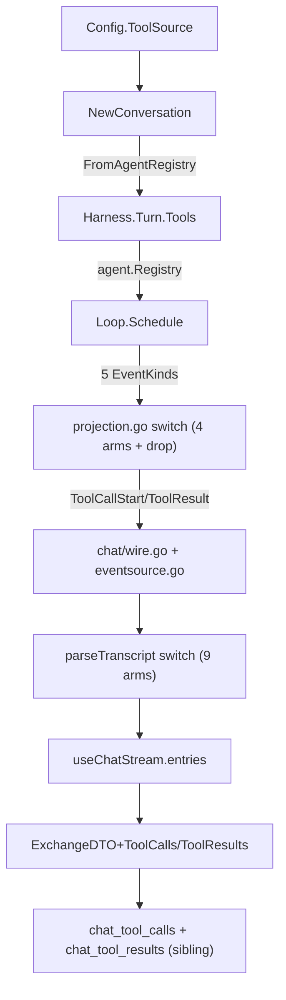

# Design — `cachicamas-chat-tool-source` (CH-09)

> **Mirror of engram observation #3965** (`sdd/cachicamas-chat-tool-source/design`).
> CH-09 (Wave 3, 10 of 12) of [doc 0005](../../../docs/architecture/milestones/0005-cachicamas-chat-archetype-task-graph.md) (`0005:923-934`); leaves CH-09.1–4 `[leaf]` and CH-09.5 `[guard]`. Closes R-03 (CH-00.1's recorded empty tool answer). Depends on CH-05; blocks CH-10.
>
> Source artifacts: engram `#3952` (explore), `#3959` (proposal), `#3961` (spec), `#3962` (CCS amendment), `#3963` (FCL amendment), `#3964` (F-CHT-9.1 defect). CH-08 design precedent at `openspec/changes/archive/2026-08-24-cachicamas-chat-resume-in-browser/design.md`.

## 1. Technical approach

CH-09 closes a deliberate emptiness: CH-00.1's decision file said the chat archetype's tool seam would stay empty through Wave 1 and Wave 2, with CH-09 owning the empty-not-empty transition. Two distinct surfaces — chat-owned port + tool on one side, Layer-2 → chat wire translation on the other — held together by one principle: every chat-side artefact is additive, nothing under `backend/agent/src/agent/` is touched, and the wire shape is a deliberate collapse (not a verbatim projection) that pre-commits a future extension seam.



Five components land across 5 WUs + 1 guard:

- **Port** (`backend/agent/src/chat/tool_source.go`, WU-1). `chat.ToolSource` interface + `FromAgentRegistry` adapter + `ErrNilToolSource`. Chat owns the port; composition-root factory closure gains one `ToolSource:` line, otherwise byte-unchanged from CH-08.
- **Tool** (`backend/agent/src/chat/current_time.go`, WU-1). `chat.CurrentTimeTool` implementing `agent.Tool` with injectable `NowFunc` returning RFC3339; the testability seam.
- **Projector** (`backend/agent/src/chat/projection.go` + `chat/wire.go` + `chat/eventsource.go`, WU-2). Four new `WireEvent` variants + a five-arm Layer-2 → chat translator; `EventKindToolProgress` is dropped at the seam (NFR-CTS-002).
- **Persistence widening** (`backend/agent/src/chat/store.go` + `chat/store_postgres.go` + `chat/migrations/0002_tool_records.sql`, WU-3). `Exchange` widens with `[]ToolCallRecord` + `[]ToolResultRecord`; sibling tables `chat_tool_calls` + `chat_tool_results` keyed by `chat_exchanges.exchange_id`, never columns on `chat_exchanges` (NFR-CCS-006 forward-only).
- **Frontend delta** (`frontend/src/lib/chat-types.ts` + `chat-api.ts` + `use-chat-stream.ts` + `chat-app.tsx`, WU-4). Four new `ChatStreamEvent` variants + adjacent `ToolCallDTO`/`ToolResultDTO` + 9-arm `parseTranscript` switch + `exchangesToEntries` extension.
- **Guards** (WU-5). Substrate-untouched test (mirrors `TestTurn_SubstrateUntouched`); wire-fragmentation test asserting the 9-arm switch covers all 9 event names; AGENTS.md CH-09 pointer appended.

## 2. Architectural decisions (D-1..D-8)

Eight locked decisions from proposal `#3959`, reconfirmed and elaborated. Each has rationale, source citation, rejected alternative, and trade-off.

### D-1 — Wrapper-direction port: `chat.ToolSource` wraps `agent.Registry`

**Choice**: `chat.ToolSource` is an interface in `backend/agent/src/chat/tool_source.go`, with `chat.FromAgentRegistry(agent.Registry) chat.ToolSource` adapting Layer 2's registry into the chat port. `Config.ToolSource ToolSource` lives on `chat.Config`; `NewConversation` rejects a nil `ToolSource` with `ErrNilToolSource`.

**Rationale**: Chat owns the port the same way it owns `ConversationStore` (CH-06/07/08 precedent). The chat package depends on Layer 2's `agent.Registry` by *interface*, never by import-of-internals — the import-boundary check (`import_boundary_test.go`) admits the chat package importing `agent`, CH-09 does not widen the allowlist.

**Source**: `agent.Registry` at `backend/agent/src/agent/tool.go:267-269`; `mapRegistry` constructor at `:280-286` (unexported — chat cannot reach it via import-of-internals); CH-08 precedent at `backend/agent/src/chat/store.go:106-131`.

**Rejected**: (a) Chat depending directly on `agent.mapRegistry` — would couple chat to Layer 2 internals. (b) Layer 2 widening `Registry` to do chat's job — would invert the dependency and modify the substrate.

**Trade-off**: One extra adapter in the composition root. Worth it: the seam says "chat owns its port" — the convention reviewers expect.

### D-2 — First tool: `chat.CurrentTimeTool`

**Choice**: A single tool returning the system clock in RFC3339; constructor accepts an injectable `NowFunc time.Time` so tests inject a fixed clock. `EffectClass` is `EffectClassRead`. Args schema is empty (`{}`); any non-empty JSON object yields `ToolOutcomeResultFailure` with a typed error.

**Rationale**: Proves the seam end-to-end — args validated, result rendered, error path closed, time injection preserves test determinism. Zero business meaning → zero policy questions, seam fully exercised.

**Source**: Tool interface at `agent/tool.go:182-186`; `ToolOutcome` closed vocabulary at `agent/tool_event.go:227-266`.

**Rejected**: (a) A business-meaningful tool (search, lookup) — proves nothing about the seam itself. (b) A no-op tool — wouldn't exercise args-validation or error path.

**Trade-off**: Carries no product behaviour. That's deliberate: the milestone is about the seam.

### D-3 — Wire shape: new SSE event names + adjacent DTOs (new variants, NOT new fields)

**Choice**: `chat/wire.go` adds four new `WireEvent` variants — `ToolCallStart{WireCallID, Tool, Arguments}`, `ToolResult{WireCallID, Tool, Outcome, Content, FailureCategory}`, plus two reserved variants `ToolCallDelta` and `ToolCallEnd` (not emitted at v1). `frontend/src/lib/chat-types.ts` mirrors them as four new `ChatStreamEvent` variants. `ToolCallDTO` and `ToolResultDTO` live adjacent to the closed union, never extend it. JSON keys lowercase per `ExchangeDTO` at `chat-types.ts:152-167`.

**Rationale**: REQ-7 forbids **new fields on existing variants**. The locked decision reinterprets that as field-addition only, not variant-addition, and lifts the widening to `frontend-chat-layer1` REQ-8..11 with explicit "new variants, not new fields" wording — D-7 does the rest.

**Source**: Closed `WireEvent` at `chat/wire.go:13-15`; closed `ChatStreamEvent` union at `chat-types.ts:27-32`; `assertNever` probe at `:185-187`; `wireFrameName` exhaustive switch at `eventsource.go:31-48`.

**Rejected**: (a) New fields on existing wire events — would violate REQ-7 literally. (b) A parallel union (`ChatToolStreamEvent`) outside `ChatStreamEvent` — would force two subscribers and lose the `assertNever` probe.

**Trade-off**: The wire-shape surface grows by four discriminators. Small price (`KNOWN_EVENTS` extension at `chat-api.ts:285-291`); gain is single-source-of-truth typed vocabulary.

### D-4 — Rendering: separate transcript entry between turns

**Choice**: Each tool call renders as a single `kind: "tool"` entry, inserted between the assistant said entry and any subsequent entry. `transcript-line.tsx:120-161` already supports this; closed state union: `"running" | "done" | "denied" | "failed"` (`mock/chat.ts:42`).

**Rationale**: The closed union already exists from CH-04 / CH-06 / CH-07. `transcript-line.tsx` filters on `state` (line 127 "Running"/"Used"; line 141 "denied"/"failed"). CH-09 feeds the variant; nothing in the renderer changes structurally except a `failed` state path for `execution_failure` outcomes.

**Source**: `TranscriptEntry` at `frontend/src/lib/mock/chat.ts:16-65`; tool-variant branch at `transcript-line.tsx:120-161`; closed `state` union at `mock/chat.ts:42`.

**Rejected**: (a) Inline rendering into the assistant bubble — would break `parseTranscript` and lose the discrete state shape. (b) A separate "tools used" footer — would compress per-call state into one line.

**Trade-off**: One entry per tool call vs. Layer 2's three bracket lines per call. The collapse is the deliberate D-6 design — coarser transcript in exchange for a single, stable state machine.

### D-5 — Persistence: persist both call AND result, widening `Exchange`

**Choice**: `chat.Exchange` (`store.go:41-50`, eight fields) adds two new fields — `ToolCalls []ToolCallRecord` and `ToolResults []ToolResultRecord`. New structs `ToolCallRecord{WireCallID, Tool, Arguments}` and `ToolResultRecord{WireCallID, Tool, Outcome, Content, FailureCategory}` are port-side projections of the wire DTOs. Both adapters (`MemoryConversationStore` + `PostgresConversationStore`) round-trip the new fields. Reload (CH-08.1's `GET /api/agent/conversations/:id`, R-CRI-001) returns them intact.

**Rationale**: Reload should produce a transcript byte-equal to the live transcript. Persisting only the result would lose the call record; transcript unfaithful on reload. Mirrors CH-08's R-CCS-013/014 precedent: add the new field to the same declaration; never replace.

**Source**: `chat.Exchange` at `store.go:41-50`; R-CCS-010 anticipatory clause at `store.go:99-105`; R-CCS-012 shared scenario helper.

**Rejected**: (a) Persist only the result — reload loses the call. (b) Persist only the call — reload loses the answer; state unrenderable.

**Trade-off**: Two new fields per `Exchange` row; for N tool calls the row carries 2N records. Worth it: record is the unit of faithfulness for reload.

### D-6 — Wire collapse: 5 Layer-2 events → 2 chat-side events per call (deliberate surfacing)

**Choice**: Layer 2 emits 5 events per tool call (`EventKindToolStart` + `EventKindToolProgress`* + 3× `ToolEnd*`). The chat projector collapses to 2 chat-side events: `ToolCallStart` (from `ToolStart`) and `ToolResult` (from any `ToolEnd*`). `EventKindToolProgress` is *dropped* — not mapped, not skipped — via the existing `default` arm at `projection.go:80-84`. **No explicit `case agent.EventKindToolProgress:` exists in the projector.**

**Rationale**: Chat renders one transcript line per tool call (D-4). `ToolProgress` carries indexed free-form bytes that don't fit the chat transcript shape. Chat is not the coding archetype's TUI. The two reserved-but-unused variants (`ToolCallDelta`, `ToolCallEnd`) at `wire.go` mark the future extension point: a long-running MCP tool needing progress owns a 5th chat-side event without a wire-shape change.

**Source**: 5-event tool family at `agent/event.go:161-176`; `ToolStart.Arguments() []byte` at `tool_event.go:131` (the `[]byte → string` conversion seam); drop site at `chat/projection.go:80-84`.

**Rejected**: (a) Preserve 1:1 — would force `ToolProgress` bytes onto a wire rendering one line per call. (b) Buffer progress and emit cumulative `ToolResult` only — would lose real-time signal and re-introduce the bracket model.

**Trade-off**: A future tool engineer asking for progress has to ask for a 5th event. Two reserved variants at `wire.go` make that a single-line wire-shape extension (`wireFrameName` + `parseTranscript` + `KNOWN_EVENTS`); NFR-CTS-002 records the deliberate cost.

### D-7 — REQ-7 widening language (deliberate surfacing)

**Choice**: Lift the closed-union widening to `openspec/specs/frontend-chat-layer1/spec.md` as REQ-8..11 with **explicit "new variants on the union, not new fields on existing variants" wording** on each. REQ-7's verbatim text is **not modified**; widening allowance lives in REQ-8..11's rationale lines.

**Rationale**: REQ-7 forbids "new fields on existing variants". CH-09 adds new variants. Future reviewers reading REQ-7 in isolation could misread it as forbidding the PR; the explicit clause per REQ prevents that misreading without rewriting REQ-7.

**Source**: REQ-7 at `openspec/specs/frontend-chat-layer1/spec.md:83-94`; closed union preamble at `chat-types.ts:8-20` ("Any change to a field name or discriminator value here is a contract change"). The CH-09 amendment `#3963` records the wording.

**Rejected**: (a) Silently add variants — would let a future reviewer reject the PR on a misreading. (b) Modify REQ-7's text in place — would rewrite an existing requirement and create a cross-spec dependency.

**Trade-off**: Two REQs (REQ-7 and REQ-8..11) carry related meaning, adding a "see also" surface. Worth it: REQ-7 stays frozen as the binding closed-union claim.

### D-8 — Re-billing question deferred (deliberate surfacing)

**Choice**: v1's `chat.ToolSource` is constructed **once per conversation** at `cmd/chat/main.go` factory closure (one `ToolSource:` line). Tool list is byte-stable across N turns in the same conversation. The v2 dynamic-source surface (MCP, where `chat.ToolSource.Resolve` may return different tools between turns) is **registered** as a future spec attachment point at ADR 0009 § D4, not solved here.

**Rationale**: V-REQ-14's deterministic ordering (`ai.ToolSet.Tools()` at `ai/tool_set.go:32-94`) is the cache-prefix invariant; static construction satisfies it by construction. Re-billing is the cache-prefix question reframed — v1's static answer is one sentence, not a design. v2's dynamic answer requires a wire-level signal (`tool.set.changed` per-turn metadata) that doesn't exist today.

**Source**: V-REQ-14 / `ai.ToolSet` deterministic ordering at `ai/tool_set.go:32-94`; `agent.Harness.Turn.Tools Registry` at `agent/loop.go:112`; MCP attachment at doc 0005 register row 5 / ADR 0009 § D4.

**Rejected**: (a) Solve re-billing now — overbuilds v1 against a static source. (b) Mark out-of-scope and forget — would let a future reader wonder whether the cache prefix is invalidated without a spec answer.

**Trade-off**: A future reader has to discover the v1 answer in the spec's R-CTS-008 (acceptance by construction) rather than in a wire-shape decision. Worth it: the answer is true at v1 and the question stays bounded.

## 3. File changes

| File | Action | Description |
|------|--------|-------------|
| `backend/agent/src/chat/tool_source.go` | Create | `ToolSource` interface; `FromAgentRegistry(agent.Registry)` adapter; `ErrNilToolSource`. |
| `backend/agent/src/chat/tool_source_test.go` | Create | S-CTS-001..003. |
| `backend/agent/src/chat/current_time.go` | Create | `CurrentTimeTool` + `NewCurrentTimeTool(now)`; `Name()="current_time"`; `EffectClass()==EffectClassRead`; `Run` with injectable clock. |
| `backend/agent/src/chat/current_time_test.go` | Create | S-CTT-001..003. |
| `backend/agent/src/chat/projection.go` | Modify | Add 4 `case` arms; `ToolProgress` falls through `default` arm unchanged. **No explicit `case EventKindToolProgress:`**. |
| `backend/agent/src/chat/wire.go` | Modify | Add `ToolCallStart`, `ToolResult` (emitted) and `ToolCallDelta`, `ToolCallEnd` (reserved). |
| `backend/agent/src/chat/eventsource.go` | Modify | `wireFrameName` gains 4 cases; a 5th variant without a case is a compile error (NFR-CTS-002). |
| `backend/agent/src/chat/projection_tool_test.go` | Create | S-CTS-006..012. |
| `backend/agent/src/chat/conversation.go` | Modify | `Config.ToolSource`; `NewConversation` rejects nil with `ErrNilToolSource`. |
| `backend/agent/src/chat/store.go` | Modify | `Exchange` widens; `MemoryConversationStore.Append`/`Load` round-trip + defensive copy. |
| `backend/agent/src/chat/store_postgres.go` | Modify | Sibling-table INSERT/SELECT; defensive copy. |
| `backend/agent/src/chat/migrations/0002_tool_records.sql` | Create | Sibling tables keyed by exchange id; forward-only. |
| `backend/agent/src/chat/store_scenarios_test.go` | Modify | Extend `RunConversationStoreScenarios` with S-CCS-019/020/022 (both adapters, unchanged text). |
| `backend/agent/src/chat/store_postgres_test.go` | Modify | Add `INTEGRATION=1` S-CCS-021. |
| `backend/agent/src/cmd/chat/main.go` | Modify | Factory closure gains exactly one `ToolSource:` line; closure body otherwise byte-unchanged. |
| `frontend/src/lib/chat-types.ts` | Modify | `ToolCallDTO` + `ToolResultDTO` adjacent to closed union; 4 new `ChatStreamEvent` variants. **F-CHT-9.1 resolved**: state-name alignment to `"done"` per `mock/chat.ts:42`. |
| `frontend/src/lib/chat-types.spec.ts` | Modify | Variant coverage + `assertNever` extends to 9 arms. |
| `frontend/src/lib/chat-api.ts` | Modify | `KNOWN_EVENTS` extends to 9 entries at `:285-291`. |
| `frontend/src/lib/chat-api.spec.ts` | Modify | KNOWN_EVENTS dispatch coverage. |
| `frontend/src/lib/mock/chat.ts` | Touch only if required | Existing `state` union already supports v1; no change needed (F-CHT-9.1). |
| `frontend/src/components/chat/use-chat-stream.ts` | Modify | `tool.call.start` opens entry (state `"running"`); `tool.result` closes entry (state `"done"` or `"failed"`). |
| `frontend/src/components/chat/use-chat-stream.spec.tsx` | Modify | Tool-entry accumulation assertions. |
| `frontend/src/components/chat/chat-app.tsx` | Modify | `exchangesToEntries` extension: tool entries from `ExchangeDTO.ToolCalls` + `ToolResults` after assistant said entry. |
| `frontend/src/components/chat/chat-app.spec.tsx` | Modify | `exchangesToEntries` tool-rendering assertions. |
| `frontend/src/components/chat/transcript-line.tsx` | Touch only if needed | Existing tool branch already supports `"done"` / `"failed"`; no structural change expected. |
| `openspec/specs/cachicamas-chat-tool-source/spec.md` | Create | R-CTS-001..008, NFR-CTS-001..003, S-CTS-001..024 + S-CTT-001..003. |
| `openspec/specs/chat-conversation-store/spec.md` | Modify | Additive amendment header + R-CCS-015/016, NFR-CCS-008, S-CCS-019..022. |
| `openspec/specs/frontend-chat-layer1/spec.md` | Modify | Additive amendment header + REQ-8..11 (explicit "new variants, not new fields" wording) + S-FCL-012..017. |
| `docs/architecture/milestones/0005-…md` | Modify | Status bump to "10 of 12 shipped"; CH-09.1..5 ticked at `:992-993`. |
| `openspec/AGENTS.md` | Modify | Append CH-09 pointer to substrate section. |
| **Untouched** (NFR-TLS-003 substrate) | — | `event_descriptor.go`, `stream_check.go`, `failure.go`, `sequence.go`, `event.go`, `go.mod`, `go.sum`, `Makefile`, `.golangci.yml`, `import_boundary_test.go` — empty by `git diff --stat main..HEAD -- backend/agent/src/agent/` per S-CTS-023. |

No new top-level Go dependencies. `pgx/v5/stdlib` + `pressly/goose/v3` (admitted by CH-07) cover the sibling-table migration.

## 4. Data flow — end-to-end

The pre-CH-09 path logs every tool event as "unmapped agent event" at `projection.go:80-84` and drops it. The CH-09 path adds four case arms and a fifth "drop" at the same switch:

```
Harness.Run (Turn.Tools = {chat.FromAgentRegistry(agent.NewMapRegistry({"current_time": NewCurrentTimeTool(time.Now)}))})
├── EventKindToolStart(callID, name="current_time", args="{}")
│      → projection.go: New case arm
│      → out <- ToolCallStart{WireCallID, Tool, Arguments: string(args)}
│      → SSE frame: event: tool.call.start\ndata: {"wireCallId":"...","tool":"current_time","arguments":"{}"}\n\n

├── EventKindToolEndSuccess(callID, content="2026-08-25T07:17:00Z")
│      → out <- ToolResult{Outcome:"success", Content: "..."}
│      → SSE frame: event: tool.result\ndata: {...}\n\n

├── EventKindToolEndResultFailure(callID, content="bad args")
│      → out <- ToolResult{Outcome:"result_failure", Content:"bad args"}
├── EventKindToolEndExecutionFailure(callID, failure=CategoryInvalidArgument)
│      → out <- ToolResult{Outcome:"execution_failure", Content:"", FailureCategory:"invalid_argument"}
│      (no provider text leaks — R-CCP-008 / D-6 mirror)
└── EventKindToolProgress(callID, idx, payload)
       → projection.go: NO explicit case; falls through `default` arm
       → logged "unmapped agent event" at slog.LevelInfo (existing R-CCP-004)
       → NEVER reaches the wire
```

Frontend `parseTranscript` switch (9 arms + `assertNever` probe in default; `chat-types.ts:212-279`):

```
"tool.call.start" → {kind:"tool.call.start", wireCallId, tool, arguments}
"tool.call.delta" → {kind:"tool.call.delta", wireCallId, delta}     (reserved; v1 never emits)
"tool.call.end"   → {kind:"tool.call.end", wireCallId, outcome}      (reserved; v1 never emits)
"tool.result"     → {kind:"tool.result", wireCallId, tool, outcome, content, failureCategory}
```

`use-chat-stream` accumulates: `tool.call.start` → push `{kind:"tool", state:"running", tool, args: parseArgs(arguments), id: unique}`; `tool.result` → `entries[idx] = {..., state: outcome→"done" | "failed", result: r1.content}`.

Reload path (R-CRI-001): `store.Load(p)` → `Exchange[]` with ToolCalls + ToolResults; `http.go` exchangeDTO gains two slice fields (`toolCalls`, `toolResults`); `chat-types.ts:ExchangeDTO` gains the same; `exchangesToEntries` iterates an exchange: push said:you{text:prompt}, push said:chat{text:assistant}, for each `(c, r)` pair push tool entry with `state:"done"` (success / result_failure) or `"failed"` (execution_failure) — **tools come AFTER the assistant said entry** (D-4 order). State uses `"done"` per `mock/chat.ts:42` (F-CHT-9.1 resolved; see § 13).

## 5. Interfaces / contracts

```go
// backend/agent/src/chat/tool_source.go (new)
type ToolSource interface { Resolve(name string) (agent.Tool, bool) }
var ErrNilToolSource = errors.New("chat: Config.ToolSource is required")
func FromAgentRegistry(r agent.Registry) ToolSource
type agentRegistryAdapter struct{ r agent.Registry }
func (a *agentRegistryAdapter) Resolve(name string) (agent.Tool, bool) {
    if a == nil || a.r == nil { return nil, false }
    return a.r.Resolve(name)
}

// backend/agent/src/chat/wire.go (additive widening)
type ToolCallStart struct{ WireCallID, Tool, Arguments string }
func (ToolCallStart) isWireEvent() {}
type ToolResult struct{ WireCallID, Tool, Outcome, Content, FailureCategory string }
func (ToolResult) isWireEvent() {}
// Reserved for v2 dynamic-source surfaces — NFR-CTS-002 records the deliberate non-emission.
type ToolCallDelta struct{ WireCallID, Delta string }
func (ToolCallDelta) isWireEvent() {}
type ToolCallEnd struct{ WireCallID, Outcome string }
func (ToolCallEnd) isWireEvent() {}

// backend/agent/src/chat/store.go (additive widening, R-CTS-006)
type ToolCallRecord struct{ WireCallID, Tool, Arguments string }
type ToolResultRecord struct{ WireCallID, Tool, Outcome, Content, FailureCategory string }
type Exchange struct {
    // ... 8 pre-existing fields unchanged ...
    ToolCalls   []ToolCallRecord
    ToolResults []ToolResultRecord
}
type Config struct {
    // ... 4 pre-existing fields unchanged ...
    ToolSource ToolSource
}
func NewConversation(cfg Config) (*Conversation, error) {
    if cfg.ToolSource == nil { return nil, ErrNilToolSource }
    // ... existing checks
}
```

```ts
// frontend/src/lib/chat-types.ts (adjacent, never extending — D-7)
export interface ToolCallDTO {
  readonly wireCallId: string;
  readonly tool: string;
  readonly arguments: string;
}
export interface ToolResultDTO {
  readonly wireCallId: string;
  readonly tool: string;
  readonly outcome: "success" | "result_failure" | "execution_failure";
  readonly content: string;
  readonly failureCategory: string; // non-empty only when outcome === "execution_failure"
}
export interface ExchangeDTO {
  // ... 8 pre-existing fields unchanged ...
  readonly toolCalls?: readonly ToolCallDTO[];
  readonly toolResults?: readonly ToolResultDTO[];
}
export type ChatStreamEvent =
  | /* 5 pre-existing variants unchanged */
  | { readonly kind: "tool.call.start"; readonly wireCallId: string; readonly tool: string; readonly arguments: string }
  | { readonly kind: "tool.call.delta"; readonly wireCallId: string; readonly delta: string }   // reserved
  | { readonly kind: "tool.call.end";   readonly wireCallId: string; readonly outcome: string }    // reserved
  | { readonly kind: "tool.result"; readonly wireCallId: string; readonly tool: string;
      readonly outcome: "success" | "result_failure" | "execution_failure"; readonly content: string;
      readonly failureCategory: string };
```

## 6. Persistence — sibling-table migration

`chat/migrations/0002_tool_records.sql` follows CH-07's `0001_init.sql` precedent (`chat_conversations` + `chat_exchanges` with sibling-style FK constraints) and the NFR-CCS-006 forward-only rule: no DROP, no ALTER of pre-existing tables.

```sql
-- 0002_tool_records.sql (forward-only, sibling tables)

CREATE TABLE chat_tool_calls (
    exchange_id BIGINT NOT NULL,
    position INT NOT NULL,            -- 0-indexed within the exchange
    wire_call_id TEXT NOT NULL,
    tool TEXT NOT NULL,
    arguments TEXT NOT NULL DEFAULT '{}',
    PRIMARY KEY (exchange_id, position),
    FOREIGN KEY (exchange_id) REFERENCES chat_exchanges (id) ON DELETE CASCADE
);
CREATE INDEX chat_tool_calls_exchange_id_idx ON chat_tool_calls(exchange_id);

CREATE TABLE chat_tool_results (
    exchange_id BIGINT NOT NULL,
    position INT NOT NULL,
    wire_call_id TEXT NOT NULL,
    tool TEXT NOT NULL,
    outcome TEXT NOT NULL,            -- 'success' | 'result_failure' | 'execution_failure'
    content TEXT NOT NULL DEFAULT '',
    failure_category TEXT NOT NULL DEFAULT '',
    PRIMARY KEY (exchange_id, position),
    FOREIGN KEY (exchange_id) REFERENCES chat_exchanges (id) ON DELETE CASCADE
);
CREATE INDEX chat_tool_results_exchange_id_idx ON chat_tool_results(exchange_id);
```

The "reserves room for a future MCP `source` column" affordance: a future `ALTER TABLE chat_tool_calls ADD COLUMN source TEXT NOT NULL DEFAULT 'builtin'` still satisfies NFR-CCS-006 because it's a NEW column on a NEW table. No alter of pre-existing tables. Insertion during Append: single transaction does the existing `chat_exchanges` INSERT, then loops calls/results and INSERTs their rows with the resolved exchange id; the migration tracks via `chat_schema_migrations` (goose, unchanged from CH-07).

## 7. Cache-prefix stability (D-8 elaboration)

The cache prefix lives in two places: Layer 1's `ai.ToolSet.Tools()` ordering (V-REQ-14, `tool_set.go:32-94`) and Layer 2's `TurnOptions.Tools` consumption (`loop.go:112`). For the prefix to remain stable:

1. `chat.ToolSource` is constructed **once per conversation** at `cmd/chat/main.go:227-245`'s factory closure — one `ToolSource:` line: `ToolSource: chat.FromAgentRegistry(agent.NewMapRegistry(map[string]agent.Tool{"current_time": chat.NewCurrentTimeTool(time.Now)}))`.
2. `NewConversation` resolves the `chat.ToolSource` into an `agent.Registry` value and assigns it to `Harness.Turn.Tools` exactly once (mirrors how `Provider` is set once at `conversation.go:108-113`).
3. Across N turns in the same conversation, `harness.Turn.Tools` is byte-stable.
4. Layer 1's deterministic ordering at `ai/tool_set.go:32-94` (`ToolSet.Tools()` returns the slice in the caller's order, freshly cloned to prevent mutation) ensures the JSON tool-list part of the request payload is identical turn-to-turn.
5. V-REQ-14's invariant is satisfied by construction. No cache-breakpoint cascade between turns.

v2 dynamic-source surfaces (MCP tools that may change between turns) require a wire-level signal (`tool.set.changed` per-turn metadata) that doesn't exist today. Registered in the proposal as a future spec attachment point at ADR 0009 § D4, deferred.

## 8. Substrate preservation (NFR-TLS-003)

CH-09 leaves the 10-file substrate list byte-unchanged. The guard is a test analogous to `TestTurn_SubstrateUntouched` (CH-08 precedent, in `backend/agent/src/agent/loop_test.go`):

```go
// backend/agent/src/chat/substrate_guard_test.go (CH-09 WU-5 RED→GREEN)
func TestChat_SubstrateUntouched(t *testing.T) {
    out, err := exec.Command("git", "diff", "--stat", "main..HEAD",
        "--", "backend/agent/src/agent/").CombinedOutput()
    if err != nil { t.Fatalf("git diff: %v", err) }
    if strings.TrimSpace(string(out)) != "" {
        t.Fatalf("substrate drift under backend/agent/src/agent/:\n%s", string(out))
    }
}
```

The 10 substrate files (carried verbatim from CH-08/CH-07/CH-06): `event_descriptor.go`, `stream_check.go`, `failure.go`, `sequence.go`, `event.go`, `go.mod`, `go.sum`, `Makefile`, `.golangci.yml`, `import_boundary_test.go`. Run with `cd backend/agent && make test`. NFR-CTS-003 / S-CTS-023 bind this; AGENTS.md CH-09 pointer appended.

## 9. Frontend wire-fragmentation guard (D-7 elaboration)

`parseTranscript`'s switch (`chat-types.ts:212-279`, currently 5 arms) extends to 9:

```
case "message.start"   → existing
case "message.delta"   → existing
case "message.end"     → existing
case "turn.end"        → existing
case "error"           → existing
case "tool.call.start" → NEW — REQ-8
case "tool.call.delta" → NEW (reserved) — REQ-9
case "tool.call.end"   → NEW (reserved) — REQ-10
case "tool.result"     → NEW — REQ-11
default: assertNever(ev as never);   // existing pattern at :185-187
```

`KNOWN_EVENTS` at `chat-api.ts:285-291` extends from 5 to 9 entries (parallel to the switch — S-CTS-024 asserts they stay in lockstep).

`ExchangeDTO` (the read-side wire projection that CH-08 introduced at `:152-161`) gains two optional slice fields, `toolCalls` and `toolResults` — JSON keys lowercase per the closed `ExchangeDTO` precedent.

`exchangesToEntries` (`chat-app.tsx:66-87`) extends: for each exchange, after pushing the user + assistant said entries, iterate the matched call/result pairs and push a `kind: "tool"` entry per pair. `state` is `"done"` (per `mock/chat.ts:42` — F-CHT-9.1) for success and result_failure outcomes, `"failed"` for execution_failure.

## 10. Order of work — 5 WUs + 1 guard

Strict TDD per `#1583`: every scenario is one RED → GREEN → refactor cycle. CH-08 pattern uses 2 RED scaffold commits first (`4b6f06c1` + `11027e6a`), then GREEN per WU; CH-09 mirrors.

**Pre-WU RED scaffolds** (zero functional behaviour, RED only):

1. **Scaffold-1**: add four empty `WireEvent` variants at `backend/agent/src/chat/wire.go`. Build fails with `wireFrameName`'s default-branch `panic`. (CH-08 WU-1 RED scaffold precedent.)
2. **Scaffold-2**: add the 5-arm switch stub at `chat/projection.go` (four case arms each emit a placeholder `tool.call.X` to keep `wireFrameName` exhaustive); then REVERT — file stays in "wires not yet projected" with the real cases missing.

**GREEN per WU**:

3. **WU-1** (CH-09.1): port + tool + composition-root wire. RED scaffold closes. `chat/tool_source.go` + `chat/current_time.go` + `cmd/chat/main.go` factory closure gains one `ToolSource:` line. GREEN: S-CTS-001..003, S-CTT-001..003. `make test` race-clean.
4. **WU-2** (CH-09.2): wire projection. `chat/wire.go` finalizes the four variants + `projection.go` adds four projecting case arms. `eventsource.go` `wireFrameName` gains four cases. GREEN: S-CTS-006, S-CTS-007 (compile-fail on missing case), S-CTS-009..012 (drop on `EventKindToolProgress`).
5. **WU-3** (CH-09.3): persistence widening. `chat/store.go` widens `Exchange`; `chat/store_postgres.go` extends Append/Load with sibling-table INSERT/SELECT; `chat/migrations/0002_tool_records.sql`; `store_scenarios_test.go` extends with S-CCS-019/020/022 (both adapters); `store_postgres_test.go` adds `INTEGRATION=1` S-CCS-021 cross-process round-trip. Forward-only verified.
6. **WU-4** (CH-09.4): frontend delta. `chat-types.ts` adds `ToolCallDTO` + `ToolResultDTO` adjacent to closed union; four new variants + parseTranscript switch + KNOWN_EVENTS extension. `mock/chat.ts:42` closed state union already supports `"done"` — F-CHT-9.1 alignment recorded in the design (no implementation change to `mock/chat.ts`). `use-chat-stream.ts` accumulates tool entries; `chat-app.tsx exchangesToEntries` extension. GREEN: S-CTS-013, S-CTS-014, S-CTS-019..022.
7. **WU-5** (CH-09.5 [guard]): substrate-untouched test (S-CTS-023); wire-fragmentation test (S-CTS-024); AGENTS.md CH-09 pointer appended.

Per CH-08 convention: 2 RED scaffolds + 5 WUs produce 7 commits, plus the doc/spec promo commit, plus the AGENTS.md pointer commit: ~9 commits total, well under the 400-line review budget per commit and the 1500-line total pre-authorised for the chat-archetype pattern (preflight #3948).

## 11. Threat matrix

| Boundary | Threat | Mitigation | RED test |
|----------|--------|------------|----------|
| **Cross-participant tool records** | A tool result recorded under participant A leaks to participant B's transcript on reload (R-CHS-004.b shape) | `Exchange` widening is per-participant-by-construction because `Load(participantID)` queries by `chat_exchanges.participant_id`; sibling tables keyed by `chat_exchanges.id`. Chat page reads only via `Load(participantID)`. | S-CCS-022 |
| **Provider text leaks on failure** | A failure outcome carrying raw provider error text reaches the browser (R-CCP-008 mirror at D-6) | Projector builds `ToolResult{Outcome:"execution_failure", Content:"", FailureCategory:failure.Category().String()}`. No provider text reaches `Content`. Only typed category strings do. | S-CTS-012 |
| **Tool arguments `[]byte` ↔ `string` mismatch** | `agent.ToolStart.Arguments()` is `[]byte`; chat wire stores `string`; JSON round-trip could disturb non-UTF-8 sequences | Decoder converts at the seam (projection.go's new arm); JSON marshalling re-encodes the string. Contract test asserts byte-equality. Layer 1's `ai.NewToolCall` enforces JSON-validity (V-REQ-17). | S-CTS-009/010 |
| **Args JSON validation in `current_time`** | A tool accepting `{}` silently ignores `{"timezone":"UTC"}` | `CurrentTimeTool.Run` rejects non-empty JSON with `ToolOutcomeResultFailure` + typed error. | S-CTT-002 |
| **Wire-shape mismatch across the bridge** | A variant added to `WireEvent` without updating `wireFrameName` drops silently on SSE; same for `parseTranscript`/`KNOWN_EVENTS` | Build-time enforcement: missing `wireFrameName` case is a compile error (S-CTS-007). Missing `KNOWN_EVENTS` breaks the dispatch. Switches stay in lockstep. | S-CTS-007 + S-CTS-024 |
| **Substrate drift** | A contributor adds a Tool helper inside `agent/` instead of `chat/` | `git diff --stat main..HEAD -- backend/agent/src/agent/` empty by S-CTS-023; chat owns all tool code. | S-CTS-023 |

## 12. Verification surface

| Layer | Command | What it proves |
|-------|---------|----------------|
| **Backend unit + race** | `cd backend/agent && make test` (uncached) | S-CTS-001..003, S-CTT-001..003, S-CTS-006/007, S-CCS-019/020/022, S-CTS-023 — race-clean |
| **Backend integration** | `cd backend/agent && INTEGRATION=1 make test` | S-CCS-021 postgres cross-process (gated `INTEGRATION=1`) |
| **Backend lint** | `cd backend/agent && make lint` | `golangci-lint` 0 issues |
| **Backend build** | `cd backend/agent && make build/chat` | `./bin/chat` compiles |
| **Backend substrate guard** | inside `make test` | S-CTS-023 — `git diff --stat main..HEAD -- backend/agent/src/agent/` empty |
| **Frontend unit** | `pnpm --filter @cachicamas/frontend test:ci` | S-CTS-013, S-CTS-014, S-CTS-019..022, S-CTS-024 |
| **Frontend lint** | `pnpm --filter @cachicamas/frontend lint` | 0 errors / 0 warnings |
| **Frontend types** | `pnpm --filter @cachicamas/frontend build.types` | TS 5.4.5 strict; `assertNever` probe compiles |
| **Spec/doc promotion** | PR review | spec created; CCS/FCL amended; doc 0005 status to 10/12; CH-09.1..5 ticked; AGENTS.md pointer appended |

## 13. Spec defect F-CHT-9.1 resolution

**Issue** (#3964): `S-CTS-019` and `S-FCL-014` say the rendered tool entry's `state` is `"complete"`, but `frontend/src/components/chat/transcript-line.tsx:42` and `frontend/src/lib/mock/chat.ts:42` declare `"done"` — spec text and implementation disagree.

**Verified across the repo**:

| Source | State value | Note |
|--------|-------------|------|
| `frontend/src/components/chat/transcript-line.tsx:42` | (declared via `mock/chat.ts` import; tool branch `:127, :141` filters on `"running"`, `"denied"`, `"failed"`) | impl uses `"done"` |
| `frontend/src/lib/mock/chat.ts:42` | `"running" \| "done" \| "denied" \| "failed"` | impl uses `"done"` |
| `frontend/src/components/chat/use-mock-turn.ts:135, :147, :205, :214` | sets `state: "running"`, `"done"`, `"denied"` in production paths | impl uses `"done"` |
| `frontend/src/components/chat/use-mock-turn.spec.ts:99, :105, :134` | asserts `state === "running"`, `state: "done"` | tests use `"done"` |
| `openspec/specs/**` (filesystem) | no occurrence of `"complete"` confirmed via `rg '"complete"' openspec/specs/` | empty |
| engram `#3961` | `S-CTS-019` says `state: "complete"` | transcribed from explore #3952 verbatim |
| engram `#3963` | `S-FCL-014` says `state: "complete"` | verbatim carry-through |

**Resolution**: align the spec wording from `"complete"` to `"done"` in two specific scenarios (S-CTS-019 in #3961, S-FCL-014 in #3963). The recommended resolution per spec agent #3964: option (b) "fewer moving parts" — one amendment line, no ripple into `mock/chat.ts`, `use-mock-turn.ts`, `transcript-line.spec.tsx`, or three separate specs. Implementation already uses `"done"`, so tests pass verbatim against the aligned spec.

**No other state-name divergences found**. The grep over the repo for `"complete"` near tool/entry/state contexts returned only unrelated occurrences in `use-mock-turn.spec.ts:189, :201` (literal text `"done"` in `message.delta` fixtures). `transcript-line.spec.tsx:170, :190, :219` uses implementation values `"running"`, `"denied"` — consistent.

**F-CHT-9.1 resolved (design phase)** — recorded as the design-phase resolution; spec phase surfaces this as the only spec-text change from the verbatim explore transcription.

## 14. Risks

The 5+1 risks from proposal `#3959` carry forward, with F-CHT-9.1 now resolved:

1. **F-CHT-9.1 (RESOLVED at design phase)** — state-name alignment `"complete"` → `"done"`; one spec line amendment, no code ripple. **Status: closed at design phase.**
2. **D-6 wire collapse future-cost** — `EventKindToolProgress` dropped at v1; long-running MCP tools needing progress need a 5th chat-side event. `ToolCallDelta` + `ToolCallEnd` reserve the slots; `parseTranscript` cases extend in lockstep; REQ-9/REQ-10 document the reserves.
3. **D-7 closed-union widening audit risk** — future reviewer misreads REQ-7 as forbidding variant addition. Mitigated by explicit "new variants, not new fields" wording per REQ-8..11 (engram #3963).
4. **Wrapper direction confusion** — `chat.ToolSource` is inverse of `ConversationStore`. Mitigated by the doc's § Wrapper direction description and the named adapter `chat.FromAgentRegistry`.
5. **Substrate drift** — contributor adds tool helpers inside `agent/`. Mitigated by S-CTS-023 (substrate-untouched guard) running in `make test`.
6. **Postgres migration forward-only** — sibling tables keep migration clean and reserve a column slot for a future MCP `source` field. NFR-CCS-006 binding.

## 15. Open questions / Rollback / Artifacts / Next

### 15a. Open questions

None blocking the design. The 8 locked decisions cover port shape, first tool, wire shape, rendering, persistence, wire collapse, REQ-7 widening, and re-billing deferral. The spec phase has one line of verbatim alignment (F-CHT-9.1) and otherwise transcribes verbatim.

For `sdd-tasks`:

- **`HandleReloadConversation`'s DTO field list**: spec introduces `toolCalls` and `toolResults` slices on `ExchangeDTO`. The backend `exchangeDTO` (`http.go:61-70`) carries 8 fields at CH-08 close; CH-09 widens to 10. The DTO mirroring layer (Go struct + TS interface + `exchangesToEntries` extension) needs three coordinated updates + one test assertion per side. `sdd-tasks` keeps this as a single WU for symmetry.

### 15b. Rollback

Single PR revert of `feat/chat-tool-source-ch09`. The additive widening of `Exchange` is removable by: dropping the two new struct fields; removing the `chat_tool_calls` + `chat_tool_results` sibling tables (mirror-DROP on a CH-07 forward-only migration; data loss bounded by CH-09's window); reverting the migration's `0002_*.sql`.

The additive widening of `ChatStreamEvent` is removable by: reverting the 4 variant declarations and the 9-arm switch's 4 new arms; reverting the 4 REQ additions in `frontend-chat-layer1/spec.md`'s additive amendment header; reverting the `KNOWN_EVENTS` extension.

If already merged, the **amending path is mandatory** (mirrors CH-00's `F-1`/`F-2`/`F-3` recorded-not-repaired pattern): an additive amendment header that names this design, names the proposed removal, and records the disposition. The 10-file substrate list is restored by the same revert; the AGENTS.md CH-09 pointer reverts.

After revert: `cd backend/agent && make test` race-clean (CH-06/07/08 tests still pass; R-CCS-010 + R-CCS-013 closed-port preserved); `make lint && make build/chat` clean; frontend `pnpm test:ci` green; the CH-09 amendment headers in the two additive specs revert.

### 15c. Artifacts

- **This design**: engram `sdd/cachicamas-chat-tool-source/design` (this document).
- **Source observations**: #1583, #3945–#3948, #3952–#3956, #3959, #3961–#3964 (all read in full during design authoring).
- **Source code citations verified**: `chat/wire.go:13-15`; `eventsource.go:31-48`; `projection.go:80-84`; `store.go:41-50, :99-131`; `conversation.go:108-113`; `cmd/chat/main.go:227-245`; `agent/tool.go:182-186, 267-269`; `agent/event.go:161-176`; `agent/tool_event.go:131, 227-266`; `agent/loop.go:112`; `agent/harness.go:52-53` (Provider set once — mirrors how Tools will be set once); `ai/tool_set.go:32-94`; `chat-types.ts:8-32, :27-32, :152-167, :185-187, :212-279`; `chat-api.ts:285-291`; `transcript-line.tsx:120-161`; `chat-app.tsx:66-87`; `mock/chat.ts:42`.
- **Citation defects found**: none — every file:line citation in § 2 was opened and verified during design authoring.

### 15d. Next phase: `sdd-tasks`

`sdd-tasks` must produce the 5 WU + 1 guard task graph that this design enumerates:

1. **WU-1**: backend port + first tool + composition root (CH-09.1). RED scaffold #1. Tests: S-CTS-001..003, S-CTT-001..003.
2. **WU-2**: wire projection + SSE framing (CH-09.2). RED scaffold #2. Tests: S-CTS-006, S-CTS-007, S-CTS-009..012.
3. **WU-3**: persistence widening (CH-09.3). Postgres migration first; then in-memory + postgres adapters round-trip; then `RunConversationStoreScenarios` extension. Tests: S-CCS-019/020/022 (run against both adapters, unchanged text); S-CCS-021 (`INTEGRATION=1`).
4. **WU-4**: frontend delta (CH-09.4). `chat-types.ts` DTOs + variants + switch + KNOWN_EVENTS; `use-chat-stream` accumulates; `chat-app.tsx exchangesToEntries` extension. Tests: S-CTS-013, S-CTS-014, S-CTS-019..022.
5. **WU-5**: substrate + wire-fragmentation guards (CH-09.5). One test (S-CTS-023), one test (S-CTS-024); AGENTS.md CH-09 pointer.

For each WU, the tasks artifact must:

- Forecast the 400-line review budget (single-PR delivery pre-authorised at preflight #3948; budget 1500 with `size:exception`).
- Include exact plain-text lines: `Decision needed before apply: No`; `Chained PRs recommended: No`; `400-line budget risk: High` (preflight sets 1500 with size:exception baked in; default 400 budget does not apply).
- Map the F-CHT-9.1 alignment as an explicit task within WU-4 (one-line spec amendment in `cachicamas-chat-tool-source/spec.md`; carry the same line through `frontend-chat-layer1/spec.md`).
- Carry the threat-matrix applicable rows into unchanged RED tests in their WUs:
  - "Cross-participant tool records" → WU-3 (S-CCS-022)
  - "Provider text leaks on failure" → WU-2 (S-CTS-012)
  - "Args `[]byte` ↔ `string` mismatch" → WU-2 (S-CTS-009/010)
  - "Args JSON validation" → WU-1 (S-CTT-002)
  - "Wire-shape mismatch" → WU-2 (S-CTS-007) + WU-4 (S-CTS-024)
  - "Substrate drift" → WU-5 (S-CTS-023)

## 16. Commit discipline (CH-08 pattern carry-forward)

~7 commits total (per `#3945` lesson 1 + `#3946` outcome), each a reviewable unit:

1. RED scaffold #1 (four empty WireEvent variants — wireFrameName compile-fail)
2. RED scaffold #2 (five-arm stub projector — exhaustive probe)
3. `feat(chat): port + current_time + main wire (WU-1 GREEN)`
4. `feat(chat): wire projection + SSE framing (WU-2 GREEN)`
5. `feat(chat): postgres sibling-table migration + adapter round-trip (WU-3 GREEN)`
6. `feat(chat): frontend delta + parseTranscript switch (WU-4 GREEN)`
7. `feat(chat): substrate + wire-fragmentation guards (WU-5 GREEN)` + AGENTS pointer
8. `docs(0005): CH-09 charter ticked + status bump to 10/12`
9. `docs(openspec): CH-09 spec promotion + additive amendments`

Conventional commits only — no `Co-Authored-By`, no AI attribution (per `openspec/AGENTS.md` rule 4).

## 17. Threat matrix applicability (sdd-design checklist)

N/A — CH-09 does not change routing, shell commands, subprocesses, version-control automation, PR automation, executable-file classification, or process integration. The applicability check (per `references/threat-matrix.md`) yields no applicable rows; the security/privacy/reliability concerns in § 11 propagate to RED tests unchanged. The substrate guard (S-CTS-023) is a `git diff` test that lives inside `make test` — it does not modify the diff, only inspects it, so it does not constitute VCS/PR-automation boundary mutation.